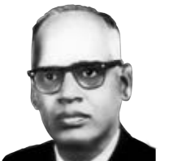

**G.N. Ramachandran**
 
Dr. G.N. Ramachandran received Master's Degree in Physics from Madras University. In 1954, he identifi ed and published the Triple helical structure of Collagen using X-ray diff raction. He pioneered the fi eld of protein structure validation through the study of available crystal structures of peptides. From his studies, in 1962, he developed the Ramachandran Plot which is used even today for stereochemical validation of protein structures.

**INTRODUCTION**

All living things are made up of many biomolecules such as carbohydrates, proteins, lipids and nucleic acids etc... The major elements present in the human body are carbon, hydrogen, oxygen, nitrogen and phosphorous, and they combine to form a variety of biomolecules. These biomolecules are used as fuel to provide the necessary energy for the various functions of living systems in addition to many other biological functions. The field of studying about the chemistry behind the biological processes is called ‘Biochemistry’. In this unit, we will learn about some essential informations of the biomolecules, their structure and their importance.

