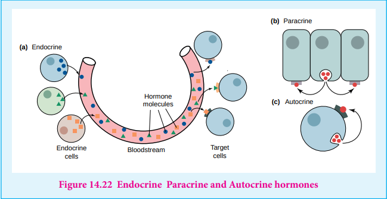
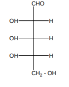

Hormone is an organic substance (e.g. a peptide or a steroid) that is secreted by one tissue. it limits the blood stream and induces a physiological response (e.g. growth and metabolism) in other tissues. It is an intercellular signalling molecule. Virtually every process in a complex organism is regulated by one or more hormones: maintenance of blood pressure, blood volume and electrolyte balance, embryogenesis, hunger, eating behaviour, digestion - to name but a few. Endocrine glands, which are special groups of cells, make hormones. The major endocrine glands are the pituitary, pineal, thymus, thyroid, adrenal glands, and pancreas. In addition, men produce hormones in their testes and women produce them in their ovary. Chemically, hormones may be classified as either protein (e.g. insulin, epinephrine) or steroids (e.g. estrogen, androgen).Hormones are classified according to the distance over which they act as, endocrine, paracrine and autocrine hormones

**Endocrine hormones** act on cells distant from the site of their release. Example: insulin and epinephrine are synthesized and released in the bloodstream by specialized ductless endocrine glands.

**Paracrine hormones** (alternatively, local mediators) act only on cells close to the cell that released them. For example, interleukin-1 (IL-1)

**Autocrine hormones** act on the same cell that released them. For example, protein growth factor interleukin-2 (IL-2).

Only those cells with a specific receptor for a given hormone will respond to its presence even though nearly all cells in the body may be exposed to the hormone. Hormonal messages are therefore quite specifically addressed.

**EVALUATION**

**Choose the correct answer:** 

1.Which one of the following rotates the plane polarized light towards left?

a) D(+) Glucose b) L(+) Glucose c)D(-) Fructose d) D(+) Galactose 

2.The correct corresponding order of names of four aldoses with configuration given below Respectively is,

a) L-Erythrose, L-Threose, L-Erythrose, D-Threose

b)D-Threose,D-Erythrose, L-Threose, L-Erythrose,

c)L-Erythrose, L-Threose, D-Erythrose, D-Threose

d) D-Erythrose, D-Threose, L-Erythrose, L-Threose 

3.Which one given below is a non-reducing sugar?

a)Glucose b)Sucrose c)maltose d)Lactose. 

4.Glucose (HCN) Product (hydrolysis) Product (HI + Heat) A, the compound A is

a)Heptanoic acid b)2-Iodohexane c)Heptane d)Heptanol 

5.Assertion: A solution of sucrose in water is dextrorotatory. But on hydrolysis in the
presence of little hydrochloric acid, it becomes levorotatory. (AIIMS)

Reason: Sucrose hydrolysis gives equal amounts of glucose and fructose. As a result of this change in sign of rotation is observed.

a)If both accretion and reason are true and reason is the correct explanation of assertion

b) If both assertion and reason are true but reason is not the correct explanation of assertion

c) If assertion is true but reason is false.

d) if both assertion and reason are false. 

6.The central dogma of molecular genetics states that the genetic information flows from

a) Amino acids Protein DNA

b) DNA Carbohydrates Proteins

c) DNA RNA Proteins

d) DNA RNA Carbohydrates 

7.In a protein, various amino acids linked together by

a) Peptide bond 

b) Dative bond

c) α - Glycosidic bond 

d) β - Glycosidic bond

8.Among the following the achiral amino acid is (AIIMS)

a) 2-ethylalanine 

b) 2-methylglycine

c) 2-hydroxymethylserine 

d) Tryptophan 

9.The correct statement regarding RNA and DNA respectively is

a) the sugar component in RNA is an arabinos and the sugar component in DNA is ribose

b) the sugar component in RNA is 2’-deoxyribose and the sugar component in DNA is arabinose

c) the sugar component in RNA is an arabinose and the sugar component in DNA is 2’-deoxyribose

d) the sugar component in RNA is ribose and the sugar component in DNA is 2’-deoxyribose

10.In aqueous solution of amino acids mostly exists in,

a) NH2-CH(R)-COOH 

b) NH2-CH(R)-COO-

c) H3N +-CH(R)-COOH 

d) H3N+-CH(R)-COO-

11.Which one of the following is not produced by body?

a) DNA b) Enzymes c) Harmones d) Vitamins 

12.The number of sp2 and sp3 hybridised carbon in fructose are respectively

a) 1 and 4 b) 4 and 2 c) 5 and 1 d) 1 and 5 

13.Vitamin B2 is also known as

a) Riboflavin b) Thiamine c) Nicotinamide d) Pyridoxine 

14.The pyrimidine bases present in DNA are

a) Cytosine and Adenine b) Cytosine and Guanine

c) Cytosine and Thiamine d) Cytosine and Uracil 

15.Among the following L-serine is

a) b) c) d)

16.The secondary structure of a protein refers to

a) fixed configuration of the polypeptide backbone

b) hydrophobic interaction

c) sequence of a-amino acids

d) a-helical backbone.

17.Which of the following vitamins is water soluble?

a) Vitamin E b) Vitamin K c) Vitamin A d) Vitamin B 

18.Complete hydrolysis of cellulose gives

a) L-Glucose b) D-Fructose c) D-Ribose d) D-Glucose 

19.Which of the following statement is not correct?

a) Ovalbumin is a simple food reserve in egg-white

b) Blood proteins thrombin and fibrinogen are involved in blood clotting

c) Denaturation makes protein more active

d) Insulin maintains the sugar level of in the human body. 

20.Glucose is an aldose. Which one of the following reactions is not expected with glucose?

a) It does not form oxime

b) It does not react with Grignard reagent

c) It does not form osazones

d) It does not reduce tollens reagent

21.If one strand of the DNA has the sequence ‘ATGCTTGA’, then the sequence of complementary strand would be

a) TACGAACT b) TCCGAACT c) TACGTACT d) TACGRAGT 

22.Insulin, a hormone chemically is

a) Fat b) Steroid c) Protein d) Carbohydrates 

23.a-D (+) Glucose and β-D (+) glucose are

a) Epimers b) Anomers

c) Enantiomers d) Conformational isomers 

24.Which of the following are epimers

a) D(+)-Glucose and D(+)-Galactose (b) D(+)-Glucose and D(+)-Mannose

c) Neither (a) nor (b) (d) Both (a) and (b) 

25.Which of the following amino acids are achiral?

a) Alanine b) Leucine c) Proline d) Glycine

**Short Answer Questions**

1.What type of linkages hold together monomers of DNA?

2.Give the differences between primary and secondary structure of proteins.

3.Name the Vitamins whose deficiency cause i) rickets ii) scurvy

4.Write the Zwitter ion structure of alanine

5.Give any three difference between DNA and RNA

6.Write a short note on peptide bond

7.Give two difference between Hormones and vitamins

8.Write a note on denaturation of proteins

9.What are reducing and non – reducing sugars?

10.Why carbohydrates are generally optically active.

11.Classify the following into monosaccharides, oligosaccharides and polysaccharides.

i) Starch ii) fructose iii) sucrose

iv) lactose iv) maltose

12.How are vitamins classified

13.What are harmones? Give examples

14.Write the structure of all possible dipeptides which can be obtained form glycine and alanine

15.Define enzymes

16.Write the structure of α-D (+) glucophyranose

17.What are different types of RNA which are found in cell

18.Write a note on formation of α-helix .

19.What are the functions of lipids in living organism.

20.Is the following sugar, D – sugar or L – sugar?

