**Formic acid**

It is used 

i)for the dehydration of hides.

ii)as a coagulating agent for rubber latex.

iii)in medicine for treatment of gout.

iv)as an antiseptic in the preservation of fruit juice. 

**Acetic acid**

It is used 

i)as table vinegar 

ii)for coagulating rubber latex 

iii) for manufacture of cellulose acetate and poly vinylacetate 

**Benzoic acid**

It is used 

i) as food preservative either in the pure form or in the form of sodium benzoate 

ii) in medicine as an urinary antiseptic 

iii) for manufacture of dyes 

**Acetyl Chloride**

It is used 

i) as acetylating agent in organic synthesis 

ii) in detection and estimation of – OH, - NH2 groups in organic compounds 

**Acetic anhydride**

It is used 

i) acetylating agent 

ii) in the preparation of medicine like asprin and phenacetin 

iii) for the manufacture plastics like cellulose acetate and poly vinyl acetate. 

**Ethyl acetate is used** 

i) in the preparation of artificial fruit essences. 

ii) as a solvent for lacquers. 

iii) in the preparation of organic synthetic reagent like ethyl acetoacetate.

**EVALUATION**

**Choose the correct answer:**

1.The correct structure of the product ‘A’ formed in the reaction
  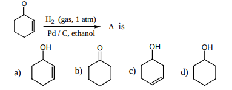

2.The formation of cyanohydrin from acetone is an example of

a) nucleophilic substitution

b) electrophilic substitution

c) electrophilic addition

d) Nucleophilic addition

3.Reaction of acetone with one of the following reagents involves nucleophilic addition followed by elimination of water. The reagent is

a) Grignard reagent 

b) Sn / HCl

c) hydrazine in presence of slightly acidic solution 

d) hydrocyanic acid

4.In the following reaction,
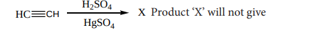

X Product ‘X’ will not give

a) Tollen’s test 

b) Victor meyer test

c) Iodoform test 
d) Fehling solution test

5.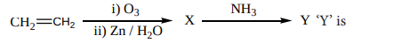

a) Formaldelyde 

b) di acetone ammonia

c) hexamethylene tetraamine 

d) oxime

6.Predict the product Z in the following series of reactions

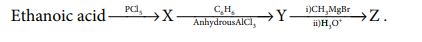

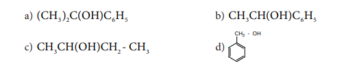

7.Assertion: 2,2 – dimethyl propanoic acid does not give HVZ reaction.

Reason: 2 – 2, dimethyl propanoic acid does not have α - hydrogen atom

a) if both assertion and reason are true and reason is the correct explanation of assertion.

b) if both assertion and reason are true but reason is not the correct explanation of assertion.

c) assertion is true but reason is false

d) both assertion and reason are false.

8.Which of the following represents the correct order of acidity in the given compounds

a)FCH COOH > CH COOH > BrCH COOH > ClCH COOH2 3 2 2

b)FCH COOH > ClCH COOH > BrCH COOH > CH COOH2 2 2 3

c) CH COOH > ClCH COOH > FCH COOH > Br-CH COOH3 2 2 2

d) Cl CH COOH > CH COOH > BrCH COOH > ICH COOH2 2 23

9.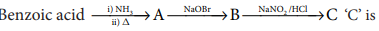

a) anilinium chloride 

b) O – nitro aniline 

c) benzene diazonium chloride 

d) m – nitro benzoic acid

10.Ethanoic acid  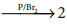  – bromoethanoic acid. This reaction is called

a) Finkelstein reaction 

b) Haloform reaction

c) Hell – Volhard – Zelinsky reaction 

d) none of these

11.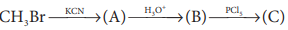 product (C) is

a) acetylchloride 

b) chloro acetic acid

c) α- chlorocyano ethanoic acid 

d) none of these

12.Which one of the following reduces tollens reagent 

a) formic acid 

b) acetic acid

c) benzophenone 

d) none of these

 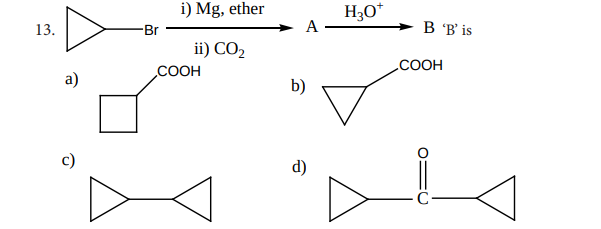

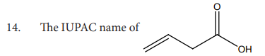

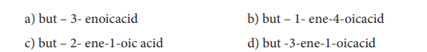

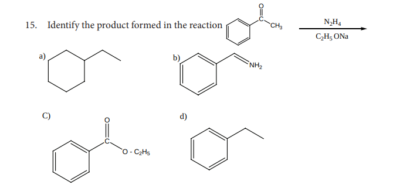

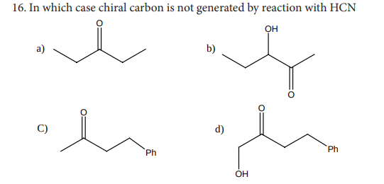

17.Assertion : p – N, N – dimethyl aminobenzaldehyde undergoes benzoin condensation Reason : The aldehydic (-CHO) group is meta directing a) if both assertion and reason are true and reason is the correct explanation of assertion. b) if both assertion and reason are true but reason is not the correct explanation of assertion. c) assertion is true but reason is false d) both assertion and reason are false.

18.Which one of the following reaction is an example of disproportionation reaction a) Aldol condensation b) cannizaro reaction c) Benzoin condensation d) none of these

19.Which one of the following undergoes reaction with 50% sodium hydroxide solution to give the corresponding alcohol and acid

a) Phenylmethanal b) ethanal c) ethanol d) methanol

20.The reagent used to distinguish between acetaldehyde and benzaldehyde is

a) Tollens reagent b) Fehling’s solution

c) 2,4 – dinitrophenyl hydrazine d) semicarbazide

21.Phenyl methanal is reacted with concentrated NaOH to give two products X and Y. X reacts with metallic sodium to liberate hydrogen X and Y are

a) sodiumbenzoate and phenol b) Sodium benzoate and phenyl methanol

c) phenyl methanol and sodium benzoate d) none of these

22.In which of the following reactions new carbon – carbon bond is not formed?

a) Aldol condensation b) Friedel craft reaction

c) Kolbe’s reaction d) Wolf kishner reduction

23.An alkene “A” on reaction with O3 and Zn - H O2 gives propanone and ethanol in equimolar ratio. Addition of HCl to alkene “A” gives “B” as the major product. The structure of product “B” is

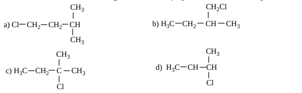

24.Carboxylic acids have higher boiling points than aldehydes, ketones and even alcohols of comparable molecular mass. It is due to their (NEET)

a) more extensive association of carboxylic acid via van der Waals force of attraction

b) formation of carboxylate ion

c) formation of intramolecular H-bonding

d) formation of intermolecular H – bonding

**Short Answer Questions**

1.How is propanoic acid is prepared starting from (a) an alcohol (b) an alkylhalide (c) an alkene

2.A Compound (A) with molecular formula C H N2 3 on acid hydrolysis gives(B) which reacts with thionylchloride to give compound(C). Benzene reacts with compound (C) in presence of anhydrous AlCl3 to give compound(D). Compound (D) on reduction with Zn/Hg and Conc.HCl gives (E). Identify (A), (B), (C), (D) and (E). Write the equations.

3.Identify X and Y.

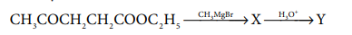

4.Identify A, B and C

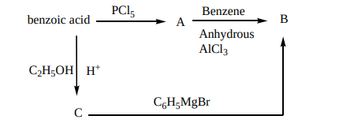

5.Identify A, B, C and D

6.An alkene (A) on ozonolysis gives propanone and aldehyde (B). When (B) is oxidised (C) is obtained. (C) is treated with Br2/P gives (D) which on hydrolysis gives (E). When propanone is treated with HCN followed by hydrolysis gives (E). Identify A, B, C, D and E.

7.How will you convert benzaldehyde into the following compounds?

(i) benzophenone (ii) benzoic acid

(iii)α-hydroxyphenylaceticacid.

8.What is the action of HCN on (i) propanone (ii) 2,4-dichlorobenzaldehyde. iii) ethanal

9.A carbonyl compound A having molecular formula C5H10O forms crystalline precipitate with sodium bisulphate and gives positive iodoform test. A does not reduce Fehling solution. Identify A.

10.Write the structure of the major product of the aldol condensation of benzaldehyde with acetone.

11.How are the following conversions effected 

(a) propanal into butanone (b) Hex-3-yne into hexan-3-one.

(c) phenylmethanal into benzoic acid (d) phenylmethanal into benzoin

12.Complete the following reaction.

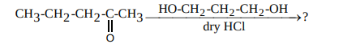

13.Identify A, B and C

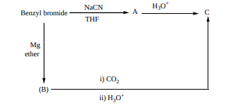

14.Oxidation of ketones involves carbon – carbon bond cleavage. Name the product (s) is are formed on oxidising 2,5 – dimethyhexan – 3- one using strong oxidising agent.

15.How will you prepare

i. Acetic anhydride from acetic acid

ii. Ethylacetate from methylacetate

iii. Acetamide from methylcyanide

iv. Lactic acid from ethanal

v. Acetophenone from acetylchloride

vi. Ethane from sodium acetate

vii. Benzoic acid from toluene

viii. Malachitegreen from benzaldehyde

ix. Cinnamic acid from benzaldehyde

x. Acetaldehyde from ethyne

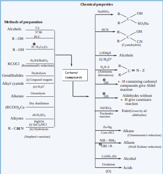
