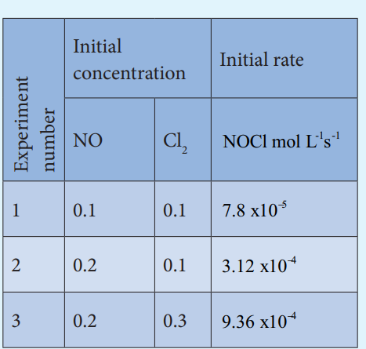

## Molecularity:
 Kinetic studies involve not only measurement of a rate of reaction but also proposal of a reasonable reaction mechanism. Each and every single step in a reaction mechanism is called an elementary reaction.

An elementary step is characterized by its molecularity. The total number of reactant species that are involved in an elementary step is called molecularity of that particular step. Let us recall the hydrolysis of t-butyl bromide studied in XI standard. Since the rate determining elementary step involves only t-butyl bromide, the reaction is called a Unimolecular Nucleophilic substitution (S)
1 
N  reaction.

Let us understand the elementary reactions by considering another reaction, the decomposition of hydrogen peroxide catalysed by I− .

2 H2 O2 (aq)→ H2 O2(g) 

It is experimentally found that the reaction is first order with respect to both

H2 O2 and I, which indicates that I− is also involved in the reaction. The mechanism involves the following steps.

**Step:1** H2O2(aq) + I- (aq)→ H2O(l) +OI-(aq)

**Step : 2** H2O2 (aq) + OI- (aq)→ H2 O(l)+ I- (aq) + O2(g)

Overall reaction is

2H2 O2(aq)→ 2H2O(l)+ O2(g) 

These two reactions are elementary reactions. Adding equ (1) and (2) gives the overall reaction. Step 1 is the rate determining step, since it involves both H2 O2 and I-
, the overall reaction is bimolecular.

**Differences between order and molecularity:**

<!-- | s.no |R ate of a reaction |R ate constant of a reaction |
|------|------|------|
| 2 |It is measured as decrease in the concentration of the reactants or increase in the concentration of products. |It is equal to the rate of reaction, when the concentration of each of the reactants is unity |
| 3 |It depends on the initial concentration of reactants. |It does not depend on the initial concentration of reactants. | -->

| s.no |Order of a reaction |Molecularity of a reaction |
|------|------|------|
| 1 |It is the sum ofthe powers ofconcentrationterms involved inthe experimentallydetermined ratelaw. |It is the total number of reactant species that are involved in an elementar y step. |
| 2 |It can be zero (or) fractional (or) integer |It is always a whole number, cannot be zero or a fractional number. |
| 3 |It is assigned for a overall reaction. |It is assigned for each elementar y step of mechanism. |
  

**Example 1**

Consider the oxidation of nitric oxide to form NO2

2NO(g) + O2(g)→ 2NO2(g)

(a). Express the rate of the reaction in terms of changes in the concentration of NO,O2 and NO2

(b). At a particular instant, when \[O2 \] is

decreasing at 0.2 mol L-1 s-1 at what rate is

\[NO2 \]increasing at that instant?

**Solution:**

a) Rate= - 1d\[NO\]/2
dt = \- d\[O2 \]/dt= 1d\[NO2 \]/2dt

b) -d\[O2 \]/dt= 1 d\[NO2 \]/2dt=d\[NO2 \]/dt=

2x{-d\[O2 \]/
dt} =2x 0.2mol L-1s-1 = 

0.4 mol L-1s-1

**Evaluate yourself 1**

1). Write the rate expression for the following reactions, assuming them as elementary reactions.

i) 3A + 5B2 →4CD 

ii) X2 + Y2→ 2XY

2). Consider the decomposition of N2O5(g) to form NO (g) 2 and O (g). At a particular instant N2O5disappears at a rate of 2.5 x 10-2mol dm-3 s-1. At what rates are NO2
and O2 formed? What is the

rate of the reaction?

**Example 2**

1\. What is the order with respect to each of the reactant and overall order of the following reactions?

(a).5Br-(aq)+ BrO3(aq)+ 6H+(aq) → 3Br2(l)+3H2O(l)

The experimental rate law is

Rate = k \[Br- \]\[ BrO3 \]\[ HBr+\]2

(b).the experimental rate law is

Rate = k\[ CH 3CHO\]3/2

**Solution:**

a) First order with respect to Br −, first

order with respect to BrO3
and second order with respect to H+ . Hence the overall order of the reaction is equal to 1 + 1 + 2 = 4

b) Order of the reaction with respect to acetaldehyde is
3/2 and overall order is
also 3/2

**Example 3**

2\. The rate of the reaction x + 2y product→ is 4 x10-3 mol L-1 s-1
, if \[x\]=\[y\]=0.2 M and rate constant at 400K is 2 x 10-2s-1, What is the overall order of the reaction.

**Solution :** Rate = k \[x\]n \[y\]m
4 x10-3 mol L-1s-1=2 x10-2s-1(0.2 mol L-1)n(0.2 mol L-1) m
4 x10-3 mol L-1s-1/
2 x10 -2s-1
=(0.2) mol Ln+m (mol L-1)n+m
0.2 ( mol L-1)= (0.2)n+m(mol L -1)n+m

Comparing the powers on both sides

The overall order of the reaction n + m = 1

**Evaluate yourself 2**

1). For a reaction, X + Y product  →product;
quadrupling \[x\] , increases the rate by a factor of 8. Quadrupling both \[x\] and \[y\],

increases the rate by a factor of 16. Find the order of the reaction with respect to x and y. what is the overall order of the reaction?

2). Find the individual and overall order of the following reaction using the given data.

2NO(g) + Cl2 (g)--->2NOCl(g)

