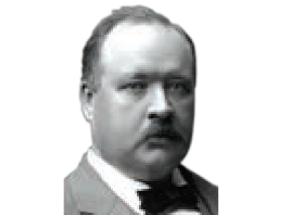

**CHEMICAL KINETICS**

**UNIT**

**7**
  

204

**Learning Objectives**

After studying this unit, the students will be able to

* define the rate and order of a reaction,

* derive the integrated rate equations for zero and fi rst order reactions,

* describe the half life period,

* describe the collision theory,

* discuss the temperature dependence of the rate of a reaction, and

* explain various factors which aff ect the rate of a reaction.

**Svante August Arrhenius (1859 –1927)**

Svante August Arrhenius was a Swedish scientist. Arrhenius was one of the founders of the science of physical chemistry. He focused his attention on the conductivities of electrolytes. He proposed that crystalline salts dissociate into paired charged ions when dissolved in water, for which he received the Nobel Prize for Chemistry in 1903. He also proposed defi nitions for acids and bases. He formulated the concept of activation energy.

XII U7 kinetics - Jerald Folder.indd 204 2/19/2020 4:43:29 PM

www.tntextbooks.in

  

205

**INTRODUCTION**

We have already learnt in XI standard that the feasibility of a chemical reaction under a given set of conditions can be predicted, using the principles of thermodynamics. However, thermodynamics does not provide an answer to a very important question of how fast a chemical reaction takes place. We know from our practical experience that all chemical reactions take some time for completion. Reaction speeds ranging from extremely fast (in femto seconds) to extremely slow (in years). For example, when the reactants BaCl2 solution and dilute H2SO4 are just mixed, a white precipitate of BaSO4 is immediately formed; on the other hand reactions such as rusting of Iron take many years to complete. The answers to the questions such as (i) how fast a chemical change can occur and (ii) What happens in a chemical reaction during the period between the initial stage and final stage are provided by the chemical kinetics. The word kinetics is derived from the Greek word “kinesis” meaning movement.

Chemical kinetics is the study of the rate and the mechanism of chemical reactions, proceeding under given conditions of temperature, pressure, concentration etc.

The study of chemical kinetics not only help us to determine the rate of a chemical reaction, but also useful in optimizing the process conditions of industrial manufacturing processes, organic and inorganic synthesis etc.

In this unit, we discuss the rate of a chemical reaction and the factors affecting it. We also discuss the theories of the reaction rate and temperature dependence of a chemical reaction.