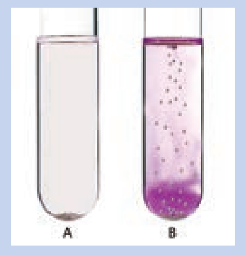
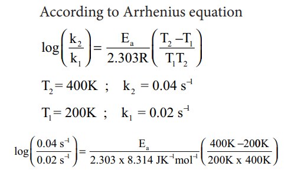

## Arrhenius equation – The effect of temperature on reaction rate
 Generally, the rate of a reaction increase with increasing temperature. However, there are very few exceptions. The magnitude of this increase in rate is different for different reactions. As a rough rule, for many reactions near room temperature, reaction rate tends to double when the temperature is increased by 10 C.

**Activity**

Let us understand the effect of temperature on reaction rate by doing this activity. i. Take two test tubes, label them as A and B

ii. Take 5 ml of cold water in A, add a drop of phenolphthalein indicator and then add Magnesium granules.

iii. Repeat the above with 5 ml of hot water in test tube B.

iv. Observe the two test tubes.

v. The observation shows that the solution in test tube B changes to pink colour and there is no such colour change in test tube A. That is, hot water reacts with magnesium according to the following reaction and there is no such reaction in cold water.

Mg + 2H2O→Mg2++ 2OH-+ H2↑

vi. The resultant solution is basic and it is indicated by phenolphthalein.

A large number of reactions are known which do not take place at room temperature but occur readily at higher temperatures. Example: Reaction between H2 and O2 to form H2takes place only when an electric spark is passed.

Arrhenius suggested that the rates of
most reactions vary with temperature in
such a way that the rate constant is directly proportional to e−E/RT and he proposed a relation between the rate constant and temperature.

k=Ae-(E/RT) ....(1)

Where A the frequency factor,

R the gas constant,

Ea the activation energy of the reaction and, T the absolute temperature (in K)

The frequency factor (A) is related to the frequency of collisions (number of collisions per second) between the reactant molecules. The factor A does not vary significantly with temperature and hence it may be taken as a constant.

Ea is the activation energy of the reaction, which Arrhenius considered as the minimum energy that a molecule must have to posses to react.

Taking logarithm on both side of the equation (1)

ln k= lnk A + In e-(E/RT)
ln k= In A -(E/RT)....(2)

y = c + m x

The above equation is of the form of a straight line y = mx + c.

A plot of ln k Vs 1/T

gives a straight

line with a negative slope − E0/R. If the rate constant for a reaction at two different temperatures is known, we can calculate the activation energy as follows.

At temperature T = T1; the rate constant

k = k1

ln k1=ln A-(E/RT) ....(3)

At temperature T = T2 ; the rate constant

k = k2

ln k2= ln A-(E/RT2)

(4) –(3)

ln k2 - ln k1=- (E/RT2)+(E/RT1)

ln (k2/k1)=E/R(1/T1-1/T2)

In k2- In K1=-(E/RT2)+(E/RT1)

This equation can be used to calculate Ea from rate constants k1 and k2 2 at temperatures T1 and T 2.

**Example 7**

The rate constant of a reaction at 400 and 200K are 0.04 and 0.02 s-1 respectively. Calculate the value of activation energy.

**Solution** According to Arrhenius equation

;

**Example 8**

Rate constant k of a reaction varies with temperature T according to the following Arrhenius equation

log k= log A-E/2.303R(1/T)

Where Ea is the activation energy.
When a graph is plotted for log k Vs 1/T
a straight line with a slope of -4000K
is obtained. Calculate the activation energy

**Solution**

log k =logA-E/2.303R(1/T)

y = c + mx

m =-E/2.303R

Ea=-2.303 R m

Ea=-2.303 x 8.314 J K-1 mol-1 x (-4000K)

Ea=76,589J mol-1
Ea=76.589 kJ mol-1

**Evaluate yourself**

For a first order reaction the rate constant at 500K is 8 X 10-4s-1. Calculate the frequency factor, if the energy of activation for the reaction is 190 kJ mol-1.

