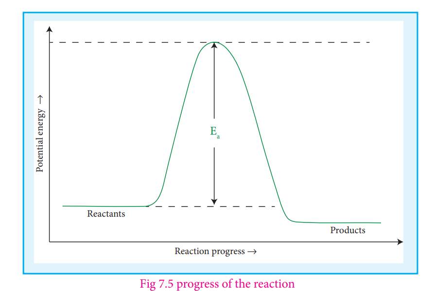
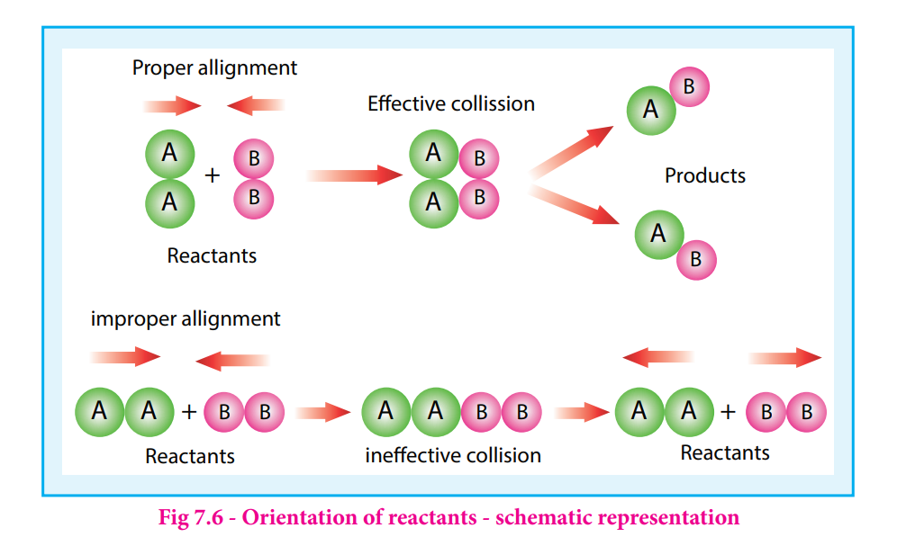

## Collision theory :
 Collision Theory was proposed

independently by Max Trautz in 1916 and William Lewis in 1918. This theory is based on the kinetic theory of gases. According to this theory, chemical reactions occur as a result of collisions between the reacting molecules. Let us understand this theory by considering the following reaction.

A2(g) + B2(g)→2AB(g)

  

If we consider that, the reaction between A2and B2 molecules proceeds through collisions between them, then the rate would be proportional to the number of collisions per second.

Rate ∝ number of molecules colliding per litre per second (collision rate)

The number of collisions is directly proportional to the concentration of both A2and B2 

Collision rate ∝ \[A 2\]\[B2\]

Collision rate = Z\[A2\]\[B2\] 
Where, Z is a constant.

The collision rate in gases can be calculated from kinetic theory of gases. For a gas at room temperature (298K) and 1 atm pressure, each molecule undergoes approximately 109
collisions per second, i.e., 1 collision in 10-9 second. Thus, if every collision resulted in reaction, the reaction would be complete in 10-9second. In actual practice this does not happen. It implies that all collisions

are not effective to lead to the reaction. In order to react, the colliding molecules must possess a minimum energy called activation energy. The molecules that collide with less energy than activation energy will remain intact and no reaction occurs.

Fraction of effective collisions (f) is given by the following expression

f=e-E/R

To understand the magnitude of collision factor (f), Let us calculate the collision factor (f) for a reaction having activation energy of 1100 kJ mol− at 300K.
f=e-(100 x 10 3J mol-1)/8.314JK-1mol-1 x 300K)

f=e-40 ~ 4 x10-18

Thus, out of 1018 collisions only four collisions are sufficiently energetic to convert reactants to products. This fraction of collisions is further reduced due to

Fig 7.5 progress of the reaction

orientation factor i.e., even if the reactant collide with sufficient energy, they will not react unless the orientation of the reactant molecules is suitable for the formation of the transition state.

The figure 7. 6 illustrates the importance of proper alignment of molecules which leads to reaction.

The fraction of effective collisions (f) having proper orientation is given by the steric factor p.

⇒ Rate = p x f x collision rate

i.e., Rate=p x e-Ea/RT x Z\[A2\]\[B2\] ...(1)

As per the rate law,

Rate = k \[A2\] \[B2\] ...(2)

Where k is the rate constant

On comparing equation (1) and (2), the rate constant k is ‘

k = p Z e-Ea/RT
