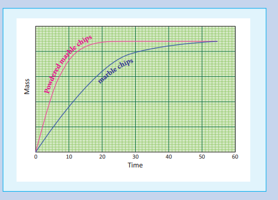
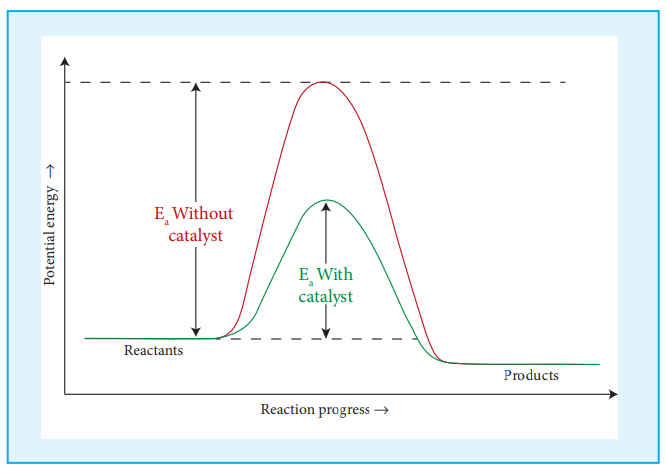
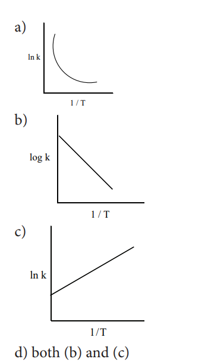
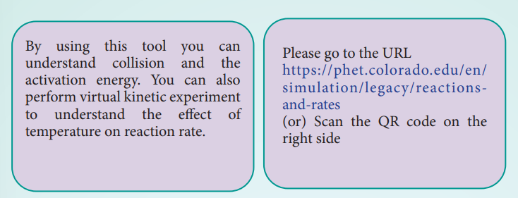
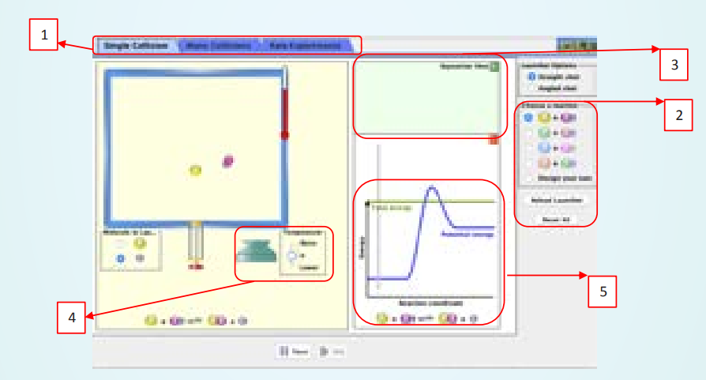

## Factors affecting the reaction rate:


The rate of a reaction is affected by the following factors.

1\. Nature and state of the reactant

2\. Concentration of the reactant

3\. Surface area of the reactant

4\. Temperature of the reaction

5\. Presence of a catalyst

### Nature and state of the reactant:


We know that a chemical reaction involves breaking of certain existing bonds of the reactant and forming new bonds which lead to the product. The net energy involved in this process is dependent on the nature of the reactant and hence the rates are different for different reactants.

Let us compare the following two reactions that you carried out in volumetric analysis.

1). Redox reaction between ferrous ammonium sulphate (FAS) and KMnO<sub>4</sub>
2). Redox reaction between oxalic acid and KMnO<sub>4</sub>


The oxidation of oxalate ion by KMnO<sub>4</sub> is relatively slow compared to the reaction between KMnO<sub>4</sub> and Fe<sup>2+</sup>. In fact heating is required for the reaction between KMnO<sub>4</sub> and Oxalate ion and is carried out at around 60 C.

The physical state of the reactant also plays an important role to influence the rate of reactions. Gas phase reactions are faster as compared to the reactions involving solid or liquid reactants. For example, reaction of sodium metal with iodine vapours is faster

than the reaction between solid sodium and solid iodine.

Let us consider another example that you carried out in inorganic qualitative analysis of lead salts. If you mix the aqueous solution of colorless potassium iodide with the colorless solution of lead nitrate, precipitation of yellow lead iodide take place instantaneously, whereas if you mix the solid lead nitrate with solid potassium iodide, yellow coloration will appear slowly.


### Concentration of the reactants:


The rate of a reaction increases with the increase in the concentration of the reactants. The effect of concentration is explained on the basis of collision theory of reaction rates. According to this theory, the rate of a reaction depends upon the number of collisions between the reacting molecules. Higher the concentration, greater is the possibility for collision and hence the rate.


**Activity**

1\. Take three conical fl asks and label them as A, B, and C.

2\. using a burette, add 10, 20 and 40 ml of 0.1M sodium thiosulphate solution to the fl ask A, B and C respectively. And then add 40, 30 and 10 ml of distilled water to the respective fl asks so that the volume of solution in each fl ask is 50ml.

3\. Add 10 ml of 1M HCl to the conical fl ask A. Start the stop watch when half of the HCl has been added. Shake the contents carefully and place it on the tile with a cross mark as shown in the fi gure. Observe the conical fl ask from top and stop the stops watch when the cross mark just becomes invisible. Note the time.

4\. Repeat the experiment with the contents on B and C. Record the observation.

| Flask |Volume of Na SO22 3 |Volume of water |Strength of Na SO22 3 |Time taken ( t) |
|------|------|------|------|------|
| A |10 |40 |0.02 |
| B |20 |30 |0.04 |
| C |40 |10 |0.08 |


### Effect of surface area of the reactant:


In heterogeneous reactions, the surface areas of the solid reactants play an important role in deciding the rate. For a given mass of a reactant, when the particle size decreases surface area increases. Increase in surface area of reactant leads to more collisions per litre per second, and hence the rate of reaction is increased.For example, powdered calcium carbonate reacts much faster with dilute HCl than with the same mass of CaCO<sub>3</sub> as marble.


**Activity**

A Known mass of marble chips are taken in a flask and a known volume of dilute HCl is added to the content, a stop clock is started when half the volume of HCl is added. The mass is noted at regular intervals until the reaction is complete. Same experiment is repeated with the same mass of powdered marble chips and the observations are recorded.

Reaction
>$\ce{CaCO3(s)+2HCl(aq) -> CaCL2(aq)+H2O(l)+CO2(g)}$

Since, carbon dioxide escapes during reaction, the mass of the flask gets lighter as the reaction proceeds. So, by measuring the flask, we can follow the rate of the reaction. A plot of loss in mass Vs time is drawn and it looks like the one as shown below.

For the powdered marble chips, the reaction is completed in less time. i.e., rate of a reaction increases when the surface area of a solid reactant is increased.



### Effect of presence of catalyst:


So far we have learnt, that rate of reaction can be increased to certain extent by increasing the concentration, temperature and surface area of the reactant. However significant changes in the reaction can be brought out by the addition of a substance called catalyst. A catalyst is substance which alters the rate of a reaction without itself undergoing any permanent chemical change. They may participate in the reaction, but again regenerated at the end of the reaction. In the presence of a catalyst, the energy of activation is lowered and hence, greater number of molecules can cross the energy barrier and change over to products, thereby increasing the rate of the reaction.




**Activity**

Take two test tubes and label them as A and B. Add 7 ml of 0.1N oxalic acid solution, 5 ml of 0.1N KMnO<sub>4</sub> solution and 5 ml of 2N dilute H<sub>2</sub>SO<sub>4</sub> in both the test tubes. 
The colour of the solution is pink in both the test tubes.

Now add few crystals of manganese sulphate to the content in test tube A. the pink colour fades up and disappears. In this case, MnSO<sub>4</sub>acts as a catalyst and increases the rate of oxidation of C<sub>4</sub>O by MnO<sub>4</sub>


**Chemical kinetics in pharmaceuticals**

Chemical kinetics has many applications in the field of pharmaceuticals. It is used to study the lifetimes and bioavailability of drugs within the body and this branch of study is called **pharmacokinetics** Doctors usually prescribe drugs to be taken at different times of the day. i.e.some drugs are to be taken twice a day, while others

are taken three times a day, or just once a day. Pharmacokinetic studies is used to determine the prescription (dosage and frequency). For example, Paracetamol is a well known anti-pyretic and analgesic that is prescribed in cases of fever and body pain. Pharmacokinetic studies showed that Paracetamol has a half-life of 2.5 hours within the body i.e.the plasma concentration of a drug is halved after 2.5 hrs. After 10 hours (4 half-lives)only 6.25 % of drug remains. Based on such studies the dosage and frequency will be decided. In case of paracetamol, it is usually prescribed to take once in 6 hours depending upon the conditions.


**Summary**

* Chemical kinetics is the study of the rate and the mechanism of chemical reactions, proceeding under given conditions of temperature, pressure, concentration etc.

* The change in the concentration of the species involved in a chemical reaction per unit time gives the rate of a reaction.

* The rate of the reaction, at a particular instant during the reaction is called the instantaneous rate. The shorter the time period, we choose, the closer we approach to the instantaneous rate,

* The rate represents the speed at which the reactants are converted into products at any instant.

* The rate constant is a proportionality constant and It is equal to the rate of reaction, when the concentration of each of the reactants is unity.

* Molecularity of a reaction is the total number of reactant species that are involved in an elementary step.

* The half life of a reaction is defined as the time required for the reactant concentration to reach one half its initial value. For a first order reaction, the half life is a constant i.e., it does not depend on the initial concentration.

* According to collision theory, chemical reactions occur as a result of collisions between the reacting molecules.
* Generally, the rate of a reaction increase with increasing temperature. However, there are very few exceptions. The magnitude of this increase in rate is different for different reactions. As a rough rule, for many reactions near room temperature, reaction rate tends to double when the temperature is increased by 10 C

* According to Arrhenius, activation energy of the reaction is the minimum energy that a molecule must have to posses to react.
* The rate of a reaction is affected by the following factors.

1\. Nature and state of the reactant

2\. Concentration of the reactant

3\. Surface area of the reactant

4\. Temperature of the reaction

5\. Presence of a catalyst

**EVALUATION**

1\. For a first order reaction A B → the rate constant is _x_ min−1 . If the initial concentration of A is 0.01M , the concentration of A after one hour is given by the expression.

a) 0.01 e<sup>-x</sup>
b) 1 x 10 <sup>-2</sup>(1-e<sup>-60x</sup>) 
c) (1 x 10<sup>-2</sup>) e<sup>-60x</sup>
d) none of these

2\. A zero order reaction X →Product , with an initial concentration 0.02M has a half life of 10 min. if one starts with concentration 0.04M, then the half life is

a) 10s b) 5 min c) 20 min

d) cannot be predicted using the given information

3\. Among the following graphs showing variation of rate constant with temperature (T) for a reaction, the one that exhibits Arrhenius behavior over the entire temperature range is



4\. For a first order reaction A → product with initial concentration x mol L<sub>-1</sub> , has a half life period of 2.5 hours . For the same reaction with initial concentration (x/2) mol L<sup>-1</sup> the half life is


a) (2.5 x2)hours

b) (2.5/2)hours

c) 2.5 hours 
d) Without knowing the rate constant,
t<sub>1/2</sub> cannot be determined from the given data

5\. For the reaction, 2NH<sub>2</sub>→N<sub>2</sub>+ 3H<sub>2</sub>
, if − d\[ NH<sub>3</sub>\]/dt= k<sub>1</sub>\[NH3 \],
d\[N<sub>2</sub>\]/dt= k<sub>2</sub>\[NH<sub>3</sub>\], 
then the relation between k<sub>1</sub>,k<sub>2</sub> and k<sub>3</sub>is

a) k<sub>1</sub>=k<sub>2</sub>= k<sub>3</sub>
b) k<sub>1</sub>= 3 k<sub>2</sub> = 2k<sub>3</sub> 
c) 1.5kk<sub>1</sub> = 3k<sub>2</sub> = kk<sub>3</sub>

d) 2kk<sub>1</sub> = kk<sub>2</sub>= 3k<sub>3</sub> 

6\. The decomposition of phosphine (PH3) on tungsten at low pressure is a first order reaction. It is because the (NEET)

a) rate is proportional to the surface coverage

b) rate is inversely proportional to the surface coverage

c) rate is independent of the surface coverage

d) rate of decomposition is slow

7\. For a reaction Rate = k acetone\[ \]3 2 then

unit of rate constant and rate of reaction respectively is

a) (mol L<sup>-1</sup> s<sup>-1</sup>),(mol<sup>-1/2</sup> s<sup>-1</sup>)

b)  (mol L<sup>-1/2</sup> s<sup>-1</sup>),(mol<sup>-1</sup> s<sup>-1</sup>)

c)  (mol<sup>1/2</sup> L<sup>1/2</sup> s<sup>-1</sup>),(mol L<sup>-1</sup> s<sup>-1</sup>)

d)  (mol L s<sup>-1</sup>),(mol<sup>1/2</sup>L<sup>1/2</sup>s)

8\. The addition of a catalyst during a chemical reaction alters which of the following quantities? (NEET)

a) Enthalpy b) Activation energy

c) Entropy d) Internal energy

9\. Consider the following statements :

(i) increase in concentration of the reactant increases the rate of a zero order reaction.

(ii) rate constant k is equal to collision frequency A if E = 0a

(iii) rate constant k is equal to collision frequency A if Ea=∞

(iv) a plot of ln k vs T( ) is a straight line.

(v) a plot of ln k vs 1/T is a straight

line with a positive slope.

Correct statements are

a) (ii) only b) (ii) and (iv)

c) (ii) and (v) d) (i), (ii) and (v)

10\. In a reversible reaction, the enthalpy change and the activation energy in the forward direction are respectively −x kJ mol<sup>-1</sup>and y kJ mol<sup>-1</sup>. Therefore , the energy of activation in the backward direction is

a) (y-x)kJ mol<sup>-1</sup>

b) (x+y)J mol<sup>-1</sup>

c) (x-y)kJ mol<sup>-1</sup>

d) (x+y) × 10<sup>-3</sup> J mol<sup>-1</sup>


11\. What is the activation energy for a reaction if its rate doubles when the temperature is raised from 200K to 400K? (R = 8.314 JK-1mol-1)

a) 234.65 kJ mol<sup>-1</sup>

b) 434.65 kJ mol<sup>-1</sup>

c) 2.305 kJ mol<sup>-1</sup>

d) 334.65 J mol<sup>-1</sup>

12\. ; This reaction follows first order kinetics. The rate constant at particular temperature is 2 303 10 2 1. hour× − − . The initial concentration of cyclopropane is 0.25 M. What will be the concentration of cyclopropane after 1806 minutes?

log 2 = 0.3010( ) a) 0.125M b) 0.215M

c) 0.25 2.303M× d) 0.05M

13\. For a first order reaction, the rate constant is 6.909 min-1.the time taken for 75% conversion in minutes is

a) 3/2 log2
b) 2/3 log2
c) 3/2log(3/4)
d) (2/3)log (4/3)

14\. In a first order reaction x _y_ → ; if k is the rate constant and the initial concentration of the reactant _x_ is 0.1M, then, the half life is

a) (log 2/k)
b) (0.693/(0.1) k)
c) (ln2/k)
d) none of these

15\. Predict the rate law of the following reaction based on the data given below

2A + B →C +3D

| Reaction number |[A](min) |[B](min) |Initial rate(M s )-1 |
|------|------|------|------|
| 1 |0.1 |0.1 |x |
| 2 |0.2 |0.1 |2x |
| 3 |0.1 |0.2 |4 x |
| 4 |0.2 |0.2 |8x |


a) rate k= \[A\]<sup>2</sup>\[B\]
b) rate k= \[A\]\[B\]<sup>2</sup>
c) rate k= \[A\]\[B\]

d) rate K=\[A\]<sup>1/2</sup>\[B\]<sup>3/2</sup>

16\. Assertion: rate of reaction doubles when

the concentration of the reactant is doubles if it is a first order reaction.

Reason: rate constant also doubles

a) Both assertion and reason are true and reason is the correct explanation of assertion.

b) Both assertion and reason are true but reason is not the correct explanation of assertion.

c) Assertion is true but reason is false.

d) Both assertion and reason are false.

17\. The rate constant of a reaction is 5.8 10 s2 1× − − . The order of the reaction is

a) First order b) zero order

c) Second order d) Third order


**Answer the following questions:**

1\. Define average rate and instantaneous rate.

2\. Define rate law and rate constant.

3\. Derive integrated rate law for a zero order reaction A →product.

4\. Define half life of a reaction. Show that for a first order reaction half life is independent of initial concentration.

5\. What is an elementary reaction? Give the differences between order and molecularity of a reaction.

6\. Explain the rate determining step with an example.

7\. Describe the graphical representation of first order reaction.

8\. Write the rate law for the following reactions.

(a) A reaction that is 3/2 order in x and zero order in y.

(b) A reaction that is second order in NO and first order in Br2.

9\. Explain the effect of catalyst on reaction rate with an example.

10\. The rate law for a reaction of A, B and C has been found to be rate=k\[A \]<sup>2</sup>\[B\]\[l\]<sup>3/2</sup>. How would the rate of reaction change when

(i) Concentration of \[L\] is quadrupled

(ii) Concentration of both \[A\] and \[B\] are doubled

(iii) Concentration of \[A\] is halved

(iv) Concentration of \[A\] is reduced to 1/3 and concentration of \[L\] is quadrupled.

11\. The rate of formation of a dimer in a second order reaction is 7.5 x10<sup>3</sup> mol L<sup>-1</sup> s<sup>-1</sup>at 0.05 mol L 1− monomer concentration. Calculate the rate constant.

12\. For a reaction x+y+z→products the rate law is given by rate k= \[x\]<sup>3/2</sup>\[y\]<sup>1/2</sup>what is the overall order of the reaction and what is the order of the reaction with respect to z.

13\. Explain briefly the collision theory of bimolecular reactions.

14\. Write Arrhenius equation and explains the terms involved.

15\. The decomposition of Cl<sub>2</sub>O<sub>7</sub> at 500K in the gas phase to Cl<sub>2</sub> and O<sub>2</sub> is a first order reaction. After 1 minute at 500K, the pressure of Cl2O7 falls from 0.08 to 0.04 atm. Calculate the rate constant in s<sup>-1</sup>.

16\. Give two exapmles for zero order reaction

17\. Explain pseudo first order reaction with an example.

18\. Identify the order for the following reactions

(i) Rusting of Iron

(ii) Radioactive disintegration of 92 238U

(iii) 2A+ 3B--> products ; rate= k\[A\]<sup>1/2</sup>\[B\]<sup>2</sup>

19\. A gas phase reaction has energy of

activation 200 kJ mol-1. If the frequency factor of the reaction is 1 6 1013 1. × −_s_ . Calculate the rate constant at 600 K.

_e_− −= ×( )40 09 183 8 10. .


20\. For the reaction 2_x y_\+ → L find the rate law from the following data.
| [x](M) |[y](M) |rate(M s<sup>-1</sup> )|
|------|------|------|
| 0.2 |0.02 |0.15 |
| 0.4 |0.02 |0.30 |
| 0.4 |0.08 |1.20 |

21\. How do concentrations of the reactant influence the rate of reaction?

22\. How do nature of the reactant influence rate of reaction.

23\. The rate constant for a first order reaction is 1.54 × 10-3 s-1. Calculate its half life time.

24\. The half life of the homogeneous gaseous reaction SO2Cl2 → SO2 + Cl2 which obeys first order kinetics is 8.0 minutes. How long will it take for the concentration of

SO2Cl2 to be reduced to 1% of the initial value?

25\. The time for half change in a first order decomposition of a substance A is 60 seconds. Calculate the rate constant. How much of A will be left after 180 seconds?

26\. A zero order reaction is 20% complete in 20 minutes. Calculate the value of the rate constant. In what time will the reaction be 80% complete?

27\. The activation energy of a reaction is 22.5 k Cal mol-1 and the value of rate constant at 40°C is 1.8 x 10<sup>-5</sup>s<sup>-1</sup>. Calculate the frequency factor, A.

28\. Benzene diazonium chloride in aqueous solution decomposes according to the equation C<sub>6</sub>H<sub>5</sub>N<sub>2</sub>Cl→C<sub>6</sub>H<sub>5</sub>Cl + N<sub>2</sub>.

Starting with an initial concentration of 10 1 g L− , the volume of N2 gas obtained at 50 °C at different intervals of time was found to be as under:


| t (min): |6 |12 |18 |24 |30 |∞ |
|------|------|------|------|------|------|------|
| Vol. of N(ml):2 |19.3 |32.6 |41.3 |46.5 |50.4 |58.3 |

Show that the above reaction follows the first order kinetics. What is the value of the rate constant?


29\. From the following data, show that the decomposition of hydrogen peroxide is a reaction of the first order:


| t (min) |0 |10 |20 |
|------|------|------|------|
| V (ml) |46.1 |29.8 |19.3 |

Where _t_ is the time in minutes and V is the volume of standard KMnO4 solution required for titrating the same volume of the reaction mixture.

30\. A first order reaction is 40% complete in 50 minutes. Calculate the value of the rate constant. In what time will the reaction be 80% complete?

```mermaid
    A[Chemical Kinetics] -->  B[Reaction Rate] -->C(Rate Law) 
    C -->G[Order]
    C -->H[Molecularity]
    C -->I[Rate constant] 
    I -->M[Collision theory]
    I -->P[Temperature dependance of rate]
    I -->Q[Zero order reaction]
    Q -->L[k=A0/A/t]
    I -->R[First order reaction]
    R -->S[K=2.303/t log A`/A]
    B -->D[Initial rate]
    B --> E[Average rate]
    B --> F[Instantaneous rate]
    B -->Y[Factors affecting reaction rate] 
    Y -->Z[Concentration]
    Y -->W[Temperature]
    Y -->T[Catalyst]
    Y -->V[Surface area]
```


**ICT Corner**
**CHEMICAL KINETICS**



**Steps**

• Open the Browser and type the URL given (or) Scan the QR Code. You can see a webpage which displays the java applet called reactions and rates. You can click it and you will get a window as shown in the figure. This applet contains three modules which can be selected by clicking the appropriate tab (box1).

• Select single collision tab (tab 1) to visualise collision between two molecules. You can visualise the progress of the reaction (box 5) by varying the temperature using the slider (box 2). You can visualise that the raise in temperature, will raise the energy of the system and allows the reactants to cross the energy barrier to form products. You can repeat this simulation with more molecules in the many collisions tab (box 1).

• You can also perform virtual kinetic experiment, using rate experiments mode. Choose the types reacting molecules and their stoichiometry using the options provided (box 2). The number of reactant and product molecules at a given time will be displayed in panel (box-3). You can see the effect of temperature on reaction rate by varying the temperature (box 4).




