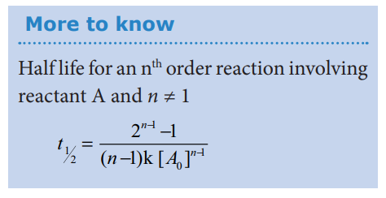

## Half life period of a reaction:
 The half life of a reaction is defined

as the time required for the reactant concentration to reach one half its initial value. For a first order reaction, the half life is a constant i.e., it does not depend on the initial concentration.

The rate constant for a first order reaction is given by

k = 2.303/t log\[ A0\]/\[ A\]

at t =t 1/2 ; \[A\]= \[A0\]/2

k= 2.303 log/t 
1/2\[A\]/\[A0\]/2
k=2.303/t1/2 log\[A\]/\[A0\]/2

k =2.303/t1/2log2

k= 2.303x0.3010/t1/2=0.6932/t1/2

Let us calculate the half life period for a zero order reaction.

Rate constant, k = \[ A0\] -\[A \]/t

at t= t1/2;  \[A\]=\[A0\]/2

k=\[A0\]-\[A0\]/2/t1/2

k=\[A0\]/2t1/2

t 1/2=\[A0\]/2k

Hence, in contrast to the half life of a first order reaction, the half life of a zero order reaction is directly proportional to the initial concentration of the reactant.

**More to know**

Half life for an nth order reaction involving reactant A and _n_ ≠ 1

**Example 4**

(i) A first order reaction takes 8 hours for 90% completion. Calculate the time required for 80% completion. (log 5 = 0.6989 ; log10 = 1)

**Solution:**

For a first order reaction,

k=2.303/t log(\[A0\]/\[A\])....(1)

Let \[A0\]=100M 

When t = t90%; \[A\]=10M (given that t90%=8hours)

t = t80%; \[A\]=20M
k=2.303/t80%log(100/20)
t80%=2.303/k log(5)-------(2);

Find the value of k using the given data

k=2.303/t90%log(100/10)
k=2.303/8 hours log(10)
k=2.303/8 hours (1)

Substitute the value of k in equation (2)

t80%= 2.303/2.303/8 hours log(5)

t80%=8hours x 0.6989
t80% =5.59 hours

**Example 5**

(ii) The half life of a first order reaction x → prosucts is 6.932 x 10 s at 500K.What percentage of x would be decomposed on heating at 500K for 100 min. (e0.06 = 1.06)

**Solution:**

Given t 1/2 = 0.6932 x104s

To solve : when t=100 min,

\[A0\]-\[A\]/\[A0\] x 100=?

We know that

For a first order reaction, t1/2=0.6932/k

k=0.6932/6.932 x 10
k = 10-5s-1

k = (1/t)ln(\[A0\]/
\[A\])

10 -5s-1=ln(\[A0\]/\[A\])

0.06=ln(\[A0\]/\[A\])

∴ \[A0\]-\[A\]/\[A0\] x 100%

(1-1/1.06)x 100%= 5.6 %

**Example 6**

Show that in case of first order reaction, the time required for 99.9% completion is nearly ten times the time required for half completion of the reaction.

Let \[A0\] =100;

when t = t99.9%; \[A\]=(100-99.9)=0.1
k=2.303/t log(\[A0\]/\[A\])
t99.9%= 10 t1/2

**Evaluate yourself:**

(1) In a first order reaction A → products 60% of the given sample of A decomposes in 40 min. what is the half life of the reaction?

(2) The rate constant for a first order reaction is 2.3x10 -4s-1 If the initial concentration of the reactant is 0.01M . What concentration will remain after 1 hour?

(3) Hydrolysis of an ester in an aqueous solution was studied by titrating the liberated carboxylic acid against sodium hydroxide solution. The concentrations of the ester at different time intervals are given below.

|Time (min)|0|30|60|90
|------|------|------|------|------|
|Ester concentration mol L-1 |0.85|0.80|0.754|0.71

Show that, the reaction follows first order kinetics.
