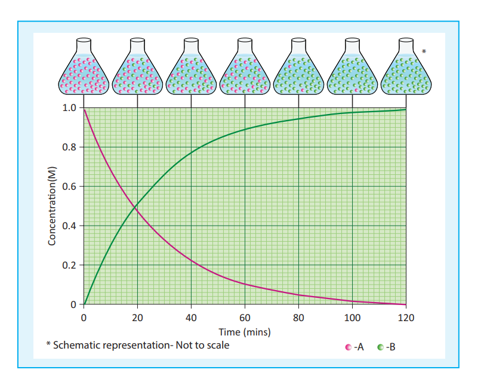
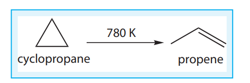
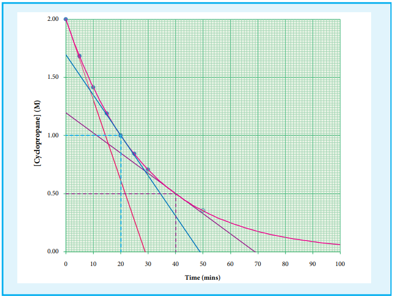

## Rate of a chemical reaction:
 A rate is a change in a particular

variable per unit time. You have already learnt in physics that change in the displacement of a particle per unit time gives its velocity. Similarly in a chemical reaction, the change in the concentration of the species involved in a chemical reaction per unit time gives the rate of a reaction.

Let us consider a simple general reaction

A → B
The concentration of the reactant

(\[A\]) can be measured at different time intervals. Let the concentration of A at two different times 2t and 2t , (t&#x2082;>t&#x2081;) be \[A&#x2081;\] and \[A&#x2082;\] respectively. The rate of the reaction can be expressed as

Rate=

– \[Change in the concentration of the reactants\] /(Change in time)

i.e., Rate -(\[A&#x2082;\]-\[A&#x2081;\])t&#x2082;-t&#x2081;= -( ∆\[A\]/ ∆t)

...(7.1)

During the reaction, the concentration of the reactant decreases i.e. \[A&#x2082; \] < \[A&#x2081; \] and hence the change in concentration \[A&#x2082; \]- \[A&#x2081; \] gives a negative value. By convention the reaction rate is a positive one and hence a negative sign is introduced in the rate expression (equation 7.1)

If the reaction is followed by measuring

the product concentration, the rate is given

by 
( ∆\[B\]/ ∆t)

since \[B&#x2082; \]>\[B&#x2081; \] , no minus sign

is required here.

**Unit of rate of a reaction:**

unit of rate = unit of concentration/unit of time

Usually, concentration is expressed in number of moles per litre and time is expressed in seconds and therefore the unit of the rate of a reaction is mol L s-1 -1 . Depending upon the nature of the reaction, minute, hour, year etc can also be used.

For a gas phase reaction, the concentration of the gaseous species is usually expressed in terms of their partial pressures and in such cases the unit of reaction rate is atm s-1 .

### Stoichiometry and rate of a reaction:

In a reaction A →B , the stoichiometry of both reactant and product are same, and hence the rate of disappearance of reactant (A) and the rate of appearance of product (B) are same.

Now, let us consider a different reaction

A→2B

In this case, for every mole of A, that disappears two moles of B appear, i.e., the rate of formation of B is twice as fast as the rate of disappearance of A. therefore, the rate of the reaction can be expressed as below

Rate = + d\[B\]/ dt

2(\-d\[A\]/dt)

In other words,

Rate = -d\[A\] dt=

1(d\[B\]) /2(dt)

For a general reaction, the rate of the reaction is equal to the rate of consumption of a reactant (or formation of a product) divided by its coefficient in the balanced equation

xA + yB  →lC +mD

Rate =- 1(d\[A\])/x (dt)= \- 1d\[B\]/ y dt=1 d\[C\]/ ldt = 1d\[D\]/ mdt

 <!-- add graph -->

**Fig 7.1 change in concentration of A and B for the reaction** A  →B

### Average and instantaneous rate:

Let us understand the average rate and instantaneous rate by considering the isomerisation of cyclopropane.

The kinetics of the above reaction is followed by measuring the concentration of cyclopropane at regular intervals and the observations are shown below. (Table 7.1)

**Table 7.1 Concentration of cyclopropane at various times during its isomerisation at 780K**

| Time  ( min) |[cyclopropane] ( mol L )-1 |
|------|------|
| 0 |2.00 |
| 5 |1.67 |
| 10 |1.40 |
| 15 |1.17 |
| 20 |0.98 |
| 25 |0.82 |
| 30 |0.69 |

Rate of the reaction= – ∆ \[cyclopropane\]/∆t

The rate over the entire 30 min = -(0.69-2)molL^-1/(30-0)min
= 1.31/30 = 4.36 x 10^-2 molL^-1min^-1 

It means that during the first 30 minutes of the reaction, the concentration of the reactant ( cyclo propane) decreases as an average of 4.36 x 10^-2 molL\(^{-1}\) per minute.

Let us calculate the average rate for an initial and later stage over a short period.

(Rate)initial stage = -(1.4-2)/(10-0) = 0.6/10 = 6 x 10^-2 mol L^-1 per minute

(Rate)later stage = -(0.69 - 0.98)/(30-20) = 0.29/10 = 2.9 x 10^-2 mol L^-1 per minute

From the above calculations, we come to know that the rate decreases with time as the reaction proceeds and the average rate cannot be used to predict the rate of the reaction at any instant. The rate of the reaction, at a particular instant during the reaction is called the instantaneous rate. The shorter the time period, we choose, the closer we approach to the instantaneous rate,

As ∆t -> 0; 
(-∆[cyclopropane])/(∆t) = -d\[cyclopropane\]/dt

A plot of \[cyclopropane\] Vs (time)

gives a curve as shown in the figure 7.2.

Instantaneous rate at a particular instant ‘t ’ -d \[cyclopropane\]/dt
is obtained by calculating

the slope of a tangent drawn to the curve at

that instant.

In general, the instantaneous reaction rate at a moment of mixing the reactants (t = 0) is calculated from the slope of the tangent drawn to the curve. The rate calculated by this method is called initial rate of a reaction.

Let us calculate the instantaneous rate of isomerisation cyclopropane at different concentrations: 2 M, 1M and 0.5 M from the graph shown in fig 7.2, the results obtained are tabulated below.

\[cyclopropane\] mol L-1 Rate mol L min-1 -1

2 6.92 × 10 –2

1 3.46 ×  –2

0.5 1.73 × 10  –2

**Table 7.2 Rate of isomerisation**
|[cyclopropane] ( mol L )-1 | Rate (mol L)-1(min)-1|
|------|------|
| 2 |6.92 x 10^-2 |
| 1 |3.46 x 10^-2 |
| 0.5 |1.73 x 10^-2 |

