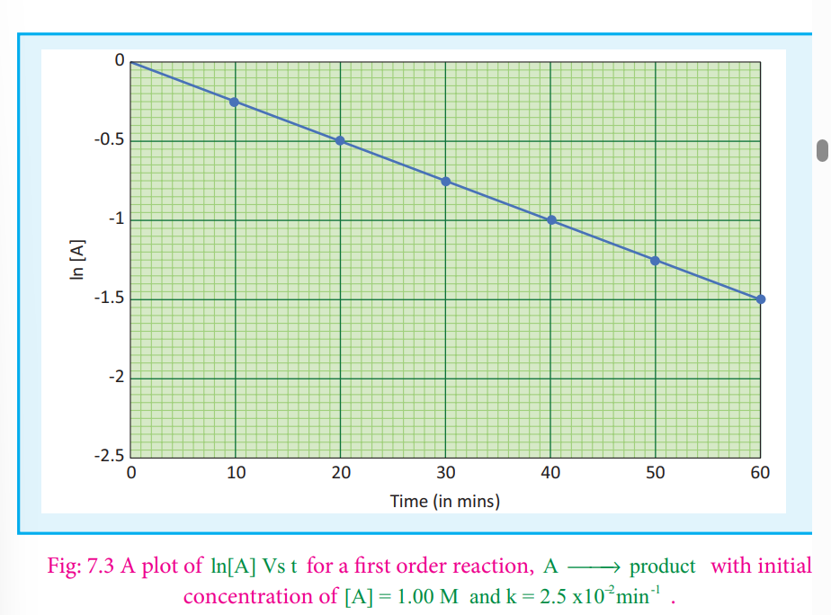
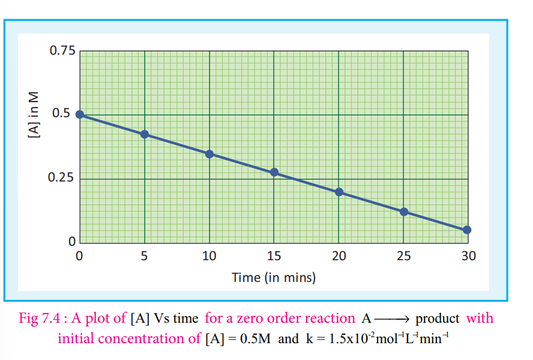

## The integrated rate equation:
 We have just learnt that the rate of change of concentration of the reactant is directly proportional to that of concentration of the reactant. For a general reaction,

A →products

The rate law is

Rate = -d\[A\]/dt=k \[A\]x
Where k is the rate constant, and x is the order of the reaction. The above equation is a differential equation, -d\[A\]/dt , so it gives the

rate at any instant. However, using the above expression, we cannot answer questions such as how long will it take for a specific concentration of A to be used up in the reaction? What will be the concentration of

reactant after a time ‘ t ’?. To answer such questions, we need the integrated form of the above rate law which contains time as a variable.

### Integrated rate law for a first order reaction

A reaction whose rate depends on the reactant concentration raised to the first power is called a first order reaction. Let us consider the following first order reaction,

A →prosuct
 Rate law can be expressed as

Rate = k \[A\]1

Where, k is the first order rate constant. -d\[A\]/dt=k\[A\]1
⇒ = -d\[A\]/\[A\]= k dt  ...(1)

Integrate the above equation between the limits of time t = 0 and time equal to t, while the concentration varies from the initial concentration \[A0 \] to \[A\] at the later time. 

 ∫\[A\] \[A0\] -d\[A0\]/\[A\]=k∫tdt 

ln(\[A0\]/\[A\]) = kt
...(2)

This equation is in natural logarithm. To convert it into usual logarithm with base 10, we have to multiply the term by 2.303.

2.303 log \[A0\]/\[A\] = kt

Equation (2) can be written in the form y = mx + c as below

⇒y = c + mx

If we follow the reaction by measuring the concentration of the reactants at regular time interval‘t’, a plot of ln\[A\] against ‘t’ yields a straight line with a negative slope.From this, the rate constant is calculated.

Examples for the first order reaction

(i) Decomposition of dinitrogen pentoxide

N2O5(g)---> 2NO 2(g) + 1/2 O2(g)
(ii) Decomposition of sulphurylchloride; SO2Cl2(l)---> SO2(g)+ Cl2(g)
(iii) Decomposition of the H2O2 in aqueous solution; H2O2(aq)---> H2O(l)+1/2 O2(g)

(iv) Isomerisation of cyclopropane to propene.

**Pseudo first order reaction:** Kinetic study of a higher order reaction is difficult to follow, for example, in a study of a second

order reaction involving two different reactants; the simultaneous measurement of change in the concentration of both the reactants is very difficult. To overcome such difficulties, A second order reaction can be altered to a first order reaction by taking one of the reactant in large excess, such reaction is called pseudo first order reaction. Let us consider the acid hydrolysis of an ester,

  >$\ce{CH3COOHCH3(aq)+H2O(l)->[{H+}] CH3COOH(aq)+CH3OH}$

Rate = k \[CH3COOCH3\] \[H2O\]

If the reaction is carried out with the large excess of water, there is no significant change in the concentration of water during hydrolysis. i.e.,concentration of water remains almost a constant.

Now, we can define k\[H2 O\] = k'; Therefore the above rate equation becomes

Rate = k'\[CH3COOCH3\]

Thus it follows first order kinetics.

### Integrated rate law for a zero order reaction:
 A reaction in which the rate is independent of the concentration of the reactant over a

wide range of concentrations is called as zero order reactions. Such reactions are rare. Let us consider the following hypothetical zero order reaction.

A →product

The rate law can be written as,

Rate = k \[A\]0

−d[A]/
dt

=k (1)

∴ =(\[A\]0=1)

⇒ − d\[A\] = k dt

Integrate the above equation between the limits of \[A \] 0 at zero time and \[A\] at some later

time 't',

− ∫d\[A\] = k ∫dt 

k=\[A0\]-\[A\]/t

Equation (2) is in the form of a straight line y = mx + c

Ie., \[A\]=\[A\]/t
⇒ y = c + mx

A plot of \[A\] Vs time gives a straight line with a slope of −k and y - intercept of \[A0 \].

**Examples for a zero order reaction:** 1\. Photochemical reaction between H2 and I2

 >$\ce{H2(g)+Cl2(g) ->[{hv}] 2HCL(g)}$

2\. Decomposition of N2O on hot platinum surface

N2O(g) ⇀↽N2(g)+1/2O2(g)

3\. Iodination of acetone in acid medium is

zero order with respect to iodine.
>$\ce{CH3COCH3+l2(g) ->[{h+}] ICH2COCH3+HI}$

Rate = k \[CH3COCH3\] \[H+\] 

General rate equation for a nth order reaction involving one reactant \[A\].

A →product

Rate law − =d\[A\]/dt=k\[A\]n

Consider the case in which n≠1,

integration of above equation between \[A0\] and \[A\] at time t = 0 and t = t

respectively gives 1/\[A\]n-1 - 1/\[A\]n-1 =(n-1)kt

