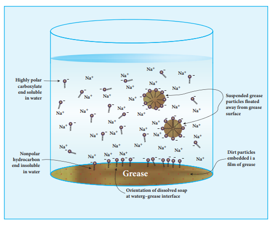

## Cleansing agents:
 Soaps and detergents are used as cleansing agents. Chemically soap is the sodium or

potassium salt of higher fatty acids. Detergent is sodium salt of alkyl hydrogen sulphates or alkyl benzene sulphonic acids. ### Soaps:

Soaps are made from animal fats or vegetable oils. They contain glyceryl esters of long chain fatty acids. When the glycerides are heated with a solution of sodium hydroxide they become soap and glycerol. We have already learnt this reaction under the preparation of glycerol by saponification. Common salt is added to the reaction mixture to decrease the solubility of soap and it helps to precipitate out from the aqueous solution. Soap is then mixed with desired colours, perfumes and chemicals of medicinal importance.

**Total fatty matter:** The quality of a soap is described in terms of total fatty matter (TFM value). It is defined

as the total amount of fatty matter that can be separated from a sample after splitting with mineral acids., Higher the TFM quantity in the soap better is its quality.

As per BIS standards, Grade-1 soaps should have 76% minimum TFM, while Grade-2 and 3 must have 70 and 60% , minimum respectively. The other quality parameters are lather, moisture content,mushiness, insoluble matter in alcohol etc..

**The cleansing action of soap:**

To understand how a soap works as a cleansing agent, let us consider sodium palmitate an example of a soap. The cleansing action of soap is directly related to the structure of carboxylate ions (palmitate ion) present in soap. The structure of palmitate exhibit dual polarity. The hydrocarbon portion is non polar and the carboxyl portion is polar.

The nonpolar portion is hydrophobic while the polar end is hydrophilic. The hydrophobic hydro carbon portion is soluble in oils and greases, but not in water. The hydrophilic carboxylate group is soluble in water. The dirt in the cloth is due to the presence of dust particles intact or grease which stick. When the soap is added to an oily or greasy part of the cloth, the hydrocarbon part of the soap dissolve in the grease, leaving the negatively charged carboxylate end exposed on the grease surface. At the

same time the negatively charged carboxylate groups are strongly attracted by water, thus leading to the formation of small droplets called micelles and grease is floated away from the solid object. When the water is rinsed away, the grease goes with it. As a result, the cloth gets free from dirt and the droplets are washed away with water. The micelles do not combine into large drops because their surfaces are all negatively charged and repel each other. The cleansing ability of a soap depends upon its tendency to act as a emulsifying agent between water and water insoluble greases.

### Detergents:

Synthetic detergents are formulated products containing either sodium salts of alkyl hydrogen sulphates or sodium salts of long chain alkyl benzene sulphonic acids. There are three types of detergents.

Detergents are superior to soaps as they can be used even in hard water and in acidic conditions. The cleansing action of detergents are similar to the cleansing action of soaps.
