## Polymers
 The term Polymer is derived from the Greek word ‘polumeres’ meaning “having many

parts”. The constitution of a polymer is described in terms of its structural units called monomers. Polymers consists of large number of monomer units derived from simple molecules. For example: PVC(Poly Vinyl Chloride). is a polymer which is obtained from the monomer vinyl chloride. Polymers can be classified based on the source of availability, structure, molecular forces and the mode of synthesis. The following chart explain different classification of polymers.

### Classification of Polymers:
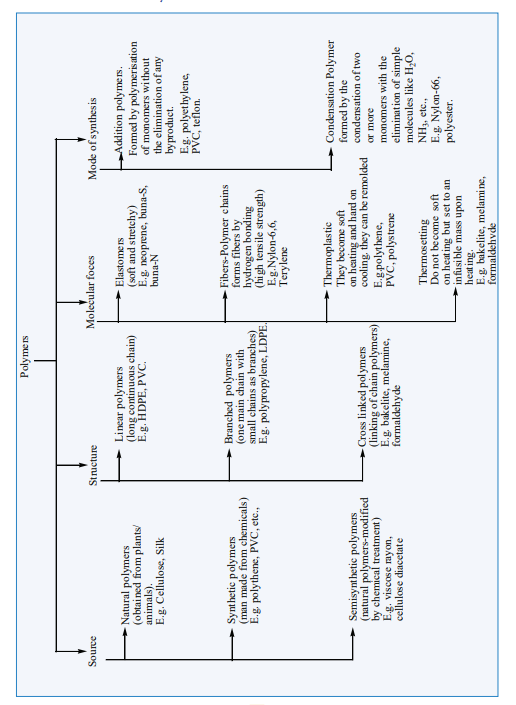

### Types of polymerisation

The process of forming a very large, high molecular mass polymer from small structural units i.e., monomer is called polymerisation. Polymerisation occurs in the following two ways

i. Addition polymerisation or chain growth polymerisation ii. Condensation polymerisation or step growth polymerisation

**Addition polymerisation** Many alkenes undergo polymerisation under suitable conditions. The chain growth

mechanism involves the addition of the reactive end of the growing chain across the double bond of the monomer. The addition polymerisation can follow any of the following three mechanisms depending upon the reactive intermediate involved in the process.

i. Free radical polymerisation ii. Cationic polymerisation iii. Anionic polymerisation

**Free radical polymerisation**

When alkenes are heated with free radical initiator such as benzyl peroxide, they undergo polymerisation reaction. For example styrene polymerises to polystyrene when it is heated to ionic with a peroxide initiator. The mechanism involves the following steps.

**1\. initiation – formation of free radical**
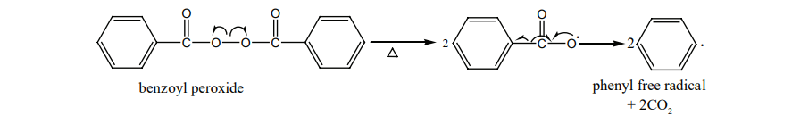

**2\. Propagation step**

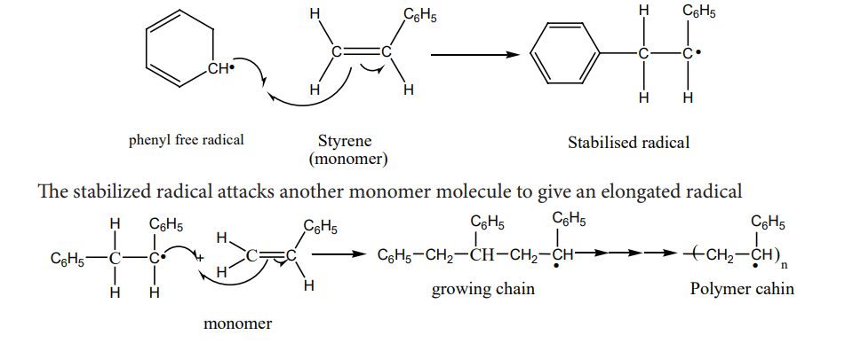

Chain growth will continue with the successive addition of several thousands of monomer units.

**Termination**

The above chain reaction can be stopped by stopping the supply of monomer or by coupling of two chains or reaction with an impurity such as oxygen.

### 3 Preparation of some important addition polymers

**1\. Polythene** It is an addition polymer of ethene. There are two types of polyethylene i) HDPE (High

Density Polyethylene) ii) LDPE (Low Density polyethylene).

**LDPE**

It is formed by heating ethene at 200 to 300 o C under oxygen as a catalyst. The reaction

follows free radical mechanism. The peroxides formed from oxygen acts as a free radical initiator.

It is used as insulation for cables, making toys etc…

**HDPE** The polymerization of ethylene is carried out at 373K and 6to7 atm pressure using Zeiglar

– Natta catalyst TiCl +(C H ) Al 4 2 5 3\[ \] HDPE has high density and melting point and it is used to

make bottles, pipe etc..,

**Preparation of Teflon (PTFE)**

The monomer is tetrafluroethylene. When the monomer is heated with oxygen (or) ammonium persulphate under high pressure, Teflon is obtained.

It is used for coating articles and preparing non – stick utensils.

**I. Preparation of Orlon (polyacrylonitrile – PAN)** It is prepared by the addition polymerisation of vinylcyanide (acrylonitrile) using a

peroxide initiator.

It is used as a substitute of wool for making blankets, sweaters etc…

**Condensation polymerisation** Condensation polymers are formed by the reaction between functional groups an adjacent

monomers with the elimination of simple molecules like H O, NH 2 3

etc…. Each monomer must undergo at least two substitution reactions to continue to grow the polymer chain i.e., the monomer must be at least bi functional. Examples : Nylon– 6,6, terylene….

**Nylon – 6,6** Nylon – 6,6 can be prepared by mixing equimolar adipic acid and hexamethylene – diamine

to form a nylon salt which on heating eliminate a water molecule to form amide bonds.
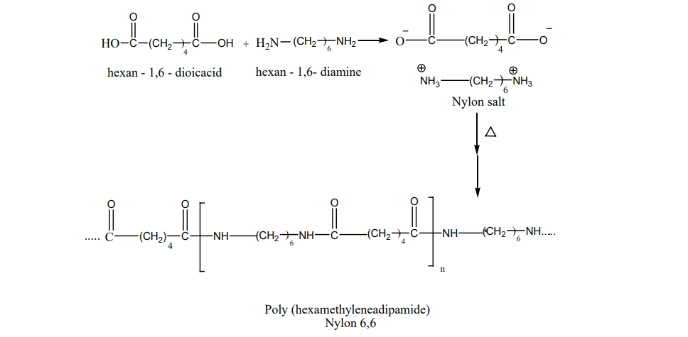

It is used in textiles, manufacture of cards etc…

**Nylon – 6** Capro lactam (monomer) on heating at 533K in an inert atmosphere with traces of water

gives Є-v amino carproic acid which polymerises to give nylon – 6
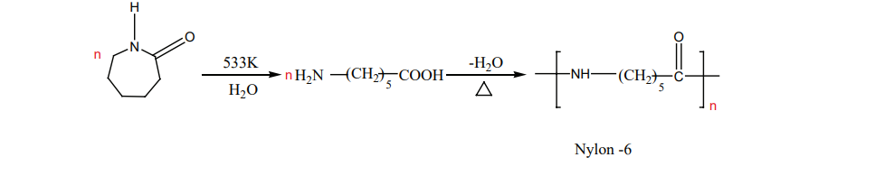
It is used in the manufacture of tyrecards fabrics etc….

**II. Preparation of terylene (Dacron)** The monomers are ethylene glycol and terepathalic acid (or) dimethylterephthalate. When

these monomers are mixed and heated at 500K in the presence of zinc acetate and antimony trioxide catalyst, terylene is formed.
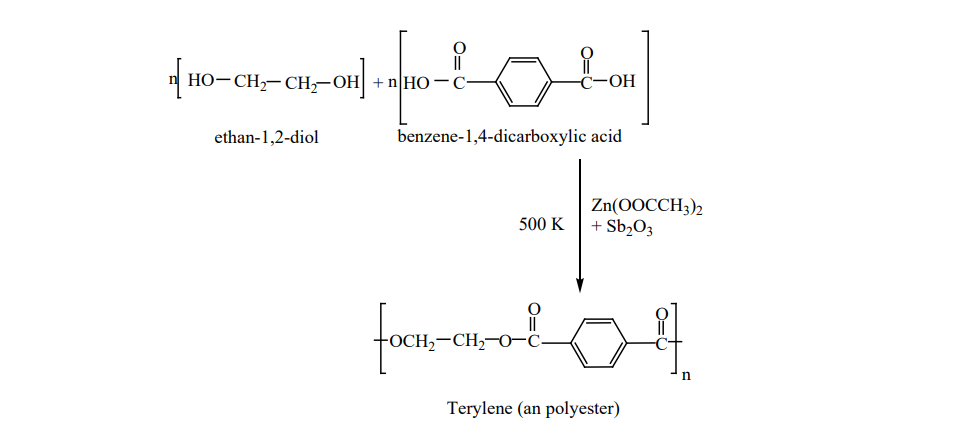
It is used in blending with cotton or wool fibres and as glass reinforcing materials in safety helmets. **Preparation of Bakelite**

The monomers are phenol and formaldehyde. The polymer is obtained by the condensation polymerization of these monomers in presence of either an acid or a base catalyst.

Phenol reacts with methanal to form ortho or para hydroxyl methylphenols which on further reaction with phenol gives linear polymer called novolac. Novalac on further heating with formaldehyde undergo cross linkages to form backelite.

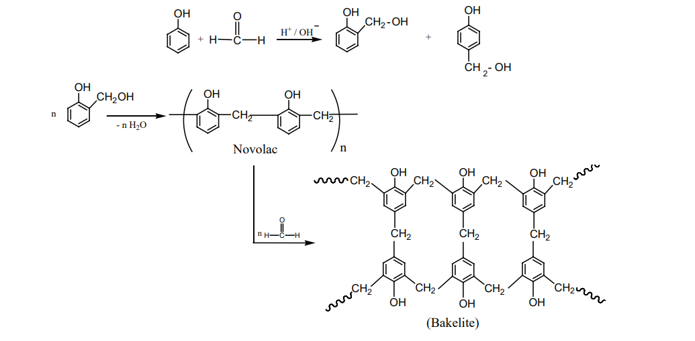

**Uses:** Navolac is used in paints. Soft backelites are used for making glue for binding laminated wooden planks and in varinishes, Hard backelites are used to prepare combs, pens etc..
**Melamine (Formaldehyde melamine):**

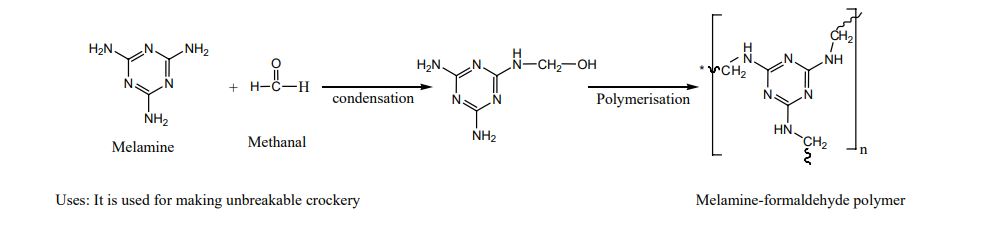

The monomers are melamine and formaldehyde. These monomers undergo condensation polymerisation to form melamine formaldehyde resin.

Melamine-formaldehyde polymerUses: It is used for making unbreakable crockery

**Urea formaldehyde polymer:**

It is formed by the condensation polymerisation of the monomers urea and formaldehyde.

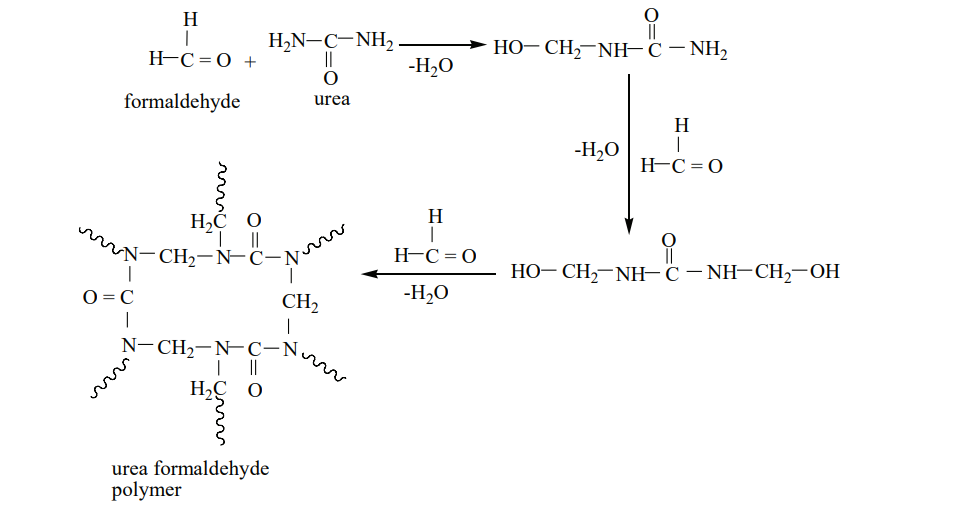

### Co-polymers:

A polymer containing two or more different kinds of monomer units is called a co- polymer. For example, SBR rubber(Buna-S) contains styrene and butadiene monomer units. Co-polymers have properties quite different from the homopolymers.

### Natural and Synthetic rubbers:

Rubber is a naturally occurring polymer. It is obtained from the latex that excludes from cuts in the bark of rubber tree (Ficus elastic). The monomer unit of natural rubber is cis isoprene (2-methyl buta-1,3-diene). Thousands of isoprene units are linearly linked together in natural rubber. Natural rubber is not so strong or elastic. The properties of natural rubber can be modified by the process called vulcanization.

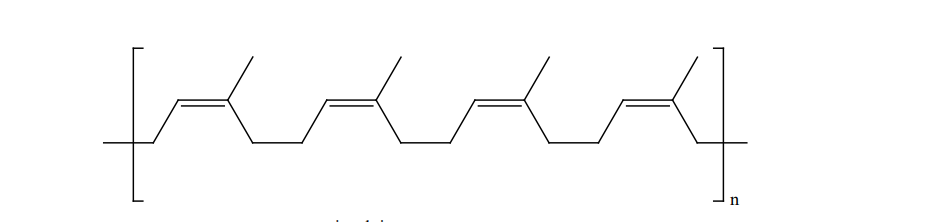

**Vulcanization: Cross linking of Rubber** In the year 1839, Charles Good year accidently dropped a mixture of natural rubber and

sulphur onto a hot stove. He was surprised to find that the rubber had become strong and elastic. This discovery led to the process that Good year called vulcanization.

Natural rubber is mixed with 3-5% sulphur and heated at 100-150˚C causes cross linking of the cis-1,4-polyisoprene chains through disulphide (-S-S-) bonds. The physical properties of rubber can be altered by controlling the amount of sulphur that is used for vulcanization. In sulphur rubber, made with about 1 to 3% sulphur is soft and stretchy. When 3 to 10% sulphur is used the resultant rubber is somewhat harder but flexible.

**Synthetic rubber:** Polymerisation of certain organic compounds such as buta-1,3-diene or its derivatives

gives rubber like polymer with desirable properties like stretching to a greater extent etc., such polymers are called synthetic rubbers.

**Preparation of Neoprene:** The free radical polymeristion of the monomer, 2-chloro buta-1,3-diene(chloroprene)

gives neoprene.

It is superior to rubber and resistant to chemical action. **Uses:** 
It is used in the manufacture of chemical containers, conveyer belts. 

**Preparation of Buna-N:**

I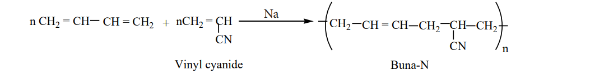

It is used in the manufacture of hoses and tanklinings. **Preparation of Buna-S:**

It is a co-polymer. It is obtained by the polymerisation of buta-1,3-diene and styrene in the ratio 3:1 in the presence of sodium.
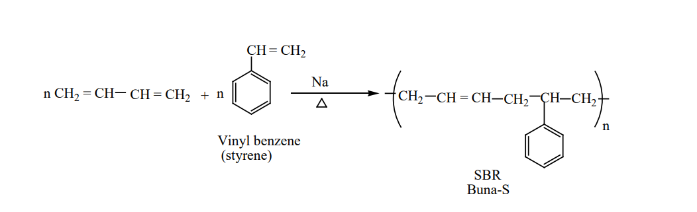

### Biodegradable Polymers

The materials that are readily decomposed by microorganisms in the environment are called biodegradable. Natural polymers degrade on their own after certain period of time but the synthetic polymers do not. It leads to serious environmental pollution. One of the solution to this problem is to produce biodegradable polymers which can be broken down by soil micro organism.

**Examples:**

Polyhydroxy butyrate (PHB)

Polyhydroxy butyrate-co-A- hydroxyl valerate (PHBV)

Polyglycolic acid (PGA), Polylactic acid (PLA)

Poly ( ∈ caprolactone) (PCL)

Biodegradable polymers are used in medical field such as surgical sutures, plasma substitute etc… these polymers are decomposed by enzyme action and are either metabolized or excreted from the body.

**Preparation of PHBV**

It is the co – polymer of the monomers 3 – hydroxybutanoic acid and 3-hydroxypentanoic acid. In PHBV, the monomer units are joined by ester linkages.

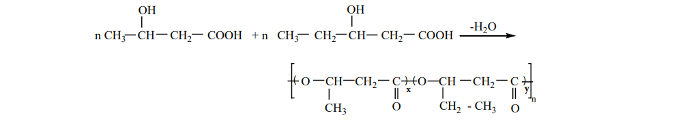

**Uses :** It is used in ortho paedic devices, and in controlled release of drugs.

**Nylon– 2-Nylon -6** It is a co – polymer which contains polyamide linkages. It is obtained by the condensation

polymersiation of the monomers, glycine and É - amino caproic acid.
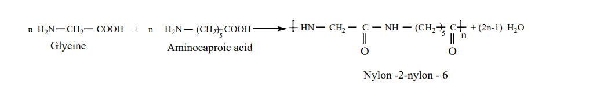

**EVALUATION**

**Choose the correct answer:**

1\. Which of the following is an analgesic?

a) Streptomycin b) Chloromycetin c) Asprin d) Penicillin

2\. Antiseptics and disinfectants either kill or prevent growth of microorganisms. Identify which of the following statement is not true.

a) dilute solutions of boric acid and hydrogen peroxide are strong antiseptics.

b) Disinfectants harm the living tissues.

c) A 0.2% solution of phenol is an antiseptic while 1% solution acts as a disinfectant.

d) Chlorine and iodine are used as strong disinfectants.

3\. Drugs that bind to the receptor site and inhibit its natural function are called

a) antagonists b) agonists c) enzymes d) molecular targets

4\. Aspirin is a/an

a) acetylsalicylic acid b) benzoyl salicylic acid c) chlorobenzoic acid d) anthranilic acid

5\. Which one of the following structures represents nylon 6,6 polymer?

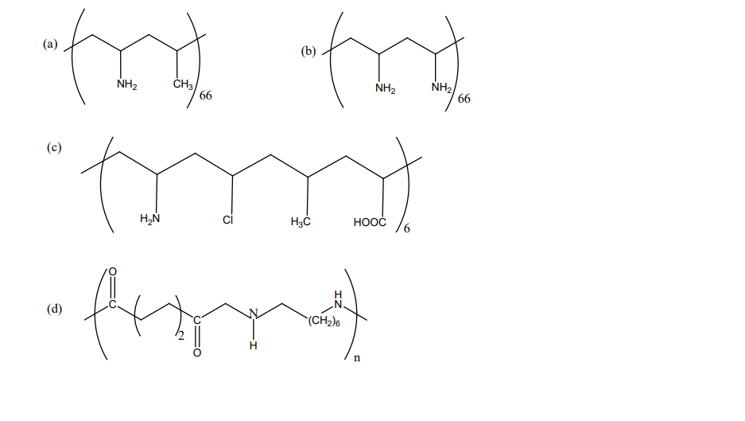

6\. Natural rubber has a) alternate cis- and trans-configuration b) random cis- and trans-configuration c) all cis-configuration d) all trans-configuration

7\. Nylon is an example of a) polyamide b) polythene c) polyester d) poly saccharide

8\. Terylene is an example of a) polyamide b) polythene c) polyester d) polysaccharide

9\. Which is the monomer of neoprene in the following?
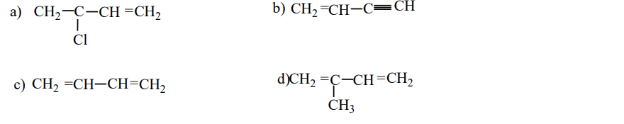
10\. Which one of the following is a bio-degradable polymer?

a) HDPE b) PVC c) Nylon 6 d) PHBV 11. Non stick cook wares generally have a coating of a polymer, whose monomer is

a) ethane b) prop-2-enenitrile c) chloroethene d) 1,1,2,2-tetrafluoroethane 12. Assertion: 2-methyl-1,3-butadiene is the monomer of natural rubber

Reason: Natural rubber is formed through anionic addition polymerisation. a) If both assertion and reason are true and reason is the correct explanation of assertion. b) if both assertion and reason are true but reason is not the correct explanation of

assertion. c) assertion is true but reason is false. d) both assertion and reason are false.

13\. Which of the following is a co-polymer? a) Orlon b) PVC c) Teflon d) PHBV

14\. The polymer used in making blankets (artificial wool) is a) polystyrene b) PAN c) polyester d) polythene

15\. Regarding cross-linked or network polymers, which of the following statement is incorrect? (NEET) a) Examples are Bakelite and melamine b) They are formed from bi and tri-functional monomers c) They contain covalent bonds between various linear polymer chains d) They contain strong covalent bonds in their polymer chain

**Short Answer Questions**

1\. What are antibiotics?

2\. Name one substance which can act as both analgesic and antiphyretic

3\. Write a note on synthetic detergents

4\. How do antiseptics differ from disinfectants?

5\. What are food preservatives?

6\. What are drugs? How are they classified

7\. How the tranquilizers work in body.

8\. Write the structural formula of aspirin.

9\. Explain the mechanism of cleansing action of soaps and detergents

10\. Which sweetening agent are used to prepare sweets for a diabetic patient?

11\. What are narcotic and non – narcotic drugs. Give examples

12\. What are anti fertility drugs? Give examples.

13\. Write a note on co –polymer

14\. What are bio degradable polymers? Give examples.

15\. How is terylene prepared?

16\. Write a note on vulcanization of rubber

17\. Classify the following as linear, branched or cross linked polymers

a) Bakelite b) Nylon-6,6 c) LDPE d) HDPE
