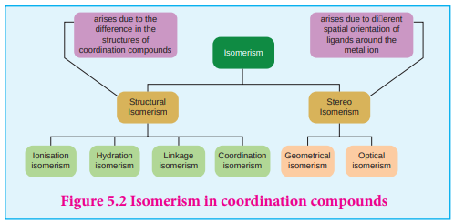
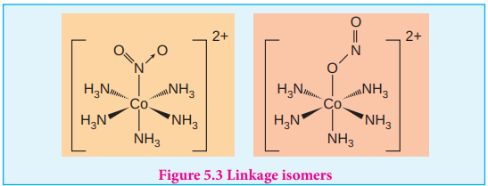
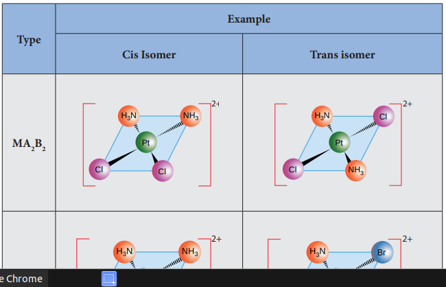

## Isomerism in coordination compounds
 We have already learnt the concept of isomerism in the context of organic compounds,

in the previous year chemistry classes. Similarly, coordination compounds also exhibit isomerism. Isomerism is the phenomenon in which more than one coordination compounds having the same molecular formula have different physical and chemical properties due to different arrangement of ligands around the central metal atom. The following flow chart gives an overview of the common types of isomerism observed in coordination compounds,

**Figure 5.2 Isomerism in coordination compounds**

### Structural isomers

The coordination compounds with same formula, but have different connections among their constituent atoms are called structural isomers or constitutional isomers. Four common types of structural isomers are discussed below.

**Linkage isomers:**

This type of isomers arises when an ambidentate ligand is bonded to the central metal atom/ion through either of its two different donor atoms. In the below mentioned examples, the nitrite ion is bound to the central metal ion Co3+ through a nitrogen atom in one complex,and through oxygen atom in other complex. **\[Co(NH3)5(NO2)\]2+**
  

          

**Coordination isomers:**

This type of isomers arises in the coordination compounds having both the cation and anion as complex ions. The interchange of one or more ligands between the cationic and the anionic coordination entities result in different isomers.

For example, in the coordination compound, \[Co(NH3)6\]\[Cr(CN)6\] the ligands ammonia and cyanide were bound respectively to cobalt and chromium while in its coordination isomer \[Cr(NH3)6\]\[Co(CN)6\] they are reversed.

**Some more examples for coordination isomers**

1\. \[Cr(NH3)5CN\]\[Co(NH3)(CN)5\] and \[Co(NH3)5CN\]\[Cr(NH3)(CN)5\]

2\. \[Pt(NH3)4\]\[Pd(Cl)4\] and \[Pd(NH3)4\]\[Pt(Cl)4\]

**Ionisation isomers:**

This type of isomers arises when an ionisable counter ion (simple ion) itself can act as a ligand. The exchange of such counter ions with one or more ligands in the coordination entity will result in ionisation isomers. These isomers will give different ions in solution. For example, consider the coordination compound \[Pt(en)2cl2\]br2. In this compound, both br- and cl- have the ability to act as a ligand and the exchange of these two ions result in a different isomer \[Pt(en)2br2\]cl2. In solution the first compound gives br- ions while the later gives cl- ions and hence these compounds are called ionisation isomers.

**Some more example for the isomers,**

1\. \[Cr(NH3)4ClBr\]NO2 and \[Cr(NH3)4Cl NO2\]Br

2\. \[Co(NH3)4br2\]Cl and \[Co(NH3)4Cl Br\]Br

|**Evaluate yourself 4:** A solution of \[Co(NH3)4l2\]Cl when treated with AgNO2 gives a white precipitate. What should be the formula of isomer of the dissolved complex that gives yellow precipitate with AgNO2. What are the above isomers called?|
 |------------------|

**Solvate isomers.**

The exchange of free solvent molecules such as water , ammonia, alcohol etc.. in the crystal lattice with a ligand in the coordination entity will give different isomers. These type of isomers are called solvate isomers. If the solvent molecule is water, then these isomers are called hydrate isomers. For example, the complex with chemical formula Crcl3.6H2O has three hydrate isomers as shown below.

| [Cr(H2O)6\]cl3| a violet colour compound and gives three chloride ions in solution |
| ----------- | ----------- |
|[Cr(H2O)5Cl\]cl2.H2O| a pale green colour compound and gives two chloride ions in solution and|
|[Cr(H2O)4cl2\]Cl.2H2O|dark green colour compound and gives one chloride ion in solution|

### Stereoisomers:

Similar to organic compounds, coordination compounds also exhibit stereoisomerism. The stereoisomers of a coordination compound have the same chemical formula and connectivity between the central metal atom and the ligands. But they differ in the spatial arrangement of ligands in three dimensional space. They can be further classified as geometrical isomers and optical isomers.

**Geometrical isomers:**

Geometrical isomerism exists in heteroleptic complexes due to different possible three dimensional spatial arrangements of the ligands around the central metal atom. This type of isomerism exists in square planer and octahedral complexes.

In square planar complexes of the form \[MA2B2\] n± and \[MA2BC\]n± (where A, B and C are

mono dentate ligands and M is the central metal ion/atom), Similar groups (A or B) present either on same side or on the opposite side of the central metal atom (M) give rise to two different geometrical isomers, and they are called, cis and trans isomers respectively.

The square planar complex of the type \[M(xy)2\] n± where xy is a bidentate ligand with two

different coordinating atoms also shows cis-trans isomerism. Square planar complex of the form \[MABCD\]n± also shows geometrical isomerism. In this case, by considering any one of the ligands (A, B, C or D) as a reference, the rest of the ligands can be arranged in three different ways leading to three geometrical isomers.

**Figure 5.4 MA2B2 MA2BC M(xy)2 MABCD - isomers**

**Octahedral complexes:**

Octahedral complexes of the type [MA2B2] n±, \[M(xx)2B2\]

n± shows _cis-trans_ isomerism. Here A and B are monodentate ligands and xx is bidentate ligand with two same kind of donor atoms. In the octahedral complex, the position of ligands is indicated by the following numbering scheme.

In the above scheme, the positions (1,2), (1,3), (1,4), (1,5), (2,3), (2,5), (2,6), (3,4), (3,6), (4,5), (4,6), and (5,6) are identical and if two similar groups are present in any one of these positions, the isomer is referred as a _cis_ isomer. Similarly, positions (1,6), (2,4), and (3,5) are identical and if similar ligands are present in these positions it is referred as a _trans-_isomer.

Octahedral complex of the type \[MA3B3\] n± also shows geometrical isomerism. If the three

similar ligands (A) are present in the corners of one triangular face of the octahedron and the other three ligands (B) are present in the opposing triangular face, then the isomer is referred as a facial isomer (_fac_ isomer)- Figure 5.6 (a).

If the three similar ligands are present around the meridian which is an imaginary semicircle from one apex of the octahedral to the opposite apex as shown in the fi gure 5.6(b), the isomer is called as a meridional isomer (mer isomer). Th is is called meridional because each set of ligands can be regarded as lying on a meridian of an octahedron.

**Figure 5.6 (a) Facial isomer Figure 5.6 (b) Meridional isomer**

**Figure 5.5 Position of ligands in octahedral complex**

As the number of different ligands increases, the number of possible isomers also increases. For the octahedral complex of the type \[MABCDEF\]n±, where A, B, C, D, E and F are monodentate ligands, fifteen different orientation are possible corresponding to 15 geometrical isomers. It is difficult to generate all the possible isomers.

**Evaluate yourself 5:**

5\. Three compounds A ,B and C have empirical formula Crcl3.6H2O. they are kept in a container with a dehydrating agent and they lost water and attaining constant weight as shown below.

Compound Initial weight of the compound(in g)

Constant weight after dehydration (in g)

6\. Indicate the possible type of isomerism for the following complexes and draw their isomers

(i) \[Co(en)3\]\[Cr(CN)6\] (ii) \[Co(NH3)5(NO2)\]2+ (iii) \[Pt(NH3)3(NO2)\]Cl

### Optical Isomerism

Coordination compounds which possess chairality exhibit optical isomerism similar to organic compounds. The pair of two optically active isomers which are mirror images of each other are called enantiomers. Their solutions rotate the plane of the plane polarised light either clockwise or anticlockwise and the corresponding isomers are called 'd' (dextro rotatory) and 'l' (levo rotatory) forms respectively. The octahedral complexes of type \[M(xx)3\] n±, \[M(xx)2AB\]n± and \[M(xx)2B2\]n± exhibit optical isomerism.

**Examples:**

The optical isomers of \[Co(en)3\]3+ are shown in figure 5.7.

The coordination complex [Cocl2(en)2]+ has three isomers, two optically active cis forms
and one optically inactive trans form. These structures are shown below

| Evaluate yourself 6: 10.Draw all possible stereo isomers of a complex Ca[Co(NH3)Cl(Ox)2]| 
| ----------- | 
