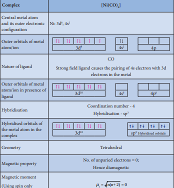
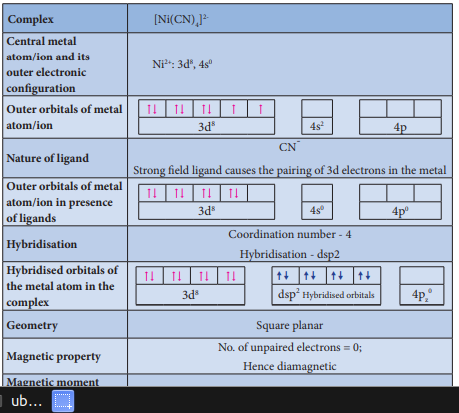
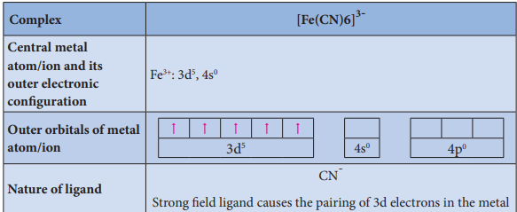
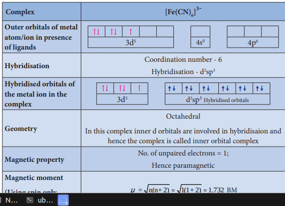
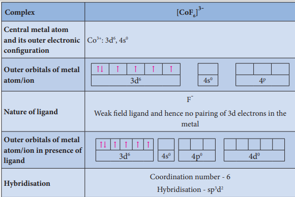
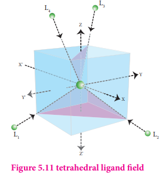

 Alfred Werner considered the bonding in coordination compounds as the bonding between a lewis acid and a lewis base. His approach is useful in explaining some of the observed properties of coordination compounds. However, properties such as colour, magnetic property etc.. of complexes could not be explained on the basis of his approach. Following werner theory, Linus pauling proposed the Valence Bond Theory (VBT) which assumes that the bond formed between the central metal atom and the ligand is purely covalent. Bethe and Van vleck treated the interaction between the metal ion and the ligands as electrostatic and extended the Crystal Field Theory (CFT) to explain the properties of coordination compounds. Further, Ligand field theory and Molecular orbital have been developed to explain the nature of bonding in the coordination compounds. In this porton we learn the elementry treatment of VBT and CFT to simple coordination compounds.

### Valence Bond Theory

According to this theory, the bond formed between the central metal atom and the ligand is due to the overlap of filled ligand orbitals containing a lone pair of electron with the vacant hybrid orbitals of the central metal atom.

**Main assumptions of VBT:**

1. The ligand → metal bond in a coordination complex is covalent in nature. It is formed by sharing of electrons (provided by the ligands) between the central metal atom and the ligand.

2. Each ligand should have at least one filled orbital containing a lone pair of electrons.

3. In order to accommodate the electron pairs donated by the ligands, the central metal ion present in a complex provides required number (coordination number) of vacant orbitals.

4. These vacant orbitals of central metal atom undergo hybridisation, the process of mixing of atomic orbitals of comparable energy to form equal number of new orbitals called hybridised orbitals with same energy.

5. The vacant hybridised orbitals of the central metal ion, linearly overlap with filled orbitals of the ligands to form coordinate covalent sigma bonds between the metal and the ligand.

6. The hybridised orbitals are directional and their orientation in space gives a definite geometry to the complex ion.

| C oordination number |Hybridisation |Geometry |Examples |
|------|------|------|------|
| 2 |sp |Linear |[CuCl]- , [Ag(CN)2]<sup-|
| 3 |sp2 |Trigonal planar |[HgI3]-|
| 4 |sp3 |Tetrahedral |[Ni(CO)4 ],[NiCl4]2-|
| 4 |dsp2 |Squareplanar |[Ni(CN)4]2- , [Pt(NH3)4 ]2-|
| 5 |dsp(dx2-y2 orbita3l isinvolved) |Trigonal bipyramidal |Fe(CO)5 |
| 6 |d sp(dz2 and d2x2-y 3 2 orbitals of inner shell are involved) |Octahedral |[Ti(H2 O6) ]2- , [Fe(CN) ] , [Fe(CN) ] , [Co(NH ) ]3+ 2- 3-2 6 6 6(Inner orbital co3+mplexes)3 6 |
| 6 |sp d(dz2 and dx32-y 2 2 orbitals of the outershell are involved) |Octahedral |[FeF ] ,[CoF ] , [Fe(H O) ](Outer or4-bital compl 4-exes) 2+6 6 2 6 |

7. In the octahedral complexes, if the (n-1) d orbitals are involved in hybridisation, then they are called inner orbital complexes or low spin complexes or spin paired complexes. If the nd orbitals are involved in hybridisation, then such complexes are called outer orbital or high spin or spin free complexes. Here n represents the principal quantum number of the outermost shell.

8. The complexes containing a central metal atom with unpaired electron(s) are paramagnetic. If all the electrons are paired, then the complexes will be diamagnetic.

9. Ligands such as CO, CN-, en, and NH3 present in the complexes cause pairing of electrons present in the central metal atom. Such ligands are called strong field ligands.

10. Greater the overlapping between the ligand orbitals and the hybridised metal orbital, greater is the bond strength.

Let us illustrate the VBT by considering the following examples.

**Illustration 1**

**Illustration 2**

**Illustration 3**

**Illustration 4**

**Limitations of VBT**

Eventhough VBT explains many of the observed properties of complexes, it still has following limitations

1. It does not explain the colour of the complex

2. It considers only the spin only magnetic moments and does not consider the other components of magnetic moments.

3. It does not provide a quantitative explanation as to why certain complexes are inner orbital complexes and the others are outer orbital complexes for the same metal. For example, [Fe(CN)6]4- is diamagnetic (low spin) whereas \[FeF6\]4- is paramagnetic (high spin).

    **Evaluate yourself 7:**

       i. The spin only magnetic moment of Tetrachloridomanganate(II)ion is 5.9 BM. On the basis of VBT, predict the type of hybridisation and geometry of the compound.

       ii. Predict the number of unpaired electrons in \[CoCl4\] 2- ion on the basis of VBT.

       iii. A metal complex having composition Co(en)2Cl2Br has been isolated in two forms A and B. (B) reacted with silver nitrate to give a white precipitate readily soluble in ammonium hydroxide. Whereas A gives a pale yellow precipitate. Write the formula of A and B. state the hybridization of Co in each and calculate their spin only magnetic moment.

### Crystal Field Theory

Valence bond theory helps us to visualise the bonding in complexes. However, it has limitations as mentioned above.Hence Crystal Field Theory to expalin some of the properties like colour, magnetic behavior etc.,This theory was originally used to explain the nature of bonding in ionic crystals. Later on, it is used to explain the properties of transition metals and their complexes. The salient features of this theory are as follows.

1. Crystal Field Theory (CFT) assumes that the bond between the ligand and the central metal atom is purely ionic. i.e. the bond is formed due to the electrostatic attraction between the electron rich ligand and the electron deficient metal.

2. In the coordination compounds, the central metal atom/ion and the ligands are considered as point charges (in case of charged metal ions or ligands) or electric dipoles (in case of metal atoms or neutral ligands).

3. According to crystal field theory, the complex formation is considered as the following series of hypothetical steps.

**Step 1: In an isolated gaseous state, all the five d orbitals of the central metal ion are degenerate.** Initially, the ligands form a spherical field of negative charge around the metal. In this field, the energies of all the five d orbitals will increase due to the repulsion between the electrons of the metal and the ligand.

**Step 2: The ligands** are approaching the metal atom in actual bond directions. To illustrate this let us consider an octahedral field, in which the central metal ion is located at the origin and the six ligands are coming from the +x, -x, +y, -y, +z and -z directions as shown below.

**Figure 5.9 octahedral ligand field**

As shown in the figure, the orbitals lying along the axes dx2-y2 and dz2 orbitals will experience strong repulsion and raise in energy to a greater extent than the orbitals with lobes directed between the axes (dxy, dyz and dzx). Thus the degenerate d orbitals now split into two sets and the process is called crystal field splitting.

Step 3: Up to this point the complex formation would not be favoured. However, when the ligands approach further, there will be an attraction between the negatively charged electron and the positively charged metal ion, that results in a net decrease in energy. This decrease in energy is the driving force for the complex formation. 

**Crystal field splitting in octahedral complexes:**

During crystal field splitting in octahedral field, in order to maintain the average energy of the orbitals (barycentre) constant, the energy of the orbitals dx2-y2 and dz2 (represented as eg orbitals) will increase by 3/5Δo while that of the other three orbitals dxy, dyz and dzx (represented as t2g orbitals) decrease by 2/5Δo. Here, Δo represents the crystal field splitting energy in the octahedral field.

**Figure: 5.10 - Crystal field splitting in octahedral field**

**Crystal field splitting in tetrahedral complexes:**

The approach of ligands in tetrahedral field can be visualised as follows. Consider a cube in which the central metal atom is placed at its centre (i.e. origin of the coordinate axis as shown in the figure). The four ligands approach the central metal atom along the direction of the leading diagonals drawn from alternate corners of the cube.

**Figure 5.11 tetrahedral ligand field**

In this field, none of the d orbitals point dirctly towards the ligands,however the t2 orbitals (dxy, dyz and dzx) are pointing close to the direction in which ligands are approaching than the e orbitals (dx2-y2 and dz2).

**Figure: 5.12 - Crystal field splitting in tetrahedral field**

As a result, the energy of t2 orbitals increases by 2/5Δt and that of e orbitals decreases by 3/5Δt as shown below. when compared to the octahedral field, this splitting is inverted and the spliting energy is less. The relation between the crystal field splitting energy in octahedral and tetrahedral ligand field is given by the expression;

**Figure 5.13 d-orbitals in tetrahedral ligand field**

**Crystal filed splitting Energy and nature of ligands:**

The magnitude of crystal field splitting energy not only depends on the ligand field as discussed above but also depends on the nature of the ligand, the nature of the central metal atom/ion and the charge on it. Let us understand the effect of the nature of ligand on crystal field splitting by calculating the crystal field splitting energy of the octahedral complexes of titanium(III) with different ligands such as fluoride, bromide and water

using their absorption spectral data. The absorption wave numbers of complexes \[TiBr6\]3-,[TiF6\]3-and [Ti(H2O6)\]3+ are 12500, 19000 and 20000 cm-1 respectively. The energy associated with the absorbed wave numbers of the light, corresponds to the crystal field splitting energy (Δ) and is given by the following expression,

Δ = _h_ν = _hc_ λ

\= _hc_ν

where h is the Plank' s constant; c is velocity of light, **υ** is the wave number of absorption maximum which is equal to 1/λ

[TiBr6\]3-,[TiF6\]3-

[Ti(H2O6)\]3+

From the above calculations, it is clear that the crystal filed splitting energy of the Ti3+ in complexes,the three ligands is in the order; Br- < F- < H2O. Similarly, it has been found form the spectral data that the crystal field splitting power of various ligands for a given metal ion, are in the following order

I-<Br-<SCN-<Cl-<S2-<F-<OH-≈urea< ox2-< H2O< NCS-<EDTA4-<NH3<en<NO2 -<CN- < CO

The above series is known as spectrochemical series. The ligands present on the right side of the series such as carbonyl causes relatively larger crystal field splitting and are called strong ligands or strong field ligands, while the ligands on the left side are called weak field ligands and causes relatively smaller crystal field splitting.

**Distribution of d electrons in octahedral complexes:**

The filling of electrons in the d orbitals in the presence of ligand field also follows Hund's rule. In the octahedral complexes with d2 and d3 configurations, the electrons occupy different degenerate t2g orbitals and remains unpaired. In case of d4 configuration, there are two possibilities. The fourth electron may either go to the higher energy eg orbitals or it may pair with one of the t2g electrons. In this scenario, the preferred configuration will be the one with lowest energy.

If the octahedral crystal field splitting energy (Δo) is greater than the pairing energy (P), it is necessary to cause pairing of electrons in an orbital, then the fourth electron will pair up with an the electron in the t2g orbital. Conversely, if the Δo is lesser than P, then the fourth electron will occupy one of the degenerate higher energy eg orbitals.

For example, let us consider two different iron(III) complexes \[Fe(H2O)6\] 3+ (weak field

complex; wave number corresponds to Δo is 14000 cm-1) and \[Fe(CN)6\] 3- (Strong field complex;

wave number corresponds to Δo is 35000 cm-1). The wave number corresponds to the pairing energy of Fe3+ is 30000 cm-1. In both these complexes the Fe3+ has d5 configuration. In aqua complex, the Δo < P hence, the fourth & fifth electrons enter eg orbitals and the configuration is t2g

3, eg 2. In the cyanido complex Δo > P and hence the fourth & fifth electrons pair up with the

electrons in the t2g orbitals and the electronic configuration is t2g 5, eg 0.

The actual distribution of electrons can be ascertained by calculating the crystal field stabilisation energy (CFSE). The crystal field stabilisation energy is defined as the energy difference of electronic configurations in the ligand field (ELF) and the isotropic field/barycentre (Eiso).

CFSE (ΔEo) = {ELF } - {Eiso }

\= {\[nt2g (-0.4)+neg

(0.6)\] Δo + npP} - {n'p P}

Here, nt2g is the number of electrons in t2g orbitals; neg is number of electrons in eg orbitals; np is number of electron pairs in the ligand field; & n'p is the number of electron pairs in the isotropic field (barycentre).

Calculating the CFSE for the Iron complexes

**Complex: \[Fe(H2O)6\]3+**

**Complex: \[Fe(H2O)6\]3-**

**Colour of the complex and crystal field splitting energy:**

Most of the transition metal complexes are coloured. A substance exhibits colour when it absorbs the light of a particular wavelength in the visible region and transmit the rest of the visible light. When this transmitted light enters our eye, our brain recognises its colour. The colour of the transmitted light is given by the complementary colour of the absorbed light. For example, the hydrated copper(II) ion is blue in colour as it absorbs orange light, and transmit its complementary colour, blue. A list of absorbed wavelength and their complementary colour is given in the following table.

| Wave length(λ) of absorbed light (Å) |Wave number(ν) of the absorbed light (cm-1) |C olour of absorbed light |Obser ved C olour |
|------|------|------|------|
| 4000 |25000 |Violet |Yellow |
| 4750 |21053 |Blue |Orange |
| 5100 |19608 |Green |Red |
| 5700 |17544 |Yellow |Violet |
| 5900 |16949 |Orange |Blue |
| 6500 |15385 |Red |Green |

The observed colour of a coordination compound can be explained using crystal field theory. We learnt that the ligand field causes the splitting of d orbitals of the central metal atom into two sets (t2g and eg). When the white light falls on the complex ion, the central metal ion absorbs visible light corresponding to the crystal filed splitting energy and transmits rest of the light which is responsible for the colour of the complex.

**Figure 5.15 Colour Wheel - Complementary colours are shown**

This absorption causes excitation of d-electrons of central metal ion from the lower energy t2g level to the higher energy eg level which is known as d-d transition.

Let us understand the d-d transitions by considering \[Ti(H2O)6\]

3+ as an example. In this complex the central metal ion is Ti3+, which has d1 configuration. This single electron occupies one of the t2g orbitals in the octahedral aqua ligand field. When white light falls on this complex the d electron absorbs light and promotes itself to eg level. The spectral data show the absorption maximum is at 20000 cm-1 corresponding to the crystal field splitting energy (Δo) 239.7 kJ mol-1. The transmitted colour associated with this absorption is purple and hence ,the complex appears purple in colour.

The octahedral titanium(III) complexes with other ligands such as bromide and fluoride have different colours. This is due to the difference in the magnitude of crystal field splitting by these ligands (Refer page 156). However, the complexes of central metal atom such as of Sc3+, Ti4+, Cu+, Zn2+, etc... are colourless. This is because the d-d transition is not possible in complexes with central metal having d0 or d10 configuration.

**Evaluate yourself 8:**

11. The mean pairing energy and octahedral field splitting energy of \[Mn(CN)6\] 3- are 28,800 cm-1 and 38500 cm-1 respectively. Whether this complex is stable in low spin or high spin?

12. Draw energy level diagram and indicate the number of electrons in each level for the complex \[Cu(H2O)6\]2+. Whether the complex is paramagnetic or diamagnetic?

13. For the \[CoF6\] 3- ion the mean pairing energy is found to be 21000 cm-1 . The magnitude of Δ0 is 13000cm-1. Calculate the crystal field stabilization energy for this complex ion corresponding to low spin and high spin states.

**Metallic carbonyls**

Metal carbonyls are the transition metal complexes of carbon monoxide, containing Metal- Carbon bond. In these complexes CO molecule acts as a neutral ligand. The first homoleptic carbonyl Ni CO4( )  nickel tetra carbonyl was reported by Mond in 1890.These metallic carbonyls are widely studied because of their industrial importance, catalytic properties and their ability to release carbon monoxide.

**Figure 5.16 d-d Transition**

**Classification:**

Generally metal carbonyls are classified in two different ways as described below.

**(i)** **Classification based on the number of metal atoms present.**

Depending upon the number of metal atoms present in a given metallic carbonyl, they are classified as follows.

**a.** **Mononuclear carbonyls**

These compounds contain only one metal atom, and have comparatively simple structures.

For example, NiCO4( )  - nickel tetracarbonyl is tetrahedral, FeCO5()- Iron pentacarbonyl is trigonalbipyramidal, and CrCO6( )  - Chromium hexacarbonyl is octahedral.

**b.** **Poly nuclear carbonyls**

Metallic carbonyls containing two or more metal atoms are called poly nuclear carbonyls. 
**(ii)** **Classification based on the structure:**

The structures of the binuclear metal carbonyls involve either metal–metal bonds or bridging CO groups, or both. The carbonyl ligands that are attached to only one metal atom are referred to as **terminal** carbonyl groups, whereas those attached to two metal atoms simultaneously are called _bridging_ carbonyls. Depending upon the structures, metal carbonyls are classified as follows.

**a.** **Non-bridged metal carbonyls:**

These metal carbonyls do not contain any bridging carbonyl ligands. They may be of two types.

 (i) Non- bridged metal carbonyls which contain only terminal carbonyls. 
 
 (ii) Non- bridged metal carbonyls which contain terminal carbonyls as well as Metal-Metal bonds. For examples,The structure of Mn2(CO)10actually involve only a metal–metal bond, so the formula is more correctly represented as (CO)5Mn−Mn(CO)5.

**b.** **Bridged carbonyls:**

These metal carbonyls contain one or more bridging carbonyl ligands along with terminal carbonyl ligands and one or more Metal-Metal bonds. For example,
  (i) The structure of Fe2(CO)9, di-iron nona carbonyl molecule consists of three bridging CO ligands, six terminal CO groups

  (ii) For dicobaltoctacarbonylCo2(CO)8two isomers are possible. The one has a metal–metal bond between the cobalt atoms, and the other has two bridging CO ligands.

**Bonding in metal carbonyls**

In metal carbonyls, the bond between metal atom and the carbonyl ligand consists of two components. The first component is an electron pair donation from the carbon atom of carbonyl ligand into a vacant d-orbital of central metal atom. This electron pair donation forms M CO bondσ←  sigma bond. This sigma bond formation increases the electron density in metal d orbitals and makes the metal electron rich. In order to compensate for this increased electron density, a filled metal d-orbital interacts with the empty π\* orbital on the carbonyl ligand and transfers the added electron density back to the ligand. This second component is called π-back bonding . Thus in metal carbonyls, electron density moves from ligand to metal through sigma bonding and from metal to ligand through pi bonding, this synergic effect accounts for strong M CO← bond in metal carbonyls. This phenomenon is shown diagrammatically as follows.

