# 14. BIOMOLECULES

G.N. Ramachandran

Dr. G.N. Ramachandran received Master's Degree in Physics from Madras University. In 1954, he identified and published the Triple helical structure of Collagen using X-ray diffraction. He pioneered the field of protein structure validation through the study of available crystal structures of peptides. From his studies, in 1962, he developed the Ramachandran Plot which is used even today for stereochemical validation of protein structures.

# Introduction

All living things are made up of many biomolecules such as carbohydrates, proteins, lipids
and nucleic acids etc... The major elements present in the human body are carbon, hydrogen,
oxygen, nitrogen and phosphorous, and they combine to form a variety of biomolecules. These
biomolecules are used as fuel to provide the necessary energy for the various functions of
living systems in addition to many other biological functions. The field of studying about the
chemistry behind the biological processes is called ‘Biochemistry’. In this unit, we will learn
about some essential informations of the biomolecules, their structure and their importance.

### 14.1 Carbohydrates

All living things are made up of many biomolecules such as carbohydrates, proteins, lipids and nucleic acids etc... The major elements present in the human body are carbon, hydrogen, oxygen, nitrogen and phosphorous, and they combine to form a variety of biomolecules. These biomolecules are used as fuel to provide the necessary energy for the various functions of living systems in addition to many other biological functions. The field of studying about the chemistry behind the biological processes is called 'Biochemistry'. In this unit, we will learn about some essential informations of the biomolecules, their structure and their importance.

Carbohydrates are the most abundant organic compounds in every living organism. They are also known as saccharides (derived from Greek word 'sakcharon' which means sugar) as many of them are sweet. They are considered as hydrates of carbon, containing hydrogen and oxygen in the same ratio as in water. Chemically, they are defined as polyhydroxy aldehydes or ketones with a general formula \(C_n(H_2O)_n\). Some common examples are glucose (monosaccharide), sucrose (disaccharide) and starch (polysaccharide)

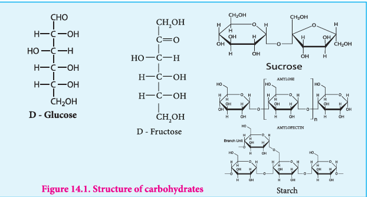

**Figure 14.1. Structure of carbohydrates**

Carbohydrates are synthesised by green leaves during photosynthesis, a complex process in which sun light provides the energy to convert carbon dioxide and water into glucose and oxygen. Glucose is then converted into other carbohydrates and is consumed by animals.

$$
6CO_2 + 6H_2O \xrightarrow{\text{Sunlight}} C_6H_{12}O_6 + 6O_2
$$

#### 14.1.1 Configuration of carbohydrates

Almost all carbohydrates are optically active as they have one or more chiral carbons. The number of optical isomers depends on the number of chiral carbons ( \(2^{n}\) isomers, where n is the total number of chiral carbons). We have already learnt in XI standard to represent an organic compound using Fischer projection formula. Fischer has devised a projection formula to relate the structure of a carbohydrate to one of the two enantiomeric forms of glyceraldehyde (Figure 14.2). Based on these structures, carbohydrates are named as D or L. The carbohydrates are usually named with two prefixes namely D or L and followed by sign either \((+)\) or \((-)\). Carbohydrates are assigned the notation (D/L) by comparing the configuration of the carbon that is attached to \(-CH_2OH\) group with that of glyceraldehyde. For example D-glucose is so named because the H and OH on C5 carbon are in the same configuration as the H and OH on C2 carbon in D-Glyceraldehyde.

The \(+\) and \(-\) sign indicates the dextrorotatory and levorotatory respectively. Dextrorotatory compounds rotate the plane of plane polarised light in clockwise direction while the levorotatory compounds rotate in anticlockwise direction. The D or L isomers can either be dextro or levo rotatory compounds. Dextrorotatory compounds are represented as \(D-(+)\) or \(L-(+)\) and the levorotatory compounds as \(D-(-)\) or \(L-(-)\).

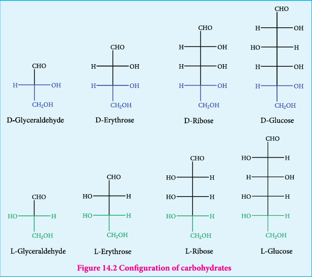

**Figure 14.2 Configuration of carbohydrates**

#### 14.1.2 Classification of carbohydrates

Carbohydrates can be classified into three major groups based on their product of hydrolysis, namely monosaccharides, oligosaccharides and polysaccharides.

**Monosaccharides:** Monosaccharides are carbohydrates that cannot be hydrolysed further and are also called simple sugars. Monosaccharides have general formula \(C_n(H_2O)_n\). While there are many monosaccharides known only about 20 of them occur in nature. Some common examples are glucose, fructose, ribose, erythrose.

Monosaccharides are further classified based on the functional group present (aldoses or ketoses) and the number of carbon present in the chain (trioses, tetroses, pentoses, hexoses etc...). If the carbonyl group is an aldehyde, the sugar is an aldose. If the carbonyl group is a ketone, the sugar is a ketose. The most common monosaccharides have three to eight carbon atoms.

**Table 14.1 Different types of monosaccharides**

| No. of carbon atoms in the chain | Functional group present | Type of sugar | Example |
|---|---|---|---|
| 3 | Aldehyde | Aldotriose | Glyceraldehyde |
| 3 | Ketone | Ketotriose | Dihydroxy acetone |
| 4 | Aldehyde | Aldotetrose | Erythrose |
| 4 | Ketone | Ketotetrose | Erythulose |
| 5 | Aldehyde | Aldopentose | Ribose |
| 5 | Ketone | Ketopentose | Ribulose |
| 6 | Aldehyde | Aldohexose | Glucose |
| 6 | Ketone | Ketohexose | Fructose |

#### 14.1.3 Glucose

Glucose is a simple sugar which serves as a major energy source for us. It is the most important and most abundant sugar. It is present in honey, sweet fruits such as grapes and mangoes etc... Human blood contains about \(100 \ \mathrm{mg/dL}\) of glucose, hence it is also known as blood sugar. In the combined form it is present in sucrose, starch, cellulose etc.,

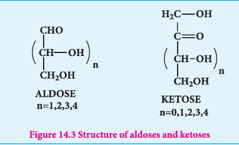

**Figure 14.3 Structure of aldoses and ketoses**

**Preparation of glucose**

1. When sucrose (cane sugar) is boiled with dilute \(H_2SO_4\) in alcoholic solution, it undergoes hydrolysis and give glucose and fructose.

$$
C_{12}H_{22}O_{11} + H_2O \xrightarrow{H^+} C_6H_{12}O_6 + C_6H_{12}O_6
$$

2. Glucose is produced commercially by the hydrolysis of starch with dilute HCl at high temperature under pressure.

$$
(C_6H_{10}O_5)_n + nH_2O \xrightarrow{H^+} nC_6H_{12}O_6
$$

**Structure of Glucose**

Glucose is an aldehyde. It is optically active with four asymmetric carbons. Its solution is dextrorotatory and hence it is also called as dextrose. The proposed structure of glucose is shown in the figure 14.4 which was derived based on the following evidences.

1. Elemental analysis and molecular weight determination show that the molecular formula of glucose is \(C_6H_{12}O_6\)

2. On reduction with concentrated HI and red phosphorus at \(373 \ \mathrm{K}\) glucose gives a mixture of n-hexane and 2-iodohexane indicating that the six carbon atoms are bonded linearly.

$$
\text{Glucose} \xrightarrow[\text{373 K}]{HI/P} CH_3-CH_2-CH_2-CH_2-CH_2-CH_3 + CH_3-CH_2-CH_2-CH_2-CHI-CH_3
$$
(n-hexane, major product) (2-iodohexane, minor product)

3. Glucose reacts with hydroxylamine to form oxime and with HCN to form cyanohydrin. These reactions indicate the presence of carbonyl group in glucose.

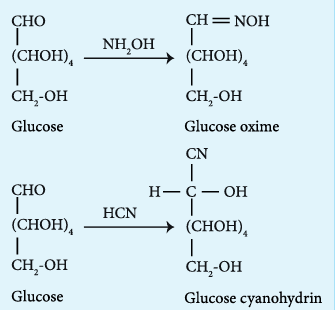

4. Glucose gets oxidized to gluconic acid with mild oxidizing agents like bromine water suggesting that the carbonyl group is an aldehyde group and it occupies one end of the carbon chain. When oxidised using strong oxidising agent such as conc. nitric acid gives glucaric acid (saccharic acid) suggesting the other end is occupied by a primary alcohol group.

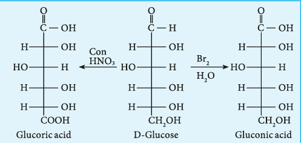

5. Glucose is oxidised to gluconic acid with ammonical silver nitrate (Tollen's reagent) and alkaline copper sulphate (Fehling's solution). Tollen's reagent is reduced to metallic silver and Fehling's solution to cuprous oxide which appears as red precipitate. These reactions further confirm the presence of an aldehyde group.

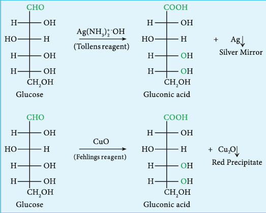

6. Glucose forms penta acetate with acetic anhydride suggesting the presence of five alcohol groups.

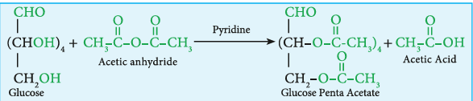

7. Glucose is a stable compound and does not undergo dehydration easily. It indicates that not more than one hydroxyl group is bonded to a single carbon atom. Thus the five hydroxyl groups are attached to five different carbon atoms and the sixth carbon is an aldehyde group.

8. The exact spatial arrangement of -OH groups was given by Emil Fischer as shown in Figure 14.4. The glucose is referred to as \(D(+)\) glucose as it has D configuration and is dextrorotatory.

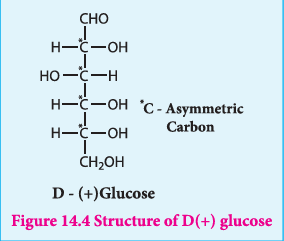

**Figure 14.4 Structure of \(\mathbf{D}(+)\) glucose**

**Cyclic structure of glucose**

Fischer identified that the open chain penta hydroxyl aldehyde structure of glucose, that he proposed, did not completely explain its chemical behaviour. Unlike simple aldehydes, glucose did not form crystalline bisulphite compound with sodium bisulphite. Glucose does not give Schiff's test and the penta acetate derivative of glucose was not oxidized by Tollen's reagent or Fehling's solution. This behaviour could not be explained by the open chain structure.

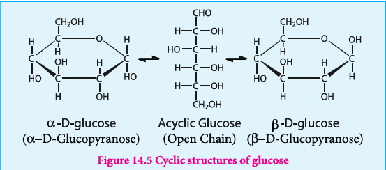

**Figure 14.5 Cyclic structures of glucose**

In addition, glucose is found to crystallise in two different forms depending upon the crystallisation conditions with different melting points (419 and 423 K). In order to explain these it was proposed that one of the hydroxyl group reacts with the aldehyde group to form a cyclic structure (hemiacetal form) as shown in figure 14.5. This also results in the conversion of the achiral aldehyde carbon into a chiral one leading to the possibility of two isomers. These two isomers differ only in the configuration of C1 carbon. These isomers are called anomers. The two anomeric forms of glucose are called \(\alpha\) and \(\beta\)-forms. This cyclic structure of glucose is similar to pyran, a cyclic compound with 5 carbon and one oxygen atom, and hence is called pyranose form. The specific rotation of pure \(\alpha\) and \(\beta\)-(D) glucose are \(112^{\circ}\) and \(18.7^{\circ}\) respectively. However, when a pure form of any one of these sugars is dissolved in water, slow interconversion of \(\alpha\)-D glucose and \(\beta\)-D glucose via open chain form occurs until equilibrium is established giving a constant specific rotation \(+53^{\circ}\). This phenomenon is called mutarotation.

**Epimers and epimerisation**

Sugars differing in configuration at an asymmetric centre are known as epimers. The process by which one epimer is converted into other is called epimerisation and it requires the enzymes epimerase. Galactose is converted to glucose by this manner in our body.

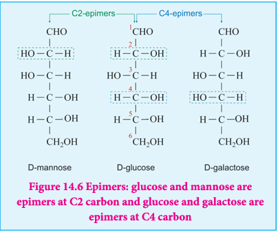

**Figure 14.6 Epimers: glucose and mannose are epimers at C2 carbon and glucose and galactose are epimers at C4 carbon**

#### 14.1.4 Fructose

Fructose is another commonly known monosaccharide having the same molecular formula as glucose. It is levorotatory and a ketohexose. It is present abundantly in fruits and hence it is also called as fruit sugar.

**Preparation**

**1. From sucrose**

Fructose is obtained from sucrose by heating with dilute \(H_2SO_4\) or with the enzyme invertase

$$
C_{12}H_{22}O_{11} + H_2O \xrightarrow{H_2SO_4} C_6H_{12}O_6 + C_6H_{12}O_6
$$

Fructose is separated by crystallisation. The mixture having equal amount of glucose and fructose is termed as invert sugar.

**2. From Inulin**

Fructose is prepared commercially by hydrolysis of Inulin (a polysaccharide) in an acidic medium.

$$
(C_6H_{12}O_5)_n + nH_2O \xrightarrow{H^+} nC_6H_{12}O_6
$$

**Structure of Fructose**

1. Elemental analysis and molecular weight determination of fructose show that it has the molecular formula \(C_6H_{12}O_6\).

2. Fructose on reduction with HI and red phosphorus gives a mixture of n-hexane (major product) and 2-iodohexane (minor product). This reaction indicates that the six carbon atoms in fructose are in a straight chain.

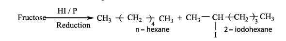

3. Fructose reacts with \(NH_2OH\) and \(HCN\). It shows the presence of a carbonyl groups in the fructose.

4. Fructose reacts with acetic anhydride in the presence of pyridine to form penta acetate. This reaction indicates the presence of five hydroxyl groups in a fructose molecule.

5. Fructose is not oxidized by bromine water. This rules out the possibility of absence of an aldehyde (-CHO) group.

6. Partial reduction of fructose with sodium amalgam and water produces mixtures of sorbitol and mannitol which are epimers at the second carbon. New asymmetric carbon is formed at C-2. This confirms the presence of a keto group.

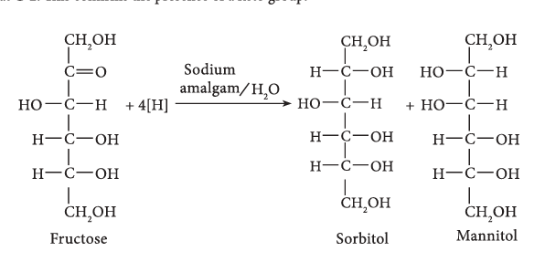

7. On oxidation with nitric acid, it gives glycollic acid and tartaric acids which contain smaller number of carbon atoms than in fructose.

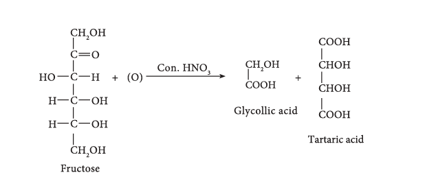

This shows that a keto group is present in C-2. It also shows that 1O alcoholic groups are present at C- 1 and C- 6. Based on these evidences, the following structure is proposed for fructose (Figure 14-7) 

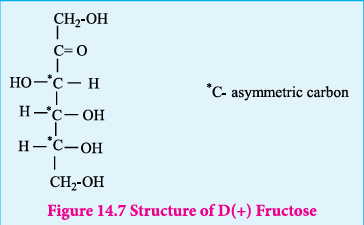

#### Cyclic structure of fructose

Like glucose, fructose also forms cyclic structure. Unlike glucose it forms a five membered
ring similar to furan. Hence it is called furanose form. When fructose is a component of a
saccharide as in sucrose, it usually occurs in furanose form. 

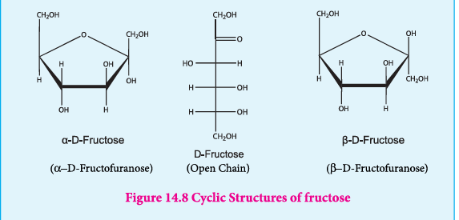

#### 14.1.5 Disaccharides

Disaccharides are sugars that yield two molecules of monosaccharides on hydrolysis. This reaction is usually catalysed by dilute acid or enzyme. Disaccharides have general formula \(C_n(H_2O)_{n-1}\). In disaccharides two monosaccharides are linked by oxide linkage called 'glycosidic linkage', which is formed by the reaction of the anomeric carbon of one monosaccharide with a hydroxyl group of another monosaccharide.

Example: Sucrose, Lactose, Maltose

**Sucrose:** Sucrose, commonly known as table sugar is the most abundant disaccharide. It is obtained mainly from the juice of sugar cane and sugar beets. Insects such as honey bees have the enzyme called invertases that catalyzes the hydrolysis of sucrose to a glucose and fructose mixture. Honey in fact, is primarily a mixture of glucose, fructose and sucrose.

On hydrolysis sucrose yields equal amount of glucose and fructose units.

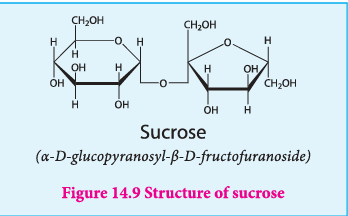

**Figure 14.9 Structure of sucrose**

$$
\text{Sucrose} \xrightarrow{\text{Invertase}} \text{Glucose + Fructose}
$$

Sucrose \((+66.6^{\circ})\) and glucose \((+52.5^{\circ})\) are dextrorotatory compounds while fructose is levorotatory \((-92.4^{\circ})\). During hydrolysis of sucrose the optical rotation of the reaction mixture changes from dextro to levo. Hence, sucrose is also called as invert sugar.

**Structure:** In sucrose, C1 of \(\alpha\)-D-glucose is joined to C2 of \(\beta\)-D-fructose. The glycosidic bond thus formed is called \(\alpha\)-1,2 glycosidic bond. Since, both the carbonyl carbons (reducing groups) are involved in the glycosidic bonding, sucrose is a non-reducing sugar.

**Lactose:** Lactose is a disaccharide found in milk of mammals and hence it is referred to as milk sugar. On hydrolysis, it yields galactose and glucose. Here, the \(\beta\)-D-galactose and \(\beta\)-D-glucose are linked by \(\beta\)-1,4 glycosidic bond as shown in the figure 14.10. The aldehyde carbon is not involved in the glycosidic bond hence, it retains its reducing property and is called a reducing sugar.

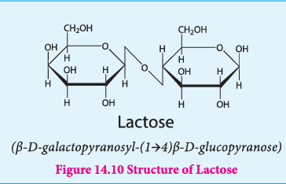

**Figure 14.10 Structure of Lactose** (\(\beta\)-D-galactopyranosyl-(1→4)-\(\beta\)-D-glucopyranose)

**Maltose:** Maltose derives its name from malt from which it is extracted. It is commonly called as malt sugar. Malt from sprouting barley is the major source of maltose. Maltose is produced during digestion of starch by the enzyme \(\alpha\)-amylase.

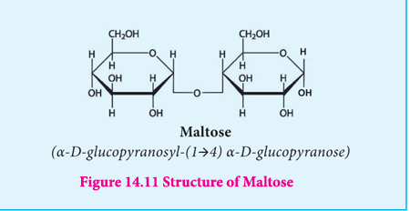

**Figure 14.11 Structure of Maltose** (\(\alpha\)-D-glucopyranosyl-(1→4)-\(\alpha\)-D-glucopyranose)

Maltose consists of two molecules of \(\alpha\)-D-glucose units linked by an \(\alpha\)-1,4 glycosidic bond between anomeric carbon of one unit and C-4 of the other unit. Since one of the glucose has the carbonyl group intact, it also acts as a reducing sugar.

#### 14.1.6 Polysaccharides

Polysaccharides consist of large number of monosaccharide units bonded together by glycosidic bonds and are the most common form of carbohydrates. Since, they do not have sweet taste polysaccharides are called as non-sugars. They form linear and branched chain molecules.

Polysaccharides are classified into two types, namely, homopolysaccharides and heteropolysaccharides depending upon the constituent monosaccharides. Homopolysaccharides are composed of only one type of monosaccharides while the heteropolysaccharides are composed of more than one. Example: starch, cellulose and glycogen (homopolysaccharides); hyaluronic acid and heparin (heteropolysaccharides).

**STARCH**

Starch is used for energy storage in plants. Potatoes, corn, wheat and rice are the rich sources of starch. It is a polymer of glucose in which glucose molecules are linked by \(\alpha(1,4)\) glycosidic bonds. Starch can be separated into two fractions namely, water soluble amylose and water insoluble amylopectin. Starch contains about \(20\%\) of amylose and about \(80\%\) of amylopectin.

Amylose is composed of unbranched chains up to 4000 \(\alpha\)-D-glucose molecules joined by \(\alpha(1,4)\) glycosidic bonds. Amylopectin contains chains up to 10000 \(\alpha\)-D-glucose molecules linked by \(\alpha(1,4)\) glycosidic bonds. In addition, there is a branching from linear chain. At branch points, new chains of 24 to 30 glucose molecules are linked by \(\alpha(1,6)\) glycosidic bonds. With iodine solution amylose gives blue colour while amylopectin gives a purple colour.

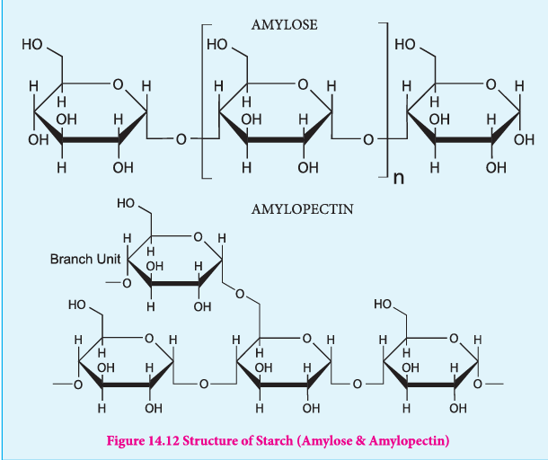

**Figure 14.12 Structure of Starch (Amylose & Amylopectin)**

**Cellulose**

Cellulose is the major constituent of plant cell walls. Cotton is almost pure cellulose. On hydrolysis cellulose yields D-glucose molecules. Cellulose is a straight chain polysaccharide. The glucose molecules are linked by \(\beta(1,4)\) glycosidic bond.

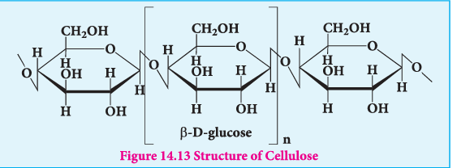

**Figure 14.13 Structure of Cellulose**

Cellulose is used extensively in the manufacturing paper, cellulose fibres, rayon explosive (Gun cotton - Nitrated ester of cellulose) and so on. Human cannot use cellulose as food because our digestive systems do not contain the necessary enzymes (glycosidases or cellulases) that can hydrolyse the cellulose.

**Glycogen**

Glycogen: Glycogen is the storage polysaccharide of animals. It is present in the liver and
muscles of animals. Glycogen is also called as animal starch. On hydrolysis it gives glucose
molecules. Structurally, glycogen resembles amylopectin with more branching. In glycogen
the branching occurs every 8-14 glucose units opposed to 24-30 units in amylopectin. The
excessive glucose in the body is stored in the form of glycogen.

#### 14.1.7 Importance of carbohydrates

1. Carbohydrates, widely distributed in plants and animals, act mainly as energy sources and structural polymers.
2. Carbohydrate is stored in the body as glycogen and in plant as starch.
3. Carbohydrates such as cellulose which is the primary components of plant cell wall, is used to make paper, furniture (wood) and cloths (cotton)
4. Simple sugar glucose serves as an instant source of energy.
5. Ribose sugars are one of the components of nucleic acids.
6. Modified carbohydrates such as hyaluronate (glycosaminoglycans) act as shock absorber and lubricant.

### 14.2 Proteins

Proteins are most abundant biomolecules in all living organisms. The term protein is derived from Greek word 'Proteious' meaning primary or holding first place. They are main functional units for the living things. They are involved in every function of the cell including respiration. Proteins are polymers of \(\alpha\)-amino acids.

#### 14.2.1 Amino acids

Amino acids are compounds which contain an amino group and a carboxylic acid group. The protein molecules are made up of \(\alpha\)-amino acids which can be represented by the following general formula.

$$
R-CH(COOH)-NH_2
$$

There are 20 \(\alpha\)-amino acids commonly found in the protein molecules. Each amino acid is given a trivial name, a three letter code and a one letter code. In writing the amino acid sequence of a protein, generally either one letter or three letter codes are used.

#### 14.2.2 Classification of \(\alpha\)-amino acids

The amino acids are classified based on the nature of their R groups commonly known as side chain. They can be classified as acidic, basic and neutral amino acids. They can also be classified as polar and non-polar (hydrophobic) amino acids.

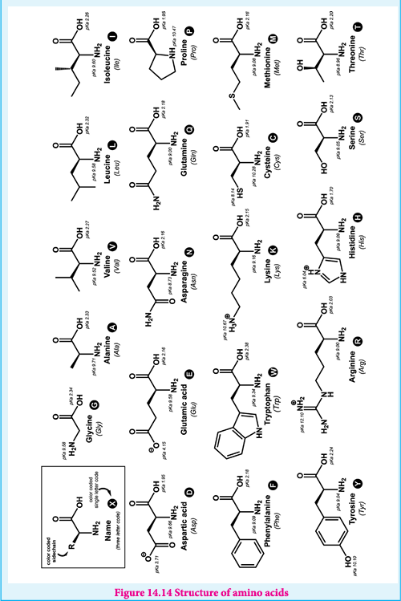

Amino acids can also be classified as essential and non-essential amino acids based on the ability to be synthesised by the human. The amino acids that can be synthesised by us are called non-essential amino acids (Gly, Ala, Glu, Asp, Gln, Asn, Ser, Cys, Tyr & Pro) and those needs to be obtained through diet are called essential amino acids (Phe, Val, Thr, Trp, Ile, Met, His, Arg, Leu and Lys). These ten essential amino acids can be memorised by mnemonic called PVT TIM HALL.

Although the vast majority of plant and animal proteins are formed by these 20 \(\alpha\) amino acids, many other amino acids are also found in the cells. These amino acids are called as non-protein amino acids. Example: ornithine and citrulline (components of urea cycle where ammonia is converted into urea)

#### 14.2.3 Properties of amino acid

Amino acids are colourless, water soluble crystalline solids. Since they have both carboxyl group and amino group their properties differ from regular amines and carboxylic acids. The carboxyl group can lose a proton and become negatively charged or the amino group can accept a proton to become positively charged depending upon the pH of the solution. At a specific pH the net charge of an amino acid is neutral and this pH is called isoelectric point. At a pH above the isoelectric point the amino acid will be negatively charged and positively charged at pH values below the isoelectric point.

In aqueous solution the proton from carboxyl group can be transferred to the amino group of an amino acid leaving these groups with opposite charges. Despite having both positive and negative charges this molecule is neutral and has amphoteric behaviour. These ions are called zwitter ions.

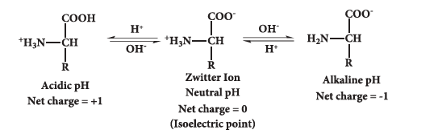

Except glycine all other amino acids have at least one chiral carbon atom and hence are optically active. They exist in two forms namely D and L amino acids. However, L-amino acids are used predominantly by the living organism for synthesising proteins. Presence of D-amino acids has been observed rarely in certain organisms.

#### 14.2.4 Peptide bond formation

The amino acids are linked covalently by peptide bonds. The carboxyl group of the first amino acid react with the amino group of the second amino acid to give an amide linkage between these amino acids. This amide linkage is called peptide bond. The resulting compound is called a dipeptide. Addition of another amino acid to this dipeptide a second peptide bond results in tripeptide. Thus we can generate tetra peptide, penta peptide etc... When you have more number of amino acids linked this way you get a polypeptide. If the number of amino acids are less it is called as a polypeptide, if it has large number of amino acids (and preferably has a function) then it is called a protein.

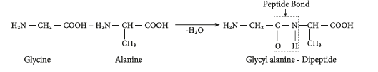

The amino end of the peptide is known as N-terminal or amino terminal while the carboxy end is called C-terminal or carboxy terminal. In general protein sequences are written from N-Terminal to C-Terminal. The atoms other than the side chains (R-groups) are called main chain or the back bone of the polypeptide.

#### 14.2.5 Classification of proteins

Proteins are classified based on their structure (overall shape) into two major types. They are fibrous proteins and globular proteins.

**Fibrous proteins**

Fibrous proteins are linear molecules similar to fibres. These are generally insoluble in water and are held together by disulphide bridges and weak intermolecular hydrogen bonds. The proteins are often used as structural proteins. Example: Keratin, Collagen etc...

**Globular proteins**

Globular proteins have an overall spherical shape. The polypeptide chain is folded into a spherical shape. These proteins are usually soluble in water and have many functions including catalysis (enzyme). Example: myoglobin, insulin

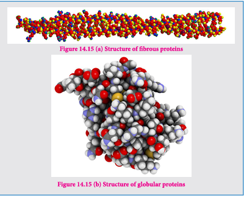

**Figure 14.15 (b) Structure of globular proteins**

#### 14.2.6 Structure of proteins

Proteins are polymers of amino acids. Their three dimensional structure depends mainly on the sequence of amino acids (residues). The protein structure can be described at four hierarchal levels called primary, secondary, tertiary and quaternary structures as shown in the figure 14.16

**1. Primary structure of proteins:**

Proteins are polypeptide chains, made up of amino acids connected through peptide bonds. The relative arrangement of the amino acids in the polypeptide chain is called the primary structure of the protein. Knowledge of this is essential as even small changes have potential to alter the overall structure and function of a protein.

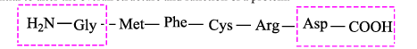

**2. Secondary structure of proteins:**

The amino acids in the polypeptide chain forms highly regular shapes (sub-structures) through the hydrogen bond between the carbonyl oxygen \((>C=O)\) and the neighbouring amine hydrogen \((-NH)\) of the main chain. \(\alpha\)-Helix and \(\beta\)-strands or sheets are two most common sub-structures formed by proteins.

**\(\alpha\)-Helix**

In the \(\alpha\)-helix sub-structure, the amino acids are arranged in a right handed helical (spiral) structure and are stabilised by the hydrogen bond between the carbonyl oxygen of one amino acid (\(n^{th}\) residue) with amino hydrogen of the fifth residue (\(n+4^{th}\) residue). The side chains of the residues protrude outside of the helix. Each turn of an \(\alpha\)-helix contains about 3.6 residues and is about \(5.4 \ \text{Å}\) long. The amino acid proline produces a kink in the helical structure and often called as a helix breaker due to its rigid cyclic structure.

**\(\beta\)-Strand**

\(\beta\)-Strands are extended peptide chain rather than coiled. The hydrogen bonds occur between main chain carbonyl group of one such strand and the amino group of the adjacent strand resulting in the formation of a sheet like structure. This arrangement is called \(\beta\)-sheets.

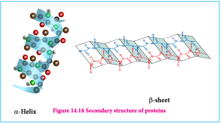

**Figure 14.16 Secondary structure of proteins**

**3. Tertiary structure:**

The secondary structure elements (\(\alpha\)-helix & \(\beta\)-sheets) further folds to form the three dimensional arrangement. This structure is called tertiary structure of the polypeptide (protein). Tertiary structure of proteins are stabilised by the interactions between the side chains of the amino acids. These interactions include the disulphide bridges between cysteine residues, electrostatic, hydrophobic, hydrogen bonds and van der Waals interactions.

**4. Quaternary Structure**

Some proteins are made up of more than one polypeptide chains. For example, the oxygen transporting protein, haemoglobin contains four polypeptide chains while DNA polymerase enzyme that make copies of DNA, has ten polypeptide chains. In these proteins the individual polypeptide chains (subunits) interacts with each other to form the multimeric structure which are known as quaternary structure. The interactions that stabilises the tertiary structures also stabilises the quaternary structures.

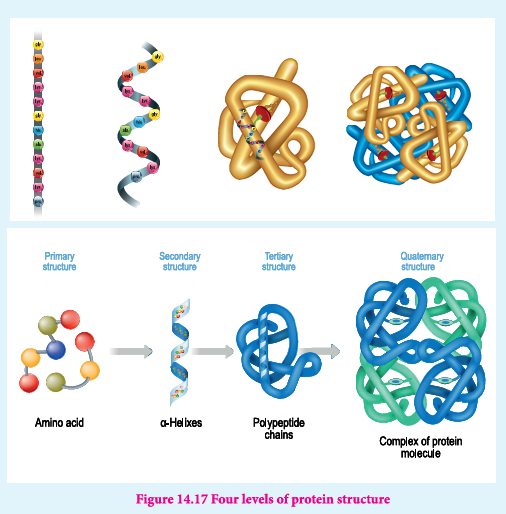

**Figure 14.17 Four levels of protein structure**

#### 14.2.7 Denaturation of proteins

Each protein has a unique three-dimensional structure formed by interactions such as disulphide bond, hydrogen bond, hydrophobic and electrostatic interactions. These interactions can be disturbed when the protein is exposed to a higher temperature, by adding certain chemicals such as urea, alteration of pH and ionic strength etc., It leads to the loss of the three-dimensional structure partially or completely. The process of losing its higher order structure without losing the primary structure, is called denaturation. When a protein denatures, its biological function is also lost.

Since the primary structure is intact, this process can be reversed in certain proteins. This can happen spontaneously upon restoring the original conditions or with the help of special enzymes called chaperons (proteins that help proteins to fold correctly).

Example: coagulation of egg white by action of heat.

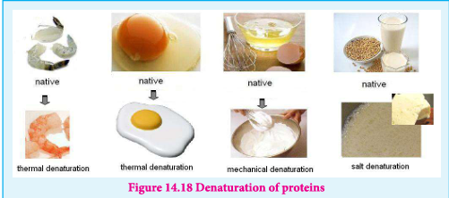

**Figure 14.18 Denaturation of proteins**

#### 14.2.8 Importance of proteins

Proteins are the functional units of living things and play vital role in all biological processes

1. All biochemical reactions occur in the living systems are catalysed by the catalytic proteins called enzymes.
2. Proteins such as keratin, collagen act as structural back bones.
3. Proteins are used for transporting molecules (Haemoglobin), organelles (Kinesins) in the cell and control the movement of molecules in and out of the cells (Transporters).
4. Antibodies help the body to fight various diseases.
5. Proteins are used as messengers to coordinate many functions. Insulin and glucagon control the glucose level in the blood.
6. Proteins act as receptors that detect presence of certain signal molecules and activate the proper response.
7. Proteins are also used to store metals such as iron (Ferritin) etc.

#### 14.2.9 Enzymes

There are many biochemical reactions that occur in our living cells. Digestion of food and harvesting the energy from them, and synthesis of necessary molecules required for various cellular functions are examples for such reactions. All these reactions are catalysed by special proteins called enzymes. These biocatalysts accelerate the reaction rate in the orders of \(10^{5}\) and also make them highly specific. The high specificity is followed allowing many reactions to occur within the cell. For example, the Carbonic anhydrase enzyme catalyses the interconversion of carbonic acid to water and carbon dioxide. Sucrase enzyme catalyses the hydrolysis of sucrose to fructose and glucose. Lactase enzyme hydrolyses the lactose into its constituent monosaccharides, glucose and galactose.

#### 14.2.10 Mechanism of enzyme action

Enzymes are biocatalysts that catalyse a specific biochemical reaction. They generally activate the reaction by reducing the activation energy by stabilising the transition state. In a typical reaction enzyme (E) binds with the substrate (S) molecule reversibly to produce an enzyme-substrate complex (ES). During this stage the substrate is converted into product and the enzyme becomes free, and ready to bind to another substrate molecule. More detailed mechanism is discussed in the unit XI surface chemistry.

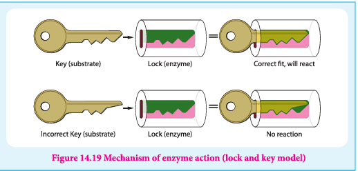

**Figure 14.19 Mechanism of enzyme action (lock and key model)**

### 14.3 Lipids

Lipids are organic molecules that are soluble in organic solvents such as chloroform and methanol and insoluble in water. The word lipid is derived from the Greek word 'lipos' meaning fat. They are the principal components of cell membranes. In addition, they also act as energy source for living systems. Fat provides 2-3 fold higher energy compared to carbohydrates / proteins.

#### 14.3.1 Classification of lipids

Based on their structures lipids can be classified as simple lipids, compound lipids and derived lipids. Simple lipids can be further classified into fats, which are esters of long chain fatty acids with glycerol (triglycerides) and waxes which are the esters of fatty acids with long chain monohydric alcohols (Bees wax).

Compound lipids are the esters of simple fatty acid with glycerol which contain additional groups. Based on the groups attached, they are further classified into phospholipids, glycolipids and lipoproteins. Phospholipids contain a phospho-ester linkage while the glycolipids contain a sugar molecule attached. The lipoproteins are complexes of lipid with proteins.

#### 14.3.2 Biological importance of lipids

1. Lipids are the integral component of cell membrane. They are necessary for structural integrity of the cell.
2. The main function of triglycerides in animals is as an energy reserve. They yield more energy than carbohydrates and proteins.
3. They act as protective coating in aquatic organisms.
4. Lipids of connective tissue give protection to internal organs.
5. Lipids help in the absorption and transport of fat soluble vitamins.
6. They are essential for activation of enzymes such as lipases.
7. Lipids act as emulsifier in fat metabolism.

### 14.4 Vitamins

Vitamins are small organic compounds that cannot be synthesised by our body but are essential for certain functions. Hence, they must be obtained through diet. The requirements of these compounds are not high, but their deficiency or excess can cause diseases. Each vitamin has a specific function in the living system, mostly as co enzymes. They are not served as energy sources like carbohydrates, lipids, etc.,

The name 'Vitamin' is derived from vital amines, referring to the vitamins earlier identified amino compounds. Vitamins are essential for the normal growth and maintenance of our health.

#### 14.4.1 Classification of vitamins

Vitamins are classified into two groups based on their solubility either in water or in fat.

**Fat soluble vitamins:** These vitamins are absorbed best when taken with fatty food and are stored in fatty tissues and livers. These vitamins do not dissolve in water. Hence they are called fat-soluble vitamins. Vitamin A, D, E & K are fat-soluble vitamins.

**Water soluble vitamins:** Vitamins B (\(B_1, B_2, B_3, B_5, B_6, B_7, B_9\) and \(B_{12}\)) and C are readily soluble in water. On the contrary to fat soluble vitamins, these can't be stored. The excess vitamins present will be excreted through urine and are not stored in our body. Hence, these vitamins should be supplied regularly to our body. The missing numbers in B vitamins are once considered as vitamins but no longer considered as such, and the numbers that were assigned to them now form the gaps.

**Table 14.2: Vitamins, their Sources, Functions and their Deficiency disease**

### 14.5 Nucleic acids

The inherent characteristics of each and every species are transmitted from one generation to the next. It has been observed that the particles in nucleus of the cell are responsible for the transmission of these characteristics. They are called chromosomes and are made up of proteins and another type of biomolecules called nucleic acids. There are mainly two types of nucleic acids, the deoxyribonucleic acid (DNA) and ribonucleic acid (RNA). They are the molecular repositories that carry genetic information in every organism.

#### 14.5.1 Composition and structure of nucleic acids

Nucleic acids are biopolymers of nucleotides. Controlled hydrolysis of DNA and RNA yields three components namely a nitrogenous base, a pentose sugar and phosphate group.

**Nitrogen base**

These are nitrogen containing organic compounds which are derivatives of two parent compounds, pyrimidine and purine. Both DNA and RNA have two major purine bases, adenine (A) and guanine (G). In both DNA and RNA, one of the pyrimidines is cytosine (C), but the second pyrimidine is thymine (T) in DNA and uracil (U) in RNA.

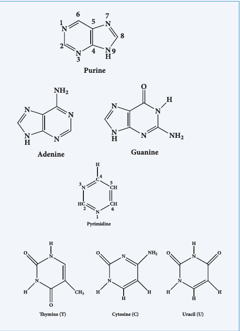

**Pentose sugar**

Nucleic acids have two types of pentoses. The recurring deoxyribonucleotide units of DNA contain 2'-deoxy-D-ribose and the ribonucleotide units of RNA contain D-ribose. In nucleotides, both types of pentoses are in their \(\beta\)-furanose (closed five membered rings) form.

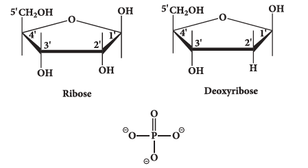

**Phosphate group**

Phosphoric acid forms phospho diester bond between nucleotides. Based on the number of phosphate group present in the nucleotides, they are classified into mononucleotide, dinucleotide and trinucleotide.

**Nucleosides and nucleotides**

The molecule without the phosphate group is called a nucleoside. A nucleotide is derived from a nucleoside by the addition of a molecule of phosphoric acid. Phosphorylation occurs generally in the 5' OH group of the sugar. Nucleotides are linked in DNA and RNA by phospho diester bond between 5' OH group of one nucleotide and 3' OH group on another nucleotide.

$$
\text{Sugar} + \text{Base} \longrightarrow \text{Nucleoside}
$$

$$
\text{Nucleoside} + \text{Phosphoric acid} \longrightarrow \text{Nucleotide}
$$

$$
\text{n Nucleotide} \longrightarrow \text{Polynucleotide (Nucleic Acid)}
$$

#### 14.5.2 Double strand helix structure of DNA

In early 1950s, Rosalind Franklin and Maurice Wilkins used X-ray diffraction to unravel the structure of DNA. The DNA fibers produced a characteristic diffraction pattern.

The central X shaped pattern indicates a helix, whereas the heavy black arcs at the top and bottom of the diffraction pattern reveal the spacing of the stacked bases.

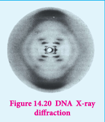

**Figure 14.20 DNA X-ray diffraction**

The structure elucidation of DNA by Watson and Crick in 1953 was a momentous event in science. They postulated a 3-dimensional model of DNA structure which consisted of two antiparallel helical DNA chains wound around the same axis to form a right-handed double helix.

The hydrophilic backbones of alternating deoxyribose and phosphate groups are on the outside of the double helix, facing the surrounding water. The purine and pyrimidine bases of both strands are stacked inside the double helix, with their hydrophobic and ring structures very close together and perpendicular to the long axis, thereby reducing the repulsions between the charged phosphate groups. The offset pairing of the two strands creates a major groove and minor groove on the surface of the duplex.

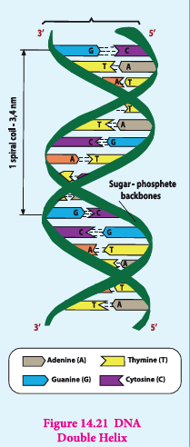

**Figure 14.21 DNA Double Helix**

The model revealed that, there are 10.5 base pairs (36 Å) per turn of the helix and \(3.4 \ \text{Å}\) between the stacked bases. They also found that each base is hydrogen bonded to a base in opposite strand to form a planar base pair.

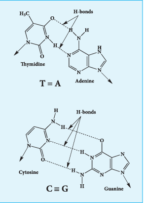

Two hydrogen bonds are formed between adenine and thymine and three hydrogen bonds are formed between guanine and cytosine. Other pairing tends to destabilize the double helical structure. This specific association of the two chains of the double helix is known as complementary base pairing. The DNA double helix or duplex is held together by two forces,
a) Hydrogen bonding between complementary base pairs
b) Base-stacking interactions

The complementarity between the DNA strands is attributable to the hydrogen bonding between base pairs but the base stacking interactions are largely non-specific, make the major contribution to the stability of the double helix.

#### 14.5.3 Types of RNA molecules

Ribonucleic acids are similar to DNA. Cells contain up to eight times high quantity of RNA than DNA. RNA is found in large amount in the cytoplasm and a lesser amount in the nucleus. In the cytoplasm it is mainly found in ribosomes and in the nucleus, it is found in nucleolus.

RNA molecules are classified according to their structure and function into three major types

i. Ribosomal RNA (rRNA)
ii. Messenger RNA (mRNA)
iii. Transfer RNA (tRNA)

**rRNA**

rRNA is mainly found in cytoplasm and in ribosomes, which contain \(60\%\) RNA and \(40\%\) protein. Ribosomes are the sites at which protein synthesis takes place.

**tRNA**

tRNA molecules have lowest molecular weight of all nucleic acids. They consist of 73 - 94 nucleotides in a single chain. The function of tRNA is to carry amino acids to the sites of protein synthesis on ribosomes.

**mRNA**

mRNA is present in small quantity and very short lived. They are single stranded, and their synthesis takes place on DNA. The synthesis of mRNA from DNA strand is called transcription. mRNA carries genetic information from DNA to the ribosomes for protein synthesis. This process is known as translation.

**Table 14.3 Difference between DNA and RNA**

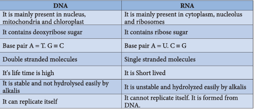

**More to know**

**DNA finger printing**

Traditionally, one of the most accurate methods for placing an individual at the scene of a crime has been a fingerprint. With the advent of recombinant DNA technology, a more powerful tool is now available: DNA fingerprinting (also called DNA typing or DNA profiling). It was first invented by Professor Sir Alec Jeffreys in 1984. The DNA fingerprint is unique for every person and can be extracted from traces of samples from blood, saliva, hair etc... By using this method we can detect the individual specific variation in human DNA.

In this method, the extracted DNA is cut at specific points along the strand with restriction enzymes resulting in the formation of DNA fragments of varying lengths which were analysed by technique called gel electrophoresis. This method separates the fragments based on their size. The gel containing the DNA fragments is then transferred to a nylon sheet using a technique called blotting. Then, the fragments will undergo autoradiography in which they were exposed to DNA probes (pieces of synthetic DNA that were made radioactive and that bound to the fragments). A piece of X-ray film was then exposed to the fragments, and a dark mark was produced at any point where a radioactive probe had become attached. The resultant pattern of marks could then be compared with other samples. DNA fingerprinting is based on slight sequence differences (usually single base-pair changes) between individuals. These methods are proving decisive in court cases worldwide.

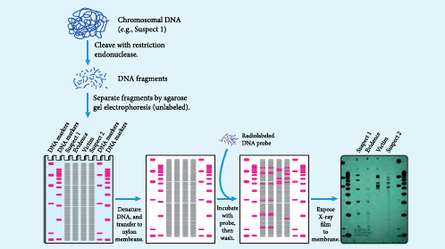

**Figure 14.22 DNA finger printing**

#### 14.5.4 Biological functions of nucleic acids

In addition to their roles as the subunits of nucleic acids, nucleotides have a variety of other functions in every cell such as,

i. Energy carriers (ATP)

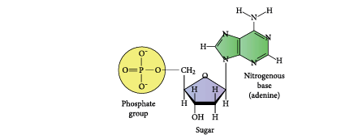

ii. Components of enzyme cofactors (Example: Coenzyme A, NAD\(^+\), FAD)

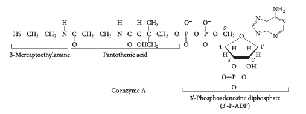

iii. Chemical messengers (Example: Cyclic AMP, cAMP)

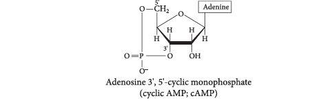

Adenosine \(3',5'\)-cyclic monophosphate (cyclic AMP; cAMP)

### 14.6 HORMONES

Hormone is an organic substance (e.g. a peptide or a steroid) that is secreted by one tissue. It enters the blood stream and induces a physiological response (e.g. growth and metabolism) in other tissues. It is an intercellular signalling molecule. Virtually every process in a complex organism is regulated by one or more hormones: maintenance of blood pressure, blood volume and electrolyte balance, embryogenesis, hunger, eating behaviour, digestion - to name but a few. Endocrine glands, which are special groups of cells, make hormones. The major endocrine glands are the pituitary, pineal, thymus, thyroid, adrenal glands, and pancreas. In addition, men produce hormones in their testes and women produce them in their ovary. Chemically, hormones may be classified as either protein (e.g. insulin, epinephrine) or steroids (e.g. estrogen, androgen). Hormones are classified according to the distance over which they act as, endocrine, paracrine and autocrine hormones.

**Endocrine hormones** act on cells distant from the site of their release. Example: insulin and epinephrine are synthesized and released in the bloodstream by specialized ductless endocrine glands.

**Paracrine hormones** (alternatively, local mediators) act only on cells close to the cell that released them. For example, interleukin-1 (IL-1)

**Autocrine hormones** act on the same cell that released them. For example, protein growth factor interleukin-2 (IL-2).

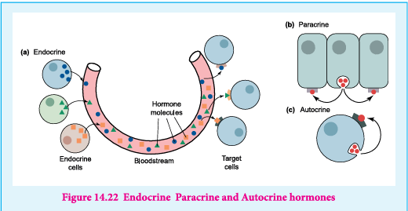

**Figure 14.22 Endocrine Paracrine and Autocrine hormones**

Only those cells with a specific receptor for a given hormone will respond to its presence even though nearly all cells in the body may be exposed to the hormone. Hormonal messages are therefore quite specifically addressed.

## EVALUATION

## Choose the best answer:

1. Which one of the following rotates the plane polarized light towards left? (NEET Phase - II)
   a) D(+) Glucose
   b) L(+) Glucose
   c) D(-) Fructose
   d) D(+) Galactose

2. The correct corresponding order of names of four aldoses with configuration given below respectively is, (NEET Phase - I)
   a) L-Erythrose, L-Threose, L-Erythrose, D-Threose
   b) D-Threose, D-Erythrose, L-Threose, L-Erythrose
   c) L-Erythrose, L-Threose, D-Erythrose, D-Threose
   d) D-Erythrose, D-Threose, L-Erythrose, L-Threose

3. Which one given below is a non-reducing sugar? (NEET Phase - I)
   a) Glucose
   b) Sucrose
   c) Maltose
   d) Lactose

4. Glucose \(\xrightarrow{HCN}\) Product \(\xrightarrow{\text{hydrolysis}}\) Product \(\xrightarrow{HI + \text{Heat}}\) A, the compound A is
   a) Heptanoic acid
   b) 2-Iodohexane
   c) Heptane
   d) Heptanol

5. Assertion: A solution of sucrose in water is dextrorotatory. But on hydrolysis in the presence of little hydrochloric acid, it becomes levorotatory. (AIMS)
   Reason: Sucrose hydrolysis gives equal amounts of glucose and fructose. As a result of this change in sign of rotation is observed.
   a) If both assertion and reason are true and reason is the correct explanation of assertion
   b) If both assertion and reason are true but reason is not the correct explanation of assertion
   c) If assertion is true but reason is false
   d) If both assertion and reason are false

6. The central dogma of molecular genetics states that the genetic information flows from (NEET Phase - II)
   a) Amino acids → Protein → DNA
   b) DNA → Carbohydrates → Proteins
   c) DNA → RNA → Proteins
   d) DNA → RNA → Carbohydrates

7. In a protein, various amino acids linked together by (NEET Phase - I)
   a) Peptide bond
   b) Dative bond
   c) \(\alpha\)-Glycosidic bond
   d) \(\beta\)-Glycosidic bond

8. Among the following the achiral amino acid is (AIIMS)
   a) 2-ethylalanine
   b) 2-methylglycine
   c) 2-hydroxymethylserine
   d) Tryptophan

9. The correct statement regarding RNA and DNA respectively is (NEET Phase - I)
   a) the sugar component in RNA is an arabinose and the sugar component in DNA is ribose
   b) the sugar component in RNA is \(2'\)-deoxyribose and the sugar component in DNA is arabinose
   c) the sugar component in RNA is an arabinose and the sugar component in DNA is \(2'\)-deoxyribose
   d) the sugar component in RNA is ribose and the sugar component in DNA is \(2'\)-deoxyribose

10. In aqueous solution of amino acids mostly exists in,
    a) \(NH_2-CH(R)-COOH\)
    b) \(NH_2-CH(R)-COO^-\)
    c) \(H_3N^+-CH(R)-COOH\)
    d) \(H_3N^+-CH(R)-COO^-\)

11. Which one of the following is not produced by body?
    a) DNA
    b) Enzymes
    c) Hormones
    d) Vitamins

12. The number of \(sp^2\) and \(sp^3\) hybridised carbon in fructose are respectively
    a) 1 and 4
    b) 4 and 2
    c) 5 and 1
    d) 1 and 5

13. Vitamin B2 is also known as
    a) Riboflavin
    b) Thiamine
    c) Nicotinamide
    d) Pyridoxine

14. The pyrimidine bases present in DNA are
    a) Cytosine and Adenine
    b) Cytosine and Guanine
    c) Cytosine and Thymine
    d) Cytosine and Uracil

15. Among the following L-serine is
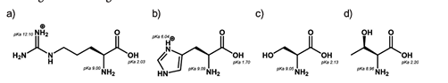

16. The secondary structure of a protein refers to
    a) fixed configuration of the polypeptide backbone
    b) hydrophobic interaction
    c) sequence of \(\alpha\)-amino acids
    d) \(\alpha\)-helical backbone

17. Which of the following vitamins is water soluble?
    a) Vitamin E
    b) Vitamin K
    c) Vitamin A
    d) Vitamin B

18. Complete hydrolysis of cellulose gives
    a) L-Glucose
    b) D-Fructose
    c) D-Ribose
    d) D-Glucose

19. Which of the following statement is not correct?
    a) Ovalbumin is a simple food reserve in egg-white
    b) Blood proteins thrombin and fibrinogen are involved in blood clotting
    c) Denaturation makes protein more active
    d) Insulin maintains the sugar level in the human body

20. Glucose is an aldose. Which one of the following reactions is not expected with glucose?
    a) It does not form oxime
    b) It does not react with Grignard reagent
    c) It does not form osazones
    d) It does not reduce Tollen's reagent

21. If one strand of the DNA has the sequence 'ATGCTTG'A, then the sequence of complementary strand would be
    a) TACGAACT
    b) TCCGAACT
    c) TACGTACT
    d) TACRGAGT

22. Insulin, a hormone chemically is
    a) Fat
    b) Steroid
    c) Protein
    d) Carbohydrate

23. \(\alpha\)-D \((+)\) Glucose and \(\beta\)-D \((+)\) glucose are
    a) Epimers
    b) Anomers
    c) Enantiomers
    d) Conformational isomers

24. Which of the following are epimers
    a) D \((+)\)-Glucose and D \((+)\)-Galactose
    b) D \((+)\)-Glucose and D \((+)\)-Mannose
    c) Neither (a) nor (b)
    d) Both (a) and (b)

25. Which of the following amino acids are achiral?
    a) Alanine
    b) Leucine
    c) Proline
    d) Glycine

## Short Answer Questions

1. What type of linkages hold together monomers of DNA?

2. Give the differences between primary and secondary structure of proteins.

3. Name the Vitamins whose deficiency cause i) rickets ii) scurvy

4. Write the Zwitter ion structure of alanine

5. Give any three difference between DNA and RNA

6. Write a short note on peptide bond

7. Give two difference between Hormones and vitamins

8. Write a note on denaturation of proteins

9. What are reducing and non-reducing sugars?

10. Why carbohydrates are generally optically active?

11. Classify the following into monosaccharides, oligosaccharides and polysaccharides.
    i) Starch
    ii) fructose
    iii) sucrose
    iv) lactose
    v) maltose

12. How are vitamins classified?

13. What are hormones? Give examples

14. Write the structure of all possible dipeptides which can be obtained from glycine and alanine

15. Define enzymes

16. Write the structure of \(\alpha\)-D \((+)\) glucopyranose

17. What are different types of RNA which are found in cell?

18. Write a note on formation of \(\alpha\)-helix.

19. What are the functions of lipids in living organism?

20. Is the following sugar, D-sugar or L-sugar?
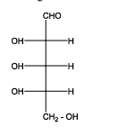
