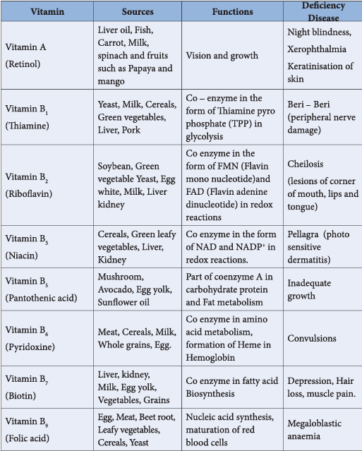
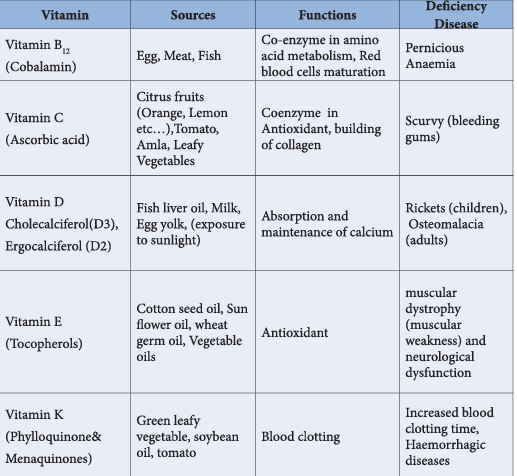

### 14.4 Vitamins

Vitamins are small organic compounds that cannot be synthesised by our body but are essential for certain functions. Hence, they must be obtained through diet. The requirements of these compounds are not high, but their deficiency or excess can cause diseases. Each vitamin has a specific function in the living system, mostly as co enzymes. They are not served as energy sources like carbohydrates, lipids, etc.,

The name 'Vitamin' is derived from vital amines, referring to the vitamins earlier identified amino compounds. Vitamins are essential for the normal growth and maintenance of our health.

#### 14.4.1 Classification of vitamins

Vitamins are classified into two groups based on their solubility either in water or in fat.

**Fat soluble vitamins:** These vitamins are absorbed best when taken with fatty food and are stored in fatty tissues and livers. These vitamins do not dissolve in water. Hence they are called fat-soluble vitamins. Vitamin A, D, E & K are fat-soluble vitamins.

**Water soluble vitamins:** Vitamins B (\(B_1, B_2, B_3, B_5, B_6, B_7, B_9\) and \(B_{12}\)) and C are readily soluble in water. On the contrary to fat soluble vitamins, these can't be stored. The excess vitamins present will be excreted through urine and are not stored in our body. Hence, these vitamins should be supplied regularly to our body. The missing numbers in B vitamins are once considered as vitamins but no longer considered as such, and the numbers that were assigned to them now form the gaps.

**Table 14.2: Vitamins, their Sources, Functions and their Deficiency disease**

