# 12. CARBONYL COMPOUNDS AND CARBOXYLIC ACIDS

**Adolf von Baeyer**

Adolf Von Baeyer, German research chemist who synthesized indigo (1880) and formulated its structure (1883). He was awarded the Nobel Prize for Chemistry in 1905. Notable among Baeyer's many achievements were the discovery of the phthalein dyes and his investigations of uric acid derivatives, polyacetylenes, and oxonium salts. One derivative of uric acid that he discovered was barbituric acid, the parent compound of the sedative-hypnotic drugs known as barbiturates.

**Learning Objectives**

● After studying this unit the student will be
able to

● describes the important methods of preparation and reactions of Carbonyl compounds

● explains the mechanism of Nucleophilic addition reaction of carbonyl compounds

● describes the preparation and chemical reactions of carboxylic acids and its derivatives

● list the uses of aldehydes, ketones and carboxylic acids

## INTRODUCTION

We come across many organic compounds containing a

 group in our everyday Life. Biomolecules such as protein, carbohydrate etc… that makeup all plants and animals contains carbonyl group. They play an important role in the metabolic process. For example, pyridoxal, an aldehyde derived from vitamin B, function as a co –enzyme. Carbonyl compounds are important constituents of fabrics, plastics and drugs. For example, Formaldehyde is used for the manufacture of Bakelite and paracetamol, (p– acetylated aminophenol) a drug used to reduce fever, contains a carbonyl group. In this unit, we will learn the preparation, properties and uses of aldhydes, ketones and carboxylic acids.

### 12.1 Nomenclature of Aldehydes and ketones

We have already learnt the IUPAC system of nomenclature of organic compounds in \(XI^{\mathrm{th}}\) standard. Let us apply the rules to name the following compounds.
| Compound (common name, Structural formula, IUPAC Name) |        **IUPAC Name**       |           |                |                  |
| :----------------------------------------------------: | :-------------------------: | :-------: | :------------: | :--------------: |
|                                                        | Prefix with position number | Root used | Primary suffix | Secondary Suffix |
| Formaldehyde H – CHO methanal | — | meth | ane | al |
| Acetaldehyde CH₃ – CHO ethanal | — | eth | ane | al |
| Acrolein CH₂ = CH – CHO prop – 2- enal | — | prop | 2-ene | al |
| Crotonaldehyde CH₃ – CH = CH – CHO but – 2 – enal | — | but | 2-ene | al |
| Glyceraldehyde HO — CH₂ — CH — CHO &nbsp;&nbsp;&nbsp;&nbsp;&nbsp;&nbsp;&nbsp;&nbsp;&nbsp;&nbsp;&nbsp;&nbsp;&nbsp;&nbsp;&nbsp;&nbsp;&nbsp;&nbsp;&nbsp;\| &nbsp;&nbsp;&nbsp;&nbsp;&nbsp;&nbsp;&nbsp;&nbsp;&nbsp;&nbsp;&nbsp;&nbsp;&nbsp;&nbsp;&nbsp;&nbsp;&nbsp;OH 2, 3 – dihydroxy propanal | 2, 3 dihydroxy | prop | ane | al |
| Benzaldehyde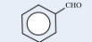phenyl methanal | phenyl | meth | ane | al |
| Acetone / Dimethyl ketone CH₃ – CO – CH₃ propanone | – | prop | ane | one |
| Mesityl oxide (CH₃)₂C = CHCOCH₃ 4 – methylpent-3-en-2-one | 4 – methyl | pent | 3-ene | 2-one |
| Methyl Phenyl ketone C₆H₅ — C — CH₃ &nbsp;&nbsp;&nbsp;&nbsp;&nbsp;&nbsp;&nbsp;&nbsp;&nbsp;&nbsp;&nbsp;\|\| &nbsp;&nbsp;&nbsp;&nbsp;&nbsp;&nbsp;&nbsp;&nbsp;&nbsp;&nbsp;&nbsp;O Acetophenone (PIN)* 1-phenylethan-1-one | 1-phenyl | eth | ane | 1-one |
| Diphenyl ketone C₆H₅ — C — C₆H₅ &nbsp;&nbsp;&nbsp;&nbsp;&nbsp;&nbsp;&nbsp;&nbsp;&nbsp;&nbsp;&nbsp;\|\| &nbsp;&nbsp;&nbsp;&nbsp;&nbsp;&nbsp;&nbsp;&nbsp;&nbsp;&nbsp;&nbsp;O Benzophenoxe (PIN)* Diphenylmethanone | Diphenyl | meth | ane | one |
| &nbsp;&nbsp;&nbsp;&nbsp;&nbsp;&nbsp;&nbsp;&nbsp;&nbsp;&nbsp;&nbsp;&nbsp;&nbsp;&nbsp;&nbsp;&nbsp;&nbsp;&nbsp;O &nbsp;&nbsp;&nbsp;&nbsp;&nbsp;&nbsp;&nbsp;&nbsp;&nbsp;&nbsp;&nbsp;&nbsp;&nbsp;&nbsp;&nbsp;&nbsp;&nbsp;&nbsp;\|\| CH₃— CH₂ — C — CH₂ —CHO 3 - oxopentanal | 3 - oxo | pent | ane | al |
| 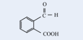 2 – formylbenzoicacid | 2 – formyl | benz | - | oicacid |
| 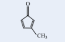 3 -methylcyclopent–2,4-dien-1-one | 3 -methyl | cyclopent | 2, 4 diene | 1-one |

> **Evaluate yourself**
>
> i) Write the IUPAC name for the following compound
>
> i) 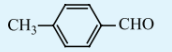
> ii) $(\text{CH}_3)_2\text{C}=\text{CHCOCH}_3$
>
> iii)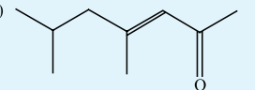
> iv) $(\text{CH}_3)_2\text{C}(\text{OH})\text{CH}_2\text{CHO}$
>
>ii) Wrtie all possible structural isomers and position isomers for the ketone represented by the molecular formula C₅H₁₀O.

### 12.2 Structure of carbonyl group

The carbonyl carbon 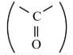 is \(sp^2\) hybridised and the carbon - oxygen bond is similar to carbon - carbon double bond in alkenes. The carbonyl carbon forms three \(\sigma\) bonds using their three \(sp^2\) hybridised orbital. One of the sigma bond is formed with oxygen and the other two with hydrogen and carbon (in aldehydes) or with two carbons (in ketones). All the three \(\sigma\) bonded atoms are lying on the same plane as shown in the fig (12.1). The fourth valence electron of carbon remains in its unhybridised \(2p\) orbital which lies perpendicular to the plane and it overlaps with \(2p\) orbital of oxygen to form a carbon - oxygen \(\pi\) bond. The oxygen atom has two nonbonding pairs of electrons, which occupy its remaining two p-orbitals. Oxygen, the second most electro negative atom attracts the shared pair of electron between the carbon and oxygen towards itself and hence the bond is polar. This polarisation contributes to the reactivity of aldehydes and ketones.

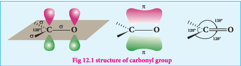

### 12.3 General methods of preparation of aldehydes and ketones

**A. Preparation of aldehydes and ketones**

**1.) Oxidation and catalytic dehydrogenation of alcohols**

We have already learnt that the oxidation of primary alcohol gives aldehydes and secondary alcohol gives a ketone. Oxidising agents such as acidified \(Na_2Cr_2O_7\), \(KMnO_4\), PCC are used for oxidation. Oxidation using PCC yield aldehydes. Other oxidising agents further oxidise the aldehydes / ketones into carboxylic acids (Refer Unit No. - 11 Oxidation of alcohols)

When vapours of alcohols are passed over heavy metal catalyst such as Cu, Ag, alcohols give aldehydes and ketones. (Refer Unit No. - 11 Catalytic dehydrogenation of alcohols)

**2.) Ozonolysis of alkenes**

We have already learnt in XI th standard that the reductive ozonolysis of alkenes gives aldehydes and ketones.

Alkenes react with ozone to form ozonide which on subsequent cleavage with zinc and water gives aldehydes and ketones. Zinc dust removes \(H_2O_2\) formed, which otherwise can oxidise aldehydes / ketones.

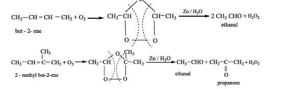

Terminal olefines give formaldehyde as one of the product.

> **Evaluate yourself - 1**
>
>What happens when the following alkenes are subjected to reductive ozonolysis.
>
>1) propene
>2) 1-Butene
>3) Isobutylene

**3. Hydration of alkynes**

We have already learnt in XI standard that the hydration of alkynes in presence of \(40\%\) dilute sulphuric acid and \(1\%\) \(HgSO_4\) to give the corresponding aldehydes / ketones.

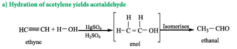

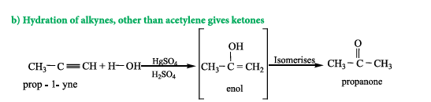

**4. From calcium salts of carboxylic acids**

Aldehydes and ketones may be prepared by the dry distillation of calcium salts of carboxylic acids.

**a) Aldehydes** are obtained when the mixture of calcium salt of carboxylic acid and calcium formate is subjected to dry distillation.

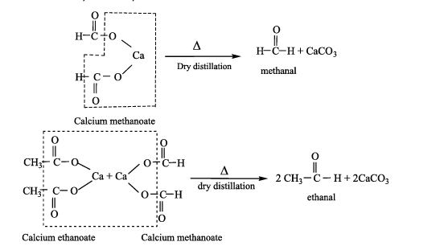

**b) Symmetrical** ketones can be obtained by dry distillation of the calcium salt of carboxylic acid (except formic acid)

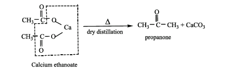
**B. Preparation of aldehydes**

 **1. Rosenmund reduction**

a) Aldehydes can be prepared by the hydrogenation of acid chloride, in the presence of palladium supported by barium sulphate. This reaction is called Rosenmund reduction.

> **Example**
>$$ \text{CH}_3-\overset{\overset{\text{O}}{\text{||}}}{\text{C}}-\text{Cl} + \text{H}_2 \xrightarrow{\text{Pd/ BaSO}_4} \text{CH}_3-\overset{\overset{\text{O}}{\text{||}}}{\text{C}}-\text{H} + \text{HCl} $$
>
> $$\quad\quad\text{Acetyl chloride}\quad\quad\quad\quad\quad\quad\quad\quad\quad\text{Acetaldehyde}$$
> 
> 
> In this reaction, barium sulphate act as a catalytic poison to palladium catalyst, so that aldehyde cannot be further reduced to alcohol.
> Formaldehyde and ketones cannot be prepared by this method.

**2. Stephen's reaction**

When alkylcyanides are reduced using \(SnCl_2/HCl\), imines are formed, which on hydrolysis gives corresponding aldehyde.
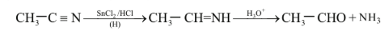

**3. Selective reduction of cyanides**

Diisobutyl aluminium hydride (DIBAL-H) selectively reduces the alkyl cyanides to form imines which on hydrolysis gives aldehydes.

> **Example**
> $$\text{CH}_3-\text{CH}=\text{CH}-\text{CH}_2-\text{CH}_2-\text{CN} \xrightarrow[\text{ii) H}_2\text{O}]{\text{i) AlH(iso-butyl)}_2} \text{CH}_3-\text{CH}=\text{CH}-\text{CH}_2-\text{CH}_2-\text{CHO}$$
> 
> 
> $$\quad\quad\quad\text{hex - 4- enenitrile}\quad\quad\quad\quad\quad\quad\quad\quad\quad\quad\quad\quad\quad\quad\text{hex - 4- enal}$$
> 

**C) Preparation of benzaldehyde**

1) **Side chain oxidation of toluene and its derivatives** by strong oxidising agents such as \(KMnO_4\) gives benzoic acid.

When chromylchloride is used as an oxidising agent, toluene gives benzaldehyde. This reaction is called Etard reaction. Acetic anhydride and \(CrO_3\) can also be used for this reaction.

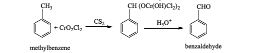

Oxidation of toluene by chromic oxide gives benzylidine diacetate which on hydrolysis
gives benzaldehyde.

**2. Gattermann - Koch reaction**

This reaction is a variant of Friedel - Crafts acylation reaction. In this method, reaction of carbon monoxide and HCl generate an intermediate which reacts like formyl chloride.

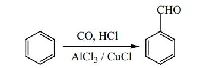

**3. Manufacture of benzaldehyde from toluene**

Side chain chlorination of toluene gives benzal chloride, which on hydrolysis gives benzaldehyde.

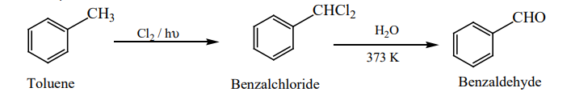

This is the commercial method for the manufacture of benzaldehyde.

**D) Preparation of ketones**

1) **Ketones** can be prepared by the action of acid chloride with dialkyl cadmium.
>**Example**
>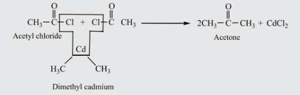

**2) Preparation of phenyl ketones**

**Friedel – Crafts acylation**

It is the best method for preparing alkyl aryl ketones or diaryl ketones. This reaction succeeds only with benzene and activated benzene derivatives.

>**Example**
>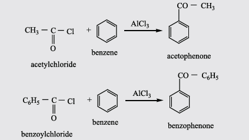

### 12.4 Physical properties of aldehydes and ketones

1. **Physical State:** Formaldehyde is a gas at room temperature and acetaldehyde is a volatile liquid. All other aldehydes and ketones up to \(C_{11}\) are colourless liquids while the higher ones are solids.

2. **Boiling points**

Aldehydes and ketones have relatively high boiling point as compared to hydrocarbons and ethers of comparable molecular mass. It is due to the weak molecular association in aldehydes and ketones arising out of the dipole-dipole interactions.

These dipole-dipole interactions are weaker than intermolecular H-bonding. The boiling points of aldehydes and ketones are much lower than those of corresponding alcohols and carboxylic acids which possess inter molecular hydrogen bonding.

Here are the transcribed tables from the image formatted in Markdown:

| Compound | Molar mass | Boiling point (K) |
| --- | --- | --- |
| $\text{CH}_3(\text{CH}_2)_3\text{CH}_3$  Pentane | 72 | 309 |
| $\text{CH}_3(\text{CH}_2)_2\text{CHO}$  butanal | 72 | 349 |
| $\text{CH}_3(\text{CH}_2)_3\text{OH}$  butanol | 74 | 391 |

| Compound | Molar mass | Boiling point (K) |
| --- | --- | --- |
| $\text{CH}_3\text{CH}_2\text{COCH}_3$  butan - 2- one | 72 | 353 |
| $\text{CH}_3\text{CH}_2\text{COOH}$  Propanoicacid | 74 | 414 |
|  |  |  |

3. **Solubility**

Lower members of aldehydes and ketones like formaldehyde, acetaldehyde and acetone are miscible with water in all proportions because they form hydrogen bond with water.

Solubility of aldehydes and ketones decreases rapidly on increasing the length of alkyl chain.

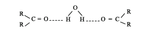

4. **Dipole moment:**

The carbonyl group of aldehydes and ketones contains a double bond between carbon and oxygen. Oxygen is more electronegative than carbon and it attracts the shared pair of electron which makes the carbonyl group as polar and hence aldehydes and ketones have high dipole moments.

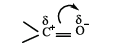

### 12.5 Chemical properties of aldehydes and ketones

**A) Nucleophilic addition reactions**

This reaction is the most common reactions of aldehydes and ketones. The carbonyl carbon carries a small degree of positive charge. Nucleophile such as \(CN^-\) can attack the carbonyl carbon and uses its lone pair to form a new carbon – nucleophile \(\sigma\) bond, at the same time two electrons from the carbon – oxygen double bond move to the most electronegative oxygen atom. This results in the formation of an alkoxide ion. In this process, the hybridisation of carbon changes from \(sp^2\) to \(sp^3\).

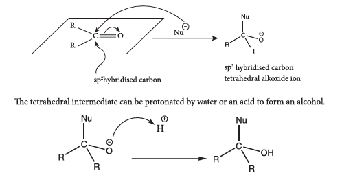

In general, aldehydes are more reactive than ketones towards nucleophilic addition reactions due to \(+I\) and steric effect of alkyl groups.

**Examples**

**1) Addition of HCN**

Attack of \(CN^-\) on carbonyl carbon followed by protonation gives cyanohydrins.

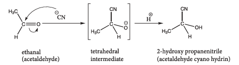

The cyanohydrins can be converted into hydroxy acid by acid hydrolysis. Reduction of cyanohydrins gives hydroxy amines.

**2) Addition of $NaHSO_3$**

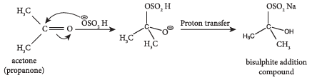

This reaction finds application in the separation and purification of carbonyl compound. The bisulphate addition compound is water soluble and the solution is treated with mineral acid to regenerate the carbonyl compounds.

**3) Addition of alcohol**

When aldehydes / ketones is treated with 2 equivalents of an alcohol in the presence of an acid catalyst to form acetals.

**Example**

When acetaldehyde is treated with 2 equivalent of methanol in presence of HCl, 1,1-dimethoxyethane is obtained.

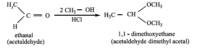

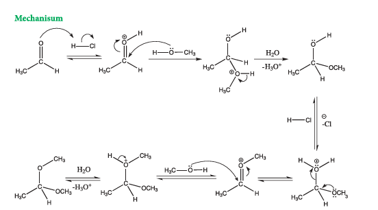

**4) Addition of ammonia and its derivatives**

When the nucleophiles, such as ammonia and its derivative $\text{H}_2\ddot{\text{N}}\text{-G}$ is treated with carbonyl compound, nucleophilic addition takes place, the carbonyl oxygen atom is protonated and then elimination takes place to form carbon - nitrogen double bond \((>C=N-G)\)

When G = alkyl, aryl, OH, \(NH_2\), \(C_6H_5NH\), NHCONH, etc...

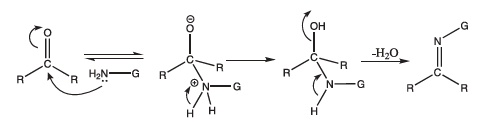

| **G** | **Ammonia derivatives** | **Carbonyl derivatives** | **Product name** |
|:---:|:---:|:---:|:---:|
| —OH | Hydroxyl amine | >C = N—OH | Oxime |
| —NH₂ | Hydrazine | >C = N—NH₂ | Hydrazone |
| —HN—C₆H₅ | Phenyl hydrazine | >C = N—NH—C₆H₅ | Phenyl hydrazone |
| 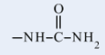 | Hydrazinecarboxamide | 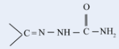| -carboxamide |
| 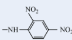| 2,4-Dinitrophenyl hydrazine | 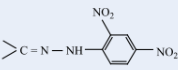 | 2,4-Dinitrophenyl hydrazone |

**i) Reaction with hydroxyl amine**

Aldehyde and ketones react with hydroxylamine to form oxime.

>**Example:**
>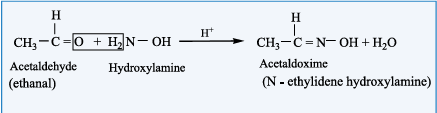

**ii) Reaction with hydrazine**

Aldehydes and ketones react with hydrazine to form hydrazone.

>**Example:**
>
>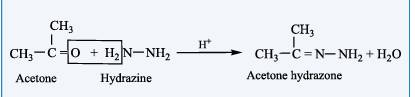

**iii) Reaction with phenyl hydrazine**

Aldehydes and ketones react with phenyl hydrazine to form phenyl hydrazone.

>**Example:**
>
>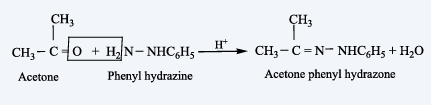

**5) Reaction with \(NH_3\)**

i) Aliphatic aldehydes (except formaldehyde) react with an ethereal solution of ammonia to form aldimines.

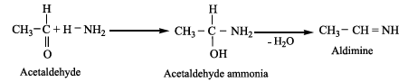

ii) Formaldehyde reacts with ammonia to form hexa methylene tetramine, which is also known as Urotropine.
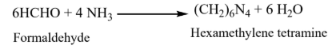
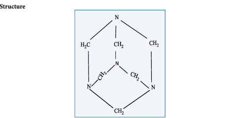

**Uses**

(i) Urotropine is used as a medicine to treat urinary infection.

(ii) Nitration of Urotropine under controlled condition gives an explosive RDX (Research and development explosive). It is also called cyclonite or cyclotri methylene trinitramine.

iii) Acetone reacts with ammonia to form diacetone amine.

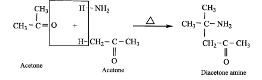

iv) Benzaldehyde form a complex condensation product with ammonia.

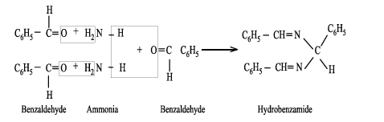

**B) Oxidation of aldehydes and ketones**

**a) Oxidation of aldehydes**

Aldehydes are easily oxidised to carboxylic acid containing the same number of carbon atom, as in parent aldehyde. The common oxidising agents are acidified \(K_2Cr_2O_7\), acidic or alkaline \(KMnO_4\) or chromic oxide.

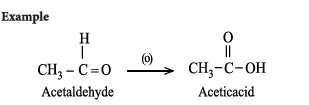

**b) Oxidation of ketone**

Ketones are not easily oxidised. Under drastic condition or with powerful oxidising agent like Conc. \(HNO_3\), \(H^+/KMnO_4\), \(H^+/K_2Cr_2O_7\), cleavage of carbon-carbon bond takes place to give a mixture of carboxylic acids having less number of carbon atom than the parent ketone.

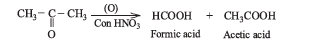

The oxidation of unsymmetrical ketones is governed by **Popoff's rule**. It states that during the oxidation of an unsymmetrical ketone, a (C–CO) bond is cleaved in such a way that the keto group stays with the smaller alkyl group.

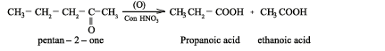

**C) Reduction reactions**

**i) Reduction to alcohols**

We have already learnt that aldehydes and ketones can be easily reduced to primary and secondary alcohols respectively. The most commonly used reducing agents are Lithium Aluminium hydride \((LiAlH_4)\), and Sodium borohydride \((NaBH_4)\).

a) **Aldehyde are reduced to primary alcohols.**

**Example**

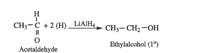

b) **Ketone are reduced to Secondary alcohols.**

**Example**

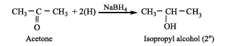

The above reactions can also be carried out with hydrogen in the presence of metal catalyst like Pt, Pd, or Ni. \(LiAlH_4\) and \(NaBH_4\) do not reduce isolated carbon - carbon double bonds and double bond of benzene rings. In case of \(\alpha,\beta\) unsaturated aldehyde and ketones, \(LiAlH_4\) reduces only \(C=O\) group leaving \(C=C\) bond as such.

**ii) Reduction to hydrocarbon**

The carbonyl group of aldehydes and ketones can be reduced to methylene group using suitable reducing agents to give hydrocarbons.

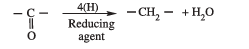

**a) Clemmensen reduction**

Aldehydes and Ketones when heated with zinc amalgam and concentrated hydrochloric acid gives hydrocarbons.

**Example**

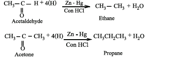

**b) Wolff Kishner reduction**

Aldehydes and Ketones when heated with hydrazine \((NH_2NH_2)\) and sodium ethoxide, hydrocarbons are formed. Hydrazine acts as a reducing agent and sodium ethoxide as a catalyst.

**Example**

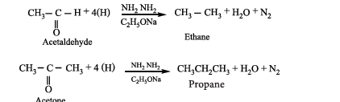

Aldehyde (or) ketone is first converted to its hydrazone which on heating with strong base gives hydrocarbons.

**iii) Reduction to pinacols:** Ketones, on reduction with magnesium amalgam and water, are reduced to symmetrical diols known as pinacol.

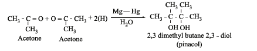

**D) Haloform reaction**

Acetaldehyde and methyl ketones, containing  $$\text{CH}_3\text{-}\underset{\substack{\vert{}\vert{}\\\text{O}}}{\text{C}}\text{-}$$ group , when treated with halogen and alkali give the corresponding haloform. This is known as Haloform reaction.

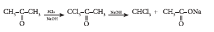

**E) Reaction involving alkyl group**

**i) Aldol condensation**

The carbon attached to carbonyl carbon is called \(\alpha\)-carbon and the hydrogen atom attached to \(\alpha\)-carbon is called \(\alpha\)-hydrogen.

In presence of dilute base NaOH, or KOH, two molecules of an aldehyde or ketone having \(\alpha\)-hydrogen add together to give \(\beta\)-hydroxy aldehyde (aldol) or \(\beta\)-hydroxy ketone (ketol). The reaction is called aldol condensation reaction. The aldol or ketol readily loses water to give \(\alpha,\beta\)-unsaturated compounds which are aldol condensation products.

a) Acetaldehyde when warmed with dil NaOH gives \(\beta\)-hydroxy butyraldehyde (acetaldol)

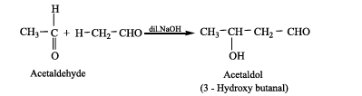

**Mechanism**

The mechanism of aldol condensation of acetaldehyde takes place in three steps.

**Step 1:** The carbanion is formed as the \(\alpha\)-hydrogen atom is removed as a proton by the base.

**Step 2:** The carbanion attacks the carbonyl carbon of another unionized aldehyde to form an alkoxide ion.

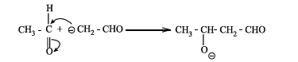

**Step 3:** The alkoxide ion formed is protonated by water to form aldol.

The aldol rapidly undergoes dehydration on heating with acid to form \(\alpha\)-\(\beta\) unsaturated aldehyde.

**ii) Crossed aldol condensation**

Aldol condensation can also take place between two different aldehydes or ketones or between one aldehyde and one ketone. Such an aldol condensation is called crossed or mixed aldol condensation. This reaction is not very useful as the product is usually a mixture of all possible condensation products and cannot be separated easily.

**Example:**

**F) Some important reactions of benzaldehyde**

**i) Claisen-Schmidt Condensation**

Benzaldehyde condenses with aliphatic aldehyde or methyl ketone in the presence of dil. alkali at room temperature to form unsaturated aldehyde or ketone. This type of reaction is called Claisen - Schmidt condensation.

**Example**

**ii) Cannizzaro reaction**

In the presence of concentrated aqueous or alcoholic alkali, aldehydes which do not have \(\alpha\)-hydrogen atom undergo self oxidation and reduction (disproportionation) to give a mixture of alcohol and a salt of carboxylic acid. This reaction is called Cannizzaro reaction.

Benzaldehyde on treatment with concentrated NaOH \((50\%)\) gives benzyl alcohol and sodium benzoate.

This reaction is an example disproportionation reaction

**Mechanism of Cannizaro reaction**

Cannizaro reaction involves three steps.

**Step 1:** Attack of $\text{OH}^{-}$ on the carbonyl carbon.

**Step 2:** Hydride ion transfer

**Step 3:** Acid - base reaction.

Cannizzaro reaction is a characteristic reaction of aldehyde having no \(\alpha\)-hydrogen.

**Crossed Cannizzaro reaction**

When Cannizzaro reaction takes place between two different aldehydes (neither containing an \(\alpha\) hydrogen atom), the reaction is called as crossed cannizzaro reaction.

In crossed cannizzaro reaction more reactive aldehyde is oxidized and less reactive aldehyde is reduced.

**3) Benzoin condensation**

The Benzoin condensation involves the treatment of an aromatic aldehyde with aqueous alcoholic KCN. The products are \(\alpha\) hydroxy ketone.

**Example**

Benzaldehyde reacts with alcoholic KCN to form benzoin

**4) Perkin's reaction**

When an aromatic aldehyde is heated with an aliphatic acid anhydride in the presence of the sodium salt of the acid corresponding to the anhydride, condensation takes place and an \(\alpha,\beta\) unsaturated acid is obtained. This reaction is known as Perkin's reaction.

**Example:**

**5) Knoevenagel reaction**

Benzaldehyde condenses with malonic acid in presence of pyridine forming cinnamic acid. Pyridine act as the basic catalyst.

**6) Reaction with amine**

Aromatic aldehydes react with primary amines (aliphatic or aromatic) in the presence of an acid to form Schiff's base.

**Example**

**7) Condensation with tertiary aromatic amines**

Benzaldehyde condenses with tertiary aromatic amines like N,N-dimethyl aniline in the presence of strong acids to form triphenyl methane dye.

**8) Electrophilic substitution reactions of benzaldehyde**

**Electrophilic substitution reaction of acetophenone**

Acetophenone reacts with Nitrating mixture to form m-nitroacetophenone.

### 12.6 Test for Aldehydes

**i) Tollen's Reagent Test**

Tollen's reagent is an ammonical silver nitrate solution. When an aldehyde is warmed with Tollen's reagent a bright silver mirror is produced due to the formation of silver metal. This reaction is also called **silver mirror test** for aldehydes.

**ii) Fehling's solution Test**

Fehling's solution is prepared by mixing equal volumes of Fehling's solution 'A' containing aqueous copper sulphate and Fehling's solution 'B' containing alkaline solution of sodium potassium tartarate (Rochelle salt)

When aldehyde is warmed with Fehling's solution deep blue colour solution is changed to red precipitate of cuprous oxide.

**iii) Benedict's solution Test:**

Benedict's solution is a mixture of \(CuSO_4\) + sodium citrate + NaOH. \(Cu^{2+}\) is reduced by aldehyde to give red precipitate of cuprous oxide.

**iv) Schiff's reagent Test**

Dilute solution of aldehydes when added to Schiff's reagent (Rosaniline hydrochloride dissolved in water and its red colour decolourised by passing \(SO_2\)) yields its red colour. This is known as **Schiff's test** for aldehydes. Ketones do not give this test. Acetone however gives a positive test but slowly.

### 12.7 Uses of Aldehydes and Ketones

**Formaldehyde**

(i) \(40\%\) aqueous solution of formaldehyde is called **formalin**. It is used for preserving biological specimens.

(ii) Formalin has hardening effect, hence it is used for tanning.

(iii) Formalin is used in the production of thermo setting plastic known as bakelite, which is obtained by heating phenol with formalin.

**Acetaldehyde**

(i) Acetaldehyde is used for silvering of mirrors

(ii) Paraldehyde is used in medicine as a hypnotic.

(iii) Acetaldehyde is used in the commercial preparation of number of organic compounds like acetic acid, ethyl acetate etc.,

**Acetone**

(i) Acetone is used as a solvent, in the manufacture of smokeless gun powder (cordite)

(ii) It is used as a nail polish remover.

(iii) It is used in the preparation of sulphonal, a hypnotic.

(iv) It is used in the manufacture of thermosoftening plastic **Perspex**.

**Benzaldehyde is used**

(i) as a flavoring agent

(ii) in perfumes

(iii) in dye intermediates

(iv) as starting material for the synthesis of several other organic compounds like cinnamaldehyde, cinnamic acid, benzoyl chloride etc.

**Aromatic Ketones**

(i) Acetophenone has been used in perfumery and as a hypnotic under the name **hypnone**.

(ii) Benzophenone is used in perfumery and in the preparation of **benzhydrol eye drop**.

### CARBOXYLIC ACIDS

**Introduction**

Carbon compounds containing a carboxyl functional group, -COOH are called carboxylic acids. The Carboxyl group is the combination of carbonyl group  $\text{–} \underset{\substack{||\text{O}}}{\text{C}} \text{–}$  and the hydroxyl group (-OH). However, carboxyl group has its own characteristic reaction. Carboxylic acids may be aliphatic (R-COOH) or aromatic (Ar-COOH) depending on the alkyl or aryl group attached to carboxylic carbon. Some higher members of aliphatic carboxylic acids \(C_{12}\) to \(C_{18}\) known as fatty acids occur in natural fats as esters of glycerol.

### 12.8 IUPAC nomenclature of Carboxylic acids

| **Compound (common name, Structural formula, IUPAC Name)** |        **IUPAC Name**       |           |                |                  |
| :----------------------------------------------------: | :-------------------------: | :-------: | :------------: | :--------------: |
|                                                        | **Prefix with position number** | **Root used** | **Primary suffix** | **Secondary Suffix** |
| Formic acid  $\text{HCOOH}$  methanoicacid | – | meth | an~~e~~ | oicacid |
| Acetic acid  $\text{CH}_3\text{COOH}$  Ethanoic acid | – | eth | an~~e~~ | oicacid |
| Isobutyric acid  $(\text{CH}_3)_2\text{CHCOOH}$  2 – methylpropanoic acid | 2 – methyl | prop | an~~e~~ | oicacid |
| Phenyl acetic acid2-phenyl ethanoic acid | 2-phenyl | eth | an~~e~~ | oicacid |
| Oxalic acid  $\text{HOOC - COOH}$  ethane-1, 2 – dioicacid | – | eth | ane | 1, 2 –  dioicacid |
| Malonic acid  $\text{HOOC-CH}_2\text{-COOH}$  Propane-1,3-dioic acid | – | prop | ane | 1, 3 –  dioicacid |
| Succinic acid  $\text{HOOC-(CH}_2)_2\text{-COOH}$  Butane-1,4-dioic acid | – | but | ane | 1, 4 –  dioicacid |
| Glutaric acid  $\text{HOOC-(CH}_2)_3\text{-COOH}$  Pentane-1,5-dioic acid | – | pent | ane | 1,5 –  dioicacid |
| Adipic acid  $\text{HOOC-(CH}_2)_4\text{-COOH}$  Hexane-1,6-dioic acid | – | hex | ane | 1,6 –  dioicacid |

### 12.9 Structure of carboxyl group

The carboxyl group represent a planar arrangement of atoms. In -COOH group, the centre carbon atom and both the oxygen atoms are in \(sp^2\) hybridisation. The three \(sp^2\) hybrid orbitals of the carbon atom overlap.

The two \(sp^2\)-hybridised orbitals of the carboxyl carbon overlap with one \(sp^2\) hybridised orbital of each oxygen atom while the third \(sp^2\) hybridised orbital of carbon overlaps with either a s-orbital of H-atom or a \(sp^3\)-hybridised orbital of C-atom of the alkyl group to form three \(\sigma\)-bonds. Each of the two oxygen atoms and the carbon atom are left with one unhybridised p-orbital which is perpendicular to the \(\sigma\)-bonding skeleton.

All these three p-orbitals being parallel overlap to form a \(\pi\)-bond which is partly delocalized between carbon and oxygen atom on one side, and carbon and oxygen of the OH group on the other side. In other words, RCOOH may be represented as a resonance hybrid of the following two canonical structures.

The carboxylic carbon is less electrophilic than carbonyl carbon because of the possible resonance structure. i.e., delocalisation of lone pair electrons from the oxygen in hydroxyl group.

### 12.10 Methods of Preparation of carboxylic acids

Some important methods for the preparation of carboxylic acids are as follows:

**1. From Primary alcohols and aldehydes**

Primary alcohols and aldehydes can easily be oxidised to the corresponding carboxylic acids with oxidising agents such as potassium permanganate (in acidic or alkaline medium), potassium dichromate (in acidic medium)

**Example**

**2. Hydrolysis of Nitriles**

Nitriles yield carboxylic acids when subjected to hydrolysis with an acid or alkali.

**Example**

**3. Acidic hydrolysis of esters**

Esters on hydrolysis with dilute mineral acids yield corresponding carboxylic acid

**Example**

**4. From Grignard reagent**

Grignard reagent reacts with carbon dioxide (dry ice) to form salts of carboxylic acid which in turn give corresponding carboxylic acid after acidification with mineral acid.

**Example**

Formic acid cannot be prepared by Grignard reagent since the acid contains only one
carbon atom

**5. Hydrolysis of acyl halides and anhydrides**

a) Acid chlorides when hydrolysed with water give Carboxylic acids.

**Example**

b) Acid anhydride when hydrolysed with water give corresponding carboxylic acids.

**6. Oxidation of alkyl benzenes**

Aromatic carboxylic acids can be prepared by vigorous oxidation of alkyl benzene with chromic acid or acidic or alkaline potassium permanganate. The entire side chain is oxidised to -COOH group irrespective of the length of the side chain.

**Example**

>**Evaluate yourself**
>
>1) What happens when n-propyl benzene is oxidised using \(H^+/KMnO_4\)?
>2) How will you prepare benzoic acid using Grignard reagent?

### 12.11 Physical Properties of carboxylic acids

i) Aliphatic carboxylic acid up to nine carbon atoms are colourless liquids with pungent odour. The higher members are odourless wax like solids.

ii) Carboxylic acids have higher boiling point than aldehydes, ketones and even alcohols of comparable molecular masses. This is due to more association of carboxylic acid molecules through intermolecular hydrogen bonding.

In fact, most of the carboxylic acids exist as dimer in its vapour phase.

iii) Lower aliphatic carboxylic acids (up to four carbon) are miscible with water due to the formation of hydrogen bonds with water. Higher carboxylic acid are insoluble in water due to increased hydrophobic interaction of hydrocarbon part. The simplest aromatic carboxylic acid, benzoic acid is insoluble in water.

iv) Vinegar is 6 to \(8\%\) solution of acetic acid in water. Pure acetic acid is called **glacial acetic acid**. Because it forms ice like crystal when cooled. When aqueous acetic acid is cooled at \(289.5 \mathrm{K}\), acetic acid solidifies and forms ice like crystals, where as water remains in liquid state and removed by filtration. This process is repeated to obtain glacial acetic acid.

### 12.12 Chemical properties of carboxylic acids

Carboxylic acid do not give the characteristic reaction of carbonyl group $\text{＞C = O}$ as given by the aldehydes and ketones, as the carbonyl group of carboxylic acid is involved in resonance.

The reactions of carboxylic acids can be classified as follows:

A) Reactions involving cleavage of O-H bond.

B) Reactions involving cleavage of C-OH bond.

C) Reactions involving -COOH group.

D) Substitution reactions involving hydrocarbon part.

**A) Reactions involving cleavage of O-H bond**

**1) Reactions with metals**

Carboxylic acid react with active metals like Na, Mg, Zn etc to form corresponding salts with the liberation of hydrogen.

**Example**

**2) Reaction with alkalis**

Carboxylic acid reacts with alkalis to neutralise them and form salts.

**Example**

**3) Reaction with carbonates and bicarbonate (Test for carboxylic acid group)**

Carboxylic acids decompose carbonates and bicarbonates evolving carbon dioxide gas with effervescence.

**Example**

**4) All Carboxylic acids turn blue litmus red**

**B) Reactions involving cleavage of C-OH bond**

**1) Reactions with \(PCl_5\), \(PCl_3\) and \(SOCl_2\)**

The hydroxyl group of carboxylic acids behaves like that of an alcoholic group and is easily replaced by chlorine atom on treating with \(PCl_5\), \(PCl_3\) or \(SOCl_2\).

**Example**

**2) Reactions with alcohols (Esterification)**

When carboxylic acids are heated with alcohols in the presence of conc. \(H_2SO_4\) or dry HCl gas, esters are formed. The reaction is reversible and is called esterification.

**Example**

**Mechanism of esterification:**

The mechanism of esterification involves the following steps.

**C) Reactions involving -COOH group**

**1) Reduction**

**i) Partial reduction to alcohols**

Carboxylic acids are reduced to primary alcohols by \(LiAlH_4\) or with hydrogen in the presence of copper chromite as catalyst. Sodium borohydride does not reduce the -COOH group.

**Example**

**ii) Complete reduction to alkanes**

When treated with HI and red phosphorous, carboxylic acid undergoes complete reduction to yield alkanes containing the same number of carbon atoms.

**Example**

**2) Decarboxylation**

Removal of \(CO_2\) from carboxyl group is called as **decarboxylation**. Carboxylic acids lose carbon dioxide to form hydrocarbon when their sodium salts are heated with soda lime (NaOH and CaO in the ratio 3:1)

**Example**

**3) Kolbe's electrolytic decarboxylation**

The aqueous solutions of sodium or potassium salts of carboxylic acid on electrolysis gives alkanes at anode. This reaction is called Kolbe's electrolysis.

Sodium formate solution on electrolysis gives hydrogen.

**4) Reactions with ammonia**

Carboxylic acids react with ammonia to form ammonium salt which on further heating at high temperature gives amides.

**Example**

**5) Action of heat in the presence of \(P_2O_5\)**

Carboxylic acid on heating in the presence of a strong dehydrating agent such as \(P_2O_5\) forms acid anhydride.

**Example**

**D) Substitution reactions in the hydrocarbon part** 

**1) \(\alpha\)-Halogenation**

Carboxylic acids having an \(\alpha\)-hydrogen are halogenated at the \(\alpha\)-position on treatment with chlorine or bromine in the presence of small amount of red phosphorus to form \(\alpha\) halo carboxylic acids. This reaction is known as **Hell-Volhard-Zelinsky reaction (HVZ reaction)**. The \(\alpha\)-Halogenated acids are convenient starting materials for preparing \(\alpha\)-substituted acids.

**2) Electrophilic substitution in aromatic carboxylic acids**

Aromatic carboxylic acid undergoes electrophilic substitution reactions. The carboxyl group is a deactivating and meta directing group. Some common electrophilic substitution reactions of benzoic acid are given below

**i) Halogenation**

**ii) Nitration**

**iii) Sulphonation**

**iv)** Benzoic acid does not undergo Friedel-Craft's reaction. This is due to the strong deactivating nature of the carboxyl group.

**E) Reducing action of Formic acid**

Formic acid contains both an aldehyde as well as an acid group. Hence, like other aldehydes, formic acid can easily be oxidised and therefore acts as a strong reducing agent

i) Formic acid reduces Tollen's reagent (ammonical silver nitrate solution) to metallic silver.

ii) Formic acid reduces Fehling's solution. It reduces blue coloured cupric ions to red coloured cuprous ions.

### Tests for carboxylic acid group

i) In aqueous solution carboxylic acid turn blue litmus red.

ii) Carboxylic acids give brisk effervescence with sodium bicarbonate due to the evolution of carbon-dioxide.

iii) When carboxylic acid is warmed with alcohol and Conc. \(H_2SO_4\) it forms an ester, which is detected by its fruity odour.

### 12.13 Acidity of Carboxylic acids

Carboxylic acids undergo ionisation to produce \(H^+\) and carboxylate ions in aqueous solution. The carboxylate anion is stabilised by resonance which make the Carboxylic acid to donate the proton easily.

the resonance structure of carboxylate ion are given below.

The strength of carboxylic acid can be expressed in terms of the dissociation constant (Ka):

The dissociation constant is generally called acidity constant because it measures the relative strength of an acid. The stronger the acid, the higher will be its Ka value.

The dissociation constant of an acid can also be expressed in terms of pKa value.

$$
pKa = -\log Ka
$$

A stronger acid will have higher Ka value but smaller pKa value.

**Ka and pKa values of some Carboxylic acids at 298 K**

| Carboxylic acid |  | pKa Value |
| --- | --- | --- |
| **Name of acid** | **Molecular formula** |  |
| Trichloroacetic acid | $\text{Cl}_3\text{CCOOH}$ | 0.64 |
| Dichloroacetic acid | $\text{Cl}_2\text{CHCOOH}$ | 1.26 |
| Fluoroacetic acid | $\text{FCH}_2\text{COOH}$ | 2.59 |
| Chloroacetic acid | $\text{ClCH}_2\text{COOH}$ | 2.87 |
| Bromoacetic acid | $\text{BrCH}_2\text{COOH}$ | 2.90 |
| Iodoacetic acid | $\text{ICH}_2\text{COOH}$ | 3.17 |
| Formic acid | $\text{HCOOH}$ | 3.75 |
| Benzoic acid | $\text{C}_6\text{H}_5\text{COOH}$ | 4.20 |
| Acetic acid | $\text{CH}_3\text{COOH}$ | 4.76 |
| Propionic acid | $\text{CH}_3\text{CH}_2\text{COOH}$ | 4.88 |
| o – nitrobenzoic acid | $\text{o-NO}_2\text{C}_6\text{H}_4\text{COOH}$ | 2.17 |
| m-nitrobenzoic acid | $\text{m-NO}_2\text{C}_6\text{H}_4\text{COOH}$ | 3.49 |
| p- nitrobenzoic acid | $\text{p-NO}_2\text{C}_6\text{H}_4\text{COOH}$ | 3.44 |

**Effect of substituents on the acidity of carboxylic acid.**

i) **Electron releasing alkyl group decreases the acidity**

The electron releasing groups (+I groups) increase the negative charge on the carboxylate ion and destabilise it and hence the loss of proton becomes difficult. For example, formic acid is more stronger than acetic acid.

ii) **Electron withdrawing substituents increases the acidity**

The electron-withdrawing substituents decrease the negative charge on the carboxylate ion and stabilize it. In such cases, the loss of proton becomes relatively easy.

Acidity increases with increasing electronegativity of the substituents. For example, the acidity of various halo acetic acids follows the order

$$
F-CH_2-COOH > Cl-CH_2-COOH > Br-CH_2-COOH > I-CH_2-COOH
$$

Acidity increases with increasing number of electron-withdrawing substituents on the \(\alpha\)-carbon. For example

$$
Cl_3C-COOH > Cl_2CH-COOH > ClCH_2COOH > CH_3COOH
$$

The effect of various electron withdrawing groups on the acidity of a carboxylic acid follows the order,

$$
-NO_2 > -CN > -F > -Cl > -Br > -I > -Ph
$$

The relative acidities of various organic compounds are

$$
RCOOH > ArOH > H_2O > ROH > RC \equiv CH
$$

## 12.14 Functional derivatives of carboxylic acids

Compounds such as acid chlorides, amides, esters etc., are called carboxylic acid derivatives because they differ from a carboxylic acid only in the nature of the group or atom that has replaced the -OH group of carboxylic acid.

| Group replacing $-\text{OH}$ | Name | Structure | Example |
| :---: | :---: | :---: | :---: |
| $-\text{Cl}$ | Acid chloride | $$ \begin{array}{c} \text{O} \\ \parallel \\ \text{R}-\text{C}-\text{Cl} \end{array} $$ | $$ \begin{array}{c} \text{O} \\ \parallel \\ \text{CH}_3-\text{C}-\text{Cl} \\ \text{\small Acetyl chloride} \end{array} $$ |
| $-\text{NH}_2$ | Acid amide | $$ \begin{array}{c} \text{O} \\ \parallel \\ \text{R}-\text{C}-\text{NH}_2 \end{array} $$ | $$ \begin{array}{c} \text{O} \\ \parallel \\ \text{CH}_3-\text{C}-\text{NH}_2 \\ \text{\small Acetamide} \end{array} $$ |
| $-\text{OR}'$ | ester | $$ \begin{array}{c} \text{O} \\ \parallel \\ \text{R}-\text{C}-\text{OR}' \end{array} $$ | $$ \begin{array}{c} \text{O} \\ \parallel \\ \text{CH}_3-\text{C}-\text{OCH}_3 \\ \text{\small Methyl acetate} \end{array} $$ |
| $-\text{OOCR}$ | Acid anhydride | $$ \begin{array}{ccc} \text{O} & & \text{O} \\ \parallel & & \parallel \\ \text{R}-\text{C} & -\text{O}-&\text{C}-\text{R} \end{array} $$ | $$\begin{array}{ccc}\text{O} & & \text{O} \\[-0.5ex]\parallel & & \parallel \\[-0.5ex]\text{CH}_3-\text{C} & \!-\text{O}-\! & \text{C}-\text{R} \\& \text{\small Acetic anhydride} & \end{array}$$|

**Relative reactivity of Acid derivatives**

The reactivity of the acid derivatives follows the order
$$
\begin{array}{ccccccc}
\text{O} & & \text{O} \quad \text{O} & & \text{O} & & \text{O} \\
\parallel & & \parallel \quad \parallel & & \parallel & & \parallel \\
\text{R}-\text{C}-\text{Cl} & > & \text{R}-\text{C}-\text{O}-\text{C}-\text{R} & > & \text{R}-\text{C}-\text{OR}' & > & \text{R}-\text{C}-\text{NH}_2
\end{array}
$$

The above order of reactivity can be explained in terms of

i) Basicity of the leaving group

ii) Resonance effect

**(i) Basicity of the leaving group**

Weaker bases are good leaving groups. Hence acyl derivatives with weaker bases as leaving groups (L) can easily rupture the bond and are more reactive. The correct order of the basicity of the leaving group is . Hence the reverse is the order of reactivity.

**(ii) Resonance effect**

Lesser the electronegativity of the group, greater would be the resonance stabilization as shown below. This effect makes the molecule more stable and reduces the reactivity of the acyl compound.

The order of electronegativity of the leaving groups follows the order \(-Cl > -OCOR > -OR > -NH_2\)

Hence the order of reactivity of the acid derivatives with nucleophilic reagent follows the order

acid halide > acid anhydride > esters > acid amides

### 12.14.1 Nomenclature

| Compound  (common name, Structural formula,  IUPAC Name) | IUPAC Name | | | |
| :--- | :---: | :---: | :---: | :---: |
| | **Prefix with position  number** | **Root used** | **Primary  suffix** | **Secondary  Suffix** |
| Acetyl chloride   $$ \begin{array}{c} \text{CH}_3-\text{C}-\text{Cl} \\[-0.5ex] \parallel \\[-0.5ex] \text{O} \end{array} $$   Ethanoylchloride | $-$ | eth | ane | oyl   chloride |
| Propionyl chloride   $$ \begin{array}{c} \text{C}_2\text{H}_5-\text{C}-\text{Cl} \\[-0.5ex] \parallel \\[-0.5ex] \text{O} \end{array} $$   Propanoylchloride | $-$ | prop | ane | oyl   chloride |
| Benzoyl chloride   $$ \begin{array}{c} \text{C}_6\text{H}_5-\text{C}-\text{Cl} \\[-0.5ex] \parallel \\[-0.5ex] \text{O} \end{array} $$   Benzoylchloride | $-$ | Benz | ane | oyl   chloride |
| Acetic anhydride   $$ \begin{array}{ccc} \text{CH}_3-\text{C} & -\text{O}- & \text{C}-\text{CH}_3 \\[-0.5ex] \parallel & & \parallel \\[-0.5ex] \text{O} & & \text{O} \end{array} $$   Ethanoic anhydride | $-$ | eth | ane | oic   anhydride |
| Propionic anhydride   $$ \begin{array}{ccc} \text{CH}_3-\text{CH}_2-\text{C} & -\text{O}- & \text{C}-\text{CH}_2-\text{CH}_3 \\[-0.5ex] \parallel & & \parallel \\[-0.5ex] \text{O} & & \text{O} \end{array} $$   Propanoic anhydride | $-$ | prop | ane | oic   anhydride |
| Benzoic anhydride   $$ \begin{array}{ccc} \text{C}_6\text{H}_5-\text{C} & -\text{O}- & \text{C}-\text{C}_6\text{H}_5 \\[-0.5ex] \parallel & & \parallel \\[-0.5ex] \text{O} & & \text{O} \end{array} $$   Benzoic anhydride | $-$ | Benz | | oic   anhydride |
| 
**Esters**
 | | | | |
| Methyl acetate   $$ \begin{array}{c} \text{CH}_3-\text{C}-\text{O}-\text{CH}_3 \\[-0.5ex] \parallel \\[-0.5ex] \text{O} \end{array} $$   Methyl ethanoate | Methyl | eth | ane | oate |
| Ethyl acetate   $$ \begin{array}{c} \text{CH}_3-\text{C}-\text{O}-\text{C}_2\text{H}_5 \\[-0.5ex] \parallel \\[-0.5ex] \text{O} \end{array} $$   Ethyl ethanoate | Ethyl | eth | ane | oate |
| Phenyl acetate   $$ \begin{array}{c} \text{CH}_3-\text{C}-\text{O}-\text{C}_6\text{H}_5 \\[-0.5ex] \parallel \\[-0.5ex] \text{O} \end{array} $$   Phenyl ethanoate | Phenyl | eth | ane | oate |
| 
**Acid Amides** 
| | | | |
| Acetamide   $$ \begin{array}{c} \text{CH}_3-\text{C}-\text{NH}_2 \\[-0.5ex] \parallel \\[-0.5ex] \text{O} \end{array} $$   Ethanamide | $-$ | eth | ane | amide |
| Propionamide   $$ \begin{array}{c} \text{C}_2\text{H}_5-\text{C}-\text{NH}_2 \\[-0.5ex] \parallel \\[-0.5ex] \text{O} \end{array} $$   Propanamide | $-$ | prop | ane | amide |
| Benzamide   $$ \begin{array}{c} \text{C}_6\text{H}_5-\text{C}-\text{NH}_2 \\[-0.5ex] \parallel \\[-0.5ex] \text{O} \end{array} $$   Benzamide | $-$ | benz | $-$ | amide |

### 12.14.2 Acid Halides

**Methods of Preparation of acid chloride:**

Acid chlorides are prepared from carboxylic acid by treating it with any one of the chlorinating agent such as \(SOCl_2\), \(PCl_5\) or \(PCl_3\)

**1) By reaction with thionyl Chloride ($SOCl_2$)**

This method is superior to others as the by products being gases escape leaving the acid chloride in the pure state.

**Physical properties:**

*   They emit pale fumes of hydrogen chloride when exposed to air on account of their reaction with water vapour.

*   They are insoluble in water but slowly begins to dissolve due to hydrolysis.

**Chemical properties:**

They react with weak nucleophiles such as water, alcohols, ammonia and amines to produce the corresponding acid, ester, amide or substituted amides.

**1) Hydrolysis.** Acyl halides undergo hydrolysis to form corresponding carboxylic acids

**2) Reaction with Alcohols (Alcoholysis) gives esters.**

**3) Reaction with Ammonia (Ammonolysis) gives acid amides.**

**4) Reaction with \(1^\circ\) and \(2^\circ\) Amines gives N-alkyl amides.**

**(5) Reduction.**

(a) When reduced with hydrogen in the presence of 'poisoned' palladium catalyst, they form aldehydes. This reaction is called Rosenmund reduction. We have already learnt this reaction under the preparation of aldehydes

(b) When reduced with \(LiAlH_4\) gives primary alcohols.

### 12.14.3 Acid anhydride

**Methods of preparation**

**1. Heating carboxylic acid with \(P_2O_5\)**

We have already learnt that when carboxylic acids are heated with \(P_2O_5\) dehydration takes place to form acid anhydride.

**2. By reaction of acid halide with a salt of carboxylic acids.**

Acid chlorides on heating with sodium salt of carboxylic acids gives corresponding anhydride.

**Chemical properties**

**1. Hydrolysis**

Acid anhydride are slowly hydrolysed by water to form corresponding carboxylic acids.

**2. Reaction with alcohol**

Acid anhydride reacts with alcohols to form esters.

**3. Reaction with ammonia**

Acid anhydride reacts with ammonia to form amides.

**4. Reaction with \(PCl_5\)**

Acid anhydride reacts with \(PCl_5\) to form acyl chlorides.

### 12.14.4 Esters

**Methods of preparation**

**1. Esterification**

We have already learnt that treatment of alcohols with carboxylic acids in presence of mineral acid gives esters. The reaction is carried to completion by using an excess of reactant or by removing the water from the reaction mixture.

**2. Alcoholysis of Acid chloride or Acid anhydrides**

Treatment of acid chloride or acid anhydride with alcohol also gives esters.

**Physical Properties**

Esters are colourless liquids or solids with characteristic fruity smell. Flavours of some of the esters are given below.

| S.No | Ester | Flavour |
|---|---|---|
| 1 | Amyl acetate | Banana |
| 2 | Ethyl butyrate | Pineapple |
| 3 | Octyl acetate | Orange |
| 4 | Isobutyl formate | Raspberry |
| 5 | Amyl butyrate | Apricot |

**Chemical Properties**

**1. Hydrolysis**

We have already learnt that hydrolysis of esters gives alcohol and carboxylic acid.

**2. Reaction with alcohol (Transesterification)**

Esters of an alcohol can react with another alcohol in the presence of a mineral acid to give the ester of second alcohol. The interchange of alcohol portions of the esters is termed **transesterification**

The reaction is generally used for the preparation of the esters of a higher alcohol from that of a lower alcohol.

**3. Reaction with ammonia (Ammonolysis)**

Esters react slowly with ammonia to form amides and alcohol.

**4. Claisen Condensation**

Esters containing at least one \(\alpha\)-hydrogen atom undergo self condensation in the presence of a strong base such as sodium ethoxide to form **\(\beta\)-keto ester**.

**5. Reaction with \(PCl_5\)**

Esters react with \(PCl_5\) to give a mixture of acyl and alkyl chloride

>**Evaluate yourself**
>
>Why is acid anhydride preferred to acyl chloride for carrying out acylation reactions?

### 12.14.5 Acid Amides

Acid amides are derivatives of carboxylic acid in which the -OH part of carboxylic group has been replaced by -\(NH_2\) group. The general formula of amides are given as follows.

 Now, we shall focus our attention mainly on the study of chemistry of acetamide.

**Methods of Preparation**

**1. Ammonolysis of acid derivatives**

Acid amides are prepared by the action of ammonia with acid chlorides or acid anhydrides.

**2) Heating ammonium carboxylates**

Ammonium salts of carboxylic acids (ammonium carboxylates) on heating, lose a molecule of water to form amides.

**3) Partial hydrolysis of alkyl cyanides (Nitriles)**

Partial hydrolysis of alkyl cyanides with cold conc. HCl gives amides

**Chemical Properties**

**1. Amphoteric character**

Amides behave both as weak acid as well as weak base and thus show amphoteric character. This can be proved by the following reactions.

Acetamide (as base) reacts with hydrochloric acid to form salt

Acetamide (as acid) reacts with sodium to form sodium salt and hydrogen gas is liberated.

**2) Hydrolysis**

Amides can be hydrolysed in acid or in alkaline solution on prolonged heating

**3) Dehydration**

Amides on heating with strong dehydrating agents like \(P_2O_5\) get dehydrated to form cyanides.

**4) Hoffmann's degradation**

Amides reacts with bromine in the presence of caustic alkali to form a primary amine carrying one carbon less than the parent amide.

**5) Reduction**

Amides on reduction with \(LiAlH_4\) or Sodium and ethyl alcohol to form corresponding amines.

### 12.15 Uses of carboxylic acids and its derivatives

**Formic acid**

It is used

i) for the dehydration of hides.

ii) as a coagulating agent for rubber latex

iii) in medicine for treatment of gout

iv) as an antiseptic in the preservation of fruit juice.

**Acetic acid**

It is used

i) as table vinegar

ii) for coagulating rubber latex

iii) for manufacture of cellulose acetate and polyvinyl acetate

**Benzoic acid**

It is used

i) as food preservative either in the pure form or in the form of sodium benzoate

ii) in medicine as an urinary antiseptic

iii) for manufacture of dyes

**Acetyl Chloride**

It is used

i) as acetylating agent in organic synthesis

ii) in detection and estimation of -OH, -\(NH_2\) groups in organic compounds

**Acetic anhydride**

It is used

i) acetylating agent

ii) in the preparation of medicine like aspirin and phenacetin

iii) for the manufacture plastics like cellulose acetate and poly vinyl acetate.

**Ethyl acetate** is used

i) in the preparation of artificial fruit essences.

ii) as a solvent for lacquers.

iii) in the preparation of organic synthetic reagent like ethyl acetoacetate.

### EVALUATION

**Choose the correct answer:**

1. The correct structure of the product 'A' formed in the reaction (NEET)

2. The formation of cyanohydrin from acetone is an example of

a) nucleophilic substitution

b) electrophilic substitution

c) electrophilic addition

d) Nucleophilic addition

3. Reaction of acetone with one of the following reagents involves nucleophilic addition followed by elimination of water. The reagent is

a) Grignard reagent

b) $\text{Sn / HCl}$

c) hydrazine in presence of slightly acidic solution

d) hydrocyanic acid

4. In the following reaction,
$$\text{HC}\equiv\text{CH} \xrightarrow[\text{HgSO}_4]{\text{H}_2\text{SO}_4} \text{X Product 'X' will not give}$$

a) Tollen's test

b) Victor meyer test

c) Iodoform test

d) Fehling solution test

5. $\text{CH}_2\text{=CH}_2 \xrightarrow[\text{ii) Zn / H}_2\text{O}]{\text{i) O}_3} \text{X} \xrightarrow{\text{NH}_3} \text{Y  'Y' is}$

a) Formaldehyde

b) di acetone ammonia

c) hexamethylene tetraamine

d) oxime

6. Predict the product Z in the following series of reactions $$\text{Ethanoic acid} \xrightarrow{\text{PCl}_5} \text{X} \xrightarrow[\text{Anhydrous AlCl}_3]{\text{C}_6\text{H}_6} \text{Y} \xrightarrow[\text{ii) H}_3\text{O}^+]{\text{i) CH}_3\text{MgBr}} \text{Z}$$

a) $(\text{CH}_3)_2\text{C(OH)C}_6\text{H}_5$

b) $\text{CH}_3\text{CH(OH)C}_6\text{H}_5$

c) $\text{CH}_3\text{CH(OH)CH}_2\text{ - CH}_3$

7. Assertion: 2,2 – dimethyl propanoic acid does not give HVZ reaction.Reason: 2 – 2, dimethyl propanoic acid does not have $\alpha\text{ - hydrogen}$ atom

a) if both assertion and reason are true and reason is the correct explanation of assertion.

b) if both assertion and reason are true but reason is not the correct explanation of assertion.

c) assertion is true but reason is false

d) both assertion and reason are false.

8. Which of the following represents the correct order of acidity in the given compounds

a) $\text{FCH}_2\text{COOH} > \text{CH}_3\text{COOH} > \text{BrCH}_2\text{COOH} > \text{ClCH}_2\text{COOH}$

b) $\text{FCH}_2\text{COOH} > \text{ClCH}_2\text{COOH} > \text{BrCH}_2\text{COOH} > \text{CH}_3\text{COOH}$

c) $\text{CH}_3\text{COOH} > \text{ClCH}_2\text{COOH} > \text{FCH}_2\text{COOH} > \text{Br-CH}_2\text{COOH}$

d) $\text{ClCH}_2\text{COOH} > \text{CH}_3\text{COOH} > \text{BrCH}_2\text{COOH} > \text{ICH}_2\text{COOH}$

9. $\text{Benzoic acid} \xrightarrow[\text{ii) }\Delta]{\text{i) NH}_3} \text{A} \xrightarrow{\text{NaOBr}} \text{B} \xrightarrow{\text{NaNO}_2\text{ / HCl}} \text{C \quad 'C' is}$

a) anilinium chloride

b) o - nitro aniline

c) benzene diazonium chloride

d) m - nitro benzoic acid

10. $\text{Ethanoic acid} \xrightarrow{\text{P/Br}_2} \text{2 – bromoethanoic acid. This reaction is called}$

a) Finkelstein reaction

b) Haloform reaction

c) Hell – Volhard – Zelinsky reaction

d) none of these

11. $\text{CH}_3\text{Br} \xrightarrow{\text{KCN}} \text{(A)} \xrightarrow{\text{H}_3\text{O}^+} \text{(B)} \xrightarrow{\text{PCl}_5} \text{(C) \quad product (C) is}$

a) acetylchloride

b) chloro acetic acid

c) $\alpha$-chlorocyano ethanoic acid

d) none of these

12. Which one of the following reduces tollens reagent

a) formic acid

b) acetic acid

c) benzophenone

d) none of these

a) but – 3- enoicacid

 b) but – 1- ene-4-oicacid

c) but – 2- ene-1-oic acid

 d) but -3-ene-1-oicacid

17. Assertion: $\text{p - N, N -}$ dimethyl aminobenzaldehyde undergoes benzoin condensation

Reason: The aldehydic ($\text{-CHO}$) group is meta directing

a) if both assertion and reason are true and reason is the correct explanation of assertion.

b) if both assertion and reason are true but reason is not the correct explanation of assertion.  

c) assertion is true but reason is false  

d) both assertion and reason are false.

18. Which one of the following reaction is an example of disproportionation reaction

a) Aldol condensation  

b) cannizaro reaction  

c) Benzoin condensation  

d) none of these

19. Which one of the following undergoes reaction with 50% sodium hydroxide solution to give the corresponding alcohol and acid

a) Phenylmethanal  

b) ethanal  

c) ethanol  

d) methanol

20. The reagent used to distinguish between acetaldehyde and benzaldehyde i

a) Tollens reagent  

b) Fehling's solution  

c) 2,4 – dinitrophenyl hydrazine

d) semicarbazide

21. Phenyl methanal is reacted with concentrated $\text{NaOH}$ to give two products $\text{X}$ and $\text{Y}$. $\text{X}$ reacts with metallic sodium to liberate hydrogen $\text{X}$ and $\text{Y}$ are

a) sodiumbenzoate and phenol  

b) Sodium benzoate and phenyl methanol  

c) phenyl methanol and sodium benzoate  

d) none of these

22. In which of the following reactions new carbon – carbon bond is not formed?

a) Aldol condensation  

b) Friedel craft reaction  

c) Kolbe's reaction  

d) Wolf kishner reduction

23. An alkene “A” on reaction with $\text{O}_3$ and $\text{Zn - H}_2\text{O}$ gives propanone and ethanal in equimolar ratio. Addition of $\text{HCl}$ to alkene “A” gives “B” as the major product. The structure of product “B” is

24. Carboxylic acids have higher boiling points than aldehydes, ketones and even alcohols of comparable molecular mass. It is due to their (NEET)

a) more extensive association of carboxylic acid via van der Waals force of attraction  

b) formation of carboxylate ion  

c) formation of intramolecular H-bonding  

d) formation of intermolecular H – bonding

**Short Answer Questions**

1. How is propanoic acid is prepared starting from

(a) an alcohol

(b) an alkylhalide

(c) an alkene

2. A Compound (A) with molecular formula $\text{C}_2\text{H}_3\text{N}$ on acid hydrolysis gives (B) which reacts with thionylchloride to give compound (C). Benzene reacts with compound (C) in presence of anhydrous $\text{AlCl}_3$ to give compound (D). Compound (D) on reduction with $\text{Zn/Hg}$ and $\text{Conc. HCl}$ gives (E). Identify (A), (B), (C), (D) and (E). Write the equations.

3. Identify X and Y.$$\text{CH}_3\text{COCH}_2\text{CH}_2\text{COOC}_2\text{H}_5 \xrightarrow{\text{CH}_3\text{MgBr}} \text{X} \xrightarrow{\text{H}_3\text{O}^+} \text{Y}$$

5. Identify A, B, C and D $$\text{ethanoic acid} \xrightarrow{\text{SOCl}_2} \text{A} \xrightarrow{\text{Pd/BaSO}_4} \text{B} \xrightarrow[\Delta]{\text{NaOH}} \text{C} \longrightarrow \text{D}$$

6. An alkene (A) on ozonolysis gives propanone and aldehyde (B). When (B) is oxidised (C) is obtained. (C) is treated with $\text{Br}_2\text{/P}$ gives (D) which on hydrolysis gives (E). When propanone is treated with $\text{HCN}$ followed by hydrolysis gives (E). Identify A, B, C, D and E.

7. How will you convert benzaldehyde into the following compounds?(i) benzophenone(ii) benzoic acid(iii) $\alpha\text{-hydroxyphenylaceticacid}$.

8. What is the action of HCN on

(i) propanone

(ii) 2,4-dichlorobenzaldehyde.

(iii) ethanal

9. A carbonyl compound A having molecular formula C_5 H_10 O forms crystalline precipitate with sodium bisulphite and gives positive iodoform test. A does not reduce Fehling solution. Identify A.

10. Write the structure of the major product of the aldol condensation of benzaldehyde with acetone.

11. How are the following conversions effected

(a) propanal into butanone  

(b) $\text{Hex-3-yne into hexan-3-one}$.

(c) phenylmethanal into benzoic acid 
  
(d) phenylmethanal into benzoin

12. Complete the following reaction.  $$\text{CH}_3\text{-CH}_2\text{-CH}_2\text{-C(=O)-CH}_3 \xrightarrow[\text{dry HCl}]{\text{HO-CH}_2\text{-CH}_2\text{-CH}_2\text{-OH}} \text{?}$$

14. Oxidation of ketones involves carbon – carbon bond cleavage. Name the product (s) is / are formed on oxidising 2,5 – dimethylhexan – 3- one using strong oxidising agent.

15. How will you prepare

i. Acetic anhydride from acetic acid  

ii. Ethylacetate from methylacetate  

iii. Acetamide from methylcyanide  

iv. Lactic acid from ethanal  

v. Acetophenone from acetylchloride  

vi. Ethane from sodium acetate  

vii. Benzoic acid from toluene  

viii. Malachitegreen from benzaldehyde  

ix. Cinnamic acid from benzaldehyde  

x. Acetaldehyde from ethyne
