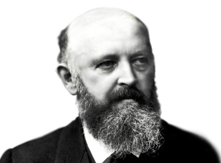

# 12. CARBONYL COMPOUNDS AND CARBOXYLIC ACIDS

**Adolf von Baeyer**

Adolf Von Baeyer, German research chemist who synthesized indigo (1880) and formulated its structure (1883). He was awarded the Nobel Prize for Chemistry in 1905. Notable among Baeyer's many achievements were the discovery of the phthalein dyes and his investigations of uric acid derivatives, polyacetylenes, and oxonium salts. One derivative of uric acid that he discovered was barbituric acid, the parent compound of the sedative-hypnotic drugs known as barbiturates.

**Learning Objectives**

● After studying this unit the student will be
able to

● describes the important methods of preparation and reactions of Carbonyl compounds

● explains the mechanism of Nucleophilic addition reaction of carbonyl compounds

● describes the preparation and chemical reactions of carboxylic acids and its derivatives

● list the uses of aldehydes, ketones and carboxylic acids

## INTRODUCTION

We come across many organic compounds containing a

 group in our everyday Life. Biomolecules such as protein, carbohydrate etc… that makeup all plants and animals contains carbonyl group. They play an important role in the metabolic process. For example, pyridoxal, an aldehyde derived from vitamin B, function as a co –enzyme. Carbonyl compounds are important constituents of fabrics, plastics and drugs. For example, Formaldehyde is used for the manufacture of Bakelite and paracetamol, (p– acetylated aminophenol) a drug used to reduce fever, contains a carbonyl group. In this unit, we will learn the preparation, properties and uses of aldhydes, ketones and carboxylic acids.

