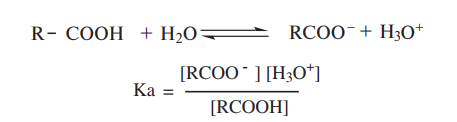
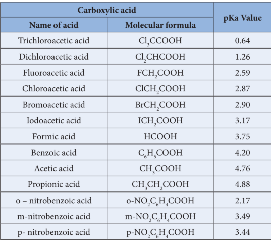

### 12.13 Acidity of Carboxylic acids

Carboxylic acids undergo ionisation to produce \(H^+\) and carboxylate ions in aqueous solution. The carboxylate anion is stabilised by resonance which make the Carboxylic acid to donate the proton easily.

the resonance structure of carboxylate ion are given below.

The strength of carboxylic acid can be expressed in terms of the dissociation constant (Ka):

The dissociation constant is generally called acidity constant because it measures the relative strength of an acid. The stronger the acid, the higher will be its Ka value.

The dissociation constant of an acid can also be expressed in terms of pKa value.

$$
pKa = -\log Ka
$$

A stronger acid will have higher Ka value but smaller pKa value.

**Ka and pKa values of some Carboxylic acids at 298 K**

**Effect of substituents on the acidity of carboxylic acid.**

i) **Electron releasing alkyl group decreases the acidity**

The electron releasing groups (+I groups) increase the negative charge on the carboxylate ion and destabilise it and hence the loss of proton becomes difficult. For example, formic acid is more stronger than acetic acid.

ii) **Electron withdrawing substituents increases the acidity**

The electron-withdrawing substituents decrease the negative charge on the carboxylate ion and stabilize it. In such cases, the loss of proton becomes relatively easy.

Acidity increases with increasing electronegativity of the substituents. For example, the acidity of various halo acetic acids follows the order

$$
F-CH_2-COOH > Cl-CH_2-COOH > Br-CH_2-COOH > I-CH_2-COOH
$$

Acidity increases with increasing number of electron-withdrawing substituents on the \(\alpha\)-carbon. For example

$$
Cl_3C-COOH > Cl_2CH-COOH > ClCH_2COOH > CH_3COOH
$$

The effect of various electron withdrawing groups on the acidity of a carboxylic acid follows the order,

$$
-NO_2 > -CN > -F > -Cl > -Br > -I > -Ph
$$

The relative acidities of various organic compounds are

$$
RCOOH > ArOH > H_2O > ROH > RC \equiv CH
$$
