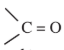

### 12.12 Chemical properties of carboxylic acids

Carboxylic acid do not give the characteristic reaction of carbonyl group  as given by the aldehydes and ketones, as the carbonyl group of carboxylic acid is involved in resonance.

The reactions of carboxylic acids can be classified as follows:

A) Reactions involving cleavage of O-H bond.

B) Reactions involving cleavage of C-OH bond.

C) Reactions involving -COOH group.

D) Substitution reactions involving hydrocarbon part.

#### A) Reactions involving cleavage of O-H bond

**1) Reactions with metals**

Carboxylic acid react with active metals like Na, Mg, Zn etc to form corresponding salts with the liberation of hydrogen.

**Example**

**2) Reaction with alkalis**

Carboxylic acid reacts with alkalis to neutralise them and form salts.

**Example**

**3) Reaction with carbonates and bicarbonate (Test for carboxylic acid group)**

Carboxylic acids decompose carbonates and bicarbonates evolving carbon dioxide gas with effervescence.

**Example**

**4) All Carboxylic acids turn blue litmus red**

#### B) Reactions involving cleavage of C-OH bond

**1) Reactions with \(PCl_5\), \(PCl_3\) and \(SOCl_2\)**

The hydroxyl group of carboxylic acids behaves like that of an alcoholic group and is easily replaced by chlorine atom on treating with \(PCl_5\), \(PCl_3\) or \(SOCl_2\).

**Example**

**2) Reactions with alcohols (Esterification)**

When carboxylic acids are heated with alcohols in the presence of conc. \(H_2SO_4\) or dry HCl gas, esters are formed. The reaction is reversible and is called esterification.

**Example**

**Mechanism of esterification:**

The mechanism of esterification involves the following steps.

#### C) Reactions involving -COOH group

**1) Reduction**

**i) Partial reduction to alcohols**

Carboxylic acids are reduced to primary alcohols by \(LiAlH_4\) or with hydrogen in the presence of copper chromite as catalyst. Sodium borohydride does not reduce the -COOH group.

**Example**

**ii) Complete reduction to alkanes**

When treated with HI and red phosphorous, carboxylic acid undergoes complete reduction to yield alkanes containing the same number of carbon atoms.

**Example**

**2) Decarboxylation**

Removal of \(CO_2\) from carboxyl group is called as **decarboxylation**. Carboxylic acids lose carbon dioxide to form hydrocarbon when their sodium salts are heated with soda lime (NaOH and CaO in the ratio 3:1)

**Example**

**3) Kolbe's electrolytic decarboxylation**

The aqueous solutions of sodium or potassium salts of carboxylic acid on electrolysis gives alkanes at anode. This reaction is called Kolbe's electrolysis.

Sodium formate solution on electrolysis gives hydrogen.

**4) Reactions with ammonia**

Carboxylic acids react with ammonia to form ammonium salt which on further heating at high temperature gives amides.

**Example**

**5) Action of heat in the presence of \(P_2O_5\)**

Carboxylic acid on heating in the presence of a strong dehydrating agent such as \(P_2O_5\) forms acid anhydride.

**Example**

#### D) Substitution reactions in the hydrocarbon part 

**1) \(\alpha\)-Halogenation**

Carboxylic acids having an \(\alpha\)-hydrogen are halogenated at the \(\alpha\)-position on treatment with chlorine or bromine in the presence of small amount of red phosphorus to form \(\alpha\) halo carboxylic acids. This reaction is known as **Hell-Volhard-Zelinsky reaction (HVZ reaction)**. The \(\alpha\)-Halogenated acids are convenient starting materials for preparing \(\alpha\)-substituted acids.

**2) Electrophilic substitution in aromatic carboxylic acids**

Aromatic carboxylic acid undergoes electrophilic substitution reactions. The carboxyl group is a deactivating and meta directing group. Some common electrophilic substitution reactions of benzoic acid are given below

**i) Halogenation**

**ii) Nitration**

**iii) Sulphonation**

**iv)** Benzoic acid does not undergo Friedel-Craft's reaction. This is due to the strong deactivating nature of the carboxyl group.

#### E) Reducing action of Formic acid

Formic acid contains both an aldehyde as well as an acid group. Hence, like other aldehydes, formic acid can easily be oxidised and therefore acts as a strong reducing agent

i) Formic acid reduces Tollen's reagent (ammonical silver nitrate solution) to metallic silver.

ii) Formic acid reduces Fehling's solution. It reduces blue coloured cupric ions to red coloured cuprous ions.

### Tests for carboxylic acid group

i) In aqueous solution carboxylic acid turn blue litmus red.

ii) Carboxylic acids give brisk effervescence with sodium bicarbonate due to the evolution of carbon-dioxide.

iii) When carboxylic acid is warmed with alcohol and Conc. \(H_2SO_4\) it forms an ester, which is detected by its fruity odour.
