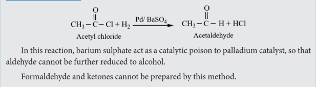
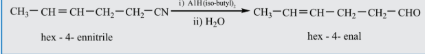
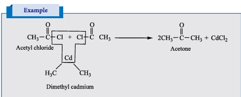
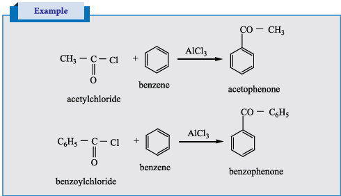

### 12.3 General methods of preparation of aldehydes and ketones

#### A. Preparation of aldehydes and ketones

**1.) Oxidation and catalytic dehydrogenation of alcohols**

We have already learnt that the oxidation of primary alcohol gives aldehydes and secondary alcohol gives a ketone. Oxidising agents such as acidified \(Na_2Cr_2O_7\), \(KMnO_4\), PCC are used for oxidation. Oxidation using PCC yield aldehydes. Other oxidising agents further oxidise the aldehydes / ketones into carboxylic acids (Refer Unit No. - 11 Oxidation of alcohols)

When vapours of alcohols are passed over heavy metal catalyst such as Cu, Ag, alcohols give aldehydes and ketones. (Refer Unit No. - 11 Catalytic dehydrogenation of alcohols)

**2.) Ozonolysis of alkenes**

We have already learnt in XI th standard that the reductive ozonolysis of alkenes gives aldehydes and ketones.

Alkenes react with ozone to form ozonide which on subsequent cleavage with zinc and water gives aldehydes and ketones. Zinc dust removes \(H_2O_2\) formed, which otherwise can oxidise aldehydes / ketones.

Terminal olefines give formaldehyde as one of the product.

## Evaluate yourself - 2

What happens when the following alkenes are subjected to reductive ozonolysis.

1) propene
2) 1-Butene
3) Isobutylene

**3. Hydration of alkynes**

We have already learnt in XI standard that the hydration of alkynes in presence of \(40\%\) dilute sulphuric acid and \(1\%\) \(HgSO_4\) to give the corresponding aldehydes / ketones.

**4. From calcium salts of carboxylic acids**

Aldehydes and ketones may be prepared by the dry distillation of calcium salts of carboxylic acids.

a) Aldehydes are obtained when the mixture of calcium salt of carboxylic acid and calcium formate is subjected to dry distillation.

b) Symmetrical ketones can be obtained by dry distillation of the calcium salt of carboxylic acid (except formic acid)

 #### B. Preparation of aldehydes
 **1. Rosenmund reduction**

a) Aldehydes can be prepared by the hydrogenation of acid chloride, in the presence of palladium supported by barium sulphate. This reaction is called Rosenmund reduction.

**Example**

**2. Stephen's reaction**

When alkylcyanides are reduced using \(SnCl_2/HCl\), imines are formed, which on hydrolysis gives corresponding aldehyde.

**3. Selective reduction of cyanides**

Diisobutyl aluminium hydride (DIBAL-H) selectively reduces the alkyl cyanides to form imines which on hydrolysis gives aldehydes.

**Example**

#### C) Preparation of benzaldehyde

1) **Side chain oxidation of toluene and its derivatives** by strong oxidising agents such as \(KMnO_4\) gives benzoic acid.

When chromylchloride is used as an oxidising agent, toluene gives benzaldehyde. This reaction is called Etard reaction. Acetic anhydride and \(CrO_3\) can also be used for this reaction.

Oxidation of toluene by chromic oxide gives benzylidine diacetate which on hydrolysis
gives benzaldehyde.

**2. Gattermann - Koch reaction**

This reaction is a variant of Friedel - Crafts acylation reaction. In this method, reaction of carbon monoxide and HCl generate an intermediate which reacts like formyl chloride.

**3. Manufacture of benzaldehyde from toluene**

Side chain chlorination of toluene gives benzal chloride, which on hydrolysis gives benzaldehyde.

This is the commercial method for the manufacture of benzaldehyde.

#### D) Preparation of ketones

1) **Ketones** can be prepared by the action of acid chloride with dialkyl cadmium.

**2) Preparation of phenyl ketones**

**Friedel – Crafts acylation**

It is the best method for preparing alkyl aryl ketones or diaryl ketones. This reaction succeeds only with benzene and activated benzene derivatives.

**Example**

