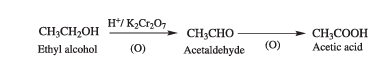
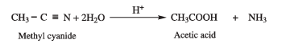
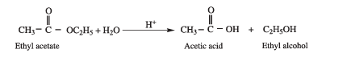
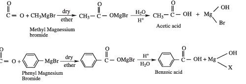
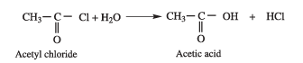
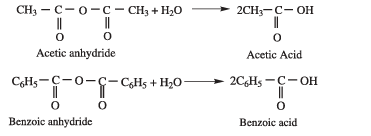
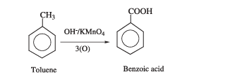

### 12.10 Methods of Preparation of carboxylic acids

Some important methods for the preparation of carboxylic acids are as follows:

**1. From Primary alcohols and aldehydes**

Primary alcohols and aldehydes can easily be oxidised to the corresponding carboxylic acids with oxidising agents such as potassium permanganate (in acidic or alkaline medium), potassium dichromate (in acidic medium)

**Example**

**2. Hydrolysis of Nitriles**

Nitriles yield carboxylic acids when subjected to hydrolysis with an acid or alkali.

**Example**

**3. Acidic hydrolysis of esters**

Esters on hydrolysis with dilute mineral acids yield corresponding carboxylic acid

**Example**

**4. From Grignard reagent**

Grignard reagent reacts with carbon dioxide (dry ice) to form salts of carboxylic acid which in turn give corresponding carboxylic acid after acidification with mineral acid.

**Example**

Formic acid cannot be prepared by Grignard reagent since the acid contains only one
carbon atom

**5. Hydrolysis of acyl halides and anhydrides**

a) Acid chlorides when hydrolysed with water give Carboxylic acids.

**Example**

b) Acid anhydride when hydrolysed with water give corresponding carboxylic acids.

**6. Oxidation of alkyl benzenes**

Aromatic carboxylic acids can be prepared by vigorous oxidation of alkyl benzene with chromic acid or acidic or alkaline potassium permanganate. The entire side chain is oxidised to -COOH group irrespective of the length of the side chain.

**Example**

>**Evaluate yourself**
>
>1) What happens when n-propyl benzene is oxidised using \(H^+/KMnO_4\)?
>2) How will you prepare benzoic acid using Grignard reagent?
