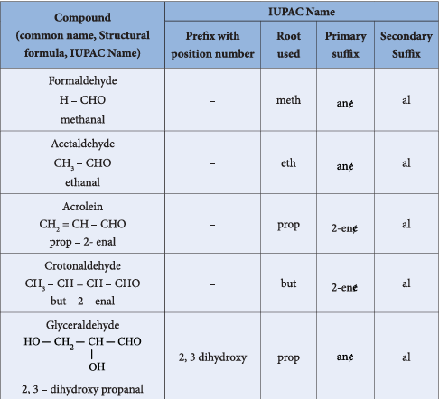
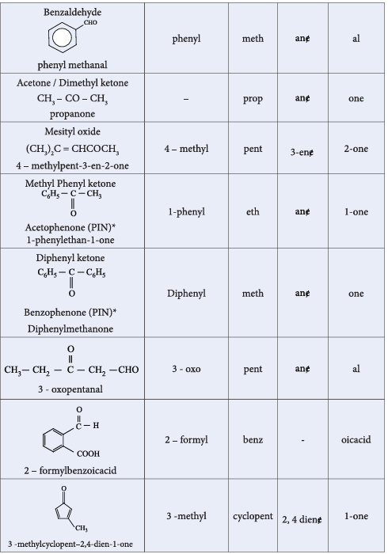
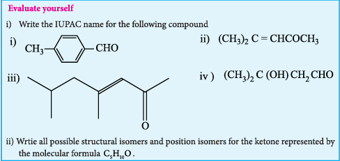

### 12.1 Nomenclature of Aldehydes and ketones

We have already learnt the IUPAC system of nomenclature of organic compounds in \(XI^{\mathrm{th}}\) standard. Let us apply the rules to name the following compounds.

## Evaluate yourself - 1

 
