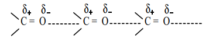

### 12.4 Physical properties of aldehydes and ketones

1. **Physical State:** Formaldehyde is a gas at room temperature and acetaldehyde is a volatile liquid. All other aldehydes and ketones up to \(C_{11}\) are colourless liquids while the higher ones are solids.

2. **Boiling points**

Aldehydes and ketones have relatively high boiling point as compared to hydrocarbons and ethers of comparable molecular mass. It is due to the weak molecular association in aldehydes and ketones arising out of the dipole-dipole interactions.

These dipole-dipole interactions are weaker than intermolecular H-bonding. The boiling points of aldehydes and ketones are much lower than those of corresponding alcohols and carboxylic acids which possess inter molecular hydrogen bonding.

| Compound | Molar mass | Boiling point (K) | Compound | Molar mass | Boiling point (K) |
|---|---|---|---|---|---|
| \(CH_3(CH_2)_3CH_3\) (Pentane) | 72 | 309 | \(CH_3CH_2COCH_3\) (butan-2-one) | 72 | 353 |
| \(CH_3(CH_2)_2CHO\) (butanal) | 72 | 349 | \(CH_3CH_2COOH\) (Propanoic acid) | 74 | 414 |
| \(CH_3(CH_2)_3OH\) (butanol) | 74 | 391 | | | |

3. **Solubility**

Lower members of aldehydes and ketones like formaldehyde, acetaldehyde and acetone are miscible with water in all proportions because they form hydrogen bond with water.

Solubility of aldehydes and ketones decreases rapidly on increasing the length of alkyl chain.

4. **Dipole moment:**

The carbonyl group of aldehydes and ketones contains a double bond between carbon and oxygen. Oxygen is more electronegative than carbon and it attracts the shared pair of electron which makes the carbonyl group as polar and hence aldehydes and ketones have high dipole moments.

