# 7. CHEMICAL KINETICS

## Learning Objectives

After studying this unit, the students will be able to

- define the rate and order of a reaction,
- derive the integrated rate equations for zero and first order reactions,
- describe the half life period,
- describe the collision theory,
- discuss the temperature dependence of the rate of a reaction, and
- explain various factors which affect the rate of a reaction.

# INTRODUCTION

We have already learnt in XI standard that the feasibility of a chemical reaction under a given set of conditions can be predicted, using the principles of thermodynamics. However, thermodynamics does not provide an answer to a very important question of how fast a chemical reaction takes place. We know from our practical experience that all chemical reactions take some time for completion. Reaction speeds ranging from extremely fast (in femto seconds) to extremely slow (in years). For example, when the reactants \( BaCl_2 \) solution and dilute \( H_2SO_4 \) are just mixed, a white precipitate of \( BaSO_4 \) is immediately formed; on the other hand reactions such as rusting of Iron take many years to complete. The answers to the questions such as (i) how fast a chemical change can occur and (ii) What happens in a chemical reaction during the period between the initial stage and final stage are provided by the chemical kinetics. The word kinetics is derived from the Greek word "kinesis" meaning movement.

Chemical kinetics is the study of the rate and the mechanism of chemical reactions, proceeding under given conditions of temperature, pressure, concentration etc.

The study of chemical kinetics not only help us to determine the rate of a chemical reaction, but also useful in optimizing the process conditions of industrial manufacturing processes, organic and inorganic synthesis etc.

In this unit, we discuss the rate of a chemical reaction and the factors affecting it. We also discuss the theories of the reaction rate and temperature dependence of a chemical reaction.

### 7.1 Rate of a chemical reaction

We have already learnt in XI standard that the feasibility of a chemical reaction under a given set of conditions can be predicted, using the principles of thermodynamics. However, thermodynamics does not provide an answer to a very important question of how fast a chemical reaction takes place. We know from our practical experience that all chemical reactions take some time for completion. Reaction speeds ranging from extremely fast (in femto seconds) to extremely slow (in years). For example, when the reactants \( \mathrm{BaCl}_2 \) solution and dilute \( \mathrm{H}_2\mathrm{SO}_4 \) are just mixed, a white precipitate of \( \mathrm{BaSO}_4 \) is immediately formed; on the other hand reactions such as rusting of Iron take many years to complete. The answers to the questions such as (i) how fast a chemical change can occur and (ii) What happens in a chemical reaction during the period between the initial stage and final stage are provided by the chemical kinetics. The word kinetics is derived from the Greek word "kinesis" meaning movement.

Chemical kinetics is the study of the rate and the mechanism of chemical reactions, proceeding under given conditions of temperature, pressure, concentration etc.

The study of chemical kinetics not only help us to determine the rate of a chemical reaction, but also useful in optimizing the process conditions of industrial manufacturing processes, organic and inorganic synthesis etc.

In this unit, we discuss the rate of a chemical reaction and the factors affecting it. We also discuss the theories of the reaction rate and temperature dependence of a chemical reaction.

A rate is a change in a particular variable per unit time. You have already learnt in physics that change in the displacement of a particle per unit time gives its velocity. Similarly in a chemical reaction, the change in the concentration of the species involved in a chemical reaction per unit time gives the rate of a reaction.

Let us consider a simple general reaction

\[
\mathrm{A} \longrightarrow \mathrm{B}
\]

The concentration of the reactant ([A]) can be measured at different time intervals. Let the concentration of A at two different times \( t_2 \) and \( t_1 \), \( (t_2 > t_1) \) be \([A_1]\) and \([A_2]\) respectively. The rate of the reaction can be expressed as

\[
\text{Rate} = \frac{-[\text{Change in the concentration of the reactants}]}{(\text{Change in time})}
\]

\[
\text{i.e., Rate} = \frac{-([A_2] - [A_1])}{(t_2 - t_1)} = -\left(\frac{\Delta[A]}{\Delta t}\right) \quad \dots (7.1)
\]

During the reaction, the concentration of the reactant decreases i.e. \([A_2] < [A_1]\) and hence the change in concentration \([A_2] - [A_1]\) gives a negative value. By convention the reaction rate is a positive one and hence a negative sign is introduced in the rate expression (equation 7.1).

If the reaction is followed by measuring the product concentration, the rate is given by \( \left(\frac{\Delta[B]}{\Delta t}\right) \) since \([B_2] > [B_1]\), no minus sign is required here.

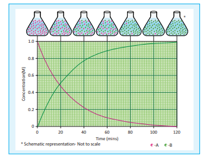

Figure 7.1 change in concentration of A and B for the reaction A → B

**Unit of rate of a reaction:**

\[
\text{unit of rate} = \frac{\text{unit of concentration}}{\text{unit of time}}
\]

Usually, concentration is expressed in number of moles per litre and time is expressed in seconds and therefore the unit of the rate of a reaction is mol \( \mathrm{L}^{-1} \mathrm{s}^{-1} \). Depending upon the nature of the reaction, minute, hour, year etc can also be used.

For a gas phase reaction, the concentration of the gaseous species is usually expressed in terms of their partial pressures and in such cases the unit of reaction rate is atm \( \mathrm{s}^{-1} \).

#### 7.1.1 Stoichiometry and rate of a reaction

In a reaction \( \mathrm{A} \longrightarrow \mathrm{B} \), the stoichiometry of both reactant and product are same, and hence the rate of disappearance of reactant (A) and the rate of appearance of product (B) are same.

Now, let us consider a different reaction

\[
\mathrm{A} \longrightarrow 2\mathrm{B}
\]

In this case, for every mole of A that disappears two moles of B appear, i.e., the rate of formation of B is twice as fast as the rate of disappearance of A. Therefore, the rate of the reaction can be expressed as below

\[
\text{Rate} = \frac{+d[\mathrm{B}]}{dt} = 2\left(-\frac{d[\mathrm{A}]}{dt}\right)
\]

In other words,

\[
\text{Rate} = -\frac{d[\mathrm{A}]}{dt} = \frac{1}{2}\frac{d[\mathrm{B}]}{dt}
\]

For a general reaction, the rate of the reaction is equal to the rate of consumption of a reactant (or formation of a product) divided by its coefficient in the balanced equation

\[
x\mathrm{A} + y\mathrm{B} \longrightarrow l\mathrm{C} + m\mathrm{D}
\]

\[
\text{Rate} = \frac{-1}{x}\frac{d[\mathrm{A}]}{dt} = \frac{-1}{y}\frac{d[\mathrm{B}]}{dt} = \frac{1}{l}\frac{d[\mathrm{C}]}{dt} = \frac{1}{m}\frac{d[\mathrm{D}]}{dt}
\]

#### 7.1.2 Average and instantaneous rate

Let us understand the average rate and instantaneous rate by considering the isomerisation of cyclopropane.

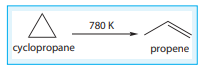

The kinetics of the above reaction is followed by measuring the concentration of cyclopropane at regular intervals and the observations are shown below. (Table 7.1)

**Table 7.1 Concentration of cyclopropane at various times during its isomerisation at 780K**

| Time (min) | [cyclopropane] (mol L\(^{-1}\)) |
|---|---|
| 0 | 2.00 |
| 5 | 1.67 |
| 10 | 1.40 |
| 15 | 1.17 |
| 20 | 0.98 |
| 25 | 0.82 |
| 30 | 0.69 |

\[
\text{Rate of the reaction} = \frac{-\Delta[\text{cyclopropane}]}{\Delta t}
\]

\[
\text{The rate over the} = \frac{-(0.69 - 2)\ \mathrm{mol\ L^{-1}}}{(30 - 0)\ \mathrm{min}}
\]

\[
= \frac{1.31}{30} = 4.36 \times 10^{-2}\ \mathrm{mol\ L^{-1}\ min^{-1}}
\]

It means that during the first 30 minutes of the reaction, the concentration of the reactant (cyclopropane) decreases as an average of \( 4.36 \times 10^{-2} \) mol \( \mathrm{L}^{-1} \) each minute.

Let us calculate the average rate for an initial and later stage over a short period.

\[
\begin{array}{l}
(\text{Rate})_{\text{initial}} = \frac{-(1.4 - 2)}{(10 - 0)} \\
= \frac{0.6}{10} = 6 \times 10^{-2}\ \mathrm{mol\ L^{-1}\ min^{-1}} \\
(\text{Rate})_{\text{later}} = \frac{-(0.69 - 0.98)}{(30 - 20)} \\
= \frac{0.29}{10} = 2.9 \times 10^{-2}\ \mathrm{mol\ L^{-1}\ min^{-1}}
\end{array}
\]

From the above calculations, we come to know that the rate decreases with time as the reaction proceeds and the average rate cannot be used to predict the rate of the reaction at any instant. The rate of the reaction, at a particular instant during the reaction is called the instantaneous rate. The shorter the time period, we choose, the closer we approach to the instantaneous rate,

\[
\text{As } \Delta t \rightarrow 0; \quad \frac{-\Delta[\text{cyclopropane}]}{\Delta t} = \frac{-d[\text{cyclopropane}]}{dt}
\]

A plot of [cyclopropane] Vs (time) gives a curve as shown in the figure 7.2. Instantaneous rate at a particular instant 't' is obtained by calculating the slope of a tangent drawn to the curve at that instant.

In general, the instantaneous reaction rate at a moment of mixing the reactants \( (t = 0) \) is calculated from the slope of the tangent drawn to the curve. The rate calculated by this method is called initial rate of a reaction.

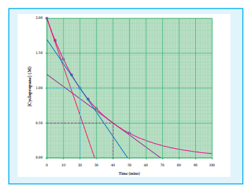

Figure 7.2 Concentration of cyclopropane vs time - graph

Let us calculate the instantaneous rate of isomerisation of cyclopropane at different concentrations: \( 2\mathrm{M} \), \( 1\mathrm{M} \) and \( 0.5\mathrm{M} \) from the graph shown in fig 7.2, the results obtained are tabulated below.

**Table 7.2 Rate of isomerisation**

| [cyclopropane] mol L\(^{-1}\) | Rate mol L\(^{-1}\) min\(^{-1}\) |
|---|---|
| 2 | \( 6.92 \times 10^{-2} \) |
| 1 | \( 3.46 \times 10^{-2} \) |
| 0.5 | \( 1.73 \times 10^{-2} \) |

### 7.3 Rate law and rate constant

We have just learnt that, the rate of the reaction depends upon the concentration of the reactant. Now let us understand how the reaction rate is related to concentration by considering the following general reaction.

\[
x\mathrm{A} + y\mathrm{B} \longrightarrow \text{products}
\]

The rate law for the above reaction is generally expressed as

\[
\text{Rate} = k[\mathrm{A}]^{m}[\mathrm{B}]^{n}
\]

Where \( k \) is proportionality constant called the rate constant. The values of \( m \) and \( n \) represent the reaction order with respect to A and B respectively. The overall order of the reaction is given by \( (m + n) \). The values of the exponents (m and n) in the rate law must be determined by experiment. They cannot be deduced from the Stoichiometry of the reaction. For example, consider the isomerisation of cyclopropane, that we discussed earlier.

The results shown in table 7.2 indicate that if the concentration of cyclopropane is reduced to half, the rate also reduced to half. It means that the rate depends upon [cyclopropane] raised to the first power

\[
\text{i.e., } \text{Rate} = k[\text{cyclopropane}]^{1}
\]

\[
\Rightarrow \frac{\text{Rate}}{[\text{cyclopropane}]} = k
\]

**Table 7.3 Rate constant for isomerisation**

| Rate mol L\(^{-1}\) min\(^{-1}\) | [cyclopropane] | \( k = \frac{\text{Rate}}{[\text{cyclopropane}]} \) |
|---|---|---|
| \( 6.92 \times 10^{-2} \) | 2 | \( 3.46 \times 10^{-2} \) |
| \( 3.46 \times 10^{-2} \) | 1 | \( 3.46 \times 10^{-2} \) |
| \( 1.73 \times 10^{-2} \) | 0.5 | \( 3.46 \times 10^{-2} \) |

Let us consider another example, the oxidation of nitric oxide (NO)

\[
2\mathrm{NO}(g) + \mathrm{O}_2(g) \longrightarrow 2\mathrm{NO}_2(g)
\]

Series of experiments are conducted by keeping the concentration of one of the reactants constant and changing the concentration of the others.

| Experiment | [NO] \( \times 10^{-2} \) (mol L\(^{-1}\)) | [O\(_2\)] \( \times 10^{-2} \) (mol L\(^{-1}\)) | Initial rate \( \times 10^{-2} \) (mol L\(^{-1}\) min\(^{-1}\)) |
|---|---|---|---|
| 1 | 1.3 | 1.1 | 19.26 |
| 2 | 1.3 | 2.2 | 38.40 |
| 3 | 2.6 | 1.1 | 76.80 |

\[
\text{Rate} = k[\mathrm{NO}]^{m}[\mathrm{O}_2]^{n}
\]

For experiment 1, the rate law is

\[
\text{Rate}_1 = k[\mathrm{NO}]^{m}[\mathrm{O}_2]^{n}
\]

\[
19.26 \times 10^{-2} = k[1.3]^{m}[1.1]^{n} \quad \dots (1)
\]

Similarly for experiment 2

\[
\text{Rate}_2 = k[\mathrm{NO}]^{m}[\mathrm{O}_2]^{n}
\]

\[
38.40 \times 10^{-2} = k[1.3]^{m}[2.2]^{n} \quad \dots (2)
\]

For experiment 3

\[
\text{Rate}_3 = k[\mathrm{NO}]^{m}[\mathrm{O}_2]^{n}
\]

\[
76.8 \times 10^{-2} = k[2.6]^{m}[1.1]^{n} \quad \dots (3)
\]

\[
\frac{(2)}{(1)} \Rightarrow \frac{38.40 \times 10^{-2}}{19.26 \times 10^{-2}} = \frac{k[1.3]^{m}[2.2]^{n}}{k[1.3]^{m}[1.1]^{n}}
\]

\[
2 = \left(\frac{2.2}{1.1}\right)^{n}
\]

\[
2 = 2^{n} \text{ i.e., } n = 1
\]

Therefore the reaction is first order with respect to \( \mathrm{O}_2 \)

\[
\frac{(3)}{(1)} \Rightarrow \frac{76.8 \times 10^{-2}}{19.26 \times 10^{-2}} = \frac{k[2.6]^{m}[1.1]^{n}}{k[1.3]^{m}[1.1]^{n}}
\]

\[
4 = 2^{m} \text{ i.e., } m = 2
\]

Therefore the reaction is second order with respect to NO

\[
\text{Rate} = k[\mathrm{NO}]^{2}[\mathrm{O}_2]^{1}
\]

The overall order of the reaction \( = (2 + 1) = 3 \)

**Differences between rate and rate constant of a reaction**

| s.no | Rate of a reaction | Rate constant of a reaction |
|---|---|---|
| 1 | It represents the speed at which the reactants are converted into products at any instant. | It is a proportionality constant. |
| 2 | It is measured as decrease in the concentration of the reactants or increase in the concentration of products. | It is equal to the rate of reaction, when the concentration of each of the reactants is unity. |
| 3 | It depends on the initial concentration of reactants. | It does not depend on the initial concentration of reactants. |

### 7.4 Molecularity

Kinetic studies involve not only measurement of a rate of reaction but also proposal of a reasonable reaction mechanism. Each and every single step in a reaction mechanism is called an elementary reaction.

An elementary step is characterized by its molecularity. The total number of reactant species that are involved in an elementary step is called molecularity of that particular step. Let us recall the hydrolysis of t-butyl bromide studied in XI standard. Since the rate determining elementary step involves only t-butyl bromide, the reaction is called a Unimolecular Nucleophilic substitution \( (\mathrm{S_N^1}) \) reaction.

Let us understand the elementary reactions by considering another reaction, the decomposition of hydrogen peroxide catalysed by \( \mathrm{I}^- \).

\[
2\mathrm{H}_2\mathrm{O}_2(aq) \longrightarrow 2\mathrm{H}_2\mathrm{O}(l) + \mathrm{O}_2(g)
\]

It is experimentally found that the reaction is first order with respect to both \( \mathrm{H}_2\mathrm{O}_2 \) and \( \mathrm{I}^- \), which indicates that \( \mathrm{I}^- \) is also involved in the reaction. The mechanism involves the following steps.

Step:1 \( \mathrm{H}_2\mathrm{O}_2(aq) + \mathrm{I}^-(aq) \longrightarrow \mathrm{H}_2\mathrm{O}(l) + \mathrm{OI}^-(aq) \)

Step:2 \( \mathrm{H}_2\mathrm{O}_2(aq) + \mathrm{OI}^-(aq) \longrightarrow \mathrm{H}_2\mathrm{O}(l) + \mathrm{I}^-(aq) + \mathrm{O}_2(g) \)

Overall reaction is

\[
2\mathrm{H}_2\mathrm{O}_2(aq) \longrightarrow 2\mathrm{H}_2\mathrm{O}(l) + \mathrm{O}_2(g)
\]

These two reactions are elementary reactions. Adding eqn (1) and (2) gives the overall reaction. Step 1 is the rate determining step, since it involves both \( \mathrm{H}_2\mathrm{O}_2 \) and \( \mathrm{I}^- \), the overall reaction is bimolecular.

**Differences between order and molecularity**

| s.no | Order of a reaction | Molecularity of a reaction |
|---|---|---|
| 1 | It is the sum of the powers of concentration terms involved in the experimentally determined rate law. | It is the total number of reactant species that are involved in an elementary step. |
| 2 | It can be zero (or) fractional (or) integer. | It is always a whole number, cannot be zero or a fractional number. |
| 3 | It is assigned for a overall reaction. | It is assigned for each elementary step of mechanism. |

**Example 1**

Consider the oxidation of nitric oxide to form \( \mathrm{NO}_2 \)

\[
2\mathrm{NO}(g) + \mathrm{O}_2(g) \longrightarrow 2\mathrm{NO}_2(g)
\]

(a) Express the rate of the reaction in terms of changes in the concentration of \( \mathrm{NO} \), \( \mathrm{O}_2 \) and \( \mathrm{NO}_2 \)

(b) At a particular instant, when \( [\mathrm{O}_2] \) is decreasing at \( 0.2\ \mathrm{mol\ L^{-1}\ s^{-1}} \) at what rate is \( [\mathrm{NO}_2] \) increasing at that instant?

**Solution:**

\[
\text{(a) Rate} = \frac{-1}{2}\frac{d[\mathrm{NO}]}{dt} = \frac{-d[\mathrm{O}_2]}{dt} = \frac{1}{2}\frac{d[\mathrm{NO}_2]}{dt}
\]

\[
\text{(b) } \frac{-d[\mathrm{O}_2]}{dt} = \frac{1}{2}\frac{d[\mathrm{NO}_2]}{dt}
\]

\[
\frac{d[\mathrm{NO}_2]}{dt} = 2 \times \left(\frac{-d[\mathrm{O}_2]}{dt}\right) = 2 \times 0.2\ \mathrm{mol\ L^{-1}\ s^{-1}}
\]

\[
= 0.4\ \mathrm{mol\ L^{-1}\ s^{-1}}
\]

**Evaluate yourself 1**

1) Write the rate expression for the following reactions, assuming them as elementary reactions.

(i) \( 3\mathrm{A} + 5\mathrm{B}_2 \longrightarrow 4\mathrm{CD} \)

(ii) \( \mathrm{X}_2 + \mathrm{Y}_2 \longrightarrow 2\mathrm{XY} \)

2) Consider the decomposition of \( \mathrm{N}_2\mathrm{O}_5(g) \) to form \( \mathrm{NO}_2(g) \) and \( \mathrm{O}_2(g) \). At a particular instant \( \mathrm{N}_2\mathrm{O}_5 \) disappears at a rate of \( 2.5 \times 10^{-2}\ \mathrm{mol\ dm^{-3}\ s^{-1}} \). At what rates are \( \mathrm{NO}_2 \) and \( \mathrm{O}_2 \) formed? What is the rate of the reaction?

**Example 2**

1. What is the order with respect to each of the reactant and overall order of the following reactions?

(a) \( 5\mathrm{Br}^-(aq) + \mathrm{BrO}_3^-(aq) + 6\mathrm{H}^+(aq) \longrightarrow 3\mathrm{Br}_2(l) + 3\mathrm{H}_2\mathrm{O}(l) \)

The experimental rate law is Rate = \( k[\mathrm{Br}^-][\mathrm{BrO}_3^-][\mathrm{H}^+]^2 \)

(b) \( \mathrm{CH}_3\mathrm{CHO}(g) \longrightarrow \mathrm{CH}_4(g) + \mathrm{CO}(g) \)

the experimental rate law is Rate = \( k[\mathrm{CH}_3\mathrm{CHO}]^{3/2} \)

**Solution:**

a) First order with respect to \( \mathrm{Br}^- \), first order with respect to \( \mathrm{BrO}_3^- \) and second order with respect to \( \mathrm{H}^+ \). Hence the overall order of the reaction is equal to \( 1 + 1 + 2 = 4 \)

b) Order of the reaction with respect to acetaldehyde is \( \frac{3}{2} \) and overall order is also \( \frac{3}{2} \)

**Example 3**

2. The rate of the reaction \( x + 2y \longrightarrow \) product is \( 4 \times 10^{-3}\ \mathrm{mol\ L^{-1}\ s^{-1}} \) if \( [x] = [y] = 0.2\mathrm{M} \) and rate constant at \( 400\mathrm{K} \) is \( 2 \times 10^{-2}\ \mathrm{s^{-1}} \), what is the overall order of the reaction?

**Solution:**

\[
\text{Rate} = k[x]^n[y]^m
\]

\[
4 \times 10^{-3}\ \mathrm{mol\ L^{-1}\ s^{-1}} = 2 \times 10^{-2}\ \mathrm{s^{-1}} (0.2\ \mathrm{mol\ L^{-1}})^n (0.2\ \mathrm{mol\ L^{-1}})^m
\]

\[
\frac{4 \times 10^{-3}\ \mathrm{mol\ L^{-1}\ s^{-1}}}{2 \times 10^{-2}\ \mathrm{s^{-1}}} = (0.2)^{n+m} (\mathrm{mol\ L^{-1}})^{n+m}
\]

\[
0.2(\mathrm{mol\ L^{-1}}) = (0.2)^{n+m} (\mathrm{mol\ L^{-1}})^{n+m}
\]

Comparing the powers on both sides

The overall order of the reaction \( n + m = 1 \)

**Evaluate yourself 2**

1) For a reaction, \( \mathrm{X} + \mathrm{Y} \longrightarrow \) product; quadrupling \( [x] \), increases the rate by a factor of 8. Quadrupling both \( [x] \) and \( [y] \), increases the rate by a factor of 16. Find the order of the reaction with respect to x and y. what is the overall order?

2) Find the individual and overall order of the following reaction using the given data.

\[
2\mathrm{NO}(g) + \mathrm{Cl}_2(g) \longrightarrow 2\mathrm{NOCl}(g)
\]

| Experiment | Initial concentration | Initial rate NOCl mol L\(^{-1}\) s\(^{-1}\) |
|---|---|---|
| | NO | Cl\(_2\) | |
| 1 | 0.1 | 0.1 | \( 7.8 \times 10^{-5} \) |
| 2 | 0.2 | 0.1 | \( 3.12 \times 10^{-4} \) |
| 3 | 0.2 | 0.3 | \( 9.36 \times 10^{-4} \) |

### 7.5 The integrated rate equation

We have just learnt that the rate of change of concentration of the reactant is directly proportional to that of concentration of the reactant. For a general reaction,

A \( \longrightarrow \) product

The rate law is

\[
\text{Rate} = \frac{-d[\mathrm{A}]}{dt} = k[\mathrm{A}]^x
\]

Where k is the rate constant, and \( x \) is the order of the reaction. The above equation is a differential equation, \( \frac{-d[\mathrm{A}]}{dt} \), so it gives the rate at any instant. However, using the above expression, we cannot answer questions such as how long will it take for a specific concentration of A to be used up in the reaction? What will be the concentration of reactant after a time 't'? To answer such questions, we need the integrated form of the above rate law which contains time as a variable.

#### 7.5.1 Integrated rate law for a first order reaction

A reaction whose rate depends on the reactant concentration raised to the first power is called a first order reaction. Let us consider the following first order reaction,

A \( \longrightarrow \) product

Rate law can be expressed as

\[
\text{Rate} = k[\mathrm{A}]^1
\]

Where, k is the first order rate constant.

\[
\frac{-d[\mathrm{A}]}{dt} = k[\mathrm{A}]^1
\]

\[
\Rightarrow \frac{-d[\mathrm{A}]}{[\mathrm{A}]} = k\ dt \quad (1)
\]

Integrate the above equation between the limits of time \( t = 0 \) and time equal to t, while the concentration varies from the initial concentration \( [\mathrm{A}_0] \) to [A] at the later time.

\[
\int_{[\mathrm{A}_0]}^{[\mathrm{A}]} \frac{-d[\mathrm{A}]}{[\mathrm{A}]} = k \int_{0}^{t} dt
\]

\[
\left(-\ln [\mathrm{A}]\right)_{[\mathrm{A}_0]}^{[\mathrm{A}]} = k \left(t\right)_{0}^{t}
\]

\[
-\ln [\mathrm{A}] - (-\ln [\mathrm{A}_0]) = k(t - 0)
\]

\[
-\ln [\mathrm{A}] + \ln [\mathrm{A}_0] = k t
\]

\[
\ln \left(\frac{[\mathrm{A}_0]}{[\mathrm{A}]}\right) = k t
\]

This equation is in natural logarithm. To convert it into usual logarithm with base 10, we have to multiply the term by 2.303.

\[
2.303 \log \left(\frac{[\mathrm{A}_0]}{[\mathrm{A}]}\right) = k t
\]

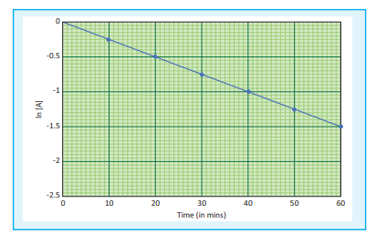

\[
k = \frac{2.303}{t} \log \left( \frac{[A_0]}{[A]} \right) \quad \text{--- (3)}
\]

Equation (2) can be written in the form \( y = mx + c \) as below

\[
\ln[A_0] - \ln[A] = kt
\]

\[
\ln[A] = \ln[A_0] - kt
\]

\[
\Rightarrow y = c + mx
\]

If we follow the reaction by measuring the concentration of the reactants at regular time interval \( t \), a plot of \( \ln[A] \) against \( t \) yields a straight line with a negative slope. From this, the rate constant is calculated.

**Examples for the first order reaction**

(i) Decomposition of dinitrogen pentoxide

\[
N_2O_5(g) \longrightarrow 2NO_2(g) + \frac{1}{2}O_2(g)
\]

(ii) Decomposition of sulphurylchloride; \( SO_2Cl_2(l) \longrightarrow SO_2(g) + Cl_2(g) \)

(iii) Decomposition of the \( H_2O_2 \) in aqueous solution; \( H_2O_2(aq) \longrightarrow H_2O(l) + \frac{1}{2}O_2(g) \)

(iv) Isomerisation of cyclopropane to propene.

#### 7.5.2 Pseudo first order reaction

Kinetic study of a higher order reaction is difficult to follow, for example, in a study of a second order reaction involving two different reactants; the simultaneous measurement of change in the concentration of both the reactants is very difficult. To overcome such difficulties, a second order reaction can be altered to a first order reaction by taking one of the reactant in large excess, such reaction is called pseudo first order reaction. Let us consider the acid hydrolysis of an ester,

\[
\mathrm{CH}_3\mathrm{COOCH}_3(aq) + \mathrm{H}_2\mathrm{O}(l) \xrightarrow{\mathrm{H}^+} \mathrm{CH}_3\mathrm{COOH}(aq) + \mathrm{CH}_3\mathrm{OH}(aq)
\]

\[
\text{Rate} = k[\mathrm{CH}_3\mathrm{COOCH}_3][\mathrm{H}_2\mathrm{O}]
\]

If the reaction is carried out with the large excess of water, there is no significant change in the concentration of water during hydrolysis. i.e., concentration of water remains almost a constant.

Now, we can define \( k[\mathrm{H}_2\mathrm{O}] = k' \); Therefore the above rate equation becomes

\[
\text{Rate} = k'[\mathrm{CH}_3\mathrm{COOCH}_3]
\]

Thus it follows first order kinetics.

#### 7.5.3 Integrated rate law for a zero order reaction

A reaction in which the rate is independent of the concentration of the reactant over a wide range of concentrations is called as zero order reactions. Such reactions are rare. Let us consider the following hypothetical zero order reaction.

A \( \longrightarrow \) product

The rate law can be written as,

\[
\text{Rate} = k[\mathrm{A}]^0
\]

\[
\frac{-d[\mathrm{A}]}{dt} = k(1)
\]

\[
\Rightarrow -d[\mathrm{A}] = k\ dt
\]

Integrate the above equation between the limits of \( [\mathrm{A}_0] \) at zero time and [A] at some later time 't',

\[
-\int_{[\mathrm{A}_0]}^{[\mathrm{A}]} d[\mathrm{A}] = k \int_{0}^{t} dt
\]

\[
-([\mathrm{A}])_{[\mathrm{A}_0]}^{[\mathrm{A}]} = k(t)_{0}^{t}
\]

\[
[\mathrm{A}_0] - [\mathrm{A}] = k t
\]

\[
k = \frac{[\mathrm{A}_0] - [\mathrm{A}]}{t}
\]

Equation (2) is in the form of a straight line \( y = mx + c \)

\[
\text{i.e., } [\mathrm{A}] = -k t + [\mathrm{A}_0]
\]

\[
\Rightarrow y = c + mx
\]

A plot of [A] Vs time gives a straight line with a slope of -k and y-intercept of [A\(_0\)].

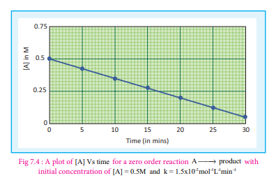

**Examples for a zero order reaction:**

1. Photochemical reaction between \( \mathrm{H}_2 \) and \( \mathrm{Cl}_2 \)
   \[
   \mathrm{H}_2(g) + \mathrm{Cl}_2(g) \xrightarrow{h\nu} 2\mathrm{HCl}(g)
   \]

2. Decomposition of \( \mathrm{N}_2\mathrm{O} \) on hot platinum surface
   \[
   \mathrm{N}_2\mathrm{O}(g) \xrightarrow{\mathrm{Pt}} \mathrm{N}_2(g) + \frac{1}{2}\mathrm{O}_2(g)
   \]

3. Iodination of acetone in acid medium is zero order with respect to iodine.
   \[
   \mathrm{CH}_3\mathrm{COCH}_3 + \mathrm{I}_2 \xrightarrow{\mathrm{H}^+} \mathrm{ICH}_2\mathrm{COCH}_3 + \mathrm{HI}
   \]
   \[
   \text{Rate} = k[\mathrm{CH}_3\mathrm{COCH}_3][\mathrm{H}^+]
   \]

General rate equation for a \( n^{\text{th}} \) order reaction involving one reactant [A].

A \( \longrightarrow \) product

\[
\text{Rate law } \frac{-d[\mathrm{A}]}{dt} = k[\mathrm{A}]^n
\]

Consider the case in which \( n \neq 1 \), integration of above equation between \( [\mathrm{A}_0] \) and [A] at time \( t = 0 \) and \( t = t \) respectively gives

\[
\frac{1}{[\mathrm{A}]^{n-1}} - \frac{1}{[\mathrm{A}_0]^{n-1}} = (n-1)k t
\]

### 7.6 Half life period of a reaction

The half life of a reaction is defined as the time required for the reactant concentration to reach one half its initial value. For a first order reaction, the half life is a constant i.e., it does not depend on the initial concentration.

The rate constant for a first order reaction is given by

\[
k = \frac{2.303}{t} \log \frac{[\mathrm{A}_0]}{[\mathrm{A}]}
\]

at \( t = t_{1/2} \); \( [\mathrm{A}] = \frac{[\mathrm{A}_0]}{2} \)

\[
k = \frac{2.303}{t_{1/2}} \log \frac{[\mathrm{A}_0]}{[\mathrm{A}_0]/2}
\]

\[
k = \frac{2.303}{t_{1/2}} \log 2
\]

\[
k = \frac{2.303 \times 0.3010}{t_{1/2}} = \frac{0.6932}{t_{1/2}}
\]

\[
t_{1/2} = \frac{0.6932}{k}
\]

Let us calculate the half life period for a zero order reaction.

\[
\text{Rate constant, } k = \frac{[\mathrm{A}_0] - [\mathrm{A}]}{t}
\]

at \( t = t_{1/2} \); \( [\mathrm{A}] = [\mathrm{A}_0]/2 \)

\[
k = \frac{[\mathrm{A}_0] - [\mathrm{A}_0]/2}{t_{1/2}}
\]

\[
k = \frac{[\mathrm{A}_0]}{2 t_{1/2}}
\]

\[
t_{1/2} = \frac{[\mathrm{A}_0]}{2k}
\]

Hence, in contrast to the half life of a first order reaction, the half life of a zero order reaction is directly proportional to the initial concentration of the reactant.

**More to know**

Half life for an \( n^{\text{th}} \) order reaction involving reactant A and \( n \neq 1 \)

\[
t_{1/2} = \frac{2^{n-1} - 1}{(n-1)k[\mathrm{A}_0]^{n-1}}
\]

**Example 4**

(i) A first order reaction takes 8 hours for \( 90\% \) completion. Calculate the time required for \( 80\% \) completion. \( (\log 5 = 0.6989; \log 10 = 1) \)

**Solution:**

For a first order reaction,

\[
k = \frac{2.303}{t} \log \left(\frac{[\mathrm{A}_0]}{[\mathrm{A}]}\right) \quad \dots (1)
\]

Let \( [\mathrm{A}_0] = 100\mathrm{M} \)

When

\( t = t_{90\%} \); \( [\mathrm{A}] = 10\mathrm{M} \) (given that \( t_{90\%} = 8 \) hours)

\( t = t_{80\%} \); \( [\mathrm{A}] = 20\mathrm{M} \)

\[
k = \frac{2.303}{t_{80\%}} \log \left(\frac{100}{20}\right)
\]

\[
t_{80\%} = \frac{2.303}{k} \log (5) \quad \dots (2)
\]

Find the value of k using the given data

\[
k = \frac{2.303}{t_{90\%}} \log \left(\frac{100}{10}\right)
\]

\[
k = \frac{2.303}{8\ \text{hours}} \log 10
\]

\[
k = \frac{2.303}{8\ \text{hours}} (1)
\]

Substitute the value of k in equation (2)

\[
t_{80\%} = \frac{2.303}{\left(\frac{2.303}{8\ \text{hours}}\right)} \log (5)
\]

\[
t_{80\%} = 8\ \text{hours} \times 0.6989
\]

\[
t_{80\%} = 5.59\ \text{hours}
\]

**Example 5**

(ii) The half life of a first order reaction \( \mathrm{x} \longrightarrow \) products is \( 6.932 \times 10^4 \) s at \( 500\mathrm{K} \). What percentage of \( \mathrm{x} \) would be decomposed on heating at \( 500\mathrm{K} \) for \( 100\mathrm{min} \). \( (e^{0.06} = 1.06) \)

**Solution:**

Given \( t_{1/2} = 0.6932 \times 10^4 \ \mathrm{s} \)

To solve: when \( t = 100 \ \mathrm{min} \)

\[
\frac{[\mathrm{A}_0] - [\mathrm{A}]}{[\mathrm{A}_0]} \times 100 = ?
\]

We know that

For a first order reaction, \( t_{1/2} = \frac{0.6932}{k} \)

\[
k = \frac{0.6932}{6.932 \times 10^4} = 10^{-5} \ \mathrm{s}^{-1}
\]

\[
k = \frac{2.303}{t} \log \frac{[\mathrm{A}_0]}{[\mathrm{A}]}
\]

\[
10^{-5} \ \mathrm{s}^{-1} \times (100 \times 60 \ \mathrm{s}) = \ln \frac{[\mathrm{A}_0]}{[\mathrm{A}]}
\]

\[
0.06 = \ln \frac{[\mathrm{A}_0]}{[\mathrm{A}]}
\]

\[
\frac{[\mathrm{A}_0]}{[\mathrm{A}]} = e^{0.06} = 1.06
\]

\[
\frac{[\mathrm{A}_0] - [\mathrm{A}]}{[\mathrm{A}_0]} \times 100 = \left(1 - \frac{1}{1.06}\right) \times 100 = 5.6\%
\]

**Example 6**

Show that in case of first order reaction, the time required for 99.9% completion is nearly ten times the time required for half completion of the reaction.

Let \( [\mathrm{A}_0] = 100 \); \( [\mathrm{A}] \) when \( t = t_{99.9\%} = 100 - 99.9 = 0.1 \)

\[
k = \frac{2.303}{t_{99.9\%}} \log \frac{100}{0.1}
\]

\[
t_{99.9\%} = \frac{2.303}{k} \log 1000 = \frac{2.303}{k} \times 3
\]

\[
t_{99.9\%} = \frac{6.909}{k}
\]

\[
t_{99.9\%} \approx 10 \times \frac{0.69}{k} \approx 10 \times t_{1/2}
\]

**Evaluate yourself:**

(1) In a first order reaction A \( \longrightarrow \) products, 60% of the given sample of A decomposes in 40 min. what is the half life of the reaction?

(2) The rate constant for a first order reaction is \( 2.3 \times 10^{-4} \ \mathrm{s}^{-1} \). If the initial concentration of the reactant is 0.01M. What concentration will remain after 1 hour?

(3) Hydrolysis of an ester in an aqueous solution was studied by titrating the liberated carboxylic acid against sodium hydroxide solution. The concentrations of the ester at different time intervals are given below.

| Time (min) | 0 | 30 | 60 | 90 |
|---|---|---|---|---|
| Ester concentration (mol L\(^{-1}\)) | 0.85 | 0.80 | 0.754 | 0.71 |

Show that, the reaction follows first order kinetics.

### 7.7 Collision theory

Collision Theory was proposed independently by Max Trautz in 1916 and William Lewis in 1918. This theory is based on the kinetic theory of gases. According to this theory, chemical reactions occur as a result of collisions between the reacting molecules. Let us understand this theory by considering the following reaction.

\[
\mathrm{A}_2(g) + \mathrm{B}_2(g) \longrightarrow 2\mathrm{AB}(g)
\]

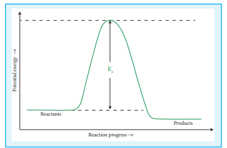

Figure 7.5 progress of the reaction

If we consider that, the reaction between \( \mathrm{A}_2 \) and \( \mathrm{B}_2 \) molecules proceeds through collisions between them, then the rate would be proportional to the number of collisions per second.

Rate \( \propto \) number of molecules colliding per litre per second (collision rate)

The number of collisions is directly proportional to the concentration of both \( \mathrm{A}_2 \) and \( \mathrm{B}_2 \).

Collision rate \( \propto [\mathrm{A}_2][\mathrm{B}_2] \)

Collision rate \( = Z[\mathrm{A}_2][\mathrm{B}_2] \)

Where, \( Z \) is a constant.

The collision rate in gases can be calculated from kinetic theory of gases. For a gas at room temperature \( (298\mathrm{K}) \) and 1 atm pressure, each molecule undergoes approximately \( 10^9 \) collisions per second, i.e., 1 collision in \( 10^{-9} \) second. Thus, if every collision resulted in reaction, the reaction would be complete in \( 10^{-9} \) second. In actual practice this does not happen. It implies that all collisions are not effective to lead to the reaction. In order to react, the colliding molecules must possess a minimum energy called activation energy. The molecules that collide with less energy than activation energy will remain intact and no reaction occurs.

Fraction of effective collisions (f) is given by the following expression

\[
f = e^{\frac{-E_a}{RT}}
\]

To understand the magnitude of collision factor (f), let us calculate the collision factor (f) for a reaction having activation energy of \( 100\ \mathrm{kJ\ mol^{-1}} \) at \( 300\mathrm{K} \)

\[
f = e^{\frac{-100 \times 10^3\ \mathrm{J\ mol^{-1}}}{8.314\ \mathrm{J\ K^{-1}\ mol^{-1}} \times 300\ \mathrm{K}}}
\]

\[
f = e^{-40} \approx 4 \times 10^{-18}
\]

Thus, out of \( 10^{18} \) collisions only four collisions are sufficiently energetic to convert reactants to products. This fraction of collisions is further reduced due to orientation factor i.e., even if the reactant collide with sufficient energy, they will not react unless the orientation of the reactant molecules is suitable for the formation of the transition state.

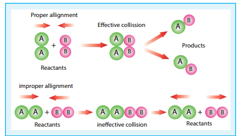

Figure 7.6 - Orientation of reactants - schematic representation

The figure 7.6 illustrates the importance of proper alignment of molecules which leads to reaction.

The fraction of effective collisions (f) having proper orientation is given by the steric factor p.

\[
\Rightarrow \text{Rate} = p \times f \times \text{collision rate}
\]

\[
\text{i.e., Rate} = p \times e^{\frac{-E_a}{RT}} \times Z[\mathrm{A}_2][\mathrm{B}_2] \quad \dots (1)
\]

As per the rate law,

\[
\text{Rate} = k[\mathrm{A}_2][\mathrm{B}_2] \quad \dots (2)
\]

Where k is the rate constant

On comparing equation (1) and (2), the rate constant k is

\[
k = p Z e^{\frac{-E_a}{RT}}
\]

### 7.8 Arrhenius equation - The effect of temperature on reaction rate

Generally, the rate of a reaction increase with increasing temperature. However, there are very few exceptions. The magnitude of this increase in rate is different for different reactions. As a rough rule, for many reactions near room temperature, reaction rate tends to double when the temperature is increased by \( 10^{\circ}\mathrm{C} \).

**Activity**

Let us understand the effect of temperature on reaction rate by doing this activity.

i. Take two test tubes, label them as A and B.
ii. Take \( 5\mathrm{ml} \) of cold water in A, add a drop of phenolphthalein indicator and then add Magnesium granules.
iii. Repeat the above with \( 5\mathrm{ml} \) of hot water in test tube B.
iv. Observe the two test tubes.
v. The observation shows that the solution in test tube B changes to pink colour and there is no such colour change in test tube A. That is, hot water reacts with magnesium according to the following reaction and there is no such reaction in cold water.

\[
\mathrm{Mg} + 2\mathrm{H}_2\mathrm{O} \longrightarrow \mathrm{Mg}^{2+} + 2\mathrm{OH}^- + \mathrm{H}_2\uparrow
\]

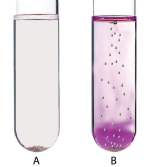

vi. The resultant solution is basic and it is indicated by phenolphthalein.

A large number of reactions are known which do not take place at room temperature but occur readily at higher temperatures. Example: Reaction between \( \mathrm{H}_2 \) and \( \mathrm{O}_2 \) to form \( \mathrm{H}_2\mathrm{O} \) takes place only when an electric spark is passed.

Arrhenius suggested that the rates of most reactions vary with temperature in such a way that the rate constant is directly proportional to \( e^{\left(\frac{-E_a}{RT}\right)} \) and he proposed a relation between the rate constant and temperature.

\[
k = A e^{-\left(\frac{E_a}{RT}\right)}
\]

Where A the frequency factor,

R the gas constant,

\( E_a \) the activation energy of the reaction and,

T the absolute temperature (in K)

The frequency factor (A) is related to the frequency of collisions (number of collisions per second) between the reactant molecules. The factor A does not vary significantly with temperature and hence it may be taken as a constant.

\( E_a \) is the activation energy of the reaction, which Arrhenius considered as the minimum energy that a molecule must have to possess to react.

Taking logarithm on both side of the equation (1)

\[
\ln k = \ln A + \ln e^{-\left(\frac{E_a}{RT}\right)}
\]

\[
\ln k = \ln A - \left(\frac{E_a}{RT}\right) \quad (\because \ln e = 1) \quad \dots (2)
\]

The above equation is of the form of a straight line \( y = mx + c \)

A plot of \( \ln k \) Vs \( \frac{1}{T} \) gives a straight line with a negative slope \( -\frac{E_a}{R} \). If the rate constant for a reaction at two different temperatures is known, we can calculate the activation energy as follows.

At temperature \( T = T_1 \); the rate constant \( k = k_1 \)

\[
\ln k_1 = \ln A - \left(\frac{E_a}{RT_1}\right) \quad (3)
\]

At temperature \( T = T_2 \); the rate constant \( k = k_2 \)

\[
\ln k_2 = \ln A - \left(\frac{E_a}{RT_2}\right) \quad (4)
\]

(4) - (3)

\[
\ln k_2 - \ln k_1 = \left(\frac{E_a}{RT_1}\right) - \left(\frac{E_a}{RT_2}\right)
\]

\[
\ln \frac{k_2}{k_1} = \frac{E_a}{R} \left(\frac{1}{T_1} - \frac{1}{T_2}\right)
\]

\[
\log \frac{k_2}{k_1} = \frac{E_a}{2.303 R} \left(\frac{T_2 - T_1}{T_1 T_2}\right)
\]

This equation can be used to calculate \( E_a \) from rate constants \( k_1 \) and \( k_2 \) at temperatures \( T_1 \) and \( T_2 \).

**Example 7**

The rate constant of a reaction at 400 and 200K are 0.04 and 0.02 s\(^{-1}\) respectively. Calculate the value of activation energy.

**Solution**

According to Arrhenius equation

\[
\log \frac{k_2}{k_1} = \frac{E_a}{2.303 R} \left(\frac{T_2 - T_1}{T_1 T_2}\right)
\]

\( T_2 = 400\mathrm{K} \); \( k_2 = 0.04\ \mathrm{s}^{-1} \)

\( T_1 = 200\mathrm{K} \); \( k_1 = 0.02\ \mathrm{s}^{-1} \)

\[
\log \frac{0.04}{0.02} = \frac{E_a}{2.303 \times 8.314\ \mathrm{J\ K^{-1}\ mol^{-1}}} \left(\frac{400 - 200}{400 \times 200}\right)
\]

\[
\log 2 = \frac{E_a}{2.303 \times 8.314\ \mathrm{J\ K^{-1}\ mol^{-1}}} \times \frac{200}{80000}
\]

\[
E_a = \frac{0.3010 \times 2.303 \times 8.314 \times 80000}{200}
\]

\[
E_a = 2305\ \mathrm{J\ mol^{-1}}
\]

**Example 8**

Rate constant k of a reaction varies with temperature T according to the following Arrhenius equation

\[
\log k = \log A - \frac{E_a}{2.303R} \left(\frac{1}{T}\right)
\]

Where \( E_a \) is the activation energy. When a graph is plotted for \( \log k \) Vs \( \frac{1}{T} \) a straight line with a slope of -4000K is obtained. Calculate the activation energy.

**Solution**

\[
\log k = \log A - \frac{E_a}{2.303R} \left(\frac{1}{T}\right)
\]

\( y = c + mx \)

\( m = -\frac{E_a}{2.303R} \)

\( E_a = -m \times 2.303R \)

\( E_a = -(-4000\mathrm{K}) \times 2.303 \times 8.314\ \mathrm{J\ K^{-1}\ mol^{-1}} \)

\( E_a = 4000 \times 2.303 \times 8.314\ \mathrm{J\ mol^{-1}} \)

\( E_a = 76589\ \mathrm{J\ mol^{-1}} = 76.589\ \mathrm{kJ\ mol^{-1}} \)

**Evaluate yourself**

For a first order reaction the rate constant at 500K is \( 8 \times 10^{-4}\ \mathrm{s}^{-1} \). Calculate the frequency factor, if the energy of activation for the reaction is 190 kJ mol\(^{-1}\).

### 7.9 Factors affecting the reaction rate

The rate of a reaction is affected by the following factors.

1. Nature and state of the reactant
2. Concentration of the reactant
3. Surface area of the reactant
4. Temperature of the reaction
5. Presence of a catalyst

#### 7.9.1 Nature and state of the reactant

We know that a chemical reaction involves breaking of certain existing bonds of the reactant and forming new bonds which lead to the product. The net energy involved in this process is dependent on the nature of the reactant and hence the rates are different for different reactants.

Let us compare the following two reactions that you carried out in volumetric analysis.

1) Redox reaction between ferrous ammonium sulphate (FAS) and \( \mathrm{KMnO}_4 \)
2) Redox reaction between oxalic acid and \( \mathrm{KMnO}_4 \)

The oxidation of oxalate ion by \( \mathrm{KMnO}_4 \) is relatively slow compared to the reaction between \( \mathrm{KMnO}_4 \) and \( \mathrm{Fe}^{2+} \). In fact heating is required for the reaction between \( \mathrm{KMnO}_4 \) and Oxalate ion and is carried out at around \( 60^{\circ}\mathrm{C} \).

The physical state of the reactant also plays an important role to influence the rate of reactions. Gas phase reactions are faster as compared to the reactions involving solid or liquid reactants. For example, reaction of sodium metal with iodine vapours is faster than the reaction between solid sodium and solid iodine.

Let us consider another example that you carried out in inorganic qualitative analysis of lead salts. If you mix the aqueous solution of colorless potassium iodide with the colorless solution of lead nitrate, precipitation of yellow lead iodide take place instantaneously, whereas if you mix the solid lead nitrate with solid potassium iodide, yellow coloration will appear slowly.

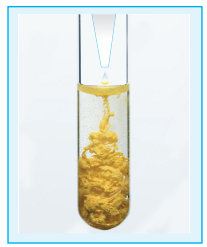

#### 7.9.2 Concentration of the reactants

The rate of a reaction increases with the increase in the concentration of the reactants. The effect of concentration is explained on the basis of collision theory of reaction rates. According to this theory, the rate of a reaction depends upon the number of collisions between the reacting molecules. Higher the concentration, greater is the possibility for collision and hence the rate.

**Activity**

1. Take three conical flasks and label them as A, B, and C.
2. Using a burette, add 10, 20 and 40 ml of 0.1M sodium thiosulphate solution to the flask A, B and C respectively. And then add 40, 30 and 10 ml of distilled water to the respective flasks so that the volume of solution in each flask is 50 ml.
3. Add 10 ml of 1M HCl to the conical flask A. Start the stop watch when half of the HCl has been added. Shake the contents carefully and place it on the tile with a cross mark as shown in the figure. Observe the conical flask from top and stop the stop watch when the cross mark just becomes invisible. Note the time.
4. Repeat the experiment with the contents on B and C. Record the observation.

| Flask | Volume of Na\(_2\)S\(_2\)O\(_3\) | Volume of water | Strength of Na\(_2\)S\(_2\)O\(_3\) | Time taken (t) |
|---|---|---|---|---|
| A | 10 | 40 | 0.02 | |
| B | 20 | 30 | 0.04 | |
| C | 40 | 10 | 0.08 | |

Draw a graph between \( \frac{1}{t} \) Vs concentration of sodium thiosulphate. \( \frac{1}{t} \) is a direct measure of rate of reaction and therefore, the increase in the concentration of reactants i.e \( \mathrm{Na}_2\mathrm{S}_2\mathrm{O}_3 \) increases the rate.

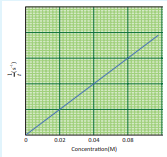

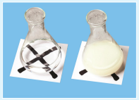

#### 7.9.3 Effect of surface area of the reactant

In heterogeneous reactions, the surface areas of the solid reactants play an important role in deciding the rate. For a given mass of a reactant, when the particle size decreases surface area increases. Increase in surface area of reactant leads to more collisions per litre per second, and hence the rate of reaction is increased. For example, powdered calcium carbonate reacts much faster with dilute HCl than with the same mass of \( \mathrm{CaCO}_3 \) as marble chips.

**Activity**

A known mass of marble chips are taken in a flask and a known volume of dilute HCl is added to the content, a stop clock is started when half the volume of HCl is added. The mass is noted at regular intervals until the reaction is complete. Same experiment is repeated with the same mass of powdered marble chips and the observations are recorded.

Reaction: \( \mathrm{CaCO}_3(s) + 2\mathrm{HCl}(aq) \longrightarrow \mathrm{CaCl}_2(aq) + \mathrm{H}_2\mathrm{O}(l) + \mathrm{CO}_2(g) \)

Since, carbon dioxide escapes during reaction, the mass of the flask gets lighter as the reaction proceeds. So, by measuring the loss in mass of the flask, we can follow the rate of the reaction. A plot of loss in mass Vs time is drawn.

For the powdered marble chips, the reaction is completed in less time. i.e., rate of a reaction increases when the surface area of a solid reactant is increased.

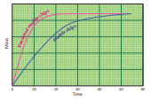

#### 7.9.4 Effect of presence of catalyst

So far we have learnt, that rate of reaction can be increased to certain extent by increasing the concentration, temperature and surface area of the reactant. However significant changes in the reaction can be brought out by the addition of a substance called catalyst. A catalyst is a substance which alters the rate of a reaction without itself undergoing any permanent chemical change. They may participate in the reaction, but are regenerated at the end of the reaction. In the presence of a catalyst, the energy of activation is lowered and hence, greater number of molecules can cross the energy barrier and change over to products, thereby increasing the rate of the reaction.

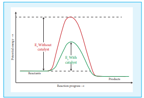

**Activity**

Take two test tubes and label them as A and B. Add 7 ml of 0.1N oxalic acid solution, 5 ml of 0.1N KMnO\(_4\) solution and 5 ml of 2N dilute \( \mathrm{H}_2\mathrm{SO}_4 \) in both the test tubes. The colour of the solution is pink in both the test tubes.

Now add few crystals of manganese sulphate to the content in test tube A. The pink colour fades and disappears. In this case, \( \mathrm{MnSO}_4 \) acts as a catalyst and increases the rate of oxidation of \( \mathrm{C_2O_4}^{2-} \) by \( \mathrm{MnO}_4^- \).

## Chemical kinetics in pharmaceuticals

Chemical kinetics has many applications in the field of pharmaceuticals. It is used to study the lifetimes and bioavailability of drugs within the body and this branch of study is called pharmacokinetics. Doctors usually prescribe drugs to be taken at different times of the day. i.e. some drugs are to be taken twice a day, while others are taken three times a day, or just once a day. Pharmacokinetic studies are used to determine the prescription (dosage and frequency). For example, Paracetamol is a well known antipyretic and analgesic that is prescribed in cases of fever and body pain. Pharmacokinetic studies showed that Paracetamol has a half-life of 2.5 hours within the body i.e. the plasma concentration of the drug is halved after 2.5 hrs. After 10 hours (4 half-lives) only 6.25% of drug remains. Based on such studies the dosage and frequency will be decided. In case of paracetamol, it is usually prescribed to be taken once in 6 hours depending upon the conditions.

## Summary

- Chemical kinetics is the study of the rate and the mechanism of chemical reactions, proceeding under given conditions of temperature, pressure, concentration etc.

- The change in the concentration of the species involved in a chemical reaction per unit time gives the rate of a reaction.

- The rate of the reaction, at a particular instant during the reaction is called the instantaneous rate. The shorter the time period, we choose, the closer we approach to the instantaneous rate.

- The rate represents the speed at which the reactants are converted into products at any instant.

- The rate constant is a proportionality constant and it is equal to the rate of reaction, when the concentration of each of the reactants is unity.

- Molecularity of a reaction is the total number of reactant species that are involved in an elementary step.

- The half life of a reaction is defined as the time required for the reactant concentration to reach one half its initial value. For a first order reaction, the half life is a constant.

- The rate of a reaction is affected by the following factors:
  1. Nature and state of the reactant
  2. Concentration of the reactant
  3. Surface area of the reactant
  4. Temperature of the reaction
  5. Presence of a catalyst

## Choose the correct answer

1. For a first order reaction \( \mathrm{A} \longrightarrow \mathrm{B} \) the rate constant is \( x\ \mathrm{min}^{-1} \). If the initial concentration of A is \( 0.01\mathrm{M} \), the concentration of A after one hour is given by the expression.

   a) \( 0.01e^{-x} \)
   b) \( 1 \times 10^{-2}(1 - e^{-60x}) \)
   c) \( (1 \times 10^{-2})e^{-60x} \)
   d) none of these

2. A zero order reaction \( \mathrm{X} \longrightarrow \mathrm{Product} \) with an initial concentration \( 0.02\mathrm{M} \) has a half life of \( 10\mathrm{min} \). If one starts with concentration \( 0.04\mathrm{M} \), then the half life is

   a) \( 10\mathrm{s} \)
   b) \( 5\mathrm{min} \)
   c) \( 20\mathrm{min} \)
   d) cannot be predicted using the given information

3. Among the following graphs showing variation of rate constant with temperature (T) for a reaction, the one that exhibits Arrhenius behavior over the entire temperature range is

4. For a first order reaction \( \mathrm{A} \longrightarrow \mathrm{product} \) with initial concentration \( x\ \mathrm{mol}\ \mathrm{L}^{-1} \), has a half life period of 2.5 hours. For the same reaction with initial concentration \( \left(\frac{x}{2}\right) \mathrm{mol}\ \mathrm{L}^{-1} \) the half life is

   a) \( 2.5\ \text{hours} \)
   b) \( \frac{2.5}{2}\ \text{hours} \)
   c) \( 2.5\ \text{hours} \)
   d) Without knowing the rate constant, \( t_{1/2} \) cannot be determined from the given data

5. For the reaction, \( 2\mathrm{NH}_3 \longrightarrow \mathrm{N}_2 + 3\mathrm{H}_2 \), if \( -\frac{d[\mathrm{NH}_3]}{dt} = k_1[\mathrm{NH}_3] \), \( \frac{d[\mathrm{N}_2]}{dt} = k_2[\mathrm{NH}_3] \), \( \frac{d[\mathrm{H}_2]}{dt} = k_3[\mathrm{NH}_3] \) then the relation between \( k_1, k_2 \) and \( k_3 \) is

   a) \( k_1 = k_2 = k_3 \)
   b) \( k_1 = 3k_2 = 2k_3 \)
   c) \( 1.5k_1 = 3k_2 = k_3 \)
   d) \( 2k_1 = k_2 = 3k_3 \)

6. The decomposition of phosphine (PH\(_3\)) on tungsten at low pressure is a first order reaction. It is because the (NEET)

   a) rate is proportional to the surface coverage
   b) rate is inversely proportional to the surface coverage
   c) rate is independent of the surface coverage
   d) rate of decomposition is slow

7. For a reaction Rate = \( k[\text{acetone}]^{3/2} \) then unit of rate constant and rate of reaction respectively is

   a) \( (\mathrm{mol}^{-1/2} \mathrm{L}^{1/2} \mathrm{s}^{-1}), (\mathrm{mol} \mathrm{L}^{-1} \mathrm{s}^{-1}) \)
   b) \( (\mathrm{mol}^{1/2} \mathrm{L}^{-1/2} \mathrm{s}^{-1}), (\mathrm{mol} \mathrm{L}^{-1} \mathrm{s}^{-1}) \)
   c) \( (\mathrm{mol}^{-1/2} \mathrm{L}^{1/2} \mathrm{s}^{-1}), (\mathrm{mol} \mathrm{L}^{-1} \mathrm{s}^{-1}) \)
   d) \( (\mathrm{mol} \mathrm{L}^{-1} \mathrm{s}^{-1}), (\mathrm{mol}^{1/2} \mathrm{L}^{-1/2} \mathrm{s}^{-1}) \)

8. The addition of a catalyst during a chemical reaction alters which of the following quantities? (NEET)

   a) Enthalpy
   b) Activation energy
   c) Entropy
   d) Internal energy

9. Consider the following statements:
   (i) increase in concentration of the reactant increases the rate of a zero order reaction.
   (ii) rate constant k is equal to collision frequency A if \( E_a = 0 \)
   (iii) rate constant k is equal to collision frequency A if \( E_a = \infty \)
   (iv) a plot of ln k vs \( T \) is a straight line.
   (v) a plot of ln k vs \( \left(\frac{1}{T}\right) \) is a straight line with a positive slope.

   Correct statements are

   a) (ii) only
   b) (ii) and (iv)
   c) (ii) and (v)
   d) (i), (ii) and (v)

10. In a reversible reaction, the enthalpy change and the activation energy in the forward direction are respectively \( -x\ \mathrm{kJ\ mol^{-1}} \) and \( y\ \mathrm{kJ\ mol^{-1}} \). Therefore, the energy of activation in the backward direction is

    a) \( (y - x)\ \mathrm{kJ\ mol^{-1}} \)
    b) \( (x + y)\ \mathrm{J\ mol^{-1}} \)
    c) \( (x - y)\ \mathrm{kJ\ mol^{-1}} \)
    d) \( (x + y) \times 10^3\ \mathrm{J\ mol^{-1}} \)

11. What is the activation energy for a reaction if its rate doubles when the temperature is raised from \( 200\mathrm{K} \) to \( 400\mathrm{K} \) (\( R = 8.314\ \mathrm{J\ K^{-1}\ mol^{-1}} \))

    a) \( 234.65\ \mathrm{kJ\ mol^{-1}} \)
    b) \( 434.65\ \mathrm{kJ\ mol^{-1}} \)
    c) \( 2.305\ \mathrm{kJ\ mol^{-1}} \)
    d) \( 334.65\ \mathrm{J\ mol^{-1}} \)

12. Cyclopropane undergoes following reaction: \( \Delta \longrightarrow \Delta \longrightarrow \Delta \); This reaction follows first order kinetics. The rate constant at particular temperature is \( 2.303 \times 10^{-2}\ \mathrm{hour}^{-1} \). The initial concentration of cyclopropane is 0.25 M. What will be the concentration of cyclopropane after 1806 minutes? \( (\log 2 = 0.3010) \)

    a) \( 0.125\mathrm{M} \)
    b) \( 0.215\mathrm{M} \)
    c) \( 0.25 \times 2.303\mathrm{M} \)
    d) \( 0.05\mathrm{M} \)

13. For a first order reaction, the rate constant is \( 6.909\ \mathrm{min}^{-1} \). The time taken for \( 75\% \) conversion in minutes is

14. In a first order reaction \( x \longrightarrow y \); if k is the rate constant and the initial concentration of the reactant x is \( 0.1\mathrm{M} \) then, the half life is

15. Predict the rate law of the following reaction based on the data given below

    \[
    2\mathrm{A} + \mathrm{B} \longrightarrow \mathrm{C} + 3\mathrm{D}
    \]

    | Reaction number | [A] (min) | [B] (min) | Initial rate (M s\(^{-1}\)) |
    |---|---|---|---|
    | 1 | 0.1 | 0.1 | x |
    | 2 | 0.2 | 0.1 | 2x |
    | 3 | 0.1 | 0.2 | 4x |
    | 4 | 0.2 | 0.2 | 8x |

    a) rate = \( k[\mathrm{A}]^1[\mathrm{B}] \)
    b) rate = \( k[\mathrm{A}][\mathrm{B}]^2 \)
    c) rate = \( k[\mathrm{A}][\mathrm{B}] \)
    d) rate = \( k[\mathrm{A}]^2[\mathrm{B}]^2 \)

16. Assertion: rate of reaction doubles when the concentration of the reactant is doubled if it is a first order reaction.
    Reason: rate constant also doubles

    a) Both assertion and reason are true and reason is the correct explanation of assertion.
    b) Both assertion and reason are true but reason is not the correct explanation of assertion.
    c) Assertion is true but reason is false.
    d) Both assertion and reason are false.

17. The rate constant of a reaction is \( 5.8 \times 10^{-2}\ \mathrm{s}^{-1} \). The order of the reaction is

    a) First order
    b) zero order
    c) Second order
    d) Third order

18. For the reaction \( \mathrm{N}_2\mathrm{O}_5(g) \longrightarrow 2\mathrm{NO}_2(g) + \frac{1}{2}\mathrm{O}_2(g) \), the value of rate of disappearance of \( \mathrm{N}_2\mathrm{O}_5 \) is given as \( 6.5 \times 10^{-2}\ \mathrm{mol\ L^{-1}\ s^{-1}} \). The rate of formation of \( \mathrm{NO}_2 \) and \( \mathrm{O}_2 \) is given

19. During the decomposition of \( \mathrm{H}_2\mathrm{O}_2 \) to give dioxygen, 48 g \( \mathrm{O}_2 \) is formed per minute at certain point of time. The rate of formation of water at this point is

    a) 0.75 mol min\(^{-1}\)
    b) 1.5 mol min\(^{-1}\)
    c) 2.25 mol min\(^{-1}\)
    d) 3.0 mol min\(^{-1}\)

20. If the initial concentration of the reactant is doubled, the time for half reaction is also doubled. Then the order of the reaction is

    a) Zero
    b) one
    c) Fraction
    d) none

21. In a homogeneous reaction \( \mathrm{A} \longrightarrow \mathrm{B} + \mathrm{C} + \mathrm{D} \), the initial pressure was \( \mathrm{P}_0 \) and after time t it was \( \mathrm{P} \). expression for rate constant in terms of \( \mathrm{P}_0 \), \( \mathrm{P} \) and t will be

    a) \( k = \left(\frac{2.303}{t}\right) \log \left(\frac{2\mathrm{P}_0}{3\mathrm{P}_0 - \mathrm{P}}\right) \)
    b) \( k = \left(\frac{2.303}{t}\right) \log \left(\frac{2\mathrm{P}_0}{\mathrm{P}_0 - \mathrm{P}}\right) \)
    c) \( k = \left(\frac{2.303}{t}\right) \log \left(\frac{3\mathrm{P}_0 - \mathrm{P}}{2\mathrm{P}_0}\right) \)
    d) \( k = \left(\frac{2.303}{t}\right) \log \left(\frac{2\mathrm{P}_0}{3\mathrm{P}_0 - 2\mathrm{P}}\right) \)

22. If \( 75\% \) of a first order reaction was completed in 60 minutes, \( 50\% \) of the same reaction under the same conditions would be completed in

    a) 20 minutes
    b) 30 minutes
    c) 35 minutes
    d) 75 minutes

23. The half life period of a radioactive element is 140 days. After 560 days, 1 g of element will be reduced to

    a) \( \left(\frac{1}{2}\right)\mathrm{g} \)
    b) \( \left(\frac{1}{4}\right)\mathrm{g} \)
    c) \( \left(\frac{1}{8}\right)\mathrm{g} \)
    d) \( \left(\frac{1}{16}\right)\mathrm{g} \)

24. The correct difference between first and second order reactions is that (NEET)

    a) A first order reaction can be catalysed; a second order reaction cannot be catalysed.
    b) The half life of a first order reaction does not depend on \( [\mathrm{A}_0] \); the half life of a second order reaction does depend on \( [\mathrm{A}_0] \).
    c) The rate of a first order reaction does not depend on reactant concentrations; the rate of a second order reaction does depend on reactant concentrations.
    d) The rate of a first order reaction does depend on reactant concentrations; the rate of a second order reaction does not depend on reactant concentrations.

25. After 2 hours, a radioactive substance becomes \( \left(\frac{1}{16}\right)^{\text{th}} \) of original amount. Then the half life (in minutes) is

## Answer the following questions

1. Define average rate and instantaneous rate.

2. Define rate law and rate constant.

3. Derive integrated rate law for a zero order reaction \( \mathrm{A} \longrightarrow \mathrm{product} \).

4. Define half life of a reaction. Show that for a first order reaction half life is independent of initial concentration.

5. What is an elementary reaction? Give the differences between order and molecularity of a reaction.

6. Explain the rate determining step with an example.

7. Describe the graphical representation of first order reaction.

8. Write the rate law for the following reactions.
   (a) A reaction that is \( 3/2 \) order in x and zero order in y.
   (b) A reaction that is second order in NO and first order in \( \mathrm{Br}_2 \).

9. Explain the effect of catalyst on reaction rate with an example.

10. The rate law for a reaction of A, B and C has been found to be rate \( = k[\mathrm{A}]^2[\mathrm{B}][\mathrm{L}]^{3/2} \). How would the rate of reaction change when
    (i) Concentration of [L] is quadrupled
    (ii) Concentration of both [A] and [B] are doubled
    (iii) Concentration of [A] is halved
    (iv) Concentration of [A] is reduced to \( \left(\frac{1}{\sqrt{3}}\right) \) and concentration of [L] is quadrupled.

11. The rate of formation of a dimer in a second order reaction is \( 7.5 \times 10^{-3} \) mol \( \mathrm{L}^{-1} \mathrm{s}^{-1} \) at \( 0.05\ \mathrm{mol}\ \mathrm{L}^{-1} \) monomer concentration. Calculate the rate constant.

12. For a reaction \( x + y + z \longrightarrow \) products the rate law is given by rate \( = k[x]^{3/2}[y]^{1/2} \) what is the overall order of the reaction and what is the order of the reaction with respect to z.

13. Explain briefly the collision theory of bimolecular reactions.

14. Write Arrhenius equation and explain the terms involved.

15. The decomposition of \( \mathrm{Cl}_2\mathrm{O}_7 \) at \( 500\mathrm{K} \) in the gas phase to \( \mathrm{Cl}_2 \) and \( \mathrm{O}_2 \) is a first order reaction. After 1 minute at \( 500\mathrm{K} \), the pressure of \( \mathrm{Cl}_2\mathrm{O}_7 \) falls from 0.08 to 0.04 atm. Calculate the rate constant in \( \mathrm{s}^{-1} \).

16. Give two examples for zero order reaction.

17. Explain pseudo first order reaction with an example.

18. Identify the order for the following reactions
    (i) Rusting of Iron
    (ii) Radioactive disintegration of \( \mathrm{U}^{238} \)
    (iii) \( 2\mathrm{A} + 3\mathrm{B} \longrightarrow \) products; rate \( = k[\mathrm{A}]^{1/2}[\mathrm{B}]^2 \)

19. A gas phase reaction has energy of activation \( 200\ \mathrm{kJ\ mol}^{-1} \). If the frequency factor of the reaction is \( 1.6 \times 10^{13}\ \mathrm{s}^{-1} \). Calculate the rate constant at \( 600\mathrm{K} \). \( (e^{-40.09} = 3.8 \times 10^{-18}) \)

20. For the reaction \( 2x + y \longrightarrow \mathrm{L} \) find the rate law from the following data.

    | [x] (M) | [y] (M) | rate (M s\(^{-1}\)) |
    |---|---|---|
    | 0.2 | 0.02 | 0.15 |
    | 0.4 | 0.02 | 0.30 |
    | 0.4 | 0.08 | 1.20 |

21. How do concentrations of the reactant influence the rate of reaction?

22. How do nature of the reactant influence rate of reaction.

23. The rate constant for a first order reaction is \( 1.54 \times 10^{-3}\ \mathrm{s}^{-1} \). Calculate its half life time.

24. The half life of the homogeneous gaseous reaction \( \mathrm{SO}_2\mathrm{Cl}_2 \rightarrow \mathrm{SO}_2 + \mathrm{Cl}_2 \) which obeys first order kinetics is 8.0 minutes. How long will it take for the concentration of \( \mathrm{SO}_2\mathrm{Cl}_2 \) to be reduced to \( 1\% \) of the initial value?

25. The time for half change in a first order decomposition of a substance A is 60 seconds. Calculate the rate constant. How much of A will be left after 180 seconds?

26. A zero order reaction is \( 20\% \) complete in 20 minutes. Calculate the value of the rate constant. In what time will the reaction be \( 80\% \) complete?

27. The activation energy of a reaction is \( 22.5\ \mathrm{kCal\ mol^{-1}} \) and the value of rate constant at \( 40^{\circ}\mathrm{C} \) is \( 1.8 \times 10^{-5}\ \mathrm{s}^{-1} \). Calculate the frequency factor, A.

28. Benzene diazonium chloride in aqueous solution decomposes according to the equation \( \mathrm{C}_6\mathrm{H}_5\mathrm{N}_2\mathrm{Cl} \longrightarrow \mathrm{C}_6\mathrm{H}_5\mathrm{Cl} + \mathrm{N}_2 \). Starting with an initial concentration of \( 10\ \mathrm{g\ L^{-1}} \), the volume of \( \mathrm{N}_2 \) gas obtained at \( 50^{\circ}\mathrm{C} \) at different intervals of time was found to be as under:

    | t (min): | 6 | 12 | 18 | 24 | 30 | ∞ |
    |---|---|---|---|---|---|---|
    | Vol. of N\(_2\) (ml): | 19.3 | 32.6 | 41.3 | 46.5 | 50.4 | 58.3 |

    Show that the above reaction follows the first order kinetics. What is the value of the rate constant?

29. From the following data, show that the decomposition of hydrogen peroxide is a reaction of the first order:

    | t (min) | 0 | 10 | 20 |
    |---|---|---|---|
    | V (ml) | 46.1 | 29.8 | 19.3 |

    Where \( t \) is the time in minutes and \( V \) is the volume of standard \( \mathrm{KMnO}_4 \) solution required for titrating the same volume of the reaction mixture.

30. A first order reaction is \( 40\% \) complete in 50 minutes. Calculate the value of the rate constant. In what time will the reaction be \( 80\% \) complete?
