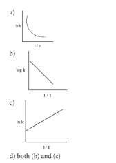
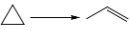

# Chemical Kinetics - Evaluation

## I. Multiple Choice Questions

1. For a first order reaction $\text{A} \longrightarrow \text{B}$ the rate constant is $x \text{ min}^{-1}$. If the initial concentration of $\text{A}$ is $0.01\text{M}$ , the concentration of $\text{A}$ after one hour is given by the expression.
   - a) $0.01 \text{ e}^{-x}$
   - b) $1 \times 10^{-2} \left(1 - \text{e}^{-60x}\right)$
   - c) $\left(1 \times 10^{-2}\right) \text{e}^{-60x}$
   - d) none of these

2. A zero order reaction $\text{X} \longrightarrow \text{Product}$, with an initial concentration $0.02\text{M}$ has a half life of $10 \text{ min}$. if one starts with concentration $0.04\text{M}$, then the half life is
   - a) $10 \text{ s}$
   - b) $5 \text{ min}$
   - c) $20 \text{ min}$
   - d) cannot be predicted using the given information

3. Among the following graphs showing variation of rate constant with temperature ($\text{T}$) for a reaction, the one that exhibits Arrhenius behavior over the entire temperature range is
   

4. For a first order reaction $\text{A} \longrightarrow \text{product}$ with initial concentration $x \text{ mol L}^{-1}$, has a half life period of $2.5 \text{ hours}$. For the same reaction with initial concentration $\left(\frac{x}{2}\right) \text{ mol L}^{-1}$ the half life is
   - a) $(2.5 \times 2)\text{hours}$
   - b) $\left(\frac{2.5}{2}\right)\text{hours}$
   - c) $2.5 \text{ hours}$
   - d) Without knowing the rate constant, $\text{t}_{1/2}$ cannot be determined from the given data

5. For the reaction, $2\text{NH}_3 \longrightarrow \text{N}_2 + 3\text{H}_2$ , if $\frac{-\text{d}[\text{NH}_3]}{\text{dt}} = \text{k}_1 [\text{NH}_3]$, $\frac{\text{d}[\text{N}_2]}{\text{dt}} = \text{k}_2 [\text{NH}_3]$, $\frac{\text{d}[\text{H}_2]}{\text{dt}} = \text{k}_3 [\text{NH}_3]$ then the relation between $\text{k}_1, \text{k}_2 \text{ and } \text{k}_3$ is
   - a) $\text{k}_1 = \text{k}_2 = \text{k}_3$
   - b) $\text{k}_1 = 3\text{k}_2 = 2\text{k}_3$
   - c) $1.5\text{k}_1 = 3\text{k}_2 = \text{k}_3$
   - d) $2\text{k}_1 = \text{k}_2 = 3\text{k}_3$

6. The decomposition of phosphine ($\text{PH}_3$) on tungsten at low pressure is a first order reaction. It is because the (NEET)
   - a) rate is proportional to the surface coverage
   - b) rate is inversely proportional to the surface coverage
   - c) rate is independent of the surface coverage
   - d) rate of decomposition is slow

7. For a reaction $\text{Rate} = \text{k}[\text{acetone}]^{3/2}$ then unit of rate constant and rate of reaction respectively is
   - a) $(\text{mol L}^{-1}\text{s}^{-1}), (\text{mol}^{-1/2} \text{ L}^{1/2} \text{ s}^{-1})$
   - b) $(\text{mol}^{-1/2} \text{ L}^{1/2} \text{ s}^{-1}), (\text{mol L}^{-1}\text{s}^{-1})$
   - c) $(\text{mol}^{1/2} \text{ L}^{-1/2} \text{ s}^{-1}), (\text{mol L}^{-1}\text{s}^{-1})$
   - d) $(\text{mol L}^{-1}\text{s}^{-1}), (\text{mol}^{1/2} \text{ L}^{-1/2} \text{ s}^{-1})$

8. The addition of a catalyst during a chemical reaction alters which of the following quantities? (NEET)
   - a) Enthalpy
   - b) Activation energy
   - c) Entropy
   - d) Internal energy

9. Consider the following statements :
   - (i) increase in concentration of the reactant increases the rate of a zero order reaction.
   - (ii) rate constant $\text{k}$ is equal to collision frequency $\text{A}$ if $\text{E}_\text{a} = 0$
   - (iii) rate constant $\text{k}$ is equal to collision frequency $\text{A}$ if $\text{E}_\text{a} = \infty$
   - (iv) a plot of $\ln(\text{k})$ vs $\text{T}$ is a straight line.
   - (v) a plot of $\ln(\text{k})$ vs $\left(\frac{1}{\text{T}}\right)$ is a straight line with a negative slope.

   Correct statements are
   - a) (ii) only
   - b) (ii) and (iv)
   - c) (ii) and (v)
   - d) (i), (ii) and (v)

10. In a reversible reaction, the enthalpy change and the activation energy in the forward direction are respectively $-x \text{ kJ mol}^{-1}$ and $y \text{ kJ mol}^{-1}$. Therefore, the energy of activation in the backward direction is
    - a) $(y - x)\text{kJ mol}^{-1}$
    - b) $(x + y)\text{J mol}^{-1}$
    - c) $(x - y)\text{kJ mol}^{-1}$
    - d) $(x + y) \times 10^3 \text{ J mol}^{-1}$

11. What is the activation energy for a reaction if its rate doubles when the temperature is raised from $200\text{K}$ to $400\text{K}$? ($\text{R} = 8.314 \text{ JK}^{-1}\text{mol}^{-1}$)
    - a) $234.65 \text{ kJ mol}^{-1}$
    - b) $434.65 \text{ kJ mol}^{-1}$
    - c) $2.305 \text{ kJ mol}^{-1}$
    - d) $334.65 \text{ J mol}^{-1}$

12.  : This reaction follows first order kinetics. The rate constant at particular temperature is $2.303 \times 10^{-2} \text{ hour}^{-1}$. The initial concentration of cyclopropane is $0.25 \text{ M}$. What will be the concentration of cyclopropane after $1806 \text{ minutes}$? ($\log 2 = 0.3010$)
    - a) $0.125\text{M}$
    - b) $0.215\text{M}$
    - c) $0.25 \times 2.303\text{M}$
    - d) $0.05\text{M}$

13. For a first order reaction, the rate constant is $6.909 \text{ min}^{-1}$, the time taken for $75\%$ conversion in minutes is
    - a) $\left(\frac{3}{2}\right)\log 2$
    - b) $\left(\frac{2}{3}\right)\log 2$
    - c) $\left(\frac{3}{2}\right)\log\left(\frac{3}{4}\right)$
    - d) $\left(\frac{2}{3}\right)\log\left(\frac{4}{3}\right)$

14. In a first order reaction $x \longrightarrow y$; if $\text{k}$ is the rate constant and the initial concentration of the reactant $x$ is $0.1\text{M}$, then, the half life is
    - a) $\left(\frac{\log 2}{\text{k}}\right)$
    - b) $\left(\frac{0.693}{(0.1) \text{ k}}\right)$
    - c) $\left(\frac{\ln 2}{\text{k}}\right)$
    - d) none of these

15. Predict the rate law of the following reaction based on the data given below:
    $$2\text{A} + \text{B} \longrightarrow \text{C} + 3\text{D}$$

    | Reaction number | $[\text{A}]$ (min) | $[\text{B}]$ (min) | Initial rate ($\text{M s}^{-1}$) |
    | :---: | :---: | :---: | :---: |
    | 1 | 0.1 | 0.1 | $x$ |
    | 2 | 0.2 | 0.1 | $2x$ |
    | 3 | 0.1 | 0.2 | $4x$ |
    | 4 | 0.2 | 0.2 | $8x$ |

    - a) $\text{rate} = \text{k}[\text{A}]^2[\text{B}]$
    - b) $\text{rate} = \text{k}[\text{A}][\text{B}]^2$
    - c) $\text{rate} = \text{k}[\text{A}][\text{B}]$
    - d) $\text{rate} = \text{k}[\text{A}]^{1/2}[\text{B}]^{1/2}$

16. **Assertion:** rate of reaction doubles when the concentration of the reactant is doubles if it is a first order reaction.  
    **Reason:** rate constant also doubles  
    - a) Both assertion and reason are true and reason is the correct explanation of assertion.
    - b) Both assertion and reason are true but reason is not the correct explanation of assertion.
    - c) Assertion is true but reason is false.
    - d) Both assertion and reason are false.

17. The rate constant of a reaction is $5.8 \times 10^{-2} \text{ s}^{-1}$. The order of the reaction is
    - a) First order
    - b) zero order
    - c) Second order
    - d) Third order

18. For the reaction $\text{N}_2\text{O}_5(\text{g}) \longrightarrow 2\text{NO}_2(\text{g}) + \frac{1}{2}\text{O}_2(\text{g})$ , the value of rate of disappearance of $\text{N}_2\text{O}_5$ is given as $6.5 \times 10^{-2} \text{ mol L}^{-1}\text{s}^{-1}$. The rate of formation of $\text{NO}_2$ and $\text{O}_2$ is given respectively as
    - a) $(3.25 \times 10^{-2} \text{ mol L}^{-1}\text{s}^{-1})$ and $(1.3 \times 10^{-2} \text{ mol L}^{-1}\text{s}^{-1})$
    - b) $(1.3 \times 10^{-1} \text{ mol L}^{-1}\text{s}^{-1})$ and $(3.25 \times 10^{-2} \text{ mol L}^{-1}\text{s}^{-1})$
    - c) $(1.3 \times 10^{-1} \text{ mol L}^{-1}\text{s}^{-1})$ and $(3.25 \times 10^{-1} \text{ mol L}^{-1}\text{s}^{-1})$
    - d) None of these

19. During the decomposition of $\text{H}_2\text{O}_2$ to give dioxygen, $48 \text{ g O}_2$ is formed per minute at certain point of time. The rate of formation of water at this point is
    - a) $0.75 \text{ mol min}^{-1}$
    - b) $1.5 \text{ mol min}^{-1}$
    - c) $2.25 \text{ mol min}^{-1}$
    - d) $3.0 \text{ mol min}^{-1}$

20. If the initial concentration of the reactant is doubled, the time for half reaction is also doubled. Then the order of the reaction is
    - a) Zero
    - b) one
    - c) Fraction
    - d) none

21. In a homogeneous reaction $\text{A} \longrightarrow \text{B} + \text{C} + \text{D}$, the initial pressure was $\text{P}_0$ and after time $\text{t}$ it was $\text{P}$. expression for rate constant in terms of $\text{P}_0$, $\text{P}$ and $\text{t}$ will be
    - a) $\text{k} = \left(\frac{2.303}{\text{t}}\right)\log\left(\frac{2\text{P}_0}{3\text{P}_0 - \text{P}}\right)$
    - b) $\text{k} = \left(\frac{2.303}{\text{t}}\right)\log\left(\frac{2\text{P}_0}{\text{P}_0 - \text{P}}\right)$
    - c) $\text{k} = \left(\frac{2.303}{\text{t}}\right)\log\left(\frac{3\text{P}_0 - \text{P}}{2\text{P}_0}\right)$
    - d) $\text{k} = \left(\frac{2.303}{\text{t}}\right)\log\left(\frac{2\text{P}_0}{3\text{P}_0 - 2\text{P}}\right)$

22. If $75\%$ of a first order reaction was completed in $60 \text{ minutes}$ , $50\%$ of the same reaction under the same conditions would be completed in
    - a) $20 \text{ minutes}$
    - b) $30 \text{ minutes}$
    - c) $35 \text{ minutes}$
    - d) $75 \text{ minutes}$

23. The half life period of a radioactive element is $140 \text{ days}$. After $560 \text{ days}$ , $1 \text{ g}$ of element will be reduced to
    - a) $\left(\frac{1}{2}\right)\text{g}$
    - b) $\left(\frac{1}{4}\right)\text{g}$
    - c) $\left(\frac{1}{8}\right)\text{g}$
    - d) $\left(\frac{1}{16}\right)\text{g}$

24. The correct difference between first and second order reactions is that (NEET)
    - a) A first order reaction can be catalysed; a second order reaction cannot be catalysed.
    - b) The half life of a first order reaction does not depend on $[\text{A}_0]$; the half life of a second order reaction does depend on $[\text{A}_0]$.
    - c) The rate of a first order reaction does not depend on reactant concentrations; the rate of a second order reaction does depend on reactant concentrations.
    - d) The rate of a first order reaction does depend on reactant concentrations; the rate of a second order reaction does not depend on reactant concentrations.

25. After $2 \text{ hours}$, a radioactive substance becomes $\left(\frac{1}{16}\right)^{\text{th}}$ of original amount. Then the half life (in min) is
    - a) $60 \text{ minutes}$
    - b) $120 \text{ minutes}$
    - c) $30 \text{ minutes}$
    - d) $15 \text{ minutes}$

---

## II. Short Answer Questions

1. Define average rate and instantaneous rate.
2. Define rate law and rate constant.
3. Derive integrated rate law for a zero order reaction $\text{A} \longrightarrow \text{product}$ .
4. Define half life of a reaction. Show that for a first order reaction half life is independent of initial concentration.
5. What is an elementary reaction? Give the differences between order and molecularity of a reaction.
6. Explain the rate determining step with an example.
7. Describe the graphical representation of first order reaction.
8. Write the rate law for the following reactions.
   - **(a)** A reaction that is $3/2$ order in x and zero order in y.
   - **(b)** A reaction that is second order in $\text{NO}$ and first order in $\text{Br}_2$.
9. Explain the effect of catalyst on reaction rate with an example.
10. The rate law for a reaction of $\text{A, B and C}$ has been found to be $\text{rate} = \text{k}[\text{A}]^2[\text{B}][\text{L}]^{3/2}$. How would the rate of reaction change when
    - **(i)** Concentration of $[\text{L}]$ is quadrupled
    - **(ii)** Concentration of both $[\text{A}]$ and $[\text{B}]$ are doubled
    - **(iii)** Concentration of $[\text{A}]$ is halved
    - **(iv)** Concentration of $[\text{A}]$ is reduced to $\left(\frac{1}{3}\right)$ and concentration of $[\text{L}]$ is quadrupled.
11. The rate of formation of a dimer in a second order reaction is $7.5 \times 10^{-3} \text{ mol L}^{-1}\text{s}^{-1}$ at $0.05 \text{ mol L}^{-1}$ monomer concentration. Calculate the rate constant.
12. For a reaction $x + y + z \longrightarrow \text{products}$ the rate law is given by $\text{rate} = \text{k}[\text{x}]^{3/2}[\text{y}]^{1/2}$ what is the overall order of the reaction and what is the order of the reaction with respect to z.
13. Explain briefly the collision theory of bimolecular reactions.
14. Write Arrhenius equation and explains the terms involved.
15. The decomposition of $\text{Cl}_2\text{O}_7$ at $500\text{K}$ in the gas phase to $\text{Cl}_2$ and $\text{O}_2$ is a first order reaction. After $1 \text{ minute}$ at $500\text{K}$, the pressure of $\text{Cl}_2\text{O}_7$ falls from $0.08$ to $0.04 \text{ atm}$. Calculate the rate constant in $\text{s}^{-1}$.
16. Give two examples for zero order reaction
17. Explain pseudo first order reaction with an example.
18. Identify the order for the following reactions
    - **(i)** Rusting of Iron
    - **(ii)** Radioactive disintegration of $_{92}\text{U}^{238}$
    - **(iii)** $2\text{A} + 3\text{B} \longrightarrow \text{products} \text{ ; rate} = \text{k}[\text{A}]^{1/2}[\text{B}]^2$
19. A gas phase reaction has energy of activation $200 \text{ kJ mol}^{-1}$. If the frequency factor of the reaction is $1.6 \times 10^{13} \text{ s}^{-1}$. Calculate the rate constant at $600 \text{ K}$. ($\text{e}^{-40.09} = 3.8 \times 10^{-18}$)
20. For the reaction $2x + y \longrightarrow \text{L}$ find the rate law from the following data.

    | $[x]$ (M) | $[y]$ (M) | rate ($\text{M s}^{-1}$) |
    | :---: | :---: | :---: |
    | 0.2 | 0.02 | 0.15 |
    | 0.4 | 0.02 | 0.30 |
    | 0.4 | 0.08 | 1.20 |

21. How do concentrations of the reactant influence the rate of reaction?
22. How do nature of the reactant influence rate of reaction?
23. The rate constant for a first order reaction is $1.54 \times 10^{-3} \text{ s}^{-1}$. Calculate its half life time.
24. The half life of the homogeneous gaseous reaction $\text{SO}_2\text{Cl}_2 \rightarrow \text{SO}_2 + \text{Cl}_2$ which obeys first order kinetics is $8.0 \text{ minutes}$. How long will it take for the concentration of $\text{SO}_2\text{Cl}_2$ to be reduced to $1\%$ of the initial value?
25. The time for half change in a first order decomposition of a substance $\text{A}$ is $60 \text{ seconds}$. Calculate the rate constant. How much of $\text{A}$ will be left after $180 \text{ seconds}$?
26. A zero order reaction is $20\%$ complete in $20 \text{ minutes}$. Calculate the value of the rate constant. In what time will the reaction be $80\%$ complete?
27. The activation energy of a reaction is $22.5 \text{ k Cal mol}^{-1}$ and the value of rate constant at $40^\circ\text{C}$ is $1.8 \times 10^{-5} \text{ s}^{-1}$. Calculate the frequency factor, $\text{A}$.
28. Benzene diazonium chloride in aqueous solution decomposes according to the equation $\text{C}_6\text{H}_5\text{N}_2\text{Cl} \longrightarrow \text{C}_6\text{H}_5\text{Cl} + \text{N}_2$ . Starting with an initial concentration of $10 \text{ g L}^{-1}$, the volume of $\text{N}_2$ gas obtained at $50^\circ\text{C}$ at different intervals of time was found to be as under:

    | $\text{t (min):}$ | 6 | 12 | 18 | 24 | 30 | $\infty$ |
    | :--- | :---: | :---: | :---: | :---: | :---: | :---: |
    | $\text{Vol. of N}_2 \text{ (ml):}$ | 19.3 | 32.6 | 41.3 | 46.5 | 50.4 | 58.3 |

    Show that the above reaction follows the first order kinetics. What is the value of the rate constant?

29. From the following data, show that the decomposition of hydrogen peroxide is a reaction of the first order:

    | $\text{t (min)}$ | 0 | 10 | 20 |
    | :--- | :---: | :---: | :---: |
    | $\text{V (ml)}$ | 46.1 | 29.8 | 19.3 |

    Where $t$ is the time in minutes and $\text{V}$ is the volume of standard $\text{KMnO}_4$ solution required for titrating the same volume of the reaction mixture.

30. A first order reaction is $40\%$ complete in $50 \text{ minutes}$. Calculate the value of the rate constant. In what time will the reaction be $80\%$ complete?