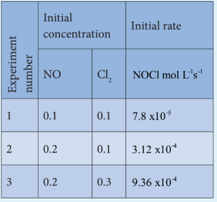

### 7.4 Molecularity

Kinetic studies involve not only measurement of a rate of reaction but also proposal of a reasonable reaction mechanism. Each and every single step in a reaction mechanism is called an elementary reaction.

An elementary step is characterized by its molecularity. The total number of reactant species that are involved in an elementary step is called molecularity of that particular step. Let us recall the hydrolysis of t-butyl bromide studied in XI standard. Since the rate determining elementary step involves only t-butyl bromide, the reaction is called a Unimolecular Nucleophilic substitution \( (\mathrm{S_N^1}) \) reaction.

Let us understand the elementary reactions by considering another reaction, the decomposition of hydrogen peroxide catalysed by \( \mathrm{I}^- \).

\[
2\mathrm{H}_2\mathrm{O}_2(aq) \longrightarrow 2\mathrm{H}_2\mathrm{O}(l) + \mathrm{O}_2(g)
\]

It is experimentally found that the reaction is first order with respect to both \( \mathrm{H}_2\mathrm{O}_2 \) and \( \mathrm{I}^- \), which indicates that \( \mathrm{I}^- \) is also involved in the reaction. The mechanism involves the following steps.

Step:1 \( \mathrm{H}_2\mathrm{O}_2(aq) + \mathrm{I}^-(aq) \longrightarrow \mathrm{H}_2\mathrm{O}(l) + \mathrm{OI}^-(aq) \)

Step:2 \( \mathrm{H}_2\mathrm{O}_2(aq) + \mathrm{OI}^-(aq) \longrightarrow \mathrm{H}_2\mathrm{O}(l) + \mathrm{I}^-(aq) + \mathrm{O}_2(g) \)

Overall reaction is

\[
2\mathrm{H}_2\mathrm{O}_2(aq) \longrightarrow 2\mathrm{H}_2\mathrm{O}(l) + \mathrm{O}_2(g)
\]

These two reactions are elementary reactions. Adding eqn (1) and (2) gives the overall reaction. Step 1 is the rate determining step, since it involves both \( \mathrm{H}_2\mathrm{O}_2 \) and \( \mathrm{I}^- \), the overall reaction is bimolecular.

**Differences between order and molecularity**

| s.no | Order of a reaction | Molecularity of a reaction |
|---|---|---|
| 1 | It is the sum of the powers of concentration terms involved in the experimentally determined rate law. | It is the total number of reactant species that are involved in an elementary step. |
| 2 | It can be zero (or) fractional (or) integer. | It is always a whole number, cannot be zero or a fractional number. |
| 3 | It is assigned for a overall reaction. | It is assigned for each elementary step of mechanism. |

**Example 1**

Consider the oxidation of nitric oxide to form \( \mathrm{NO}_2 \)

\[
2\mathrm{NO}(g) + \mathrm{O}_2(g) \longrightarrow 2\mathrm{NO}_2(g)
\]

(a) Express the rate of the reaction in terms of changes in the concentration of \( \mathrm{NO} \), \( \mathrm{O}_2 \) and \( \mathrm{NO}_2 \)

(b) At a particular instant, when \( [\mathrm{O}_2] \) is decreasing at \( 0.2\ \mathrm{mol\ L^{-1}\ s^{-1}} \) at what rate is \( [\mathrm{NO}_2] \) increasing at that instant?

**Solution:**

\[
\text{(a) Rate} = \frac{-1}{2}\frac{d[\mathrm{NO}]}{dt} = \frac{-d[\mathrm{O}_2]}{dt} = \frac{1}{2}\frac{d[\mathrm{NO}_2]}{dt}
\]

\[
\text{(b) } \frac{-d[\mathrm{O}_2]}{dt} = \frac{1}{2}\frac{d[\mathrm{NO}_2]}{dt}
\]

\[
\frac{d[\mathrm{NO}_2]}{dt} = 2 \times \left(\frac{-d[\mathrm{O}_2]}{dt}\right) = 2 \times 0.2\ \mathrm{mol\ L^{-1}\ s^{-1}}
\]

\[
= 0.4\ \mathrm{mol\ L^{-1}\ s^{-1}}
\]

>**Evaluate yourself 1**
>
>1) Write the rate expression for the following reactions, assuming them as elementary reactions.
>
>(i) \( 3\mathrm{A} + 5\mathrm{B}_2 \longrightarrow 4\mathrm{CD} \)
>
>(ii) \( \mathrm{X}_2 + \mathrm{Y}_2 \longrightarrow 2\mathrm{XY} \)
>
>2) Consider the decomposition of \( \mathrm{N}_2\mathrm{O}_5(g) \) to form \( \mathrm{NO}_2(g) \) and \( \mathrm{O}_2(g) \). At a particular instant \( \mathrm{N}_2\mathrm{O}_5 \) disappears at a rate of \( 2.5 \times 10^{-2}\ \mathrm{mol\ dm^{-3}\ s^{-1}} \). At what rates are \( \mathrm{NO}_2 \) and \( \mathrm{O}_2 \) formed? What is the rate of the reaction?

**Example 2**

1. What is the order with respect to each of the reactant and overall order of the following reactions?
(a) \( 5\mathrm{Br}^-(aq) + \mathrm{BrO}_3^-(aq) + 6\mathrm{H}^+(aq) \longrightarrow 3\mathrm{Br}_2(l) + 3\mathrm{H}_2\mathrm{O}(l) \)

The experimental rate law is Rate = \( k[\mathrm{Br}^-][\mathrm{BrO}_3^-][\mathrm{H}^+]^2 \)

(b) \( \mathrm{CH}_3\mathrm{CHO}(g) \longrightarrow \mathrm{CH}_4(g) + \mathrm{CO}(g) \)

the experimental rate law is Rate = \( k[\mathrm{CH}_3\mathrm{CHO}]^{3/2} \)

**Solution:**

a) First order with respect to \( \mathrm{Br}^- \), first order with respect to \( \mathrm{BrO}_3^- \) and second order with respect to \( \mathrm{H}^+ \). Hence the overall order of the reaction is equal to \( 1 + 1 + 2 = 4 \)

b) Order of the reaction with respect to acetaldehyde is \( \frac{3}{2} \) and overall order is also \( \frac{3}{2} \)

**Example 3**

2. The rate of the reaction \( x + 2y \longrightarrow \) product is \( 4 \times 10^{-3}\ \mathrm{mol\ L^{-1}\ s^{-1}} \) if \( [x] = [y] = 0.2\mathrm{M} \) and rate constant at \( 400\mathrm{K} \) is \( 2 \times 10^{-2}\ \mathrm{s^{-1}} \), what is the overall order of the reaction?

**Solution:**

\[
\text{Rate} = k[x]^n[y]^m
\]

\[
4 \times 10^{-3}\ \mathrm{mol\ L^{-1}\ s^{-1}} = 2 \times 10^{-2}\ \mathrm{s^{-1}} (0.2\ \mathrm{mol\ L^{-1}})^n (0.2\ \mathrm{mol\ L^{-1}})^m
\]

\[
\frac{4 \times 10^{-3}\ \mathrm{mol\ L^{-1}\ s^{-1}}}{2 \times 10^{-2}\ \mathrm{s^{-1}}} = (0.2)^{n+m} (\mathrm{mol\ L^{-1}})^{n+m}
\]

\[
0.2(\mathrm{mol\ L^{-1}}) = (0.2)^{n+m} (\mathrm{mol\ L^{-1}})^{n+m}
\]

Comparing the powers on both sides

The overall order of the reaction \( n + m = 1 \)

>**Evaluate yourself 2**
>
>1) For a reaction, \( \mathrm{X} + \mathrm{Y} \longrightarrow \) product; quadrupling \( [x] \), increases the rate by a factor of 8. Quadrupling both \( [x] \) and \( [y] \), increases the rate by a factor of 16. Find the order of the reaction with respect to x and y. what is the overall order?
>2) Find the individual and overall order of the following reaction using the given data.
>
>\[
2\mathrm{NO}(g) + \mathrm{Cl}_2(g) \longrightarrow 2\mathrm{NOCl}(g)
\]
>
>
