# 15. CHEMISTRY IN EVERYDAY LIFE

## INTRODUCTION

Chemistry touches every aspect of our lives. The three basic requirement of our life: food, clothes, shelter are all basically chemical compounds. In fact, life itself is a complicated system of interrelated chemical process. In this unit, we will learn the chemistry involved in the field of medicines, food materials, cleansing agents and polymers.

### 15.1 Drug

The word drug is derived from the French word "drogue" meaning "dry herb". A drug is a substance that is used to modify or explore physiological systems or pathological states for the benefit of the recipient. It is used for the purpose of diagnosis, prevention, cure/relief of a disease. The drug which interacts with macromolecular targets such as proteins to produce a therapeutic and useful biological response is called medicine. The specific treatment of a disease using medicine is known as chemotherapy. An ideal drug is the one which is nontoxic, biocompatible and biodegradable, and it should not have any side effects. Generally, most of the drug molecules that are used nowadays have the above properties at lower concentrations. However, at higher concentrations, they have side effects and become toxic. The medicinal value of a drug is measured in terms of its therapeutic index, which is defined as the ratio between the maximum tolerated dose of a drug (above which it becomes toxic) and the minimum curative dose (below which the drug is ineffective). Higher the value of therapeutic index, safer is the drug.

#### 15.1.1 Classification of drugs

Drugs are classified based on their properties such as chemical structure, pharmacological effect, target system, site of action etc. We will discuss some general classifications here.

**Classification based on the chemical structure:** In this classification, drugs with a common chemical skeleton are classified into a single group. For example, ampicillin, amoxicillin, methicillin etc. all have similar structure and are classified into a single group called penicillin. Similarly, we have other group of drugs such as opiates, steroids, catecholamines etc. Compounds having similar chemical structure are expected to have similar chemical properties. However, their biological actions are not always similar. For example, all drugs belonging to penicillin group have same biological action, while groups such as barbiturates, steroids etc. have different biological action.

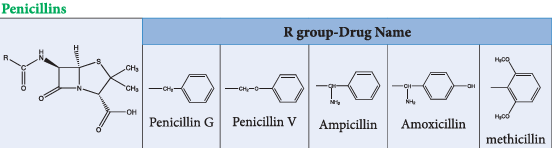

**Classification based on Pharmacological effect:** In this classification, the drugs are grouped based on their biological effect that they produce on the recipient. For example, the medicines that have the ability to kill the pathogenic bacteria are grouped as antibiotics. This kind of grouping will provide the full range of drugs that can be used for a particular condition (disease). The physician has to carefully choose a suitable medicine from the available drugs based on the clinical condition of the recipient.

**Examples:** Antibiotic drugs: amoxicillin, ampicillin, cefixime, cefpodoxime, erythromycin, tetracycline etc.

Antihypertensive drugs: propranolol, atenolol, metoprolol succinate, amlodipine etc.

**Classification based on the target system (drug action):** In this classification, the drugs are grouped based on the biological system/process, that they target in the recipient. This classification is more specific than the pharmacological classification. For example, the antibiotics streptomycin and erythromycin inhibit the protein synthesis (target process) in bacteria and are classified in a same group. However, their mode of action is different. Streptomycin inhibits the initiation of protein synthesis, while erythromycin prevents the incorporation of new amino acids to the protein.

**Classification based on the site of action (molecular target):** The drug molecule interacts with biomolecules such as enzymes, receptors etc., which are referred as drug targets. We can classify the drug based on the drug target with which it binds. This classification is highly specific compared to the others. These compounds often have a common mechanism of action, as the target is the same.

#### 15.1.2 Drug-target Interaction

The biochemical processes such as metabolism (which is responsible for breaking down the food molecules and harvest energy in the form of ATP and biosynthesis of necessary biomolecules from the available precursor molecules using many enzymes), cell-signaling (senses any change in the environment using the receptor molecules and send signals to various processes to elicit an appropriate response) etc. are essential for the normal functioning of our body. These routine processes may be disturbed by any external factors such as microorganism, chemicals etc. or by a disorder in the system itself. Under such conditions we may have to take medicines to restore the normal functioning of the body.

These drug molecules interact with biomolecules such as proteins, lipids, etc. that are responsible for different functions of the body. For example, proteins which act as biological catalysts are called enzymes and those which are important for communication systems are called receptors. The drug interacts with these molecules and modify the normal biochemical reactions either by modifying the enzyme activity or by stimulating/suppressing certain receptors.

**Enzymes as drug targets:** In all living systems, the biochemical reactions are catalysed by enzymes. Hence, these enzyme actions are highly essential for the normal functioning of the system. If their normal enzyme activity is inhibited, then the system will be affected. This principle is usually applied to kill many pathogens.

We have already learnt that in enzyme catalysed reactions, the substrate molecule binds to the active site of the enzyme by means of weak interactions such as hydrogen bonding, van der Waals force etc. between the amino acids present in the active site and the substrate.

When a drug molecule that has a similar geometry (shape) as the substrate is administered, it can also bind to the enzyme and inhibit its activity. In other words, the drug acts as an inhibitor to the enzyme catalyst. These type of inhibitors are often called competitive inhibitors. For example the antibiotic sulphanilamide, which is structurally similar to \( p \)-aminobenzoic acid (PABA) inhibits the bacterial growth. Many bacteria need PABA in order to produce an important coenzyme, folic acid. When the antibiotic sulphanilamide is administered, it acts as a competitive inhibitor to the enzyme dihydroperoate synthase (DHPS) in the biosynthetic pathway of converting PABA into folic acid in the bacteria. It leads to the folic acid deficiency which retards the growth of the bacteria and can eventually kill them.

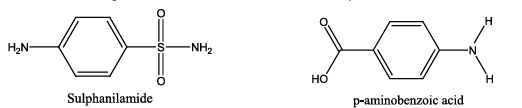

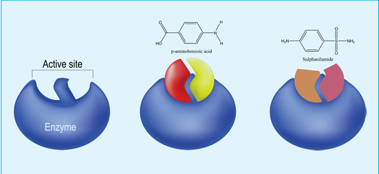

In certain enzymes, the inhibitor molecule binds to a different binding site, which is commonly referred to as allosteric site, and causes a change in its active site geometry (shape). As a result, the substrate cannot bind to the enzyme. This type of inhibitors are called allosteric inhibitors.

**Receptor as drug targets:** Many drugs exert their physiological effects by binding to a specific molecule called a receptor whose role is to trigger a response in a cell. Most of the receptors are integrated with the cell membranes in such a way that their active site is exposed to outside region of the cell membrane. The chemical messengers, the compounds that carry messages to cells, bind to the active site of these receptors. This brings about the transfer of message into the cell. These receptors show high selectivity for one chemical messenger over the others. If we want to block a message, a drug that binds to the receptor site should inhibit its natural function. Such drugs are called antagonists. In contrast, there are drugs which mimic the natural messenger by switching on the receptor. These type of drugs are called agonists and are used when there is lack of chemical messenger.

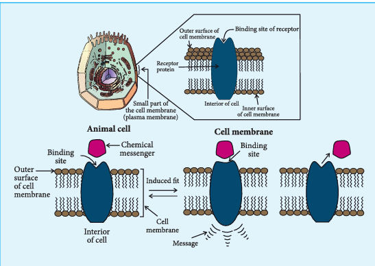

For example, when adenosine binds to the adenosine receptors, it induces sleepiness. On the other hand, the antagonist drug caffeine binds to the adenosine receptor and makes it inactive. This results in the reduced sleepiness (wakefulness).

The agonist drug, morphine, which is used as a pain killer, binds to the opioid receptors and activates them. This suppresses the neurotransmitters that cause pain.

Most receptors are chiral and hence different enantiomers of a drug can have different effect.

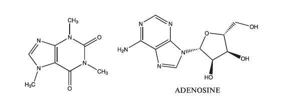

#### Therapeutic action of Different classes of Drugs

The developments in the field of biology allowed us to understand various biological process and their mechanism in detail. This enabled to develop new safer efficient drugs. For example, to treat acidity, we have been using weak bases such as aluminium and magnesium hydroxides. But these can make the stomach alkaline and trigger the production of more acid. Moreover, this treatment only relieves the symptoms and does not control the cause. Detailed studies reveal that histamines stimulate the secretion of HCl by activating the receptor in the stomach wall. This findings lead to the design of new drugs such as cimetidine, ranitidine etc., which bind the receptor and inactivate them. These drugs are structurally similar to histamine. In this section, we shall discuss the therapeutic action of a few important classes of drugs.

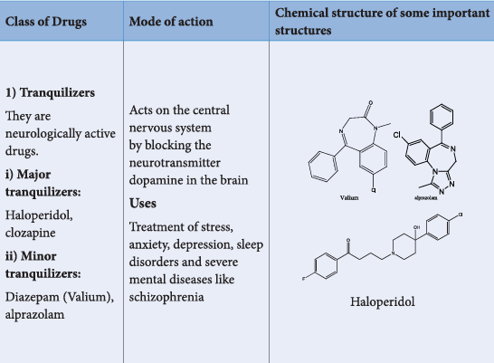
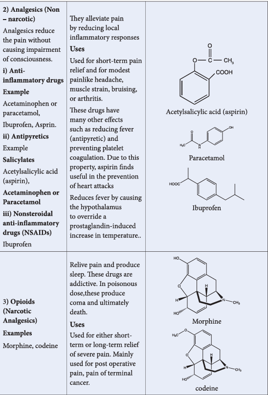
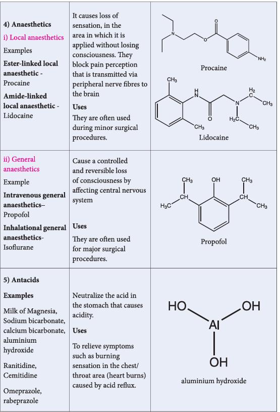
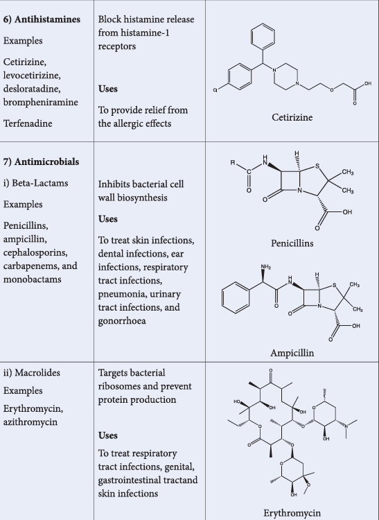
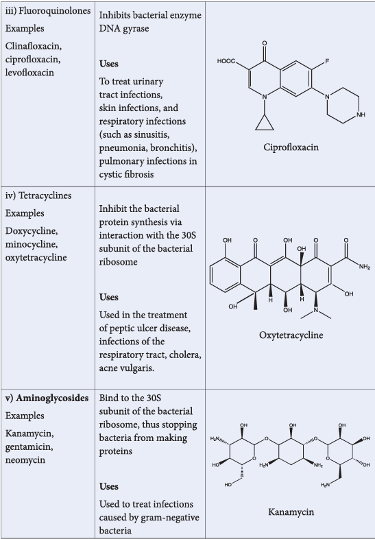
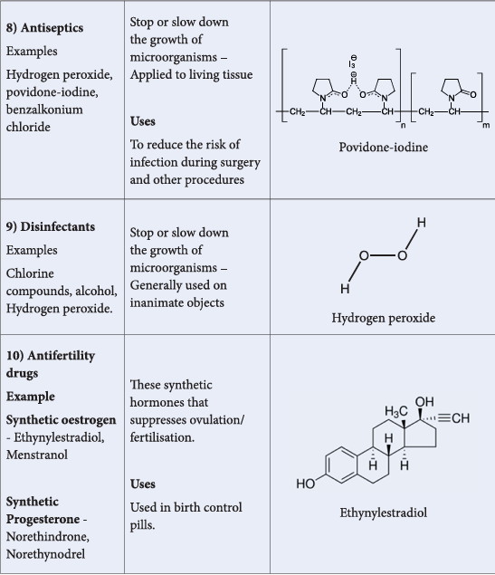

### 15.2 Food additives

Have you ever noticed the ingredients that is printed on the cover of the packed food materials such as biscuits, chocolates etc. You might have noticed that emulsifiers such as 322, 472E, dough conditioners 223 etc. are used in the preparation, in addition to the main ingredients such as wheat flour, edible oil, sugar, milk solid etc. Do you think that these substances are necessary? Yes. These substances enhance the nutritive, sensory and practical value of the food. They also increase the shelf life of food. The substances which are not naturally a part of the food and added to improve the quality of food are called food additives.

#### 15.2.1 Important categories of food additives

- Aroma compounds
- Artificial Sweeteners
- Food colours
- Antioxidants
- Preservatives
- Buffering substances
- Stabilizers
- Vitamins and minerals

**Advantages of food additives:**

1. Uses of preservatives reduce the product spoilage and extend the shelf-life of food.
2. Addition of vitamins and minerals reduces the mail nutrient deficiency.
3. Flavouring agents enhance the aroma of the food.
4. Antioxidants prevent the formation of potentially toxic oxidation products of lipids and other food constituents.

#### 15.2.2 Preservatives

Preservatives are capable of inhibiting, retarding or arresting the process of fermentation, acidification or other decomposition of food by growth of microorganisms. Organic acids such as benzoic acid, sorbic acid and their salts are potent inhibitors of a number of fungi, yeast and bacteria. Alkyl esters of hydroxy benzoic acid are very effective in less acidic conditions. Acetic acid is used mainly as a preservative for the preparation of pickles and for preserved vegetables. Sodium metabisulphite is used as preservatives for fresh vegetables and fruits. Sucrose esters with palmitic and stearic acid are used as emulsifiers. In addition that some organic acids and their salts are used as preservatives. In addition to chemical treatment, physical methods such as heat treatment (pasteurisation and sterilisation), cold treatment (chilling and freezing) drying (dehydration) and irradiation are used to preserve food.

#### 15.2.3 Antioxidants

Antioxidants are substances which retard the oxidative deteriorations of food. Food containing fats and oils is easily oxidised and turn rancid. To prevent the oxidation of the fats and oils, chemicals BHT (butylated hydroxytoluene), BHA (Butylated hydroxyanisole) are added as food additives. They are generally called antioxidants. These materials readily undergo oxidation by reacting with free radicals generated by the oxidation of oils, thereby stop the chain reaction of oxidation of food. Sulphur dioxide and sulphites are also used as food additives. They act as antimicrobial agents, antioxidants and enzyme inhibitors.

#### 15.2.4 Sugar Substitutes

Those compounds that are used like sugars (glucose, sucrose) for sweetening, but are metabolised without the influence of insulin are called sugar substitutes. Eg. Sorbitol, Xylitol, Mannitol.

#### 15.2.5 Artificial sweetening agents

Synthetic compounds which impart a sweet sensation and possess no or negligible nutritional value are called artificial sweeteners. Eg. Saccharin, Aspartame, Sucralose, Alitame etc.

### 15.3 Cleansing agents

Soaps and detergents are used as cleansing agents. Chemically soap is the sodium or potassium salt of higher fatty acids. Detergent is sodium salt of alkyl hydrogen sulphates or alkyl benzene sulphonic acids.

#### 15.3.1 Soaps

Soaps are made from animal fats or vegetable oils. They contain glyceryl esters of long chain fatty acids. When the glycerides are heated with a solution of sodium hydroxide they become soap and glycerol. We have already learnt this reaction under the preparation of glycerol by saponification. Common salt is added to the reaction mixture to decrease the solubility of soap and it helps to precipitate out from the aqueous solution. Soap is then mixed with desired colours, perfumes and chemicals of medicinal importance.

**Total fatty matter:** The quality of a soap is described in terms of total fatty matter (TFM value). It is defined as the total amount of fatty matter that can be separated from a sample after splitting with mineral acids. Higher the TFM quantity in the soap better is its quality.

As per BIS standards, Grade-1 soaps should have \( 76\% \) minimum TFM, while Grade-2 and 3 must have 70 and \( 60\% \), minimum respectively. The other quality parameters are lather, moisture content, mushiness, insoluble matter in alcohol etc.

**The cleansing action of soap:** To understand how a soap works as a cleansing agent, let us consider sodium palmitate as an example of a soap. The cleansing action of soap is directly related to the structure of carboxylate ions (palmitate ion) present in soap. The structure of palmitate exhibits dual polarity. The hydrocarbon portion is non polar and the carboxyl portion is polar.

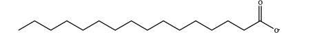

The nonpolar portion is hydrophobic while the polar end is hydrophilic. The hydrophobic hydrocarbon portion is soluble in oils and greases, but not in water. The hydrophilic carboxylate group is soluble in water. The dirt in the cloth is due to the presence of dust particles intact or grease which stick. When the soap is added to an oily or greasy part of the cloth, the hydrocarbon part of the soap dissolves in the grease, leaving the negatively charged carboxylate end exposed on the grease surface. At the same time the negatively charged carboxylate groups are strongly attracted by water, thus leading to the formation of small droplets called micelles and grease is floated away from the solid object. When the water is rinsed away, the grease goes with it. As a result, the cloth gets free from dirt and the droplets are washed away with water. The micelles do not combine into large drops because their surfaces are all negatively charged and repel each other. The cleansing ability of a soap depends upon its tendency to act as an emulsifying agent between water and water insoluble greases.

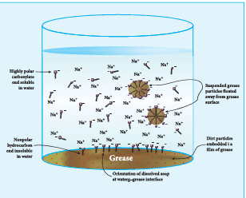

#### 15.3.2 Detergents

Synthetic detergents are formulated products containing either sodium salts of alkyl hydrogen sulphates or sodium salts of long chain alkyl benzene sulphonic acids. There are three types of detergents.

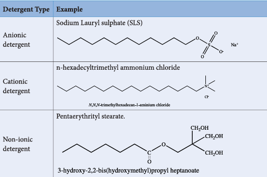

Detergents are superior to soaps as they can be used even in hard water and in acidic conditions. The cleansing action of detergents are similar to the cleansing action of soaps.

### 15.4 Polymers

The term Polymer is derived from the Greek word 'polumeres' meaning "having many parts". The constitution of a polymer is described in terms of its structural units called monomers. Polymers consist of large number of monomer units derived from simple molecules. For example: PVC (Poly Vinyl Chloride) is a polymer which is obtained from the monomer vinyl chloride. Polymers can be classified based on the source of availability, structure, molecular forces and the mode of synthesis.

#### 15.4.1 Classification of Polymers

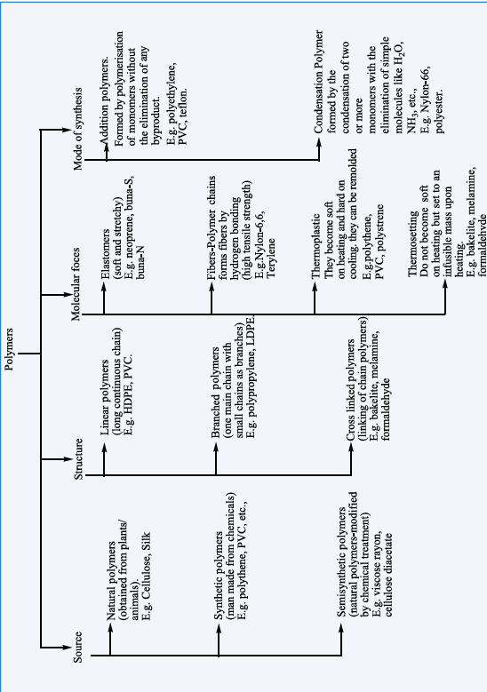

#### 15.4.2 Types of polymerisation

The process of forming a very large, high molecular mass polymer from small structural units i.e., monomer is called polymerisation. Polymerisation occurs in the following two ways:

i. Addition polymerisation or chain growth polymerisation
ii. Condensation polymerisation or step growth polymerisation

**Addition polymerisation:** Many alkenes undergo polymerisation under suitable conditions. The chain growth mechanism involves the addition of the growing chain across the double bond of the monomer. The addition polymerisation can follow any of the following three mechanisms depending upon the reactive involved in the process.

i. Free radical polymerisation
ii. Cationic polymerisation
iii. Anionic polymerisation

**Free radical polymerisation:** When alkenes are heated with free radical initiator such as benzoyl peroxide, they undergo polymerisation reaction. For example styrene polymerises to polystyrene when it is heated to ionic with a peroxide initiator. The mechanism involves the following steps.

**1. Initiation step:**

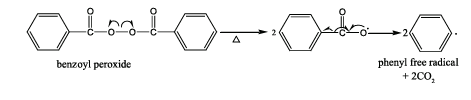

**2. Propagation step:** 

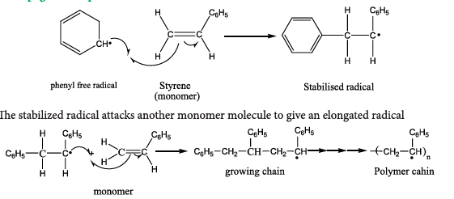

The stabilized radical attacks another monomer molecule to give an elongated radical.

Chain growth will continue with the successive addition of several thousands of monomer units.

**Termination:** 

The above chain reaction can be stopped by stopping the supply of monomer or by coupling of two chains or reaction with an impurity such as oxygen.

#### 15.4.3 Preparation of some important addition polymers

**1. Polythene:** It is an addition polymer of ethene. There are two types of polyethylene.
i) HDPE (High Density Polyethylene)
ii) LDPE (Low Density polyethylene)

**LDPE:** It is formed by heating ethene at \( 200^{\circ} \) to \( 300^{\circ}C \) under oxygen as a catalyst. The reaction follows free radical mechanism. The peroxides formed from oxygen acts as a free radical initiator.

\[
\mathrm{nCH_2 = CH_2 \xrightarrow[1000\ atm]{200^{\circ}C - 300^{\circ}C} (-CH_2-CH_2-)_{n}}
\]

It is used as insulation for cables, making toys etc.

**HDPE:** The polymerization of ethylene is carried out at 373K and 6 to 7 atm pressure using Ziegler-Natta catalyst \( \mathrm{[TiCl_4 + (C_2H_5)_3Al]} \). HDPE has high density and melting point and it is used to make bottles, pipes etc.

**Preparation of Teflon (PTFE):** The monomer is tetrafluoroethylene. When the monomer is heated with oxygen (or) ammonium persulphate under high pressure, Teflon is obtained.

\[
\mathrm{nCF_2 = CF_2 \xrightarrow{\Delta} (-CF_2-CF_2-)_{n}}
\]

It is used for coating articles and preparing non-stick utensils.

**Preparation of Orlon (polyacrylonitrile - PAN):** It is prepared by the addition polymerisation of vinyl cyanide (acrylonitrile) using a peroxide initiator.

\[
\mathrm{n(CH_2=CH-C\equiv N) \xrightarrow[Peroxides]{\Delta} (-CH_2-CH-)_{n}}
\]

It is used as a substitute of wool for making blankets, sweaters etc.

**Condensation polymerisation:** Condensation polymers are formed by the reaction between functional groups of adjacent monomers with the elimination of simple molecules like \( \mathrm{H_2O}, \mathrm{NH_3} \) etc. Each monomer must undergo at least two substitution reactions to continue to grow the polymer chain i.e., the monomer must be at least bifunctional. Examples: Nylon-6,6, Terylene.

**Nylon-6,6:** Nylon-6,6 can be prepared by mixing equimolar adipic acid and hexamethylene-diamine to form a nylon salt which on heating eliminates a water molecule to form amide bonds.

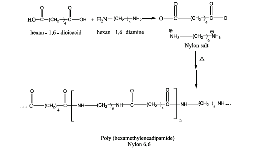

It is used in textiles, manufacture of cards etc.

**Nylon-6:** Caprolactam (monomer) on heating at 533K in an inert atmosphere with traces of water gives \( \epsilon \)-aminocaproic acid which polymerises to give nylon-6.

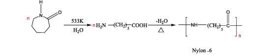

It is used in the manufacture of tyre cords, fabrics etc.

**Preparation of Terylene (Dacron):** The monomers are ethylene glycol and terephthalic acid (or) dimethyl terephthalate. When these monomers are mixed and heated at 500K in the presence of zinc acetate and antimony trioxide catalyst, terylene is formed.

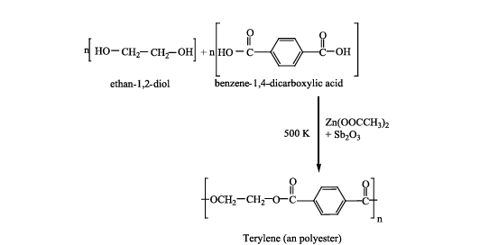

**Melamine (Formaldehyde melamine):** The monomers are melamine and formaldehyde. These monomers undergo condensation polymerization to form melamine formaldehyde resin.

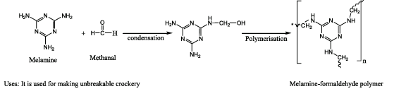

**Uses:** It is used for making unbreakable crockery.

**Urea formaldehyde polymer:** It is formed by the condensation polymerization of the monomers urea and formaldehyde.

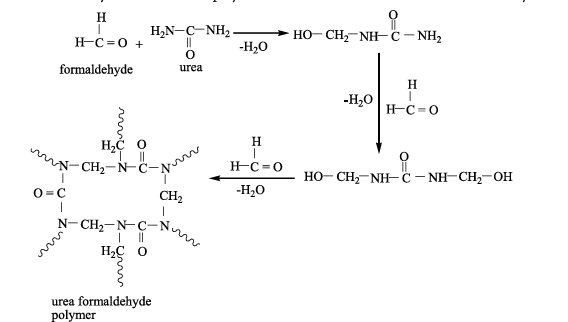

#### 15.4.4 Co-polymers

A polymer containing two or more different kinds of monomer units is called a copolymer. For example, SBR rubber (Buna-S) contains styrene and butadiene monomer units. Co-polymers have properties quite different from the homopolymers.

#### 15.4.5 Natural and Synthetic rubbers

Rubber is a naturally occurring polymer. It is obtained from the latex that exudes from cuts in the bark of rubber tree (Ficus elastica). The monomer unit of natural rubber is cis isoprene (2-methylbuta-1,3-diene). Thousands of isoprene units are linearly linked together in natural rubber. Natural rubber is not so strong or elastic. The properties of natural rubber can be modified by the process called vulcanization.

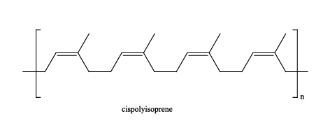

**Vulcanization: Cross linking of Rubber:** In the year 1839, Charles Goodyear accidentally dropped a mixture of natural rubber and sulphur onto a hot stove. He was surprised to find that the rubber had become strong and elastic. This discovery led to the process that Goodyear called vulcanization.

Natural rubber is mixed with \( 3-5\% \) sulphur and heated at \( 100-150^{\circ}C \) causes cross linking of the cis-1,4-polyisoprene chains through disulphide (-S-S-) bonds. The physical properties of rubber can be altered by controlling the amount of sulphur that is used for vulcanization. Soft rubber, made with about 1 to \( 3\% \) sulphur is soft and stretchy. When 3 to \( 10\% \) sulphur is used the resultant rubber is somewhat harder but flexible.

**Synthetic rubber:** Polymerisation of certain organic compounds such as buta-1,3-diene or its derivatives gives rubber like polymer with desirable properties like stretching to a greater extent etc. Such polymers are called synthetic rubbers.

**Preparation of Neoprene:** The free radical polymerisation of the monomer, 2-chlorobuta-1,3-diene (chloroprene) gives neoprene.

\[
\mathrm{nCH_2=C-CH=CH_2 \xrightarrow{free\ radical \atop polymerisation} (-CH_2-C=CH-CH_2-)_{n}}
\]

It is superior to rubber and resistant to chemical action.

**Uses:** It is used in the manufacture of chemical containers, conveyer belts.

**Preparation of Buna-N:** It is a copolymer of acrylonitrile and buta-1,3-diene.

\[
\mathrm{nCH_2=CH-CH=CH_2 + nCH_2=CH-CN \xrightarrow{Na} [-CH_2-CH=CH-CH_2-CH_2-CH-]_{n}}
\]

It is used in the manufacture of hoses and tank linings.

**Preparation of Buna-S:** It is a copolymer. It is obtained by the polymerisation of buta-1,3-diene and styrene in the ratio 3:1 in the presence of sodium.

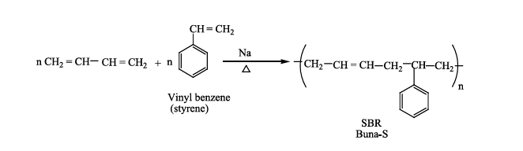

#### 15.4.6 Biodegradable Polymers

The materials that are readily decomposed by microorganisms in the environment are called biodegradable. Natural polymers degrade on their own after certain period of time but the synthetic polymers do not. It leads to serious environmental pollution. One of the solution to this problem is to produce biodegradable polymers which can be broken down by soil microorganism.

**Examples:** Polyhydroxy butyrate (PHB), Poly(3-hydroxybutyrate-co-3-hydroxyvalerate) (PHBV), Polyglycolic acid (PGA), Polylactic acid (PLA), Poly(\( \epsilon \) caprolactone) (PCL)

Biodegradable polymers are used in medical field such as surgical sutures, plasma substitute etc. These polymers are decomposed by enzyme action and are either metabolized or excreted from the body.

**Preparation of PHBV:** It is the copolymer of the monomers 3-hydroxybutanoic acid and 3-hydroxypentanoic acid. In PHBV, the monomer units are joined by ester linkages.

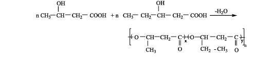

**Uses:** It is used in orthopaedic devices, and in controlled release of drugs.

**Nylon-2-Nylon-6:** It is a copolymer which contains polyamide linkages. It is obtained by the condensation polymerisation of the monomers, glycine and \( \epsilon \)-aminocaproic acid.

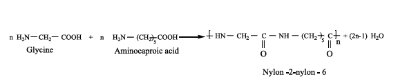

## EVALUATION

### Choose the correct answer

1. Which of the following is an analgesic?
   a) Streptomycin
   b) Chloromycetin
   c) Aspirin
   d) Penicillin

2. Antiseptics and disinfectants either kill or prevent growth of microorganisms. Identify which of the following statement is not true.
   a) dilute solutions of boric acid and hydrogen peroxide are strong antiseptics.
   b) Disinfectants harm the living tissues.
   c) A \( 0.2\% \) solution of phenol is an antiseptic while \( 1\% \) solution acts as a disinfectant.
   d) Chlorine and iodine are used as strong disinfectants.

3. Drugs that bind to the receptor site and inhibit its natural function are called
   a) antagonists
   b) agonists
   c) enzymes
   d) molecular targets

4. Aspirin is a/an
   a) acetylsalicylic acid
   b) benzoyl salicylic acid
   c) chlorobenzoic acid
   d) anthranilic acid

5. Which one of the following structures represents nylon 6,6 polymer?

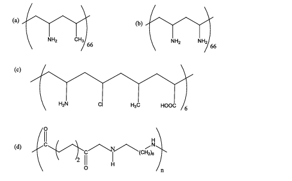

6. Natural rubber has
   a) alternate cis- and trans- configuration
   b) random cis- and trans- configuration
   c) all cis- configuration
   d) all trans- configuration

7. Nylon is an example of
   a) polyamide
   b) polythene
   c) polyester
   d) polysaccharide

8. Terylene is an example of
   a) polyamide
   b) polythene
   c) polyester
   d) polysaccharide

9. Which is the monomer of neoprene in the following?
   a) \( \mathrm{CH_2=CCl-CH=CH_2} \)
   b) \( \mathrm{CH_2=CH-C\equiv CH} \)
   c) \( \mathrm{CH_2=CH-CH=CH_2} \)
   d) \( \mathrm{CH_2=C(CH_3)-CH=CH_2} \)

10. Which one of the following is a biodegradable polymer?
    a) HDPE
    b) PVC
    c) Nylon 6
    d) PHBV

11. Non stick cookwares generally have a coating of a polymer, whose monomer is
    a) ethane
    b) prop-2-enenitrile
    c) chloroethene
    d) 1,1,2,2-tetrafluoroethene

12. Assertion: 2-methyl-1,3-butadiene is the monomer of natural rubber
    Reason: Natural rubber is formed through anionic addition polymerisation.
    a) If both assertion and reason are true and reason is the correct explanation of assertion.
    b) if both assertion and reason are true but reason is not the correct explanation of assertion.
    c) assertion is true but reason is false.
    d) both assertion and reason are false.

13. Which of the following is a copolymer?
    a) Orlon
    b) PVC
    c) Teflon
    d) PHBV

14. The polymer used in making blankets (artificial wool) is
    a) polystyrene
    b) PAN
    c) polyester
    d) polythene

15. Regarding cross-linked or network polymers, which of the following statement is incorrect? (NEET)
    a) Examples are Bakelite and melamine
    b) They are formed from bi and tri-functional monomers
    c) They contain covalent bonds between various linear polymer chains
    d) They contain strong covalent bonds in their polymer chain

### Answer the following questions

1. What are antibiotics?

2. Name one substance which can act as both analgesic and antipyretic.

3. Write a note on synthetic detergents.

4. How do antiseptics differ from disinfectants?

5. What are food preservatives?

6. What are drugs? How are they classified?

7. How do the tranquilizers work in body?

8. Write the structural formula of aspirin.

9. Explain the mechanism of cleansing action of soaps and detergents.

10. Which sweetening agent are used to prepare sweets for a diabetic patient?

11. What are narcotic and non-narcotic drugs? Give examples.

12. What are antifertility drugs? Give examples.

13. Write a note on copolymer.

14. What are biodegradable polymers? Give examples.

15. How is terylene prepared?

16. Write a note on vulcanization of rubber.

17. Classify the following as linear, branched or cross linked polymers:
    a) Bakelite
    b) Nylon-6,6
    c) LDPE
    d) HDPE
