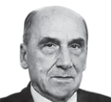

# 15. CHEMISTRY IN EVERYDAY LIFE

**Vladimir Prelog**

Prof. Vladimir Prelog was a
Swiss Chemist who shared 1975
Nobel Prize for Chemistry with
John W Cornforth for his work
on Stereo Chemistry. He has
done wide ranging research on
alkaloids, antibiotics, enzymes
and other natural compounds.
He was distinguished for his
contribution to the development
of modern stereo chemistry.
Prelog synthesized many
natural products and worked on
problems of stereo chemistry like
adamenline, boromycin analoids
and rifamycins

## INTRODUCTION

Chemistry touches every aspect of our lives. The three basic requirement of our life: food, clothes, shelter are all basically chemical compounds. In fact, life itself is a complicated system of interrelated chemical process. In this unit, we will learn the chemistry involved in the field of medicines, food materials, cleansing agents and polymers.
