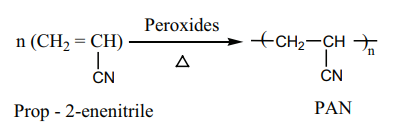
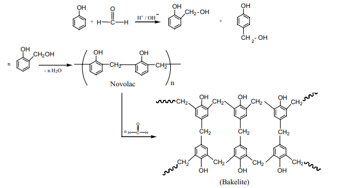
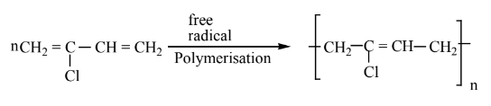
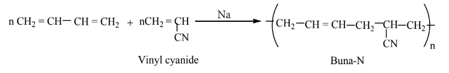

### 15.4 Polymers

The term Polymer is derived from the Greek word 'polumeres' meaning "having many parts". The constitution of a polymer is described in terms of its structural units called monomers. Polymers consist of large number of monomer units derived from simple molecules. For example: PVC (Poly Vinyl Chloride) is a polymer which is obtained from the monomer vinyl chloride. Polymers can be classified based on the source of availability, structure, molecular forces and the mode of synthesis.

#### 15.4.1 Classification of Polymers

#### 15.4.2 Types of polymerisation

The process of forming a very large, high molecular mass polymer from small structural units i.e., monomer is called polymerisation. Polymerisation occurs in the following two ways:

i. Addition polymerisation or chain growth polymerisation

ii. Condensation polymerisation or step growth polymerisation

**Addition polymerisation:**

 Many alkenes undergo polymerisation under suitable conditions. The chain growth mechanism involves the addition of the growing chain across the double bond of the monomer. The addition polymerisation can follow any of the following three mechanisms depending upon the reactive involved in the process.

i. Free radical polymerisation

ii. Cationic polymerisation

iii. Anionic polymerisation

**Free radical polymerisation:**

 When alkenes are heated with free radical initiator such as benzoyl peroxide, they undergo polymerisation reaction. For example styrene polymerises to polystyrene when it is heated to ionic with a peroxide initiator. The mechanism involves the following steps.

**1. initiation – formation of free radical**

**2. Propagation step:** 

Chain growth will continue with the successive addition of several thousands of monomer units.

**Termination:** 

The above chain reaction can be stopped by stopping the supply of monomer or by coupling of two chains or reaction with an impurity such as oxygen.

#### 15.4.3 Preparation of some important addition polymers

**1. Polythene:** It is an addition polymer of ethene. There are two types of polyethylene.

i) HDPE (High Density Polyethylene)

ii) LDPE (Low Density polyethylene)

**LDPE:** It is formed by heating ethene at \( 200^{\circ} \) to \( 300^{\circ}C \) under oxygen as a catalyst. The reaction follows free radical mechanism. The peroxides formed from oxygen acts as a free radical initiator.

\[
\mathrm{nCH_2 = CH_2 \xrightarrow[1000\ atm]{200^{\circ}C - 300^{\circ}C} (-CH_2-CH_2-)_{n}}
\]

It is used as insulation for cables, making toys etc.

**HDPE:** The polymerization of ethylene is carried out at 373K and 6 to 7 atm pressure using Ziegler-Natta catalyst \( \mathrm{[TiCl_4 + (C_2H_5)_3Al]} \). HDPE has high density and melting point and it is used to make bottles, pipes etc.

**Preparation of Teflon (PTFE):** The monomer is tetrafluoroethylene. When the monomer is heated with oxygen (or) ammonium persulphate under high pressure, Teflon is obtained.

\[
\mathrm{nCF_2 = CF_2 \xrightarrow{\Delta} (-CF_2-CF_2-)_{n}}
\]

It is used for coating articles and preparing non-stick utensils.

**Preparation of Orlon (polyacrylonitrile - PAN):** It is prepared by the addition polymerisation of vinyl cyanide (acrylonitrile) using a peroxide initiator.

It is used as a substitute of wool for making blankets, sweaters etc.

**Condensation polymerisation:** Condensation polymers are formed by the reaction between functional groups of adjacent monomers with the elimination of simple molecules like \( \mathrm{H_2O}, \mathrm{NH_3} \) etc. Each monomer must undergo at least two substitution reactions to continue to grow the polymer chain i.e., the monomer must be at least bifunctional. Examples: Nylon-6,6, Terylene.

**Nylon-6,6:** Nylon-6,6 can be prepared by mixing equimolar adipic acid and hexamethylene-diamine to form a nylon salt which on heating eliminates a water molecule to form amide bonds.

It is used in textiles, manufacture of cards etc.

**Nylon-6:** Caprolactam (monomer) on heating at 533K in an inert atmosphere with traces of water gives \( \epsilon \)-aminocaproic acid which polymerises to give nylon-6.

It is used in the manufacture of tyre cords, fabrics etc.

**Preparation of Terylene (Dacron):** The monomers are ethylene glycol and terephthalic acid (or) dimethyl terephthalate. When these monomers are mixed and heated at 500K in the presence of zinc acetate and antimony trioxide catalyst, terylene is formed.

It is used in blending with cotton or wool fibres and as glass reinforcing materials in safety helmets.

**Preparation of Bakelite**

The monomers are phenol and formaldehyde. The polymer is obtained by the condensation polymerization of these monomers in presence of either an acid or a base catalyst.

Phenol reacts with methanol to form ortho or para hydroxyl methylphenols which on further reaction with phenol gives linear polymer called novolac. Novolac on further heating with formaldehyde undergo cross linkages to form bakelite.

**Uses:**

Navolac is used in paints. Soft bakelites are used for making glue for binding laminated wooden
planks and in varinishes, Hard bakelites are used to prepare combs, pens etc..

**Melamine (Formaldehyde melamine):** The monomers are melamine and formaldehyde. These monomers undergo condensation polymerization to form melamine formaldehyde resin.

**Uses:** It is used for making unbreakable crockery.

**Urea formaldehyde polymer:** It is formed by the condensation polymerization of the monomers urea and formaldehyde.

#### 15.4.4 Co-polymers

A polymer containing two or more different kinds of monomer units is called a copolymer. For example, SBR rubber (Buna-S) contains styrene and butadiene monomer units. Co-polymers have properties quite different from the homopolymers.

#### 15.4.5 Natural and Synthetic rubbers

Rubber is a naturally occurring polymer. It is obtained from the latex that exudes from cuts in the bark of rubber tree (Ficus elastica). The monomer unit of natural rubber is cis isoprene (2-methylbuta-1,3-diene). Thousands of isoprene units are linearly linked together in natural rubber. Natural rubber is not so strong or elastic. The properties of natural rubber can be modified by the process called vulcanization.

**Vulcanization: Cross linking of Rubber:** In the year 1839, Charles Goodyear accidentally dropped a mixture of natural rubber and sulphur onto a hot stove. He was surprised to find that the rubber had become strong and elastic. This discovery led to the process that Goodyear called vulcanization.

Natural rubber is mixed with \( 3-5\% \) sulphur and heated at \( 100-150^{\circ}C \) causes cross linking of the cis-1,4-polyisoprene chains through disulphide (-S-S-) bonds. The physical properties of rubber can be altered by controlling the amount of sulphur that is used for vulcanization. Soft rubber, made with about 1 to \( 3\% \) sulphur is soft and stretchy. When 3 to \( 10\% \) sulphur is used the resultant rubber is somewhat harder but flexible.

**Synthetic rubber:** Polymerisation of certain organic compounds such as buta-1,3-diene or its derivatives gives rubber like polymer with desirable properties like stretching to a greater extent etc. Such polymers are called synthetic rubbers.

**Preparation of Neoprene:** The free radical polymerisation of the monomer, 2-chlorobuta-1,3-diene (chloroprene) gives neoprene.

It is superior to rubber and resistant to chemical action.

**Uses:** It is used in the manufacture of chemical containers, conveyer belts.

**Preparation of Buna-N:** It is a copolymer of acrylonitrile and buta-1,3-diene.

It is used in the manufacture of hoses and tank linings.

**Preparation of Buna-S:** It is a copolymer. It is obtained by the polymerisation of buta-1,3-diene and styrene in the ratio 3:1 in the presence of sodium.

#### 15.4.6 Biodegradable Polymers

The materials that are readily decomposed by microorganisms in the environment are called biodegradable. Natural polymers degrade on their own after certain period of time but the synthetic polymers do not. It leads to serious environmental pollution. One of the solution to this problem is to produce biodegradable polymers which can be broken down by soil microorganism.

**Examples:**

 Polyhydroxy butyrate (PHB),

 Poly(3-hydroxybutyrate-co-3-hydroxyvalerate) (PHBV),
 
 Polyglycolic acid (PGA), Polylactic acid (PLA),
   
 Poly(\( \epsilon \) caprolactone) (PCL)

Biodegradable polymers are used in medical field such as surgical sutures, plasma substitute etc. These polymers are decomposed by enzyme action and are either metabolized or excreted from the body.

**Preparation of PHBV:** It is the copolymer of the monomers 3-hydroxybutanoic acid and 3-hydroxypentanoic acid. In PHBV, the monomer units are joined by ester linkages.

**Uses:** It is used in orthopaedic devices, and in controlled release of drugs.

**Nylon-2-Nylon-6:** It is a copolymer which contains polyamide linkages. It is obtained by the condensation polymerisation of the monomers, glycine and \( \epsilon \)-aminocaproic acid.

