# 5. COORDINATION CHEMISTRY

**Alfred Werner**
**(1866 –1919)**

Alfred Werner was a Swiss chemist who explainedthe bonding in coordination complexes. Werner proposed his coordination theory in 1893. It must be remembered that this imaginative theory was proposed before the electron had been discovered by J.J. Thompson
in 1896. Werner did not have any modern instrumental techniques at his time and all his studies were made using simple reaction
chemistry. Complexes must have been a complete mystery without any knowledge of bonding or structure. This theory and his painstaking work over the next 20 years won Alfred Werner the Nobel Prize for Chemistry in 1913.He was the first inorganic chemist to win the Nobel Prize.

## INTRODUCTION

We have already learnt in the previous unit that the transition metals have a tendency to form complexes (coordination compounds). The name is derived from the Latin words 'complexus' and 'coordinate' which mean 'hold' and 'to arrange' respectively. The complexes of transition metals have interesting properties and differ from simple ionic and covalent compounds. For example, chromium(III) chloride hexahydrate, \( \mathrm{CrCl_3.6H_2O} \) exists as purple, pale green or dark green compound. In addition to metals, certain non metals also form coordination compounds but have less tendency than d block elements. Coordination compounds play a vital role in the biological functions, and have wide range of catalytic applications in chemical industries. For example, haemoglobin, the oxygen transporter of human is a coordination compound of iron, and cobalamine, an essential vitamin is a coordination compound of cobalt. Chlorophyll, a pigment present in plants acting as a photo sensitiser in the photosynthesis is also a coordination compound. Various coordination compounds such as Wilkinson's compound, Ziegler Natta compound are used as catalysts in industrial processes. Hence, it is important to understand the chemistry of coordination compounds. In this unit we study the nature, bonding, nomenclature, isomerism and applications of the coordination compounds.

### 5.1 Coordination compounds and double salts

When two or more stable compounds in solution are mixed together and allowed to evaporate, in certain cases there is a possibility for the formation of double salts or coordination compounds. For example when an equimolar solution of ferrous sulphate and ammonium sulphate are mixed and allowed to crystallise, a double salt namely Mohr's salt (Ferrous ammonium sulphate, \( \mathrm{FeSO_4.(NH_4)\_2SO_4.6H_2O} \) ) is formed. Let us recall the blood red colour formation in the inorganic qualitative analysis of ferric ion, the reaction between ferric chloride and potassium thiocyanate solution gives a blood red coloured coordination compound, potassium ferri thiocyanate \( \mathrm{K_3[Fe(SCN)_6]} \). If we perform a qualitative analysis to identify the constituent ions present in both the compounds, Mohr's salt answers the presence of \( \mathrm{Fe^{2+}} \), \( \mathrm{NH_4^+} \) and \( \mathrm{SO_4^{2-}} \) ions, whereas the potassium ferri thiocyanate will not answer \( \mathrm{Fe^{3+}} \) and \( \mathrm{SCN^-} \) ions. From this we can infer that the double salts lose their identity and dissociates into their constituent simple ions in solutions, whereas the complex ion in coordination compound, does not lose its identity and never dissociate to give simple ions.

### 5.2 Werner's theory of coordination compounds

Swiss chemist Alfred Werner was the first one to propose a theory of coordination compounds to explain the observed behaviour of them.

Let us consider the different coloured complexes of cobalt(III) chloride with ammonia which exhibit different properties as shown below.

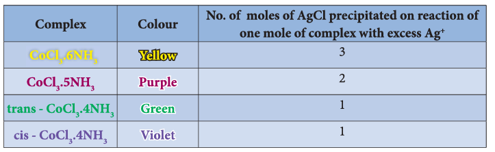

In this case, the valences of the elements present in both the reacting molecules, cobalt(III)
chloride and ammonia are completely satisfied. Yet these substances react to form the above
mentioned complexes

To explain this behaviour Werner postulated his theory as follows

1. Most of the elements exhibit, two types of valence namely primary valence and secondary valence and each element tend to satisfy both the valences. In modern terminology, the primary valence is referred as the oxidation state of the metal atom and the secondary valence as the coordination number. For example, according to Werner, the primary and secondary valences of cobalt are 3 and 6 respectively.

2. The primary valence of a metal ion is positive in most of the cases and zero in certain cases. They are always satisfied by negative ions. For example in the complex \( \mathrm{CoCl_3.6NH_3} \) the primary valence of Co is \( +3 \) and is satisfied by \( 3\mathrm{Cl^-} \) ions.

3. The secondary valence is satisfied by negative ions, neutral molecules, positive ions or the combination of these. For example, in \( \mathrm{CoCl_3.6NH_3} \) the secondary valence of cobalt is 6 and is satisfied by six neutral ammonia molecules, whereas in \( \mathrm{CoCl_3.5NH_3} \) the secondary valence of cobalt is satisfied by five neutral ammonia molecules and a \( \mathrm{Cl^-} \) ion.

4. According to Werner, there are two spheres of attraction around a metal atom/ion in a complex. The inner sphere is known as coordination sphere and the groups present in this sphere are firmly attached to the metal. The outer sphere is called ionisation sphere. The groups present in this sphere are loosely bound to the central metal ion and hence can be separated into ions upon dissolving the complex in a suitable solvent.

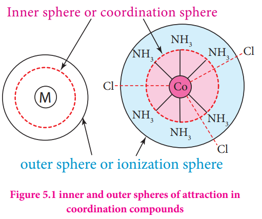

5. The primary valences are non-directional while the secondary valences are directional. The geometry of the complex is determined by the spatial arrangement of the groups which satisfy the secondary valence. For example, if a metal ion has a secondary valence of six, it has an octahedral geometry. If the secondary valence is 4, it has either tetrahedral or square planar geometry.

The following table illustrates the Werner's postulates.

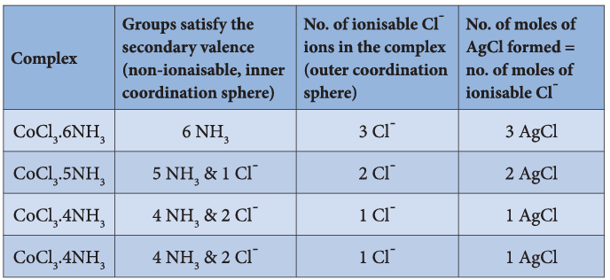

#### 5.2.1 Limitations of Werner's theory

Even though, Werner's theory was able to explain a number of properties of coordination compounds, it does not explain their colour and the magnetic properties.

**Evaluate yourself 1:** When a coordination compound \( \mathrm{CrCl_3.4H_2O} \) is mixed with silver nitrate solution, one mole of silver chloride is precipitated per mole of the compound. There are no free solvent molecules in that compound. Assign the secondary valence to the metal and write the structural formula of the compound.

### 5.3 Definition of important terms pertaining to co-ordination compounds

#### 5.3.1 Coordination entity

Coordination entity is an ion or a neutral molecule, composed of a central atom, usually a metal and the array of other atoms or groups of atoms (ligands) that are attached to it. In the formula, the coordination entity is enclosed in square brackets. For example, in potassium ferrocyanide, \( \mathrm{K_4[Fe(CN)_6]} \), the coordination entity is \( [\mathrm{Fe(CN)_6}]^{4-} \). In nickel tetracarbonyl, the coordination entity is \( [\mathrm{Ni(CO)_4}] \).

#### 5.3.2 Central atom/ion

The central atom/ion is the one that occupies the central position in a coordination entity and binds other atoms or groups of atoms (ligands) to itself, through a coordinate covalent bond. For example, in \( \mathrm{K_4[Fe(CN)_6]} \), the central metal ion is \( \mathrm{Fe^{2+}} \). In the coordination entity \( [\mathrm{Fe(CN)_6}]^{4-} \), the \( \mathrm{Fe^{2+}} \) accepts an electron pair from each ligand, \( \mathrm{CN^-} \) and thereby forming six coordinate covalent bonds with them. Since, the central metal ion has an ability to accept electron pairs, it is referred to as a Lewis acid.

#### 5.3.3 Ligands

The ligands are the atoms or groups of atoms bound to the central atom/ion. The atom in a ligand that is bound directly to the central metal atom is known as a donor atom. For example, in \( \mathrm{K_4[Fe(CN)_6]} \), the ligand is \( \mathrm{CN^-} \) ion, but the donor atom is carbon and in \( [\mathrm{Co(NH_3)_6}]Cl_3 \) the ligand is \( \mathrm{NH_3} \) molecule and the donor atom is nitrogen.

#### 5.3.4 Coordination sphere

The complex ion of the coordination compound containing the central metal atom/ion and the ligands attached to it, is collectively called coordination sphere and are usually enclosed in square brackets with the net charge. The other ionisable ions, are written outside the bracket are called counter ions. For example, the coordination compound \( \mathrm{K_4[Fe(CN)_6]} \) contains the complex ion \( [\mathrm{Fe(CN)_6}]^{4-} \) and is referred as the coordination sphere. The other associated ion \( \mathrm{K^+} \) is called the counter ion.

#### 5.3.5 Coordination polyhedron

The three dimensional spatial arrangement of ligand atoms/ions that are directly attached to the central atom is known as the coordination polyhedron (or polygon). For example, in \( \mathrm{K_4[Fe(CN)_6]} \), the coordination polyhedra is octahedral. The coordination polyhedra of \( [\mathrm{Ni(CO)_4}] \) is tetrahedral.

#### 5.3.6 Coordination number

The number of ligand donor atoms bonded to a central metal ion in a complex is called the coordination number of the metal. In other words, the coordination number is equal to the number of \( \sigma \)-bonds between ligands and the central atom.

For example,
i. In \( \mathrm{K_4[Fe(CN)_6]} \), the coordination number of \( \mathrm{Fe^{2+}} \) is 6.

ii. In \( [\mathrm{Ni(en)_3}]Cl_2 \), the coordination number of \( \mathrm{Ni^{2+}} \) is also 6. Here the ligand 'en' represents ethane-1,2-diamine (\( \mathrm{NH_2-CH_2-CH_2-NH_2} \)) and it contains two donor atoms (Nitrogen). Each ligand forms two coordination bonds with nickel. So, totally there are six coordination bonds between them.

#### 5.3.7 Oxidation state (number)

The oxidation state of a central atom in a coordination entity is defined as the charge it would bear if all the ligands were removed along with the electron pairs that were shared with the central atom. In naming a complex, it is represented by a Roman numeral. For example, in the coordination entity \( [\mathrm{Fe(CN)_6}]^{4-} \), the oxidation state of iron is represented as (II). The net charge on the complex ion is equal to the sum of the oxidation state of the central metal and the charge on the ligands attached to it. Using this relation the oxidation number can be calculated as follows

Net charge = (oxidation state of the central metal) + [(No. of ligands) × (charge on the ligand)]

**Example 1:** In \( [\mathrm{Fe(CN)_6}]^{4-} \) let the oxidation number of iron is \( x \)

The net charge: \( -4 = x + 6(-1) \Rightarrow x = +2 \)

**Example 2:** In \( [\mathrm{Co(NH_3)_5Cl}]^{2+} \) let the oxidation number of cobalt is \( x \)

The net charge: \( +2 = x + 5(0) + 1(-1) \Rightarrow x = +3 \)

**Evaluate yourself 2:** In the complex, \( [\mathrm{Pt(NO_2)(H_2O)(NH_3)_2}]Br \), identify the following

i. Central metal atom/ion

ii. Ligand(s) and their types

iii. Coordination entity

iv. Oxidation number of the central metal ion

v. Coordination number

#### 5.3.8 Types of complexes

The coordination compounds can be classified into the following types based on (i) the net charge of the complex ion, (ii) kinds of ligands present in the coordination entity.

**Classification based on the net charge on the complex:**

A coordination compound in which the complex ion

i. carries a net positive charge is called a **cationic complex**. Examples: \( [\mathrm{Ag(NH_3)_2}]^+ \), \( [\mathrm{Co(NH_3)_6}]^{3+} \), \( [\mathrm{Fe(H_2O)_6}]^{2+} \), etc.

ii. carries a net negative charge is called an **anionic complex**. Examples: \( [\mathrm{Ag(CN)_2}]^- \), \( [\mathrm{Co(CN)_6}]^{3-} \), \( [\mathrm{Fe(CN)_6}]^{4-} \), etc.

iii. bears no net charge, is called a **neutral complex**. Examples: \( [\mathrm{Ni(CO)_4}] \), \( [\mathrm{Fe(CO)_5}] \), \( [\mathrm{Co(NH_3)_3Cl_3}] \)

**Classification based on kind of ligands:**

A coordination compound in which
i. the central metal ion/atom is coordinated to only one kind of ligands is called a **homoleptic complex**. Examples: \( [\mathrm{Co(NH_3)_6}]^{3+} \), \( [\mathrm{Fe(H_2O)_6}]^{2+} \)

ii. the central metal ion/atom is coordinated to more than one kind of ligands is called a **heteroleptic complex**. Examples: \( [\mathrm{Co(NH_3)_5Cl}]^{2+} \), \( [\mathrm{Pt(NH_3)_2Cl_2}] \)

### 5.4 Nomenclature of coordination compounds

In the earlier days, the compounds were named after their discoverers. For example, \( \mathrm{K[PtCl_3(C_2H_4)]} \) was called Zeise's salt and \( [\mathrm{Pt(NH_3)\_4][PtCl_4]} \) is called Magnus's green salt etc. There are numerous coordination compounds that have been synthesised and characterised. The International Union of Pure and Applied Chemistry (IUPAC) has developed an elaborate system of nomenclature to name them systematically. The guidelines for naming coordination compounds based on IUPAC recommendations (2005) are as follows:

1. The cation is named first, followed by the anion regardless of whether the ion is simple or complex. For example

In \( \mathrm{K_4[Fe(CN)_6]} \), the cation \( \mathrm{K^+} \) is named first followed by \( [\mathrm{Fe(CN)_6}]^{4-} \). In \( [\mathrm{Co(NH_3)_6}]Cl_3 \), the complex cation \( [\mathrm{Co(NH_3)_6}]^{3+} \) is named first followed by the anion \( \mathrm{Cl^-} \). In \( [\mathrm{Pt(NH_3)\_4][PtCl_4]} \), the complex cation \( [\mathrm{Pt(NH_3)_4}]^{2+} \) is named first followed by the complex anion \( [\mathrm{PtCl_4}]^{2-} \).

2. The simple ions are named as in other ionic compounds. For example,

| Simple cation | Symbol                 | Simple anion | Symbol                   |
| ------------- | ---------------------- | ------------ | ------------------------ |
| Sodium        | \( \mathrm{Na^+} \)    | Chloride     | \( \mathrm{Cl^-} \)      |
| Potassium     | \( \mathrm{K^+} \)     | Nitrate      | \( \mathrm{NO_3^-} \)    |
| Copper        | \( \mathrm{Cu^{2+}} \) | Sulphate     | \( \mathrm{SO_4^{2-}} \) |

3. To name a complex ion, the ligands are named first followed by the central metal atom/ion. When a complex ion contains more than one kind of ligands they are named in alphabetical order.

**a. Naming the ligands:**

i. The name of anionic ligands ends with the letter 'o' and the cationic ligand ends with 'ium'. The neutral ligands are usually called with their molecular names with fewer exceptions namely, \( \mathrm{H_2O} \) (aqua), CO (carbonyl), \( \mathrm{NH_3} \) (ammine) and NO (nitrosyl).

ii. A \( \kappa \)-term is used to denote an ambidentate ligand in which more than one coordination mode is possible. For example, the ligand thiocyanate can bind to the central atom/ion, through either the sulfur or the nitrogen atom. In this ligand, if sulphur forms a coordination bond with metal then the ligand is named thiocyanate-\( \kappa S \) and if nitrogen is involved, then it is named thiocyanate-\( \kappa N \).

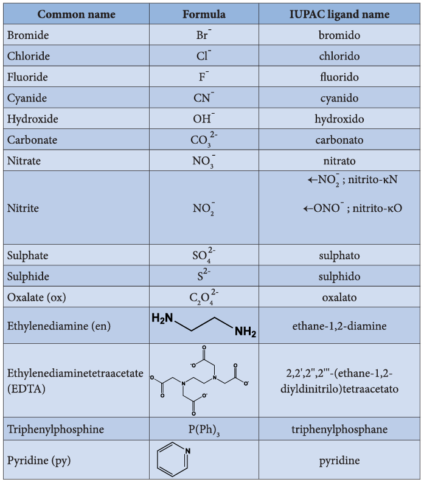

iii. If the coordination entity contains more than one ligand of a particular type, the multiples of ligand (2, 3, 4 etc.) is indicated by adding appropriate Greek prefixes (di, tri, tetra, etc.) to the name of the ligand. If the name of a ligand itself contains a Greek prefix (eg. ethylenediamine), use an alternate prefixes (bis, tris, tetrakis etc.) to specify the multiples of such ligands. These numerical prefixes are not taken into account for alphabetising the name of ligands.

**b. Naming the central metal:** In cationic/neutral complexes, the element name is used as such for naming the central metal atom/ion, whereas, a suffix 'ate' is used along with the element name in anionic complexes. The oxidation state of the metal is written immediately after the metal name using roman numerals in parenthesis.

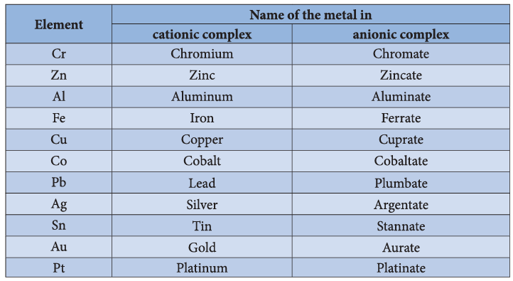

**Naming of coordination compounds using IUPAC guidelines.**

**Example 1:**

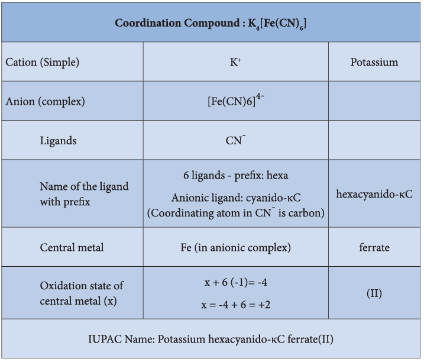

**Example 2:**

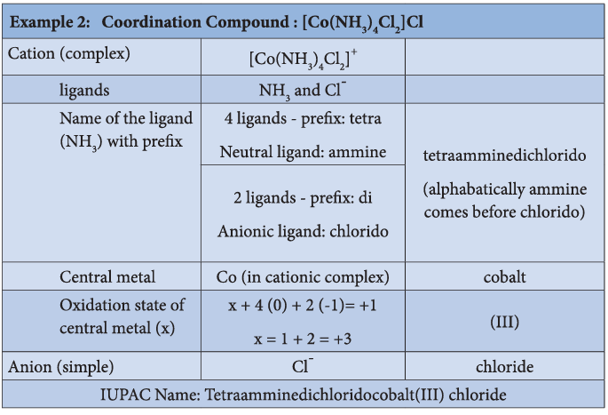

**Example 3:**

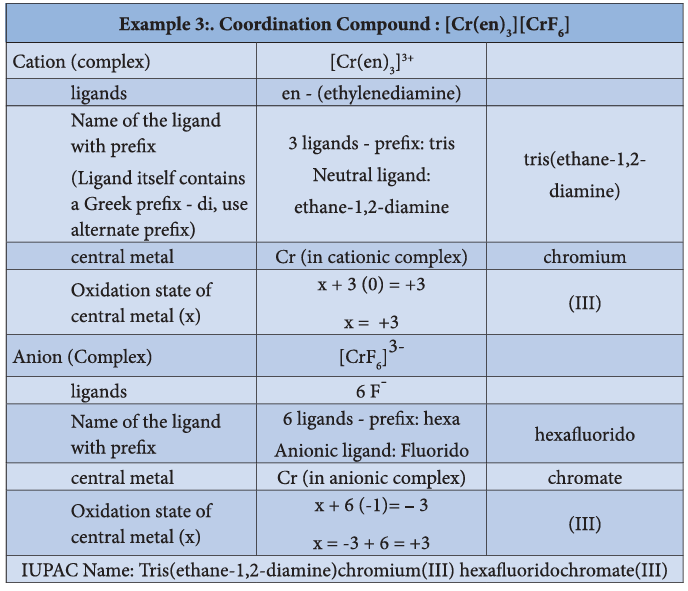

**More examples with names are given in the list below for better understanding of IUPAC Nomenclature:**

| i.    | \( [\mathrm{Ag(NH_3)_2}]Cl \)                         | Diamminesilver(I) chloride                                                                     |
| ----- | ----------------------------------------------------- | ---------------------------------------------------------------------------------------------- |
| ii.   | \( [\mathrm{Co(en)_2Cl_2}]Cl \)                       | Dichloridobis(ethane-1,2-diamine)cobalt(III) chloride                                          |
| iii.  | \( [\mathrm{Cu(NH_3)_4}]SO_4 \)                       | Tetraamminecopper(II) sulphate                                                                 |
| iv.   | \( [\mathrm{Co(CO_3)(NH_3)_4}]Cl \)                   | Tetraamminecarbonatocobalt(III) chloride                                                       |
| v.    | \( [\mathrm{Cr(NH_3)_3(H_2O)_3}]Cl_3 \)               | Triamminetriaquachromium(III) chloride                                                         |
| vi.   | \( \mathrm{K_3[Fe(CN)_5NO]} \)                        | Potassium pentacyanido-\( \kappa C \) nitrosylferrate(II)                                      |
| vii.  | \( \mathrm{Na_2[Ni(EDTA)]} \)                         | Sodium 2,2',2'',2'''-(ethane-1,2-diyldinitrilo)tetraacetatonickelate(II)                       |
| viii. | \( [\mathrm{PdI_2(ONO)_2(H_2O)_2}] \)                 | Diaquadiodidodinitrito-\( \kappa O \) palladium(IV)                                            |
| ix.   | \( [\mathrm{Cr(PPh_3)(CO)_5}] \)                      | Pentacarbonyltriphenylphosphanechromium(0)                                                     |
| x.    | \( [\mathrm{Co(NO_2)_3(NH_3)_3}] \)                   | Triamminetrinitrito-\( \kappa N \) cobalt(III)                                                 |
| xi.   | \( [\mathrm{Co(NH_3)\_5CN][Co(NH_3)(CN)_5}] \)        | Pentaamminecyanido-\( \kappa C \) cobalt(III) amminepentacyanido-\( \kappa C \) cobaltate(III) |
| xii.  | \( [\mathrm{Pt(py)\_4][PtCl_4}] \)                    | Tetrapyridineplatinum(II) tetrachloridoplatinate(II)                                           |
| xiii. | \( [\mathrm{Co(NH_3)_4Cl_2}]\_3[\mathrm{Cr(CN)_6}] \) | Tetraamminedichloridocobalt(III) hexacyanido-\( \kappa C \) chromate(III)                      |
| xiv.  | \( [\mathrm{Ag(NH_3)_2}]^+ \)                         | Diamminesilver(I) ion                                                                          |
| xv.   | \( [\mathrm{Co(NH_3)_5Cl}]^{2+} \)                    | Pentaamminechloridocobalt(III) ion                                                             |
| xvi.  | \( [\mathrm{FeF_6}]^{4-} \)                           | Hexafluoroferrate(II) ion                                                                      |

**Evaluate yourself 3:**

a. Write the IUPAC name for the following compounds.

\( \mathrm{K_2[Fe(CN)_3(Cl)_2(NH_3)]} \)

\( [\mathrm{Cr(CN)\_2(H_2O)\_4}][\mathrm{Co(ox)_2(en)}] \)

\( [\mathrm{Cu(NH_3)_2Cl_2}] \)

\( [\mathrm{Cr(NH_3)_3(NC)_2(H_2O)}]^+ \)

\( [\mathrm{Fe(CN)_6}]^+ \)

b. Give the structure for the following compounds.

(i) Diamminesilver(I) dicyanidoargentate(I)
(ii) Pentaammine nitrito-\( \kappa N \) cobalt(III) ion
(iii) Hexafluorido cobaltate(III) ion
(iv) Dichloridobis(ethylenediamine) Cobalt(IV) sulphate
(v) Tetracarbonylnickel(0)

### 5.5 Isomerism in coordination compounds

We have already learnt the concept of isomerism in the context of organic compounds, in the previous year chemistry classes. Similarly, coordination compounds also exhibit isomerism. Isomerism is the phenomenon in which more than one coordination compounds having the same molecular formula have different physical and chemical properties due to different arrangement of ligands around the central metal atom. The following flow chart gives an overview of the common types of isomerism observed in coordination compounds.

#### 5.5.1 Structural isomers

The coordination compounds with same formula, but have different connections among their constituent atoms are called structural isomers or constitutional isomers. Four common types of structural isomers are discussed below.

##### Linkage isomers

This type of isomers arises when an ambidentate ligand is bonded to the central metal atom/ion through either of its two different donor atoms. In the below mentioned examples, the nitrite ion is bound to the central metal ion \( \mathrm{Co^{3+}} \) through a nitrogen atom in one complex, and through oxygen atom in other complex.

\( [\mathrm{Co(NH_3)_5(NO_2)]^{2+}} \) and \( [\mathrm{Co(NH_3)_5(ONO)]^{2+}} \)

##### Coordination isomers

This type of isomers arises in the coordination compounds having both the cation and anion as complex ions. The interchange of one or more ligands between the cationic and the anionic coordination entities result in different isomers.

For example, in the coordination compound, \( [\mathrm{Co(NH_3)\_6}][\mathrm{Cr(CN)_6}] \) the ligands ammonia and cyanide were bound respectively to cobalt and chromium while in its coordination isomer \( [\mathrm{Cr(NH_3)\_6}][\mathrm{Co(CN)_6}] \) they are reversed.

**Some more examples for coordination isomers**

1. \( [\mathrm{Cr(NH_3)\_5CN}][\mathrm{Co(NH_3)(CN)_5}] \) and \( [\mathrm{Co(NH_3)\_5CN}][\mathrm{Cr(NH_3)(CN)_5}] \)

2. \( [\mathrm{Pt(NH_3)\_4}][\mathrm{PdCl_4}] \) and \( [\mathrm{Pd(NH_3)\_4}][\mathrm{PtCl_4}] \)

##### Ionisation isomers

This type of isomers arises when an ionisable counter ion (simple ion) itself can act as a ligand. The exchange of such counter ions with one or more ligands in the coordination entity will result in ionisation isomers. These isomers will give different ions in solution. For example, consider the coordination compound \( [\mathrm{Pt(en)_2Cl_2}]Br_2 \). In this compound, both \( \mathrm{Br^-} \) and \( \mathrm{Cl^-} \) have the ability to act as a ligand and the exchange of these two ions result in a different isomer \( [\mathrm{Pt(en)_2Br_2}]Cl_2 \). In solution the first compound gives \( \mathrm{Br^-} \) ions while the later gives \( \mathrm{Cl^-} \) ions and hence these compounds are called ionisation isomers.

**Some more example for the isomers**

1. \( [\mathrm{Cr(NH_3)_4ClBr}]NO_2 \) and \( [\mathrm{Cr(NH_3)_4ClNO_2}]Br \)

2. \( [\mathrm{Co(NH_3)_4Br_2}]Cl \) and \( [\mathrm{Co(NH_3)_4ClBr}]Br \)

**Evaluate yourself 4:** A solution of \( [\mathrm{Co(NH_3)_4Cl}]Cl \) when treated with \( \mathrm{AgNO_3} \) gives a white precipitate. What should be the formula of isomer of the dissolved complex that gives yellow precipitate with \( \mathrm{AgNO_3} \). What are the above isomers called?

##### Solvate isomers

The exchange of free solvent molecules such as water, ammonia, alcohol etc. in the crystal lattice with a ligand in the coordination entity will give different isomers. These type of isomers are called solvate isomers. If the solvent molecule is water, then these isomers are called hydrate isomers. For example, the complex with chemical formula \( \mathrm{CrCl_3.6H_2O} \) has three hydrate isomers as shown below.

| \( [\mathrm{Cr(H_2O)_6}]Cl_3 \)         | a violet colour compound and gives three chloride ions in solution   |
| --------------------------------------- | -------------------------------------------------------------------- |
| \( [\mathrm{Cr(H_2O)_5Cl}]Cl_2.H_2O \)  | a pale green colour compound and gives two chloride ions in solution |
| \( [\mathrm{Cr(H_2O)_4Cl_2}]Cl.2H_2O \) | dark green colour compound and gives one chloride ion in solution    |

#### 5.5.2 Stereoisomers

Similar to organic compounds, coordination compounds also exhibit stereoisomerism. The stereoisomers of a coordination compound have the same chemical formula and connectivity between the central metal atom and the ligands. But they differ in the spatial arrangement of ligands in three dimensional space. They can be further classified as geometrical isomers and optical isomers.

##### Geometrical isomers

Geometrical isomers exist in heteroleptic complexes due to different possible three dimensional spatial arrangements of the ligands around the central metal atom. This type of isomerism exists in square planar and octahedral complexes.

In square planar complexes of the form \( [\mathrm{MA_2B_2}]^{n\pm} \) and \( [\mathrm{MA_2BC}]^{n\pm} \) (where A, B and C are monodentate ligands and M is the central metal ion/atom), Similar groups (A or B) present either on same side or on the opposite side of the central metal atom (M) give rise to two different geometrical isomers, and they are called, cis and trans isomers respectively.

The square planar complex of the type \( [\mathrm{M(xy)_2}]^{n\pm} \) where xy is a bidentate ligand with two different coordinating atoms also shows cis-trans isomerism. Square planar complex of the form \( [\mathrm{MABCD}]^{n\pm} \) also shows geometrical isomerism. In this case, by considering any one of the ligands (A, B, C or D) as a reference, the rest of the ligands can be arranged in three different ways leading to three geometrical isomers.

##### Octahedral complexes

Octahedral complexes of the type \( [\mathrm{MA_3B_3}]^{n\pm} \), \( [\mathrm{M(XX)_2B_2}]^{n\pm} \) shows cis-trans isomerism. Here A and B are monodentate ligands and xx is bidentate ligand with two same kind of donor atoms. In the octahedral complex, the position of ligands is indicated by the following numbering scheme.

In the above scheme, the positions (1,2), (1,3), (1,4), (1,5), (2,3), (2,5), (2,6), (3,4), (3,6), (4,5), (4,6), and (5,6) are identical and if two similar groups are present in any one of these positions, the isomer is referred as a cis isomer. Similarly, positions (1,6), (2,4), and (3,5) are identical and if similar ligands are present in these positions it is referred as a trans-isomer.

Octahedral complex of the type \( [\mathrm{MA_3B_3}]^{n\pm} \) also shows geometrical isomerism. If the three similar ligands (A) are present in the corners of one triangular face of the octahedron and the other three ligands (B) are present in the opposing triangular face, then the isomer is referred as a facial isomer (fac isomer) - Figure 5.6 (a).

If the three similar ligands are present around the meridian which is an imaginary semicircle from one apex of the octahedral to the opposite apex as shown in the figure 5.6(b), the isomer is called as a meridional isomer (mer isomer). This is called meridional because each set of ligands can be regarded as lying on a meridian of an octahedron.

As the number of different ligands increases, the number of possible isomers also increases. For the octahedral complex of the type \( [\mathrm{MABCDEF}]^{n\pm} \), where A, B, C, D, E and F are monodentate ligands, fifteen different orientation are possible corresponding to 15 geometrical isomers. It is difficult to generate all the possible isomers.

**Evaluate yourself 5:**

a. Three compounds A, B and C have empirical formula \( \mathrm{CrCl_3.6H_2O} \). They are kept in a container with a dehydrating agent and they lost water and attaining constant weight as shown below. Identify the molecular formula of compounds.

| Compound | Initial weight of the compound (in g) | Constant weight after dehydration (in g) |
| -------- | ------------------------------------- | ---------------------------------------- |
| A        | 4                                     | 3.46                                     |
| B        | 0.5                                   | 0.466                                    |
| C        | 3                                     | 3                                        |

b. Indicate the possible type of isomerism for the following complexes and draw their isomers

(i) \( [\mathrm{Co(en)\_3}][\mathrm{Cr(CN)_6}] \)

(ii) \( [\mathrm{Co(NH_3)_5(NO_2)}]^{2+} \)

(iii) \( [\mathrm{Pt(NH_3)_3(NO_2)}]Cl \)

##### 5.5.3 Optical Isomerism

Coordination compounds which possess chirality exhibit optical isomerism similar to organic compounds. The pair of two optically active isomers which are mirror images of each other are called enantiomers. Their solutions rotate the plane of the plane polarised light either clockwise or anticlockwise and the corresponding isomers are called 'd' (dextrorotatory) and 'l' (levorotatory) forms respectively.

The octahedral complexes of type \( [\mathrm{M(xx)_3}]^{n\pm} \), \( [\mathrm{M(xx)_2AB}]^{n\pm} \) and \( [\mathrm{M(xx)_2B_2}]^{n\pm} \) exhibit optical isomerism.

**Examples:** The optical isomers of \( [\mathrm{Co(en)_3}]^{3+} \) are shown in figure 5.7.

The coordination complex \( [\mathrm{CoCl_2(en)_2}]^+ \) has three isomers, two optically active cis forms and one optically inactive trans form. These structures are shown below.

**Evaluate yourself 6:** Draw all possible stereo isomers of a complex \( \mathrm{Ca[Co(NH_3)Cl(ox)_2]} \)

### 5.6 Theories of coordination compound

Alfred Werner considered the bonding in coordination compounds as the bonding between a Lewis acid and a Lewis base. His approach is useful in explaining some of the observed properties of coordination compounds. However, properties such as colour, magnetic property etc. of complexes could not be explained on the basis of his approach. Following Werner theory, Linus Pauling proposed the Valence Bond Theory (VBT) which assumes that the bond formed between the central metal atom and the ligand is purely covalent. Bethe and Van Vleck treated the interaction between the metal ion and the ligands as electrostatic and extended the Crystal Field Theory (CFT) to explain the properties of coordination compounds. Further, Ligand field theory and Molecular orbital have been developed to explain the nature of bonding in the coordination compounds. In this portion we learn the elementary treatment of VBT and CFT to simple coordination compounds.

#### 5.6.1 Valence Bond Theory

According to this theory, the bond formed between the central metal atom and the ligand is due to the overlap of filled ligand orbitals containing a lone pair of electron with the vacant hybrid orbitals of the central metal atom.

**Main assumptions of VBT:**

1. The ligand \( \Rightarrow \) metal bond in a coordination complex is covalent in nature. It is formed by sharing of electrons (provided by the ligands) between the central metal atom and the ligand.
2. Each ligand should have at least one filled orbital containing a lone pair of electrons.
3. In order to accommodate the electron pairs donated by the ligands, the central metal ion present in a complex provides required number (coordination number) of vacant orbitals.
4. These vacant orbitals of central metal atom undergo hybridisation, the process of mixing of atomic orbitals of comparable energy to form equal number of new orbitals called hybridised orbitals with same energy.
5. The vacant hybridised orbitals of the central metal ion, linearly overlap with filled orbitals of the ligands to form coordinate covalent sigma bonds between the metal and the ligand.
6. The hybridised orbitals are directional and their orientation in space gives a definite geometry to the complex ion.

| Coordination number | Hybridisation   | Geometry             | Examples                                                                                                                                                     |
| ------------------- | --------------- | -------------------- | ------------------------------------------------------------------------------------------------------------------------------------------------------------ |
| 2                   | sp              | Linear               | \( [\mathrm{CuCl_2}]^+ \), \( [\mathrm{Ag(CN)_2}]^- \)                                                                                                       |
| 3                   | sp\(^2\)        | Trigonal planar      | \( [\mathrm{HgI_3}]^- \)                                                                                                                                     |
| 4                   | sp\(^3\)        | Tetrahedral          | \( [\mathrm{Ni(CO)_4}] \), \( [\mathrm{NiCl_4}]^{2-} \)                                                                                                      |
| 4                   | dsp\(^2\)       | Square planar        | \( [\mathrm{Ni(CN)_4}]^{2-} \), \( [\mathrm{Pt(NH_3)_4}]^{2+} \)                                                                                             |
| 5                   | dsp\(^3\)       | Trigonal bipyramidal | \( [\mathrm{Fe(CO)_5}] \)                                                                                                                                    |
| 6                   | d\(^2\)sp\(^3\) | Octahedral           | \( [\mathrm{Ti(H_2O)_6}]^{3+} \), \( [\mathrm{Fe(CN)_6}]^{2-} \), \( [\mathrm{Fe(CN)_6}]^{3-} \), \( [\mathrm{Co(NH_3)_6}]^{3+} \) (Inner orbital complexes) |
| 6                   | sp\(^3\)d\(^2\) | Octahedral           | \( [\mathrm{FeF_6}]^{4-} \), \( [\mathrm{CoF_6}]^{4-} \), \( [\mathrm{Fe(H_2O)_6}]^{2+} \) (Outer orbital complexes)                                         |

7. In the octahedral complexes, if the (n-1) d orbitals are involved in hybridisation, then they are called **inner orbital complexes** or **low spin complexes** or **spin paired complexes**. If the nd orbitals are involved in hybridisation, then such complexes are called **outer orbital** or **high spin** or **spin free complexes**. Here n represents the principal quantum number of the outermost shell.

8. The complexes containing a central metal atom with unpaired electron(s) are **paramagnetic**. If all the electrons are paired, then the complexes will be **diamagnetic**.

9. Ligands such as CO, CN, en, and NH\(\_3\) present in the complexes cause pairing of electrons present in the central metal atom. Such ligands are called **strong field ligands**.

10. Greater the overlapping between the ligand orbitals and the hybridised metal orbital, greater is the bond strength.

Let us illustrate the VBT by considering the following examples.

**Illustration 1**

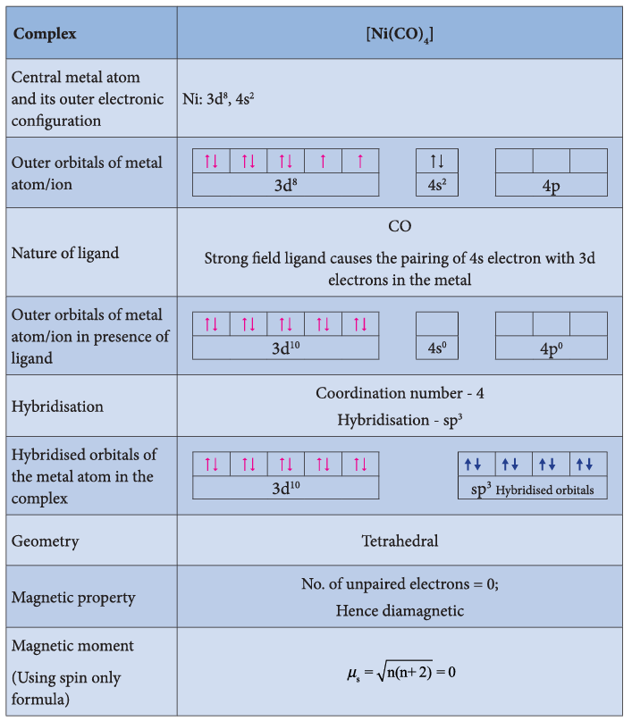

**Illustration 2**

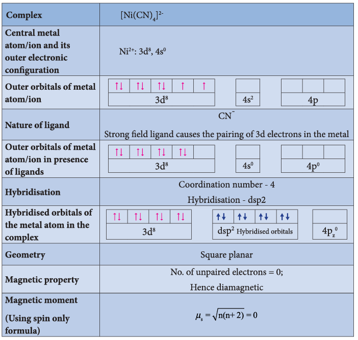

**Illustration 3**

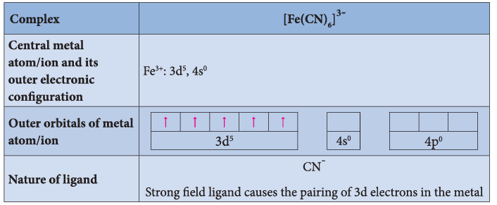

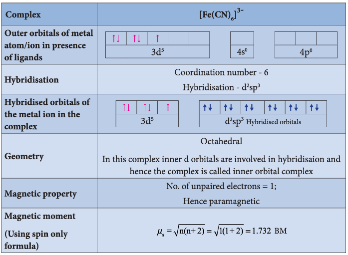

**Illustration 4**

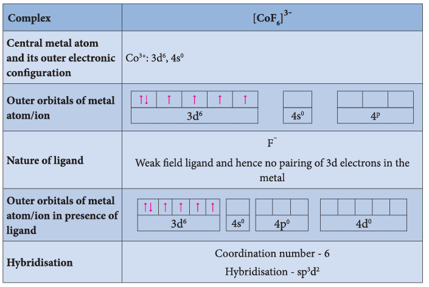

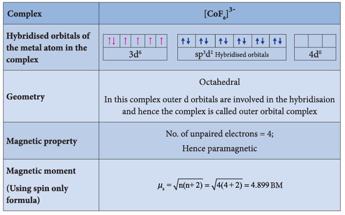

**Limitations of VBT**

Even though VBT explains many of the observed properties of complexes, it still has following limitations

1. It does not explain the colour of the complex.

2. It considers only the spin only magnetic moments and does not consider the other components of magnetic moments.

3. It does not provide a quantitative explanation as to why certain complexes are inner orbital complexes and the others are outer orbital complexes for the same metal. For example, \( [\mathrm{Fe(CN)_6}]^{4-} \) is diamagnetic (low spin) whereas \( [\mathrm{FeF_6}]^{4-} \) is paramagnetic (high spin).

**Evaluate yourself 7:**

i. The spin only magnetic moment of Tetrachloridomanganate(II) ion is \( 5.9\ \mathrm{BM} \). On the basis of VBT, predict the type of hybridisation and geometry of the compound.

ii. Predict the number of unpaired electrons in \( [\mathrm{CoCl_4}]^{2-} \) ion on the basis of VBT.

iii. A metal complex having composition \( \mathrm{Co(en)\_2Cl_2Br} \) has been isolated in two forms A and B. (B) reacted with silver nitrate to give a white precipitate readily soluble in ammonium hydroxide. Whereas A gives a pale yellow precipitate. Write the formula of A and B. State the hybridisation of Co in each and calculate their spin only magnetic moment.

#### 5.6.2 Crystal Field Theory

Valence bond theory helps us to visualise the bonding in complexes. However, it has limitations as mentioned above. Hence Crystal Field Theory to explain some of the properties like colour, magnetic behaviour etc. This theory was originally used to explain the nature of bonding in ionic crystals. Later on, it is used to explain the properties of transition metals and their complexes. The salient features of this theory are as follows.

1. Crystal Field Theory (CFT) assumes that the bond between the ligand and the central metal atom is purely ionic. i.e. the bond is formed due to the electrostatic attraction between the electron rich ligand and the electron deficient metal.
2. In the coordination compounds, the central metal atom/ion and the ligands are considered as point charges (in case of charged metal ions or ligands) or electric dipoles (in case of metal atoms or neutral ligands).
3. According to crystal field theory, the complex formation is considered as the following series of hypothetical steps.

Step 1: In an isolated gaseous state, all the five d orbitals of the central metal ion are degenerate. Initially, the ligands form a spherical field of negative charge around the metal. In this field, the energies of all the five d orbitals will increase due to the repulsion between the electrons of the metal and the ligand.

Step 2: The ligands are approaching the metal atom in actual bond directions. To illustrate this let us consider an octahedral field, in which the central metal ion is located at the origin and the six ligands are coming from the \( +x \), \( -x \), \( +y \), \( -y \), \( +z \) and \( -z \) directions as shown below.

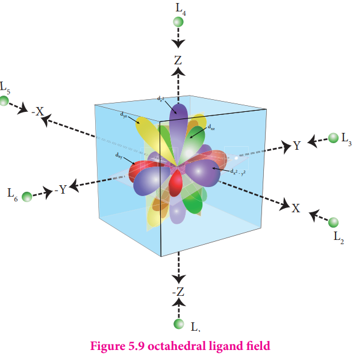

As shown in the figure, the orbitals lying along the axes \( \mathrm{d}_{x^2 - y^2} \) and \( \mathrm{d}_{z^2} \) orbitals will experience strong repulsion and raise in energy to a greater extent than the orbitals with lobes directed between the axes \( (\mathrm{d}_{xy}, \mathrm{d}_{yz} \) and \( \mathrm{d}\_{zx}) \). Thus the degenerate d orbitals now split into two sets and the process is called crystal field splitting.

Step 3: Up to this point the complex formation would not be favoured. However, when the ligands approach further, there will be an attraction between the negatively charged electron and the positively charged metal ion, that results in a net decrease in energy. This decrease in energy is the driving force for the complex formation.

**Crystal field splitting in octahedral complexes:**

During crystal field splitting in octahedral field, in order to maintain the average energy of the orbitals (barycentre) constant, the energy of the orbitals \( \mathrm{d}_{x^2 - y^2} \) and \( \mathrm{d}_{z^2} \) (represented as e\(_g\) orbitals) will increase by \( 3/5\Delta_{\mathrm{o}} \) while that of the other three orbitals \( \mathrm{d}_{xy}, \mathrm{d}_{yz} \) and \( \mathrm{d}_{zx} \) (represented as \( \mathrm{t}_{2\mathrm{g}} \) orbitals) decrease by \( 2/5\Delta*{\mathrm{o}} \). Here, \( \Delta*{\mathrm{o}} \) represents the crystal field splitting energy in the octahedral field.

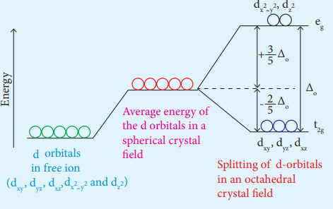

Figure: 5.10 - Crystal field splitting in octahedral field

**Crystal field splitting in tetrahedral complexes:**

The approach of ligands in tetrahedral field can be visualised as follows. Consider a cube in which the central metal atom is placed at its centre (i.e. origin of the coordinate axis as shown in the figure). The four ligands approach the central metal atom along the direction of the leading diagonals drawn from alternate corners of the cube.

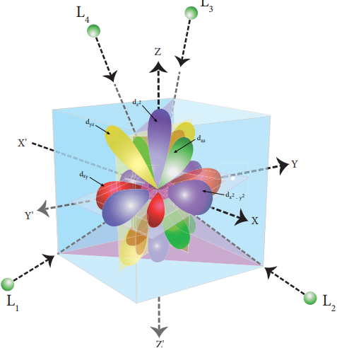

Figure 5.11 tetrahedral ligand field

In this field, none of the d orbitals point directly towards the ligands, however the \( \mathrm{t}_2 \) orbitals \( (\mathrm{d}_{xy}, \mathrm{d}_{yz} \) and \( \mathrm{d}_{zx}) \) are pointing close to the direction in which ligands are approaching than the e orbitals \( (\mathrm{d}_{x^2 - y^2} \) and \( \mathrm{d}_{z^2}) \).

As a result, the energy of \( \mathrm{t}_2 \) orbitals increases by \( 2/5\Delta_{\mathrm{t}} \) and that of e orbitals decreases by \( 3/5\Delta*{\mathrm{t}} \) as shown below. When compared to the octahedral field, this splitting is inverted and the splitting energy is less. The relation between the crystal field splitting energy in octahedral and tetrahedral ligand field is given by the expression; \( \Delta*{\mathrm{t}} = \frac{4}{9}\Delta\_{0} \)

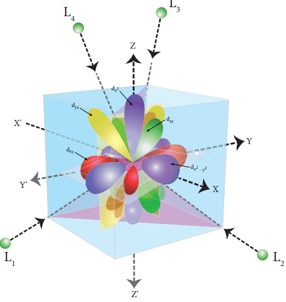

Figure 5.12 d-orbitals in tetrahedral ligand field

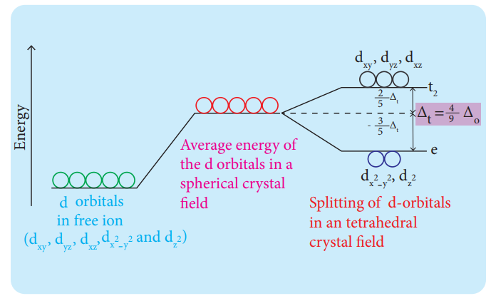

Figure: 5.13 - Crystal field splitting in tetrahedral field

**Crystal field splitting Energy and nature of ligands:**

The magnitude of crystal field splitting energy not only depends on the ligand field as discussed above but also depends on the nature of the ligand, the nature of the central metal atom/ion and the charge on it. Let us understand the effect of the nature of ligand on crystal field splitting by calculating the crystal field splitting energy of the octahedral complexes of titanium(III) with different ligands such as fluoride, bromide and water using their absorption spectral data. The absorption wave numbers of complexes \( [\mathrm{TiBr_6}]^{3-} \), \( [\mathrm{TiF_6}]^{3-} \) and \( [\mathrm{Ti(H_2O)_6}]^{3+} \) are 12500, 19000 and \( 20000\ \mathrm{cm^{-1}} \) respectively. The energy associated with the absorbed wave numbers of the light, corresponds to the crystal field splitting energy \( (\Delta) \) and is given by the following expression,

\[
\Delta = h\nu = \frac{hc}{\lambda} = hc\bar{\nu}
\]

where h is the Planck's constant; c is velocity of light, \( \bar{\nu} \) is the wave number of absorption maximum which is equal to \( 1/\lambda \)

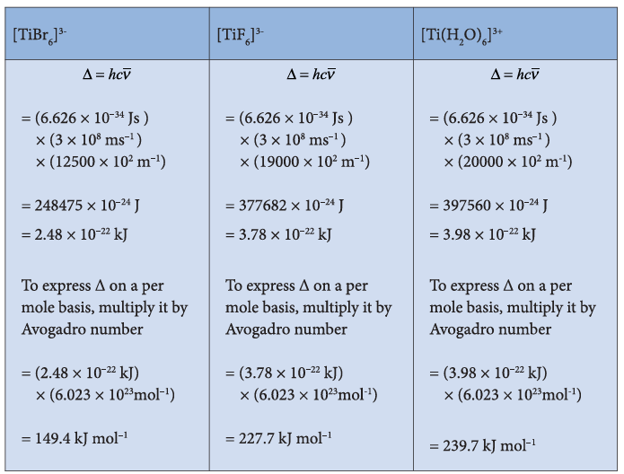

From the above calculations, it is clear that the crystal field splitting energy of the \( \mathrm{Ti^{3+}} \) in complexes with the three ligands is in the order; \( \mathrm{Br^-} < \mathrm{F^-} < \mathrm{H_2O} \). Similarly, it has been found from the spectral data that the crystal field splitting power of various ligands for a given metal ion, are in the following order

\[
\mathrm{I^- < Br^- < SCN^- < Cl^- < S^{2-} < F^- < OH^- = urea < ox^{2-} < H_2O < NCS^- < EDTA^{4-} < NH_3 < en < NO_2^- < CN^- < CO}
\]

The above series is known as **spectrochemical series**. The ligands present on the right side of the series such as carbonyl causes relatively larger crystal field splitting and are called strong ligands or strong field ligands, while the ligands on the left side are called weak field ligands and causes relatively smaller crystal field splitting.

**Distribution of d electrons in octahedral complexes**

The filling of electrons in the d orbitals in the presence of ligand field also follows Hund's rule. In the octahedral complexes with $\mathrm{d}^2$ and $\mathrm{d}^3$ configurations, the electrons occupy different degenerate $\mathrm{t}_{2g}$ orbitals and remain unpaired.

In case of $\mathrm{d}^4$ configuration, there are two possibilities. The fourth electron may either go to the higher energy $e_g$ orbitals or it may pair with one of the $t_{2g}$ electrons. In this scenario, the preferred configuration will be the one with lowest energy.

If the octahedral crystal field splitting energy ($\Delta_o$) is greater than the pairing energy ($P$), the fourth electron will pair up with an electron in the $\mathrm{t}_{2g}$ orbital. Conversely, if $\Delta_o < P$, the fourth electron will occupy one of the degenerate higher-energy $\mathrm{e}_g$ orbitals.

For example, let us consider two different iron(III) complexes:

- $\mathrm{[Fe(H_2O)_6]^{3+}}$ (weak field complex; $\Delta_o = 14000\ \mathrm{cm}^{-1}$)
- $\mathrm{[Fe(CN)_6]^{3-}}$ (strong field complex; $\Delta_o = 35000\ \mathrm{cm}^{-1}$)

The pairing energy of $\mathrm{Fe}^{3+}$ is $30000\ \mathrm{cm}^{-1}$.

In both complexes, $\mathrm{Fe}^{3+}$ has a $\mathrm{d}^5$ configuration.

For the aqua complex,

$$
\Delta_o < P
$$

Hence, the fourth and fifth electrons enter the $\mathrm{e}_g$ orbitals and the electronic configuration is

$$
\mathrm{t}_{2g}^{3}\mathrm{e}_g^{2}
$$

For the cyanide complex,

$$
\Delta_o > P
$$

Hence, the fourth and fifth electrons pair up in the $\mathrm{t}_{2g}$ orbitals and the electronic configuration is

$$
\mathrm{t}_{2g}^{5}\mathrm{e}_g^{0}
$$

The actual distribution of electrons can be ascertained by calculating the crystal field stabilisation energy (CFSE). The crystal field stabilisation energy is defined as the energy difference between the electronic configuration in the ligand field $(E_{LF})$ and the isotropic field (barycentre) $(E_{iso})$.

$$
\mathrm{CFSE}(\Delta \mathrm{E}_{\mathrm{o}}) = \{\mathrm{E}_{\mathrm{1F}}\} -\{\mathrm{E}_{\mathrm{iso}}\}
$$

$$
\qquad = \{\mathrm{[n}_{\mathrm{2g}}(\mathrm{-0.4}) + \mathrm{n}_{\mathrm{e_{g}}}(0.6)]\Delta_{\mathrm{o}} + \mathrm{n}_{\mathrm{p}}\mathrm{P}\} -\{\mathrm{n}_{\mathrm{p}}^{\prime}\mathrm{P}\}
$$

Here, $n_{t_{2g}}$ is the number of electrons in $t_{2g}$ orbitals; $n_{e_g}$ is the number of electrons in $e_g$ orbitals; $n_p$ is the number of electron pairs in the ligand field; and $n_p'$ is the number of electron pairs in the isotropic field (barycentre).

Calculating the CFSE for the Iron complexes

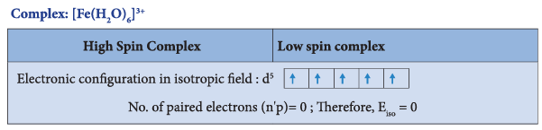

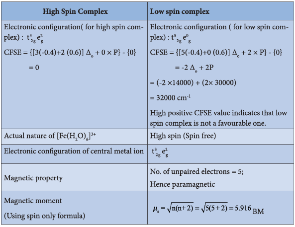

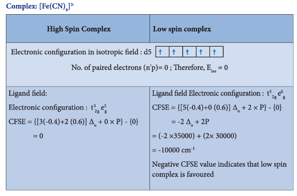

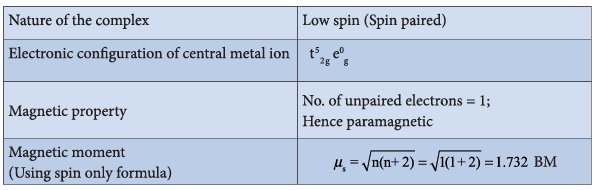

**Colour of the complex and crystal field splitting energy:**

Most of the transition metal complexes are coloured. A substance exhibits colour when it absorbs the light of a particular wavelength in the visible region and transmit the rest of the visible light. When this transmitted light enters our eye, our brain recognises its colour. The colour of the transmitted light is given by the complementary colour of the absorbed light. For example, the hydrated copper(II) ion is blue in colour as it absorbs orange light, and transmit its complementary colour, blue. A list of absorbed wavelength and their complementary colour is given in the following table.

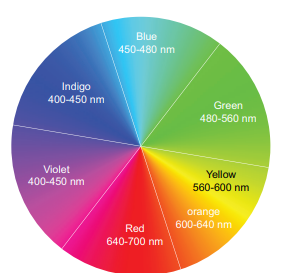

Figure 5.15 Colour Wheel - Complementary colours are shown on opposite sides.

| Wavelength (\( \lambda \)) of absorbed light (Å) | Wave number (\( \bar{\nu} \)) of the absorbed light (cm\(^{-1}\)) | Colour of absorbed light | Observed Colour |
| ------------------------------------------------ | ----------------------------------------------------------------- | ------------------------ | --------------- |
| 4000                                             | 25000                                                             | Violet                   | Yellow          |
| 4750                                             | 21053                                                             | Blue                     | Orange          |
| 5100                                             | 19608                                                             | Green                    | Red             |
| 5700                                             | 17544                                                             | Yellow                   | Violet          |
| 5900                                             | 16949                                                             | Orange                   | Blue            |
| 6500                                             | 15385                                                             | Red                      | Green           |

The observed colour of a coordination compound can be explained using crystal field theory. We learnt that the ligand field causes the splitting of d orbitals of the central metal atom into two sets ( \( \mathrm{t}_{2\mathrm{g}} \) and \( \mathrm{e}_{\mathrm{g}} \) ). When the white light falls on the complex ion, the central metal ion absorbs visible light corresponding to the crystal field splitting energy and transmits rest of the light which is responsible for the colour of the complex. This absorption causes excitation of d-electrons of central metal ion from the lower energy \( \mathrm{t*{2g}} \) level to the higher energy \( \mathrm{e*{g}} \) level which is known as **d-d transition**.

Let us understand the d-d transitions by considering \( [\mathrm{Ti(H_2O)_6}]^{3+} \) as an example. In this complex the central metal ion is \( \mathrm{Ti^{3+}} \), which has \( \mathrm{d^1} \) configuration. This single electron occupies one of the \( \mathrm{t*{2g}} \) orbitals in the octahedral aqua ligand field. When white light falls on this complex the d electron absorbs light and promotes itself to \( \mathrm{e*{g}} \) level. The spectral data show the absorption maximum is at \( 20000\ \mathrm{cm^{-1}} \) corresponding to the crystal field splitting energy \( (\Delta\_{\mathrm{o}}) \) \( 239.7\ \mathrm{kJ\ mol^{-1}} \). The transmitted colour associated with this absorption is purple and hence, the complex appears purple in colour.

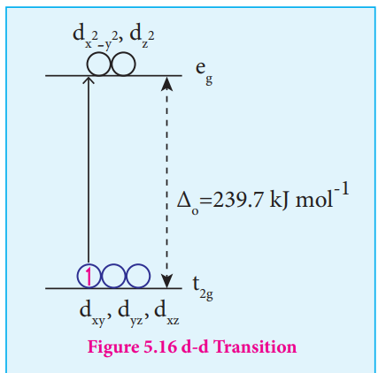

The octahedral titanium(III) complexes with other ligands such as bromide and fluoride have different colours. This is due to the difference in the magnitude of crystal field splitting by these ligands (Refer page 156). However, the complexes of central metal atom such as \( \mathrm{Sc^{3+}} \), \( \mathrm{Ti^{4+}} \), \( \mathrm{Cu^+} \), \( \mathrm{Zn^{2+}} \), etc. are colourless. This is because the d-d transition is not possible in complexes with central metal having \( \mathrm{d^0} \) or \( \mathrm{d^{10}} \) configuration.

**Evaluate yourself 8:**

i. The mean pairing energy and octahedral field splitting energy of \( [\mathrm{Mn(CN)_6}]^{3-} \) are \( 28,800\ \mathrm{cm^{-1}} \) and \( 38500\ \mathrm{cm^{-1}} \) respectively. Whether this complex is stable in low spin or high spin?

ii. Draw energy level diagram and indicate the number of electrons in each level for the complex \( [\mathrm{Cu(H_2O)_6}]^{2+} \). Whether the complex is paramagnetic or diamagnetic?

iii. For the \( [\mathrm{CoF_6}]^{3-} \) ion the mean pairing energy is found to be \( 21000\ \mathrm{cm^{-1}} \). The magnitude of \( \Delta_0 \) is \( 13000\ \mathrm{cm^{-1}} \). Calculate the crystal field stabilization energy for this complex ion corresponding to low spin and high spin states.

### 5.7 Metallic carbonyls

Metal carbonyls are the transition metal complexes of carbon monoxide, containing Metal-Carbon bond. In these complexes CO molecule acts as a neutral ligand. The first homoleptic carbonyl \( [\mathrm{Ni(CO)_4}] \) nickel tetracarbonyl was reported by Mond in 1890. These metallic carbonyls are widely studied because of their industrial importance, catalytic properties and their ability to release carbon monoxide.

#### Classification

Generally metal carbonyls are classified in two different ways as described below.

**(i) Classification based on the number of metal atoms present.**

Depending upon the number of metal atoms present in a given metallic carbonyl, they are classified as follows.

**a. Mononuclear carbonyls**

These compounds contain only one metal atom, and have comparatively simple structures. For example, \( [\mathrm{Ni(CO)_4}] \) - Nickel tetracarbonyl is tetrahedral, \( [\mathrm{Fe(CO)_5}] \) - Iron pentacarbonyl is trigonal bipyramidal, and \( [\mathrm{Cr(CO)_6}] \) - Chromium hexacarbonyl is octahedral.

**b. Polynuclear carbonyls**

Metallic carbonyls containing two or more metal atoms are called polynuclear carbonyls. Polynuclear metal carbonyls may be Homonuclear \( ([\mathrm{Co_2(CO)_8}], [\mathrm{Mn_2(CO)_{10}}], [\mathrm{Fe_3(CO)_{12}}]) \) or heteronuclear \( ([\mathrm{MnCo(CO)_9}], [\mathrm{MnRe(CO)_{10}}]) \) etc.

**(ii) Classification based on the structure:**

The structures of the binuclear metal carbonyls involve either metal-metal bonds or bridging CO groups, or both. The carbonyl ligands that are attached to only one metal atom are referred to as terminal carbonyl groups, whereas those attached to two metal atoms simultaneously are called bridging carbonyls. Depending upon the structures, metal carbonyls are classified as follows.

**a. Non-bridged metal carbonyls:**

These metal carbonyls do not contain any bridging carbonyl ligands. They may be of two types.

(i) Non-bridged metal carbonyls which contain only terminal carbonyls.

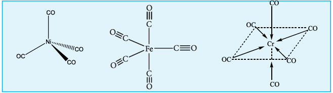

(ii) Non-bridged metal carbonyls which contain terminal carbonyls as well as Metal-Metal bonds. For examples, The structure of \( \mathrm{Mn*2(CO)*{10}} \) actually involves only a metal-metal bond, so the formula is more correctly represented as \( (\mathrm{CO})\_5\mathrm{Mn} - \mathrm{Mn}(\mathrm{CO})\_5 \)

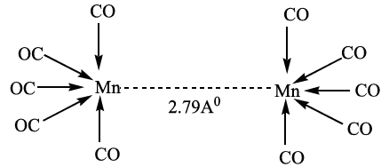

Other examples of this type are, \( \mathrm{Tc*2(CO)*{10}} \) and \( \mathrm{Re*2(CO)*{10}} \).

**b. Bridged carbonyls:**

These metal carbonyls contain one or more bridging carbonyl ligands along with terminal carbonyl ligands and one or more Metal-Metal bonds. For example,

(i) The structure of \( \mathrm{Fe_2(CO)\_9} \) di-iron nonacarbonyl molecule consists of three bridging CO ligands, six terminal CO groups.

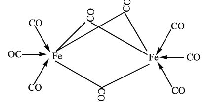

(ii) For dicobalt octacarbonyl \( \mathrm{Co_2(CO)\_8} \) two isomers are possible. One has a metal-metal bond between the cobalt atoms, and the other has two bridging CO ligands.

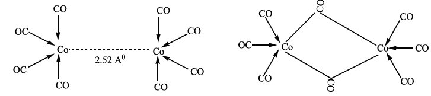

#### Bonding in metal carbonyls

In metal carbonyls, the bond between metal atom and the carbonyl ligand consists of two components. The first component is an electron pair donation from the carbon atom of carbonyl ligand into a vacant d-orbital of central metal atom. This electron pair donation forms \( \mathrm{M} \leftarrow \sigma\_{\mathrm{CO}}^{\mathrm{orbital}} \) CO sigma bond. This sigma bond formation increases the electron density in metal d orbitals and makes the metal electron rich. In order to compensate for this increased electron density, a filled metal d-orbital interacts with the empty \( \pi^\* \) orbital on the carbonyl ligand and transfers the added electron density back to the ligand. This second component is called \( \pi \)-back bonding. Thus in metal carbonyls, electron density moves from ligand to metal through sigma bonding and from metal to ligand through pi bonding, this synergic effect accounts for strong \( \mathrm{M} \longleftarrow \mathrm{CO} \) bond in metal carbonyls. This phenomenon is shown diagrammatically as follows.

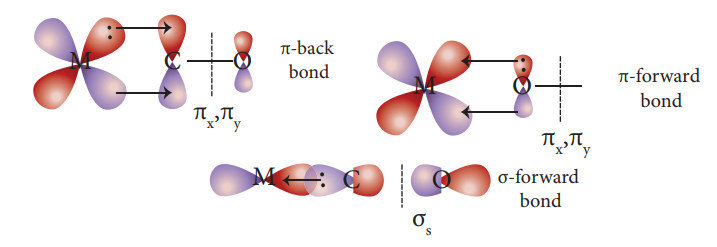

### 5.8 Stability of metal complexes

The stability of coordination complexes can be interpreted in two different ways. The first one is thermodynamic stability and second one is kinetic stability. Thermodynamic stability of a coordination complex refers to the free energy change \( (\Delta G) \) of a complex formation reaction. Kinetic stability of a coordination complex refers to the ligand substitution. In some cases, complexes can undergo rapid ligand substitution; such complexes are called labile complexes. However, some complexes undergo ligand substitution very slowly (or sometimes no substitution), such complexes are called inert complexes.

#### Stability constant \( (\beta) \)

The stability of a coordination complex is a measure of its resistance to the replacement of one ligand by another. The stability of a complex refers to the degree of association between two species involved in an equilibrium. Let us consider the following complex formation reaction

\[
\mathrm{Cu^{2+}} + 4\mathrm{NH_3} \rightleftharpoons [\mathrm{Cu(NH_3)_4}]^{2+}
\]

\[
\beta = \frac{[\mathrm{Cu(NH_3)_4}]^{2+}}{[\mathrm{Cu^{2+}}][\mathrm{NH_3}]^4} \qquad ---(1)
\]

So, as the concentration of \( [\mathrm{Cu(NH_3)_4}]^{2+} \) increases the value of stability constant also increases. Therefore the greater the value of stability constant greater is the stability of the complex.

Generally coordination complexes are stable in their solutions; however, the complex ion can undergo dissociation to a small extent. Extent of dissociation depends on the strength of the metal ligand bond, thus Stronger the \( \mathrm{M} \longleftarrow \mathrm{L} \), lesser is the dissociation.

In aqueous solutions, when complex ion dissociates, there will be equilibrium between undissociated complex ion and dissociated ions. Hence the stability of the metal complex can be expressed in terms of dissociation equilibrium constant or instability constant \( (\alpha) \). For example let us consider the dissociation of \( [\mathrm{Cu(NH_3)_4}]^{2+} \) in aqueous solution.

\[
[\mathrm{Cu(NH_3)_4}]^{2+} \rightleftharpoons \mathrm{Cu^{2+}} + 4\mathrm{NH_3}
\]

The dissociation equilibrium constant or instability constant is represented as follows,

\[
\alpha = \frac{[\mathrm{Cu^{2+}}][\mathrm{NH_3}]^4}{[\mathrm{Cu(NH_3)_4}]^{2+}} \qquad ---(2)
\]

From (1) and (2) we can say that, the reciprocal of dissociation equilibrium constant \( (\alpha) \) is called as formation equilibrium constant or stability constant \( (\beta) \).

\[
\beta = \left(\frac{1}{\alpha}\right)
\]

#### Significance of stability constants

The stability of coordination complex is measured in terms of its stability constant \( (\beta) \). Higher the value of stability constant for a complex ion, greater is the stability of the complex ion. Stability constant values of some important complexes are listed in table

| Complex ion                      | Instability constant value \( (\alpha) \) | Stability constant value \( (\beta) \) |
| -------------------------------- | ----------------------------------------- | -------------------------------------- |
| \( [\mathrm{Fe(SCN)}]^{2+} \)    | \( 1.0 \times 10^{-3} \)                  | \( 1.0 \times 10^{3} \)                |
| \( [\mathrm{Cu(NH_3)_4}]^{2+} \) | \( 1.0 \times 10^{-12} \)                 | \( 1.0 \times 10^{12} \)               |
| \( [\mathrm{Ag(CN)_2}]^- \)      | \( 1.8 \times 10^{-19} \)                 | \( 5.4 \times 10^{18} \)               |
| \( [\mathrm{Co(NH_3)_6}]^{3+} \) | \( 6.2 \times 10^{-36} \)                 | \( 1.6 \times 10^{35} \)               |
| \( [\mathrm{Hg(CN)_4}]^{2-} \)   | \( 4.0 \times 10^{-42} \)                 | \( 2.5 \times 10^{41} \)               |

By comparing stability constant values in the above table, we can say that among the five complexes listed, \( [\mathrm{Hg(CN)_4}]^{2-} \) is most stable complex ion and \( [\mathrm{Fe(SCN)}]^{2+} \) is least stable.

#### 5.8.1 Stepwise formation constants and overall formation constants

When a free metal ion is in aqueous medium, it is surrounded by (coordinated with) water molecules. It is represented as \( [\mathrm{MS_6}] \). If ligands which are stronger than water are added to this metal salt solution, coordinated water molecules are replaced by strong ligands.

Let us consider the formation of a metal complex \( \mathrm{ML_6} \) in aqueous medium. (Charge on the metal ion is ignored) complex formation may occur in single step or step by step. If ligands added to the metal ion in single step, then

\[
[\mathrm{MS_6}] + 6\mathrm{L} \Longrightarrow [\mathrm{ML_6}] + 6\mathrm{S}
\]

\[
\beta\_{\mathrm{overall}} = \frac{[\mathrm{ML_6}][\mathrm{S}]^6}{[\mathrm{MS_6}][\mathrm{L}]^6}
\]

\( \beta\_{\mathrm{overall}} \) is called as overall stability constant. As solvent is present in large excess, its concentration in the above equation can be ignored.

\[
\therefore \beta\_{\mathrm{overall}} = \frac{[\mathrm{ML_6}]}{[\mathrm{MS_6}][\mathrm{L}]^6}
\]

If these six ligands are added to the metal ion one by one, then the formation of complex \( [\mathrm{ML_6}] \) can be supposed to take place through six different steps as shown below. Generally step wise stability constants are represented by the symbol k.

\[
[\mathrm{MS_6}] + \mathrm{L} \Longrightarrow [\mathrm{MS_5L}] + \mathrm{S} \qquad k_1 = \frac{[\mathrm{MS_5L}]}{[\mathrm{MS_6}][\mathrm{L}]}
\]

\[
[\mathrm{MS_5L}] + \mathrm{L} \Longrightarrow [\mathrm{MS_4L_2}] + \mathrm{S} \qquad k_2 = \frac{[\mathrm{MS_4L_2}]}{[\mathrm{MS_5L}][\mathrm{L}]}
\]

\[
[\mathrm{MS_4L_2}] + \mathrm{L} \Longrightarrow [\mathrm{MS_3L_3}] + \mathrm{S} \qquad k_3 = \frac{[\mathrm{MS_3L_3}]}{[\mathrm{MS_4L_2}][\mathrm{L}]}
\]

\[
[\mathrm{MS_3L_3}] + \mathrm{L} \Longrightarrow [\mathrm{MS_2L_4}] + \mathrm{S} \qquad k_4 = \frac{[\mathrm{MS_2L_4}]}{[\mathrm{MS_3L_3}][\mathrm{L}]}
\]

\[
[\mathrm{MS_2L_4}] + \mathrm{L} \Longrightarrow [\mathrm{MSL_5}] + \mathrm{S} \qquad k_5 = \frac{[\mathrm{MSL_5}]}{[\mathrm{MS_2L_4}][\mathrm{L}]}
\]

\[
[\mathrm{MSL_5}] + \mathrm{L} \Longrightarrow [\mathrm{ML_6}] + \mathrm{S} \qquad k_6 = \frac{[\mathrm{ML_6}]}{[\mathrm{MSL_5}][\mathrm{L}]}
\]

In the above equilibrium, the values \( k_1, k_2, k_3, k_4, k_5 \) and \( k_6 \) are called step wise stability constants. By carrying out a mathematical manipulation, we can show that overall stability constant \( \beta \) is the product of all step wise stability constants \( k_1, k_2, k_3, k_4, k_5 \) and \( k_6 \).

\[
\beta = k_1 \times k_2 \times k_3 \times k_4 \times k_5 \times k_6
\]

On taking logarithm both sides

\[
\log(\beta) = \log(k_1) + \log(k_2) + \log(k_3) + \log(k_4) + \log(k_5) + \log(k_6)
\]

### 5.9 Importance and applications of coordination complexes

The coordination complexes are of great importance. These compounds are present in many plants, animals and in minerals. Some important applications of coordination complexes are described below.

1. Phthalo blue - a bright blue pigment is a complex of Copper(II) ion and it is used in printing ink and in the packaging industry.

2. Purification of Nickel by Mond's process involves formation \( [\mathrm{Ni(CO)_4}] \), which yields \( 99.5\% \) pure Nickel on decomposition.

3. EDTA is used as a chelating ligand for the separation of lanthanides, in softening of hard water and also in removing lead poisoning.

4. Coordination complexes are used in the extraction of silver and gold from their ores by forming soluble cyano complex. These cyano complexes are reduced by zinc to yield metals. This process is called as MacArthur-Forrest cyanide process.

5. Some metal ions are estimated more accurately by complex formation. For example, \( \mathrm{Ni^{2+}} \) ions present in Nickel chloride solution is estimated accurately by forming an insoluble complex called \( [\mathrm{Ni(DMG)_2}] \).

6. Many of the complexes are used as catalysts in organic and inorganic reactions. For example,
   (i) Wilkinson's catalyst - \( [(\mathrm{PPh_3})_3\mathrm{RhCl}] \) is used for hydrogenation of alkenes.
   (ii) Ziegler-Natta catalyst - \( [\mathrm{TiCl_4}] + \mathrm{Al(C_2H_5)\_3} \) is used in the polymerization of ethene.

7. In order to get a fine and uniform deposit of superior metals (Ag, Au, Pt etc.) over base metals, Coordination complexes \( [\mathrm{Ag(CN)_2}]^- \) and \( [\mathrm{Au(CN)_2}]^- \) etc., are used in electrolytic bath.

8. Many complexes are used as medicines for the treatment of various diseases. For example,
   (1) Ca-EDTA chelate, is used in the treatment of lead and radioactive poisoning. That is for removing lead and radioactive metal ions from the body.
   (2) Cisplatin is used as an antitumor drug in cancer treatment.

9. In photography, when the developed film is washed with sodium thiosulphate solution (hypo), the negative film gets fixed. Undecomposed AgBr forms a soluble complex called sodium dithiosulphatoargentate(I) which can be easily removed by washing the film with water.

\[
\mathrm{AgBr} + 2\mathrm{Na_2S_2O_3} \longrightarrow \mathrm{Na_3[Ag(S_2O_3)_2]} + 2\mathrm{NaBr}
\]

10. Many biological systems contain metal complexes. For example,

    (i) A red blood corpuscle (RBC) is composed of heme group, which is \( \mathrm{Fe^{2+}} \)-Porphyrin complex. It plays an important role in carrying oxygen from lungs to tissues and carbon dioxide from tissues to lungs.

    (ii) Chlorophyll, a green pigment present in green plants and algae, is a coordination complex containing \( \mathrm{Mg^{2+}} \) as central metal ion surrounded by a modified porphyrin ligand called chlorin ring. It plays an important role in photosynthesis, by which plants convert \( \mathrm{CO*2} \) and water into carbohydrates and oxygen.

    (iii) Vitamin \( \mathrm{B*{12}} \) (cyanocobalamine) is the only vitamin that consists of a metal ion. It is a coordination complex in which the central metal ion is \( \mathrm{Co^{3+}} \) surrounded by a porphyrin-like ligand.

    (iv) Many enzymes are known to be metal complexes, they regulate biological processes. For example, Carboxypeptidase is a protease enzyme that is important in digestion, contains a zinc ion coordinated to the protein.

**Do You Know**
## Cisplatin

Cisplatin is a square planar coordination complex (cis- \( [\mathrm{Pt(NH_3)_2Cl_2}] \) ), in which two similar ligands are in adjacent positions.

It is a platinum-based anticancer drug. This drug undergoes hydrolysis and reacts with DNA to produce various crosslinks. These crosslinks hinder the DNA replication and transcription, which results in cell growth inhibition and ultimately cell death.

It also crosslinks with cellular proteins and inhibits mitosis.

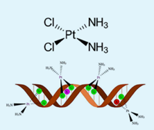

## Summary

- When two or more stable compounds in solution are mixed together and allowed to evaporate, in certain cases there is a possibility for the formation of double salts or coordination compounds. The double salts lose their identity and dissociates into their constituent simple ions in solutions, whereas the complex ion in coordination compound, does not lose its identity and never dissociate to give simple ions.

- According to Werner, most of the elements exhibit, two types of valence namely primary valence and secondary valence and each element tend to satisfy both the valences. In modern terminology, the primary valence is referred as the oxidation state of the metal atom and the secondary valence as the coordination number.

- Coordination entity is an ion or a neutral molecule, composed of a central atom, usually a metal and the array of other atoms or groups of atoms (ligands) that are attached to it.

- The central atom/ion is the one that occupies the central position in a coordination entity and binds other atoms or groups of atoms (ligands) to itself, through a coordinate covalent bond.

- The ligands are the atoms or groups of atoms bound to the central atom/ion. The atom in a ligand that is bound directly to the central metal atom is known as a donor atom.

- The complex ion of the coordination compound containing the central metal atom/ion and the ligands attached to it, is collectively called coordination sphere and are usually enclosed in square brackets with the net charge.

- The three dimensional spatial arrangement of ligand atoms/ions that are directly attached to the central atom is known as the coordination polyhedron (or polygon).

- The number of ligand donor atoms bonded to a central metal ion in a complex is called the coordination number of the metal.

- The oxidation state of a central atom in a coordination entity is defined as the charge it would bear if all the ligands were removed along with the electron pairs that were shared with the central atom.

- Linkage isomers arise when an ambidentate ligand is bonded to the central metal atom/ion through either of its two different donor atoms.

- Coordination isomers arise in the coordination compounds having both the cation and anion as complex ions. The interchange of one or more ligands between the cationic and the anionic coordination entities result in different isomers.

- Ionisation isomers arise when an ionisable counter ion (simple ion) itself can act as a ligand. The exchange of such counter ions with one or more ligands in the coordination entity will result in ionisation isomers.

- Geometrical isomerism exists in heteroleptic complexes due to different possible three dimensional spatial arrangements of the ligands around the central metal atom. This type of isomerism exists in square planar and octahedral complexes.

- Coordination compounds which possess chirality exhibit optical isomerism similar to organic compounds. The pair of two optically active isomers which are mirror images of each other are called enantiomers.

- Linus Pauling proposed the Valence Bond Theory (VBT) which assumes that the bond formed between the central metal atom and the ligand is purely covalent. Bethe and Van Vleck treated the interaction between the metal ion and the ligands as electrostatic and extended the Crystal Field Theory (CFT) to explain the properties of coordination compounds.

