# 9. ELECTRO CHEMISTRY

**Walther Hermann Nernst**

Walther Hermann Nernst,  was
a German  chemist  known for his
work in  thermodynamics,  physical
chemistry,  electrochemistry, and  solid
state physics. His formulation of
the  Nernst heat theorem  helped to
pave the way for the  third law of
thermodynamics, for which he won the
1920  Nobel Prize in Chemistry. He is
also known for developing the  Nernst
equation  in 1887. He also derived
the  Nernst equation  for the electrical
potential generated by unequal
concentrations of an ion separated by
a membrane that is permeable to the
ion. His equation is widely used in cell
physiology and neurobiology.

## INTRODUCTION

We have come across many materials in our life, and they can be broadly classified into conductors, semiconductors and insulators based on their electrical conductivity. You might have noticed that conducting materials such as copper, aluminium etc., are used to transport electrical energy from one place to another place, and the insulating materials such as PVC, Bakelite etc., in switches, circuit boards etc. Do you know how the electrical energy is generated? We know from first Law of thermodynamics that energy can neither be created nor be destroyed, but one form of energy can be converted into another form. It is not possible to create electrical energy but we can generate electrical energy in many ways i.e., by converting solar energy, wind energy, tidal energy etc. one such way is converting chemical energy into electrical energy as in the case of batteries. We cannot imagine a modern technological world without batteries. Hence it is important to know the principles behind this type of energy conversion. The branch of chemistry that deals with the study of electrical energy transport and the inter conversion of electrical and chemical energy is called electrochemistry. Electrochemical reactions are redox reactions and they involve the transfer of electron from one substance to another.

In this unit, we will learn about the electrical conduction, construction of batteries and the thermodynamic principles involved in electrochemical reactions.

### 9.1 Conductivity of electrolytic solution

We have already learnt that when an electrolyte such as sodium chloride, potassium chloride etc. is dissolved in a solvent like water, the electrolyte is completely dissociated to give its constituent ions (namely cations and anions). When an electric field is applied to such an electrolytic solution, the ions present in the solution carry charge from one electrode to another electrode and thereby they conduct electricity. The conductivity of the electrolytic solution is measured using a conductivity cell. (Fig 9.1)

A conductivity cell consists of two electrodes immersed in an electrolytic solution. It obeys Ohm's law like metallic conductor. i.e., at a constant temperature, the current flowing through the cell (I) is directly proportional to the voltage across the cell (V).

\[
\text{i.e., } I \propto V \text{ (or) } I = \frac{V}{R} \Rightarrow V = IR \qquad \text{....(9.1)}
\]

Where 'R' is the resistance of the solution in ohm \( (\Omega) \)

Here the resistance is the opposition that a cell offers to the flow of electric current through it.

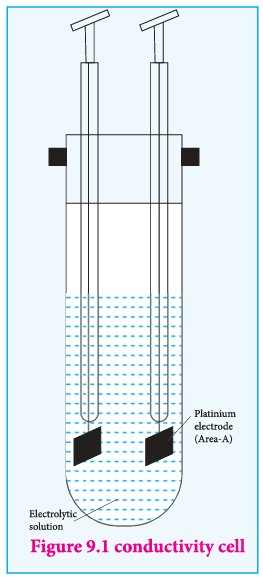

**Resistivity (ρ)**

Let us consider a conductivity cell in which the electrolytic solution is confined between the two electrodes having cross sectional area (A) and are separated by a distance 'l'. Like the metallic conductor, the resistance of such an electrolytic solution is also directly proportional to the length \( (l) \) and inversely proportional to the cross sectional area (A).

\[
R \propto \frac{l}{A}
\]

\[
R = \rho \frac{l}{A} \qquad \text{.....(9.2)}
\]

Where \( \rho \) (rho) is called the specific resistance or resistivity, which depends on the nature of the electrolyte.

If \( \frac{l}{A} = 1\ \mathrm{m}^{-1} \), then, \( \rho = R \). Hence the resistivity is defined as the resistance of an electrolyte confined between two electrodes having unit cross sectional area and are separated by a unit distance. The ratio \( \left(\frac{l}{A}\right) \) is called the cell constant, Unit of resistivity is ohm metre \( (\Omega\ \mathrm{m}) \).

#### Conductivity

It is more convenient to use conductance rather than resistance. The reciprocal of the resistance \( \left(\frac{1}{R}\right) \) gives the conductance of an electrolytic solution. The SI unit of conductance is Siemen (S).

\[
C = \frac{1}{R} \qquad \text{.....(9.3)}
\]

Substitute (R) from (9.2) in (9.3)

\[
\Rightarrow \text{i.e., } C = \frac{1}{\rho} . \frac{A}{l} \qquad \text{.....(9.4)}
\]

The reciprocal of the specific resistance \( \left(\frac{1}{\rho}\right) \) is called the specific conductance (or) conductivity. It is represented by the symbol kappa \( (\kappa) \)

Substitute \( \frac{1}{\rho} = \kappa \) in equation (9.4) and rearranging

\[
\Rightarrow \kappa = C \cdot \left(\frac{l}{A}\right) \qquad \text{.....(9.5)}
\]

> \[\text{Unit of } \kappa\]
>\[\kappa = \frac{1}{R} \cdot \frac{l}{A} \left(\frac{1}{\text{ohm}} \cdot \frac{\mathrm{m}}{\mathrm{m}^2}\right) = \mathrm{ohm}^{-1}\ \mathrm{m}^{-1} = \mathrm{mho}\ \mathrm{m}^{-1} \text{ (or) } \mathrm {S\ m}^{-1}\]

If \( A = 1\ \mathrm{m}^2 \) and \( l = 1\ \mathrm{m} \); then \( \kappa = C \).

The specific conductance is defined as the conductance of a cube of an electrolytic solution of unit dimensions (Fig 9.2). The SI unit of specific conductance is \( \mathrm{S\ m}^{-1} \).

**Example**

A conductivity cell has two platinum electrodes separated by a distance \( 1.5\ \mathrm{cm} \) and the cross sectional area of each electrode is \( 4.5\ \mathrm{sq\ cm} \). Using this cell, the resistance of \( 0.5\ \mathrm{N} \) electrolytic solution was measured as \( 15\ \Omega \). Find the specific conductance of the solution.

**Solution:**

\[
l = 1.5\ \mathrm{cm} = 1.5 \times 10^{-2}\ \mathrm{m}
\]

\[
A = 4.5\ \mathrm{cm}^2 = 4.5 \times 10^{-4}\ \mathrm{m}^2
\]
\[
R = 15\ \Omega
\]
\[
\kappa = \frac{1}{R} \cdot \frac{l}{A} = \frac{1}{15\ \Omega} \times \frac{1.5 \times 10^{-2}}{4.5 \times 10^{-4}} = 2.22\ \mathrm{S\ m}^{-1}
\]

#### 9.1.1 Molar conductivity \( (\Lambda_{\mathrm{m}}) \)

Solutions of different concentrations have different number of electrolytic ions in a given volume of solution and hence they have different specific conductance. Therefore a new quantity called molar conductance \( (\Lambda_{\mathrm{m}}) \) was introduced.

Let us imagine a conductivity cell in which the electrodes are separated by \( 1\ \mathrm{m} \) and having \( V\ \mathrm{m}^3 \) of electrolytic solution which contains 1 mole of electrolyte. The conductance of such a system is called the molar conductance \( (\Lambda_{\mathrm{m}}) \).

We have just learnt that the conductance of \( 1\ \mathrm{m}^3 \) electrolytic solution is called the specific conductance \( (\kappa) \). Therefore, the conductance of the above mentioned \( V\ \mathrm{m}^3 \) solution \( (\Lambda_{\mathrm{m}}) \) is given by the following expression.

\[
(\Lambda_{\mathrm{m}}) = \kappa \times V \qquad \text{.....(9.6)}
\]

We know that, molarity \( (M) = \frac{\text{Number of moles of solute } (n)}{\text{Volume of the solution } (V \text{ in } \mathrm{dm}^3)} \).

Therefore, Volume of the solution containing one mole of solute \( = \frac{1}{M} (\mathrm{mol}^{-1}\ \mathrm{L}) \)

\[
\therefore \text{Volume per } \mathrm{m}^3 (V) = \frac{10^{-3}}{M} (\mathrm{mol}^{-1}\ \mathrm{m}^3)
\]

Substitute (9.7) in (9.6)

\[
(9.6) \Rightarrow \Lambda_{\mathrm{m}} = \frac{\kappa (\mathrm{S\ m}^{-1}) \times 10^{-3}}{M} \mathrm{mol}^{-1}\ \mathrm{m}^3 \qquad \text{.....(9.8)}
\]

The above relation defines the molar conductance in terms of the specific conductance and the concentration of the electrolyte.

**Example**

Calculate the molar conductance of \( 0.025\ \mathrm{M} \) aqueous solution of calcium chloride at \( 25^{\circ}\mathrm{C} \). The specific conductance of calcium chloride is \( 12.04 \times 10^{-2}\ \mathrm{S\ m}^{-1} \).

\[
\text{Molar conductance} = \Lambda_{\mathrm{m}} = \frac{\kappa (\mathrm{S\ m}^{-1}) \times 10^{-3}}{M} \mathrm{mol}^{-1}\ \mathrm{m}^3
\]

\[
= \frac{(12.04 \times 10^{-2}\ \mathrm{S\ m}^{-1}) \times 10^{-3} (\mathrm{mol}^{-1}\ \mathrm{m}^3)}{0.025}
\]

\[
= 481.6 \times 10^{-5}\ \mathrm{S\ m}^2 \mathrm{mol}^{-1}
\]

>**Evaluate yourself : 1** 
>
>
>Calculate the molar conductance of $0.01\text{ M}$ aqueous $\text{KCl}$ solution at $25^\circ\text{C}$. The specific conductance of $\text{KCl}$ at $25^\circ\text{C}$ is $14.114 \times 10^{-2}\text{ S m}^{-1}$.
#### 9.1.2 Equivalent conductance \( (\Lambda) \)

Equivalent conductance is defined as the conductance of \( 'V'\ \mathrm{m}^3 \) of electrolytic solution containing one gram equivalent of electrolyte in a conductivity cell in which the electrodes are one metre apart.

The relation between the equivalent conductance and the specific conductance is given below.

\[
\Lambda = \frac{\kappa (\mathrm{S\ m}^{-1}) \times 10^{-3} (\text{gram equivalent})^{-1}\ \mathrm{m}^3}{N} \qquad \text{.....(9.9)}
\]

Where \( \kappa \) is the specific conductance and \( N \) is the concentration of the electrolytic solution expressed in normality.

>### Evaluate yourself : 2
>
>The resistance of 0.15N solution of an electrolyte is $50\ \Omega$. The specific conductance of the solution is $2.4\text{ Sm}^{-1}$. The resistance of 0.5 N solution of the same electrolyte measured using the same conductivity cell is $480\ \Omega$. Find the equivalent conductivity of 0.5 N solution of the electrolyte.
>
>Given that
>
 >$R_1 = 50\ \Omega$  $R_2 = 480\ \Omega$ 
 $\kappa_1 = 2.4\text{ Sm}^{-1}$  $\kappa_2 = ?$ 
 $N_1 = 0.15\text{ N}$  $N_2 = 0.5\text{ N}$ 
>
> 
>$$\Lambda = \frac{\kappa_2 \text{ (Sm}^{-1}\text{)} \times 10^{-3} \text{ (gram equivalent)}^{-1}\text{ m}^3}{N}$$
>
>
>$$= \frac{0.25 \times 10^{-3}\text{ S (gram equivalent)}^{-1}\text{ m}^2}{0.5}$$
>
>$$\Lambda = 5 \times 10^{-4}\text{ Sm}^2\text{ gram equivalent}^{-1}$$
>
>
>$$\text{we know that}$$
>
>$$\kappa = \frac{\text{Cell constant}}{R}$$
>
>$$\therefore \frac{\kappa_2}{\kappa_1} = \frac{R_1}{R_2}$$
>
>$$\kappa_2 = \kappa_1 \times \frac{R_1}{R_2}$$
>
>$$= 2.4\text{ Sm}^{-1} \times \frac{50\ \Omega}{480\ \Omega}$$
>
>$$= 0.25\text{ Sm}^{-1}$$

#### 9.1.3 Factors affecting electrolytic conductance

* If the interionic attraction between the oppositely charged ions of solutes increases, the conductance will decrease.
* Solvent of higher dielectric constant show high conductance in solution.
- Conductance is inversely proportional to the Viscosity of the medium. i.e., conductivity
increases with the decrease in viscosity.
- If the temperature of the electrolytic solution increases, conductance also increases. Increase
in temperature increases the kinetic energy of the ions and decreases the attractive force between the oppositely charged ions and hence conductivity increases.
- Molar conductance of a solution increases with increase in dilution. This is because, for a strong electrolyte, interionic forces of attraction decrease with dilution. For a weak electrolyte, degree of dissociation increases with dilution.

#### 9.1.4 Measurement of conductivity of ionic solutions

We have already learnt to measure the specific resistance of a metallic wire using a metre bridge in your physics practical experiment. We know that it works on the principle of wheatstone bridge. Similarly, the conductivity of an electrolytic solution is determined by using a wheatstone bridge arrangement in which one resistance is replaced by a conductivity cell filled with the electrolytic solution of unknown conductivity.

In the measurement of specific resistance of a metallic wire, a DC power supply is used. Here, if we apply DC current through the conductivity cell, it will lead to the electrolysis of the solution taken in the cell. So, AC current is used for this measurement to prevent electrolysis.

A wheatstone bridge is constituted using known resistances P, Q, a variable resistance S and conductivity cell (Let the resistance of the electrolytic solution taken in it be R) as shown in the figure 9.3. An AC source (550 Hz to 5 KHz) is connected between the junctions A and C. Connect a suitable detector E (Such as the telephone ear piece detector) between the junctions 'B' and 'D'.

The variable resistance 'S' is adjusted until the bridge is balanced and in this conditions there is no current flow through the detector.

Under balanced condition,

\[
\frac{P}{Q} = \frac{R}{S}
\]

\[
\therefore R = \frac{P}{Q} \times S
\qquad \text{.....(9.10)}
\]
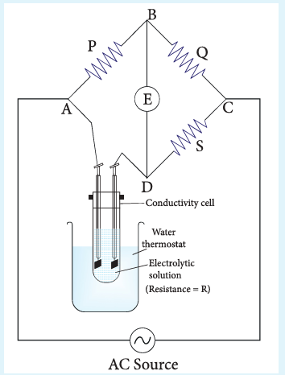

The resistance of the electrolytic solution (R) is calculated from the known resistance values P, Q and the measured 'S' value under balanced condition using the above expression (9.10).

**Conductivity calculation**

Specific conductance (or) conductivity of an electrolyte can be calculated from the resistance value using the following expression.

\[
\kappa = \frac{1}{R} \left(\frac{l}{A}\right) \quad \text{[equation 9.5]}
\]

The value of the cell constant \( \frac{l}{A} \) is usually provided by the cell manufacturer. Alternatively the cell constant may be determined using KCl solution whose concentration and specific conductance are known.

**Example**

The resistance of a conductivity cell is measured as \( 190\ \Omega \) using \( 0.1\ \mathrm{M} \) KCl solution (specific conductance of \( 0.1\ \mathrm{M} \) KCl is \( 1.3\ \mathrm{S\ m}^{-1} \)). When the same cell is filled with \( 0.003\ \mathrm{M} \) sodium chloride solution, the measured resistance is \( 6.3\ \mathrm{k}\Omega \). Both these measurements are made at a particular temperature. Calculate the specific and molar conductance of NaCl solution.

Given that

\[
\kappa = 1.3\ \mathrm{S\ m}^{-1} \text{ (for } 0.1\ \mathrm{M\ KCl\ solution)}
\]
$$R = 190\ \Omega$$
\[
\left(\frac{l}{A}\right) = \kappa \cdot R = (1.3\ \mathrm{S\ m}^{-1})(190\ \Omega) = 247\ \mathrm{m}^{-1}
\]

\[
\kappa_{\mathrm{(NaCl)}} = \frac{1}{R_{\mathrm{(NaCl)}}} \left(\frac{l}{A}\right) = \frac{1}{6.3\ \mathrm{k}\Omega} (247\ \mathrm{m}^{-1}) = 39.2 \times 10^{-3}\ \mathrm{S\ m}^{-1}
\]

\[
\Lambda_{\mathrm{m}} = \frac{\kappa \times 10^{-3}\ \mathrm{mol}^{-1}\ \mathrm{m}^3}{M} = \frac{39.2 \times 10^{-3}\ (\mathrm{S\ m}^{-1}) \times 10^{-3}\ (\mathrm{mol}^{-1}\ \mathrm{m}^3)}{0.003}
\]

\[
\Lambda_{\mathrm{m}} = 13.04 \times 10^{-3}\ \mathrm{S\ m}^2 \mathrm{mol}^{-1}
\]

### 9.2 Variation of molar conductivity with concentration

Friedrich Kohlrausch studied the molar conductance of different electrolytes at different concentrations. He observed that, increase of the molar conductance of an electrolytic solution with the increase in the dilution. One such experimental results is given in the following table for better understanding.

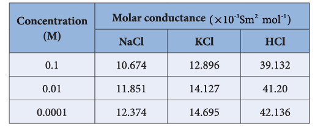
Based on the above such results, Kohlrausch deduced the following empirical relationship between the molar conductance \( (\Lambda_{\mathrm{m}}) \) and the concentration of the electrolyte (C).

\[
\Lambda_{\mathrm{m}} = \Lambda_{\mathrm{m}}^{^\circ} - k\sqrt{C} \qquad \text{.....(9.11)}
\]

The above equation represents a straight line of the form \( y = mx + c \). Hence, the plot of \( \Lambda_{\mathrm{m}} \) Vs \( \sqrt{C} \) gives a straight line with a negative slope of -k and the y intercept, \( \Lambda_{\mathrm{m}}^{*} \). Where \( \Lambda_{\mathrm{m}}^{*} \) is called the limiting molar conductivity. i.e., the molar conductance approaches a limiting value in very dilute solutions.

For strong electrolytes such as KCl, NaCl etc., the plot, \( \Lambda_{\mathrm{m}} \) Vs \( \sqrt{C} \), gives a straight line as shown in the graph (9.4). It is also observed that the plot is not a linear one for weak electrolytes.

For a strong electrolyte, at high concentration, the number of constituent ions of the electrolyte in a given volume is high and hence the attractive force between the oppositely charged ions is also high. Moreover the ions also experience a viscous drag due to greater solvation. These factors attribute for the low molar conductivity at high concentration. When the dilution increases, the ions are far apart and the attractive forces decrease.

At infinite dilution the ions are so far apart, the interaction between them becomes insignificant and hence, the molar conductivity increases and reaches a maximum value at infinite dilution.

For a weak electrolyte, at high concentration, the plot is almost parallel to concentration axis with slight increase in conductivity as the dilution increases. When the concentration approaches zero, there is a sudden increase in the molar conductance and the curve is almost parallel to \( \Lambda_{\mathrm{m}} \) axis. This is due to the fact that the dissociation of the weak electrolyte increases with the increase in dilution (Ostwald dilution law). \( \Lambda_{\mathrm{m}}^{0} \) values for strong electrolytes can be obtained by extrapolating the straight line, as shown in figure (9.4). But the same procedure is not applicable for weak electrolytes, as the plot is not a linear one, \( \Lambda_{\mathrm{m}}^{0} \) values of the weak electrolytes can be determined using Kohlrausch's law.

#### 9.2.1 Debye - Huckel and Onsager equation

We have learnt that at infinite dilution, the interaction between the ions in the electrolyte solution is negligible. Except this condition, electrostatic interaction between the ions alters the properties of the solution from those expected from the free-ions value. The influence of ion-ion interactions on the conductivity of strong electrolytes was studied by Debye and Huckel. They considered that each ion is surrounded by an ionic atmosphere of opposite sign, and derived an expression relating the molar conductance of strong electrolytes with the concentration by assuming complete dissociation. Later, the equation was further developed by Onsager. For a uni-univalent electrolyte the Debye Huckel and Onsager equation is given below.

\[
\Lambda_{\mathrm{m}} = \Lambda_{\mathrm{m}}^{0} - \left(A + B\Lambda_{\mathrm{m}}^{0}\right)\sqrt{C} \qquad \text{.....(9.12)}
\]

Where A and B are the constants which depend only on the nature of the solvent and temperature. The expression for A and B are

\[
A = \frac{82.4}{\sqrt{DT}\eta}; \quad B = \frac{8.20 \times 10^{5}}{\sqrt[3]{DT}}
\]

Here, D is the dielectric constant of the medium, \( \eta \) the viscosity of the medium and T the temperature in Kelvin.

#### 9.2.2 Kohlrausch's law

The limiting molar conductance \( \Lambda_{\mathrm{m}}^{0} \) is the basis for Kohlrausch law. At infinite dilution, the limiting molar conductivity of an electrolyte is equal to the sum of the limiting molar conductivities of its constituent ions. i.e., the molar conductivity is due to the independent migration of cations in one direction and anions in the opposite direction.

For a uni-univalent electrolyte such as NaCl, the Kohlrausch's law is expressed as

\[
(\Lambda_{\mathrm{m}}^{0})_{\mathrm{NaCl}} = (\lambda_{\mathrm{m}}^{0})_{\mathrm{Na}^{+}} + (\lambda_{\mathrm{m}}^{0})_{\mathrm{Cl}^{-}}
\]

In general, according to Kohlrausch's law, the molar conductivity at infinite dilution for a electrolyte represented by the formula \( \mathrm{A}_x \mathrm{B}_y \), is given below.

\[
(\Lambda_{\mathrm{m}}^{0})_{\mathrm{A_x B_y}} = x(\lambda_{\mathrm{m}}^{0})_{\mathrm{A}^{y+}} + y(\lambda_{\mathrm{m}}^{0})_{\mathrm{B}^{x-}} \qquad \text{.....(9.13)}
\]

Kohlrausch arrived at the above mentioned relationship based on the experimental observations such as the one as shown in the table. These result show that at infinite dilution each constituent ion of the electrolyte makes a definite contribution towards the molar conductance of the electrolyte irrespective of nature of other ion with which it is associated.

i.e.,

$$
\left( \Lambda_m^o \right)_{KCl} - \left( \Lambda_m^o \right)_{NaCl} = 149.86 - 126.45
$$

$$
\left\{ \left( \lambda_m^o \right)_{K^+} + \left( \lambda_m^o \right)_{Cl^-} \right\} - \left\{ \left( \lambda_m^o \right)_{Na^+} + \left( \lambda_m^o \right)_{Cl^-} \right\} = 23.41
$$

$$
\left( \lambda_m^o \right)_{K^+} - \left( \lambda_m^o \right)_{Na^+} = 23.41
$$

Similarly, we can conclude that

$$
\left( \lambda_m^o \right)_{Br^-} - \left( \lambda_m^o \right)_{Cl^-} = 2.06
$$

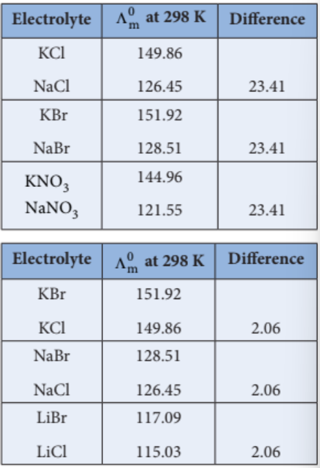

**Applications of Kohlrausch's Law** 

**1. Calculation of molar conductance at infinite dilution of a weak electrolyte**

It is impossible to determine the molar conductance at infinite dilution for weak electrolytes experimentally. However, the same can be calculated using Kohlrausch's Law.

For example, the molar conductance of \( \mathrm{CH}_3\mathrm{COOH} \), can be calculated using the experimentally determined molar conductivities of strong electrolytes HCl, NaCl and \( \mathrm{CH}_3\mathrm{COONa} \).

\[
\Lambda_{\mathrm{CH_3COONa}}^{\circ} = \lambda_{\mathrm{Na}^{+}}^{\circ} + \lambda_{\mathrm{CH_3COO}^{-}}^{\circ}(1)
\]

\[
\Lambda_{\mathrm{HCl}}^{\circ} = \lambda_{\mathrm{H}^{+}}^{\circ} + \lambda_{\mathrm{Cl}^{-}}^{\circ} (2)
\]

\[
\Lambda_{\mathrm{NaCl}}^{\circ} = \lambda_{\mathrm{Na}^{+}}^{\circ} + \lambda_{\mathrm{Cl}^{-}}^{\circ} (3)
\]

Equation (1) + Equation (2) - Equation (3) gives,

\[
(\Lambda_{\mathrm{CH_3COONa}}^{\circ}) + (\Lambda_{\mathrm{HCl}}^{\circ}) - (\Lambda_{\mathrm{NaCl}}^{\circ}) = \lambda_{\mathrm{H}^{+}}^{\circ} + \lambda_{\mathrm{CH_3COO}^{-}}^{\circ} = \Lambda_{\mathrm{CH_3COOH}}^{\circ}
\]

**2. Calculation of degree of dissociation of weak electrolytes**

The degree of dissociation of weak electrolyte can be calculated from the molar conductivity at a given concentration and the molar conductivity at infinite dilution using the following expression

\[
\alpha = \frac{\Lambda_{\mathrm{m}}}{\Lambda_{\mathrm{m}}^{\circ}} \qquad \text{....(9.14)}
\]

Calculation of dissociation constant using \( \Lambda_{\mathrm{m}} \) values. According to Ostwald dilution Law,

\[
K_a = \frac{\alpha^2 C}{(1 - \alpha)} \qquad \text{.....(9.15)}
\]

Substitute \( \alpha \) value in the above expression (9.15)

\[
K_a = \frac{\Lambda_{\mathrm{m}}^2 C}{\Lambda_{\mathrm{m}}^{\circ} (1 - \frac{\Lambda_{\mathrm{m}}}{\Lambda_{\mathrm{m}}^{\circ}})}
\]

\[
K_a = \frac{\Lambda_{\mathrm{m}}^2 C}{\Lambda_{\mathrm{m}}^{\circ}{^2} \frac{(\Lambda_{\mathrm{m}}^{\circ} - \Lambda_{\mathrm{m}})}{\Lambda_{\mathrm{m}}^{\circ}}}
\]

\[
K_a = \frac{\Lambda_{\mathrm{m}}^2 C}{\Lambda_{\mathrm{m}}^{\circ} (\Lambda_{\mathrm{m}}^{\circ} - \Lambda_{\mathrm{m}})}
\]

**3. Calculation of solubility of sparingly soluble salts**

Substances like AgCl, PbSO\(_4\) etc., are sparingly soluble in water. The solubility product of such substances can be determined using conductivity measurements.

Let us consider AgCl as an example

\[
\mathrm{AgCl(s)} \rightleftharpoons \mathrm{Ag}^{+} + \mathrm{Cl}^{-}
\]

\[
K_{\mathrm{sp}} = [\mathrm{Ag}^{+}][\mathrm{Cl}^{-}]
\]

Let the concentration of \( [\mathrm{Ag}^{+}] \) be \( 'C'\ \mathrm{mol\ L}^{-1} \).

As per the stoichiometry, if \( [\mathrm{Ag}^{+}] = C \), then \( [\mathrm{Cl}^{-}] \) also equal to \( 'C'\ \mathrm{mol\ L}^{-1} \).

\[
K_{\mathrm{sp}} = C \cdot C \Rightarrow K_{\mathrm{sp}} = C^2
\]

We know that the concentration (in mol \( \mathrm{dm}^{-3} \)) is related to the molar and specific conductance by the following expressions

\[
\Lambda^0 = \frac{\kappa \times 10^{-3}}{C\ (\text{in } \mathrm{mol\ L}^{-1})}
\]

\[
\text{(or)}
\]

\[
C = \frac{\kappa \times 10^{-3}}{\Lambda^0}
\]

Substitute the concentration value in the relation \( K_{\mathrm{sp}} = C^2 \)

\[
K_{\mathrm{sp}} = \left(\frac{\kappa \times 10^{-3}}{\Lambda^{\circ}}\right)^2 \qquad \text{(9.17)}
\]

### 9.3 Electrochemical Cell

Electrochemical cell is a device which converts chemical energy into electrical energy and vice versa. It consists of two separate electrodes which are in contact with an electrolyte solution. Electrochemical cells are mainly classified into the following two types.

1. **Galvanic Cell (Voltaic cell)** : It is a device in which a spontaneous chemical reaction generates an electric current i.e., it converts chemical energy into electrical energy. It is commonly known as a battery.
2. **Electrolytic cell** : It is a device in which an electric current from an external source drives a nonspontaneous reaction i.e., it converts electrical energy into chemical energy.

#### 9.3.1 Galvanic cell

We have already learnt in XI standard that when a zinc metal strip is placed in a copper sulphate solution, the blue colour of the solution fades and the copper is deposited on the zinc strip as red-brown crust due to the following spontaneous chemical reaction.

\[
\mathrm{Zn(s) + CuSO_4(aq) \rightarrow ZnSO_4(aq) + Cu(s)}
\]

The energy produced in the above reaction is lost to the surroundings as heat.

In the above redox reaction, Zinc is oxidised to \( \mathrm{Zn}^{2+} \) ions and the \( \mathrm{Cu}^{2+} \) ions are reduced to metallic copper. The half reactions are represented as below.

\[
\mathrm{Zn(s)} \rightarrow \mathrm{Zn}^{2+}(aq) + 2e^{-} \quad \text{(oxidation)}
\]

\[
\mathrm{Cu}^{2+}(aq) + 2e^{-} \rightarrow \mathrm{Cu}(s) \quad \text{(reduction)}
\]

If we perform the above two half reactions separately in an apparatus as shown in figure 9.5, some of the energy produced in the reaction will be converted into electrical energy. Let us understand the function of a galvanic cell by considering Daniel cell as an example. It uses the above reaction for generation of electrical energy.

The separation of half reaction is the basis for the construction of Daniel cell. It consists of two half cells.

**Oxidation half cell**: A metallic zinc strip that dips into an aqueous solution of zinc sulphate taken in a beaker, as shown in Figure 9.5.

**Reduction half cell**: A copper strip that dips into an aqueous solution of copper sulphate taken in a beaker, as shown in Figure 9.5.

**Joining the half cells**: The zinc and copper strips are externally connected using a wire through a switch (k) and a load (example: volt meter). The electrolytic solution present in the cathodic and anodic compartment are connected using an inverted U tube containing agar-agar gel mixed with an inert electrolytes such as KCl, \( \mathrm{Na_2SO_4} \) etc. The ions of inert electrolyte do not react with other ions present in the half cells and they are not either oxidised (or) reduced at the electrodes. The solution in the salt bridge cannot get poured out, but through which the ions can move into (or) out of the half cells.

When the switch (k) closes the circuit, the electrons flows from zinc strip to copper strip. This is due to the following redox reactions which are taking place at the respective electrodes.
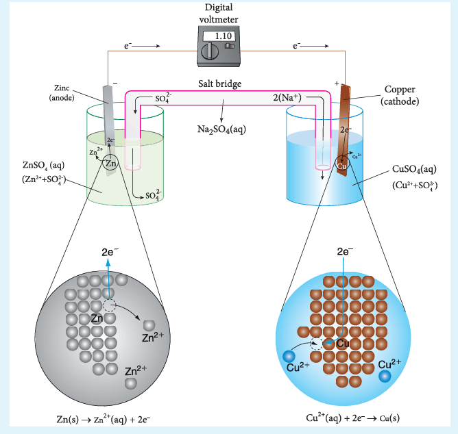

Figure 9.5 : Daniel cell

**Anodic oxidation**: The electrode at which the oxidation occurs is called the anode. In Daniel cell, the oxidation take place at zinc electrode, i.e., zinc is oxidised to \( \mathrm{Zn}^{2+} \) ions by losing its electrons. The \( \mathrm{Zn}^{2+} \) ions enter the solution and the electrons enter the zinc metal, then flow through the external wire and then enter the copper strip. Electrons are liberated at zinc electrode and hence it is negative (-ve).

\[
\mathrm{Zn(s)} \rightarrow \mathrm{Zn}^{2+}(aq) + 2e^{-} \quad \text{(loss of electron - oxidation)}
\]

**Cathodic reduction**: As discussed earlier, the electrons flow through the circuit from zinc to copper, where the \( \mathrm{Cu}^{2+} \) ions in the solution accept the electrons, get reduced to copper and the same get deposited on the electrode. Here, the electrons are consumed and hence it is positive (+ve).

\[
\mathrm{Cu}^{2+}(aq) + 2e^{-} \rightarrow \mathrm{Cu}(s) \quad \text{(gain of electron - reduction)}
\]

**Salt bridge**: The electrolytes present in two half cells are connected using a salt bridge. We have learnt that the anodic oxidation of zinc electrodes results in the increase in concentration of \( \mathrm{Zn}^{2+} \) in solution. i.e., the solution contains more number of \( \mathrm{Zn}^{2+} \) ions as compared to \( \mathrm{SO}_4^{2-} \) and hence the solution in the anodic compartment would become positively charged. Similarly, the solution in the cathodic compartment would become negatively charged as the \( \mathrm{Cu}^{2+} \) ions are reduced to copper i.e., the cathodic solution contain more number of \( \mathrm{SO}_4^{2-} \) ions compared to \( \mathrm{Cu}^{2+} \).

To maintain the electrical neutrality in both the compartments, the non reactive anions \( \mathrm{Cl}^{-} \) (from KCl taken in the salt bridge) move from the salt bridge and enter into the anodic compartment, at the same time some of the \( \mathrm{K}^{+} \) ions move from the salt bridge into the cathodic compartment.

**Completion of circuit**: Electrons flow from the negatively charged zinc anode into the positively charged copper cathode through the external wire, at the same time, anions move towards anode and cations move towards the cathode compartment. This completes the circuit.

**Consumption of Electrodes**: As the Daniel cell operates, the mass of zinc electrode gradually decreases while the mass of the copper electrode increases and hence the cell will function until the entire metallic zinc electrode is converted into \( \mathrm{Zn}^{2+} \) or the entire \( \mathrm{Cu}^{2+} \) ions are converted into metallic copper.

Unlike Daniel cell, in certain cases, the reactants (or) products cannot serve as electrodes and in such cases inert electrode such as graphite (or) platinum is used which conducts current in the external circuit.

#### 9.3.2 Galvanic cell notation

The galvanic cell is represented by a cell diagram, for example, Daniel cell is represented as

\[
\mathrm{Zn(s) | Zn^{2+}(aq) || Cu^{2+}(aq) | Cu(s)}
\]

In the above notation, a single vertical bar (|) represents a phase boundary and the double vertical bar (||) represents the salt bridge.

- The anode half cell is written on the left side of the salt bridge and the cathode half cell on the right side.
- The anode and cathode are written on the extreme left and extreme right, respectively.
- The emf of the cell is written on the right side after cell diagram.
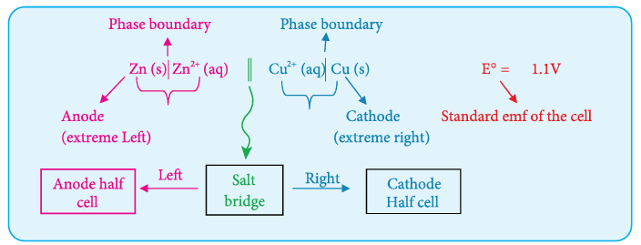
**Example**

The net redox reaction of a galvanic cell is given below

\[
2\mathrm{Cr(s)} + 3\mathrm{Cu}^{2+}(aq) \rightarrow 2\mathrm{Cr}^{3+}(aq) + 3\mathrm{Cu(s)}
\]

Write the half reactions and describe the cell using cell notation.

Anodic oxidation: \( 2\mathrm{Cr(s)} \rightarrow 2\mathrm{Cr}^{3+}(aq) + 6e^{-} \) ....(1)

Cathodic reduction: \( 3\mathrm{Cu}^{2+}(aq) + 6e^{-} \rightarrow 3\mathrm{Cu(s)} \) ....(2)

Cell Notation is

\[
\mathrm{Cr(s) | Cr^{3+}(aq) || Cu^{2+}(aq) | Cu(s)}
\]

#### 9.3.3 emf of a Cell

We have learnt that when two half cells of a Daniel cell are connected, a spontaneous redox reaction will take place which results in the flow of electrons from anode to cathode. The force that pushes the electrons away from the anode and pulls them towards cathode is called the electromotive force (emf) (or) the cell potential. The SI unit of cell potential is the volt (v).

When there is one volt difference in electrical potential between the anode and cathode, one joule of energy is released for each coulomb of charge that moves between them.

\[
1\ \mathrm{J} = 1\ \mathrm{C} \times 1\ \mathrm{V} \qquad \text{....(9.18)}
\]

The cell voltage depends on the nature of the electrodes, the concentration of the electrolytes and the temperature at which the cell is operated. For example

At \( 25^{\circ}\mathrm{C} \), The emf of the below mentioned Daniel cell is 1.107 Volts

\[
\mathrm{Zn(s) | Zn^{2+}(aq, 1M) || Cu^{2+}(aq, 1M) | Cu(s)} \qquad E^{0} = 1.107\ \mathrm{V}
\]

#### 9.3.4 Measurement of electrode potential

The overall redox reaction can be considered as the sum of two half reactions i.e., oxidation and reduction. Similarly, the emf of a cell can be considered as the sum of the electrode potentials at the cathode and anode,

\[
E_{\text{cell}} = (E_{\text{ox}})_{\text{anode}} + (E_{\text{red}})_{\text{cathode}} \qquad \text{(9.19)}
\]

Here, \( (E_{\text{ox}})_{\text{anode}} \) represents the oxidation potential at anode and \( (E_{\text{red}})_{\text{cathode}} \) represents the reduction potential at cathode. It is impossible to measure the emf of a single electrode, but we can measure the potential difference between the two electrodes \( (E_{\text{cell}}) \) using a voltmeter. If we know the emf of any one of the electrodes which constitute the cell, we can calculate the emf of the other electrode from the measured emf of the cell using the expression (9.19). Hence, we need a reference electrode whose emf is known.

For that purpose, **Standard Hydrogen Electrode (SHE)** is used as the reference electrode. It has been assigned an arbitrary emf of exactly zero volt. It consists of a platinum electrode in contact with 1M HCl solution and 1 atm hydrogen gas. The hydrogen gas is bubbled through the solution at \( 25^{\circ}\mathrm{C} \) as shown in the figure 9.6. SHE can act as a cathode as well as an anode. The Half cell reactions are given below.

If SHE is used as a cathode, the reduction reaction is

\[
2\mathrm{H}^{+}(aq, 1\mathrm{M}) + 2e^{-} \rightarrow \mathrm{H}_2(g, 1\ \mathrm{atm}) \qquad E^{\circ} = 0\ \text{volt}
\]

If SHE is used as an anode, the oxidation reaction is

\[
\mathrm{H}_2(g, 1\ \mathrm{atm}) \rightarrow 2\mathrm{H}^{+}(aq, 1\mathrm{M}) + 2e^{-} \qquad E^{\circ} = 0\ \text{volt}
\]
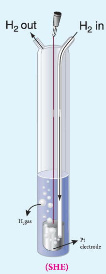

Figure 9.6 Standard Hydrogen electrode

**Illustration**

Let us calculate the reduction potential of zinc electrode dipped in zinc sulphate solution using SHE.

Step 1: The following galvanic cell is constructed using SHE

\[
\mathrm{Zn(s) | Zn^{2+}(aq, 1M) || H^{+}(aq, 1M) | H_2(g, 1\ \text{atm}) | Pt(s)}
\]

Step 2: The emf of the above galvanic cell is measured using a volt meter. In this case, the measured emf of the above galvanic cell is 0.76V.

**Calculation**

We know that,

\[
E_{\text{cell}}^{\circ} = (E_{\text{ox}}^{\circ})_{\mathrm{Zn|Zn^{2+}}} + (E_{\text{red}}^{\circ})_{\mathrm{SHE}}
\]

\( E_{\text{cell}}^{\circ} = 0.76 \) and \( (E_{\text{red}}^{\circ})_{\mathrm{SHE}} = 0\ \mathrm{V} \).

\[
\Rightarrow 0.76\ \mathrm{V} = (E_{\text{ox}}^{\circ})_{\mathrm{Zn|Zn^{2+}}} + 0\ \mathrm{V}
\]

\[
\Rightarrow (E_{\text{ox}}^{\circ})_{\mathrm{Zn|Zn^{2+}}} = 0.76\ \mathrm{V}
\]

This oxidation potential corresponds to the below mentioned half cell reaction which takes place at the cathode.

\[
\mathrm{Zn} \rightarrow \mathrm{Zn}^{2+} + 2e^{-} \quad \text{(Oxidation)}
\]

The emf for the reverse reaction will give the reduction potential

\[
\mathrm{Zn}^{2+} + 2e^{-} \rightarrow \mathrm{Zn} \quad E^{\circ} = -0.76\ \mathrm{V}
\]
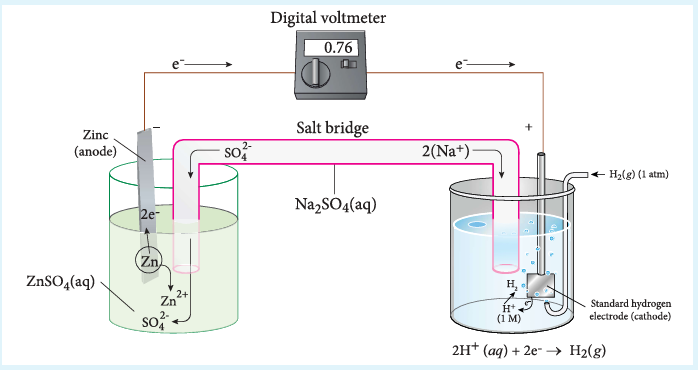

Figure 9.7 emf measurement (Zn | Zn\(^{2+}\) electrode)

**IUPAC definition**

**Electrode potential (E)** : Electromotive force of a cell in which the electrode on the left is a standard hydrogen electrode and the electrode on the right is the electrode in question.

**Standard electrode potential, E°** : The value of the standard emf of a cell in which molecular hydrogen under standard pressure is oxidised to solvated protons at the left hand electrode.

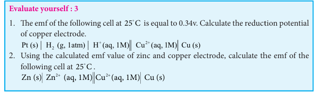

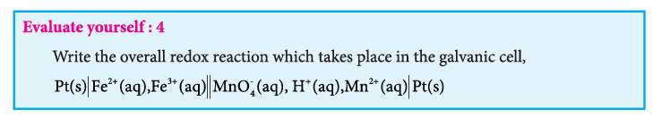

### 9.4 Thermodynamics of cell reactions

We have just learnt that in a galvanic cell, the chemical energy is converted into electrical energy. The electrical energy produced by the cell is equal to the product of the total charge of electrons and the emf of the cell which drives these electrons between the electrodes.

If 'n' is the number of moles of electrons exchanged between the oxidising and reducing agent in the overall cell reaction, then the electrical energy produced by the cell is given as below.

Electrical energy = Charge of 'n' mole of electrons \( \times E_{\text{cell}} \) ....(9.20)

Charge of 1 mole of electrons = one Faraday (1F)

Charge of 'n' mole of electrons = nF

Equation (9.20) \( \Rightarrow \) Electrical energy = nFE\(_{\text{cell}}\) ....(9.21)

Charge of one electron \( = 1.602 \times 10^{-19}\ \mathrm{C} \)

Charge one mole of electron \( = 6.023 \times 10^{23} \times 1.602 \times 10^{-19}\ \mathrm{C} = 96488\ \mathrm{C} \)

i.e., 1F \( = 96500\ \mathrm{C} \)

This energy is used to do the electric work. Therefore the maximum work that can be obtained from a galvanic cell is

\[
(W_{\text{max}})_{\text{cell}} = -nFE_{\text{cell}} \qquad \text{(9.22)}
\]

Here the (-) sign is introduced to indicate that the work is done by the system on the surroundings.

We know from the Second Law of thermodynamics that the maximum work done by the system is equal to the change in the Gibbs free energy of the system.

\[
\text{i.e., } W_{\text{max}} = \Delta G \qquad \text{(9.23)}
\]

From (9.22) and (9.23),

\[
\Delta G = -nFE_{\text{cell}} \qquad \text{(9.24)}
\]

For a spontaneous cell reaction, the \( \Delta G \) should be negative. The above expression (9.24) indicates that \( E_{\text{cell}} \) should be positive to get a negative \( \Delta G \) value.

When all the cell components are in their standard state, the equation (9.24) becomes

\[
\Delta G^{\circ} = -nFE_{\text{cell}}^{\circ} \qquad \text{(9.25)}
\]

We know that the standard free energy change is related to the equilibrium constant as per the following expression.

\[
\Delta G^{\circ} = -RT \ln K_{\text{eq}} \qquad \text{(9.26)}
\]

Comparing (9.25) and (9.26),

\[
nFE_{\text{cell}}^{\circ} = RT \ln K_{\text{eq}}
\]

\[
\Rightarrow E_{\text{cell}}^{\circ} = \frac{2.303 RT}{nF} \log K_{\text{eq}} \qquad \text{(9.27)}
\]

#### 9.4.1 Nernst equation

Nernst equation is the one which relates the cell potential and the concentration of the species involved in an electrochemical reaction. Let us consider an electrochemical cell for which the overall redox reaction is,

\[
x\mathrm{A} + y\mathrm{B} \rightleftharpoons l\mathrm{C} + m\mathrm{D}
\]

The reaction quotient Q for the above reaction is given below

\[
Q = \frac{[\mathrm{C}]^l [\mathrm{D}]^m}{[\mathrm{A}]^x [\mathrm{B}]^y} \qquad \text{(9.28)}
\]

We have already learnt that,

\[
\Delta G = \Delta G^{\circ} + RT \ln Q \qquad \text{(9.29)}
\]

The Gibbs free energy can be related to the cell emf as follows

[equation (9.24) and (9.25)]

\[
\Delta G = -nFE_{\text{cell}}; \quad \Delta G^{\circ} = -nFE_{\text{cell}}^{\circ}
\]

Substitute these values and Q from (9.28) in the equation (9.29)

\[
(9.29) \Rightarrow -nFE_{\text{cell}} = -nFE_{\text{cell}}^{\circ} + RT \ln \frac{[\mathrm{C}]^l [\mathrm{D}]^m}{[\mathrm{A}]^x [\mathrm{B}]^y} \qquad \text{(9.30)}
\]

Divide the whole equation (9.30) by (-nF)

(9.25) =>\[E_{\text{cell}} = E_{\text{cell}}^{\circ} - \frac{RT}{nF} \ln \frac{[\mathrm{C}]^l [\mathrm{D}]^m}{[\mathrm{A}]^x [\mathrm{B}]^y}\]

(or)

\[
E_{\text{cell}} = E_{\text{cell}}^{\circ} - \frac{2.303 RT}{nF} \log \frac{[\mathrm{C}]^l [\mathrm{D}]^m}{[\mathrm{A}]^x [\mathrm{B}]^y} \qquad \text{(9.31)}
\]

The above equation (9.31) is called the **Nernst equation**.

At \( 25^{\circ}\mathrm{C} \) (298K), the above equation (9.31) becomes,

\[
E_{\text{cell}} = E_{\text{cell}}^{\circ} - \frac{2.303 \times 8.314 \times 298}{n \times 96500} \log \frac{[\mathrm{C}]^l [\mathrm{D}]^m}{[\mathrm{A}]^x [\mathrm{B}]^y}
\]

\[
E_{\text{cell}} = E_{\text{cell}}^{\circ} - \frac{0.0591}{n} \log \frac{[\mathrm{C}]^l [\mathrm{D}]^m}{[\mathrm{A}]^x [\mathrm{B}]^y} \qquad \text{(9.32)}
\]

(Since \( R = 8.314\ \mathrm{J\ K^{-1}\ mol^{-1}} \), \( T = 298\ \mathrm{K} \), \( 1F = 96500\ \mathrm{C\ mol^{-1}} \))

Let us calculate the emf of the following cell at \( 25^{\circ}\mathrm{C} \) using Nernst equation.

\[
\mathrm{Cu(s) | Cu^{2+}(0.25\ \mathrm{aq},\ M) || Fe^{3+}(0.005\ \mathrm{aq},\ M), Fe^{2+}(0.1\ \mathrm{aq},\ M) | Pt(s)}
\]

Given: \( (E^{\circ})_{\mathrm{Fe^{3+}|Fe^{2+}}} = 0.77\ \mathrm{V} \) and \( (E^{\circ})_{\mathrm{Cu^{2+}|Cu}} = 0.34\ \mathrm{V} \)

Half reactions are

\[
\mathrm{Cu(s)} \rightarrow \mathrm{Cu}^{2+}(aq) + 2e^{-}
\]

\[
2\mathrm{Fe}^{3+}(aq) + 2e^{-} \rightarrow 2\mathrm{Fe}^{2+}(aq)
\]

The overall reaction is

\[
\mathrm{Cu(s)} + 2\mathrm{Fe}^{3+}(aq) \rightarrow \mathrm{Cu}^{2+}(aq) + 2\mathrm{Fe}^{2+}(aq), \text{ and } n = 2
\]

Apply Nernst equation at \( 25^{\circ}\mathrm{C} \)

\[
E_{\text{cell}} = E_{\text{cell}}^{\circ} - \frac{0.0591}{2} \log \frac{[\mathrm{Cu}^{2+}][\mathrm{Fe}^{2+}]^2}{[\mathrm{Fe}^{3+}]^2} \quad ( [\mathrm{Cu(s)}] = 1)
\]

\[
E_{\text{cell}}^{\circ} = (E_{\text{ox}}^{\circ})_{\mathrm{Cu|Cu^{2+}}} + (E_{\text{red}}^{\circ})_{\mathrm{Fe^{3+}|Fe^{2+}}}
\]

Given standard reduction potential of \( \mathrm{Cu^{2+}|Cu} \) is \( 0.34\ \mathrm{V} \)

\[
\therefore (E_{\text{ox}}^{\circ})_{\mathrm{Cu|Cu^{2+}}} = -0.34\ \mathrm{V}
\]

\[
(E_{\text{red}}^{\circ})_{\mathrm{Fe^{3+}|Fe^{2+}}} = 0.77\ \mathrm{V}
\]

\[
\therefore E_{\text{cell}}^{\circ} = -0.34 + 0.77 = 0.43\ \mathrm{V}
\]

\[
\therefore E_{\text{cell}} = 0.43 - \frac{0.0591}{2} \times \log \frac{(0.25)(0.1)^2}{(0.005)^2}
\]

\[
\log \frac{(0.25)(0.1)^2}{(0.005)^2} = \log \frac{25 \times 10^{-2} \times 1 \times 10^{-2}}{25 \times 10^{-6}} = \log 10^2 = 2
\]

\[
E_{\text{cell}} = 0.43 - 0.02955 \times 2 = 0.43 - 0.0591 = 0.3709\ \mathrm{V}
\]

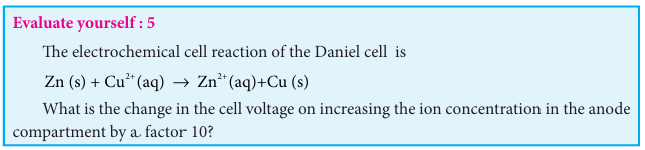

### Electrolytic cell and electrolysis

Electrolysis is a process in which the electrical energy is used to cause a non-spontaneous chemical reaction to occur; the energy is often used to decompose a compound into its elements. The device which is used to carry out the electrolysis is called the electrolytic cell. The electrochemical process occurring in the electrolytic cell and galvanic cell are the reverse of each other. Let us understand the function of an electrolytic cell by considering the electrolysis of molten sodium chloride.

The electrolytic cell consists of two electrodes: one is cylindrical steel cathode and another one is graphite anode. They are dipped in molten sodium chloride. They are connected to the external DC power supply via a key as shown in the figure (9.8). The electrode which is attached to the negative end of the power supply is called the cathode, and the one which is attached to the positive end is called the anode. Once the key is closed, the external DC power supply drives the electrons to the cathode and at the same time pulls the electrons from the anode.
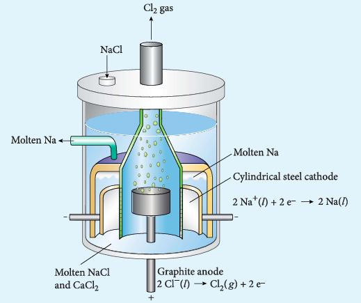

Figure 9.8 Electrolysis of molten NaCl

**Cell reactions**

\( \mathrm{Na}^{+} \) ions are attracted towards cathode, where they combine with the electrons and reduced to liquid sodium.

Cathode (reduction)

\[
\mathrm{Na}^{+}(l) + e^{-} \rightarrow \mathrm{Na}(l) \qquad E^{\circ} = -2.71\ \mathrm{V}
\]

Similarly, \( \mathrm{Cl}^{-} \) ions are attracted towards anode where they lose their electrons and oxidised to chlorine gas.

Anode (oxidation)

\[
2\mathrm{Cl}^{-}(l) \rightarrow \mathrm{Cl}_2(g) + 2e^{-} \qquad E^{\circ} = -1.36\ \mathrm{V}
\]

The overall reaction is

\[
2\mathrm{Na}^{+}(l) + 2\mathrm{Cl}^{-}(l) \rightarrow 2\mathrm{Na}(l) + \mathrm{Cl}_2(g)
\]

\[
E^{\circ} = -4.07\ \mathrm{V}
\]

The negative \( E^{\circ} \) value shows that the above reaction is a non spontaneous one. Hence, we have to supply a voltage greater than \( 4.07\ \mathrm{V} \) to cause the electrolysis of molten NaCl.

In electrolytic cell, oxidation occurs at the anode and reduction occur at the cathode as in a galvanic cell, but the sign of the electrodes is the reverse i.e., in the electrolytic cell cathode is -ve and anode is +ve.

### Faraday's Laws of electrolysis

#### First Law

The mass of the substance (m) liberated at an electrode during electrolysis is directly proportional to the quantity of charge (Q) passed through the cell.

i.e., \( m \propto Q \)

We know that the charge is related to the current by the equation \( I = \frac{Q}{t} \Rightarrow Q = It \)

\( m \propto It \)

(or)

\[
m = ZIt \qquad \text{(9.33)}
\]

Where Z is known as the electrochemical equivalent of the substance produced at the electrode.

When \( I = 1\ \mathrm{A} \) and \( t = 1\ \mathrm{s} \), \( Q = 1\ \mathrm{C} \), in such case the equation (9.33) becomes,

\[
\Rightarrow m = Z \qquad \text{(9.34)}
\]

Thus, the electrochemical equivalent is defined as the amount of substance deposited or liberated at the electrode by a charge of 1 coulomb.

#### Electrochemical equivalent and molar mass

Consider the following general electrochemical redox reaction

\[
\mathrm{M}^{n+}(aq) + ne^{-} \rightarrow \mathrm{M}(s)
\]

We can infer from the above equation that 'n' moles of electrons are required to precipitate 1 mole of \( \mathrm{M}^{n+} \) as \( \mathrm{M}(s) \)

The quantity of charge required to precipitate one mole of \( \mathrm{M}^{n+} \) = Charge of 'n' moles of electrons = \( nF \)

In other words, the mass of substance deposited by one coulomb of charge

Electrochemical equivalent of \( \mathrm{M}^{n+} = \frac{\text{Molar mass of M}}{n (96500)} \)

(or)

\[
Z = \frac{\text{Equivalent mass}}{96500} \qquad \text{(9.35)}
\]

#### Second Law

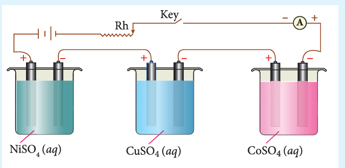

Figure 9.9 Electrolysis of various electrolytes using same quantity of charge

When the same quantity of charge is passed through the solutions of different electrolytes, the amount of substances liberated at the respective electrodes are directly proportional to their electrochemical equivalents.

Let us consider three electrolytic cells connected in series to the same DC electrical source as shown in the figure 9.9. Each cell is filled with a different electrolytes namely \( \mathrm{NiSO_4} \), \( \mathrm{CuSO_4} \) and \( \mathrm{CoSO_4} \), respectively.

When Q coulomb charge is passed through the electrolytic cells the masses of Nickel, copper and cobalt deposited at the respective electrodes be \( m_{\mathrm{Ni}} \), \( m_{\mathrm{Cu}} \) and \( m_{\mathrm{Co}} \), respectively.

According to Faraday's second Law,

\[
m_{\mathrm{Ni}} \propto Z_{\mathrm{Ni}}, \quad m_{\mathrm{Cu}} \propto Z_{\mathrm{Cu}}, \quad m_{\mathrm{Co}} \propto Z_{\mathrm{Co}}
\]

\[
\text{(or)}
\]

\[
\frac{m_{\mathrm{Ni}}}{Z_{\mathrm{Ni}}} = \frac{m_{\mathrm{Cu}}}{Z_{\mathrm{Cu}}} = \frac{m_{\mathrm{Co}}}{Z_{\mathrm{Co}}} \qquad \text{(9.36)}
\]

# Example

A solution of silver nitrate is electrolysed for 20 minutes with a current of 2 amperes. Calculate the mass of silver deposited at the cathode.  

Electrochemical reaction at cathode is  
\[
\text{Ag}^+ + \text{e}^- \rightarrow \text{Ag} \, (\text{reduction})
\]  

\[
m = Z \, \text{It}
\]  

\[
m = \frac{108 \, \text{gmol}^{-1}}{96500 \, \text{C mol}^{-1}} \times 2400 \, \text{C}
\]  

\[
m = 2.68 \, \text{g}.
\]  

\[
Z = \frac{\text{molar mass of } \text{Ag}}{(96500)} = \frac{108}{1 \times 96500}
\]  

\[
I = 2 \, \text{A}
\]  

\[
t = 20 \times 60 \, \text{S} = 1200 \, \text{S}
\]  

\[
I = 2 \, \text{A} \times 1200 \, \text{S} = 2400 \, \text{C}
\]

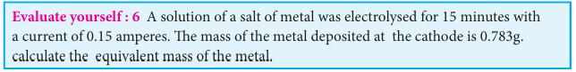

### Batteries

Batteries are indispensable in the modern electronic world. For example, Li-ion batteries are used in cell phones, dry cell in flashlight etc. These batteries are used as a source of direct current at a constant voltage. We can classify them into primary batteries (non-rechargeable) and secondary batteries (rechargeable). In this section, we will briefly discuss the electrochemistry of some batteries.

#### Leclanche cell

- **Anode**: Zinc container
- **Cathode**: Graphite rod in contact with \( \mathrm{MnO_2} \)
- **Electrolyte**: ammonium chloride and zinc chloride in water

Emf of the cell is about 1.5V

Cell reaction

Oxidation at anode

\[
\mathrm{Zn(s)} \rightarrow \mathrm{Zn^{2+}(aq) + 2e^{-}} \qquad (1)
\]

Reduction at cathode

\[
2\mathrm{NH_4^+(aq) + 2e^-} \rightarrow 2\mathrm{NH_3(aq) + H_2(g)} \qquad (2)
\]

The hydrogen gas is oxidised to water by \( \mathrm{MnO_2} \)

\[
\mathrm{H_2(g) + 2MnO_2(s)} \rightarrow \mathrm{Mn_2O_3(s) + H_2O(l)} \qquad (3)
\]

Equation \( (1) + (2) + (3) \) gives the overall redox reaction

\[
\mathrm{Zn(s) + 2NH_4^+(aq) + 2MnO_2(s)} \rightarrow \mathrm{Zn^{2+}(aq) + Mn_2O_3(s) + H_2O(l) + 2NH_3}(4)
\]

Ammonia produced at the cathode combines with \( \mathrm{Zn}^{2+} \) to form a complex ion \( [\mathrm{Zn(NH_3)_4}]^{2+}(aq) \). As the reaction proceeds, the concentration of \( \mathrm{NH_4}^{+} \) will decrease and the aqueous \( \mathrm{NH_3} \) will increase which leads to the decrease in the emf of cell.
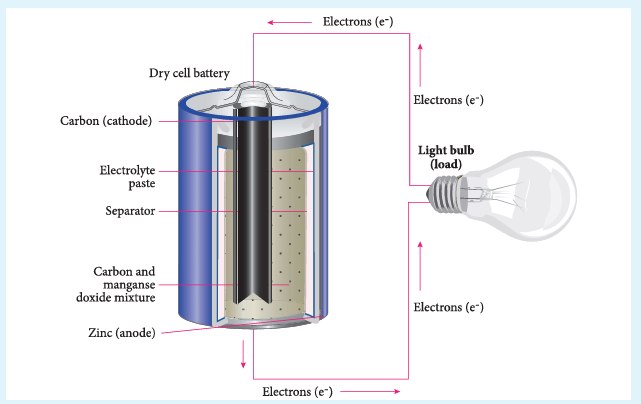

Figure 9.10 Leclanche cell

#### Mercury button cell

- **Anode**: zinc amalgamated with mercury
- **Cathode**: HgO mixed with graphite
- **Electrolyte**: Paste of KOH and ZnO

Oxidation occurs at anode: \( \mathrm{Zn(s) + 2OH^{-}(aq)} \rightarrow \mathrm{ZnO(s) + H_2O(l) + 2e^{-}} \)

Reduction occurs at cathode: \( \mathrm{HgO(s) + H_2O(l) + 2e^{-}} \rightarrow \mathrm{Hg(l) + 2OH^{-}(aq)} \)

Overall reaction: \( \mathrm{Zn(s) + HgO(s)} \rightarrow \mathrm{ZnO(s) + Hg(l)} \)

Cell emf: about 1.35V.

Uses: It has higher capacity and longer life. Used in pacemakers, electronic watches, cameras etc.
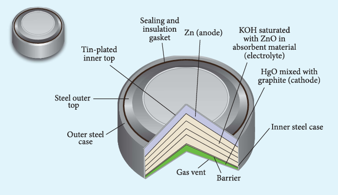

Figure 9.11 Mercury button cell

#### Secondary batteries

We have already learnt that the electrochemical reactions which take place in a galvanic cell may be reversed by applying a potential slightly greater than the emf generated by the cell. This principle is used in secondary batteries to regenerate the original reactants. Let us understand the function of secondary cell by considering the lead storage battery as an example.

##### Lead storage battery

- **Anode**: spongy lead
- **Cathode**: lead plate bearing \( \mathrm{PbO_2} \)
- **Electrolyte**: \( 38\% \) by mass of \( \mathrm{H_2SO_4} \) with density \( 1.2\ \mathrm{g/mL} \)

Oxidation occurs at the anode

\[
\mathrm{Pb(s)} \rightarrow \mathrm{Pb^{2+}(aq) + 2e^{-}} \qquad (1)
\]

The \( \mathrm{Pb}^{2+} \) ions combine with \( \mathrm{SO_4}^{2-} \) to form \( \mathrm{PbSO_4} \) precipitate.

\[
\mathrm{Pb^{2+}(aq) + SO_4^{2-}(aq)} \rightarrow \mathrm{PbSO_4(s)} \qquad (2)
\]

Reduction occurs at the cathode

\[
\mathrm{PbO_2(s) + 4H^{+}(aq) + 2e^{-}} \rightarrow \mathrm{Pb^{2+}(aq) + 2H_2O(l)} \qquad (3)
\]

The \( \mathrm{Pb}^{2+} \) ions also combine with \( \mathrm{SO_4}^{2-} \) ions from sulphuric acid to form \( \mathrm{PbSO_4} \) precipitate.

\[
\mathrm{Pb^{2+}(aq) + SO_4^{2-}(aq)} \rightarrow \mathrm{PbSO_4(s)} \qquad (4)
\]

The Overall reaction is

Equation \( (1) + (2) + (3) + (4) \)

\[
\mathrm{Pb(s) + PbO_2(s) + 4H^{+}(aq) + 2SO_4^{2-}(aq)} \rightarrow 2\mathrm{PbSO_4(s) + 2H_2O(l)}
\]

The emf of a single cell is about \( 2\ \mathrm{V} \). Usually six such cells are combined in series to produce 12 volt.

The emf of the cell depends on the concentration of \( \mathrm{H_2SO_4} \). As the cell reaction uses \( \mathrm{SO_4}^{2-} \) ions, the concentration of \( \mathrm{H_2SO_4} \) decreases. When the cell potential falls to about 1.8V, the cell has to be recharged.

**Recharge of the cell**

As said earlier, a potential greater than \( 2\ \mathrm{V} \) is applied across the electrodes, the cell reactions that take place during the discharge process are reversed. During recharge process, the role of anode and cathode is reversed and \( \mathrm{H_2SO_4} \) is regenerated.

Oxidation occurs at the cathode (now acts as anode)

\[
\mathrm{PbSO_4(s) + 2H_2O(l)} \rightarrow \mathrm{PbO_2(s) + 4H^{+}(aq) + SO_4^{2-}(aq) + 2e^{-}}
\]

Reduction occurs at the anode (now acts as cathode)

\[
\mathrm{PbSO_4(s) + 2e^{-}} \rightarrow \mathrm{Pb(s) + SO_4^{2-}(aq)}
\]

Overall reaction

\[
2\mathrm{PbSO_4(s) + 2H_2O(l)} \rightarrow \mathrm{Pb(s) + PbO_2(s) + 4H^{+}(aq) + 2SO_4^{2-}(aq)}
\]

Thus, the overall cell reaction is exactly the reverse of the redox reaction which takes place while discharging.

**Uses:** Used in automobiles, trains, inverters etc.

#### The lithium-ion Battery

- **Anode**: Porous graphite
- **Cathode**: transition metal oxide such as \( \mathrm{CoO_2} \)
- **Electrolyte**: Lithium salt in an organic solvent

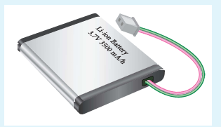

Figure 9.12 lithium-ion Battery

At the anode oxidation occurs

$$
\text{Li (s)} \rightarrow \text{Li}^+ \text{ (aq)} + \text{e}^-
$$

At the cathode reduction occurs

$$
\text{Li}^+ + \text{CoO}_2 \text{ (s)} + \text{e}^- \rightarrow \text{LiCoO}_2 \text{ (s)}
$$

Overall reactions

$$
\text{Li (s)} + \text{CoO}_2 \rightarrow \text{LiCoO}_2 \text{ (s)}
$$

Both electrodes allow \( \text{Li}^+ \) ions to move in and out of their structures.

During discharge, the \( \text{Li}^+ \) ions produced at the anode move towards cathode through the non – aqueous electrolyte. When a potential greater than the emf produced by the cell is applied across the electrode, the cell reaction is reversed and now the \( \text{Li}^+ \) ions move from cathode to anode where they become embedded on the porous graphite electrode. This is known as intercalation.

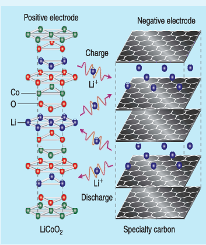

**Uses:**

Used in cellular phones, laptops, computers, digital cameras, etc…

**Fuel cell**

The galvanic cell in which the energy of combustion of fuels is directly converted into electrical energy is called the fuel cell. It requires a continuous supply of reactant to keep functioning. The general representation of a fuel cell is follows

Fuel | Electrode | Electrolyte | Electrode | Oxidant

Let us understand the function of fuel cell by

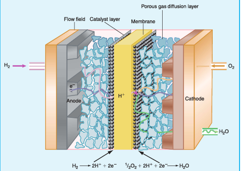

Figure 9.14 H_2O_2 fuel cell

 considering hydrogen - oxygen fuel cell. In this case, hydrogen acts as a fuel and oxygen as an oxidant and the electrolyte is aqueous KOH maintained at \( 200^{\circ}\mathrm{C} \) and \( 20-40\ \mathrm{atm} \). Porous graphite electrode containing Ni and NiO serves as the inert electrodes.

Hydrogen and oxygen gases are bubbled through the anode and cathode, respectively.

Oxidation occurs at the anode:

\[
2\mathrm{H_2(g) + 4OH^{-}(aq)} \rightarrow 4\mathrm{H_2O(l) + 4e^{-}}
\]

Reduction occurs at the cathode:

\[
\mathrm{O_2(g) + 2H_2O(l) + 4e^{-}} \rightarrow 4\mathrm{OH^{-}(aq)}
\]

The overall reaction is

\[
2\mathrm{H_2(g) + O_2(g)} \rightarrow 2\mathrm{H_2O(l)}
\]

The above reaction is the same as the hydrogen combustion reaction, however, they do not react directly i.e., the oxidation and reduction reactions take place separately at the anode and cathode respectively. Like \( \mathrm{H_2-O_2} \) fuel cell, other fuel cells like propane-\( \mathrm{O_2} \) and methane-\( \mathrm{O_2} \) have also been developed.

### Corrosion

We are familiar with the rusting of iron. Have you ever noticed a green film formed on copper and brass vessels? In both, the metal is oxidised by oxygen in presence of moisture. This redox process which causes the deterioration of metal is called corrosion. As the corrosion of iron causes damages to our buildings, bridges etc., it is important to know the chemistry of rusting and how to prevent it. Rusting of iron is an electrochemical process.

#### Electrochemical mechanism of corrosion

The formation of rust requires both oxygen and water. Since it is an electrochemical redox process, it requires an anode and cathode in different places on the surface of iron. The iron surface and a droplet of water on the surface as shown in figure (9.15) form a tiny galvanic cell. The region enclosed by water is exposed to low amount of oxygen and it acts as the anode. The remaining area has high amount of oxygen and it acts as cathode. So based on the oxygen content, an electrochemical cell is formed. Corrosion occurs at the anode i.e., in the region enclosed by the water as discussed below.
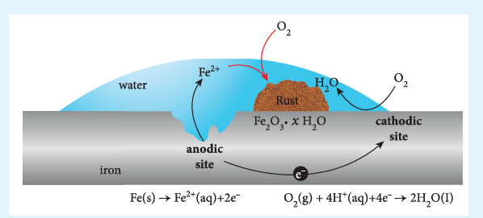

Figure 9.15 Rusting of iron

**At anode (oxidation): Iron dissolves in the anode region**

\[
2\mathrm{Fe(s)} \rightarrow 2\mathrm{Fe^{2+}(aq) + 4e^{-}} \qquad E^{\circ} = 0.44\ \mathrm{V}
\]

The electrons move through the iron metal from the anode to the cathode area where the oxygen dissolved in water, is reduced to water.

**At Cathode (reduction)**

The reaction of atmospheric carbon dioxide with water gives carbonic acid which furnishes the \( \mathrm{H}^{+} \) ions for reduction.

\[
\mathrm{O_2(g) + 4H^{+}(aq) + 4e^{-}} \rightarrow 2\mathrm{H_2O(l)} \qquad E^{\circ} = 1.23\ \mathrm{V}
\]

The electrical circuit is completed by the migration of ions through water droplet.

The overall redox reaction is,

\[
2\mathrm{Fe(s) + O_2(g) + 4H^{+}(aq)} \rightarrow 2\mathrm{Fe^{2+}(aq) + 2H_2O(l)} \qquad E^{\circ} = 0.44 + 1.23 = 1.67\ \mathrm{V}
\]

The positive emf value indicates that the reaction is spontaneous.

\( \mathrm{Fe}^{2+} \) ions are further oxidised to \( \mathrm{Fe}^{3+} \), which on further reaction with oxygen form rust.

\[
4\mathrm{Fe}^{2+}(aq) + \mathrm{O}_2(aq) + 4\mathrm{H}^{+}(aq) \rightarrow 4\mathrm{Fe}^{3+}(aq) + 2\mathrm{H}_2\mathrm{O}(l)
\]

\[
2\mathrm{Fe}^{3+}(aq) + 4\mathrm{H}_2\mathrm{O}(l) \rightarrow \mathrm{Fe}_2\mathrm{O}_3.\mathrm{H}_2\mathrm{O}(s) + 6\mathrm{H}^{+}(aq)
\]

Other metals such as aluminium, copper and silver also undergo corrosion, but at a slower rate than iron. For example, let us consider the oxidation of aluminium,

\[
\mathrm{Al(s)} \rightarrow \mathrm{Al}^{3+}(aq) + 3e^{-}
\]

\( \mathrm{Al}^{3+} \) reacts with oxygen in air to form a protective coating of \( \mathrm{Al}_2\mathrm{O}_3 \). This coating acts as a protective film for the inner surface. So, further corrosion is prevented.

#### Protection of metals from corrosion

This can be achieved by the following methods.

i. Coating metal surface by paint.

ii. Galvanizing - by coating with another metal such as zinc. Zinc is a stronger reducing agent than iron and hence it can be more easily corroded than iron. i.e., instead of iron, the zinc is oxidised.

iii. Cathodic protection - In this technique, unlike galvanising the entire surface of the metal to be protected need not be covered with a protecting metal. Instead, metals such as Mg or zinc which is corroded more easily than iron can be used as a sacrificial anode and the iron material acts as a cathode. So iron is protected, but Mg or Zn is corroded.

**Passivation** - The metal is treated with strong oxidising agents such as concentrated \( \mathrm{HNO}_3 \). As a result, a protective oxide layer is formed on the surface of metal.

**Alloy formation** - The oxidising tendency of iron can be reduced by forming its alloy with other more anodic metals. Example, stainless steel - an alloy of Fe and Cr.

### Electrochemical series

We have already learnt that the standard single electrode potentials are measured using standard hydrogen electrode. The standard electrode potential at \( 298\ \mathrm{K} \) for various metal-metal ion electrodes are arranged in the decreasing order of their standard reduction potential values as shown in the figure.

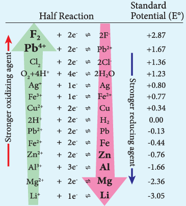

This series is called **electrochemical series**.

The standard reduction potential \( (E^{\circ}) \) is a measure of the oxidising tendency of the species. The greater the \( E^{\circ} \) value, greater is the tendency shown by the species to accept electrons and undergo reduction. So higher the \( (E^{\circ}) \) value, lesser is the tendency to undergo corrosion.