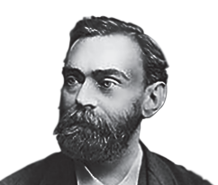

# 11. HYDROXY COMPOUNDS AND ETHERS

**Alfred Bernhard Nobel**

Alfred Bernhard Nobel was a
Swedish chemist, engineer, inventor,
and philanthropist. Nobel found
that when  nitroglycerine  was
incorporated in an inert absorbent
like kieselguhr (diatomaceous
earth) it became safer and more
convenient to handle. He patented
this mixture in 1867 as "dynamite".
Nobel prizes were established in
accordance with his will. The Nobel
prizes is considered as one of the
precious awards in the fields of
chemistry, literature, peace activism,
physics, economics and physiology
or medicine.

### Learning Objectives

After studying this unit the student will be able to

* describe the important methods of preparation and reactions of alcohols
* explain the mechanism of Nucleophilic substitution reaction of alcohols and ethers.
* explain the elimination reaction of alcohols.
* describe the preparation and properties of phenols
* discuss the preparation of ethers and explain their chemical reactions.
* recognise the uses of alcohols and ethers

### Introduction

We have already learnt in eleventh standard that the hydrolysis of an alkyl halide gives an
alcohol, an organic compound containing hydroxyl (-OH) functional group. Many organic
compounds containing –OH group play an important role in our body. For example, cholesteryl
alcohol commonly known as cholesterol is an important component in our cell membrane. Retinol,
the storage form of vitamin A, finds application in proper functioning of our eyes. Alcohols also
find application in many areas like medicine, industry, etc., For example, methanol is used as
an industrial solvent, ethyl alcohol an additive to petrol, isopropyl alcohol as a skin cleanser for
injection, etc., The hydroxyl group of alcohol can be converted to many other functional groups.
Hence, alcohols are important resource in synthetic organic chemistry. In this unit, we will learn
the preparation, properties and uses of alcohols, phenols and ethers. 

