## EVALUATION

**Choose the correct answer:**

1. An alcohol (x) gives blue colour in Victormeyer’s test and $3.7\text{ g}$ of X when treated with metallic sodium liberates $560\text{ mL}$ of hydrogen at $273\text{ K}$ and $1\text{ atm}$ pressure what will be the possible structure of X?
* a) $\text{CH}_3\text{CH(OH)CH}_2\text{CH}_3$
* b) $\text{CH}_3-\text{CH(OH)}-\text{CH}_3$
* c) $\text{CH}_3\text{C(OH)}(\text{CH}_3)_2$ 
* d) $\text{CH}_3-\text{CH}_2-\text{CH(OH)}-\text{CH}_2-\text{CH}_3$

2. Which of the following compounds on reaction with methyl magnesium bromide will give tertiary alcohol.
* a) benzaldehyde
* b) propanoic acid
* c) methyl propanoate
* d) acetaldehyde

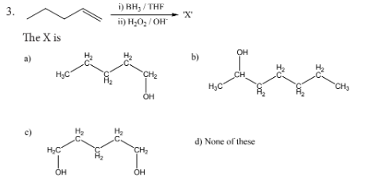
---
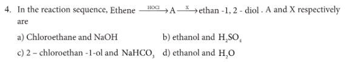

5. Which one of the following is the strongest acid:
* a) 2 - nitrophenol
* b) 4 - chlorophenol
* c) 4 - nitrophenol
* d) 3 - nitrophenol

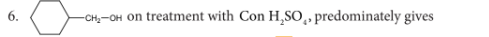
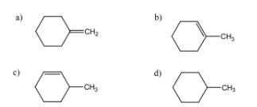

7. Carbolic acid is
* a) Phenol
* b) Picric acid
* c) benzoic acid 
* d) phenylacetic acid

8. Which one of the following will react with phenol to give salicylaldehyde after hydrolysis.
* a) Dichloro methane
* b) trichloroethane
* c) trichloro methane
* d) $\text{CO}_2$

9. $$(\text{CH}_3)_3\text{-C-CH(OH)CH}_3 \xrightarrow{\text{Con. H}_2\text{SO}_4} \text{X (major product)}$$

* a) $(\text{CH}_3)_3\text{CCH}=\text{CH}_2$
* b) $(\text{CH}_3)_2\text{C}=\text{C}(\text{CH}_3)_2$
* c) $\text{CH}_2=\text{C}(\text{CH}_3)\text{CH}_2-\text{CH}_2-\text{CH}_3$
* d) $\text{CH}_2=\text{C}(\text{CH}_3)-\text{CH}_2-\text{CH}_2-\text{CH}_3$

10. The correct IUPAC name of the compound,

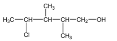

* a) $4-\text{chloro}-2,3-\text{dimethyl pentan}-1-\text{ol}$
* b) $2,3-\text{dimethyl}-4-\text{chloropentan}-1-\text{ol}$
* c) $2,3,4-\text{trimethyl}-4-\text{chlorobutan}-1-\text{ol}$
* d) $4-\text{chloro}-2,3,4-\text{trimethyl pentan}-1-\text{ol}$

11. **Assertion:** Phenol is more acidic than ethanol
**Reason:** Phenoxide ion is resonance stabilized
* a) both assertion and reason are true and reason is the correct explanation of assertion.
* b) both assertion and reason are true but reason is not the correct explanation of assertion.
* c) assertion is true but reason is false
* d) both assertion and reason are false.

12. In the reaction \[
\mathrm{Ethanol}
\xrightarrow{\mathrm{PCl_3}}
X
\xrightarrow{\mathrm{alc.\ KOH}}
Y
\xrightarrow{\mathrm{H_2SO_4,\ H_2O}}
Z
\]. The 'Z' is
* a) ethane
* b) ethoxyethane
* c) ethylbisulphite
* d) ethanol

13. The reaction
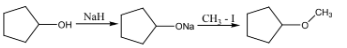Can be classified as
* a) dehydration
* b) Williamson alcoholsynthesis
* c) Williamson ether synthesis
* d) dehydrogenation of alcohol

14. Isopropylbenzene on air oxidation in the presence of dilute acid gives
* a) $\text{C}_6\text{H}_5\text{COOH}$
* b) $\text{C}_6\text{H}_5\text{COCH}_3$
* c) $\text{C}_6\text{H}_5\text{COC}_6\text{H}_5$
* d) $\text{C}_6\text{H}_5-\text{OH}$

15. **Assertion:** Phenol is more reactive than benzene towards electrophilic substitution reaction
**Reason:** In the case of phenol, the intermediate arenium ion is more stabilized by resonance.
* a) if both assertion and reason are true and reason is the correct explanation of assertion.
* b) if both assertion and reason are true but reason is not the correct explanation of assertion.
* c) assertion is true but reason is false
* d) both assertion and reason are false.

16. $\text{HO-CH}_2-\text{CH}_2-\text{OH}$ on heating with periodic acid gives
* a) methanoic acid
* b) Glyoxal
* c) methanal
* d) $\text{CO}_2$

17. Which of the following compound can be used as antifreeze in automobile radiators?
* a) methanol
* b) ethanol
* c) Neopentyl alcohol
* d) $\text{ethan-1,2-diol}$

18. The reactions
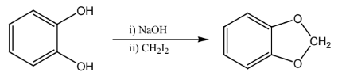

 is an example of
* a) Wurtz reaction
* b) cyclic reaction
* c) Williamson reaction
* d) Kolbe reactions

19. One mole of an organic compound (A) with the formula  \[\mathrm{C_3H_8O}
\] reacts completely with two moles of $\text{HI}$ to form X and Y. When Y is boiled with aqueous alkali it forms Z. Z answers the Iodoform test. The compound (A) is
* a) $\text{propan-2-ol}$
* b) $\text{propan-1-ol}$
* c) ethoxy ethane
* d) methoxy ethane

20. Among the following ethers which one will produce methyl alcohol on treatment with hot $\text{HI}$?
* a) $(\text{H}_3\text{C})_3\text{C}-\text{O}-\text{CH}_3$
* b) $(\text{CH}_3)_2-\text{CH}-\text{CH}_2-\text{O}-\text{CH}_3$
* c) $\text{CH}_3-(\text{CH}_2)_3-\text{O}-\text{CH}_3$
* d) 
$$\begin{array}{c}
\text{CH}_3-\text{CH}_2-\text{CH}-\text{O}-\text{CH}_3 \\
| \\
\text{CH}_3
\end{array}$$

21. Williamson synthesis of preparing dimethyl ether is a / an /
* a) $\text{SN}^1$ reactions
* b) $\text{SN}^2$ reaction
* c) electrophilic addition
* d) electrophilic substitution

22. On reacting with neutral ferric chloride, phenol gives
* a) red colour
* b) violet colour
* c) dark green colour
* d) no colouration.

### Short Answer Questions

1. Identify the product (s) is / are formed when $1-\text{methoxy propane}$ is heated with excess $\text{HI}$. Name the mechanism involved in the reaction
2. Draw the major product formed when $1-\text{ethoxyprop}-1-\text{ene}$ is heated with one equivalent of $\text{HI}$
3. Suggest a suitable reagent to prepare secondary alcohol with identical group using Grignard reagent.
4. What is the major product obtained when two moles of ethyl magnesium bromide is treated with methyl benzoate followed by acid hydrolysis.
5. Predict the major product, when $2-\text{methyl but}-2-\text{ene}$ is converted into an alcohol in each of the following methods.
* (i.) Acid catalysed hydration
* (ii.) Hydroboration
* (iii.) Hydroxylation using Baeyer's reagent

6. Arrange the following in the increasing order of their boiling point and give a reason for your ordering
* (i.) $\text{Butan}-2-\text{ol, Butan}-1-\text{ol, } 2-\text{methylpropan}-2-\text{ol}$
* (ii.) $\text{Propan}-1-\text{ol, propan}-1,2,3-\text{triol, propan}-1,3-\text{diol, propan}-2-\text{ol}$

7. Can we use nucelophiles such as $\text{NH}_3, \text{CH}_3\text{O}^-$ for the Nucleophilic substitution of alcohols
8. Is it possible to oxidise $\text{t}-\text{butyl alcohol}$ using acidified dichromate to form a carbonyl compound.
9. What happens when $1-\text{phenyl ethanol}$ is treated with acidified $\text{KMnO}_4$.
10. Write the mechanism of acid catalised dehydration of ethanol to give ethene.
11. How is phenol prepared from
* i) chloro benzene
* ii) isopropyl benzene

12. Explain Kolbe's reaction
13. Write the chemical equation for Williamson synthesis of $2-\text{ethoxy}-2-\text{methyl pentane}$ starting from ethanol and $2-\text{methyl pentan}-2-\text{ol}$
14. Write the structure of the aldehyde, carboxylic acid and ester that yield $4-\text{methylpent}-2-\text{en}-1-\text{ol}$.
15. What is metamerism? Give the structure and IUPAC name of metamers of $2-\text{methoxy propane}$
16. How are the following conversions effected
* i) benzylchloride to benzylalcohol
* ii) benzyl alcohol to benzoic acid

17. Complete the following reactions
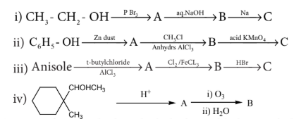

18. $0.44\text{ g}$ of a monohydric alcohol when added to methyl magnesium iodide in ether liberates at STP $112\text{ cm}^3$ of methane with PCC the same alcohol form a carbonyl compound that answers silver mirror test. Identify the compound.

19. Complete the following reactions
i) 
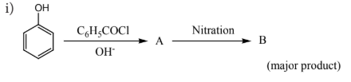

ii) 
$$\text{C}_6\text{H}_5\text{-CHCH(OH)CH}(\text{CH}_3)_2 \xrightarrow{\text{Con.H}_2\text{SO}_4} \dots$$

20. Phenol is distilled with Zn dust followed by Friedel – Crafts alkylation with propyl chloride to give a compound A, A on oxidation gives (B) Identify A and B.

21.  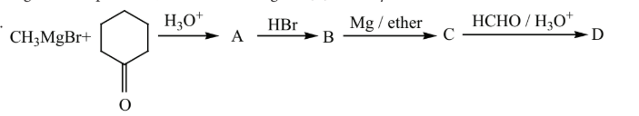
Identify A,B,C,D and write the complete equation

22. What will be the product (X and A) for the following reaction

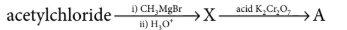

23. How will you convert acetylene into n-butyl alcohol.

24. Predict the product A,B,X and Y in the following sequence of reaction

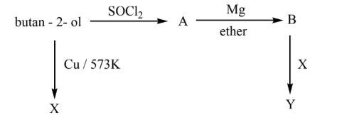

25. $3,3-\text{dimethylbutan -2-ol}$ on treatment with conc. $\text{H}_2\text{SO}_4$ to give tetramethyl ethylene as a major product. Suggest a suitable mechanism
