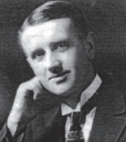
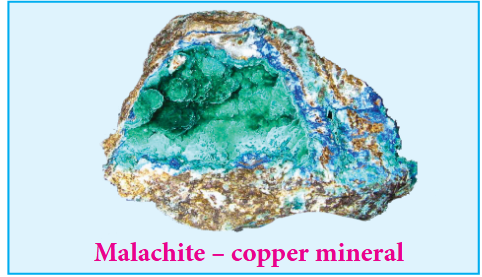
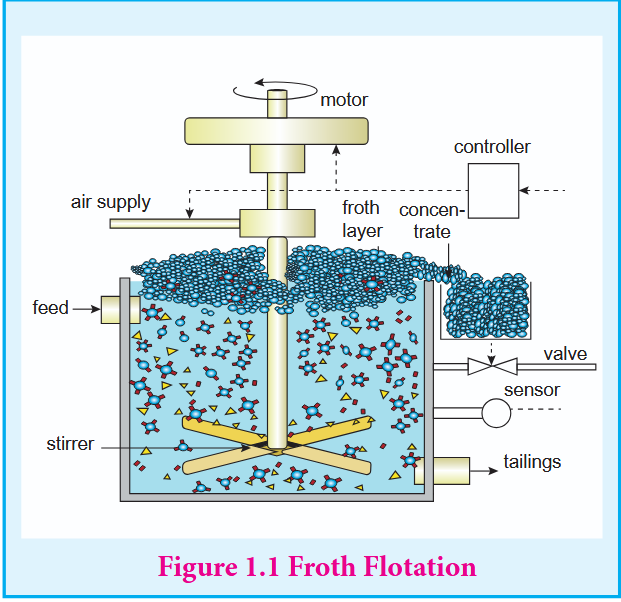
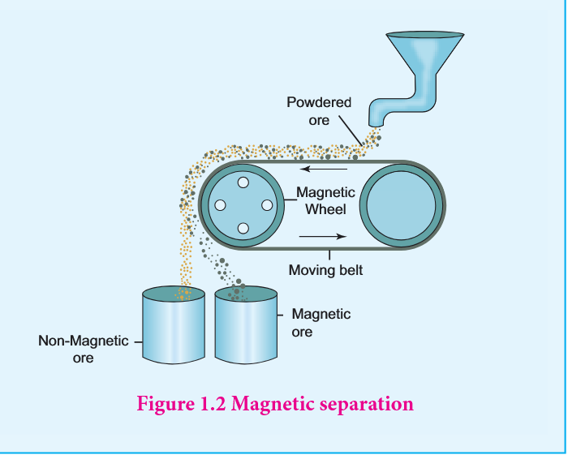
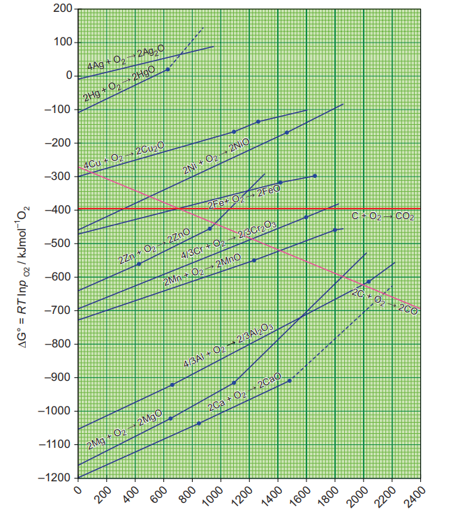

# 1. METALLURGY

### Harold Johann Thomas Ellingham (1897–1975)

Ellingham was a British physical chemist, best known for his Ellingham diagrams. Ellingham diagram summarizes a large amount of information about extractive metallurgy, and are useful in predicting the favourable thermodynamic conditions under which an ore will be reduced to its metal. Ellingham was able to compare the temperature stability of many different oxides. The phenomenon of reduction of metal oxides into free metal by carbon or carbon monoxide was known before Ellingham's time, but Ellingham demonstrated it in a scientific manner.

## INTRODUCTION

Metallurgy relate to the science and technology of metals. In nature, only a few metals occur in their native state, all other metals occur in a combined state as their oxides, sulphides, silicates etc... The extraction of pure metals from their natural sources, is linked to the history of human civilisation. Ancient people used the available materials in their environment which includes fire and metals, and they were limited to the metals available on the earth's surface. In the modern world, we use a wide range of metals in our daily life, which is the result of the development of metallurgical knowledge over thousands of years. Our need for the materials with specific properties have led to production of many metal alloys. It is essential to design an eco-friendly metallurgical process that would minimize waste, maximize energy efficiency. Such advances in metallurgy is vital for the economic and technical progress in the current era. In this unit we will study the various steps involved in the extraction of metals and the chemical principles behind these processes.

### 1.1 Occurrence of metals

In general, pure metals are shiny and malleable, however, most of them are found in nature as compounds with different properties. Metals having least chemical reactivity such as copper, silver, gold and platinum occur in significant amounts as native elements. Reactive metals such as alkali metals usually occurs in their combined state and are extracted using suitable metallurgical process.

#### 1.1.1 Mineral and ore

A naturally occurring substance obtained by mining which contains the metal in free state or in the form of compounds like oxides, sulphides etc... is called a mineral. In most of the minerals, the metal of interest is present only in small amounts and some of them contains a reasonable percentage of metal. For example iron is present in around 800 minerals. However, some of them such as hematite magnetite etc., containing high percentage of iron are commonly used for the extraction of iron. Such minerals that contains a high percentage of metal, from which it can be extracted conveniently and economically are called ores. Hence all ores are minerals but all minerals are not ores. Let us consider another example, bauxite and china clay \( \mathrm{(Al_{2}O_{3}.2SiO_{2}.2H_{2}O)} \). Both are minerals of aluminium. However, aluminium can be commercially extracted from bauxite while extraction from china clay is not a profitable one. Hence the mineral, bauxite is an ore of aluminium while china clay is not.

The extraction of a metal of interest from its ore consists of the following metallurgical processes.

(i) concentration of the ore (ii) extraction of crude metal (iii) refining of crude metal

**1.1 List of some metals and their common ores with their chemical formula**

| Metal | Ore | Composition | Metal | Ore | Composition |
|---|---|---|---|---|---|
| Aluminum | Bauxite | \( \mathrm{Al_2O_3.nH_2O} \) | Zinc | Zinc blende or Sphalerite | \( \mathrm{ZnS} \) |
| | Diaspore | \( \mathrm{Al_2O_3.H_2O} \) | | Calamine | \( \mathrm{ZnCO_3} \) |
| | Kaolinite | \( \mathrm{Al_2Si_2O_5(OH)_4} \) | | Zincite | \( \mathrm{ZnO} \) |
| Iron | Haematite | \( \mathrm{Fe_2O_3} \) | Lead | Galena | \( \mathrm{PbS} \) |
| | Magnetite | \( \mathrm{Fe_3O_4} \) | | Anglesite | \( \mathrm{PbSO_4} \) |
| | Siderite | \( \mathrm{FeCO_3} \) | | Cerussite | \( \mathrm{PbCO_3} \) |
| | Iron pyrite | \( \mathrm{FeS_2} \) | Tin | Cassiterite (Tin stone) | \( \mathrm{SnO_2} \) |
| | Limonite | \( \mathrm{Fe_2O_3.3H_2O} \) | | | |
| Silver | Silver glance (Argentite) | \( \mathrm{Ag_2S} \) | Copper | Copper pyrite | \( \mathrm{CuFeS_2} \) |
| | Pyragryrite (Ruby silver) | \( \mathrm{Ag_3SbS_3} \) | | Copper glance | \( \mathrm{Cu_2S} \) |
| | Chlorargyrite (Horn Silver) | \( \mathrm{AgCl} \) | | Cuprite | \( \mathrm{Cu_2O} \) |
| | Stefinite | \( \mathrm{Ag_2SbS_4} \) | | Malachite | \( \mathrm{CuCO_3.Cu(OH)_2} \) |
| | Proustite | \( \mathrm{Ag_3AsS_4} \) | | Azurite | \( \mathrm{2CuCO_3.Cu(OH)_2} \) |

### 1.2 Concentration of ores

Generally, the ores are associated with nonmetallic impurities, rocky materials and siliceous matter which are collectively known as gangue. The preliminary step in metallurgical process is removal of these impurities. This removal process is known as concentration of ore. It increases the concentration of the metal of interest or its compound in the ore. Several methods are available for this process and the choice of method will depend on the nature of the ore, type of impurity and environmental factors. Some of the common methods of ore concentration are discussed below.

#### 1.2.1 Gravity separation or Hydraulic wash

In this method, the ore having high specific gravity is separated from the gangue that has low specific gravity by simply washing with running water. Ore is crushed to a finely powdered form and treated with rapidly flowing current of water. During this process the lighter gangue particles are washed away by the running water. This method is generally applied to concentrate the native ore such as gold and oxide ores such as haematite \( \mathrm{(Fe_2O_3)} \), tin stone \( \mathrm{(SnO_2)} \) etc.

#### 1.2.2 Froth flotation

This method is commonly used to concentrate sulphide ores such as galena (PbS), zinc blende (ZnS) etc... In this method, the metallic ore particles which are preferentially wetted by oil can be separated from gangue.

In this method, the crushed ore is suspended in water and mixed with frothing agent such as pine oil, eucalyptus oil etc. A small quantity of sodium ethyl xanthate which acts as a collector is also added. A froth is generated by blowing air through this mixture. The collector molecules attach to the ore particle and make them water repellent. As a result, ore particles, wetted by the oil, rise to the surface along with the froth. The froth is skimmed off and dried to recover the concentrated ore. The gangue particles that are preferentially wetted by water settle at the bottom.

When a sulphide ore of a metal of interest contains other metal sulphides as impurities, depressing agents such as sodium cyanide, sodium carbonate etc are used to selectively prevent other metal sulphides from coming to the froth. For example, when impurities such as ZnS is present in galena (PbS), sodium cyanide (NaCN) is added to depress the flotation property of ZnS by forming a layer of zinc complex \( \mathrm{Na_2[Zn(CN)_4]} \) on the surface of zinc sulphide.

#### 1.2.3 Leaching

This method is based on the solubility of the ore in a suitable solvent and the reactions in aqueous solution. In this method, the crushed ore is allowed to dissolve in a suitable solvent, the metal present in the ore is converted to its soluble salt or complex while the gangue remains insoluble. The following examples illustrate the leaching processes.

##### Cyanide leaching

Let us consider the concentration of gold ore as an example. The crushed ore of gold is leached with aerated dilute solution of sodium cyanide. Gold is converted into a soluble cyanide complex. The gangue, aluminosilicate remains insoluble.

$$
4\mathrm{Au}(\mathrm{s}) + 8\mathrm{CN}^{-}(\mathrm{aq}) + \mathrm{O}_{2}(\mathrm{g}) + 2\mathrm{H}_{2}\mathrm{O}(\mathrm{l})\longrightarrow 4[\mathrm{Au}(\mathrm{CN})_{2}]^{-}(\mathrm{aq}) + 4\mathrm{OH}^{-}(\mathrm{aq})
$$

##### Recovery of metal of interest from the complex by reduction:

Gold can be recovered by reacting the deoxygenated leached solution with zinc. In this process the gold is reduced to its elemental state (zero oxidation state) and the process is called cementation.

$$
\mathrm{Zn(s) + 2[Au(CN)_2]^{-}(aq)\longrightarrow [Zn(CN)_4]^{-2}(aq) + 2Au(s)}
$$

##### Ammonia leaching

When a crushed ore containing nickel, copper and cobalt is treated with aqueous ammonia under suitable pressure, ammonia selectively leaches these metals by forming their soluble complexes viz. \( \mathrm{[Ni(NH_3)_6]^{2+}} \), \( \mathrm{[Cu(NH_3)_4]^{2+}} \), and \( \mathrm{[Co(NH_3)_5H_2O]^{3+}} \) respectively from the ore leaving behind the gangue, iron(III) oxides/hydroxides and aluminosilicate.

##### Alkali leaching

In this method, the ore is treated with aqueous alkali to form a soluble complex. For example, bauxite, an important ore of aluminum is heated with a solution of sodium hydroxide or sodium carbonate in the temperature range 470 - 520 K at 35 atm to form soluble sodium meta-aluminate leaving behind the impurities, iron oxide and titanium oxide.

$$
\mathrm{Al}_2\mathrm{O}_3(\mathrm{s}) + 2\mathrm{NaOH}(\mathrm{aq}) + 3\mathrm{H}_2\mathrm{O}(\mathrm{l})\longrightarrow 2\mathrm{Na}[\mathrm{Al}(\mathrm{OH})_4](\mathrm{aq})
$$

The hot solution is decanted, cooled, and diluted. This solution is neutralised by passing \( \mathrm{CO}_{2} \) gas, to form hydrated \( \mathrm{Al}_2\mathrm{O}_3 \) precipitate.

$$
2\mathrm{Na}[\mathrm{Al(OH)}_4](\mathrm{aq}) + 2\mathrm{CO}_2(\mathrm{g})\longrightarrow \mathrm{Al}_2\mathrm{O}_3.3\mathrm{H}_2\mathrm{O}(\mathrm{s}) + 2\mathrm{NaHCO}_3(\mathrm{aq})
$$

The precipitate is filtered off and heated around 1670 K to get pure alumina \( \mathrm{Al}_2\mathrm{O}_3 \).

##### Acid leaching

Leaching of sulphide ores such as ZnS, PbS etc., can be done by treating them with hot aqueous sulphuric acid.

$$
2\mathrm{ZnS}(\mathrm{s}) + 2\mathrm{H}_2\mathrm{SO}_4(\mathrm{aq}) + \mathrm{O}_2(\mathrm{g})\longrightarrow 2\mathrm{ZnSO}_4(\mathrm{aq}) + 2\mathrm{S}(\mathrm{s}) + 2\mathrm{H}_2\mathrm{O}
$$

In this process the insoluble sulphide is converted into soluble sulphate and elemental sulphur.

##### Evaluate yourself 1

1. Write the equation for the extraction of silver by leaching with sodium cyanide and show that the leaching process is a redox reaction.

#### 1.2.4 Magnetic separation

This method is applicable to ferromagnetic ores and it is based on the difference in the magnetic properties of the ore and the impurities. For example tin stone can be separated from the wolframite impurities which is magnetic. Similarly, ores such as chromite, pyrolysite having magnetic property can be removed from the non magnetic siliceous impurities. The crushed ore is poured on to an electromagnetic separator consisting of a belt moving over two rollers of which one is magnetic. The magnetic part of the ore is attracted towards the magnet and falls as a heap close to the magnetic region while the nonmagnetic part falls away from it as shown in the figure 1.2.

### 1.3 Extraction of crude metal

The extraction of crude metals from the concentrated ores is carried out in two steps namely, (i) conversion of the ore into oxides of the metal of interest and (ii) reduction of the metal oxides to elemental metals. In the concentrated ore, the metal exists in positive oxidation state and hence it is to be reduced to its elemental state. We can infer from the principles of thermodynamics, that the reduction of oxide is easier when compared to reduction of other compounds of metal and hence, before reduction, the ore is first converted into the oxide of metal of interest.

Let us discuss some of the common methods used to convert the concentrated ore into the oxides of the metal of interest.

#### 1.3.1 Conversion of ores into oxides

##### Roasting

Roasting is the method, usually applied for the conversion of sulphide ores into their oxides. In this method, the concentrated ore is oxidised by heating it with excess of oxygen in a suitable furnace below the melting point of the metal.

$$ 2PbS + 3O_2 \xrightarrow{\Delta} 2PbO + 2SO_2 \uparrow $$

$$
2\mathrm{ZnS} + 3\mathrm{O}_2 \xrightarrow{\Delta} 2\mathrm{ZnO} + 2\mathrm{SO}_2\uparrow
$$

$$
2\mathrm{Cu}_2{S} + 3\mathrm{O}_2 \xrightarrow{\Delta} 2\mathrm{Cu}_2{O} + 2\mathrm{SO}_2\uparrow
$$

Roasting also removes impurities such as arsenic, sulphur, phosphorus by converting them into their volatile oxides.

For example

$$
4\mathrm{As} + 3\mathrm{O}_2 \longrightarrow 2\mathrm{As}_2\mathrm{O}_3\uparrow
$$

$$
\mathrm{S}_8 + 8\mathrm{O}_2 \longrightarrow 8\mathrm{SO}_2\uparrow
$$

$$
\mathrm{P}_4 + 5\mathrm{O}_2 \longrightarrow \mathrm{P}_4\mathrm{O}_{10}\uparrow
$$

**Do You Know**

The sulphur dioxide produced during roasting process is harmful to the environment. In modern metallurgical factories, this by product is trapped and converted into sulphuric acid to avoid air pollution.

##### Calcination

Calcination is the process in which the concentrated ore is strongly heated in the absence of air. During this process, the water of crystallisation present in the hydrated oxide escapes as moisture. Any organic matter (if present) also get expelled leaving behind a porous ore. This method can also be carried out with a limited supply of air.

For examples,

During calcination of carbonate ore, carbon dioxide is expelled

$$
\mathrm{PbCO_3\xrightarrow{\Delta}PbO + CO_2\uparrow}
$$

$$
\mathrm{CaCO}_3\xrightarrow \ {CaO + CO_2\uparrow}
$$

$$
\mathrm{ZnCO_3\xrightarrow{\Delta}ZnO + CO_2\uparrow}
$$

$$
\mathrm{MgCO_3.CaCO_3\xrightarrow{\Delta}MgO + CaO + 2CO_2\uparrow}
$$

During calcination of hydrated ore, the water of hydration is expelled as vapour.

$$
Fe_2O_3 \cdot 3H_2O \xrightarrow{\Delta} Fe_2O_3(s) + 3H_2O(g) \uparrow
$$

$$
Al_2O_3 \cdot 2H_2O \xrightarrow{\Delta} Al_2O_3(s) + 2H_2O(g) \uparrow
$$

**Evaluate yourself 2**

2. Magnesite (Magnesium carbonate) is calcined to obtain magnesia, which is used to make refractory bricks. Write the decomposition reaction.

#### 1.3.2 Reduction of metal oxides

Metal oxide can be reduced to crude metal by using a suitable reducing agent like carbon, carbon monoxide, hydrogen, aluminium and other reactive metals such as sodium etc... The choice of reducing agent depends on the nature of the metal. For example, carbon cannot be used as a reducing agent for the reactive metals such as sodium, potassium, aluminium etc... Similarly CO cannot be used to reduce oxides such as ZnO, \( \mathrm{Al}_{2}\mathrm{O}_{3} \). Later in this, we study selection of suitable reducing agents by applying Ellingham diagram.

##### Smelting

In this method, a flux (a chemical substance that forms an easily fusible slag with gangue) and a reducing agent such as carbon, carbon monoxide (or) aluminium is added to the concentrated ore and the mixture is melted by heating at an elevated temperature (above the melting point of the metal) in a smelting furnace. For example the oxide of iron can be reduced by carbon monoxide as follows.

$$
\mathrm{Fe}_{2}\mathrm{O}_{3}\mathrm{(s)} + 3\mathrm{CO}\mathrm{(g)}\longrightarrow 2\mathrm{Fe}\mathrm{(s)} + 3\mathrm{CO}_{2}\mathrm{(g)}\uparrow
$$

In this extraction, a basic flux, quick lime (CaO) is used. Since the silica gangue present in the ore is acidic in nature, the quick lime combines with it to form calcium silicate (slag).

$$
\mathrm{CaO(s) + SiO_2(s)}\longrightarrow \mathrm{CaSiO_3(s)}
$$

$$
\mathrm{Flux}\quad \mathrm{Gangue}\quad \mathrm{Slag}
$$

In the extraction of copper from copper pyrites, the concentrated ore is heated in a reverberatory furnace after mixing with silica, an acidic flux. The ferrous oxide formed due to melting is basic in nature and it combines with silica to form ferrous silicate (slag). The remaining metal sulphides \( \mathrm{Cu}_{2}\mathrm{S} \) and FeS are mutually soluble and form a copper matte.

$$
\mathrm{2CuFeS_{2}(s) + O_{2}(g)}\longrightarrow 2\mathrm{FeS(l) + Cu_{2}S(l) + SO_{2}(g)}
$$

$$
\mathrm{2FeS(l) + 3O_{2}(g)}\longrightarrow 2\mathrm{FeO(l) + 2SO_{2}(g)}
$$

$$
\mathrm{FeO(s) + SiO_{2}(s)}\longrightarrow \mathrm{FeSiO_{3}(s)}
$$

$$
\mathrm{Gangue}\quad \mathrm{Flux}\quad \mathrm{Slag}
$$

The matte is separated from the slag and fed to the converting furnace. During conversion, the FeS present in the matte is first oxidised to FeO. This is removed by slag formation with silica. The remaining copper sulphide is further oxidised to its oxide which is subsequently converted to metallic copper as shown below.

$$
2\mathrm{Cu}_{2}\mathrm{S}(l,\mathrm{s}) + 3\mathrm{O}_{2}(\mathrm{g})\longrightarrow 2\mathrm{Cu}_{2}\mathrm{O}(l,\mathrm{s}) + 2\mathrm{SO}_{2}(\mathrm{g})
$$

$$
2\mathrm{Cu}_{2}\mathrm{O}(l) + \mathrm{Cu}_{2}\mathrm{S}(l)\longrightarrow 6\mathrm{Cu}(l) + \mathrm{SO}_{2}(\mathrm{g})
$$

The metallic copper is solidified and it has blistered appearance due to evolution of \( \mathrm{SO}_{2} \) gas formed in this process. This copper is called blistered copper.

##### Reduction by carbon:

In this method the oxide ore of the metal is mixed with coal (coke) and heated strongly in a furnace (usually in a blast furnace). This process can be applied to the metals which do not form carbides with carbon at the reduction temperature.

Examples:

$$
\mathrm{ZnO(s) + C(s)\longrightarrow Zn(s) + CO(g)\uparrow}
$$

$$
\mathrm{Mn_{3}O_{4}(s) + 4C(s)\longrightarrow 3Mn(s) + 4CO(g)\uparrow}
$$

$$
\mathrm{Cr_{2}O_{3}(s) + 3C(s)\longrightarrow 2Cr(s) + 3CO(g)\uparrow}
$$

##### Reduction by hydrogen:

This method can be applied to the oxides of the metals (Fe, Pb, Cu) having less electropositive character than hydrogen.

$$
\mathrm{Ag}_{2}\mathrm{O(s)} + \mathrm{H}_{2}(\mathrm{g})\longrightarrow 2\mathrm{Ag(s)} + \mathrm{H}_{2}\mathrm{O(l)}
$$

$$
\mathrm{Fe}_{3}\mathrm{O}_{4}(\mathrm{s}) + 4\mathrm{H}_{2}(\mathrm{g})\longrightarrow 3\mathrm{Fe(s)} + 4\mathrm{H}_{2}\mathrm{O(l)}
$$

Nickel oxide can be reduced to nickel by using a mixture of hydrogen and carbon monoxide (water gas)

$$
2\mathrm{NiO(s)} + \mathrm{CO(g)} + \mathrm{H}_{2}(\mathrm{g})\longrightarrow 2\mathrm{Ni(s)} + \mathrm{CO}_{2}(\mathrm{g}) + \mathrm{H}_{2}\mathrm{O(l)}
$$

##### Reduction by metal:

Metallic oxides such as \( \mathrm{Cr}_{2}\mathrm{O}_{3} \) can be reduced by an aluminothermic process. In this process, the metal oxide is mixed with aluminium powder and placed in a fire clay crucible. To initiate the reduction process, an ignition mixture (usually magnesium and barium peroxide) is used.

$$
\mathrm{BaO_2 + Mg \longrightarrow BaO + MgO}
$$

During the above reaction a large amount of heat is evolved (temperature up to 2400°C, is generated and the reaction enthalpy is : 852 kJ \( \mathrm{mol^{-1}} \)) which facilitates the reduction of \( \mathrm{Cr_2O_3} \) by aluminium powder.

$$
\mathrm{Cr_2O_3 + 2Al \xrightarrow{\Delta} 2Cr + Al_2O_3}
$$

Active metals such as sodium, potassium and calcium can also be used to reduce the metal oxide

$$
\mathrm{B_2O_3 + 6Na \longrightarrow 2B + 3Na_2O}
$$

$$
\mathrm{Rb_2O_3 + 3Mg \longrightarrow 2Rb + 3MgO}
$$

$$
\mathrm{TiO_2 + 2Mg \longrightarrow Ti + 2MgO}
$$

$$
\mathrm{ThO_2 + 2Ca \xrightarrow{1250 K} Th + 2CaO}
$$

##### Auto-reduction:

Simple roasting of some of the ores give the crude metal. In such cases, the use of reducing agents is not necessary. For example, mercury is obtained by roasting of its ore cinnabar (HgS)

$$
\mathrm{HgS (s) + O_2 (g) \longrightarrow Hg (l) + SO_2 \uparrow}
$$

### 1.4 Thermodynamic principle of metallurgy

As we discussed, the extraction of metals from their oxides can be carried out by using different reducing agents. For example, consider the reduction of a metal oxide \( \mathrm{M_xO_y} \).

$$
\frac{2}{7} M_x O_y (s) \longrightarrow \frac{2x}{7} M (s) + O_2 (g) ------------ \tag{1}
$$

The above reduction may be carried out with carbon. In this case, the reducing agent carbon may be oxidised to either CO or \( \mathrm{CO_2} \).

$$
\mathrm{C + O_2 \longrightarrow CO_2 (g)} \tag{2}
$$

$$
\mathrm{2C + O_2 \longrightarrow 2CO (g)} \tag{3}
$$

If carbon monoxide is used as a reducing agent, it is oxidised to \( \mathrm{CO_2} \) as follows,

$$
\mathrm{2CO + O_2 \longrightarrow 2CO_2 (g)} \tag{4}
$$

A suitable reducing agent is selected based on the thermodynamic considerations. We know that for a spontaneous reaction, the change in free energy (\( \Delta G \)) should be negative. Therefore, thermodynamically, the reduction of metal oxide [equation (1)] with a given reducing agent [Equation (2), (3) or (4)] can occur if the free energy change for the coupled reaction. [Equations (1) & (2), (1) & (3) or (1) & (4)] is negative. Hence, the reducing agent is selected in such a way that it provides a large negative \( \Delta G \) value for the coupled reaction.

#### 1.4.1 Ellingham diagram

Figure 1.4 Ellingham diagram

The change in Gibbs free energy \( (\Delta G) \) for a reaction is given by the expression.

$$
\Delta G = \Delta H - T\Delta S \tag{1}
$$

where, \( \Delta H \) is the enthalpy change, \( T \) the temperature in kelvin and \( \Delta S \) the entropy change. For an equilibrium process, \( \Delta G^0 \) can be calculated using the equilibrium constant by the following expression

$$
\Delta G^0 = -\mathrm{RT}\ln \mathrm{K}_{\mathrm{p}}
$$

Harold Ellingham used the above relationship to calculate the \( \Delta G^0 \) values at various temperatures for the reduction of metal oxides by treating the reduction as an equilibrium process.

He has drawn a plot by considering the temperature in the x-axis and the standard free energy change for the formation of metal oxide in y-axis. The resultant plot is a straight line with \( \Delta S \) as slope and \( \Delta H \) as y-intercept. The graphical representation of variation of the standard Gibbs free energy of reaction for the formation of various metal oxides with temperature is called Ellingham diagram.

##### Observations from the Ellingham diagram.

1. For most of the metal oxide formation, the slope is positive. It can be explained as follows. Oxygen gas is consumed during the formation of metal oxides which results in the decrease in randomness. Hence, \( \Delta S \) becomes negative and it makes the term, \( T\Delta S \) positive in the straight line equation.
2. The graph for the formation of carbon monoxide is a straight line with negative slope. In this case \( \Delta S \) is positive as 2 moles of CO gas is formed by the consumption of one mole of oxygen gas. It indicates that CO is more stable at higher temperature.
3. As the temperature increases, generally \( \Delta G \) value for the formation of the metal oxide become less negative and becomes zero at a particular temperature. Below this temperature, \( \Delta G \) is negative and the oxide is stable and above this temperature \( \Delta G \) is positive. This general trend suggests that metal oxides become less stable at higher temperature and their decomposition becomes easier.
4. There is a sudden change in the slope at a particular temperature for some metal oxides like MgO, HgO. This is due to the phase transition (melting or evaporation).

#### 1.4.2 Applications of the Ellingham diagram:

Ellingham diagram helps us to select a suitable reducing agent and appropriate temperature range for reduction. The reduction of a metal oxide to its metal can be considered as a competition between the element used for reduction and the metal to combine with oxygen. If the metal oxide is more stable, then oxygen remains with the metal and if the oxide of element used for reduction is more stable, then the oxygen from the metal oxide combines with elements used for the reduction. From the Ellingham diagram, we can infer the relative stability of different metal oxides at a given temperature.

1. Ellingham diagram for the formation of \( \mathrm{Ag}_2\mathrm{O} \) and \( \mathrm{HgO} \) is at upper part of the diagram and their decomposition temperatures are 600 and 700 K respectively. It indicates that these oxides are unstable at moderate temperatures and will decompose on heating even in the absence of a reducing agent.
2. Ellingham diagram is used to predict thermodynamic feasibility of reduction of oxides of one metal by another metal. Any metal can reduce the oxides of other metals that are located above it in the diagram. For example, in the Ellingham diagram, for the formation of chromium oxide lies above that of the aluminium, meaning that \( \mathrm{Al}_2\mathrm{O}_3 \) is more stable than \( \mathrm{Cr}_2\mathrm{O}_3 \). Hence aluminium can be used as a reducing agent for the reduction of chromic oxide. However, it cannot be used to reduce the oxides of magnesium and calcium which occupy lower position than aluminium oxide.
3. The carbon line cuts across the lines of many metal oxides and hence it can reduce all those metal oxides at sufficiently high temperature. Let us analyse the thermodynamically favourable conditions for the reduction of iron oxide by carbon. Ellingham diagram for the formation of FeO and CO intersects around 1000 K. Below this temperature the carbon line lies above the iron line which indicates that FeO is more stable than CO and hence at this temperature range, the reduction is not thermodynamically feasible. However, above 1000 K carbon line lies below the iron line and hence, we can use coke as reducing agent above this temperature. The following free energy calculation also confirm that the reduction is thermodynamically favoured.

From the Ellingham Diagram at 1500 K

$$
2\mathrm{Fe}(\mathrm{s}) + \mathrm{O}_2(\mathrm{g})\longrightarrow 2\mathrm{FeO}(\mathrm{g})\quad \Delta \mathrm{G}_1 = -350\ \mathrm{kJ}\ \mathrm{mol}^{-1}
$$

$$
2\mathrm{C}(\mathrm{s}) + \mathrm{O}_2(\mathrm{g})\longrightarrow 2\mathrm{CO}(\mathrm{g})\quad \Delta \mathrm{G}_2 = -480\ \mathrm{kJ}\ \mathrm{mol}^{-1}
$$

Reverse the reaction (1)

$$
2\mathrm{FeO}(\mathrm{s})\longrightarrow 2\mathrm{Fe}(\mathrm{s}) + \mathrm{O}_2(\mathrm{g})\quad -\Delta \mathrm{G}_1 = +350\ \mathrm{kJ}\ \mathrm{mol}^{-1}
$$

Now couple the reactions (2) and (3)

$$
2\mathrm{FeO}(\mathrm{s}) + 2\mathrm{C}\longrightarrow 2\mathrm{Fe}(\mathrm{l},\mathrm{s}) + 2\mathrm{CO}(\mathrm{g})\quad \Delta \mathrm{G}_3 = -130\ \mathrm{kJ}\ \mathrm{mol}^{-1}
$$

The standard free energy change for the reduction of one mole of FeO is, \( \Delta \mathrm{G}_3 / 2 = -65\ \mathrm{kJ}\ \mathrm{mol}^{-1} \).

##### Limitations of Ellingham diagram

1. Ellingham diagram is constructed based only on thermodynamic considerations. It gives information about the thermodynamic feasibility of a reaction. It does not tell anything about the rate of the reaction. Moreover, it does not give any idea about the possibility of other reactions that might be taking place.

2. The interpretation of \( \Delta \mathrm{G} \) is based on the assumption that the reactants are in equilibrium with the products which is not always true.

**Evaluate yourself 3**

3. Using Ellingham diagram (fig 1.4) indicate the lowest temperature at which ZnO can be reduced to Zinc metal by carbon. Write the overall reduction reaction at this temperature.

### 1.5 Electrochemical principle of metallurgy

Similar to thermodynamic principles, electrochemical principles also find applications in metallurgical process. The reduction of oxides of active metals such as sodium, potassium etc., by carbon is thermodynamically not feasible. Such metals are extracted from their ores by using electrochemical methods. In this technique, the metal salts are taken in a fused form or in solution form. The metal ion present can be reduced by treating it with some suitable reducing agent or by electrolysis.

Gibbs free energy change for the electrolysis process is given by the following expression

$$
\Delta G^{\circ} = -\mathrm{nFE}^{\circ}
$$

Where n is number of electrons involved in the reduction process, F is the Faraday and \( \mathrm{E}^0 \) is the electrode potential of the redox couple.

If \( \mathrm{E}^0 \) is positive then the \( \Delta \mathrm{G} \) is negative and the reduction is spontaneous and hence a redox reaction is planned in such a way that the e.m.f of the net redox reaction is positive. When a more reactive metal is added to the solution containing the relatively less reactive metal ions, the more reactive metal will go into the solution. For example,

$$
\mathrm{Cu(s) + 2Ag^{+}(aq)\longrightarrow Cu^{2+}(aq) + 2Ag(s)}
$$

$$
\mathrm{Cu^{2+}(aq) + Zn(s)\longrightarrow Cu(s) + Zn^{2+}(aq)}
$$

#### 1.5.1 Electrochemical extraction of aluminium - Hall-Heroult process:

In this method, electrolysis is carried out in an iron tank lined with carbon which acts as a cathode. The carbon blocks immersed in the electrolyte act as an anode. A 20% solution of alumina, obtained from the bauxite ore is mixed with molten cryolite and is taken in the electrolysis chamber. About 10% calcium chloride is also added to the solution. Here calcium chloride helps to lower the melting point of the mixture. The fused mixture is maintained at a temperature of above 1270 K. The chemical reactions involved in this process are as follows.

$$
\mathrm{Ionisation\ of\ alumina:\ Al_2O_3 \longrightarrow 2Al^{3+} + 3O^{2-}}
$$

$$
\mathrm{Reaction\ at\ cathode:\ 2Al^{3+}(melt) + 6e^{-} \longrightarrow 2Al(l)}
$$

$$
\mathrm{Reaction\ at\ anode:\ 6O^{2-}(melt) \longrightarrow 3O_2 + 12e^{-}}
$$

Since carbon acts as anode the following reaction also takes place on it.

$$
\mathrm{C(s) + O^{2-}(melt) \longrightarrow CO + 2e^{-}}
$$

$$
\mathrm{C(s) + 2O^{2-}(melt) \longrightarrow CO_2 + 4e^{-}}
$$

Due to the above two reactions, anodes are slowly consumed during the electrolysis. The pure aluminium is formed at the cathode and settles at the bottom. The net electrolysis reaction can be written as follows.

$$
4\mathrm{Al}^{3+}(\mathrm{melt}) + 6\mathrm{O}^{2-}(\mathrm{melt}) + 3\mathrm{C}(\mathrm{s})\longrightarrow 4\mathrm{Al}(\mathrm{l}) + 3\mathrm{CO}_{2}(\mathrm{g})
$$

**Evaluate yourself 4**

4. Metallic sodium is extracted by the electrolysis of brine (aq. NaCl). After electrolysis the electrolytic solution becomes basic in nature. Write the possible electrode reactions.

### 1.6 Refining process

Generally the metal extracted from its ore contains some impurities such as unreacted oxide ore, other metals, nonmetals etc... Removal of such impurities associated with the isolated crude metal is called refining process. In this section, let us discuss some of the common refining methods.

#### 1.6.1 Distillation

This method is employed for low boiling volatile metals like zinc (boiling point 1180 K) and mercury (630 K). In this method, the impure metal is heated to evaporate and the vapours are condensed to get pure metal.

#### 1.6.2 Liquation

This method is employed to remove the impurities with high melting points from metals having relatively low melting points such as tin (Sn; mp = 904 K), lead (Pb; mp = 600 K), mercury (Hg; mp = 234 K), and bismuth (Bi; mp = 545 K). In this process, the crude metal is heated to form fusible liquid and allowed to flow on a sloping surface. The impure metal is placed on sloping hearth of a reverberatory furnace and it is heated just above the melting point of the metal in the absence of air, the molten pure metal flows down and the impurities are left behind. The molten metal is collected and solidified.

#### 1.6.3 Electrolytic refining

The crude metal is refined by electrolysis. It is carried out in an electrolytic cell containing aqueous solution of the salts of the metal of interest. The rods of impure metal are used as anode and thin strips of pure metal are used as cathode. The metal of interest dissolves from the anode, pass into the solution while the same amount of metal ions from the solution will be deposited at the cathode. During electrolysis, the less electropositive impurities in the anode, settle down at the bottom and are removed as anode mud.

Let us understand this process by considering electrolytic refining of silver as an example.

Cathode : Pure silver

Anode : Impure silver rods

Electrolyte : Acidified aqueous solution of silver nitrate.

When a current is passed through the electrodes the following reactions will take place

$$
\mathrm{Reaction\ at\ anode:\ Ag(s) \longrightarrow Ag^{+}(aq) + 1e^{-}}
$$

$$
\mathrm{Reaction\ at\ cathode:\ Ag^{+}(aq) + 1e^{-} \longrightarrow Ag(s)}
$$

During electrolysis, at the anode the silver atoms lose electrons and enter the solution. The positively charged silver cations migrate towards the cathode and get discharged by gaining electrons and deposited on the cathode. Other metals such as copper, zinc etc., can also be refined by this process in a similar manner.

#### 1.6.4 Zone Refining

This method is based on the principles of fractional crystallisation. When an impure metal is melted and allowed to solidify, the impurities will prefer to be in the molten region i.e. impurities are more soluble in the melt than in the solid state metal. In this process the impure metal is taken in the form of a rod. One end of the rod is heated using a mobile induction heater which results in melting of the metal on that portion of the rod. When the heater is slowly moved to the other end the pure metal crystallises while the impurities will move on to the adjacent molten zone formed due to the movement of the heater. As the heater moves further away, the molten zone containing impurities also moves along with it. The process is repeated several times by moving the heater in the same direction again and again to achieve the desired purity level. This process is carried out in an inert gas atmosphere to prevent the oxidation of metals. Elements such as germanium (Ge), silicon (Si) and gallium (Ga) that are used as semiconductor are refined using this process.

#### 1.6.5 Vapour phase method

In this method, the metal is treated with a suitable reagent which can form a volatile compound with the metal. Then the volatile compound is decomposed to give the pure metal. We can understand this method by considering the following process.

##### Mond process for refining nickel

The impure nickel is heated in a stream of carbon monoxide at around 350 K. The nickel reacts with the CO to form a highly volatile nickel tetracarbonyl. The solid impurities are left behind.

$$
\mathrm{Ni(s) + 4CO(g) \longrightarrow [Ni(CO)_4](g)}
$$

On heating the nickel tetracarbonyl around 460 K, the complex decomposes to give pure metal.

$$
\mathrm{[Ni(CO)_4](g) \longrightarrow Ni(s) + 4CO(g)}
$$

##### Van-Arkel method for refining zirconium/titanium

This method is based on the thermal decomposition of metal compounds which lead to the formation of pure metals. Titanium and zirconium can be purified using this method. For example, the impure titanium metal is heated in an evacuated vessel with iodine at a temperature of 550 K to form the volatile titanium tetra-iodide (\( \mathrm{TiI_4} \)). The impurities are left behind, as they do not react with iodine.

$$
\mathrm{Ti(s) + 2I_2(s) \xrightarrow[\Delta]{550K} TiI_4(vapour)}
$$

The volatile titanium tetraiodide vapour is passed over a tungsten filament at a temperature around 1800 K. The titanium tetraiodide is decomposed and pure titanium is deposited on the filament. The iodine is reused.

$$
\mathrm{TiI_4(vapour) \xrightarrow[\Delta]{1800K} Ti(s) + 2I_2(s)}
$$

### 1.7 Applications of metals

#### 1.7.1 Applications of Al

Aluminium is the most abundant metal and is a good conductor of electricity and heat. It also resists corrosion. The following are some of its applications.

- Many heat exchangers/sinks and our day to day cooking vessels are made of aluminium.
- It is used as wraps (aluminium foils) and is used in packing materials for food items.
- Aluminium is not very strong. However, its alloys with copper, manganese, magnesium and silicon are light weight and strong and they are used in design of aeroplanes and other forms of transport.
- As Aluminium shows high resistance to corrosion, it is used in the design of chemical reactors, medical equipments, refrigeration units and gas pipelines.
- Aluminium is a good electrical conductor and cheap, hence used in electrical overhead electric cables with steel core for strength.

#### 1.7.2 Applications of Zn

- Metallic zinc is used in galvanising metals such as iron and steel structures to protect them from rusting and corrosion.
- Zinc is also used to produce die-castings in the automobile, electrical and hardware industries.
- Zinc oxide is used in the manufacture of many products such as paints, rubber, cosmetics, pharmaceuticals, plastics, inks, batteries, textiles and electrical equipment.Zinc sulphide is used in making luminous paints, fluorescent lights and x-ray screens.
- Brass an alloy of zinc is used in water valves and communication equipment as it is highly resistant to corrosion.

#### 1.7.3 Applications of Fe

- Iron is one of the most useful metals and its alloys are used everywhere including bridges, electricity pylons, bicycle chains, cutting tools and rifle barrels.
- Cast iron is used to make pipes, valves and pumps, stoves etc.
- Magnets can be made from iron and its alloys and compounds.
- An important alloy of iron is stainless steel, and it is very resistant to corrosion. It is used in architecture, bearings, cutlery, surgical instruments and jewellery. Nickel steel is used for making cables, automobiles and aeroplane parts. Chrome steels are used for manufacturing cutting tools and crushing machines.

#### 1.7.4 Applications of Cu

- Copper is the first metal used by the human and extended use of its alloy bronze resulted in a new era, 'Bronze age'.
- Copper is used for making coins and ornaments along with gold and other metals.
- Copper and its alloys are used for making wires, water pipes and other electrical parts.

#### 1.7.5 Applications of Au

- Gold, one of the expensive and precious metals. It is used for coinage, and has been used as standard for monetary systems in some countries.
- It is used extensively in jewellery in its alloy form with copper. It is also used in electroplating to cover other metals with a thin layer of gold which are used in watches, artificial limb joints, cheap jewellery, dental fillings and electrical connectors.
- Gold nanoparticles are also used for increasing the efficiency of solar cells and also used as catalysts.

**Do You Know**

#### The Iron Pillar - Delhi

The Iron pillar, also known as Ashoka Pillar, is 23 feet 8 inches high, 16 inches wide and weighs over 6000 kg.

The surprise comes in knowing its age, some 1600 years old, an iron column should have turned into a pile of dust long ago. Despite that, it has avoided corrosion for over the last 1600 years and stands as an evidence of the exquisite skills and knowledge of ancient Indians.

A protective film was created through a complicated combination of the presence of raw and unreduced iron in the pillar and cycles of the weather, which helped to create a thin, uniform layer of misawite on the pillar. Misawite is a compound of iron, oxygen and hydrogen which does not rust and gives corrosion resistance.

## Summary

- Metallurgy relates to the science and technology of metals.
- A naturally occurring substance obtained by mining which contains the metal in free state or in the form of compounds like oxides, sulphides etc... is called a mineral.
- Minerals that contains a high percentage of metal, from which it can be extracted conveniently and economically are called ores.
- The extraction of a metal of interest from its ore consists of the following metallurgical processes.
  (i) concentration of the ore (ii) extraction of crude metal (iii) refining of crude metal
- The extraction of crude metals from the concentrated ores is carried out in two steps namely, (i) conversion of the ore into oxides of the metal of interest and (ii) reduction of the metal oxides to elemental metals.
- The graphical representation of variation of the standard Gibbs free energy of reaction for the formation of various metal oxides with temperature is called Ellingham diagram.
- Ellingham diagram helps us to select a suitable reducing agent and appropriate temperature range for reduction.
- Similar to thermodynamic principles, electrochemical principles also find applications in metallurgical process. If \( \mathrm{E}^0 \) is positive then the \( \Delta \mathrm{G} \) is negative and the reduction is spontaneous and hence a redox reaction is planned in such a way that the e.m.f of the net redox reaction is positive. When a more reactive metal is added to the solution containing the relatively less reactive metal ions, the more reactive metal will go into the solution.
- Generally the metal extracted from its ore contains some impurities such as unreacted oxide ore, other metals, nonmetals etc... Removal of such impurities associated with the isolated crude metal is called refining process.
