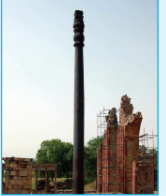

### 1.7 Applications of metals

#### 1.7.1 Applications of Al

Aluminium is the most abundant metal and is a good conductor of electricity and heat. It also resists corrosion. The following are some of its applications.

- Many heat exchangers/sinks and our day to day cooking vessels are made of aluminium.
- It is used as wraps (aluminium foils) and is used in packing materials for food items.
- Aluminium is not very strong. However, its alloys with copper, manganese, magnesium and silicon are light weight and strong and they are used in design of aeroplanes and other forms of transport.
- As Aluminium shows high resistance to corrosion, it is used in the design of chemical reactors, medical equipments, refrigeration units and gas pipelines.
- Aluminium is a good electrical conductor and cheap, hence used in electrical overhead electric cables with steel core for strength.

#### 1.7.2 Applications of Zn

- Metallic zinc is used in galvanising metals such as iron and steel structures to protect them from rusting and corrosion.
- Zinc is also used to produce die-castings in the automobile, electrical and hardware industries.
- Zinc oxide is used in the manufacture of many products such as paints, rubber, cosmetics, pharmaceuticals, plastics, inks, batteries, textiles and electrical equipment.Zinc sulphide is used in making luminous paints, fluorescent lights and x-ray screens.
- Brass an alloy of zinc is used in water valves and communication equipment as it is highly resistant to corrosion.

#### 1.7.3 Applications of Fe

- Iron is one of the most useful metals and its alloys are used everywhere including bridges, electricity pylons, bicycle chains, cutting tools and rifle barrels.
- Cast iron is used to make pipes, valves and pumps, stoves etc.
- Magnets can be made from iron and its alloys and compounds.
- An important alloy of iron is stainless steel, and it is very resistant to corrosion. It is used in architecture, bearings, cutlery, surgical instruments and jewellery. Nickel steel is used for making cables, automobiles and aeroplane parts. Chrome steels are used for manufacturing cutting tools and crushing machines.

#### 1.7.4 Applications of Cu

- Copper is the first metal used by the human and extended use of its alloy bronze resulted in a new era, 'Bronze age'.
- Copper is used for making coins and ornaments along with gold and other metals.
- Copper and its alloys are used for making wires, water pipes and other electrical parts.

#### 1.7.5 Applications of Au

- Gold, one of the expensive and precious metals. It is used for coinage, and has been used as standard for monetary systems in some countries.
- It is used extensively in jewellery in its alloy form with copper. It is also used in electroplating to cover other metals with a thin layer of gold which are used in watches, artificial limb joints, cheap jewellery, dental fillings and electrical connectors.
- Gold nanoparticles are also used for increasing the efficiency of solar cells and also used as catalysts.

>**Do You Know**
>
>#### The Iron Pillar - Delhi
>
>The Iron pillar, also known as Ashoka Pillar, is 23 feet 8 inches high, 16 inches wide and weighs over 6000 kg.
>
>The surprise comes in knowing its age, some 1600 years old, an iron column should have turned into a pile of dust long ago. Despite that, it has avoided corrosion for over the last 1600 years and stands as an evidence of the exquisite skills and knowledge of ancient Indians.
>
>A protective film was created through a complicated combination of the presence of raw and unreduced iron in the pillar and cycles of the weather, which helped to create a thin, uniform layer of misawite on the pillar. Misawite is a compound of iron, oxygen and hydrogen which does not rust and gives corrosion resistance.

## Summary

- Metallurgy relates to the science and technology of metals.
- A naturally occurring substance obtained by mining which contains the metal in free state or in the form of compounds like oxides, sulphides etc... is called a mineral.
- Minerals that contains a high percentage of metal, from which it can be extracted conveniently and economically are called ores.
- The extraction of a metal of interest from its ore consists of the following metallurgical processes.
  (i) concentration of the ore (ii) extraction of crude metal (iii) refining of crude metal
- The extraction of crude metals from the concentrated ores is carried out in two steps namely, (i) conversion of the ore into oxides of the metal of interest and (ii) reduction of the metal oxides to elemental metals.
- The graphical representation of variation of the standard Gibbs free energy of reaction for the formation of various metal oxides with temperature is called Ellingham diagram.
- Ellingham diagram helps us to select a suitable reducing agent and appropriate temperature range for reduction.
- Similar to thermodynamic principles, electrochemical principles also find applications in metallurgical process. If \( \mathrm{E}^0 \) is positive then the \( \Delta \mathrm{G} \) is negative and the reduction is spontaneous and hence a redox reaction is planned in such a way that the e.m.f of the net redox reaction is positive. When a more reactive metal is added to the solution containing the relatively less reactive metal ions, the more reactive metal will go into the solution.
- Generally the metal extracted from its ore contains some impurities such as unreacted oxide ore, other metals, nonmetals etc... Removal of such impurities associated with the isolated crude metal is called refining process.
