# 13. ORGANIC NITROGEN COMPOUNDS

**Donald James Cram**

Donald James Cram  was
an American  chemist  who
shared the 1987  Nobel
Prize  in  Chemistry  with  Jean-Marie
Lehn and Charles J. Pedersen "for their
development and use of molecules with
structure-specific interactions of high
selectivity." They were the founders of
the field of host–guest chemistry Cram
expanded upon  Charles Pedersen's
ground-breaking synthesis of  crown
ethers, two-dimensional  organic
compounds  that are able to recognize
and selectively combine with the ions
of certain metal elements. He also did
work in  stereochemistry  and  Cram's
rule of asymmetric induction is named
after him.

## INTRODUCTION

Organic compounds containing nitrogen are essential to life. For example; amines, the organic derivatives of ammonia play an important role in bioregulation, neurotransmission, etc. Pyridoxine, Vitamin \( \mathrm{B_6} \) is an organic nitrogen compound which is needed to maintain the health of nerves, skin and red blood cells. Plants synthesise alkaloids, and biologically active amines to protect them from being eaten away by insects and other animals. Diazonium salts finds important applications in synthetic organic chemistry. Nitrogen compounds are the important constituents of explosives, drugs, dyes, fuels, polymers, synthetic rubbers, etc.

In this unit, we will learn the preparation, properties and uses of nitrocompounds and amines.

### 13.1 NITRO COMPOUNDS

Nitro compounds are considered as the derivatives of hydrocarbons. If one of the hydrogen atom of hydrocarbon is replaced by the - \( \mathrm{NO_2} \) group, the resultant organic compound is called a nitrocompound.

#### 13.1.1 Classification of nitrocompounds
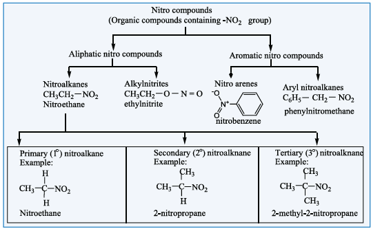
Nitroalkanes are represented by the formula, R-NO2 where R is an alkyl group (C H-) n2n+1 .
Nitroalkanes are further classified into primary, secondary, tertiary nitroalkanes on the basis
of type of carbon atom to which the nitro (-NO )2 group is attached. 

#### 13.1.2 Nomenclature of nitroalkanes

In the IUPAC nomenclature, the nitroalkanes are named by adding prefix nitro before the name of alkane, the position of the nitro group is indicated by number.
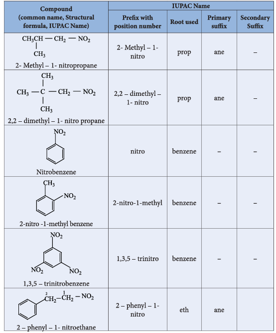
#### 13.1.3 ISOMERISM

Nitroalkanes exhibit chain and position isomerism among their own class and functional isomerism with alkyl nitrites and special type tautomerism can also exist in nitro alkanes having an \( \alpha \) - H atom. For example, nitro compounds having the molecular formula \( \mathrm{C_4H_9NO_2} \) exhibit the following isomerisms.
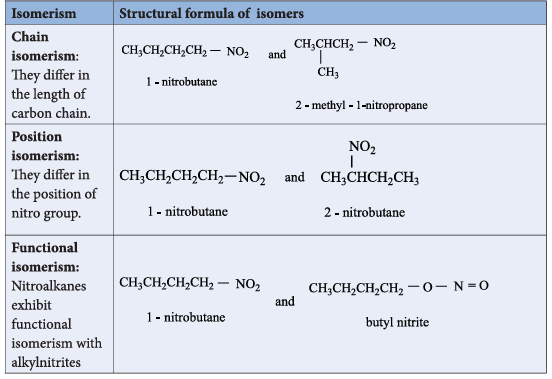

**Tautomerism:** Primary and secondary nitroalkanes, having \( \alpha \) - H, also show an equilibrium mixture of two tautomers namely nitro - and aci - form.
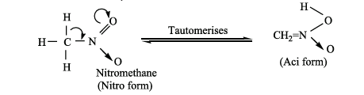
Tertiary nitro alkanes do not exhibit tautomerism due to absence of \( \alpha \) - H atom.

| S.No. | Nitro form | Aci – form |
|---|---|---|
| 1. | Less acidic | More acidic |
| 2. | Dissolves in NaOH slowly | Dissolves in NaOH instantly |
| 3. | Decolourises \( \mathrm{FeCl_3} \) solution | With \( \mathrm{FeCl_3} \) gives reddish brown colour |
| 4. | Electrical conductivity is low | Electrical conductivity is high |

#### 13.1.4 Acidic nature of nitro alkanes

The \( \alpha \) - H atom of \( 1^{\circ} \) & \( 2^{\circ} \) nitroalkanes show acidic character because of the electron withdrawing effect of \( \mathrm{NO_2} \) group. These are more acidic than aldehydes, ketones, ester and cyanides. Nitroalkanes dissolve in NaOH solution to form a salt. Aci - nitro derivatives are more acidic than nitro form. When the number of alkyl group attached to \( \alpha \) carbon increases, acidity decreases due to \( +I \) effect of alkyl groups.
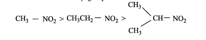
**Evaluate yourself**

Write all possible isomers for the following compounds.

\[
\mathrm{i)\ C_2H_5-NO_2 \qquad ii)\ C_3H_7-NO_2}
\]

#### 13.1.5 Preparation of nitroalkanes

**1) From alkyl halides: (Laboratory method)**

a) Alkyl bromides (or) iodides on heating with ethanolic solution of potassium nitrite gives nitroethane.

\[
\mathrm{CH_3CH_2-Br + KNO_2 \xrightarrow{ethanol / \Delta} CH_3CH_2-NO_2 + KBr}
\]

The reaction follows \( \mathrm{S_N2} \) mechanism.

This method is not suitable for preparing nitrobenzene because the bromine directly attached to the benzene ring cannot be cleaved easily.

**2) Vapour phase nitration of alkanes: (Industrial method)**

Gaseous mixture of methane and nitric acid passed through a red hot metal tube to give nitromethane.

\[
\mathrm{CH_4(g) + HNO_3 \xrightarrow{675K} CH_3-NO_2 + H_2O}
\]

Except methane, other alkanes (upto \( n \)-hexane) give a mixture of nitroalkanes due to C-C cleavage. The individual nitro alkanes can be separated by fractional distillation.

\[
\mathrm{CH_3CH_3 + HNO_3 \xrightarrow{675K} CH_3CH_2-NO_2 + CH_3NO_2}
\]

**3) From \( \alpha \)-halocarboxylic acid**

\( \alpha \)-chloroacetic acid when boiled with aqueous solution of sodium nitrite gives nitromethane.

\[
\mathrm{Cl-CH_2-COOH + NaNO_2 \xrightarrow{H_2O/Heat} CH_3-NO_2 + CO_2 + NaCl}
\]
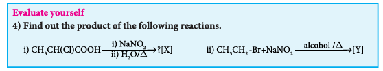
**4) Oxidation of tert-alkyl amines**

tert-butyl amine is oxidised with aqueous \( \mathrm{KMnO_4} \) to give tert-nitro alkanes.
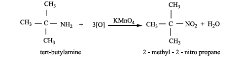
**5) Oxidation of Oximes**

Oxidation of acetaloxime and acetone oxime with trifluoroperoxy acetic acid gives nitroethane \( (1^{\circ}) \) and 2-nitropropane \( (2^{\circ}) \) respectively.

\[
\mathrm{CH_3-CH=N-OH \xrightarrow{CF_3COOH \atop [O]} CH_3CH_2-NO_2}
\]

#### 13.1.6 Preparation of Nitroarenes

**1) By Direct nitration**

When benzene is heated at 330K with a nitrating mixture \( \mathrm{(Conc.\ HNO_3 + Conc.\ H_2SO_4)} \), electrophilic substitution takes place to form nitrobenzene. (Oil of mirbane)
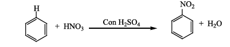
On direct nitration of nitrobenzene m-dinitrobenzene is obtained.

**2) Indirect method**

Nitration of nitrobenzene gives m-dinitrobenzene. The following method is adopted for the preparation of p-dinitrobenzene.

**For example**

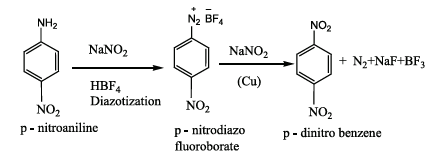
Amino group can be directly converted into nitro group, using caro’s acid (H SO ) 25 (or) persulphuric acid (H SO ) 22 8 (or)
peroxytrifluro acetic acid (F C.CO H) 33 as oxidising agent. 
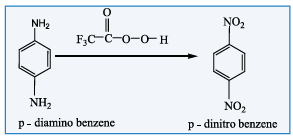
#### 13.1.7 Physical properties of nitroalkanes

The lower nitroalkanes are colourless pleasant smelling liquids, sparingly soluble in water, but readily soluble in organic solvents like benzene, acetone etc. They have high boiling points because of their highly polar nature. Alkyl nitrites have lower boiling points than nitro alkanes.

#### 13.1.8 Chemical properties of nitroalkanes

Nitroalkanes undergo the following common reactions.

i. Reduction
ii. Hydrolysis
iii. Halogenation

**i. Reduction of nitroalkanes**

Reduction of nitroalkanes has important synthetic applications. The various reduction stages of nitro group are given below.
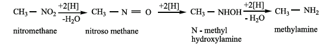
The final product depends upon the nature of reducing agent as well as the pH of the medium.
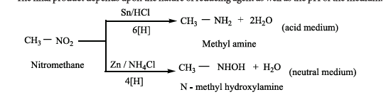
**Reduction of alkyl nitrites**

Ethyl nitrite on reduction with \( \mathrm{Sn/HCl} \) gives ethanol

\[
\mathrm{CH_3CH_2-O-N=O + 6[H] \xrightarrow{Sn/HCl} CH_3CH_2-OH + NH_3 + H_2O}
\]

**ii. Hydrolysis of nitroalkanes**

Hydrolysis can be effected using conc. HCl or conc. \( \mathrm{H_2SO_4} \). Primary nitroalkanes on hydrolysis gives carboxylic acid, and the secondary nitroalkanes give ketones. The tertiary nitroalkanes have no reaction.
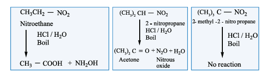
On the other hand, the acid or base hydrolysis of ethyl nitrite gives ethanol.

\[
\mathrm{CH_3CH_2-O-N=O + HOH \xrightarrow{H^+} CH_3CH_2-OH + HNO_2}
\]

**iii. Halogenation of nitroalkanes**

Primary and secondary nitroalkanes on treatment with \( \mathrm{Cl_2} \) or \( \mathrm{Br_2} \) in the presence of NaOH give halonitroalkanes. The \( \alpha \)-H atom of nitroalkanes are successively replaced by halogen atoms.

\[
\mathrm{CH_3-NO_2 + 3Cl_2 \xrightarrow{NaOH} CCl_3-NO_2 + 3HCl}
\]

**Toxicity:** Nitroethane is suspected to cause genetic damage and be harmful to the nervous system.

**iv. Nef carbonyl synthesis**
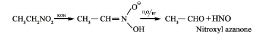
#### Chemical Properties of nitrobenzene
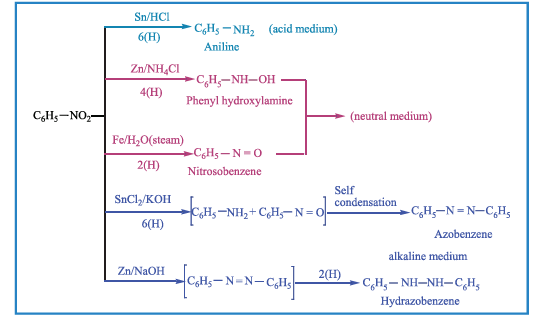
**Electrolytic reduction:**
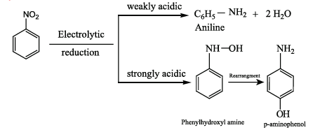
**Reduction with catalytic and metal hydrides**

Nitrobenzene reduction with Ni (or) Pt, (or) \( \mathrm{LiAlH_4} \) gives aniline

\[
\mathrm{C_6H_5-NO_2 + 6[H] \xrightarrow{Ni\ (or)\ Pt/H_2} C_6H_5-NH_2 + 2H_2O}
\]

**Selective reduction of polynitro compounds**
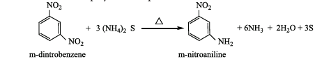
**Electrophilic substitution reaction**

The electrophilic substitution reactions of nitrobenzene are usually very slow and vigorous reaction condition have to be employed (-\( \mathrm{NO_2} \) group is strongly deactivating and m-directing).
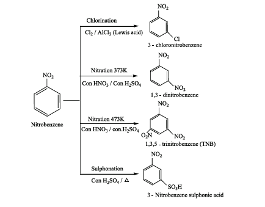
Nitrobenzene does not undergo Friedel-Crafts reactions due to the strong deactivating nature of -\( \mathrm{NO_2} \) group.
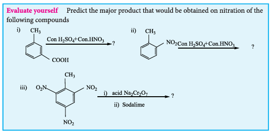

### 13.2 Amines - Classification
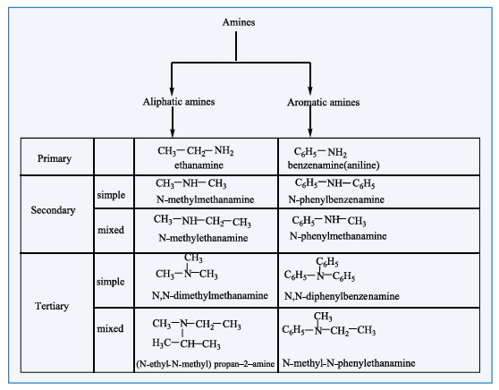
#### 13.2.1 Nomenclature

**a) Common system:** In common system, an aliphatic amine is named by prefixing alkyl group to amine. The prefixes di-, tri-, and tetra-, are used to describe two, three (or) four same substituents.

**b) IUPAC System:**
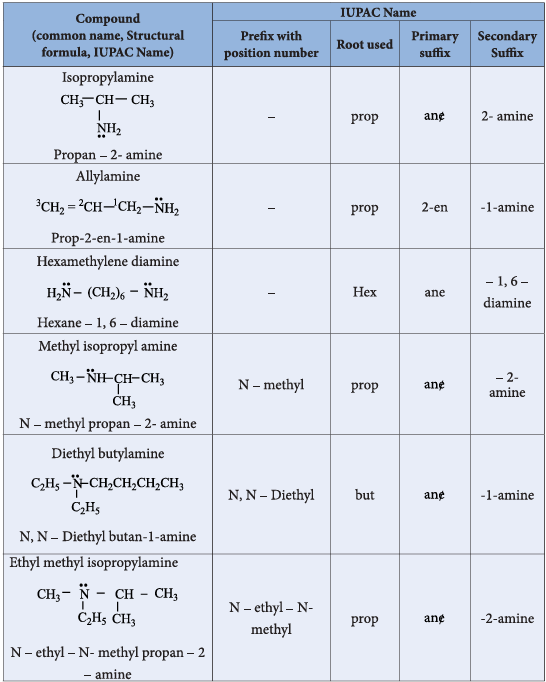
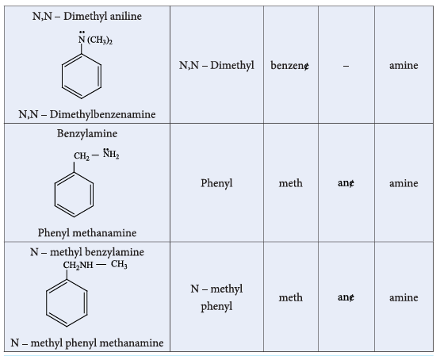

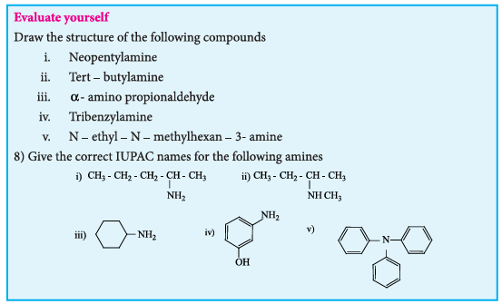
#### 13.2.2 Structure of amines

Like ammonia, nitrogen atom of amines is trivalent and carries a lone pair of electron and \( \mathrm{sp^3} \) hybridised. Out of the four \( \mathrm{sp^3} \) hybridised orbitals of nitrogen, three \( \mathrm{sp^3} \) orbitals overlap with orbitals of hydrogen (or) alkyl groups of carbon, the fourth \( \mathrm{sp^3} \) orbital contains a lone pair of electron. Hence, amines possess pyramidal geometry. Due to presence of lone pair of electron C-N-H (or) C-N-C bond angle is less than the normal tetrahedral bond angle \( 109.5^{\circ} \). For example, the C-N-C bond angle of trimethylamine is \( 108^{\circ} \) which is lower than tetrahedral angle and higher than the H-N-H bond angle of \( 107^{\circ} \). This increase is due to the repulsion between the bulky methyl groups.
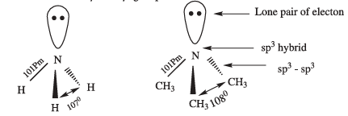
#### 13.2.3 General methods of preparation of Amines

Aliphatic and aromatic amines are prepared by the following methods.

**1) From nitro compounds**

Reduction of Nitro compounds using \( \mathrm{H_2/Ni} \) (or) \( \mathrm{Sn/HCl} \) or \( \mathrm{Pd/H_2} \) gives primary amines.
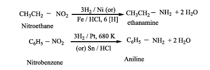
**2) From nitriles**

a) Reduction of alkyl or aryl cyanides with \( \mathrm{H_2/Ni} \) (or) \( \mathrm{LiAlH_4} \) (or) \( \mathrm{Na/C_2H_5OH} \) gives primary amines. The reduction reaction in which \( \mathrm{Na/C_2H_5OH} \) is used as a reducing agent is called Mendius reaction.

\[
\mathrm{CH_3-CN + 4[H] \xrightarrow{Na(Hg)/C_2H_5OH} CH_3CH_2-NH_2}
\]

b) Reduction of isocyanides with sodium amalgam/\( \mathrm{C_2H_5OH} \) gives secondary amines.

\[
\mathrm{CH_3-NC + 4[H] \xrightarrow{Na(Hg)/C_2H_5OH} CH_3-NH-CH_3}
\]

**3) From amides**

a) Reduction of amides with \( \mathrm{LiAlH_4} \) gives amines.
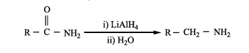
b) **Hofmann's degradation reaction**

When Amides are treated with bromine in the presence of aqueous or ethanolic solution of KOH, primary amines with one carbon atom less than the parent amides are obtained.
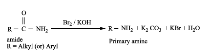
**Example:**

**4) From alkyl halides**

**a) Gabriel phthalimide synthesis**

Gabriel synthesis is used for the preparation of Aliphatic primary amines. Phthalimide on treatment with ethanolic KOH forms potassium salt of phthalimide which on heating with alkyl halide followed by alkaline hydrolysis gives primary amine. Aniline cannot be prepared by this method because the aryl halides do not undergo nucleophilic substitution with the anion formed by phthalimide.
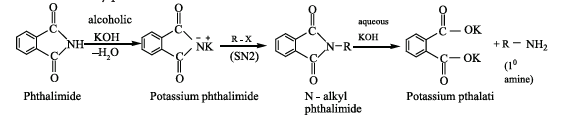
**b) Hofmann's ammonolysis**

When Alkyl halides (or) benzyl halides are heated with alcoholic ammonia in a sealed tube, mixtures of \( 1^{\circ} \), \( 2^{\circ} \) and \( 3^{\circ} \) amines and quaternary ammonium salts are obtained.
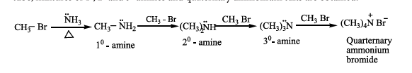
This is a nucleophilic substitution, the halide ion of alkyl halide is substituted by the \( -\mathrm{NH_2} \) group. The product primary amine so formed can also has a tendency to act as a nucleophile and hence if excess alkyl halide is taken, further nucleophilic substitution takes place leading to the formation of quarternary ammonium salt. However, if the process is carried out with excess ammonia, primary amine is obtained as the major product.

The order of reactivity of alkyl halides with amines: \( \mathrm{RI > RBr > RCl} \)

c) Alkyl halide can also be converted to primary amine by treating it with sodium azide \( \mathrm{(NaN_3)} \) followed by the reduction using lithium aluminium hydride.

\[
\mathrm{CH_3Br \xrightarrow{NaN_3} CH_3N_3 \xrightarrow{LiAlH_4} CH_3NH_2 + N_2}
\]

d) **Preparation of aniline from chlorobenzene**

When chlorobenzene is heated with alcoholic ammonia, aniline is obtained.
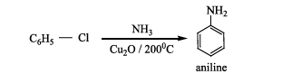
**5) Ammonolysis of hydroxyl compounds**

a) When vapour of an alcohol and ammonia are passed over alumina, \( \mathrm{WO_5} \) (or) silica at \( 400^{\circ}C \), all types of amines are formed. This method is called Sabatier-Maillhe method.
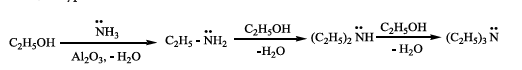

b) Phenol reacts with ammonia at \( 300^{\circ}C \) in the presence of anhydrous \( \mathrm{ZnCl_2} \) to give aniline.
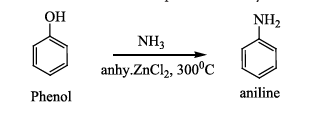
#### 13.2.4 Properties of amines

**1. Physical state and smell**

The lower aliphatic amines \( (C_1-C_2) \) are colourless gases and have ammonia like smell and those with four or more carbons are volatile liquids with fish like smell.

Aniline and other arylamines are usually colourless but when exposed to air they become coloured due to oxidation.

**2. Boiling point**

Due to the polar nature of primary and secondary amines, can form intermolecular hydrogen bonds using their lone pair of electrons on nitrogen atom. There is no such H-bonding in tertiary amines.

The boiling point of various amines follows the order, \( \mathrm{CH_3NH_2 > (CH_3)_2NH > (CH_3)_3N} \) i.e., \( 1^{\circ} > 2^{\circ} > 3^{\circ} \)
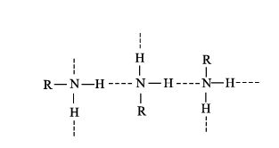
Amines have lower boiling point than alcohols because nitrogen has lower electronegative value than oxygen and hence the N-H bond is less polar than -OH bond.

**Table: Boiling points of amines, alcohols and alkanes of comparable molecular weight.**

| S.No. | Compound | Molecular mass | Boiling point (K) |
|---|---|---|---|
| 1. | \( \mathrm{CH_3(CH_2)_2NH_2} \) | 59 | 321 |
| 2. | \( \mathrm{C_2H_5-NH-CH_3} \) | 59 | 308 |
| 3. | \( \mathrm{(CH_3)_3N} \) | 59 | 277 |
| 4. | \( \mathrm{CH_3CH(OH)CH_3} \) | 60 | 355 |
| 5. | \( \mathrm{CH_3CH_2CH_2CH_3} \) | 58 | 272.5 |

**3) Solubility**

Lower aliphatic amines are soluble in water, because they can form hydrogen bonds with water molecules. However, solubility decreases with increase in molecular mass of amines due to increase in size of the hydrophobic alkyl group. Amines are insoluble in water but readily soluble in organic solvents like benzene, ether etc.

#### 13.2.5 Chemical properties

The lone pair of electrons on nitrogen atom in amines makes them basic as well as nucleophilic. They react with acids to form salts and also react with electrophiles.

They form salts with mineral acids.

**Example:**
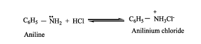
**Expression for basic strength of amines**

In the aqueous solutions, the following equilibrium exists and it lies far to the left, hence amines are weak bases compared to NaOH.
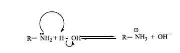

basicity constant
\[
K_b = \frac{[\mathrm{RNH_3^+}][\mathrm{OH^-}]}{[\mathrm{RNH_2}]}
\]

The basicity constant \( K_b \) gives a measure of the extent to which the amine accepts the hydrogen ion \( (H^+) \) from water.

We know that, larger the value of \( K_b \) or smaller the value of \( pK_b \), stronger is the base.

**Table: \( pK_b \) values of Amines in Aqueous solution. (\( pK_b \) for \( \mathrm{NH_3} \) is 4.74)**

| Amines | pK_b | Amines | pK_b | Amines | pK_b |
|---|---|---|---|---|---|
| \( \mathrm{CH_3NH_2} \) | 3.38 | \( \mathrm{C_2H_5NH_2} \) | 3.29 | \( \mathrm{C_6H_5CH_2NH_2} \) | 4.70 |
| \( \mathrm{(CH_3)_2NH} \) | 3.28 | \( \mathrm{(C_2H_5)_2NH} \) | 3.00 | \( \mathrm{C_6H_5NHCH_3} \) | 9.30 |
| \( \mathrm{(CH_3)_3N} \) | 4.22 | \( \mathrm{(C_2H_5)_3N} \) | 3.25 | \( \mathrm{C_6H_5N(CH_3)_2} \) | 8.92 |

**Influence of structure on basic character of amines**

The factors which increase the availability of electron pair on nitrogen for sharing with an acid will increase the basic character of an amine. When a \( +I \) group like an alkyl group is attached to the nitrogen, it increases the electron density on nitrogen which makes the electron pair readily available for protonation.

Consider the reaction of an alkyl amine \( \text{R-NH}_2 \) with a proton.

a) Hence alkyl amines are stronger bases than ammonia.
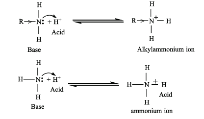
The electron-releasing alkyl group R pushes electron towards nitrogen in the amine \( \mathrm{(R-\ddot{N}H_2)} \) and provides unshared electron pair more available for sharing with proton.

Therefore, the expected order of basicity of aliphatic amines (in gas phase) is
\[
\mathrm{R_3N > R_2NH > RNH_2}
\]

The above order is not regular in their aqueous solution as evident by their \( pK_b \) values given in the table.

To compare the basicity of amines, the inductive effect, solvation effect, steric hindrance, etc., should be taken into consideration.

**Solvation effect**

In the aqueous solution, the substituted ammonium cations get stabilized not only by electron releasing \( (+I) \) effect of the alkyl group but also by solvation with water molecules. The greater the size of the ion, lesser will be the solvation. The order of stability of the protonated amines is greater the size of the ion, lesser is the solvation and lesser is the stability. In case of secondary and tertiary amines, due to steric hindrance, the alkyl groups decrease the number of water molecules that can approach the protonated amine. Therefore the order of basicity is,
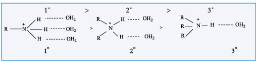

Based on these effects we can conclude that the order of basic strength in case of alkyl substituted amines in aqueous solution is
\[
\mathrm{(CH_3)_2NH > CH_3NH_2 > (CH_3)_3N > NH_3}
\]
\[
\mathrm{(C_2H_5)_2NH > (C_2H_5)_3N > C_2H_5NH_2 > NH_3}
\]

The resultant of \( +I \) effect, steric effect and hydration effect cause the \( 2^{\circ} \) amine, more basic.

**Basic strength of aniline**

In aniline, the \( \mathrm{NH_2} \) group is directly attached to the benzene ring. The lone pair of electron on nitrogen atom in aniline gets delocalised over the benzene ring and hence it is less available for protonation. This makes the aromatic amines (aniline) less basic than \( \mathrm{NH_3} \).

In case of substituted aniline, electron releasing groups like \( -\mathrm{CH_3}, -\mathrm{OCH_3}, -\mathrm{NH_2} \) increase the basic strength and electron withdrawing group like \( -\mathrm{NO_2}, -\mathrm{X}, -\mathrm{COOH} \) decrease the basic strength.

**Table: \( pK_b \)'s of substituted anilines (\( pK_b \) value of aniline is 9.376)**

| Substituent | pK_b | Substituent | pK_b | Substituent | pK_b |
|---|---|---|---|---|---|
| o-\( \mathrm{CH_3} \) | 9.60 | m-\( \mathrm{CH_3} \) | 9.31 | p-\( \mathrm{CH_3} \) | 8.92 |
| o-\( \mathrm{NH_2} \) | 9.52 | m-\( \mathrm{NH_2} \) | 9.00 | p-\( \mathrm{NH_2} \) | 7.83 |
| o-\( \mathrm{OCH_3} \) | 9.52 | m-\( \mathrm{OCH_3} \) | 9.70 | p-\( \mathrm{OCH_3} \) | 8.70 |
| o-\( \mathrm{NO_2} \) | 14.30 | m-\( \mathrm{NO_2} \) | 11.52 | p-\( \mathrm{NO_2} \) | 13.00 |
| o-\( \mathrm{Cl} \) | 11.25 | m-\( \mathrm{Cl} \) | 10.52 | p-\( \mathrm{Cl} \) | 10.00 |

The relative basicity of amines follows the below mentioned order

Alkyl amines > Aralkyl amines > Ammonia > N-Aralkyl amines > Aryl amines

#### 13.2.6 Chemical properties of amines

**1) Alkylation**

Amines reacts with alkyl halides to give successively \( 2^{\circ} \) and \( 3^{\circ} \) amines and quaternary ammonium salts.
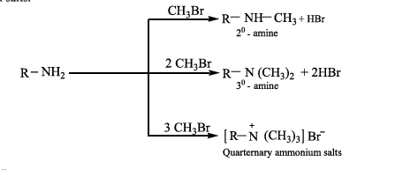
**2) Acylation**

Aliphatic / aromatic primary and secondary amines react with acetyl chloride (or) acetic anhydride in presence of pyridine to form N-alkyl acetamide.
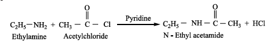
**3) Schotten-Baumann reaction**

Aniline reacts with benzoylchloride \( \mathrm{(C_6H_5COCl)} \) in the presence of NaOH to give N-phenylbenzamide. This reaction is known as Schotten-Baumann reaction. The acylation and benzoylation are nucleophilic substitutions.
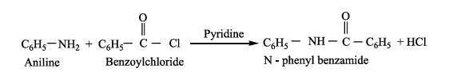
**4) Reaction with nitrous acid**

Three classes of amines react differently with nitrous acid which is prepared in situ from a mixture of \( \mathrm{NaNO_2} \) and HCl.

**a) Primary amines**

i) Ethylamine reacts with nitrous acid to give ethyl diazonium chloride, which is unstable and it is converted to ethanol by liberating \( \mathrm{N_2} \).

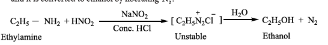

ii) Aniline reacts with nitrous acid at low temperature \( (273-278\mathrm{K}) \) to give benzene diazonium chloride which is stable for a short time and slowly decomposes even at low temperatures. This reaction is known as diazotization.
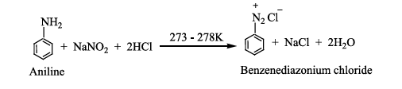
**b) Secondary amines**

Alkyl and aryl secondary amines react with nitrous acid to give N-nitroso amine as yellow oily liquid which is insoluble in water.

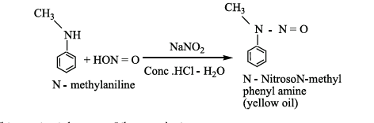
This reaction is known as Libermann's nitroso test.

**c) Tertiary amine**

i) Aliphatic tertiary amine reacts with nitrous acid to form trialkyl ammonium nitrite salt, which is soluble in water.
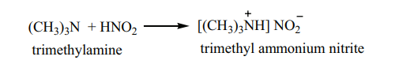
ii) Aromatic tertiary amine reacts with nitrous acid at 273K to give p-nitroso compound.
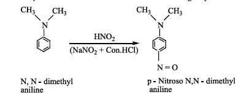
**5) Carbylamine reaction**

Aliphatic (or) aromatic primary amines react with chloroform and alcoholic KOH to give isocyanides (carbylamines), which has an unpleasant smell. This reaction is known as carbylamine test. This test is used to identify the primary amines.

\[
\mathrm{C_2H_5-NH_2 + CHCl_3 + 3KOH \longrightarrow C_2H_5-NC + 3KCl + 3H_2O}
\]

**6) Mustard oil reaction**

i) When primary amines are treated with carbon disulphide \( \mathrm{(CS_2)} \), N-alkylthiocarbamic acid is formed which on subsequent treatment with \( \mathrm{HgCl_2} \), gives an alkyl isothiocyanate.

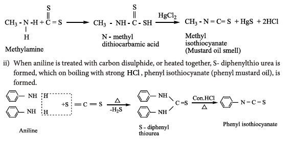
These reactions are known as Hofmann-Mustard oil reaction. This test is used to identify the primary amines.

**7. Electrophilic substitution reactions in Aniline**

The \( -\mathrm{NH_2} \) group is a strong activating group. In aniline the \( \mathrm{NH_2} \) group is directly attached to the benzene ring, the lone pair of electrons on the nitrogen is in conjugation with benzene ring which increases the electron density at ortho and para position, thereby facilitating the electrophilic attack at ortho and para positions.

**i) Bromination**

Aniline reacts with \( \mathrm{Br_2/H_2O} \) to give 2,4,6-tribromo aniline a white precipitate.
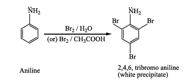
To get mono bromo compounds, \( -\mathrm{NH_2} \) is first acylated to reduce its activity.
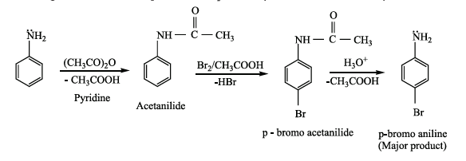
When aniline is acylated, the lone pair of electron on nitrogen is delocalised by the neighbouring carbonyl group by resonance. Hence it is not easily available for conjugation with benzene ring.
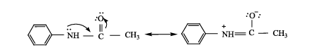
The acetylamino group is thus less activating than the amino group in electrophilic substitution reaction.

**ii) Nitration**

Direct nitration of aniline gives o- and p-nitroaniline along with dark coloured 'tars' due to oxidation. Moreover in a strong acid medium aniline is protonated to form anilinium ion which is m-directing and hence m-nitroaniline is also formed.
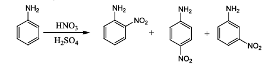
To get para product, the \( -\mathrm{NH_2} \) group is protected by acetylation with acetic anhydride. Then, the nitrated product is hydrolysed to form the product.

**iii) Sulphonation**

Aniline reacts with Conc. \( \mathrm{H_2SO_4} \) to form anilinium hydrogen sulphate which on heating with \( \mathrm{H_2SO_4} \) at 453-473K gives p-aminobenzenesulphonic acid, commonly known as sulphanilic acid, as the major product.

**iv) Aniline**

It does not undergo Friedel-Crafts reaction (alkylation and acetylation). We know aniline is basic in nature and it donates its lone pair to the Lewis acid \( \mathrm{AlCl_3} \) to form an adduct which inhibits further the electrophilic substitution reaction.

### 13.3 DIAZONIUM SALTS

#### 13.3.1 Introduction

We have just learnt that aromatic amines on treatment with \( \mathrm{(NaNO_2 + HCl)} \) gives diazonium salts. They are stable only for a short time and hence are used immediately after preparation.

#### 13.3.2 Resonance structure

The stability of arene diazonium salt is due to the dispersal of the positive charge over the benzene ring.

#### 13.3.3 Method of preparation of Diazonium salts

We have already learnt that benzene diazonium chloride is prepared by the reaction of aniline with nitrous acid (Which is produced by the reaction of \( \mathrm{NaNO_2} \) and HCl) at 273-278K.

#### 13.3.4 Physical properties

- Benzene diazonium chloride is a colourless, crystalline solid.
- These are readily soluble in water and stable in cold water. However it reacts with warm water.
- Their aqueous solutions are neutral to litmus and conduct electricity due to the presence of ions.
- Benzenediazonium tetrafluoroborate is soluble in water and stable at room temperature.

#### 13.3.5 Chemical reactions

Benzene diazonium chloride gives two types of chemical reactions:

A. Replacement reactions involving loss of nitrogen

In these reactions diazonium group is replaced by nucleophiles such as \( \mathrm{X, CN, H, OH} \) etc.

B. Reactions involving retention of diazo group (Coupling reaction).

**A. Replacement reactions involving loss of nitrogen**

**1. Replacement by hydrogen**

Benzene diazonium chloride on reduction with mild reducing agents like hypophosphorous acid (phosphinic acid) or ethanol in the presence of cuprous ion gives benzene. This reaction proceeds through a free-radical chain mechanism.

**2. Replacement by Chlorine, Bromine, Cyanide group**

**a) Sandmeyer reaction**

On mixing freshly prepared solution of benzene diazonium chloride with cuprous halides (chlorides and bromides), aryl halides are obtained. This reaction is called Sandmeyer reaction.

When diazonium salts are treated with cuprous cyanide, cyanobenzene is obtained.

**b) Gattermann reaction**

Conversion of benzene diazonium chloride into chloro/bromo arenes can also be effected using hydrochloric/hydrobromic acid and copper powder. This reaction is called Gattermann reaction.

The yield in Sandmeyer reaction is found to be better than the Gattermann reaction.

**3. Replacement by iodine**

Aqueous solution of benzene diazonium chloride is warmed with KI to form iodobenzene.

\[
\mathrm{C_6H_5N_2Cl + KI \longrightarrow C_6H_5I + KCl + N_2}
\]

**4. Replacement of fluorine (Balz-Schiemann reaction)**

When benzene diazonium chloride is treated with fluoroboric acid, benzene diazonium tetrafluoroborate is precipitated which on heating decomposes to give fluorobenzene.

**5. Replacement by hydroxyl group**

Benzene diazonium chloride solution is added slowly to a large volume of boiling water to get phenol.

**6. Replacement by nitro group**

When diazonium fluoroborate is heated with aqueous sodium nitrite solution in the presence of copper, the diazonium group is replaced by \( -\mathrm{NO_2} \) group.

**7. Replacement by aryl group (Gomberg reaction)**

Benzene diazonium chloride reacts with benzene in the presence of sodium hydroxide to give biphenyl. This reaction is known as the Gomberg reaction.

**8. Replacement by carboxylic acid group**

When diazonium fluoroborate is heated with acetic acid, benzoic acid is obtained. This reaction is used to convert aliphatic carboxylic acid into aromatic carboxylic acid.

**B. Reactions involving retention of diazo group**

**9. Reduction to hydrazines**

Certain reducing agents like \( \mathrm{SnCl_2/HCl} \); Zn dust/\( \mathrm{CH_3COOH} \), sodium hydrosulphite, sodium sulphite etc. reduce benzene diazonium chloride to phenyl hydrazine.

**10. Coupling reactions**

Benzene diazonium chloride reacts with electron rich aromatic compounds like phenol, aniline to form brightly coloured azo compounds. Coupling generally occurs at the para position. If para position is occupied then coupling occurs at the ortho position. Coupling tendency is enhanced if an electron donating group is present at the para-position to \( -\mathrm{N_2^+Cl^-} \) group. This is an electrophilic substitution.

Aryl fluorides and iodides cannot be prepared by direct halogenation and the cyano group cannot be introduced by nucleophilic substitution of chlorine in chlorobenzene. For introducing such a halide group, cyano group -OH, \( \mathrm{NO_2} \) etc., benzenediazonium chloride is a very good intermediate. Diazo compounds obtained from the coupling reactions of diazonium salts are coloured and are used as dyes.

### 13.4 CYANIDES AND ISOCYANIDES

#### 13.4.1 Introduction

These are the derivatives of hydrocyanic acid (HCN), and is known to exist in two tautomeric forms

Two types of alkyl derivatives can be obtained. Those derived by replacement of H-atom of hydrogen cyanide by the alkyl groups are known as alkyl cyanides \( \mathrm{(R-C\equiv N)} \). and those obtained by the replacement of H-atom of hydrogen isocyanide are known as alkyl isocyanides \( \mathrm{(R-N\equiv C)} \).

In IUPAC system, alkyl cyanides are named as "alkanenitriles" whereas aryl cyanides as "arenecarbonitrile".

**Table: Nomenclature of cyanides**

#### 13.4.2 Methods of preparation of cyanides

#### 13.4.3 Properties of Cyanides

**Physical Properties**

The lower members (up to \( \mathrm{C_{14}} \)) are colourless liquids with a strong characteristic sweet smell. The higher members are crystalline solids. They are moderately soluble in water but freely soluble in organic solvents. They are poisonous.

They have higher boiling points than analogous acetylenes due to their high dipole moments.

#### 13.4.4 Chemical properties

**1. Hydrolysis**

On boiling with alkali (or) a dilute mineral acid, the cyanides are hydrolysed to give carboxylic acids.

**2. Reduction**

On reduction with \( \mathrm{LiAlH_4} \) (or) \( \mathrm{Ni/H_2} \), alkyl cyanides yields primary amines.

**3. Condensation reaction**

**a) Thorpe nitrile condensation**

Self condensation of two molecules of alkyl nitrile (containing \( \alpha \)-H atom) in the presence of sodium to form iminonitrile.

**b) The nitriles containing \( \alpha \)-hydrogen also undergo condensation with esters in the presence of sodamide in ether to form ketonitriles.** This reaction is known as "Levine and Hauser" acetylation. This reaction involves replacement of ethoxy \( \mathrm{(OC_2H_5)} \) group by methylnitrile (-CH\(_2\)CN) group and is called as cyanomethylation reaction.

#### 13.4.5 Alkyl Isocyanides (Carbylamines)

**Nomenclature of isocyanides**

They are commonly named as Alkyl isocyanides. The IUPAC system names them as alkylcarbylamines.

**Table: Nomenclature of alkylisocyanides**

| Structural formula | Common name | IUPAC name |
|---|---|---|
| \( \mathrm{CH_3-NC} \) | Methyl isocyanide | Methylcarbylamine |
| \( \mathrm{CH_3CH_2-NC} \) | Ethylisocyanide | Ethylcarbylamine |
| \( \mathrm{CH_3CH_2CH_2-NC} \) | Propyl isocyanide | Propylcarbylamine |
| \( \mathrm{C_6H_5-NC} \) | Phenyl isocyanide | Phenylcarbylamine |

#### 13.4.6 Methods of preparation of isocyanides

**1. From primary amines (Carbylamine reaction)**

Both aromatic as well as aliphatic amines on treatment with \( \mathrm{CHCl_3} \) in the presence of KOH give carbylamines.

**2. From alkyl halides**

Ethyl bromide on heating with ethanolic solution of AgCN give ethyl isocyanide as major product and ethyl cyanide as minor product.

**3. From N-alkyl formamide By reaction with \( \mathrm{POCl_3} \) in pyridine.**

#### 13.4.7 Properties of isocyanides

**Physical properties**

- They are colourless, highly unpleasant smelling volatile liquids and are much more poisonous than the cyanides.
- They are only slightly soluble in water but are soluble in organic solvents.
- They are relatively less polar than alkyl cyanides. Thus, their melting point and boiling point are lower than cyanides.

#### 13.4.8 Chemical properties

#### 13.4.9 Uses of organic nitrogen compounds

**Nitroalkanes**

1. Nitromethane is used as a fuel for cars.
2. Chloropicrin \( \mathrm{(CCl_3NO_2)} \) is used as an insecticide.
3. Nitroethane is used as a fuel additive and precursor to explosives and they are good solvents for polymers, cellulose ester, synthetic rubber and dyes etc.
4. 4% solution of ethyl nitrite in alcohol is known as sweet spirit of nitre and is used as diuretic.

**Nitrobenzene**

1. Nitrobenzene is used to produce lubricating oils in motors and machinery.
2. It is used in the manufacture of dyes, drugs, pesticides, synthetic rubber, aniline and explosives like TNT, TNB.

**Cyanides and Isocyanides**

1. Alkyl cyanides are important intermediates in the organic synthesis of larger number of compounds like acids, amides, esters, amines etc.
2. Nitriles are used in textile industry in the manufacture of nitrile rubber and also as a solvent particularly in perfume industry.

**Do You Know**

**Cancer Drug:** Mitomycin C, an anticancer agent used to treat stomach and colon cancer, contains an aziridine ring. The aziridine functional group participates in the drug's degradation by DNA, resulting in the death of cancerous cells.
