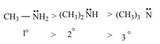
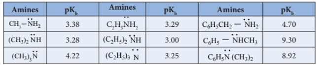
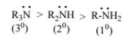
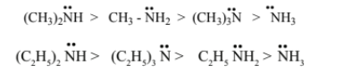
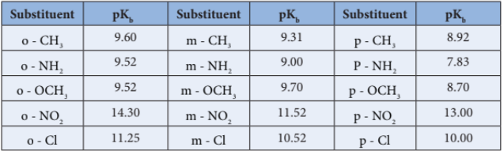
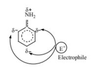

### 13.2 Amines - Classification

#### 13.2.1 Nomenclature

**a) Common system:** In common system, an aliphatic amine is named by prefixing alkyl group to amine. The prefixes di-, tri-, and tetra-, are used to describe two, three (or) four same substituents.

**b) IUPAC System:**

#### 13.2.2 Structure of amines

Like ammonia, nitrogen atom of amines is trivalent and carries a lone pair of electron and \( \mathrm{sp^3} \) hybridised, out of the four \( \mathrm{sp^3} \) hybridised orbitals of nitrogen, three \( \mathrm{sp^3} \) orbitals overlap with orbitals of hydrogen (or) alkyl groups of carbon, the fourth \( \mathrm{sp^3} \) orbital contains a lone pair of electron. Hence, amines possess pyramidal geometry. Due to presence of lone pair of electron C-N-H (or) C-N-C bond angle is less than the normal tetrahedral bond angle \( 109.5^{\circ} \). For example, the C-N-C bond angle of trimethylamine is \( 108^{\circ} \) which is lower than tetrahedral angle and higher than the H-N-H bond angle of \( 107^{\circ} \). This increase is due to the repulsion between the bulky methyl groups.

#### 13.2.3 General methods of preparation of Amines

Aliphatic and aromatic amines are prepared by the following methods.

**1) From nitro compounds**

Reduction of Nitro compounds using \( \mathrm{H_2/Ni} \) (or) \( \mathrm{Sn/HCl} \) or \( \mathrm{Pd/H_2} \) gives primary amines.

**2) From nitriles**

a) Reduction of alkyl or aryl cyanides with \( \mathrm{H_2/Ni} \) (or) \( \mathrm{LiAlH_4} \) (or) \( \mathrm{Na/C_2H_5OH} \) gives primary amines. The reduction reaction in which \( \mathrm{Na/C_2H_5OH} \) is used as a reducing agent is called Mendius reaction.

$$\underset{\text{ethanenitrile}}{\text{CH}_3{\color{black}\boldsymbol{-}}\text{CN}} \xrightarrow[4\text{ [H]}]{\text{Na(Hg) / C}_2\text{H}_5\text{OH}} \underset{\text{ethanamine}}{\text{CH}_3\text{CH}_2{\color{black}\boldsymbol{-}}\text{NH}_2}$$

b) Reduction of isocyanides with sodium amalgam/\( \mathrm{C_2H_5OH} \) gives secondary amines.

$$\underset{\text{Methyl isocyanide}}{\text{CH}_3{\color{black}\boldsymbol{-}}\text{NC}} \xrightarrow[4\text{ [H]}]{\text{Na(Hg) / C}_2\text{H}_5\text{OH}} \underset{\text{N-methylmethanamine}}{\text{CH}_3{\color{black}\boldsymbol{-}}\text{NH}{\color{black}\boldsymbol{-}}\text{CH}_3}$$

**3) From amides**

a) Reduction of amides with \( \mathrm{LiAlH_4} \) gives amines.

b) **Hofmann's degradation reaction**

When Amides are treated with bromine in the presence of aqueous or ethanolic solution of KOH, primary amines with one carbon atom less than the parent amides are obtained.

**4) From alkyl halides**

**a) Gabriel phthalimide synthesis**

Gabriel synthesis is used for the preparation of Aliphatic primary amines. Phthalimide on treatment with ethanolic KOH forms potassium salt of phthalimide which on heating with alkyl halide followed by alkaline hydrolysis gives primary amine. Aniline cannot be prepared by this method because the aryl halides do not undergo nucleophilic substitution with the anion formed by phthalimide.

**b) Hofmann's ammonolysis**

When Alkyl halides (or) benzyl halides are heated with alcoholic ammonia in a sealed tube, mixtures of \( 1^{\circ} \), \( 2^{\circ} \) and \( 3^{\circ} \) amines and quaternary ammonium salts are obtained.

This is a nucleophilic substitution, the halide ion of alkyl halide is substituted by the \( -\mathrm{NH_2} \) group. The product primary amine so formed can also has a tendency to act as a nucleophile and hence if excess alkyl halide is taken, further nucleophilic substitution takes place leading to the formation of quarternary ammonium salt. However, if the process is carried out with excess ammonia, primary amine is obtained as the major product.

The order of reactivity of alkyl halides with amines: \( \mathrm{RI > RBr > RCl} \)

c) Alkyl halide can also be converted to primary amine by treating it with sodium azide \( \mathrm{(NaN_3)} \) followed by the reduction using lithium aluminium hydride.

$$\underset{\text{Methylbromide}}{\text{CH}_3{\color{black}\boldsymbol{-}}\text{Br}} \xrightarrow{\text{NaN}_3} \underset{\text{Methyl azide}}{\text{CH}_3{\color{black}\boldsymbol{-}}\text{N}_3} \xrightarrow{\text{LiAlH}_4} \underset{\text{Methylamine}}{\text{CH}_3{\color{black}\boldsymbol{-}}\text{NH}_2} + \text{N}_2$$

d) **Preparation of aniline from chlorobenzene**

When chlorobenzene is heated with alcoholic ammonia, aniline is obtained.

**5) Ammonolysis of hydroxyl compounds**

a) When vapour of an alcohol and ammonia are passed over alumina, \( \mathrm{W_2O_5} \) (or) silica at \( 400^{\circ}C \), all types of amines are formed. This method is called Sabatier-Maillhe method.

b) Phenol reacts with ammonia at \( 300^{\circ}C \) in the presence of anhydrous \( \mathrm{ZnCl_2} \) to give aniline.

#### 13.2.4 Properties of amines

**1. Physical state and smell**

The lower aliphatic amines \( (C_1-C_2) \) are colourless gases and have ammonia like smell and those with four or more carbons are volatile liquids with fish like smell.

Aniline and other arylamines are usually colourless but when exposed to air they become coloured due to oxidation.

**2. Boiling point**

Due to the polar nature of primary and secondary amines, can form intermolecular hydrogen bonds using their lone pair of electrons on nitrogen atom. There is no such H-bonding in tertiary amines.

The boiling point of various amines follows the order,

Amines have lower boiling point than alcohols because nitrogen has lower electronegative value than oxygen and hence the N-H bond is less polar than -OH bond.

**Table: Boiling points of amines, alcohols and alkanes of comparable molecular weight.**

| S.No. | Compound | Molecular mass | Boiling point (K) |
|---|---|---|---|
| 1. | \( \mathrm{CH_3(CH_2)_2NH_2} \) | 59 | 321 |
| 2. | \( \mathrm{C_2H_5-NH-CH_3} \) | 59 | 308 |
| 3. | \( \mathrm{(CH_3)_3N} \) | 59 | 277 |
| 4. | \( \mathrm{CH_3CH(OH)CH_3} \) | 60 | 355 |
| 5. | \( \mathrm{CH_3CH_2CH_2CH_3} \) | 58 | 272.5 |

**3) Solubility**

Lower aliphatic amines are soluble in water, because they can form hydrogen bonds with water molecules. However, solubility decreases with increase in molecular mass of amines due to increase in size of the hydrophobic alkyl group. Amines are insoluble in water but readily soluble in organic solvents like benzene, ether etc.

#### 13.2.5 Chemical properties

The lone pair of electrons on nitrogen atom in amines makes them basic as well as nucleophilic. They react with acids to form salts and also react with electrophiles.

They form salts with mineral acids.

**Example:**

**Expression for basic strength of amines**

In the aqueous solutions, the following equilibrium exists and it lies far to the left, hence amines are weak bases compared to NaOH.

basicity constant
\[
K_b = \frac{[\mathrm{RNH_3^+}][\mathrm{OH^-}]}{[\mathrm{RNH_2}]}
\]

The basicity constant \( K_b \) gives a measure of the extent to which the amine accepts the hydrogen ion \( (H^+) \) from water.

We know that, larger the value of \( K_b \) or smaller the value of \( pK_b \), stronger is the base.

**Table: \( pK_b \) values of Amines in Aqueous solution. (\( pK_b \) for \( \mathrm{NH_3} \) is 4.74)**

**Influence of structure on basic character of amines**

The factors which increase the availability of electron pair on nitrogen for sharing with an acid will increase the basic character of an amine. When a \( +I \) group like an alkyl group is attached to the nitrogen, it increases the electron density on nitrogen which makes the electron pair readily available for protonation.

Consider the reaction of an alkyl amine \( \text{R-NH}_2 \) with a proton.

a) Hence alkyl amines are stronger bases than ammonia.

The electron-releasing alkyl group R pushes electron towards nitrogen in the amine \( \mathrm{(R-\ddot{N}H_2)} \) and provides unshared electron pair more available for sharing with proton.

Therefore, the expected order of basicity of aliphatic amines (in gas phase) is

The above order is not regular in their aqueous solution as evident by their \( pK_b \) values given in the table.

To compare the basicity of amines, the inductive effect, solvation effect, steric hindrance, etc., should be taken into consideration.

**Solvation effect**

In the aqueous solution, the substituted ammonium cations get stabilized not only by electron releasing \( (+I) \) effect of the alkyl group but also by solvation with water molecules. The greater the size of the ion, lesser will be the solvation. The order of stability of the protonated amines is greater the size of the ion, lesser is the solvation and lesser is the stability. In case of secondary and tertiary amines, due to steric hindrance, the alkyl groups decrease the number of water molecules that can approach the protonated amine. Therefore the order of basicity is,

Based on these effects we can conclude that the order of basic strength in case of alkyl substituted amines in aqueous solution is

The resultant of \( +I \) effect, steric effect and hydration effect cause the \( 2^{\circ} \) amine, more basic.

**Basic strength of aniline**

In aniline, the \( \mathrm{NH_2} \) group is directly attached to the benzene ring. The lone pair of electron on nitrogen atom in aniline gets delocalised over the benzene ring and hence it is less available for protonation. This makes the aromatic amines (aniline) less basic than \( \mathrm{NH_3} \).

In case of substituted aniline, electron releasing groups like \( -\mathrm{CH_3}, -\mathrm{OCH_3}, -\mathrm{NH_2} \) increase the basic strength and electron withdrawing group like \( -\mathrm{NO_2}, -\mathrm{X}, -\mathrm{COOH} \) decrease the basic strength.

**Table: \( pK_b \)'s of substituted anilines (\( pK_b \) value of aniline is 9.376)**

The relative basicity of amines follows the below mentioned order

Alkyl amines > Aralkyl amines > Ammonia > N-Aralkyl amines > Aryl amines

#### 13.2.6 Chemical properties of amines

**1) Alkylation**

Amines reacts with alkyl halides to give successively \( 2^{\circ} \) and \( 3^{\circ} \) amines and quaternary ammonium salts.

**2) Acylation**

Aliphatic / aromatic primary and secondary amines react with acetyl chloride (or) acetic anhydride in presence of pyridine to form N-alkyl acetamide.

**3) Schotten-Baumann reaction**

Aniline reacts with benzoylchloride \( \mathrm{(C_6H_5COCl)} \) in the presence of NaOH to give N-phenylbenzamide. This reaction is known as Schotten-Baumann reaction. The acylation and benzoylation are nucleophilic substitutions.

**4) Reaction with nitrous acid**

Three classes of amines react differently with nitrous acid which is prepared in situ from a mixture of \( \mathrm{NaNO_2} \) and HCl.

**a) Primary amines**

i) Ethylamine reacts with nitrous acid to give ethyl diazonium chloride, which is unstable and it is converted to ethanol by liberating \( \mathrm{N_2} \).

ii) Aniline reacts with nitrous acid at low temperature \( (273-278\mathrm{K}) \) to give benzene diazonium chloride which is stable for a short time and slowly decomposes even at low temperatures. This reaction is known as diazotization.

**b) Secondary amines**

Alkyl and aryl secondary amines react with nitrous acid to give N-nitroso amine as yellow oily liquid which is insoluble in water.

This reaction is known as Libermann's nitroso test.

**c) Tertiary amine**

i) Aliphatic tertiary amine reacts with nitrous acid to form trialkyl ammonium nitrite salt, which is soluble in water.

ii) Aromatic tertiary amine reacts with nitrous acid at 273K to give p-nitroso compound.

**5) Carbylamine reaction**

Aliphatic (or) aromatic primary amines react with chloroform and alcoholic KOH to give isocyanides (carbylamines), which has an unpleasant smell. This reaction is known as carbylamine test. This test is used to identify the primary amines.

$$\underset{\text{Ethylamine}}{\text{C}_2\text{H}_5{\color{black}\boldsymbol{-}}\text{NH}_2} + \underset{\text{Chloroform}}{\text{CHCl}_3} + 3\text{KOH} \longrightarrow \underset{\text{Ethylisocyanide}}{\text{C}_2\text{H}_5{\color{black}\boldsymbol{-}}\text{NC}} + 3\text{KCl} + 3\text{H}_2\text{O}$$

**6) Mustard oil reaction**

i) When primary amines are treated with carbon disulphide \( \mathrm{(CS_2)} \), N-alkylthiocarbamic acid is formed which on subsequent treatment with \( \mathrm{HgCl_2} \), gives an alkyl isothiocyanate.

These reactions are known as Hofmann-Mustard oil reaction. This test is used to identify the primary amines.

**7. Electrophilic substitution reactions in Aniline**

The \( -\mathrm{NH_2} \) group is a strong activating group. In aniline the \( \mathrm{NH_2} \) group is directly attached to the benzene ring, the lone pair of electrons on the nitrogen is in conjugation with benzene ring which increases the electron density at ortho and para position, thereby facilitating the electrophilic attack at ortho and para positions.

**i) Bromination**

Aniline reacts with \( \mathrm{Br_2/H_2O} \) to give 2,4,6-tribromo aniline a white precipitate.

To get mono bromo compounds, \( -\mathrm{NH_2} \) is first acylated to reduce its activity.

When aniline is acylated, the lone pair of electron on nitrogen is delocalised by the neighbouring carbonyl group by resonance. Hence it is not easily available for conjugation with benzene ring.

The acetylamino group is thus less activating than the amino group in electrophilic substitution reaction.

**ii) Nitration**

Direct nitration of aniline gives o- and p-nitroaniline along with dark coloured 'tars' due to oxidation. Moreover in a strong acid medium aniline is protonated to form anilinium ion which is m-directing and hence m-nitroaniline is also formed.

To get para product, the \( -\mathrm{NH_2} \) group is protected by acetylation with acetic anhydride. Then, the nitrated product is hydrolysed to form the product.

**iii) Sulphonation**

Aniline reacts with Conc. \( \mathrm{H_2SO_4} \) to form anilinium hydrogen sulphate which on heating with \( \mathrm{H_2SO_4} \) at 453-473K gives p-aminobenzenesulphonic acid, commonly known as sulphanilic acid, as the major product.

**iv) Aniline**

It does not undergo Friedel-Crafts reaction (alkylation and acetylation). We know aniline is basic in nature and it donates its lone pair to the Lewis acid \( \mathrm{AlCl_3} \) to form an adduct which inhibits further the electrophilic substitution reaction.
