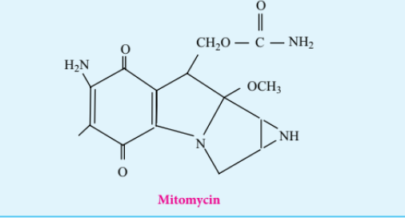

### 13.4 CYANIDES AND ISOCYANIDES

#### 13.4.1 Introduction

These are the derivatives of hydrocyanic acid (HCN), and is known to exist in two tautomeric forms

Two types of alkyl derivatives can be obtained. Those derived by replacement of H-atom of hydrogen cyanide by the alkyl groups are known as alkyl cyanides \( \mathrm{(R-C\equiv N)} \). and those obtained by the replacement of H-atom of hydrogen isocyanide are known as alkyl isocyanides \( \mathrm{(R-N\equiv C)} \).

In IUPAC system, alkyl cyanides are named as "alkanenitriles" whereas aryl cyanides as "arenecarbonitrile".

**Table: Nomenclature of cyanides**

#### 13.4.2 Methods of preparation of cyanides

#### 13.4.3 Properties of Cyanides

**Physical Properties**

The lower members (up to \( \mathrm{C_{14}} \)) are colourless liquids with a strong characteristic sweet smell. The higher members are crystalline solids. They are moderately soluble in water but freely soluble in organic solvents. They are poisonous.

They have higher boiling points than analogous acetylenes due to their high dipole moments.

#### 13.4.4 Chemical properties

**1. Hydrolysis**

On boiling with alkali (or) a dilute mineral acid, the cyanides are hydrolysed to give carboxylic acids.

**2. Reduction**

On reduction with \( \mathrm{LiAlH_4} \) (or) \( \mathrm{Ni/H_2} \), alkyl cyanides yields primary amines.

**3. Condensation reaction**

**a) Thorpe nitrile condensation**

Self condensation of two molecules of alkyl nitrile (containing \( \alpha \)-H atom) in the presence of sodium to form iminonitrile.

b) The nitriles containing \( \alpha \)-hydrogen also undergo condensation with esters in the presence of sodamide in ether to form ketonitriles.This reaction is known as "Levine and Hauser" acetylation. This reaction involves replacement of ethoxy \( \mathrm{(OC_2H_5)} \) group by methylnitrile (-CH\(_2\)CN) group and is called as cyanomethylation reaction.

#### 13.4.5 Alkyl Isocyanides (Carbylamines)

**Nomenclature of isocyanides**

They are commonly named as Alkyl isocyanides. The IUPAC system names them as alkylcarbylamines.

**Table: Nomenclature of alkylisocyanides**

| Structural formula | Common name | IUPAC name |
|---|---|---|
| \( \mathrm{CH_3-NC} \) | Methyl isocyanide | Methylcarbylamine |
| \( \mathrm{CH_3CH_2-NC} \) | Ethylisocyanide | Ethylcarbylamine |
| \( \mathrm{CH_3CH_2CH_2-NC} \) | Propyl isocyanide | Propylcarbylamine |
| \( \mathrm{C_6H_5-NC} \) | Phenyl isocyanide | Phenylcarbylamine |

#### 13.4.6 Methods of preparation of isocyanides

**1. From primary amines (Carbylamine reaction)**

Both aromatic as well as aliphatic amines on treatment with \( \mathrm{CHCl_3} \) in the presence of KOH give carbylamines.

**2. From alkyl halides**

Ethyl bromide on heating with ethanolic solution of AgCN give ethyl isocyanide as major product and ethyl cyanide as minor product.

**3. From N-alkyl formamide By reaction with \( \mathrm{POCl_3} \) in pyridine.**

#### 13.4.7 Properties of isocyanides

**Physical properties**

- They are colourless, highly unpleasant smelling volatile liquids and are much more poisonous than the cyanides.
- They are only slightly soluble in water but are soluble in organic solvents.
- They are relatively less polar than alkyl cyanides. Thus, their melting point and boiling point are lower than cyanides.

#### 13.4.8 Chemical properties

#### 13.4.9 Uses of organic nitrogen compounds

**Nitroalkanes**

1. Nitromethane is used as a fuel for cars.
2. Chloropicrin \( \mathrm{(CCl_3NO_2)} \) is used as an insecticide.
3. Nitroethane is used as a fuel additive and precursor to explosives and they are good solvents for polymers, cellulose ester, synthetic rubber and dyes etc.
4. 4% solution of ethyl nitrite in alcohol is known as sweet spirit of nitre and is used as diuretic.

**Nitrobenzene**

1. Nitrobenzene is used to produce lubricating oils in motors and machinery.
2. It is used in the manufacture of dyes, drugs, pesticides, synthetic rubber, aniline and explosives like TNT, TNB.

**Cyanides and Isocyanides**

1. Alkyl cyanides are important intermediates in the organic synthesis of larger number of compounds like acids, amides, esters, amines etc.
2. Nitriles are used in textile industry in the manufacture of nitrile rubber and also as a solvent particularly in perfume industry.

**Do You Know**

**Cancer Drug:** Mitomycin C, an anticancer agent used to treat stomach and colon cancer, contains an aziridine ring. The aziridine functional group participates in the drug's degradation by DNA, resulting in the death of cancerous cells.

