### 13.3 DIAZONIUM SALTS

#### 13.3.1 Introduction

We have just learnt that aromatic amines on treatment with \( \mathrm{(NaNO_2 + HCl)} \) gives diazonium salts. They are stable only for a short time and hence are used immediately after preparation.
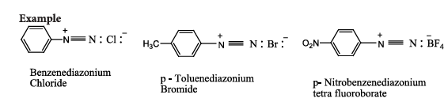
#### 13.3.2 Resonance structure

The stability of arene diazonium salt is due to the dispersal of the positive charge over the benzene ring.
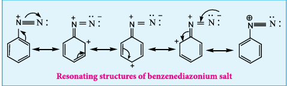
#### 13.3.3 Method of preparation of Diazonium salts

We have already learnt that benzene diazonium chloride is prepared by the reaction of aniline with nitrous acid (Which is produced by the reaction of \( \mathrm{NaNO_2} \) and HCl) at 273-278K.

#### 13.3.4 Physical properties

- Benzene diazonium chloride is a colourless, crystalline solid.
- These are readily soluble in water and stable in cold water. However it reacts with warm water.
- Their aqueous solutions are neutral to litmus and conduct electricity due to the presence of ions.
- Benzenediazonium tetrafluoroborate is soluble in water and stable at room temperature.

#### 13.3.5 Chemical reactions

Benzene diazonium chloride gives two types of chemical reactions:

A. Replacement reactions involving loss of nitrogen

In these reactions diazonium group is replaced by nucleophiles such as \( \mathrm{X, CN, H, OH} \) etc.

B. Reactions involving retention of diazo group (Coupling reaction).

**A. Replacement reactions involving loss of nitrogen**

**1. Replacement by hydrogen**

Benzene diazonium chloride on reduction with mild reducing agents like hypophosphorous acid (phosphinic acid) or ethanol in the presence of cuprous ion gives benzene. This reaction proceeds through a free-radical chain mechanism.
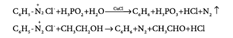
**2. Replacement by Chlorine, Bromine, Cyanide group**

**a) Sandmeyer reaction**

On mixing freshly prepared solution of benzene diazonium chloride with cuprous halides (chlorides and bromides), aryl halides are obtained. This reaction is called Sandmeyer reaction.

When diazonium salts are treated with cuprous cyanide, cyanobenzene is obtained.
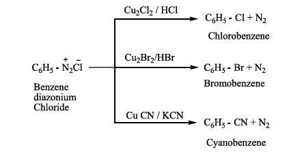
**b) Gattermann reaction**

Conversion of benzene diazonium chloride into chloro/bromo arenes can also be effected using hydrochloric/hydrobromic acid and copper powder. This reaction is called Gattermann reaction.
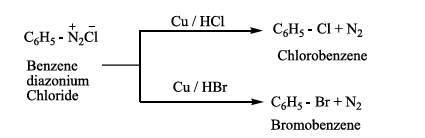
The yield in Sandmeyer reaction is found to be better than the Gattermann reaction.

**3. Replacement by iodine**

Aqueous solution of benzene diazonium chloride is warmed with KI to form iodobenzene.

$$\text{C}_6\text{H}_5{\color{black}\boldsymbol{-}}\text{N}_2^+\text{Cl}^- + \text{KI} \longrightarrow \underset{\text{Iodobenzene}}{\text{C}_6\text{H}_5\text{I}} + \text{KCl} + \text{N}_2$$

**4. Replacement of fluorine (Balz-Schiemann reaction)**

When benzene diazonium chloride is treated with fluoroboric acid, benzene diazonium tetrafluoroborate is precipitated which on heating decomposes to give fluorobenzene.
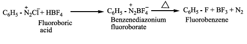

**5. Replacement by hydroxyl group**

Benzene diazonium chloride solution is added slowly to a large volume of boiling water to get phenol.
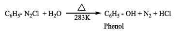
**6. Replacement by nitro group**

When diazonium fluoroborate is heated with aqueous sodium nitrite solution in the presence of copper, the diazonium group is replaced by \( -\mathrm{NO_2} \) group.

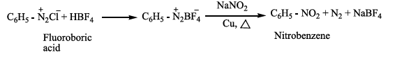
**7. Replacement by aryl group (Gomberg reaction)**

Benzene diazonium chloride reacts with benzene in the presence of sodium hydroxide to give biphenyl. This reaction is known as the Gomberg reaction.
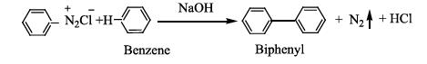
**8. Replacement by carboxylic acid group**

When diazonium fluoroborate is heated with acetic acid, benzoic acid is obtained. This reaction is used to convert aliphatic carboxylic acid into aromatic carboxylic acid.
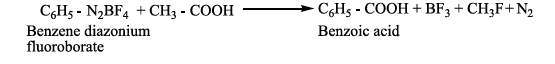

**B. Reactions involving retention of diazo group**

**9. Reduction to hydrazines**

Certain reducing agents like \( \mathrm{SnCl_2/HCl} \); Zn dust/\( \mathrm{CH_3COOH} \), sodium hydrosulphite, sodium sulphite etc. reduce benzene diazonium chloride to phenyl hydrazine.
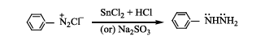
**10. Coupling reactions**

Benzene diazonium chloride reacts with electron rich aromatic compounds like phenol, aniline to form brightly coloured azo compounds. Coupling generally occurs at the para position. If para position is occupied then coupling occurs at the ortho position. Coupling tendency is enhanced if an electron donating group is present at the para-position to \( -\mathrm{N_2^+Cl^-} \) group. This is an electrophilic substitution.
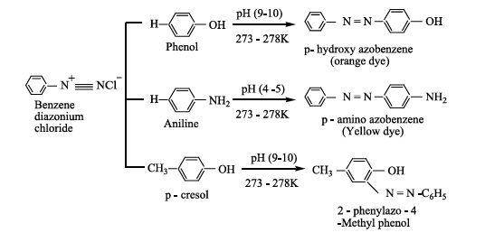
Aryl fluorides and iodides cannot be prepared by direct halogenation and the cyano group cannot be introduced by nucleophilic substitution of chlorine in chlorobenzene. For introducing such a halide group, cyano group -OH, \( \mathrm{NO_2} \) etc., benzenediazonium chloride is a very good intermediate. Diazo compounds obtained from the coupling reactions of diazonium salts are coloured and are used as dyes.
