# EVALUATION

## Choose the correct answer:

1. Which of the following reagent can be used to convert nitrobenzene to aniline
   a) $\text{Sn / HCl}$
   b) $\text{ZnHg / NaOH}$
   c) $\text{Zn/NH}_4\text{Cl}$
   d) All of these

2. The method by which aniline cannot be prepared is
   a) degradation of benzamide with $\text{Br}_2\text{ / NaOH}$
   b) potassium salt of phthalimide treated with chlorobenzene followed by hydrolysis with aqueous $\text{NaOH}$ solution.
   c) reduction of Nitrobenzene with $\text{LiAlH}_4$
   d) reduction of nitrobenzene by $\text{Sn / HCl}$.

3. Which one of the following will not undergo Hofmann bromamide reaction
   a) $\text{CH}_3\text{CONHCH}_3$
   b) $\text{CH}_3\text{CH}_2\text{CONH}_2$
   c) $\text{CH}_3\text{CONH}_2$
   d) $\text{C}_6\text{H}_5\text{CONH}_2$

4. **Assertion:** Acetamide on reaction with $\text{KOH}$ and bromine gives acetic acid  
   **Reason:** Bromine catalyses hydrolysis of acetamide.  
   a) if both assertion and reason are true and reason is the correct explanation of assertion.
   b) if both assertion and reason are true but reason is not the correct explanation of assertion.
   c) assertion is true but reason is false
   d) both assertion and reason are false.

5. 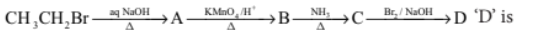 
   a) bromomethane
   b) $\alpha$ - bromo sodium acetate
   c) methanamine
   d) acetamide

6. Which one of the following nitro compounds does not react with nitrous acid
   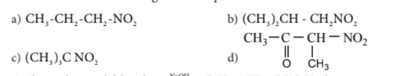

7. \(\mathrm{Aniline + benzoyl\ chloride \xrightarrow{\mathrm{NaOH}} C_6H_5{-}NH{-}COC_6H_5}\) this reaction is known as
   a) Friedel – crafts reaction
   b) HVZ reaction
   c) Schotten – Baumann reaction
   d) none of these

8. The product formed by the reaction an aldehyde with a primary amine (NEET)
   a) carboxylic acid
   b) aromatic acid
   c) schiff’s base
   d) ketone

9. Which of the following reaction is not correct.
  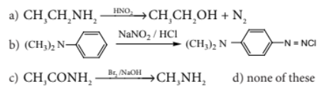

10. When aniline reacts with acetic anhydride the product formed is
    a) o – aminoacetophenone
    b) m-aminoacetophenone
    c) p – aminoacetophenone
    d) acetanilide

11. The order of basic strength for methyl substituted amines in aqueous solution is
    a) $\text{N(CH}_3)_3 > \text{N(CH}_3)_2\text{H} > \text{N(CH}_3)\text{H}_2 > \text{NH}_3$
    b) $\text{N(CH}_3)_2\text{H} > \text{N(CH}_3)\text{H}_2 > \text{N(CH}_3)_3 > \text{NH}_3$
    c) $\text{NH}_3 > \text{N(CH}_3)\text{H}_2 > \text{N(CH}_3)_2\text{H} > \text{N(CH}_3)_3$
    d) $\text{N(CH}_3)_2\text{H} > \text{N(CH}_3)\text{H}_2 > \text{NH}_3 > \text{N(CH}_3)_3$

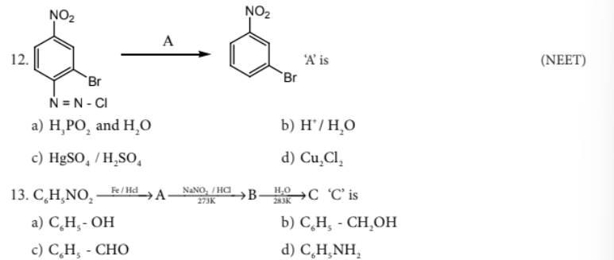

14. Nitrobenzene on reaction with  at $80\text{-}100^\circ\text{C}$ forms which one of the following products?
    a) 1,4 – dinitrobenzene
    b) 2,4,6 – tirnitrobenzene
    c) 1,2 – dinitrobenzene
    d) 1,3 – dinitrobenzene

15. \(\mathrm{C_5H_{13}N\ reacts\ with\ HNO_2}\) to give an optically active compound – The compound is
    a) pentan – 1- amine
    b) pentan – 2- amine
    c) N,N – dimethylpropan -2-amine
    d) diethyl methyl amine

16. Secondary nitro alkanes react with nitrous acid to form
    a) red solution
    b) blue solution
    c) green solution
    d) yellow solution

17. Which of the following amines does not undergo acetylation?
    a) t – butylamine
    b) ethylamine
    c) diethylamine
    d) triethylamine

18. Which one of the following is most basic?
    a) 2,4 – dichloroaniline
    b) 2,4 – dimethyl aniline
    c) 2,4 – dinitroaniline
    d) 2,4 – dibromoaniline

19. When 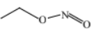 is reduced with $\text{Sn / HCl}$ the pair of compounds formed are
    a) Ethanol, hydroxylamine hydrochloride
    b) Ethanol, ammonium hydroxide
    c) Ethanol, $\text{NH}_2\text{OH}$
    d) $\text{C}_2\text{H}_5\text{NH}_2\text{, H}_2\text{O}$

20. IUPAC name for the amine
    $$\begin{aligned} &\qquad\quad\text{CH}_3 \\ &\qquad\quad\ \ | \\ &\text{CH}_3\text{ — N — C — CH}_2\text{— CH}_3 \quad \text{is} \\ &\qquad\ \ \ | \quad\ \ | \\ &\qquad\text{CH}_3\ \ \text{C}_2\text{H}_5 \end{aligned}$$
    a) 3 – Bimethylamino – 3 – methyl pentane
    b) 3 (N,N – Triethyl) – 3- amino pentane
    c) 3 – N,N – trimethyl pentanamine
    d) N,N – dimethyl – 3- methyl - pentan - 3 amine

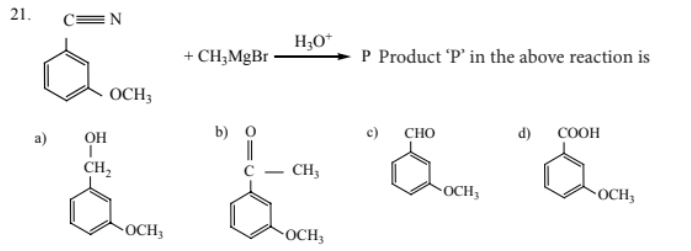
22. Ammonium salt of benzoic acid is heated strongly with $\text{P}_2\text{O}_5$ and the product so formed is reduced and then treated with $\text{NaNO}_2\text{ / HCl}$ at low temperature. The final compound formed is
    a) Benzene diazonium chloride
    b) Benzyl alcohol
    c) Phenol
    d) Nitrobenzene

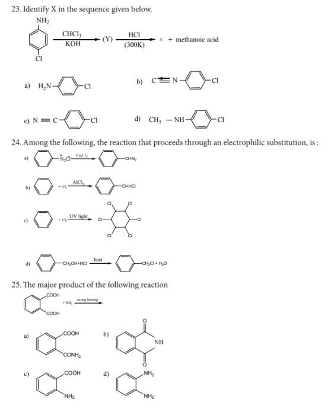
---

## Short answer Questions

1. Write down the possible isomers of the $\text{C}_4\text{H}_9\text{NO}_2$ give their IUPAC names
2. There are two isomers with the formula $\text{CH}_3\text{NO}_2$. How will you distinguish between them?
3. What happens when
   i. 2 – Nitropropane boiled with $\text{HCl}$
   ii. Nitrobenzene undergo electrolytic-reduction in strongly acidic medium.
   iii. Oxidation of tert – butylamine with $\text{KMnO}_4$
   iv. Oxidation of acetoneoxime with trifluoroperoxy acetic acid.
4. How will you convert nitrobenzene into
   i. 1,3,5 - trinitrobenzene
   ii. o and p- nitrophenol
   iii. m – nitro aniline
   iv. azoxybenzene
   v. hydrozobenzene
   vi. N – phenylhydroxylamine
   vii. aniline
5. Identify compounds A, B and C in the following sequence of reactions.
  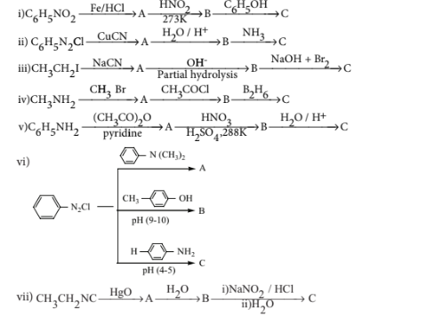

6. Write short notes on the following
   i. Hofmann’s bromide reaction
   ii. Ammonolysis
   iii. Gabriel phthalimide synthesis
   iv. Schotten – Baumann reaction
   v. Carbylamine reaction
   vi. Mustard oil reaction
   vii. Coupling reaction
   viii. Diazotisation
   ix. Gomberg reaction

7. How will you distinguish between primary secondary and tertiary alphatic amines.
8. Account for the following
   i. Aniline does not undergo Friedel – Crafts reaction
   ii. Diazonium salts of aromatic amines are more stable than those of aliphatic amines
   iii. $\text{pK}_b$ of aniline is more than that of methylamine
   iv. Gabriel phthalimide synthesis is preferred for synthesising primary amines.
   v. Ethylamine is soluble in water whereas aniline is not
   vi. Amines are more basic than amides
   vii. Although amino group is o – and p – directing in aromatic electrophilic substitution reactions, aniline on nitration gives a substantial amount of m – nitroaniline.

9. Arrange the following
  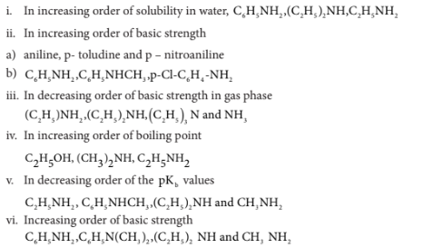
  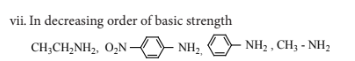
10. How will you prepare propan – 1- amine from
    i) butane nitrile
    ii) propanamide
    iii) 1- nitropropane

11. Identify A, B, and C
    $$\text{CH}_3\text{-NO}_2 \xrightarrow{\text{LiAlH}_4} \text{A} \xrightarrow{\text{2CH}_3\text{CH}_2\text{Br}} \text{B} \xrightarrow{\text{H}_2\text{SO}_4} \text{C}$$

12. How will you convert diethylamine into
    i) N, N – diethylacetamide
    ii) N – nitrosodiethylamine

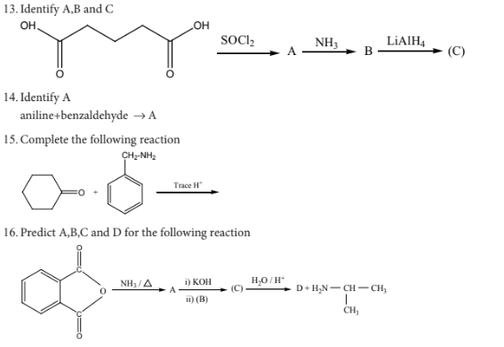

17. A dibromo derivative (A) on treatment with $\text{KCN}$ followed by acid hydrolysis and heating gives a monobasic acid (B) along with liberation of $\text{CO}_2$. (B) on heating with liquid ammonia followed by treating with $\text{Br}_2/\text{KOH}$ gives (c) which on treating with $\text{NaNO}_2$ and $\text{HCl}$ at low temperature followed by oxidation gives a monobasic acid (D) having molecular mass 74. Identify A to D.

18. Identify A to E in the following sequence of reactions.
    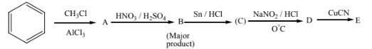