**Kenneth wade (1932- 2014)**

Kenneth Wade, was a British chemist, and professor emeritus at Durham University. He developed a method for the prediction of shapes of borane clusters. Wade's rules are used to rationalize the shape of borane clusters by calculating the total number of skeletal electron pairs (SEP) available for cluster bonding. For his substantial contribution, Kenneth Wade was granted FRS award from royal society, London In 1989. He received the Tilden prize award in 1999 from the Royal Society of Chemistry for advances in chemistry.

We have already learnt the classification of elements into four blocks namely s, p, d and f. We have also learnt the properties of s-block elements and their important compounds in the XI standard. This year we learn the elements of remaining blocks, starting with p-block elements.

The elements in which their last electron enters the ‘p’ orbital, constitute the p-block elements. They are placed in \( 13^\text{th} \) to \( 18^\text{th} \) groups of the modern periodic table and the first member of the groups are B, C, N, O, F and He respectively. These elements have quite varied properties and this block contains nonmetals, metals and metalloids. Nonmetallic elements of this group have more varied properties than metals. The elements of this block and their compounds play an important role in our day to day life, for example, without molecular oxygen we cannot imagine the survival of living system. The most abundant metal aluminium and its alloys have plenty of applications ranging from household utensils to parts of aircraft. The semi conducting nature of elements such as silicon and germanium made a revolutionary change in the field of modern electronics. In this unit we discuss the properties of first three groups (Group 13 - 15) of p-block elements namely boron, carbon and nitrogen family elements and their important compounds.

## 2.1 General trends in properties of p-block elements:

We already learnt that the properties of elements largely depends on their electronic configuration, size, ionisation enthalpy, electronegativity etc... Let us discuss the general trend in such properties of various p-block elements.

### 2.1.1 Electronic configuration and oxidation state:

The p-block elements have a general electronic configuration of \( ns^2 \), \( np^{1-6} \). The elements of each group have similar outer shell electronic configuration and differ only in the value of n (principal quantum number). The elements of group 18 (inert gases) have completely filled p orbitals, hence they are more stable and have least reactivity. The elements of this block show variable oxidation state and their highest oxidation state (group oxidation state) is equal to the total number of valance electrons present in them. Unlike s-block elements which show only positive oxidation state, some of the p-block elements show negative oxidation states also. The halogens have a strong tendency to gain an electron to give a stable halide ion with completely filled electronic configuration and hence -1 oxidation state is more common in halogens. Similarly, the other elements belonging to pnictogen and chalcogen groups also show negative oxidation states.

> **Evaluate yourself:**
>
> Why group 18 elements are called inert gases? Write the general electronic configuration of group 18 elements

**Table 2.1 General electronic configurations and oxidation states of p- block elements**

| Group No. | 13 | 14 | 15 | 16 | 17 | 18 |
|---|---|---|---|---|---|---|
| Group Name | Icosagens | Tetragens | Pnictogens | Chalcogens | Halogens | Inert gases |
| General outer electronic configuration | \(ns^2 np^1\) | \(ns^2 np^2\) | \(ns^2 np^3\) | \(ns^2 np^4\) | \(ns^2 np^5\) | \(ns^2 np^6\) |
| Highest oxidation state (Group oxidation state) | \(+3\) | \(+4\) | \(+5\) | \(+6\) | \(+7\) | \(+8\) |
| Other observed oxidation states | \(+1\) | \(+2, -4\) | \(+3, -3\) | \(+4, +2, -2\) | \(+5, +3, +1, -1\) | \(+6, +4, +2\) |

### 2.1.2 Metallic nature:

The tendency of an element to form a cation by loosing electrons is known as electropositive or metallic character. This character depends on the ionisation energy. Generally on descending a group the ionisation energy decreases and hence the metallic character increases.

In p- block, the elements present in lower left part are metals while the elements in the upper right part are non metals. Elements of group 13 have metallic character except the first element boron which is a metalloid, having properties intermediate between the metal and nonmetals. The atomic radius of boron is very small and it has relatively high nuclear charge and these properties are responsible for its nonmetallic character. In the subsequent groups the non- metallic character increases. In group 14 elements, carbon is a nonmetal while silicon and germanium are metalloids. In group 15, nitrogen and phosphorus are non metals and arsenic & antimony are metalloids. In group 16, oxygen, sulphur and selenium are non metals and tellurium is a metalloid. All the elements of group 17 and 18 are non metals.

### 2.1.3 Ionisation Enthalpy:

We have already learnt that as we move down a group, generally there is a steady decrease in ionisation enthalpy of elements due to increase in their atomic radius. In p- block elements, there are some minor deviations to this general trend. In group 13, from boron to aluminium the ionisation enthalpy decreases as expected. But from aluminium to thallium there is only a marginal difference. This is due to the presence of inner d and f- electrons which has poor shielding effect compared to s and p- electrons. As a result, the effective nuclear charge on the valance electrons increases. A similar trend is also observed in group 14. The remaining groups (15 to 18) follow the general trend. In these groups, the ionisation enthalpy decreases, as we move down the group. Here, poor shielding effect of d- and f- electrons are overcome by the increased shielding effect of the additional p- electrons. The ionisation enthalpy of elements in successive groups is higher than the corresponding elements of the previous group as expected.

### 2.1.4 Electronegativity

As we move down the \(13^{\mathrm{th}}\) group, the electronegativity first decreases from boron to aluminium and then marginally increases for Gallium, thereafter there is no appreciable change. Similar trend is also observed in \(14^{\mathrm{th}}\) group as well. In other groups, as we move down the group, the electro negativity decreases. This observed trend can be correlated with their atomic radius.

### 2.1.5 Anomalous properties of the first elements:

In p- block elements, the first member of each group differs from the other elements of the corresponding group. The following factors are responsible for this anomalous behaviour.

1. Small size of the first member
2. High ionisation enthalpy and high electronegativity
3. Absence of d orbitals in their valance shell

The first member of the group 13, boron is a metalloid while others are reactive metals. Moreover, boron shows diagonal relationship with silicon of group 14. The oxides of boron and silicon are similar in their acidic nature. Both boron and silicon form covalent hydrides that can be easily hydrolysed. Similarly, except boron trifluoride, halides of both elements are readily hydrolysed.

In group 14, the first element carbon is strictly a nonmetal while other elements are metalloids (silicon & germanium) or metals (tin & lead). Unlike other elements of the group carbon can form multiple bonds such as \(C = C\), \(C = O\) etc... Carbon has a greater tendency to form a chain of bonds with itself or with other atoms which is known as catenation. There is considerable decrease in catenation property down the group (\(C>>Si>Ge≈Sn>Pb\)).

In group 15 also the first element nitrogen differs from the rest of the elements of the group. Like carbon, the nitrogen can from multiple bonds \((N = N, C = N, N = O\) etc...). Nitrogen is a diatomic gas unlike the other members of the group. Similarly in group 16, the first element, oxygen also exists as a diatomic gas in that group. Due to its high electronegativity it forms hydrogen bonds.

The first element of group 17, fluorine the most electronegative element, also behaves quiet differently compared to the rest of the members of group. Like oxygen it also forms hydrogen bonds. It shows only - 1 oxidation state while the other halogens have \(+1\) \(+3\) \(+5\) and \(+7\) oxidation states in addition to - 1 state. The fluorine is the strongest oxidising agent and the most reactive element among the halogens.

### 2.1.6 Inert pair effect:

We have already learnt that the alkali and alkaline earth metals have an oxidation state of \(+1\) and \(+2\) respectively, corresponding to the total number of electrons present in them. Similarly, the elements of p- block also show the oxidation states corresponding to the maximum number of valence electrons (group oxidation state). In addition they also show variable oxidation state. In case of the heavier post- transition elements belonging to the groups (13 to 16), the most stable oxidation state is two less than the group oxidation state and there is a reluctance to exhibit the group oxidation state. Let us consider group 13 elements. As we move from boron to heavier elements, there is an increasing tendency to have \(+1\) oxidation state, rather than the group oxidation state, \(+3\). For example \(Al^{+3}\) is more stable than \(Al^{+1}\) while \(TI^{+1}\) is more stable than \(TI^{+3}\). Aluminium(III) chloride is stable whereas thallium(III) chloride is highly unstable and disproportionates to thallium(I) chloride and chlorine gas. This shows that in thallium the stable lower oxidation state corresponds to the loss of np electrons only and not ns electrons. Thus in heavier post- transition metals, the outer s electrons (ns) have a tendency to remain inert and show reluctance to take part in the bonding, which is known as inert pair effect. This effect is also observed in groups 14, 15 and 16.

### 2.1.7 Allotropism in p-block elements:

Some elements exist in more than one crystalline or molecular forms in the same physical state. For example, carbon exists as diamond and graphite. This phenomenon is called allotropism (in greek 'allos' means another and 'trope' means change) and the different forms of an element are called allotropes. Many p- block elements show allotropism and some of the common allotropes are listed in the table.

**Table 2.2: Some of common allotropes of p-block elements**

| Element | Most common allotropes |
|---|---|
| Boron | Amorphous boron, α-rhombohedral boron, β-rhombohedral boron, γ-orthorhombic boron, α-tetragonal boron, β-tetragonal boron |
| Carbon | Diamond, Graphite, Graphene, Fullerenes, Carbon nanotubes |
| Silicon | Amorphous silicon, crystalline silicon |
| Germanium | α-germanium, β-germanium |
| Tin | Grey tin, white tin, rhombic tin, sigma tin |
| Phosphorus | White phosphorus, Red phosphorus, Scarlet phosphorus, Violet phosphorus, Black phosphorus. |
| Arsenic | Yellow arsenic, grey arsenic & Black arsenic |
| Antimony | Blue-white antimony, Yellow, Black |
| Oxygen | Dioxygen, ozone |
| Sulphur | Rhombus sulphur, monoclinic sulphur |
| Selenium | Red selenium, Grey selenium, Black selenium, Monoclinic selenium |
| Tellurium | Amorphous & Crystalline |

### 2.2 Group 13 (Boron group) elements:

#### 2.2.1 Occurrence:

The boron occurs mostly as borates and its important ones are borax- \(Na_{2}[B_{4}O_{5}(OH)_{4}] .8H_2O\) and kermite - \(Na_{2}[B_{4}O_{5}(OH)_{4}] .2H_2O\). Aluminium is the most abundant metal and occurs as oxides and also found in aluminosilicate rocks. Commercially it is extracted from its chief ore, bauxite \((Al_{2}O_{3}.2H_{2}O)\). The other elements of this group occur only in trace amounts. The other elements Ga, In and Tl occur as their sulphides.

#### 2.2.2 Physical properties:

Some of the physical properties of the group 13 elements are listed below

**Table 2.3 Physical properties of group 13 elements**

| Property | Boron | Aluminum | Gallium | Indium | Thallium |
|---|---|---|---|---|---|
| Physical state at 293 K | Solid | Solid | Solid | Solid | Solid |
| Atomic Number | 5 | 13 | 31 | 49 | 81 |
| Isotopes | \(^{11}B\) | \(^{27}Al\) | \(^{69}Ga\) | \(^{115}In\) | \(^{205}Tl\) |
| Atomic Mass (g.mol\(^{-1}\) at 293 K) | 10.81 | 26.98 | 69.72 | 114.82 | 204.38 |
| Electronic configuration | \([He]2s^2 2p^1\) | \([Ne]3s^2 3p^1\) | \([Ar]3d^{10} 4s^2 4p^1\) | \([Kr]4d^{10} 5s^2 5p^1\) | \([Xe] 4f^{14} 5d^{10} 6s^2 6p^1\) |
| Atomic radius (Å) | 1.92 | 1.84 | 1.87 | 1.93 | 1.96 |
| Density (g.cm\(^{-3}\) at 293 K) | 2.34 | 2.70 | 5.91 | 7.31 | 11.80 |
| Melting point (K) | 2350 | 933 | 302.76 | 429.5 | 577 |
| Boiling point (K) | 4273 | 2792 | 2750 | 2300 | 1746 |

#### 2.2.3 Chemical properties of boron:

Boron is the only nonmetal in this group and is less reactive. However, it shows reactivity at higher temperatures. Many of its compounds are electron deficient and has unusual type of covalent bonding which is due to its small size, high ionisation energy and similarity in electronegativity with carbon and hydrogen.

**Formation of metal borides:**

Many metals except alkali metals form borides with a general formula \(M_{x}B_{y}\) (x ranging upto 11 and y ranging upto 66 or higher)

**Direct combination of metals with boron:**

$$
Cr + nB \xrightarrow{1500K} CrB_{n}
$$

**Reduction of borontrihalides:**

Reduction of borontrihalides with a metal assisted by dihydrogen gives metal borides.

$$
2BCl_{3} + 2W \xrightarrow[H_{2}]{1500K} 2WB + 2Cl_{2} + 2HCl
$$

**Formation of hydrides:**

Boron does not react directly with hydrogen. However, it forms a variety of hydrides called boranes. The simplest borane is diborane - \(B_{2}H_{6}\). Other larger boranes can be prepared from diborane. Treatment of gaseous boron trifluoride with sodium hydride around 450 K gives diborane. To prevent subsequent pyrolysis, the product diborane is trapped immediately.

$$
2BF_{3} + 6NaH \xrightarrow{450K} B_{2}H_{6} + 6NaF
$$

**Formation of boron trihalides:**

Boron combines with halogen to form boron trihalides at high temperatures.

$$
2B + 3X_{2} \xrightarrow{\Delta} 2BX_{3}
$$

**Formation of boron nitride:**

Boron burns with dinitrogen at high temperatures to form boron nitride.

$$
2B + N_{2} \xrightarrow{\Delta} 2BN
$$

**Formation of oxides:**

When boron is heated with oxygen around \(900 \mathrm{K}\), it forms its oxide.

$$
4B + 3O_{2} \xrightarrow{900K} 2B_{2}O_{3}
$$

**Reaction with acids and alkali:**

Halo acids have no reaction with boron. However, boron reacts with oxidising acids such as sulphuric acid and nitric acids and forms boric acid.

$$
2B + 3H_{2}SO_{4} \longrightarrow 2H_{3}BO_{3} + 3SO_{2}
$$

$$
B + 3HNO_{3} \longrightarrow H_{3}BO_{3} + 3NO_{2}
$$

Boron reacts with fused sodium hydroxide and forms sodium borate.

$$
2B + 6NaOH \longrightarrow 2Na_{3}BO_{3} + 3H_{2}
$$

**Uses of boron:**

1. Boron has the capacity to absorb neutrons. Hence, its isotope \(^{10}B_{5}\) is used as moderator in nuclear reactors.
2. Amorphous boron is used as a rocket fuel igniter.
3. Boron is essential for the cell walls of plants.
4. Compounds of boron have many applications. For example eye drops, antiseptics, washing powders etc.. contains boric acid and borax. In the manufacture of Pyrex glass, boric oxide is used.

#### 2.2.4. Borax \([Na_{2}B_{4}O_{7}.10H_{2}O]\)

**Preparation:**

Borax is a sodium salt of tetraboric acid. It is obtained from colemanite ore by boiling its solution with sodium carbonate.

$$
2Ca_{2}B_{6}O_{11} + 3Na_{2}CO_{3} + H_{2}O \xrightarrow{\Delta} 3Na_{2}B_{4}O_{7} + 3CaCO_{3} + Ca(OH)_{2}
$$

Borax is normally formulated as \(Na_{2}B_{4}O_{7}.10H_{2}O\). But it contains, tetranuclear units \([B_{4}O_{5}.(OH)_{4}]^{2-}\). This form is known as prismatic form. Borax also exists two other forms namely, jeweller or octahedral borax \((Na_{2}B_{4}O_{7},5H_{2}O)\) and borax glass \((Na_{2}B_{4}O_{7})\).

**Properties**

Borax is basic in nature and its solution in hot- water is alkaline as it dissociates into boric acid and sodium hydroxide.

$$
Na_{2}B_{4}O_{7} + 7H_{2}O \longrightarrow 4H_{3}BO_{3} + 2NaOH
$$

On heating it forms a transparent borax beads.

$$
Na_{2}B_{4}O_{7}.10H_{2}O \xrightarrow[-10H_2O]{\Delta} Na_{2}B_{4}O_{7} \xrightarrow{\Delta} 2NaBO_{2} + B_{2}O_{3}
$$

Borax reacts with acids to form sparingly soluble boric acid.

$$
Na_{2}B_{4}O_{7} + 2HCl + 5H_{2}O \longrightarrow 4H_{3}BO_{3} + 2NaCl
$$

$$
Na_{2}B_{4}O_{7} + H_{2}SO_{4} + 5H_{2}O \longrightarrow 4H_{3}BO_{3} + Na_{2}SO_{4}
$$

When treated with ammonium chloride it forms boron nitride.

$$
Na_{2}B_{4}O_{7} + 2NH_{4}Cl \longrightarrow 2NaCl + 2BN + B_{2}O_{3} + 4H_{2}O
$$

**Uses of Borax:**

1. Borax is used for the identification of coloured metal ions
2. In the manufacture optical and borosilicate glass, enamels and glazes for pottery
3. It is also used as a flux in metallurgy and also acts as a preservative

#### 2.2.5. Boric acid \([H_3BO_3\) or \(B(OH)_3]\)

**Preparation:**

Boric acid can be extracted from borax and colemanite.

$$
Na_{2}B_{4}O_{7} + H_{2}SO_{4} + 5H_{2}O \longrightarrow 4H_{3}BO_{3} + Na_{2}SO_{4}
$$

$$
Ca_{2}B_{6}O_{11} + 11H_{2}O + 4SO_{2} \longrightarrow 2Ca(HSO_{3})_{2} + 6H_{3}BO_{3}
$$

**Properties:**

Boric acid is a colourless transparent crystal. It is a very weak monobasic acid and, it accepts hydroxyl ion rather than donating proton.

$$
B(OH)_3 + 2H_2O \rightleftharpoons H_3O^+ + [B(OH)_4]^-
$$

It reacts with sodium hydroxide to form sodium metaborate and sodium tetraborate.

$$
H_{3}BO_{3} + NaOH \longrightarrow NaBO_{2} + 2H_{2}O
$$

$$
4H_{3}BO_{3} + 2NaOH \longrightarrow Na_{2}B_{4}O_{7} + 7H_{2}O
$$

**Action of Heat:**

Boric acid when heated at \(373\mathrm{K}\) gives metaboric acid and at \(413\mathrm{K}\), it gives tetraboric acid. When heated at red hot, it gives boric anhydride which is a glassy mass.

$$
4H_3BO_3 \xrightarrow{373 K} 4HBO_2 + 4H_2O
$$

$$
4HBO_2 \xrightarrow{413 K} H_2B_4O_7 + H_2O
$$

$$
H_2B_4O_7 \xrightarrow{\text{Red hot}} 2B_2O_3 + H_2O
$$

**Action of ammonia**

Fusion of urea with \(B(OH)_3\), in an atmosphere of ammonia at \(800 - 1200\mathrm{K}\) gives boron nitride.

$$
B(OH)_3 + NH_3 \xrightarrow{\Delta} BN + 3H_2O
$$

**Ethyl Borate test**

When boric acid or borate salt is heated with ethyl alcohol in presence of conc. sulphuric acid, an ester, triethylborate is formed. The vapour of this ester burns with a green edged flame and this reaction is used to identify the presence of borate.

$$
H_3BO_3 + 3C_2H_5OH \xrightarrow{\text{Conc.} H_2SO_4} B(OC_2H_5)_3 + 3H_2O
$$

Note: The trialkyl borate on reaction with sodium hydride in tetrahydrouran to form a coordination compound \(Na[BH(OR)_3]\), which acts as a powerful reducing agent.

**Formation of boron trifluoride:**

Boric acid reacts with calcium fluoride in presence of conc. sulphuric acid and gives boron trifluoride.

$$
3CaF_2 + 3H_2SO_4 + 2B(OH)_3 \xrightarrow{} 3CaSO_4 + 2BF_3 + 6H_2O
$$

Boric acid when heated with soda ash it gives borax

$$
Na_2CO_3 + 4B(OH)_3 \xrightarrow{} Na_2B_4O_7 + CO_2 + 6H_2O
$$

**Structure of Boric acid:**

Boric acid has a two dimensional layered structure. It consists of \([BO_3]^{3-}\) unit and these are linked to each other by hydrogen bonds as shown in the Figure 2.2.

**Uses of boric acid:**

1. Boric acid is used in the manufacture of pottery glasses, enamels and pigments.
2. It is used as an antiseptic and as an eye lotion.
3. It is also used as a food preservative.

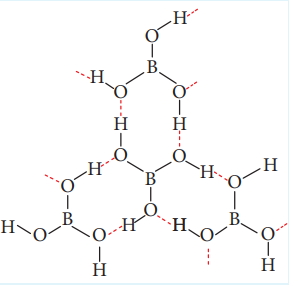

#### 2.2.6 Diborane

**Preparation:**

As discussed earlier diborane can be prepared by the action of metal hydride with boron. This method is used for the industrial production.

Diborane can also be obtained in small quantities by the reaction of iodine with sodium borohydride in diglyme.

$$
2NaBH_4 + I_2 \longrightarrow B_2H_6 + 2NaI + H_2
$$

On heating magnesium boride with HCl a mixture of volatile boranes are obtained.

$$
2Mg_3B_2 + 12HCl \longrightarrow 6MgCl_2 + B_4H_{10} + H_2
$$

$$
B_4H_{10} + H_2 \longrightarrow 2B_2H_6
$$

# Properties:

Boranes are colourless diamagnetic compounds with low thermal stability. Diborane is a gas at room temperature with sweet smell and it is extremely toxic. It is also highly reactive.

At high temperatures it forms higher boranes liberating hydrogen.

$$
5B_2H_6 \xrightarrow[U-tube]{388 \, \text{K}} 2B_5H_{11} + 4H_2
$$

$$
2B_2H_6 \xrightarrow{198 - 373 \, \text{K}} B_4H_{10} + H_2
$$

$$
5B_2H_6 \xrightarrow[sealed tube]{373 \, \text{K}} B_{10}H_{14} + 8H_2
$$

$$
5B_2H_6 \xrightarrow{473 - 523 \, \text{K}} 2B_5H_9 + 6H_2
$$

$$
10B_2H_6 \xrightarrow{523 \, \text{K}} 2B_5H_9 + 2B_5H_{10} + 11H_2
$$

$$
B_2H_6 \xrightarrow{\text{Red hot}} 2B + 3H_2
$$

Diboranes reacts with water and alkali to give boric acid and metaborates respectively.

$$
B_2H_6 + 6H_2O \rightarrow 2H_3BO_3 + 6H_2
$$

$$
B_2H_6 + 2NaOH + 2H_2O \rightarrow 2NaBO_2 + 6H_2
$$

**Action of air:**

At room temperature pure diborane does not react with air or oxygen but in impure form it gives \(B_2O_3\) along with large amount of heat.

$$
B_2H_6 + 3O_2 \longrightarrow B_2O_3 + 3H_2O \quad \Delta H = -2165 \mathrm{KJ \ mol}^{-1}
$$

Diborane reacts with methyl alcohol to give trimethyl Borate.

$$
B_2H_6 + 6CH_3OH \longrightarrow 2B(OCH_3)_3 + 6H_2
$$

**Hydroboration:**

Diborane adds on to alkenes and alkynes in ether solvent at room temperature. This reaction is called hydroboration and is highly used in synthetic organic chemistry, especially for anti Markovnikov addition.

$$
B_2H_6 + 6RCH = CHR \longrightarrow 2(RCH_2-CHR)_3B
$$

**Reaction with ionic hydrides**

When treated with metal hydrides it forms metal borohydrides

$$
B_2H_6 + 2LiH \xrightarrow{\text{Ether}} 2LiBH_4
$$

$$
B_2H_6 + 2NaH \xrightarrow{\text{Diglyme}} 2NaBH_4
$$

**Reaction with ammonia:**

When treated with excess ammonia at low temperatures diborane gives diboranediammonate. On heating at higher temperatures it gives borazole.

$$
3B_2H_6 + 6NH_3 \xrightarrow{-153 \, K} 3(B_2H_6 \cdot 2NH_3) \, (\text{or}) \, 3[BH_2(NH_3)_2]^+[BH_4]^-
$$

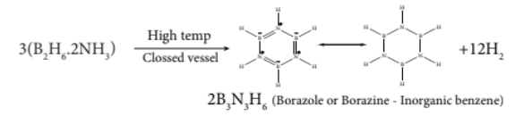

**Structure of diborane:**

In diborane two \(BH_2\) units are linked by two bridged hydrogens. Therefore, it has eight B- H bonds. However, diborane has only 12 valence electrons and are not sufficient to form normal covalent bonds. The four terminal B- H bonds are normal covalent bonds (two centre - two electron bond or 2c- 2e bond). The remaining four electrons have to be used for the bridged bonds. i.e. two three centred B- H- B bonds utilise two electrons each. Hence, these bonds are three centre- two electron bonds (3c- 2e). The bridging hydrogen atoms are in a plane as shown in the figure 2.3. In diborane, the boron is \(sp^3\) hybridised.

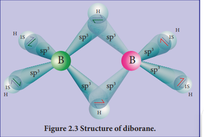

Three of the four \(sp^3\) hybridised orbitals contains single electron and the fourth orbital is empty. Two of the half filled hybridised orbitals of each boron overlap with the 1s orbitals of two hydrogens to form four terminal 2c- 2e bonds, leaving one empty and one half filled hybridised orbitals on each boron. The Three centre - two electron bonds), B- H- B bond formation involves overlapping the half filled hybridised orbital of one boron, the empty hybridised orbital of the other boron and the half filled 1s orbital of hydrogen.

**Uses of diborane:**

1. Diborane is used as a high energy fuel for propellant
2. It is used as a reducing agent in organic chemistry
3. It is used in welding torches

#### 2.2.7 Boron trifluoride:

**Preparation:**

Boron trifluoride is obtained by the treatment of calcium fluoride with boron trioxide in presence of conc. sulphuric acid.

$$
B_2O_3 + 3CaF_2 + 3H_2SO_4 \xrightarrow{\Delta} 2BF_3 + 3CaSO_4 + 3H_2O
$$

It can also be obtained by treating boron trioxide with carbon and fluorine.

$$
B_2O_3 + 3C + 3F_2 \xrightarrow \ 2BF_3 + 3CO
$$

In the laboratory pure \(BF_3\) is prepared by the thermal decomposition of benzene diazonium tetrafluoro borate.

$$
C_6H_5N_2BF_4 \xrightarrow{\Delta} BF_3 + C_6H_5F + N_2
$$

**Properties:**

Boron trifluoride has a planar geometry. It is an electron deficient compound and accepts electron pairs to form coordinate covalent bonds. They form complex of the type \([BX_4]^-\).

$$
\text{BF}_3 + \text{NH}_3 \rightarrow \text{F}_3\text{B} \leftarrow \text{NH}_3
$$

$$
\text{BF}_3 + \text{H}_2\text{O} \rightarrow \text{F}_3\text{B} \leftarrow \text{OH}_2
$$

On hydrolysis, boric acid is obtained. This then gets converted into Hydro fluoroboric acid.

$$
4\text{BF}_3 + 12\text{H}_2\text{O} \rightarrow 4\text{H}_3\text{BO}_3 + 12\text{HF}
$$

$$
3\text{H}_3\text{BO}_3 + 12\text{HF} \rightarrow 3\text{H}^+ + 3[\text{BF}_4]^- + 9\text{H}_2\text{O}
$$

---
$$
4\text{BF}_3 + 3\text{H}_2\text{O} \rightarrow \text{H}_3\text{BO}_3 + 3\text{H}^+ + 3[\text{BF}_4]^-
$$

**Uses of Boron trifluoride:**

1. Boron trifluoride is used for preparing \(HBF_4\), a catalyst in organic chemistry
2. It is also used as a fluorinating reagent.

#### 2.2.8 Aluminium chloride:

**Preparation:**

When aluminium metal or aluminium hydroxide is treated with hydrochloric acid, aluminium trichloride is formed. The reaction mixture is evaporated to obtain hydrated aluminium chloride.

$$
2Al + 6HCl \longrightarrow 2AlCl_3 + 3H_2
$$

$$
Al(OH)_3 + 3HCl \longrightarrow AlCl_3 + 3H_2O
$$

**McAfee Process:**

Aluminium chloride is obtained by heating a mixture of alumina and coke in a current of chlorine.

$$
2Al_2O_3 + 3C + 6Cl_2 \longrightarrow 4AlCl_3 + 3CO_2
$$

On industrial scale it is prepared by chlorinating aluminium around \(1000\mathrm{K}\)

$$
2Al + 3Cl_2 \xrightarrow{1000K} 2AlCl_3
$$

**Properties:**

Anhydrous aluminium chloride is a colourless, hygroscopic substance.

An aqueous solution of aluminium chloride is acidic in nature. It also produces hydrogen chloride fumes in moist air.

$$
AlCl_3 + 3H_2O \longrightarrow Al(OH)_3 + 3HCl
$$

With ammonium hydroxide it forms aluminium hydroxide.

$$
AlCl_3 + 3NH_4OH \longrightarrow Al(OH)_3 + 3NH_4Cl
$$

With excess of sodium hydroxide it produces metal aluminate

$$
AlCl_3 + 4NaOH \longrightarrow NaAlO_2 + 2H_2O + 3NaCl
$$

It behaves like a Lewis acid and forms addition compounds with ammonia, phosphine and carbonylchloride etc... Eg. \(AlCl_3,6NH_3\)

**Uses of aluminium chloride:**

1. Anhydrous aluminium chloride is used as a catalyst in Friedel Crafts reaction
2. It is used for the manufacture of petrol by cracking the mineral oils.
3. It is used as a catalyst in the manufacture on dyes, drugs and perfumes.

### 2.2.9 Alums:

The name alum is given to the double salt of potassium aluminium sulphate \([K_2SO_4.Al_2(SO_4)_3.24H_2O]\). Now a days it is used for all the double salts with \(M'_2SO_4 \cdot M''(SO_4)_3.24H_2O\), where \(M'\) is univalent metal ion or \([NH_4]^+\) and \(M''\) is trivalent metal ion.

**Examples:**

Potash alum \([K_2SO_4.Al_2(SO_4)_3.24H_2O]\); Sodium alum \([Na_2SO_4.Al_2(SO_4)_3.24H_2O]\); Ammonium alum \([(NH_4)_2SO_4.Al_2(SO_4)_3.24H_2O]\), Chrome alum \([K_2SO_4.Cr_2(SO_4)_3.24H_2O]\).

Alums in general are more soluble in hot water than in cold water and in solutions they exhibit the properties of constituent ions.

**Preparation:**

Alumine, the alum stone is the naturally occurring form and it is \(K_2SO_4.Al_2(SO_4)_3.4Al(OH)_3\) When alum stone is treated with excess of sulphuric acid, the aluminium hydroxide is converted to aluminium sulphate. A calculated quantity of potassium sulphate is added and the solution is crystallised to generate potash alum. It is purified by recrystallisation.

$$
K_2SO_4Al_2(SO_4)_3.4Al(OH)_3 + 6H_2SO_4 \longrightarrow K_2SO_4 + 3Al_2(SO_4)_3 + 12H_2O
$$

$$
K_2SO_4 + Al_2(SO_4)_3 + 24H_2O \longrightarrow K_2SO_4.Al_2(SO_4)_3.24H_2O
$$

**Properties**

Potash alum is a white crystalline solid it is soluble in water and insoluble in alcohol. The aqueous solution is acidic due to the hydrolysis of aluminium sulphate it melts at \(365 \mathrm{K}\) on heating. At \(475 \mathrm{K}\) loses water of hydration and swells up. The swollen mass is known as burnt alum. Heating to red hot it decomposes into potassium sulphate, alumina and sulphur trioxide.

$$
K_2SO_4.Al_2(SO_4)_3.24H_2O \xrightarrow{475K} K_2SO_4.Al_2(SO_4)_3 + 24H_2O
$$

$$
K_2SO_4.Al_2(SO_4)_3 \xrightarrow{\text{Red hot}} K_2SO_4 + Al_2O_3 + 3SO_3
$$

Potash alum forms aluminium hydroxide when treated with ammonium hydroxide.

$$
K_2SO_4.Al_2(SO_4)_3.24H_2O + 6NH_4OH \longrightarrow K_2SO_4 + 3(NH_4)_2SO_4 + 24H_2O + 2Al(OH)_3
$$

**Uses of Alum:**

1. It is used for purification of water
2. It is also used for water proofing and textiles
3. It is used in dyeing, paper and leather tanning industries
4. It is employed as a styptic agent to arrest bleeding.

### 2.3 Group 14 (Carbon group) elements:

#### 2.3.1 Occurrence:

Carbon is found in the native form as graphite. Coal, crude oil and carbonate rocks such as calcite, magnesite etc... contains large quantities of carbon in its combined form with other elements. Silicon occurs as silica (sand and quartz crystal). Silicate minerals and clay are other important sources for silicon.

#### 2.3.2 Physical properties:

Some of the physical properties of the group 14 elements are listed below

**Table 2.4 Physical properties of group 14 elements**

| Property | Carbon | Silicon | Germanium | Tin | Lead |
|---|---|---|---|---|---|
| Physical state at 293 K | Solid | Solid | Solid | Solid | Solid |
| Atomic Number | 6 | 14 | 32 | 50 | 82 |
| Isotopes | \(^{12}C, ^{13}C, ^{14}C\) | \(^{28}Si, ^{30}Si\) | \(^{73}Ge, ^{74}Ge\) | \(^{120}Sn\) | \(^{208}Pb\) |
| Atomic Mass (g.mol\(^{-1}\) at 293 K) | 12.01 | 28.09 | 72.63 | 118.71 | 207.2 |
| Electronic configuration | \([He]2s^2 2p^2\) | \([Ne]3s^2 3p^2\) | \([Ar]3d^{10} 4s^2 4p^2\) | \([Kr]4d^{10} 5s^2 5p^2\) | \([Xe] 4f^{14} 5d^{10} 6s^2 6p^2\) |
| Atomic radius (Å) | 1.70 | 2.10 | 2.11 | 2.17 | 2.02 |
| Density (g.cm\(^{-3}\) at 293 K) | 3.51 | 2.33 | 5.32 | 7.29 | 11.30 |
| Melting point (K) | Sublimes at  | 1687 | 1211 | 505 | 601 |
| Boiling point (K) | 4098 | 3538 | 3106 | 2859 | 2022 |

#### 2.3.3 Tendency for catenation

Catenation is an ability of an element to form chain of atoms. The following conditions are necessary for catenation. (i) valency of the element should be greater than or equal to two, (ii) element should have the ability to bond with itself (iii) the self bond must be as strong as its bond with other elements (iv) kinetic inertness of catenated compound towards other molecules. Carbon possesses all the above properties and forms a wide range of compounds with itself and with other elements such as H, O, N, S and halogens.

#### 2.3.4 Allotropes of carbon

Carbon exists in many allotropic forms. Graphite and diamond are the most common allotropes. Other important allotropes are graphene, fullerenes and carbon nanotubes.

Graphite is the most stable allotropic form of carbon at normal temperature and pressure. It is soft and conducts electricity. It is composed of flat two dimensional sheets of carbon atoms. Each sheet is a hexagonal net of \(sp^2\) hybridised carbon atoms with a C- C bond length of \(1.41\mathrm{\AA}\) which is close to the C- C bond distance in benzene \((1.40\mathrm{\AA})\). Each carbon atom forms three \(\sigma\) bonds with three neighbouring carbon atoms using three of its valence electrons and the fourth electron present in the unhybridised p orbital forms a \(\pi\)- bond. These \(\pi\) electrons are delocalised over the entire sheet which is responsible for its electrical conductivity. The successive carbon sheets are held together by weak vander Waals forces. The distance between successive sheets is \(3.40\mathrm{\AA}\). It is used as a lubricant either on its own or as a graphited oil.

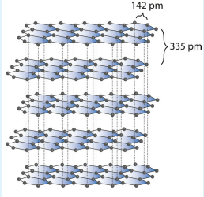

Unlike graphite the other allotrope diamond is very hard. The carbon atoms in diamond are \(sp^{3}\) hybridised and bonded to four neighbouring carbon atoms by \(\sigma\) bonds with a C- C bond length of \(1.54\mathrm{\AA}\). This results in a tetrahedral arrangement around each carbon atom that extends to the entire lattice as shown in figure 2.5. Since all four valance electrons of carbon are involved in bonding there is no free electrons for conductivity. Being the hardest element, it used for sharpening hard tools, cutting glasses, making bores and rock drilling.

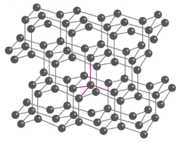

Fullerenes are newly synthesised allotropes of carbon. Unlike graphite and diamond, these allotropes are discrete molecules such as \(C_{32}\), \(C_{50}\), \(C_{60}\), \(C_{70}\), \(C_{76}\) etc. These molecules have cage like structures as shown in the figure. The \(C_{60}\) molecules have a soccer ball like structure and is called buckminster fullerene or buckyballs. It has a fused ring structure consists of 20 six membered rings and 12 five membered rings. Each carbon atom is \(sp^{2}\) hybridised and forms three \(\sigma\) bonds & a delocalised \(\pi\) bond giving aromatic character to these molecules. The C- C bond distance is \(1.44\mathrm{\AA}\) and \(C = C\) distance \(1.38\mathrm{\AA}\)

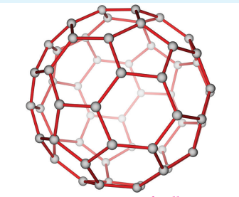

Carbon nanotubes, another recently discovered allotropes, have graphite like tubes with fullerene ends. Along the axis, these nanotubes are stronger than steel and conduct electricity. These have many applications in nanoscale electronics, catalysis, polymers and medicine.

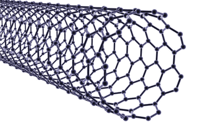

Another allotropic form of carbon is graphene. It has a single planar sheet of $sp^2$ hybridised carbon atoms that are densely packed in a honeycomb crystal lattice.

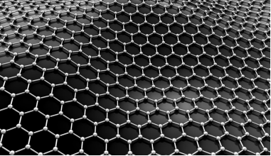

### 2.3.5 Carbon monoxide [CO]:

**Preparation:**

Carbon monoxide can be prepared by the reaction of carbon with limited amount of oxygen.

$$
2C + O_{2} \longrightarrow 2CO
$$

On industrial scale carbon monoxide is produced by the reaction of carbon with air. The carbon monoxide formed will contain nitrogen gas also and the mixture of nitrogen and carbon monoxide is called producer gas.

$$
2C + O_{2} / N_{2}(air) \longrightarrow 2CO + N_{2} (Producer  gas)
$$

The producer gas is then passed through a solution of copper(I)chloride under pressure which results in the formation of \(CuCl(CO).2H_2O\). At reduced pressures this solution releases the pure carbon monoxide.

Pure carbon monoxide is prepared by warming methanoic acid with concentrated sulphuric acid which acts as a dehydrating agent.

$$
HCOOH + H_{2}SO_{4} \longrightarrow CO + H_{2}SO_{4}\cdot H_{2}O
$$

**Properties**

It is a colourless, odourless, and poisonous gas. It is slightly soluble in water.

It burns in air with a blue flame forming carbon dioxide.

$$
2CO + O_{2} \longrightarrow 2CO_{2}
$$

When carbon monoxide is treated with chlorine in presence of light or charcoal, it forms a poisonous gas carbonyl chloride, which is also known as phosgene. It is used in the synthesis of isocyanates.

$$
CO + Cl_{2} \longrightarrow COCl_{2}
$$

Carbon monoxide acts as a strong reducing agent.

$$
3CO + Fe_{2}O_{3} \longrightarrow 2Fe + 3CO_{2}
$$

Under high temperature and pressure a mixture of carbon monoxide and hydrogen (synthetic gas or syn gas) gives methanol.

$$
CO + 2H_{2} \longrightarrow CH_{3}OH
$$

In oxo process, ethene is mixed with carbon monoxide and hydrogen gas to produce propanal.

$$
CO + C_{2}H_{4} + H_{2} \longrightarrow CH_{3}CH_{2}CHO
$$

**Fischer Tropsch synthesis:**

The reaction of carbon monoxide with hydrogen at a pressure of less than 50 atm using metal catalysts at \(500 - 700\mathrm{K}\) yields saturated and unsaturated hydrocarbons.

$$
nCO + (2n + 1)H_{2} \longrightarrow C_{n}H_{(2n + 2)} + nH_{2}O
$$

$$
nCO + 2nH_{2} \longrightarrow C_{n}H_{2n} + nH_{2}O
$$

Carbon monoxide forms numerous complex compounds with transition metals in which the transition metal is in zero oxidation state. These compounds are obtained by heating the metal with carbon monoxide.

Eg. Nickel tetracarbonyl \([Ni(CO)_4]\), Iron pentacarbonyl \([Fe(CO)_5]\), Chromium hexacarbonyl \([Cr(CO)_6]\).

**Structure:**

It has a linear structure. In carbon monoxide, three electron pairs are shared between carbon and oxygen. The bonding can be explained using molecular orbital theory as discussed in XI standard. The C- O bond distance is \(1.128\mathrm{\AA}\). The structure can be considered as the resonance hybrid of the following two canonical forms.

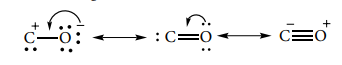

**Uses of carbon monoxide:**

1. Equimolar mixture of hydrogen and carbon monoxide - water gas and the mixture of carbon monoxide and nitrogen - producer gas are important industrial fuels
2. Carbon monoxide is a good reducing agent and can reduce many metal oxides to metals.
3. Carbon monoxide is an important ligand and forms carbonyl compound with transition metals

#### 2.3.6 Carbon dioxide:

Carbon dioxide occurs in nature in free state as well as in the combined state. It is a constituent of air \((0.03\%)\). It occurs in rock as calcium carbonate and magnesium carbonate.

**Production**

On industrial scale it is produced by burning coke in excess of air.

$$
C + O_{2} \longrightarrow CO_{2} \quad \Delta H = -394 \mathrm{kJ \ mol}^{-1}
$$

Calcination of lime produces carbon dioxide as by product.

$$
CaCO_{3} \longrightarrow CaO + CO_{2}
$$

Carbon dioxide is prepared in laboratory by the action of dilute hydrochloric acid on metal carbonates.

$$
CaCO_3 + 2HCl \longrightarrow CaCl_2 + H_2O + CO_2
$$

**Properties**

It is a colourless, nonflammable gas and is heavier than air. Its critical temperature is \(31^{\circ}\) C and can be readily liquefied.

Carbon dioxide is a very stable compound. Even at \(3100\mathrm{K}\) only \(76\%\) decomposes to form carbon monoxide and oxygen. At still higher temperature it decomposes into carbon and oxygen.

$$
CO_2 \xrightleftharpoons{3100K} CO + \frac{1}{2}O_2
$$

$$
CO_2 \xrightleftharpoons{\text{high temperature}} C + O_2
$$

**Oxidising behaviour:**

At elevated temperatures, it acts as a strong oxidising agent. For example,

$$
CO_2 + 2Mg \longrightarrow 2MgO + C
$$

**Water gas equilibrium:**

The equilibrium involved in the reaction between carbon dioxide and hydrogen, has many industrial applications and is called water gas equilibrium.

$$
CO_2 + H_2 \xrightleftharpoons{} CO + H_2O
$$

**Acidic behaviour:**

The aqueous solution of carbon dioxide is slightly acidic as it forms carbonic acid.

$$
CO_2 + H_2O \xrightleftharpoons{} H_2CO_3 \xrightleftharpoons{} H^+ + HCO_3^-
$$

**Structure of carbon dioxide**

Carbon dioxide has a linear structure with equal bond distance for the both C- O bonds. In this molecule there is two C- O sigma bond. In addition there is 3c- 4e bond covering all the three atoms.

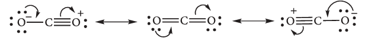

**Uses of carbon dioxide**

1. Carbon dioxide is used to produce an inert atmosphere for chemical processing.
2. Biologically, it is important for photosynthesis.
3. It is also used as fire extinguisher and as a propellant gas.
4. It is used in the production of carbonated beverages and in the production of foam.

#### 2.3.7 Silicon tetrachloride:

**Preparation:**

Silicon tetrachloride can be prepared by passing dry chlorine over an intimate mixture of silica and carbon by heating to \(1675\mathrm{K}\) in a porcelain tube

$$
SiO_2 + 2C + 2Cl_2 \longrightarrow SiCl_4 + 2CO
$$

On commercial scale, reaction of silicon with hydrogen chloride gas occurs above \(600\mathrm{K}\)

$$
Si + 4HCl \longrightarrow SiCl_4 + 2H_2
$$

**Properties:**

Silicon tetrachloride is a colourless fuming liquid and it freezes at \(-70^{\circ}\mathrm{C}\)

In moist air, silicon tetrachloride is hydrolysed with water to give silica and hydrochloric acid.

$$
SiCl_4 + 2H_2O \longrightarrow 4HCl + SiO_2
$$

When silicon tetrachloride is hydrolysed with moist ether, linear perchloro siloxanes are formed \([Cl - (SiCl_2O)_nSiCl_3\) where \(n = 1 - 6\)

**Alcoholysis**

The chloride ion in silicon tetrachloride can be substituted by nucleophile such as OH, OR, etc., using suitable reagents. For example, it forms silicic esters with alcohols.

$$
SiCl_4 + 4C_2H_5OH \longrightarrow Si(OC_2H_5)_4 (Tetraethoxysilane)+ 4HCl
$$

**Ammonolysis.**

Similarly silicon tetrachloride undergoes ammonolysis to form chlorosilanes.

$$
2SiCl_4 + NH_3 \xrightarrow[Ether]{330K} Cl_3Si - NH - SiCl_3 + 2HCl
$$

**Uses:**

1. Silicon tetrachloride is used in the production of semiconducting silicon.
2. It is used as a starting material in the synthesis of silica gel, silicic esters, a binder for ceramic materials.

#### 2.3.8 Silicones:

Silicones or poly siloxanes are organo silicon polymers with general empirical formula \((R_2SiO)\). Since their empirical formula is similar to that of ketone \((R_2CO)\), they were named "silicones". These silicones may be linear or cross linked. Because of their very high thermal stability they are called high - temperature polymers.

**Preparation:**

Generally silicones are prepared by the hydrolysis of dialkyldichlorosilanes \((R_{2}SiCl_{2})\) or diaryldichlorosilanes \(Ar_{2}SiCl_{2}\), which are prepared by passing vapours of RCl or ArCl over silicon at \(570 \mathrm{K}\) with copper as a catalyst.

$$
2RCl + Si \xrightarrow{Cu / 570K} R_{2}SiCl_{2}
$$

The hydrolysis of dialkylchloro silanes \(R_{2}SiCl_{2}\) yields to a straight chain polymer which grown from both the sides

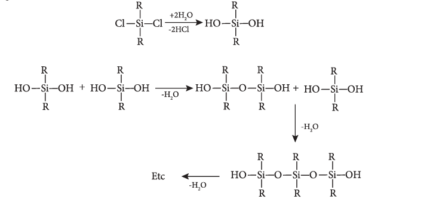

The hydrolysis of monoalkylchloro silanes \(RSiCl_{3}\) yields to a very complex cross linked polymer. Linear silicones can be converted into cyclic or ring silicones when water molecules is removed from the terminal - OH groups.

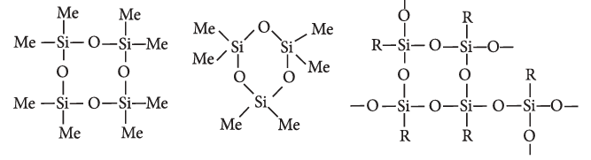

**Types of silicones:**

**(i) Linear silicones:**

They are obtained by the hydrolysis and subsequent condensation of dialkyl or diaryl silicon chlorides.

a) Silicone rubbers: These silicones are bridged together by methylene or similar groups

b) Silicone resins: They are obtained by blending silicones with organic resins such as acrylic esters.

**(ii) Cyclic silicones**

These are obtained by the hydrolysis of \(R_{2}SiCl_{2}\)

**(iii) Cross linked silicones**

They are obtained by hydrolysis of \(RSiCl_{3}\)

**Properties**

The extent of cross linking and nature of alkyl group determine the nature of polymer. They range from oily liquids to rubber like solids. All silicones are water repellent. This property arises due to the presence of organic side groups that surrounds the silicon which makes the molecule looks like an alkane. They are also thermal and electrical insulators. Chemically they are inert. Lower silicones are oily liquids whereas higher silicones with long chain structure are waxy solids. The viscosity of silicon oil remains constant and doesn't change with temperature and they don't thicken during winter

**Uses:**

1. Silicones are used for low temperature lubrication and in vacuum pumps, high temperature oil baths etc...
2. They are used for making water proofing clothes
3. They are used as insulating material in electrical motor and other appliances
4. They are mixed with paints and enamels to make them resistant towards high temperature, sunlight, dampness and chemicals.

#### 2.3.9 Silicates

The mineral which contains silicon and oxygen in tetrahedral \([SiO_4]^{4-}\) units linked together in different patterns are called silicates. Nearly \(95\%\) of the earth crust is composed of silicate minerals and silica. The glass and ceramic industries are based on the chemistry of silicates.

**Types of Silicates:**

Silicates are classified into various types based on the way in which the tetrahedral units, \([SiO_4]^{4-}\) are linked together.

**Ortho silicates (Neso silicates):** The simplest silicates which contain discrete \([SiO_4]^{4-}\) tetrahedral units are called ortho silicates or neso silicates.

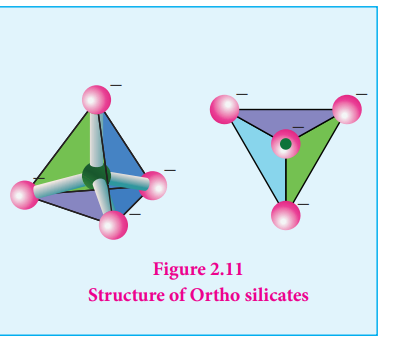

Examples : Phenacite - \(Be_2SiO_4\) (\(Be^{2+}\) ions are tetrahedrally surrounded by \(O^{2-}\) ions), Olivine - \((Fe / Mg)_2SiO_4\) (\(Fe^{2+}\) and \(Mg^{2+}\) cations are octahedrally surrounded by \(O^{2-}\) ions),

**Pyro silicate (or Soro silicates):**

Silicates which contain \([Si_2O_7]^{6-}\) ions are called pyro silicates (or) Soro silicates. They are formed by joining two \([SiO_4]^{4-}\) tetrahedral units by sharing one oxygen atom at one corner (one oxygen is removed while joining). Example : Thortveitite - \(Sc_2Si_2O_7\)

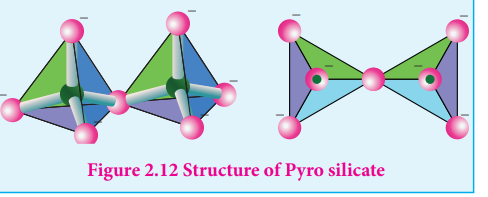

**Cyclic silicates (or Ring silicates)**

Silicates which contain \((SiO_3)_n^{2n-}\) ions which are formed by linking three or more tetrahedral \(SiO_4^{4-}\) units cyclically are called cyclic silicates. Each silicate unit shares two of its oxygen atoms with other units.

Example: Beryl \([Be_3Al_2(SiO_3)_6]\) (an aluminosilicate with each aluminium is surrounded by 6 oxygen atoms octahedrally)

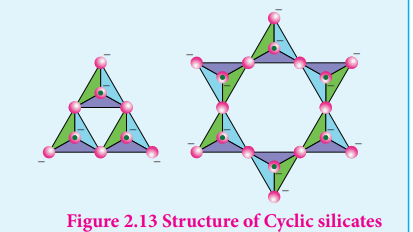

**Inosilicates:**

Silicates which contain 'n' number of silicate units linked by sharing two or more oxygen atoms are called insilicates. They are further classified as chain silicates and double chain silicates.

**Chain silicates (or pyroxenes):** These silicates contain \([(SiO_3)_n]^{2n-}\) ions formed by linking 'n' number of tetrahedral \([SiO_4]^{4-}\) units linearly. Each silicate unit shares two of its oxygen atoms with other units.

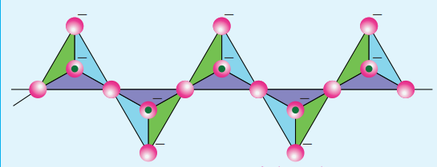

Example: Spodumene - \(LiAl(SiO_3)_2\)

**Double chain silicates (or amphiboles):** These silicates contains \([Si_4O_{11}]_n^{6n-}\) ions. In these silicates there are two different types of tetrahedra : (i) Those sharing 3 vertices (ii) those sharing only 2 vertices.

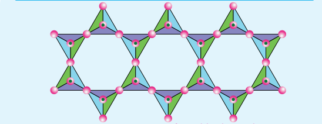

**Examples**

**1 Asbestos:** These are fibrous and noncombustible silicates. Therefore they are used for thermal insulation material, brake linings, construction material and filters. Asbestos being carcinogenic silicates, their applications are restricted.

**Sheet or phyllo silicates**

Silicates which contain \((Si_{2}O_{5})_n^{2n-}\) are called sheet or phyllo silicates. In these, Each \([SiO_4]^{4-}\) tetrahedron shares three oxygen atoms with others and thus by forming two dimensional sheets. These sheet silicates form layered structures in which silicate sheets are stacked over each other. The attractive forces between these layers are very weak, hence they can be cleaved easily just like graphite.

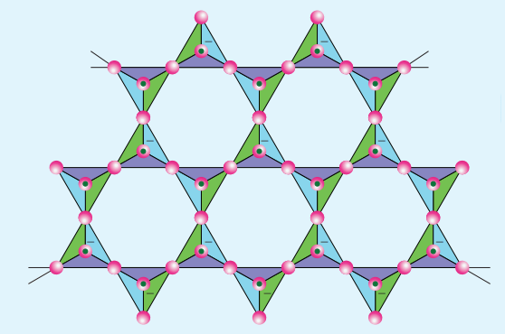

Example: Talc, Mica etc...

**Three dimensional silicates (or tecto silicates):**

Silicates in which all the oxygen atoms of \([SiO_4]^{4-}\) tetrahedra are shared with other tetrahedra to form three- dimensional network are called three dimensional or tecto silicates. They have general formula \((SiO_2)_n\).

**Examples: Quartz**

These tecto silicates can be converted into three dimensional aluminosilicates by replacing \([SiO_4]^{4-}\) units by \([AlO_4]^{5-}\) units. E.g. Feldspar, Zeolites etc.

#### 2.3.10 Zeolites:

Zeolites are three- dimensional crystalline solids containing aluminium, silicon, and oxygen in their regular three dimensional framework. They are hydrated sodium alumino silicates with general formula \(Na_2O.(Al_2O_3).x(SiO_2).yH_2O\) (x=2 to 10; y=2 to 6).

Zeolites have porous structure in which the monovalent sodium ions and water molecules are loosely held. The Si and Al atoms are tetrahedrally coordinated with each other through shared oxygen atoms. Zeolites are similar to clay minerals but they differ in their crystalline structure.

Zeolites have a three dimensional crystalline structure looks like a honeycomb consisting of a network of interconnected tunnels and cages. Water molecules move freely in and out of these pores but the zeolite framework remains rigid. Another special aspect of this structure is that the pore/channel sizes are nearly uniform, allowing the crystal to act as a molecular sieve. We have already discussed in XI standard, the removal of permanent hardness of water using zeolites.

> **Do You Know**
>
> **Boron Neutron Capture Therapy:**
>
> The affinity of Boron-10 for neutrons is the basis of a technique known as boron neutron capture therapy (BNCT) for treating patients suffering from brain tumours.
>
> It is based on the nuclear reaction that occurs when boron-10 is irradiated with low- energy thermal neutrons to give high linear energy \(\alpha\) particles and a Li particle.
>
> Boron compounds are injected into a patient with a brain tumour and the compounds collect preferentially in the tumour. The tumour area is then irradiated with thermal neutrons and results in the release of an alpha particle that damages the tissue in the tumour each time a boron-10 nucleus captures a neutron. In this way damage can be limited preferentially to the tumour, leaving the normal brain tissue less affected. BNCT has also been studied as a treatment for several other tumours of the head and neck, the breast, the prostate, the bladder, and the liver.

## Summary

- The elements in which their last electron enters the 'p' orbital, constitute the p-block elements.
- The p-block elements have a general electronic configuration of \( ns^2 \), \( np^{1-6} \). The elements of each group have similar outer shell electronic configuration and differ only in the value of \( n \) (principal quantum number).
- Generally on descending a group the ionisation energy decreases and hence the metallic character increases.
- The ionisation enthalpy of elements in successive groups is higher than the corresponding elements of the previous group as expected.
- As we move down the 13\(^\text{th}\) group, the electronegativity first decreases from boron to aluminium and then marginally increases.
- In p-block elements, the first member of each group differs from the other elements of the corresponding group.
- In heavier post-transition metals, the outer \( s \) electrons (\( ns \)) have a tendency to remain inert and show reluctance to take part in the bonding, which is known as inert pair effect.
- Some elements exist in more than one crystalline or molecular forms in the same physical state. For example, carbon exists as diamond and graphite. This phenomenon is called allotropism.
- Borax is a sodium salt of tetraboric acid. It is obtained from colemanite ore by boiling its solution with sodium carbonate.
- Boric acid can be extracted from borax and colemanite.
- Boric acid has a two dimensional layered structure.
- The name alum is given to the double salt of potassium aluminium sulphate \([K_2SO_4 \cdot Al_2(SO_4)_3 \cdot 24H_2O]\).
- Carbon is found in the native form as graphite.
- Silicon occurs as silica (sand and quartz crystal). Silicate minerals and clay are other important sources for silicon.
- Catenation is the ability of an element to form chain of atoms.
- Carbon nanotubes, another recently discovered allotropes, have graphite like tubes with fullerene ends.
- Silicones or poly siloxanes are organo silicon polymers with general empirical formula \((R_2SiO)\). Because of their very high thermal stability they are called high-temperature polymers.
- The mineral which contains silicon and oxygen in tetrahedral \([SiO_4]^{4-}\) units linked together in different patterns are called silicates.
- Types of Silicates:
    - **Ortho silicates (Neso silicates), Pyro silicate (or) Soro silicates,** Cyclic silicates (or Ring silicates)
    - Inosilicates : **Chain silicates (or pyroxenes), Double chain silicates (or amphiboles):**
    - Sheet or phyllo silicates
    - Three dimensional silicates (or tecto silicates)
- Zeolites are three-dimensional crystalline solids containing aluminium, silicon, and oxygen in their regular three dimensional framework.
- Zeolites act as a molecular sieve for the removal of permanent hardness of water.

