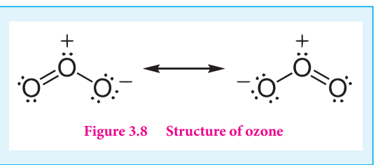
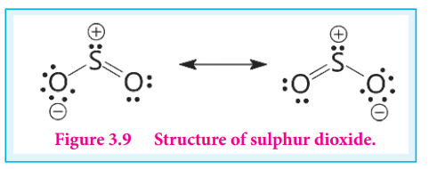
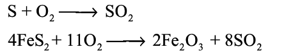
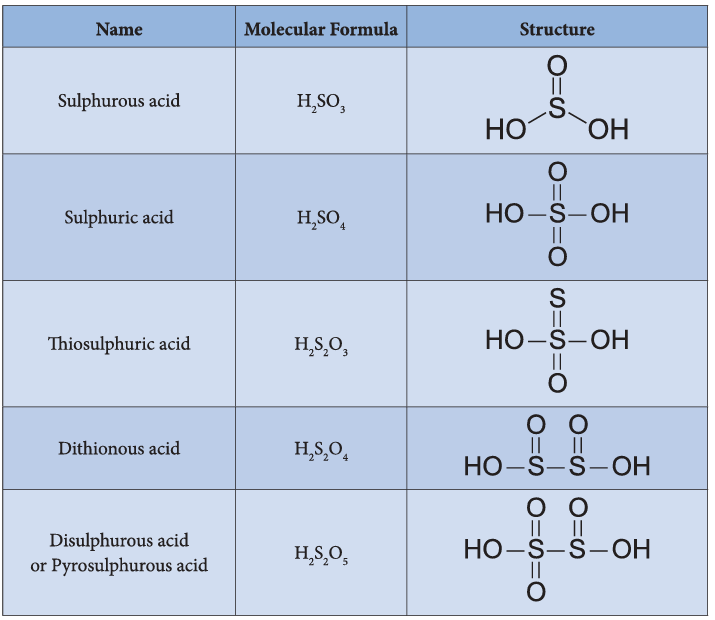
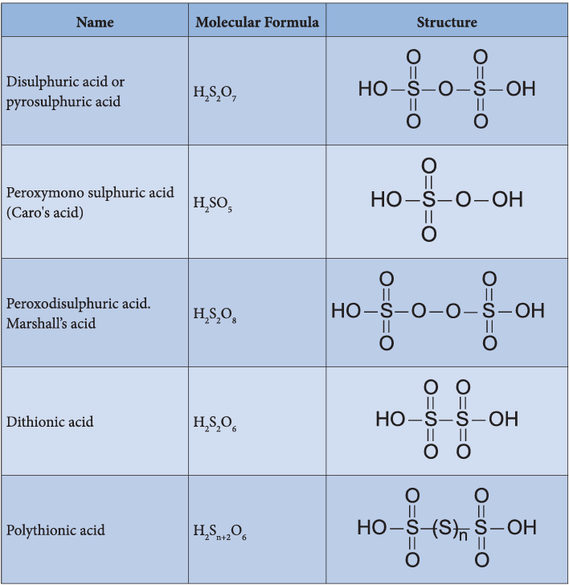

# 3. p-BLOCK ELEMENTS-II

## Learning Objectives

After studying this unit, the students will be able to

- discuss the preparation and properties of important compounds of nitrogen and phosphorus
- describe the preparation and properties of important compounds of oxygen and sulphur
- describe the preparation, properties of halogens and hydrogen halides
- explain the chemistry of inter-halogen compounds
- describe the occurrence, properties and uses of noble gases
- appreciate the importance of p-block elements and their compounds in day today life.

We have already learnt the general characteristics of p-block elements and the first two group namely icosagens (boron group) and tetragens (carbon group) in the previous unit. In this unit we learn the remaining p-block groups, pnictogens, chalcogens, halogens and inert gases.

### 3.1 Group 15 (Nitrogen group) elements

#### 3.1.1 Occurrence

About \( 78\% \) of earth atmosphere contains dinitrogen \( \mathrm{(N_2)} \) gas. It is also present in earth crust as sodium nitrate (Chile saltpetre) and potassium nitrate (Indian saltpetre). The 11th most abundant element phosphorus, exists as phosphate (fluoroapatite, chloroapatite and hydroxyapatite). The other elements arsenic, antimony and bismuth are present as sulphides and are not very abundant.

#### 3.1.2 Physical properties

Some of the physical properties of the group 15 elements are listed below

**Table 3.1 Physical properties of group 15 elements**

| Property | Nitrogen | Phosphorus | Arsenic | Antimony | Bismuth |
|---|---|---|---|---|---|
| Physical state at 293 K | Gas | Solid | Solid | Solid | Solid |
| Atomic Number | 7 | 15 | 33 | 51 | 83 |
| Isotopes | \( ^{14}\mathrm{N}, ^{15}\mathrm{N} \) | \( ^{31}\mathrm{P} \) | \( ^{75}\mathrm{As} \) | \( ^{121}\mathrm{Sb} \) | \( ^{209}\mathrm{Bi} \) |
| Atomic Mass (g mol\(^{-1}\) at 293 K) | 14 | 30.97 | 74.92 | 121.76 | 209.98 |
| Electronic configuration | \( [\mathrm{He}]2s^2 2p^3 \) | \( [\mathrm{Ne}]3s^2 3p^3 \) | \( [\mathrm{Ar}]3d^{10} 4s^2 4p^3 \) | \( [\mathrm{Kr}]4d^{10} 5s^2 5p^3 \) | \( [\mathrm{Xe}]4f^{14}5d^{10}6s^2 6p^3 \) |
| Atomic radius (Å) | 1.55 | 1.80 | 1.85 | 2.06 | 2.07 |
| Density (g cm\(^{-3}\) at 293 K) | \( 1.14 \times 10^{-3} \) | 1.82 (white phosphorus) | 5.75 | 6.68 | 9.79 |
| Melting point (K) | 63 | 317 | Sublimes at 904 | 544 | 544 |
| Boiling point (K) | 77 | 553 | 548 | 891 | 860 |

#### 3.1.3 Nitrogen

##### Preparation

Nitrogen, the principal gas of atmosphere (\( 78\% \) by volume) is separated industrially from liquid air by fractional distillation.

Pure nitrogen gas can be obtained by the thermal decomposition of sodium azide about 575 K

$$
2\mathrm{NaN}_3 \longrightarrow 2\mathrm{Na} + 3\mathrm{N}_2
$$

$$
6\mathrm{NH}_3 + 3\mathrm{Br}_2 \longrightarrow 6\mathrm{NH}_4\mathrm{Br} + \mathrm{N}_2
$$

##### Properties

Nitrogen gas is rather inert. Terrestrial nitrogen contains \( 14.5\% \) and \( 0.4\% \) of nitrogen-14 and nitrogen-15 respectively. The latter is used for isotopic labelling. The chemically inert character of nitrogen is largely due to high bonding energy of the molecules 225 cal mol\(^{-1}\) (946 kJ mol\(^{-1}\)). Interestingly the triply bonded species is notable for its less reactivity in comparison with other iso-electronic triply bonded systems such as \( \mathrm{-C=C-} \), \( \mathrm{C=O} \), \( \mathrm{X-C=N} \), \( \mathrm{X-N=C} \), \( \mathrm{-C=C-} \), and \( \mathrm{-C=N} \). These groups can act as donor where as dinitrogen cannot. However, it can form complexes with metal (\( \mathrm{M-N=N} \)) like CO to a less extent.

The only reaction of nitrogen at room temperature is with lithium forming \( \mathrm{Li_3N} \). With other elements, nitrogen combines only at elevated temperatures. Group 2 metals and Th forms ionic nitrides.

$$
6\mathrm{Li} + \mathrm{N}_2 \longrightarrow 2\mathrm{Li}_3\mathrm{N}
$$

$$
3\mathrm{Ca} + \mathrm{N}_2 \xrightarrow{\text{red hot}} \mathrm{Ca}_3\mathrm{N}_2
$$

$$
2\mathrm{B} + \mathrm{N}_2 \xrightarrow{\text{bright red hot}} 2\mathrm{BN}
$$

Direct reaction with hydrogen gives ammonia. This reaction is favoured by high pressures and at optimum temperature in presence of iron catalyst. This reaction is the basis of Haber's process for the synthesis of ammonia.

$$
\frac{1}{2}\mathrm{N}_2 + \frac{3}{2}\mathrm{H}_2 \xrightarrow{\mathrm{NH}_3} \Delta \mathrm{H}_f = -46.2\ \mathrm{kJ\ mol}^{-1}
$$

With oxygen, nitrogen produces nitrous oxide at high temperatures. Even at 3473 K nitrous oxide yield is only \( 4.4\% \).

$$
2\mathrm{N}_2 + \mathrm{O}_2 \longrightarrow 2\mathrm{N}_2\mathrm{O}
$$

##### Uses of nitrogen

1. Nitrogen is used for the manufacture of ammonia, nitric acid and calcium cyanamide etc.
2. Liquid nitrogen is used for producing low temperature required in cryosurgery, and so in biological preservation.

#### 3.1.4 Ammonia \( \mathrm{(NH_3)} \)

##### Preparation

Ammonia is formed by the hydrolysis of urea.

$$
\mathrm{NH_2CONH_2 + H_2O} \longrightarrow 2\mathrm{NH_3 + CO_2}
$$

Ammonia is prepared in the laboratory by heating an ammonium salt with a base.

$$
\mathrm{NH_4^+ + OH^-} \longrightarrow \mathrm{NH_3 + H_2O}
$$

$$
2\mathrm{NH_4Cl + CaO} \longrightarrow \mathrm{CaCl_2 + 2NH_3 + H_2O}
$$

$$
\mathrm{Mg_3N_2 + 6H_2O} \longrightarrow 3\mathrm{Mg(OH)_2 + 2NH_3}
$$

It is industrially manufactured by passing nitrogen and hydrogen over iron catalyst (a small amount of \( \mathrm{K_2O} \) and \( \mathrm{Al_2O_3} \) is also used to increase the rate of attainment of equilibrium) at 750 K at 200 atm pressure. In the actual process the hydrogen required is obtained from water gas and nitrogen from fractional distillation of liquid air.

##### Properties

Ammonia is a pungent smelling gas and is lighter than air. It can be readily liquefied at about 9 atmospheric pressure. The liquid boils at \( -38.4^{\circ}\mathrm{C} \) and freezes at \( -77^{\circ}\mathrm{C} \). Liquid ammonia resembles water in its physical properties i.e. it is highly associated through strong hydrogen bonding. Ammonia is extremely soluble in water (702 volume in 1 volume of water) at \( 20^{\circ}\mathrm{C} \) and 760 mm pressure.

At low temperatures two soluble hydrate \( \mathrm{NH_3.H_2O} \) and \( 2\mathrm{NH_3.H_2O} \) are isolated. In these molecules ammonia and water are linked by hydrogen bonds. In aqueous solutions also ammonia may be hydrated in a similar manner and we call the same as \( \mathrm{(NH_3,H_2O)} \).

$$
\mathrm{NH_3 + H_2O \Longrightarrow NH_4^+ + OH^-}
$$

The dielectric constant of ammonia is considerably high to make it a fairly good ionising solvent like water.

$$
2\mathrm{NH_3 \Longrightarrow NH_4^+ + NH_2^-}
$$

$$
\mathrm{K}_{-50^{\circ}\mathrm{C}} = [\mathrm{NH_4^+}][\mathrm{NH_2^-}] = 10^{-30}
$$

$$
2\mathrm{H_2O \Longrightarrow H_3O^+ + OH^-}
$$

$$
\mathrm{K}_{25^{\circ}\mathrm{C}} = [\mathrm{H_3O^+}][\mathrm{OH^-}] = 10^{-14}
$$

##### Chemical Properties

**Action of heat:** Above \( 500^{\circ}\mathrm{C} \) ammonia decomposes into its elements. The decomposition may be accelerated by metallic catalysts like Nickel, Iron. Almost complete dissociation occurs on continuous sparking.

$$
2\mathrm{NH_3} \xrightarrow{500^{\circ}\mathrm{C}} \mathrm{N_2 + 3H_2}
$$

**Reaction with air/oxygen:** Ammonia does not burn in air but burns freely in free oxygen with a yellowish flame to give nitrogen and steam.

$$
4\mathrm{NH_3 + 3O_2} \longrightarrow 2\mathrm{N_2 + 6H_2O}
$$

In presence of catalyst like platinum, it burns to produce nitric oxide. This process is used for the manufacture of nitric acid and is known as Ostwald's process.

$$
4\mathrm{NH_3 + 5O_2} \longrightarrow 4\mathrm{NO + 6H_2O}
$$

**Reducing property:** Ammonia acts as a reducing agent. It reduces the metal oxides to metal when passed over heated metallic oxide.

$$
3\mathrm{PbO + 2NH_3} \longrightarrow 3\mathrm{Pb + N_2 + 3H_2O}
$$

**Reaction with acids:** When treated with acids it forms ammonium salts. This reaction shows that the affinity of ammonia for proton is greater than that of water.

**Reaction with chlorine and chlorides:** Ammonia reacts with chlorine and chlorides to give ammonium chloride as a final product. The reactions are different under different conditions as given below.

With excess ammonia

$$
2\mathrm{NH_3 + 3Cl_2} \longrightarrow \mathrm{N_2 + 6HCl}
$$

$$
6\mathrm{HCl + 6NH_3} \longrightarrow 6\mathrm{NH_4Cl}
$$

With excess of chlorine ammonia reacts to give nitrogen trichloride, an explosive substance.

$$
2\mathrm{NH_3 + 6Cl_2} \longrightarrow 2\mathrm{NCl_3 + 6HCl}
$$

$$
2\mathrm{NH_3(g) + HCl(g)} \longrightarrow \mathrm{NH_4Cl(s)}
$$

**Formation of amides and nitrides:** With strong electro positive metals such as sodium, ammonia forms amides while it forms nitrides with metals like magnesium.

$$
2\mathrm{Na + 2NH_3} \longrightarrow 2\mathrm{NaNH_2 + H_2}
$$

$$
3\mathrm{Mg + 2NH_3} \longrightarrow \mathrm{Mg_3N_2 + 3H_2}
$$

Reaction of ammonia with HCl

**With metallic salts:** Ammonia reacts with metallic salts to give metal hydroxides (in case of Fe) or forming complexes (in case Cu)

$$
\mathrm{Fe^{3+} + 3NH_4^+ + 3OH^-} \longrightarrow \mathrm{Fe(OH)_3 + 3NH_4^+}
$$

$$
\mathrm{Cu^{2+} + 4NH_3} \longrightarrow [\mathrm{Cu(NH_3)_4}]^{2+} \quad \text{Tetraamminecopper(II) ion (a coordination complex)}
$$

**Formation of amines:** Ammonia forms ammonated compounds by ion dipole attraction. Eg. \( [\mathrm{CaCl_2.8NH_3}] \). In this, the negative ends of ammonia dipole is attracted to \( \mathrm{Ca^{2+}} \) ion.

It can also act as a ligand and form coordination compounds such as \( [\mathrm{Co(NH_3)_6}]^{3+} \), \( [\mathrm{Ag(NH_3)_2}]^+ \).

For example when excess ammonia is added to aqueous solution copper sulphate a deep blue colour compound \( [\mathrm{Cu(NH_3)_4}]^{2+} \) is formed.

##### Structure of ammonia

Ammonia molecule is pyramidal in shape. N-H bond distance is 1.016 Å and H-H bond distance is 1.645 Å with a bond angle \( 107^{\circ} \). The structure of ammonia may be regarded as a tetrahedral with one lone pair of electrons in one tetrahedral position hence it has a pyramidal shape as shown in the figure.

Figure 3.1 Structure of ammonia

#### 3.1.5 Nitric acid

##### Preparation

Nitric acid is prepared by heating equal amounts of potassium or sodium nitrate with concentrated sulphuric acid.

$$
\mathrm{KNO_3 + H_2SO_4 \longrightarrow KHSO_4 + HNO_3}
$$

The temperature is kept as low as possible to avoid decomposition of nitric acid. The acid condenses to a fuming liquid which is coloured brown by the presence of a little nitrogen dioxide which is formed due to the decomposition of nitric acid.

$$
4\mathrm{HNO_3} \longrightarrow 4\mathrm{NO_2 + 2H_2O + O_2}
$$

##### Commercial method of preparation

Nitric acid prepared in large scales using Ostwald's process. In this method ammonia from Haber's process is mixed about 10 times of air. This mixture is preheated and passed into the catalyst chamber where they come in contact with platinum gauze. The temperature rises to about 1275 K and the metallic gauze brings about the rapid catalytic oxidation of ammonia resulting in the formation of NO, which then oxidised to nitrogen dioxide.

$$
4\mathrm{NH_3 + 5O_2} \longrightarrow 4\mathrm{NO + 6H_2O} + 120\ \mathrm{kJ}
$$

$$
2\mathrm{NO + O_2} \longrightarrow 2\mathrm{NO_2}
$$

The nitrogen dioxide produced is passed through a series of adsorption towers. It reacts with water to give nitric acid. Nitric oxide formed is bleached by blowing air.

$$
3\mathrm{NO_2 + H_2O} \longrightarrow 2\mathrm{HNO_3 + NO}
$$

##### Properties

Pure nitric acid is colourless. It boils at \( 86^{\circ}\mathrm{C} \). The acid is completely miscible with water forming a constant boiling mixture (\( 98\% \mathrm{HNO_3} \) boiling point \( 120.5^{\circ}\mathrm{C} \)). Fuming nitric acid contains oxides of nitrogen. It decomposes on exposure to sunlight or on being heated, into nitrogen dioxide, water and oxygen.

$$
4\mathrm{HNO_3} \longrightarrow 4\mathrm{NO_2 + 2H_2O + O_2}
$$

Due to this reaction pure acid or its concentrated solution becomes yellow on standing.

In most of the reactions, nitric acid acts as an oxidising agent. Hence the oxidation state changes from \( +5 \) to a lower one. It doesn't yield hydrogen in its reaction with metals. Nitric acid can act as an acid, an oxidizing agent and a nitrating agent.

**As an acid:** Like other acids it reacts with bases and basic oxides to form salts and water

$$
\mathrm{ZnO + 2HNO_3} \longrightarrow \mathrm{Zn(NO_3)_2 + H_2O}
$$

$$
3\mathrm{FeO + 10HNO_3} \longrightarrow 3\mathrm{Fe(NO_3)_3 + NO + 5H_2O}
$$

**As an oxidising agent:** The nonmetals like carbon, sulphur, phosphorus and iodine are oxidised by nitric acid.

$$
\mathrm{C + 4HNO_3} \longrightarrow 2\mathrm{H_2O + 4NO_2 + CO_2}
$$

$$
\mathrm{S + 2HNO_3} \longrightarrow \mathrm{H_2SO_4 + 2NO}
$$

$$
\mathrm{P_4 + 20HNO_3} \longrightarrow 4\mathrm{H_3PO_4 + 4H_2O + 20NO_2}
$$

$$
3\mathrm{I_2 + 10HNO_3} \longrightarrow 6\mathrm{HIO_3 + 10NO + 2H_2O}
$$

$$
\mathrm{HNO_3 + F_2} \longrightarrow \mathrm{HF + NO_3F}
$$

$$
3\mathrm{H_2S + 2HNO_3} \longrightarrow 3\mathrm{S + 2NO + 4H_2O}
$$

**As a nitrating agent:** In organic compounds replacement of a \( -\mathrm{H} \) atom with \( -\mathrm{NO}_2 \) is often referred as nitration. For example:

$$
\mathrm{C_6H_6 + HNO_3 \xrightarrow{H_2SO_4} C_6H_5NO_2 + H_2O}
$$

Nitration takes place due to the formation of nitronium ion

$$
\mathrm{HNO_3 + H_2SO_4} \longrightarrow \mathrm{NO_2^+ + H_2O + HSO_4^-}
$$

##### Action of nitric acid on metals

All metals with the exception of gold, platinum, rhodium, iridium and tantalum reacts with nitric acid. Nitric acid oxidises the metals. Some metals such as aluminium, iron, cobalt, nickel and chromium are rendered passive in concentrated acid due to the formation of a layer of their oxides on the metal surface, which prevents the nitric acid from reacting with pure metal.

With weak electropositive metals like tin, arsenic, antimony, tungsten and molybdenum, nitric acid gives metal oxides in which the metal is in the higher oxidation state and the acid is reduced to a lower oxidation state. The most common products evolved when nitric acid reacts with a metal are gases \( \mathrm{NO_2} \), NO and \( \mathrm{H_2O} \). Occasionally \( \mathrm{N_2} \), \( \mathrm{NH_2OH} \) and \( \mathrm{NH_3} \) are also formed.

$$
\mathrm{HNO_3 \xrightarrow{+5} NO_2 \xrightarrow{+4} NO_2 \xrightarrow{+3} HNO_2 \xrightarrow{+2} NO \xrightarrow{+1} N_2O \xrightarrow{0} N_2 \xrightarrow{-3} NH_3}
$$

The reactions of metals with nitric acid are explained in 3 steps as follows:

**Primary reaction:** Metal nitrate is formed with the release of nascent hydrogen

$$
\mathrm{M + HNO_3} \longrightarrow \mathrm{MNO_3 + (H)}
$$

**Secondary reaction:** Nascent hydrogen produces the reduction products of nitric acid.

$$
\mathrm{HNO_3 + 2(H)} \longrightarrow \mathrm{HNO_2 + H_2O}
$$

$$
\mathrm{HNO_3 + 6(H)} \longrightarrow \mathrm{NH_2OH + 2H_2O}
$$

$$
\mathrm{HNO_3 + 8(H)} \longrightarrow \mathrm{NH_3 + 3H_2O}
$$

$$
2\mathrm{HNO_3 + 8(H)} \longrightarrow \mathrm{H_2N_2O_2 + 4H_2O}
$$

**Tertiary reaction:** The secondary products either decompose or react to give final products

Decomposition of the secondary:

$$
3\mathrm{HNO_2} \longrightarrow \mathrm{HNO_3 + 2NO_2 + H_2O}
$$

$$
2\mathrm{HNO_2} \longrightarrow \mathrm{N_2O_3 + H_2O}
$$

$$
\mathrm{H_2N_2O_2} \longrightarrow \mathrm{N_2O + H_2O}
$$

Reaction of secondary products:

$$
\mathrm{HNO_2 + NH_3} \longrightarrow \mathrm{N_2 + 2H_2O}
$$

$$
\mathrm{HNO_2 + NH_2OH} \longrightarrow \mathrm{N_2O + 2H_2O}
$$

$$
\mathrm{HNO_2 + HNO_3} \longrightarrow 2\mathrm{NO_2 + H_2O}
$$

##### Examples

Copper reacts with nitric acid in the following manner

$$
3\mathrm{Cu + 6HNO_3} \longrightarrow 3\mathrm{Cu(NO_3)_2 + 6(H)}
$$

$$
6\mathrm{(H) + 3HNO_3} \longrightarrow 3\mathrm{HNO_2 + 3H_2O}
$$

$$
3\mathrm{HNO_2} \longrightarrow \mathrm{HNO_3 + 2NO + H_2O}
$$

Overall reaction

$$
3\mathrm{Cu + 8HNO_3} \longrightarrow 3\mathrm{Cu(NO_3)_2 + 2NO + 4H_2O}
$$

The concentrated acid has a tendency to form nitrogen dioxide

$$
\mathrm{Cu + 4HNO_3} \longrightarrow \mathrm{Cu(NO_3)_2 + 2NO_2 + 2H_2O}
$$

Magnesium reacts with nitric acid in the following way

$$
4\mathrm{Mg + 8HNO_3} \longrightarrow 4\mathrm{Mg(NO_3)_2 + 8[H]}
$$

$$
\mathrm{HNO_3 + 8(H)} \longrightarrow \mathrm{NH_3 + 3H_2O}
$$

$$
\mathrm{HNO_3 + NH_3} \longrightarrow \mathrm{NH_4NO_3}
$$

Overall reaction

$$
4\mathrm{Mg + 10HNO_3} \longrightarrow 4\mathrm{Mg(NO_3)_2 + NH_4NO_3 + 3H_2O}
$$

If the acid is diluted we get \( \mathrm{N_2O} \)

$$
4\mathrm{Mg + 10HNO_3} \longrightarrow 4\mathrm{Mg(NO_3)_2 + N_2O + 5H_2O}
$$

##### Uses of nitric acid

1. Nitric acid is used as a oxidising agent and in the preparation of aquaregia.
2. Salts of nitric acid are used in photography (\( \mathrm{AgNO_3} \)) and gunpowder for firearms (\( \mathrm{NaNO_3} \)).

**Evaluate yourself:** Write the products formed in the reaction of nitric acid (both dilute and concentrated) with zinc.

#### 3.1.6 Oxides and oxoacids of nitrogen

**Table: Oxides of Nitrogen**

**Structures of oxides of nitrogen**

**Structures of oxoacids of nitrogen**

**Preparation of oxoacides of nitrogen**

#### 3.1.7 Allotropic forms of phosphorus

Phosphorus has several allotropic modification of which the three forms namely white, red and black phosphorus are most common.

The freshly prepared white phosphorus is colourless but becomes pale yellow due to formation of a layer of red phosphorus upon standing. Hence it is also known as yellow phosphorus. It is poisonous in nature and has a characteristic garlic smell. It glows in the dark due to oxidation which is called phosphorescence. Its ignition temperature is very low and hence it undergoes spontaneous combustion in air at room temperature to give \( \mathrm{P_2O_5} \).

Figure 3.2 Structure of white phosphorus

The white phosphorus can be changed into red phosphorus by heating it to \( 420^{\circ}\mathrm{C} \) in the absence of air and light. Unlike white phosphorus it is not poisonous and does not show phosphorescence. It also does not ignite at low temperatures. The red phosphorus can be converted back into white phosphorus by boiling it in an inert atmosphere and condensing the vapour under water.

The black phosphorus has a layer structure and also acts as a semiconductor. The four atoms in white phosphorus have polymeric structure with chains of \( \mathrm{P_4} \) linked tetrahedrally. Unlike nitrogen, \( \mathrm{P=P} \) is less stable than P-P single bonds. Hence, phosphorus atoms are linked through single bonds rather than triple bonds. In addition to the above two more allotropes namely scarlet and violet phosphorus are also known for phosphorus.

Figure 3.3 Structure of red phosphorus

#### 3.1.8 Properties of phosphorus

Phosphorus is highly reactive and has the following important chemical properties.

**Reaction with oxygen:** Yellow phosphorus readily catches fire in air giving dense white fumes of phosphorus pentoxide. Red phosphorus also reacts with oxygen on heating to give phosphorus trioxide or phosphorus pentoxide.

$$
4\mathrm{P} + 3\mathrm{O_2} \longrightarrow 2\mathrm{P_2O_3}
$$

$$
4\mathrm{P} + 5\mathrm{O_2} \longrightarrow 2\mathrm{P_2O_5}
$$

**Reaction with halogens:** Phosphorus reacts with halogens to form trihalides and pentahalides.

$$
\mathrm{P_4 + 6Cl_2} \longrightarrow 4\mathrm{PCl_3}
$$

$$
\mathrm{P_4 + 10Cl_2} \longrightarrow 4\mathrm{PCl_5}
$$

**Reaction with metals:** Phosphorus combines with metals to form metal phosphides.

$$
3\mathrm{Ca} + 2\mathrm{P} \longrightarrow \mathrm{Ca_3P_2}
$$

$$
3\mathrm{Mg} + 2\mathrm{P} \longrightarrow \mathrm{Mg_3P_2}
$$

**Reaction with alkali:** White phosphorus reacts with boiling alkali to give phosphine.

$$
4\mathrm{P_4 + 3NaOH + 3H_2O} \longrightarrow 3\mathrm{NaH_2PO_2 + PH_3}
$$

#### 3.1.9 Phosphine \( \mathrm{(PH_3)} \)

##### Preparation

Phosphine is prepared by the action of sodium hydroxide with white phosphorus in an inert atmosphere of carbon dioxide or hydrogen.

$$
4\mathrm{P_4 + 3NaOH + 3H_2O} \longrightarrow 3\mathrm{NaH_2PO_2 + PH_3}
$$

Phosphine can also be prepared by the hydrolysis of metallic phosphides with water or dilute mineral acids.

$$
\mathrm{Ca_3P_2 + 6H_2O} \longrightarrow 2\mathrm{PH_3 \uparrow + 3Ca(OH)_2}
$$

$$
\mathrm{AlP + 3HCl} \longrightarrow \mathrm{PH_3 \uparrow + AlCl_3}
$$

Phosphine is prepared in pure form by heating phosphorous acid.

$$
4\mathrm{H_3PO_3 \xrightarrow{\Delta}} 3\mathrm{H_3PO_4 + PH_3 \uparrow}
$$

A pure sample of phosphine is prepared by heating phosphonium iodide with caustic soda solution.

$$
\mathrm{PH_4I + NaOH} \longrightarrow \mathrm{PH_3 \uparrow + NaI + H_2O}
$$

##### Physical properties

It is colourless, poisonous gas with rotten fish smell. It is slightly soluble in water and is neutral to litmus test. It condenses to a colourless liquid at 188 K and freezes to a solid at 139.5 K.

##### Chemical properties

**Thermal stability:** Phosphine decomposes into its elements when heated in absence of air at 317 K or when electric current is passed through it.

$$
4\mathrm{PH_3 \xrightarrow{317K}} \mathrm{P_4 + 6H_2}
$$

**Combustion:** When phosphine is heated with air or oxygen it burns to give meta phosphoric acid.

$$
4\mathrm{PH_3 + 8O_2 \xrightarrow{\Delta}} \mathrm{P_4O_{10} + 6H_2O}
$$

$$
\mathrm{P_4O_{10} + 6H_2O \xrightarrow{\Delta}} 4\mathrm{HPO_3 + 4H_2O}
$$

**Basic nature:** Phosphine is weakly basic and forms phosphonium salts with halogen acids.

$$
\mathrm{PH_3 + HI} \longrightarrow \mathrm{PH_4I}
$$

$$
\mathrm{PH_4I + H_2O} \longrightarrow \mathrm{PH_3 + H_3O^+ + I^-}
$$

It reacts with halogens to give phosphorus penta halides.

$$
\mathrm{PH_3 + 4Cl_2} \longrightarrow \mathrm{PCl_5 + 3HCl}
$$

**Reducing property:** Phosphine precipitates some metal as phosphide from their salt solutions.

$$
3\mathrm{AgNO_3 + PH_3} \longrightarrow \mathrm{Ag_3P + 3HNO_3}
$$

It forms coordination compounds with lewis acids such as boron trichloride.

$$
\mathrm{BCl_3 + PH_3} \longrightarrow [\mathrm{Cl_3B \longleftarrow :PH_3}]
$$

##### Structure

In phosphine, phosphorus shows \( \mathrm{sp^3} \) hybridisation. Three orbitals are occupied by bond pair and fourth corner is occupied by lone pair of electrons. Hence, bond angle is reduced to \( 93.5^{\circ} \). Phosphine has a pyramidal shape.

Figure 3.4 Structure of phosphine

##### Uses of phosphine

Phosphine is used for producing smoke screen as it gives large smoke. In a ship, a pierced container with a mixture of calcium carbide and calcium phosphide, liberates phosphine and acetylene when thrown into sea. The liberated phosphine catches fire and ignites acetylene. These burning gases serves as a signal to the approaching ships. This is known as Holmes signal.

#### 3.1.10 Phosphorus trichloride and pentachloride

##### Phosphorus trichloride

**Preparation:** When a slow stream of chlorine is passed over white phosphorus, phosphorus trichloride is formed. It can also be obtained by treating white phosphorus with thionyl chloride.

$$
\mathrm{P_4 + 8SOCl_2} \longrightarrow 4\mathrm{PCl_3 + 4SO_2 + 2S_2Cl_2}
$$

**Properties:** When phosphorus trichloride is hydrolysed with cold water it gives phosphorous acid.

$$
\mathrm{PCl_3 + 3H_2O} \longrightarrow \mathrm{H_3PO_3 + 3HCl}
$$

This reaction involves the coordination of a water molecule using a vacant 3d orbital on the phosphorus atom following by elimination of HCl which is similar to hydrolysis of \( \mathrm{SiCl_4} \).

$$
\mathrm{PCl_3 + H_2O} \longrightarrow \mathrm{PCl_3H_2O} \longrightarrow \mathrm{P(OH)Cl_2 + HCl}
$$

This reaction is followed by two more steps to give \( \mathrm{P(OH)_3} \) or \( \mathrm{H_3PO_3} \).

$$
\mathrm{HPOCl_2 + H_2O} \longrightarrow \mathrm{H_2PO_2Cl + HCl}
$$

$$
\mathrm{H_2PO_2Cl + H_2O} \longrightarrow \mathrm{H_3PO_3 + HCl}
$$

Similar reactions occurs with other molecules that contains alcohols and carboxylic acids.

$$
3\mathrm{C_2H_5OH + PCl_3} \longrightarrow 3\mathrm{C_2H_5Cl + H_3PO_3}
$$

$$
3\mathrm{C_2H_5COOH + PCl_3} \longrightarrow 3\mathrm{C_2H_5COCl + H_3PO_3}
$$

**Uses of phosphorus trichloride:** Phosphorus trichloride is used as a chlorinating agent and for the preparation of \( \mathrm{H_3PO_3} \).

##### Phosphorus pentachloride

**Preparation:** When \( \mathrm{PCl_3} \) is treated with excess chlorine, phosphorus pentachloride is obtained.

Figure 3.5 Structure of phosphorus trichloride

$$
\mathrm{PCl_3 + Cl_2} \longrightarrow \mathrm{PCl_5}
$$

**Chemical properties:** On heating phosphorus pentachloride, it decomposes into phosphorus trichloride and chlorine.

$$
\mathrm{PCl_5(g)} \longrightarrow \mathrm{PCl_3(g) + Cl_2(g)}
$$

Phosphorus pentachloride reacts with water to give phosphoryl chloride and orthophosphoric acid.

$$
\mathrm{PCl_5 + H_2O} \longrightarrow \mathrm{POCl_3 + 2HCl}
$$

$$
\mathrm{POCl_3 + 3H_2O} \longrightarrow \mathrm{H_3PO_4 + 3HCl}
$$

Overall reaction

$$
\mathrm{PCl_5 + 4H_2O} \longrightarrow \mathrm{H_3PO_4 + 5HCl}
$$

Phosphorus pentachloride reacts with metal to give metal chlorides. It also chlorinates organic compounds similar to phosphorus trichloride.

$$
2\mathrm{Ag + PCl_5} \longrightarrow 2\mathrm{AgCl + PCl_3}
$$

$$
\mathrm{Sn + 2PCl_5} \longrightarrow \mathrm{SnCl_4 + 2PCl_3}
$$

$$
\mathrm{C_2H_5OH + PCl_5} \longrightarrow \mathrm{C_2H_5Cl + HCl + POCl_3}
$$

$$
\mathrm{C_2H_5COOH + PCl_5} \longrightarrow \mathrm{C_2H_5COCl + HCl + POCl_3}
$$

**Uses of phosphorus pentachloride:** Phosphorus pentachloride is a chlorinating agent and is useful for replacing hydroxyl groups by chlorine atom.

#### 3.1.11 Structure of oxides and oxoacids of phosphorus

Phosphorus forms phosphorus trioxide, phosphorus tetraoxide and phosphorus pentoxide.

In phosphorus trioxide four phosphorus atoms lie at the corners of a tetrahedron and six oxygen atoms along the edges. The P-O bond distance is 165.6 pm.

    

Figure 3.6 Structure of \( \mathrm{P_4O_6} \)

Figure 3.7 Structure of \( \mathrm{P_4O_10} \)

**Oxoacids of Phosphorus - Preparation**

| Name | Formula | Oxidation state | Preparation |
|---|---|---|---|
| Hypophosphorous acid | \( \mathrm{H_3PO_2} \) | +1 | \( \mathrm{P_4 + 6H_2O \rightarrow 3H_3PO_2 + PH_3} \) |
| Orthophosphorous acid | \( \mathrm{H_3PO_3} \) | +3 | \( \mathrm{P_4O_6 + 6H_2O \rightarrow 4H_3PO_3} \) |
| Hypophosphoric acid | \( \mathrm{H_4P_2O_6} \) | +4 | \( 2\mathrm{P + 2O_2 + 2H_2O \rightarrow H_4P_2O_6} \) |
| Orthophosphoric acid | \( \mathrm{H_3PO_4} \) | +5 | \( \mathrm{P_4O_{10} + 6H_2O \rightarrow 4H_3PO_4} \) |
| Pyrophosphoric acid | \( \mathrm{H_4P_2O_7} \) | +5 | \( 2\mathrm{H_3PO_4 \rightarrow H_4P_2O_7 + H_2O} \) |

### 3.2 Group 16 (Oxygen group) elements

#### Occurrence

Elements belonging group 16 are called chalcogens or ore forming elements as most of the ores are oxides or sulphides. First element oxygen, the most abundant element, exists in both as dioxygen in air (above \( 20\% \) by weight as well as volume) and in combined form as oxides. Oxygen and sulphur makes up about \( 46.6\% \) and \( 0.034\% \) of earth crust by weight respectively. Sulphur exists as sulphates (gypsum, epsom salt etc.) and sulphides (galena, zinc blende etc.). It is also present in the volcanic ashes. The other elements of this group are scarce and are often found as selenides, tellurides etc. along with sulphide ores.

#### Physical properties

The common physical properties of the group 16 elements are listed in the Table.

**Table 3.2 Physical properties of group 16 elements**

#### 3.2.1 Oxygen

##### Preparation

The atmosphere and water contain \( 23\% \) and \( 83\% \) by mass of oxygen respectively. Most of the world's rock contain combined oxygen. Industrially oxygen is obtained by fractional distillation of liquefied air. In the laboratory, oxygen is prepared by one of the following methods.

The decomposition of hydrogen peroxide in the presence of catalyst \( \mathrm{(MnO_2)} \) or by oxidation with potassium permanganate.

$$
2\mathrm{H_2O_2} \longrightarrow 2\mathrm{H_2O + O_2}
$$

$$
5\mathrm{H_2O_2 + 2MnO_4^- + 6H^+} \longrightarrow 5\mathrm{O_2 + 8H_2O + 2Mn^{2+}}
$$

The thermal decomposition of certain metallic oxides or oxoanions gives oxygen.

$$
2\mathrm{HgO \xrightarrow{\Delta}} 2\mathrm{Hg + O_2}
$$

$$
2\mathrm{BaO_2 \xrightarrow{\Delta}} 2\mathrm{BaO + O_2}
$$

$$
2\mathrm{KClO_3 \xrightarrow{\Delta}} 2\mathrm{KCl + 3O_2}
$$

$$
2\mathrm{KNO_3 \xrightarrow{\Delta}} 2\mathrm{KNO_2 + O_2}
$$

##### Properties

Under ordinary condition oxygen exists as a diatomic gas. Oxygen is paramagnetic. Like nitrogen and fluorine, oxygen form strong hydrogen bonds. Oxygen exists in two allotropic forms namely dioxygen \( \mathrm{(O_2)} \) and ozone or trioxygen \( \mathrm{(O_3)} \). Although negligible amounts of ozone occurs at sea level it is formed in the upper atmosphere by the action of ultraviolet light. In the laboratory ozone is prepared by passing electrical discharge through oxygen. At a potential of 20,000 V about \( 10\% \) of oxygen is converted into ozone it gives a mixture known as ozonised oxygen. Pure ozone is obtained as a pale blue gas by the fractional distillation of liquefied ozonised oxygen.

$$
\mathrm{O_2 \longrightarrow 2(O)}
$$

$$
\mathrm{O_2 + (O) \longrightarrow O_3}
$$

The ozone molecule has a bent shape and symmetrical with delocalised bonding between the oxygen atoms.

Figure 3.8 Structure of ozone

##### Chemical properties

The chemical properties of oxygen and ozone differ vastly. Oxygen combines with many metals and non-metals to form oxides. With some elements such as s-block elements combination of oxygen occurs at room temperature. Some less reactive metals react when powdered finely and made to react exothermically with oxygen at room temperature but a lump of metal is unaffected under same condition. These finely divided metals are known as pyrophoric and when the powder is set on fire, heat is liberated during a reaction.

On the other hand ozone is a powerful oxidizing agent and it reacts with many substances under conditions where oxygen will not react. For example, it oxidises potassium iodide to iodine. This reaction is quantitative and can be used for estimation of ozone.

$$
\mathrm{O_3 + 2KI + H_2O} \longrightarrow 2\mathrm{KOH + O_2 + I_2}
$$

Ozone is commonly used for oxidation of organic compounds. In acidic solution ozone exceeds the oxidising power of fluorine and atomic oxygen. The rate of decomposition of ozone drops sharply in alkaline solution.

##### Uses

1. Oxygen is one of the essential component for the survival of living organisms.
2. It is used in welding (oxyacetylene welding).
3. Liquid oxygen is used as fuel in rockets etc.

#### 3.2.2 Allotropic forms of sulphur

Sulphur exists in crystalline as well as amorphous allotropic forms. The crystalline form includes rhombic sulphur (\( \alpha \) sulphur) and monoclinic sulphur (\( \beta \) sulphur). Amorphous allotropic form includes plastic sulphur (\( \gamma \) sulphur), milk of sulphur and colloidal sulphur.

Rhombic sulphur also known as \( \alpha \) sulphur, is the only thermodynamically stable allotropic form at ordinary temperature and pressure. The crystals have a characteristic yellow colour and composed of \( \mathrm{S_8} \) molecules. When heated slowly above \( 96^{\circ}\mathrm{C} \), it converts into monoclinic sulphur. Upon cooling below \( 96^{\circ}\mathrm{C} \) the \( \beta \) form converts back to \( \alpha \) form. Monoclinic sulphur also contains \( \mathrm{S_8} \) molecules in addition to small amount of \( \mathrm{S_6} \) molecules. It exists as a long needle like prism and is also called as prismatic sulphur. It is stable between \( 96^{\circ}\mathrm{C} \) - \( 119^{\circ}\mathrm{C} \) and slowly changes into rhombic sulphur.

When molten sulphur is poured into cold water a yellow rubbery ribbon of plastic sulphur is produced. They are very soft and can be stretched easily. On standing (cooling slowly) it slowly becomes hard and changes to stable rhombic sulphur.

Sulphur also exists in liquid and gaseous states. At around \( 140^{\circ}\mathrm{C} \) the monoclinic sulphur melts to form mobile pale yellow liquid called \( \lambda \) sulphur. The vapour over the liquid sulphur consists of \( 90\% \) of \( \mathrm{S_8} \), \( \mathrm{S_7} \) and \( \mathrm{S_6} \) and small amount of mixture of \( \mathrm{S_2} \), \( \mathrm{S_3} \), \( \mathrm{S_4} \), \( \mathrm{S_5} \) molecules.

#### 3.2.3 Sulphur dioxide

##### Preparation

**From sulphur:** A large-scale production of sulphur dioxide is done by burning sulphur in air. About \( 6-8\% \) of sulphur is oxidised to \( \mathrm{SO_3} \).

$$
\mathrm{S + O_2 \longrightarrow SO_2}
$$

$$
2\mathrm{S + 3O_2 \longrightarrow 2SO_3}
$$

**From sulphides:** When sulphide ores such as galena (PbS), zinc blende (ZnS) are roasted in air, sulphur dioxide is liberated. Large amounts of sulphur dioxide required for manufacturing of sulphuric acid and other industrial purpose is prepared by this method.

$$
2\mathrm{ZnS + 3O_2 \xrightarrow{\Delta}} 2\mathrm{ZnO + 2SO_2}
$$

$$
4\mathrm{FeS_2 + 11O_2 \xrightarrow{\Delta}} 2\mathrm{Fe_2O_3 + 8SO_2}
$$

**Laboratory preparation:** Sulphur dioxide is prepared in the laboratory treating a metal or metal sulphite with sulphuric acid.

$$
\mathrm{Cu + 2H_2SO_4} \longrightarrow \mathrm{CuSO_4 + SO_2 + 2H_2O}
$$

$$
\mathrm{SO_3^{2-} + 2H^+} \longrightarrow \mathrm{H_2O + SO_2}
$$

##### Properties

Sulphur dioxide gas is found in volcanic eruptions. A large amount of sulphur dioxide gas is released into atmosphere from power plants using coal and oil and copper melting plants. It is a colourless gas with a suffocating odour. It is highly soluble in water and it is 2.2 times heavier than air. Sulphur dioxide can be liquefied (boiling point 263 K) at 2.5 atmospheric pressure and 288 K.

##### Chemical properties

Sulphur dioxide is an acidic oxide. It dissolves in water to give sulphurous acid.

$$
\mathrm{SO_2 + H_2O \rightleftharpoons H_2SO_3}
$$

$$
\mathrm{H_2SO_3 \rightleftharpoons 2H^+ + SO_3^{2-}}
$$

**Reaction with sodium hydroxide and sodium carbonate:** Sulphur dioxide reacts with sodium hydroxide and sodium carbonate to form sodium bisulphite and sodium sulphite respectively.

$$
\mathrm{SO_2 + NaOH} \longrightarrow \mathrm{NaHSO_3}
$$

$$
2\mathrm{SO_2 + Na_2CO_3 + H_2O} \longrightarrow 2\mathrm{NaHSO_3 + CO_2}
$$

$$
2\mathrm{NaHSO_3} \longrightarrow \mathrm{Na_2SO_3 + H_2O + SO_2}
$$

**Oxidising property:** Sulphur dioxide oxidises hydrogen sulphide to sulphur and magnesium to magnesium oxide.

$$
2\mathrm{H_2S + SO_2} \longrightarrow 3\mathrm{S + 2H_2O}
$$

$$
2\mathrm{Mg + SO_2} \longrightarrow 2\mathrm{MgO + S}
$$

**Reducing property:** As it can readily be oxidised, it acts as a reducing agent. It reduces chlorine into hydrochloric acid.

$$
\mathrm{SO_2 + 2H_2O + Cl_2} \longrightarrow \mathrm{H_2SO_4 + 2HCl}
$$

It also reduces potassium permanganate and dichromate to \( \mathrm{Mn^{2+}} \) and \( \mathrm{Cr^{3+}} \) respectively.

$$
2\mathrm{KMnO_4 + 5SO_2 + 2H_2O} \longrightarrow \mathrm{K_2SO_4 + 2MnSO_4 + 2H_2SO_4}
$$

$$
\mathrm{K_2Cr_2O_7 + 3SO_2 + H_2SO_4} \longrightarrow \mathrm{K_2SO_4 + Cr_2(SO_4)_3 + H_2O}
$$

**Reaction with oxygen:** Sulphur dioxide is oxidised to sulphur trioxide upon heating with oxygen at high temperature. This reaction is used for the manufacture of sulphuric acid by contact process.

$$
2\mathrm{SO_2(g) + O_2(g) \xrightarrow[450^{\circ}\mathrm{C}]{V_2O_5}} 2\mathrm{SO_3(g)}
$$

**Bleaching action of sulphur dioxide:** In presence of water, sulphur dioxide bleaches coloured wool, silk, sponges and straw into colourless due to its reducing property.

$$
\mathrm{SO_2 + 2H_2O} \longrightarrow \mathrm{H_2SO_4 + 2(H)}
$$

$$
\mathrm{X_{Coloured} + 2(H)} \longrightarrow \mathrm{XH_2}
$$
 
However, the bleached product (colourless) when allowed to stand in air, is reoxidised by atmospheric oxygen to its original colour. Hence bleaching action of sulphur dioxide is temporary.

##### Uses

1. Sulphur dioxide is used in bleaching hair, silk, wool etc.
2. It can be used for disinfecting crops and plants in agriculture.

##### Structure of sulphur dioxide

In sulphur dioxide, sulphur atom undergoes \( \mathrm{sp^2} \) hybridisation. A double bond arises between S and O due to \( p\pi-d\pi \) overlapping.

Figure 3.9 Structure of sulphur dioxide

#### 3.2.4 Sulphuric acid \( \mathrm{(H_2SO_4)} \)

##### Preparation

Sulphuric acid can be manufactured by lead chamber process, cascade process or contact process. Here we discuss the contact process.

##### Manufacture of sulphuric acid by contact process

The contact process involves the following steps:

i. Initially sulphur dioxide is produced by burning sulphur or iron pyrites in oxygen/air.

ii. Sulphur dioxide formed is oxidised to sulphur trioxide by air in the presence of a catalyst such as \( \mathrm{V_2O_5} \) or platinised asbestos.

iii. The sulphur trioxide is absorbed in concentrated sulphuric acid and produces oleum \( \mathrm{(H_2S_2O_7)} \). The oleum is converted into sulphuric acid by diluting it with water.

$$
\mathrm{SO_3 + H_2SO_4} \longrightarrow \mathrm{H_2S_2O_7 \xrightarrow{H_2O} 2H_2SO_4}
$$

To maximise the yield the plant is operated at 2 bar pressure and 720 K. The sulphuric acid obtained in this process is over \( 96\% \) pure.

##### Physical properties

Pure sulphuric acid is a colourless, viscous liquid (density: \( 1.84\ \mathrm{g\ mL^{-1}} \) at 298 K). High boiling point and viscosity of sulphuric acid is due to the association of molecules together through hydrogen bonding.

The acid freezes at 283.4 K and boils at 590 K. It is highly soluble in water and has strong affinity towards water and hence it can be used as a dehydrating agent. When dissolved in water, it forms mono \( \mathrm{(H_2SO_4.H_2O)} \) and dihydrates \( \mathrm{(H_2SO_4.2H_2O)} \) and the reaction is exothermic.

The dehydrating property can also be illustrated by its reaction with organic compounds such as sugar, oxalic acid and formic acid.

$$
\mathrm{C_{12}H_{22}O_{11} + H_2SO_4} \longrightarrow 12\mathrm{C + H_2SO_4.11H_2O}
$$

$$
\mathrm{HCOOH + H_2SO_4} \longrightarrow \mathrm{CO + H_2SO_4.H_2O}
$$

$$
\mathrm{(COOH)_2 + H_2SO_4} \longrightarrow \mathrm{CO + CO_2 + H_2SO_4.H_2O}
$$

##### Chemical Properties

Sulphuric acid is highly reactive. It can act as strong acid and an oxidising agent.

**Decomposition:** Sulphuric acid is stable, however, it decomposes at high temperatures to sulphur trioxide.

$$
\mathrm{H_2SO_4} \longrightarrow \mathrm{H_2O + SO_3}
$$

**Acidic nature:** It is a strong dibasic acid. Hence it forms two types of salts namely sulphates and bisulphates.

$$
\mathrm{H_2SO_4 + NaOH} \longrightarrow \mathrm{NaHSO_4 + H_2O}
$$

$$
\mathrm{H_2SO_4 + 2NaOH} \longrightarrow \mathrm{Na_2SO_4 + 2H_2O}
$$

$$
\mathrm{H_2SO_4 + 2NH_3} \longrightarrow \mathrm{(NH_4)_2SO_4}
$$

**Oxidising property:** Sulphuric acid is an oxidising agent as it produces nascent oxygen as shown below.

$$
\mathrm{H_2SO_4} \longrightarrow \mathrm{H_2O + SO_2 + (O)}
$$

Sulphuric acid oxidises elements such as carbon, sulphur and phosphorus. It also oxidises bromide and iodide to bromine and iodine respectively.

$$
\mathrm{C + 2H_2SO_4} \longrightarrow 2\mathrm{SO_2 + 2H_2O + CO_2}
$$

$$
\mathrm{S + 2H_2SO_4} \longrightarrow 3\mathrm{SO_2 + 2H_2O}
$$

$$
\mathrm{P_4 + 10H_2SO_4} \longrightarrow 4\mathrm{H_3PO_4 + 10SO_2 + 4H_2O}
$$

$$
\mathrm{H_2S + H_2SO_4} \longrightarrow \mathrm{SO_2 + 2H_2O + S}
$$

$$
\mathrm{H_2SO_4 + 2HI} \longrightarrow \mathrm{SO_2 + 2H_2O + I_2}
$$

$$
\mathrm{H_2SO_4 + 2HBr} \longrightarrow \mathrm{SO_2 + 2H_2O + Br_2}
$$

**Reaction with metals:** Sulphuric acid reacts with metals and gives different product depending on the reactants and reacting condition.

Dilute sulphuric acid reacts with metals like tin, aluminium, zinc to give corresponding sulphates.

$$
\mathrm{Zn + H_2SO_4} \longrightarrow \mathrm{ZnSO_4 + H_2 \uparrow}
$$

$$
2\mathrm{Al + 3H_2SO_4} \longrightarrow \mathrm{Al_2(SO_4)_3 + 3H_2 \uparrow}
$$

Hot concentrated sulphuric acid reacts with copper and lead to give the respective sulphates as shown below.

$$
\mathrm{Cu + 2H_2SO_4} \longrightarrow \mathrm{CuSO_4 + 2H_2O + SO_2 \uparrow}
$$

$$
\mathrm{Pb + 2H_2SO_4} \longrightarrow \mathrm{PbSO_4 + 2H_2O + SO_2 \uparrow}
$$

Sulphuric acid doesn't react with noble metals like gold, silver and platinum.

**Reaction with salts:** It reacts with different metal salts to give metal sulphates and bisulphates.

$$
\mathrm{KCl + H_2SO_4} \longrightarrow \mathrm{KHSO_4 + HCl}
$$

$$
\mathrm{KNO_3 + H_2SO_4} \longrightarrow \mathrm{KHSO_4 + HNO_3}
$$

$$
\mathrm{Na_2CO_3 + H_2SO_4} \longrightarrow \mathrm{Na_2SO_4 + H_2O + CO_2}
$$

$$
2\mathrm{NaBr + 3H_2SO_4} \longrightarrow 2\mathrm{NaHSO_4 + 2H_2O + Br_2 + SO_2}
$$

**Reaction with organic compounds:** It reacts with organic compounds such as benzene to give sulphonic acids.

$$
\mathrm{C_6H_6 + H_2SO_4} \longrightarrow \mathrm{C_6H_5SO_3H + H_2O}
$$

##### Uses of sulphuric acid

1. Sulphuric acid is used in the manufacture of fertilisers, ammonium sulphate and super phosphates and other chemicals such as hydrochloric acid, nitric acid etc.
2. It is used as a drying agent and also used in the preparation of pigments, explosives etc.

##### Test for sulphate/sulphuric acid

Dilute solution of sulphuric acid/aqueous solution of sulphates gives white precipitate (barium sulphate) with barium chloride solution. It can also be detected using lead acetate solution. Here a white precipitate of lead sulphate is obtained.

$$
\mathrm{BaCl_2 + H_2SO_4} \longrightarrow \mathrm{BaSO_4 \downarrow + 2HCl}
$$

$$
\mathrm{(CH_3COO)_2Pb + H_2SO_4} \longrightarrow \mathrm{PbSO_4 \downarrow + 2CH_3COOH}
$$

##### Structure of oxoacids of sulphur

Sulphur forms many oxoacids. The most important one is sulphuric acid. Some acids like sulphurous and dithionic acids are known in the form of their salts only since the free acids are unstable and cannot be isolated.

**Various oxoacids of sulphur with their structures**

### 3.3 Group 17 (Halogen group) elements

#### 3.3.1 Chlorine

##### Occurrence

The halogens are present in combined form as they are highly reactive. The main source of fluorine is fluorspar or fluorite. The other ores of fluorine are cryolite, fluorapatite. The main source of chlorine is sodium chloride from sea water. Bromides and iodides also occur in sea water.

##### Physical properties

The common physical properties of the group 17 elements are listed in the table.

**Table 3.3 Physical properties of group 17 elements**

| Property | Fluorine | Chlorine | Bromine | Iodine | Astatine |
|---|---|---|---|---|---|
| Physical state at 293 K | Gas | Gas | Liquid | Solid | Solid |
| Atomic Number | 9 | 17 | 35 | 53 | 85 |
| Isotopes | \( ^{19}\mathrm{F} \) | \( ^{35}\mathrm{Cl}, ^{37}\mathrm{Cl} \) | \( ^{79}\mathrm{Br} \) | \( ^{127}\mathrm{I} \) | \( ^{210}\mathrm{At}, ^{211}\mathrm{At} \) |
| Atomic Mass (g mol\(^{-1}\) at 293 K) | 18.99 | 35.45 | 79.91 | 126.9 | 210 |
| Electronic configuration | \( [\mathrm{He}]2s^2 2p^5 \) | \( [\mathrm{Ne}]3s^2 3p^5 \) | \( [\mathrm{Ar}]3d^{10} 4s^2 4p^5 \) | \( [\mathrm{Kr}]4d^{10} 5s^2 5p^5 \) | \( [\mathrm{Xe}]4f^{14}5d^{10}6s^2 6p^5 \) |
| Atomic radius (Å) | 1.47 | 1.75 | 1.85 | 1.98 | 2.02 |
| Density (g cm\(^{-3}\) at 293 K) | \( 1.55 \times 10^{-3} \) | \( 2.89 \times 10^{-3} \) | 3.10 | 4.93 | — |
| Melting point (K) | 53 | 172 | 266 | 387 | 573 |
| Boiling point (K) | 85 | 239 | 332 | 457 | 623 |

##### Properties

Chlorine is highly reactive hence it doesn't occur free in nature. It is usually distributed as various metal chlorides. The most important chloride is sodium chloride which occurs in sea water.

##### Preparation

Chlorine is prepared by the action of conc. sulphuric acid on chlorides in presence of manganese dioxide.

$$
4\mathrm{NaCl + MnO_2 + 4H_2SO_4} \longrightarrow \mathrm{Cl_2 + MnCl_2 + 4NaHSO_4 + 2H_2O}
$$

It can also be prepared by oxidising hydrochloric acid using various oxidising agents such as manganese dioxide, lead dioxide, potassium permanganate or dichromate.

$$
\mathrm{PbO_2 + 4HCl} \longrightarrow \mathrm{PbCl_2 + 2H_2O + Cl_2}
$$

$$
\mathrm{MnO_2 + 4HCl} \longrightarrow \mathrm{MnCl_2 + 2H_2O + Cl_2}
$$

$$
2\mathrm{KMnO_4 + 16HCl} \longrightarrow 2\mathrm{KCl + 2MnCl_2 + 8H_2O + 5Cl_2}
$$

$$
\mathrm{K_2Cr_2O_7 + 14HCl} \longrightarrow 2\mathrm{KCl + 2CrCl_3 + 7H_2O + 3Cl_2}
$$

When bleaching powder is treated with mineral acids chlorine is liberated

$$
\mathrm{CaOCl_2 + 2HCl} \longrightarrow \mathrm{CaCl_2 + H_2O + Cl_2}
$$

$$
\mathrm{CaOCl_2 + H_2SO_4} \longrightarrow \mathrm{CaSO_4 + H_2O + Cl_2}
$$

##### Manufacture of chlorine

Chlorine is manufactured by the electrolysis of brine in electrolytic process or by oxidation of HCl by air in Deacon's process.

**Electrolytic process:** When a solution of brine (NaCl) is electrolysed, \( \mathrm{Na^+} \) and \( \mathrm{Cl^-} \) ions are formed. \( \mathrm{Na^+} \) ion reacts with \( \mathrm{OH^-} \) ions of water and forms sodium hydroxide. Hydrogen and chlorine are liberated as gases.

$$
\mathrm{NaCl \longrightarrow Na^+ + Cl^-}
$$

$$
\mathrm{H_2O \longrightarrow H^+ + OH^-}
$$

At the cathode:

$$
\mathrm{H^+ + e^-} \longrightarrow \mathrm{H}
$$

$$
\mathrm{H + H} \longrightarrow \mathrm{H_2}
$$

At the anode:

$$
\mathrm{Cl^-} \longrightarrow \mathrm{Cl + e^-}
$$

$$
\mathrm{Cl + Cl} \longrightarrow \mathrm{Cl_2}
$$

**Deacon's process:** In this process a mixture of air and hydrochloric acid is passed up a chamber containing a number of shelves, pumice stones soaked in cuprous chloride are placed. Hot gases at about 723 K are passed through a jacket that surrounds the chamber.

$$
4\mathrm{HCl + O_2 \xrightarrow[400^{\circ}\mathrm{C}]{Cu_2Cl_2} 2H_2O + 2Cl_2}
$$

The chlorine obtained by this method is dilute and is employed for the manufacture of bleaching powder. The catalysed reaction is given below:

$$
2\mathrm{Cu_2Cl_2 + O_2} \longrightarrow 2\mathrm{Cu_2OCl_2}
$$

$$
\mathrm{Cu_2OCl_2 + 2HCl} \longrightarrow 2\mathrm{CuCl_2 + H_2O}
$$

$$
2\mathrm{CuCl_2} \longrightarrow 2\mathrm{Cu_2Cl_2 + Cl_2}
$$

##### Physical properties

Chlorine is a greenish yellow gas with a pungent irritating odour. It produces headache when inhaled even in small quantities whereas inhalation of large quantities could be fatal. It is 2.5 times heavier than air.

Chlorine is soluble in water and its solution is referred as chlorine water. It deposits greenish yellow crystals of chlorine hydrate (\( \mathrm{Cl_2.8H_2O} \)). It can be converted into liquid (boiling point \( -34.6^{\circ}\mathrm{C} \)) and yellow crystalline solid (melting point \( -102^{\circ}\mathrm{C} \)).

##### Chemical properties

**Action with metals and non-metals:** It reacts with metals and non metals to give the corresponding chlorides.

$$
2\mathrm{Na + Cl_2} \longrightarrow 2\mathrm{NaCl}
$$

$$
2\mathrm{Fe + 3Cl_2} \longrightarrow 2\mathrm{FeCl_3}
$$

$$
2\mathrm{Al + 3Cl_2} \longrightarrow 2\mathrm{AlCl_3}
$$

$$
\mathrm{Cu + Cl_2} \longrightarrow \mathrm{CuCl_2}
$$

$$
\mathrm{H_2 + Cl_2} \longrightarrow 2\mathrm{HCl} \quad \Delta H = -44\ \mathrm{kCal}
$$

$$
2\mathrm{B + 3Cl_2} \longrightarrow 2\mathrm{BCl_3}
$$

$$
2\mathrm{S + Cl_2} \longrightarrow \mathrm{S_2Cl_2} \text{ (disulphur dichloride)}
$$

$$
\mathrm{P_4 + 6Cl_2} \longrightarrow 4\mathrm{PCl_3}
$$

$$
2\mathrm{As + 3Cl_2} \longrightarrow 2\mathrm{AsCl_3}
$$

$$
2\mathrm{Sb + 3Cl_2} \longrightarrow 2\mathrm{SbCl_3}
$$

**Affinity for hydrogen:** When burnt with turpentine it forms carbon and hydrochloric acid.

$$
\mathrm{C_{10}H_{16} + 8Cl_2} \longrightarrow 10\mathrm{C + 16HCl}
$$

It forms dioxygen when reacting with water in presence of sunlight. When chlorine in water is exposed to sunlight it loses its colour and smell as the chlorine is converted into hydrochloric acid.

$$
2\mathrm{Cl_2 + 2H_2O} \longrightarrow \mathrm{O_2 + 4HCl}
$$

Chlorine reacts with ammonia to give ammonium chloride and other products as shown below:

With excess ammonia,

$$
2\mathrm{NH_3 + 3Cl_2} \longrightarrow \mathrm{N_2 + 6HCl}
$$

$$
6\mathrm{HCl + 6NH_3} \longrightarrow 6\mathrm{NH_4Cl}
$$

With excess chlorine,

$$
8\mathrm{NH_3 + 3Cl_2} \longrightarrow \mathrm{N_2 + 6NH_4Cl}
$$

$$
\mathrm{NH_3 + 3Cl_2} \longrightarrow \mathrm{NCl_3 + 3HCl}
$$

$$
3\mathrm{HCl + 3NH_3} \longrightarrow 3\mathrm{NH_4Cl}
$$

Overall reaction

$$
4\mathrm{NH_3 + 3Cl_2} \longrightarrow \mathrm{NCl_3 + 3NH_4Cl}
$$

Chlorine oxidises hydrogen sulphide to sulphur and liberates bromine and iodine from iodides and bromides. However, it doesn't oxidise fluorides.

$$
\mathrm{H_2S + Cl_2} \longrightarrow 2\mathrm{HCl + S}
$$

$$
\mathrm{Cl_2 + 2KBr} \longrightarrow 2\mathrm{KCl + Br_2}
$$

$$
\mathrm{Cl_2 + 2KI} \longrightarrow 2\mathrm{KCl + I_2}
$$

**Reaction with alkali:** Chlorine reacts with cold dilute alkali to give chloride and hypochlorite while with hot concentrated alkali chlorides and chlorates are formed.

$$
\mathrm{Cl_2 + H_2O} \longrightarrow \mathrm{HCl + HOCl}
$$

$$
\mathrm{HCl + NaOH} \longrightarrow \mathrm{NaCl + H_2O}
$$

$$
\mathrm{HOCl + NaOH} \longrightarrow \mathrm{NaOCl + H_2O}
$$

Overall reaction

$$
\mathrm{Cl_2 + 2NaOH} \longrightarrow \mathrm{NaOCl + NaCl + H_2O}
$$

With hot concentrated alkali,

$$
3\mathrm{Cl_2 + 6NaOH} \longrightarrow \mathrm{NaClO_3 + 5NaCl + 3H_2O}
$$

**Oxidising and bleaching action:** Chlorine is a strong oxidising and bleaching agent because of the nascent oxygen.

$$
\mathrm{H_2O + Cl_2} \longrightarrow \mathrm{HCl + HOCl}
$$

$$
\mathrm{HOCl} \longrightarrow \mathrm{HCl + (O)}
$$

Colouring matter + Nascent oxygen \( \rightarrow \) Colourless oxidation product

The bleaching of chlorine is permanent. It oxidises ferrous salts to ferric, sulphites to sulphates and hydrogen sulphide to sulphur.

$$
2\mathrm{FeCl_2 + Cl_2} \longrightarrow 2\mathrm{FeCl_3}
$$

$$
\mathrm{Cl_2 + H_2O} \longrightarrow \mathrm{HCl + HOCl}
$$

$$
2\mathrm{FeSO_4 + H_2SO_4 + HOCl} \longrightarrow \mathrm{Fe_2(SO_4)_3 + HCl + H_2O}
$$

Overall reaction

$$
2\mathrm{FeSO_4 + H_2SO_4 + Cl_2} \longrightarrow \mathrm{Fe_2(SO_4)_3 + 2HCl}
$$

$$
\mathrm{Cl_2 + H_2O} \longrightarrow \mathrm{HCl + HOCl}
$$

$$
\mathrm{Na_2SO_3 + HOCl} \longrightarrow \mathrm{Na_2SO_4 + HCl}
$$

Overall reaction

$$
\mathrm{Na_2SO_3 + H_2O + Cl_2} \longrightarrow \mathrm{Na_2SO_4 + 2HCl}
$$

$$
\mathrm{Cl_2 + H_2S} \longrightarrow 2\mathrm{HCl + S}
$$

**Preparation of bleaching powder:** Bleaching powder is produced by passing chlorine gas through dry slaked lime (calcium hydroxide).

$$
\mathrm{Ca(OH)_2 + Cl_2} \longrightarrow \mathrm{CaOCl_2 + H_2O}
$$

**Displacement redox reactions:** Chlorine displaces bromine from bromides and iodine from iodide salts.

$$
\mathrm{Cl_2 + 2KBr} \longrightarrow 2\mathrm{KCl + Br_2}
$$

$$
\mathrm{Cl_2 + 2KI} \longrightarrow 2\mathrm{KCl + I_2}
$$

**Formation of addition compounds:** Chlorine forms addition products with sulphur dioxide, carbon monoxide and ethylene. It forms substituted products with alkanes/arenes.

##### Uses of chlorine

1. Purification of drinking water
2. Bleaching of cotton textiles, paper and rayon
3. Extraction of gold and platinum

#### 3.3.2 Hydrochloric acid

##### Laboratory preparation

It is prepared by the action of sodium chloride and concentrated sulphuric acid.

$$
\mathrm{NaCl + H_2SO_4} \longrightarrow \mathrm{NaHSO_4 + HCl}
$$

$$
\mathrm{NaHSO_4 + NaCl} \longrightarrow \mathrm{Na_2SO_4 + HCl}
$$

Dry hydrochloric acid is obtained by passing the gas through conc. sulphuric acid.

##### Properties

Hydrogen chloride is a colourless, pungent smelling gas, easily liquefied to a colourless liquid (boiling point 189 K) and frozen into a white crystalline solid (melting point 159 K). It is extremely soluble in water.

$$
\mathrm{HCl(g) + H_2O(l)} \longrightarrow \mathrm{H_3O^+ + Cl^-}
$$

##### Chemical properties

Like all acids it liberates hydrogen gas from metals and carbon dioxide from carbonate and bicarbonate salts.

$$
\mathrm{Zn + 2HCl} \longrightarrow \mathrm{ZnCl_2 + H_2}
$$

$$
\mathrm{Mg + 2HCl} \longrightarrow \mathrm{MgCl_2 + H_2}
$$

$$
\mathrm{Na_2CO_3 + 2HCl} \longrightarrow 2\mathrm{NaCl + CO_2 + H_2O}
$$

$$
\mathrm{CaCO_3 + 2HCl} \longrightarrow \mathrm{CaCl_2 + CO_2 + H_2O}
$$

$$
\mathrm{NaHCO_3 + 2HCl} \longrightarrow 2\mathrm{NaCl + CO_2 + H_2O}
$$

It liberates sulphur dioxide from sodium sulphite

$$
\mathrm{Na_2SO_3 + 2HCl} \longrightarrow 2\mathrm{NaCl + H_2O + SO_2}
$$

When three parts of concentrated hydrochloric acid and one part of concentrated nitric acid are mixed, Aqua regia (Royal water) is obtained. This is used for dissolving gold, platinum etc.

$$
3\mathrm{Pt + 16H^+ + 4NO_3^- + 18Cl^-} \longrightarrow 3[\mathrm{PtCl_6}]^{2-} + 4\mathrm{NO + 8H_2O}
$$

##### Uses of hydrochloric acid

1. Hydrochloric acid is used for the manufacture of chlorine, ammonium chloride, glucose from corn starch etc.
2. It is used in the extraction of glue from bone and also for purification of bone black.

#### 3.3.3 Trends in physical and chemical properties of hydrogen halides

##### Preparation

Direct combination is a useful means of preparing hydrogen chloride. The reaction between hydrogen and fluorine is violent while the reaction between hydrogen and bromine or hydrogen and iodine are reversible and don't produce pure forms.

##### Displacement reactions

Concentrated sulphuric acid displaces hydrogen chloride from ionic chlorides. At higher temperatures the hydrogen sulphate formed reacts with further ionic chloride. Displacement can be used for the preparation of hydrogen fluorides from ionic fluorides. Hydrogen bromide and hydrogen iodide are oxidised by concentrated sulphuric acid and can't be prepared in this method.

##### Hydrolysis of phosphorus trihalides

Gaseous hydrogen halides are produced when water is added in drops to phosphorus trihalides except phosphorus trifluoride.

$$
\mathrm{PX_3 + 3H_2O} \longrightarrow \mathrm{H_3PO_3 + 3HX}
$$

Hydrogen bromide may be obtained by adding bromine dropwise to a paste of red phosphorus and water while hydrogen iodide is conveniently produced by adding water dropwise to a mixture of red phosphorus and iodine.

$$
2\mathrm{P + 3X_2} \longrightarrow 2\mathrm{PX_3}
$$

$$
2\mathrm{PX_3 + 3H_2O} \longrightarrow \mathrm{H_3PO_3 + 3HX} \ (\text{where } X = \mathrm{Br\ or\ I})
$$

Any halogen vapours which escape with the hydrogen halide is removed by passing the gases through a column of moist red phosphorus.

##### From covalent hydrides

Halogens are reduced to hydrogen halides by hydrogen sulphide.

$$
\mathrm{H_2S + X_2} \longrightarrow 2\mathrm{HX + S}
$$

Hydrogen chloride is obtained as a by-product of the reactions between hydrocarbons and halogens.

**Table 3.4: General Properties**

| | HF | HCl | HBr | HI |
|---|---|---|---|---|
| Bond dissociation enthalpy (kJ mol\(^{-1}\)) | +562 | +431 | +366 | +299 |
| % of ionic character | 43 | 13 | 7 | 3 |

In line with the decreasing bond dissociation enthalpy, the thermal stability of hydrogen halides decreases from fluoride to iodide.

For example, Hydrogen iodide decomposes at \( 400^{\circ}\mathrm{C} \) while hydrogen fluoride and hydrogen chloride are stable at this temperature.

At room temperature, hydrogen halides are gases but hydrogen fluoride can be readily liquefied. The gases are colourless but with moist air gives white fumes due to the production of droplets of hydrochloric acid. In HF, due to the presence of strong hydrogen bond it has high melting and boiling points. This effect is absent in other hydrogen halides.

##### Acidic properties

The hydrogen halides are extremely soluble in water due to the ionisation.

$$
\mathrm{HX + H_2O} \longrightarrow \mathrm{H_3O^+ + X^-} \ (\text{X = F, Cl, Br, or I})
$$

Solutions of hydrogen halides are therefore acidic and known as hydrohalic acids. Hydrochloric, hydrobromic and hydroiodic acids are almost completely ionised and are therefore strong acids but HF is a weak acid i.e. \( 0.1\ \mathrm{mM} \) solution is only \( 10\% \) ionised, but in 5M and 15M solution HF is stronger acid due to the equilibrium.

$$
\mathrm{HF + F^- \rightleftharpoons HF_2^-}
$$

At high concentration, the equilibrium involves the removal of fluoride ions which affects the dissociation of hydrogen fluoride and increases hydrogen ion concentration. Several stable salts \( \mathrm{NaHF_2} \), \( \mathrm{KHF_2} \) and \( \mathrm{NH_4HF_2} \) are known. The other hydrogen halides do not form hydrogen dihalides.

Hydrohalic acid shows typical acidic properties. They form salts with bases, and reacts with metals to give hydrogen. Moist hydrofluoric acid (not dry) rapidly reacts with silica and glass.

$$
\mathrm{SiO_2 + 4HF} \longrightarrow \mathrm{SiF_4 + 2H_2O}
$$

$$
\mathrm{Na_2SiO_3 + 6HF} \longrightarrow \mathrm{Na_2SiF_6 + 3H_2O}
$$

**Oxidation:** Hydrogen iodide is readily oxidised to iodine hence it is a reducing agent.

$$
2\mathrm{HI} \rightleftharpoons 2\mathrm{H^+ + I_2 + 2e^-}
$$

Acidic solution of iodides is readily oxidised. A positive result is shown by liberation of iodine which gives a blue-black colouration with starch.

Hydrogen bromide is more difficult to oxidise than HI. HBr reduces \( \mathrm{H_2SO_4} \) to \( \mathrm{SO_2} \)

$$
2\mathrm{HBr + H_2SO_4} \longrightarrow 2\mathrm{H_2O + Br_2 + SO_2}
$$

But hydrogen iodide and ionic iodides are rapidly reduced by \( \mathrm{H_2SO_4} \) to \( \mathrm{H_2S} \) and not to \( \mathrm{SO_2} \)

$$
8\mathrm{HI + H_2SO_4} \longrightarrow 4\mathrm{H_2O + 4I_2 + H_2S}
$$

Reducing property of hydrogen iodide can be also explained by using its reaction with alcohols to give alkanes. It converts nitric acid into nitrous acid and dinitrogen dioxide into ammonium.

Hydrogen chloride is unaffected by concentrated sulphuric acid but affected by only strong oxidising agents like \( \mathrm{MnO_2} \), potassium permanganate or potassium dichromate.

To summarize the trend,

**Table 3.5**

| Property | Order |
|---|---|
| Reactivity of hydrogen | Decreases from fluorine to iodine |
| Stability | Decreases from HF to HI |
| Volatility of the hydrides | HF < HI < HBr < HCl |
| Thermal stability | HF > HCl > HBr > HI |
| Boiling point | HCl < HBr < HI < HF |
| Acid strength | Increases from HF to HI |

#### 3.3.4 Inter halogen compounds

Each halogen combines with other halogens to form a series of compounds called inter halogen compounds. In the given table of inter halogen compounds a given compound A is less electronegative than B.

**Table 3.6**

| | AB | AB\(_3\) | AB\(_5\) | AB\(_7\) |
|---|---|---|---|---|
| ClF | ClF\(_3\) | IF\(_5\) | IF\(_7\) |
| BrF | BrF\(_3\) | BrF\(_5\) | |
| IF | IF\(_3\) | | |
| BrCl | ICl\(_3\) | | |
| ICl | | | |
| IBr | | | |

##### Properties of inter halogen compounds

i. The central atom will be the larger one.
ii. It can be formed only between two halogens and not more than two halogens.
iii. Fluorine can't act as a central atom being the smallest one.
iv. Due to high electronegativity with small size, fluorine helps the central atom to attain high coordination number.
v. They can undergo autoionization.

$$
2\mathrm{ICl} \rightleftharpoons \mathrm{I^+ + ICl_2^-}
$$

$$
2\mathrm{ICl_3} \rightleftharpoons \mathrm{ICl_2^+ + ICl_4^-}
$$

vi. They are strong oxidizing agents.

##### Reaction with alkali

When heated with alkalis, the larger halogen forms oxyhalogens and the smaller forms halide.

$$
\mathrm{BrF_5 \xrightarrow{OH^-} 5F^- + BrO_3^-}
$$

##### Structure of inter halogen compounds

The structures of different types of interhalogen compounds can be easily explained using VSEPR theory. The details are given below.

**Table 3.7**

| Type | Structure | Hybridisation | Bond pairs / Lone pairs |
|---|---|---|---|
| AX | Linear | sp\(^3\) | 1 / 3 |
| AX\(_3\) | T-shaped | sp\(^3\)d | 3 / 2 |
| AX\(_5\) | Square pyramidal | sp\(^3\)d\(^2\) | 5 / 1 |
| AX\(_7\) | Pentagonal bipyramidal | sp\(^3\)d\(^3\) | 7 / 0 |

#### 3.3.5 Oxides of halogen

Fluorine reacts readily with oxygen and forms difluorine oxide \( \mathrm{(F_2O)} \) and difluorine dioxide \( \mathrm{(F_2O_2)} \) where it has a -1 oxidation state. Other halogens do not react with oxygen readily. But the following oxides can be prepared by some indirect methods. Except fluorine all the other halogens have positive oxidation states.

**Table 3.8**

| Type | X\(_2\)O | XO\(_2\) | X\(_2\)O\(_5\) | X\(_2\)O\(_6\) | X\(_2\)O\(_7\) | Others |
|---|---|---|---|---|---|---|
| Oxidation state | +1 | +4 | +5 | +6 | +7 | |
| F | — | — | — | — | — | OF\(_2\)(-1), O\(_2\)F\(_2\)(-1), OF\(_4\)(-1) |
| Cl | Cl\(_2\)O | ClO\(_2\) | — | Cl\(_2\)O\(_6\) | Cl\(_2\)O\(_7\) | Cl\(_2\)O\(_4\)(+4) |
| Br | Br\(_2\)O | BrO\(_2\) | — | — | — | |
| I | — | — | I\(_2\)O\(_5\) | — | — | I\(_4\)O\(_9\), I\(_2\)O\(_4\)(+4) |

#### 3.3.6 Oxoacids of halogens

Chlorine forms four types of oxoacids namely hypochlorous acid, chlorous acid, chloric acid and perchloric acid. Bromine and iodine form similar acids except halous acid. However, fluorine only forms hypofluorous acid. The oxidizing power of oxoacids follows the order:

$$
\mathrm{HOX > HXO_2 > HXO_3 > HXO_4}
$$

**Table 3.9**

| Type | HOX | HXO\(_2\) | HXO\(_3\) | HXO\(_4\) |
|---|---|---|---|---|
| X = Cl, Br and I | | | | |
| Common Name | Hypohalous acid | Halous acid | Halic acid | Perhalic acid |
| Oxidation state | +1 | +3 | +5 | +7 |
| F | HOF | — | — | — |
| Cl | HOCl | HClO\(_2\) | HClO\(_3\) | HClO\(_4\) |
| Br | HOBr | — | HBrO\(_3\) | HBrO\(_4\) |
| I | HOI | — | HIO\(_3\) | HIO\(_4\) |

### 3.4 Group 18 (Inert gases) elements

#### 3.4.1 Occurrence

All the noble gases occur in the atmosphere.

#### Physical properties

As we move along the noble gas elements, their atomic radius and boiling point increases from helium to radon. The first ionization energy decreases from helium to radon. Noble gases have the largest ionisation energy compared to any other elements in a given row as they have completely filled orbitals in their outermost shell. They are extremely stable and have a small tendency to gain or lose electrons. The common physical properties of the group 18 elements are listed in the Table.

**Table 3.10 Physical properties of group 18 elements**

| Property | Neon | Argon | Krypton | Xenon | Radon |
|---|---|---|---|---|---|
| Physical state at 293 K | Gas | Gas | Gas | Gas | Gas |
| Atomic Number | 10 | 18 | 36 | 54 | 86 |
| Isotopes | \( ^{20}\mathrm{Ne} \) | \( ^{40}\mathrm{Ar} \) | \( ^{84}\mathrm{Kr} \) | \( ^{132}\mathrm{Xe} \) | \( ^{211}\mathrm{Rn}, ^{220}\mathrm{Rn}, ^{222}\mathrm{Rn} \) |
| Atomic Mass (g mol\(^{-1}\) at 293 K) | 20.18 | 39.95 | 77.92 | 131.29 | [222] |
| Electronic configuration | \( [\mathrm{He}]2s^2 2p^6 \) | \( [\mathrm{Ne}]3s^2 3p^6 \) | \( [\mathrm{Ar}]3d^{10} 4s^2 4p^6 \) | \( [\mathrm{Kr}]4d^{10} 5s^2 5p^6 \) | \( [\mathrm{Xe}]4f^{14}5d^{10}6s^2 6p^6 \) |
| Atomic radius (Å) | 1.54 | 1.88 | 2.02 | 2.16 | 2.20 |
| Density (g cm\(^{-3}\) at 293 K) | \( 8.25 \times 10^{-4} \) | \( 1.63 \times 10^{-3} \) | \( 3.42 \times 10^{-3} \) | \( 5.37 \times 10^{-3} \) | \( 9.07 \times 10^{-3} \) |
| Melting point (K) | 24.56 | 83.81 | 115.78 | 161.4 | 202 |
| Boiling point (K) | 27.10 | 87.30 | 119.74 | 165.05 | 211.5 |

##### Properties of inert gases

**Physical properties:** Noble gases are monoatomic, odourless, colourless, tasteless, and non-inflammable. They are highly unreactive. They are non-metallic in nature.

##### Chemical Properties

Only xenon and krypton show some chemical reactivity. Xenon fluorides are prepared by direct reaction of xenon and fluorine under different conditions as shown below.

$$
\mathrm{Xe + F_2 \xrightarrow{Ni} XeF_2}
$$

$$
\mathrm{Xe + 2F_2 \xrightarrow[Ni]{aceton?} XeF_4}
$$

$$
\mathrm{Xe + 3F_2 \xrightarrow[Ni]{200\ atm} XeF_6}
$$

When \( \mathrm{XeF_6} \) is heated at \( 50^{\circ}\mathrm{C} \) in a sealed quartz vessel it forms \( \mathrm{XeOF_4} \)

$$
2\mathrm{XeF_6 + SiO_2 \xrightarrow{50^{\circ}C} 2XeOF_4 + SiF_4}
$$

When the reaction is continued the following reaction takes place.

$$
2\mathrm{XeOF_4 + SiO_2} \longrightarrow 2\mathrm{XeO_2F_2 + SiF_4}
$$

$$
2\mathrm{XeO_2F_2 + SiO_2} \longrightarrow 2\mathrm{XeO_3 + SiF_4}
$$

On hydrolysis with water vapour \( \mathrm{XeF_6} \) gives \( \mathrm{XeO_3} \)

$$
\mathrm{XeF_6 + 3H_2O} \longrightarrow \mathrm{XeO_3 + 6HF}
$$

When \( \mathrm{XeF_6} \) reacts with \( 2.5\ \mathrm{M\ NaOH} \), sodium perxenate is obtained.

$$
2\mathrm{XeF_6 + 16NaOH} \longrightarrow \mathrm{Na_4XeO_6 + Xe + O_2 + 12NaF + 8H_2O}
$$

Sodium perxenate is very much known for its strong oxidizing property. For example, it oxidises manganese(II) ion into permanganate ion even in the absence of catalyst.

$$
5\mathrm{XeO_6^{4-} + 2Mn^{2+} + 14H^+} \longrightarrow 2\mathrm{MnO_4^- + 5XeO_3 + 7H_2O}
$$

Xenon reacts with \( \mathrm{PtF_6} \) and gives an orange yellow solid \( \mathrm{[XePtF_6]} \) and this is insoluble in \( \mathrm{CCl_4} \).

Xenon difluoride forms addition compounds \( \mathrm{XeF_2.2SbF_5} \) and \( \mathrm{XeF_2.2TaF_5} \). Xenon hexafluoride forms compounds with boron and alkali metals. Eg: \( \mathrm{XeF_6.BF_3} \), \( \mathrm{XeF_6.MF_3} \) (M = alkali metals).

There is some evidence for existence of xenon dichloride \( \mathrm{XeCl_2} \).

Krypton forms krypton difluoride when an electric discharge is passed through Kr and fluorine at \( 183^{\circ}\mathrm{C} \) or when gases are irradiated with \( \mathrm{SbF_5} \) it forms \( \mathrm{KrF_2.2SbF_5} \).

**Table 3.11 Structures of compounds of Xenon**

| Compound | Hybridisation | Shape / Structure |
|---|---|---|
| XeF\(_2\) | sp\(^3\)d | Linear |
| XeF\(_4\) | sp\(^3\)d\(^2\) | Square planar |
| XeF\(_6\) | sp\(^3\)d\(^3\) | Distorted octahedron |
| XeOF\(_2\) | sp\(^3\)d | T-shaped |
| XeOF\(_4\) | sp\(^3\)d\(^2\) | Square pyramidal |
| XeO\(_3\) | sp\(^3\) | Pyramidal |

##### Uses of noble gases

The inertness of noble gases is an important feature of their practical uses.

**Helium:**
1. Helium and oxygen mixture is used by divers in place of air oxygen mixture. This prevents the painful dangerous condition called bends.
2. Helium is used to provide inert atmosphere in electric arc welding of metals.
3. Helium has lowest boiling point hence used in cryogenics (low temperature science).
4. It is much less denser than air and hence used for filling air balloons.

**Neon:** Neon is used in advertisement as neon sign and the brilliant red glow is caused by passing electric current through neon gas under low pressure.

**Argon:** Argon prevents the oxidation of hot filament and prolongs the life in filament bulbs.

**Krypton:** Krypton is used in fluorescent bulbs, flash bulbs etc. Lamps filled with krypton are used in airports as approaching lights as they can penetrate through dense fog.

**Xenon:** Xenon is used in fluorescent bulbs, flash bulbs and lasers. Xenon emits an intense light in discharge tubes instantly. Due to this it is used in high speed electronic flash bulbs used by photographers.

**Radon:** Radon is radioactive and used as a source of gamma rays. Radon gas is sealed as small capsules and implanted in the body to destroy malignant i.e. cancer growth.

## Summary

- Occurrence: About \( 78\% \) of earth atmosphere contains dinitrogen \( \mathrm{(N_2)} \) gas. It is also present in earth crust as sodium nitrate (Chile saltpetre) and potassium nitrates (Indian saltpetre).

- Nitrogen, the principal gas of atmosphere (\( 78\% \) by volume) is separated industrially from liquid air by fractional distillation.

- Ammonia is formed by the hydrolysis of urea.

- Nitric acid is prepared by heating equal amounts of potassium or sodium nitrate with concentrated sulphuric acid.

- In most of the reactions, nitric acid acts as an oxidising agent. Hence the oxidation state changes from \( +5 \) to a lower one. It doesn't yield hydrogen in its reaction with metals.

- The reactions of metals with nitric acid are explained in 3 steps as follows:
  - Primary reaction: Metal nitrate is formed with the release of nascent hydrogen
  - Secondary reaction: Nascent hydrogen produces the reduction products of nitric acid.
  - Tertiary reaction: The secondary products either decompose or react to give final products

- Phosphorus has several allotropic modifications of which the three forms namely white, red and black phosphorus are most common.

- Yellow phosphorus is poisonous in nature and has a characteristic garlic smell. It glows in the dark due to oxidation which is called phosphorescence.

- Yellow phosphorus readily catches fire in air giving dense white fumes of phosphorus pentoxide.

- Phosphine is prepared by action of sodium hydroxide with white phosphorus in an inert atmosphere of carbon dioxide or hydrogen.

- Phosphine is used for producing smoke screen as it gives large smoke.

- When a slow stream of chlorine is passed over white phosphorus, phosphorus trichloride is formed.

- Phosphorus trichloride and phosphorus pentachloride are used as chlorinating agents.

- Oxygen is paramagnetic. It exists in two allotropic forms namely dioxygen \( \mathrm{(O_2)} \) and ozone or trioxygen \( \mathrm{(O_3)} \).

- Ozone is commonly used for oxidation of organic compounds.

- Sulphur exists in crystalline as well as amorphous allotropic forms. The crystalline form includes rhombic sulphur (\( \alpha \) sulphur) and monoclinic sulphur (\( \beta \) sulphur). Amorphous allotropic form includes plastic sulphur (\( \gamma \) sulphur), milk of sulphur and colloidal sulphur.

- Sulphuric acid can be manufactured by lead chamber process, cascade process or contact process.

- When dissolved in water, it forms mono \( \mathrm{(H_2SO_4.H_2O)} \) and dihydrates \( \mathrm{(H_2SO_4.2H_2O)} \) and the reaction is exothermic.

- Halogens are present in combined form as they are highly reactive.

- Chlorine is manufactured by the electrolysis of brine in electrolytic process or by oxidation of HCl by air in Deacon's process.

- Chlorine is a strong oxidising and bleaching agent because of the nascent oxygen.

- When three parts of concentrated hydrochloric acid and one part of concentrated nitric acid are mixed, Aqua regia (Royal water) is obtained. This is used for dissolving gold, platinum etc.

- Hydrogen halides are extremely soluble in water due to the ionisation.

- Each halogen combines with other halogens to form a series of compounds called inter halogen compounds.

- Fluorine reacts readily with oxygen and forms difluorine oxide \( \mathrm{(F_2O)} \) and difluorine dioxide \( \mathrm{(F_2O_2)} \) where it has a -1 oxidation state.

- All the noble gases occur in the atmosphere.

- They are extremely stable and have a small tendency to gain or lose electrons.

- Sodium perxenate is very much known for its strong oxidizing property.

- The inertness of noble gases is an important feature of their practical uses.

## Choose the correct answer

1. In which of the following, \( \mathrm{NH}_3 \) is not used?

a) Nessler's reagent
b) Reagent for the analysis of IV group basic radical
c) Reagent for the analysis of III group basic radical
d) Tollen's reagent

2. Which is true regarding nitrogen?

a) least electronegative element
b) has low ionisation enthalpy than oxygen
c) d-orbitals available
d) ability to form \( p\pi-p\pi \) bonds with itself

3. An element belongs to group 15 and 3rd period of the periodic table, its electronic configuration would be

a) \( 1s^2 2s^2 2p^4 \)
b) \( 1s^2 2s^2 2p^3 \)
c) \( 1s^2 2s^2 2p^6 3s^2 3p^2 \)
d) \( 1s^2 2s^2 2p^6 3s^2 3p^3 \)

4. Solid (A) reacts with strong aqueous NaOH liberating a foul smelling gas (B) which spontaneously burns in air giving smoky rings. A and B are respectively

a) \( \mathrm{P_4}(\mathrm{red}) \) and \( \mathrm{PH_3} \)
b) \( \mathrm{P_4}(\mathrm{white}) \) and \( \mathrm{PH_3} \)
c) \( \mathrm{S_8} \) and \( \mathrm{H_2S} \)
d) \( \mathrm{P_4}(\mathrm{white}) \) and \( \mathrm{H_2S} \)

5. On hydrolysis, \( \mathrm{PCl}_3 \) gives

a) \( \mathrm{H_3PO_3} \)
b) \( \mathrm{PH_3} \)
c) \( \mathrm{H_3PO_4} \)
d) \( \mathrm{POCl_3} \)

6. \( \mathrm{P_4O_6} \) reacts with cold water to give

a) \( \mathrm{H_3PO_3} \)
b) \( \mathrm{H_4P_2O_7} \)
c) \( \mathrm{HPO_3} \)
d) \( \mathrm{H_3PO_4} \)

7. The basicity of pyrophosphorous acid (\( \mathrm{H_4P_2O_5} \)) is

a) 4
b) 2
c) 3
d) 5

8. The molarity of given orthophosphoric acid solution is 2M. Its normality is

a) 6N
b) 4N
c) 2N
d) none of these

9. Assertion: bond dissociation energy of fluorine is greater than chlorine gas
   Reason: chlorine has more electronic repulsion than fluorine

a) Both assertion and reason are true and reason is the correct explanation of assertion.
b) Both assertion and reason are true but reason is not the correct explanation of assertion.
c) Assertion is true but reason is false.
d) Both assertion and reason are false.

10. Among the following, which is the strongest oxidizing agent?

a) \( \mathrm{Cl_2} \)
b) \( \mathrm{F_2} \)
c) \( \mathrm{Br_2} \)
d) \( \mathrm{I_2} \)

11. The correct order of the thermal stability of hydrogen halide is

a) \( \mathrm{HI > HBr > HCl > HF} \)
b) \( \mathrm{HF > HCl > HBr > HI} \)
c) \( \mathrm{HCl > HF > HBr > HI} \)
d) \( \mathrm{HI > HCl > HF > HBr} \)

12. Which one of the following compounds is not formed?

a) \( \mathrm{XeOF_4} \)
b) \( \mathrm{XeO_3} \)
c) \( \mathrm{XeF_2} \)
d) \( \mathrm{NeF_2} \)

13. Most easily liquefiable gas is

a) Ar
b) Ne
c) He
d) Kr

14. \( \mathrm{XeF_6} \) on complete hydrolysis produces

a) \( \mathrm{XeOF_4} \)
b) \( \mathrm{XeO_2F_2} \)
c) \( \mathrm{XeO_3} \)
d) \( \mathrm{XeO_2} \)

15. Which of the following is strongest acid among all?

a) HI
b) HF
c) HBr
d) HCl

16. Which one of the following orders is correct for the bond dissociation enthalpy of halogen molecules? (NEET)

a) \( \mathrm{Br_2 > I_2 > F_2 > Cl_2} \)
b) \( \mathrm{F_2 > Cl_2 > Br_2 > I_2} \)
c) \( \mathrm{I_2 > Br_2 > Cl_2 > F_2} \)
d) \( \mathrm{Cl_2 > Br_2 > F_2 > I_2} \)

17. Among the following the correct order of acidity is (NEET)

a) \( \mathrm{HClO_2 < HClO < HClO_3 < HClO_4} \)
b) \( \mathrm{HClO_4 < HClO_2 < HClO < HClO_3} \)
c) \( \mathrm{HClO_3 < HClO_4 < HClO_2 < HClO} \)
d) \( \mathrm{HClO < HClO_2 < HClO_3 < HClO_4} \)

18. When copper is heated with conc \( \mathrm{HNO_3} \) it produces

a) \( \mathrm{Cu(NO_3)_2, NO\ and\ NO_2} \)
b) \( \mathrm{Cu(NO_3)_2\ and\ NO_2} \)
c) \( \mathrm{Cu(NO_3)_2\ and\ NO} \)

## Answer the following questions

1. What is inert pair effect?

2. Chalcogens belongs to p-block. Give reason.

3. Explain why fluorine always exhibits an oxidation state of -1?

4. Give the oxidation state of halogen in the following.
   a) \( \mathrm{OF_2} \)
   b) \( \mathrm{O_2F_2} \)
   c) \( \mathrm{Cl_2O_3} \)
   d) \( \mathrm{IO_4^-} \)

5. What are interhalogen compounds? Give examples.

6. Why fluorine is more reactive than other halogens?

7. Give the uses of helium.

8. What is the hybridisation of iodine in \( \mathrm{IF_7} \)? Give its structure.

9. Give the balanced equation for the reaction between chlorine with cold NaOH and hot NaOH.

10. How will you prepare chlorine in the laboratory?

11. Give the uses of sulphuric acid.

12. Give a reason to support that sulphuric acid is a dehydrating agent.

13. Write the reason for the anomalous behaviour of Nitrogen.

14. Write the molecular formula and structural formula for the following molecules.
    a) Nitric acid
    b) Dinitrogen pentoxide
    c) Phosphoric acid
    d) Phosphine

15. Give the uses of argon.

16. Write the valence shell electronic configuration of group-15 elements.

17. Give two equations to illustrate the chemical behaviour of phosphine.

18. Give a reaction between nitric acid and a basic oxide.

19. What happens when \( \mathrm{PCl_5} \) is heated?

20. Suggest a reason why HF is a weak acid, whereas binary acids of all other halogens are strong acids.

21. Deduce the oxidation number of oxygen in hypofluorous acid - HOF.

22. What type of hybridisation occur in a) \( \mathrm{BrF_5} \) b) \( \mathrm{BrF_3} \)

23. Complete the following reactions.
    1. \( \mathrm{NaCl + MnO_2 + H_2SO_4 \longrightarrow} \)
    2. \( \mathrm{NaNO_2 + HCl \longrightarrow} \)
    3. \( \mathrm{P_4 + NaOH + H_2O \longrightarrow} \)
    4. \( \mathrm{AgNO_3 + PH_3 \longrightarrow} \)
    5. \( \mathrm{Mg + HNO_3 \longrightarrow} \)
    6. \( \mathrm{KClO_3 \longrightarrow} \)
    7. \( \mathrm{Cu + H_2SO_4 \longrightarrow} \)
    8. \( \mathrm{Sb + Cl_2 \longrightarrow} \)
    9. \( \mathrm{HBr + H_2SO_4 \longrightarrow} \)
    10. \( \mathrm{XeF_6 + H_2O \longrightarrow} \)
    11. \( \mathrm{XeO_6^{4-} + Mn^{2+} + H^+ \longrightarrow} \)
    12. \( \mathrm{XeOF_4 + SiO_2 \longrightarrow} \)
    13. \( \mathrm{Xe + F_2 \xrightarrow[Ni/200\ atm]{400^{\circ}C}} \)