### 3.1 Group 15 (Nitrogen group) elements

#### 3.1.1 Occurrence

About \( 78\% \) of earth atmosphere contains dinitrogen \( \mathrm{(N_2)} \) gas. It is also present in earth crust as sodium nitrate (Chile saltpetre) and potassium nitrate (Indian saltpetre). The 11th most abundant element phosphorus, exists as phosphate (fluoroapatite, chloroapatite and hydroxyapatite). The other elements arsenic, antimony and bismuth are present as sulphides and are not very abundant.

#### 3.1.2 Physical properties

Some of the physical properties of the group 15 elements are listed below

**Table 3.1 Physical properties of group 15 elements**

| Property | Nitrogen | Phosphorus | Arsenic | Antimony | Bismuth |
|---|---|---|---|---|---|
| Physical state at 293 K | Gas | Solid | Solid | Solid | Solid |
| Atomic Number | 7 | 15 | 33 | 51 | 83 |
| Isotopes | \( ^{14}\mathrm{N}, ^{15}\mathrm{N} \) | \( ^{31}\mathrm{P} \) | \( ^{75}\mathrm{As} \) | \( ^{121}\mathrm{Sb} \) | \( ^{209}\mathrm{Bi} \) |
| Atomic Mass (g mol\(^{-1}\) at 293 K) | 14 | 30.97 | 74.92 | 121.76 | 209.98 |
| Electronic configuration | \( [\mathrm{He}]2s^2 2p^3 \) | \( [\mathrm{Ne}]3s^2 3p^3 \) | \( [\mathrm{Ar}]3d^{10} 4s^2 4p^3 \) | \( [\mathrm{Kr}]4d^{10} 5s^2 5p^3 \) | \( [\mathrm{Xe}]4f^{14}5d^{10}6s^2 6p^3 \) |
| Atomic radius (Å) | 1.55 | 1.80 | 1.85 | 2.06 | 2.07 |
| Density (g cm\(^{-3}\) at 293 K) | \( 1.14 \times 10^{-3} \) | 1.82 (white phosphorus) | 5.75 | 6.68 | 9.79 |
| Melting point (K) | 63 | 317 | Sublimes at 889 | 904 | 544 |
| Boiling point (K) | 77 | 554 | Sublimes at 889 | 1860 | 1837 |

#### 3.1.3 Nitrogen

##### Preparation

Nitrogen, the principal gas of atmosphere (\( 78\% \) by volume) is separated industrially from liquid air by fractional distillation.

Pure nitrogen gas can be obtained by the thermal decomposition of sodium azide about 575 K

$$
2\mathrm{NaN}_3 \longrightarrow 2\mathrm{Na} + 3\mathrm{N}_2
$$

It can also be obtained by oxidising ammonia using bromine water 

$$
8\mathrm{NH}_3 + 3\mathrm{Br}_2 \longrightarrow 6\mathrm{NH}_4\mathrm{Br} + \mathrm{N}_2
$$

##### Properties

Nitrogen gas is rather inert. Terrestrial nitrogen contains 14.5% and 0.4% of nitrogen-14 
and nitrogen-15 respectively. The latter is used for isotopic labelling. The chemically inert 
character of nitrogen is largely due to the high bonding energy of the molecules, 225 kcal mol⁻¹ 
(946 kJ mol⁻¹). Interestingly, the triply bonded species is notable for its lower reactivity in 
comparison with other isoelectronic triply bonded systems such as -C≡C-, C≡O, X-C≡N, X-N≡C, -C≡C- 
and -C≡N. These groups can act as donors whereas dinitrogen cannot. However, it can form 
complexes with metals (M ← N≡N) like CO to a lesser extent.

The only reaction of nitrogen at room temperature is with lithium forming \( \mathrm{Li_3N} \). With other elements, nitrogen combines only at elevated temperatures. Group 2 metals and Th forms ionic nitrides.

$$
6\mathrm{Li} + \mathrm{N}_2 \longrightarrow 2\mathrm{Li}_3\mathrm{N}
$$

$$
3\mathrm{Ca} + \mathrm{N}_2 \xrightarrow{\text{red hot}} \mathrm{Ca}_3\mathrm{N}_2
$$

$$
2\mathrm{B} + \mathrm{N}_2 \xrightarrow{\text{bright red hot}} 2\mathrm{BN}
$$

Direct reaction with hydrogen gives ammonia. This reaction is favoured by high pressures and at optimum temperature in presence of iron catalyst. This reaction is the basis of Haber's process for the synthesis of ammonia.

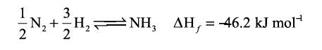

With oxygen, nitrogen produces nitrous oxide at high temperatures. Even at 3473 K nitrous oxide yield is only \( 4.4\% \).

$$
2\mathrm{N}_2 + \mathrm{O}_2 \longrightarrow 2\mathrm{N}_2\mathrm{O}
$$

##### Uses of nitrogen

1. Nitrogen is used for the manufacture of ammonia, nitric acid and calcium cyanamide etc.
2. Liquid nitrogen is used for producing low temperature required in cryosurgery, and so in biological preservation.

#### 3.1.4 Ammonia \( \mathrm{(NH_3)} \)

##### Preparation

Ammonia is formed by the hydrolysis of urea.

$$
\mathrm{NH_2CONH_2 + H_2O} \longrightarrow 2\mathrm{NH_3 + CO_2}
$$

Ammonia is prepared in the laboratory by heating an ammonium salt with a base.

$$
\mathrm{NH_4^+ + OH^-} \longrightarrow \mathrm{NH_3 + H_2O}
$$

$$
2\mathrm{NH_4Cl + CaO} \longrightarrow \mathrm{CaCl_2 + 2NH_3 + H_2O}
$$

It can also be prepared by heating a metal nitrides such as magnesium nitride with water.

$$
\mathrm{Mg_3N_2 + 6H_2O} \longrightarrow 3\mathrm{Mg(OH)_2 + 2NH_3}
$$

It is industrially manufactured by passing nitrogen and hydrogen over iron catalyst (a small amount of \( \mathrm{K_2O} \) and \( \mathrm{Al_2O_3} \) is also used to increase the rate of attainment of equilibrium) at 750 K at 200 atm pressure. In the actual process the hydrogen required is obtained from water gas and nitrogen from fractional distillation of liquid air.

##### Properties

Ammonia is a pungent smelling gas and is lighter than air. It can be readily liquefied at about 9 atmospheric pressure. The liquid boils at \( -38.4^{\circ}\mathrm{C} \) and freezes at \( -77^{\circ}\mathrm{C} \). Liquid ammonia resembles water in its physical properties i.e. it is highly associated through strong hydrogen bonding. Ammonia is extremely soluble in water (702 volume in 1 volume of water) at \( 20^{\circ}\mathrm{C} \) and 760 mm pressure.

At low temperatures two soluble hydrate \( \mathrm{NH_3.H_2O} \) and \( 2\mathrm{NH_3.H_2O} \) are isolated. In these molecules ammonia and water are linked by hydrogen bonds. In aqueous solutions also ammonia may be hydrated in a similar manner and we call the same as \( \mathrm{(NH_3.H_2O)} \).

$$
\mathrm{NH_3 + H_2O \rightleftharpoons NH_4^+ + OH^-}
$$

The dielectric constant of ammonia is considerably high to make it a fairly good ionising solvent like water.

$$
2\mathrm{NH_3 \rightleftharpoons NH_4^+ + NH_2^-}
$$

$$
\mathrm{K}_{-50^{\circ}\mathrm{C}} = [\mathrm{NH_4^+}][\mathrm{NH_2^-}] = 10^{-30}
$$

$$
2\mathrm{H_2O \rightleftharpoons H_3O^+ + OH^-}
$$

$$
\mathrm{K}_{25^{\circ}\mathrm{C}} = [\mathrm{H_3O^+}][\mathrm{OH^-}] = 10^{-14}
$$

##### Chemical Properties

**Action of heat:** Above \( 500^{\circ}\mathrm{C} \) ammonia decomposes into its elements. The decomposition may be accelerated by metallic catalysts like Nickel, Iron. Almost complete dissociation occurs on continuous sparking.

$$
2\mathrm{NH_3} \xrightarrow{>500^{\circ}\mathrm{C}} \mathrm{N_2 + 3H_2}
$$

**Reaction with air/oxygen:** Ammonia does not burn in air but burns freely in free oxygen with a yellowish flame to give nitrogen and steam.

$$
4\mathrm{NH_3 + 3O_2} \rightleftharpoons 2\mathrm{N_2 + 6H_2O}
$$

In presence of catalyst like platinum, it burns to produce nitric oxide. This process is used for the manufacture of nitric acid and is known as Ostwald's process.

$$
4\mathrm{NH_3 + 5O_2} \rightleftharpoons 4\mathrm{NO + 6H_2O}
$$

**Reducing property:** Ammonia acts as a reducing agent. It reduces the metal oxides to metal when passed over heated metallic oxide.

$$
3\mathrm{PbO + 2NH_3} \longrightarrow 3\mathrm{Pb + N_2 + 3H_2O}
$$

**Reaction with acids:** When treated with acids it forms ammonium salts. This reaction shows that the affinity of ammonia for proton is greater than that of water.

**Reaction with chlorine and chlorides:** Ammonia reacts with chlorine and chlorides to give ammonium chloride as a final product. The reactions are different under different conditions as given below.

With excess ammonia

$$
2\mathrm{NH_3 + 3Cl_2} \longrightarrow \mathrm{N_2 + 6HCl}
$$

$$
6\mathrm{HCl + 6NH_3} \longrightarrow 6\mathrm{NH_4Cl}
$$

With excess of chlorine ammonia reacts to give nitrogen trichloride, an explosive substance.

$$
2\mathrm{NH_3 + 6Cl_2} \longrightarrow 2\mathrm{NCl_3 + 6HCl}
$$

$$
2\mathrm{NH_3(g) + HCl(g)} \longrightarrow \mathrm{NH_4Cl(s)}
$$

**Formation of amides and nitrides:** With strong electro positive metals such as sodium, ammonia forms amides while it forms nitrides with metals like magnesium.

$$
2\mathrm{Na + 2NH_3} \longrightarrow 2\mathrm{NaNH_2 + H_2}
$$

$$
3\mathrm{Mg + 2NH_3} \longrightarrow \mathrm{Mg_3N_2 + 3H_2}
$$

**With metallic salts:** Ammonia reacts with metallic salts to give metal hydroxides (in case of Fe) or forming complexes (in case Cu)

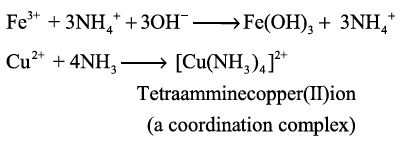

**Formation of amines:** Ammonia forms ammonated compounds by ion dipole attraction. Eg. \( [\mathrm{CaCl_2.8NH_3}] \). In this, the negative ends of ammonia dipole is attracted to \( \mathrm{Ca^{2+}} \) ion.

It can also act as a ligand and form coordination compounds such as \( [\mathrm{Co(NH_3)_6}]^{3+} \), \( [\mathrm{Ag(NH_3)_2}]^+ \).

For example when excess ammonia is added to aqueous solution copper sulphate a deep blue colour compound \( [\mathrm{Cu(NH_3)_4}]^{2+} \) is formed.

##### Structure of ammonia

Ammonia molecule is pyramidal in shape. N-H bond distance is 1.016 Å and H-H bond distance is 1.645 Å with a bond angle \( 107^{\circ} \). The structure of ammonia may be regarded as a tetrahedral with one lone pair of electrons in one tetrahedral position hence it has a pyramidal shape as shown in the figure.

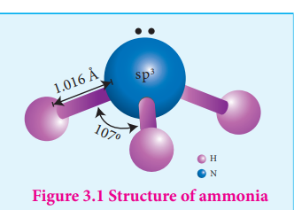

#### 3.1.5 Nitric acid

##### Preparation

Nitric acid is prepared by heating equal amounts of potassium or sodium nitrate with concentrated sulphuric acid.

$$
\mathrm{KNO_3 + H_2SO_4 \longrightarrow KHSO_4 + HNO_3}
$$

The temperature is kept as low as possible to avoid decomposition of nitric acid. The acid condenses to a fuming liquid which is coloured brown by the presence of a little nitrogen dioxide which is formed due to the decomposition of nitric acid.

$$
4\mathrm{HNO_3} \longrightarrow 4\mathrm{NO_2 + 2H_2O + O_2}
$$

##### Commercial method of preparation

Nitric acid prepared in large scales using Ostwald's process. In this method ammonia from Haber's process is mixed about 10 times of air. This mixture is preheated and passed into the catalyst chamber where they come in contact with platinum gauze. The temperature rises to about 1275 K and the metallic gauze brings about the rapid catalytic oxidation of ammonia resulting in the formation of NO, which then oxidised to nitrogen dioxide.

$$
4\mathrm{NH_3 + 5O_2} \longrightarrow 4\mathrm{NO + 6H_2O} + 120\ \mathrm{kJ}
$$

$$
2\mathrm{NO + O_2} \longrightarrow 2\mathrm{NO_2}
$$

The nitrogen dioxide produced is passed through a series of adsorption towers. It reacts with water to give nitric acid. Nitric oxide formed is bleached by blowing air.

$$
3\mathrm{NO_2 + H_2O} \longrightarrow 2\mathrm{HNO_3 + NO}
$$

##### Properties

Pure nitric acid is colourless. It boils at \( 86^{\circ}\mathrm{C} \). The acid is completely miscible with water forming a constant boiling mixture (\( 98\% \mathrm{HNO_3} \), boiling point \( 120.5^{\circ}\mathrm{C} \)). Fuming nitric acid contains oxides of nitrogen. It decomposes on exposure to sunlight or on being heated, into nitrogen dioxide, water and oxygen.

$$
4\mathrm{HNO_3} \longrightarrow 4\mathrm{NO_2 + 2H_2O + O_2}
$$

Due to this reaction pure acid or its concentrated solution becomes yellow on standing.

In most of the reactions, nitric acid acts as an oxidising agent. Hence the oxidation state changes from \( +5 \) to a lower one. It doesn't yield hydrogen in its reaction with metals. Nitric acid can act as an acid, an oxidizing agent and a nitrating agent.

**As an acid:** Like other acids it reacts with bases and basic oxides to form salts and water

$$
\mathrm{ZnO + 2HNO_3} \longrightarrow \mathrm{Zn(NO_3)_2 + H_2O}
$$

$$
3\mathrm{FeO + 10HNO_3} \longrightarrow 3\mathrm{Fe(NO_3)_3 + NO + 5H_2O}
$$

**As an oxidising agent:** The nonmetals like carbon, sulphur, phosphorus and iodine are oxidised by nitric acid.

$$
\mathrm{C + 4HNO_3} \longrightarrow 2\mathrm{H_2O + 4NO_2 + CO_2}
$$

$$
\mathrm{S + 2HNO_3} \longrightarrow \mathrm{H_2SO_4 + 2NO}
$$

$$
\mathrm{P_4 + 20HNO_3} \longrightarrow 4\mathrm{H_3PO_4 + 4H_2O + 20NO_2}
$$

$$
3\mathrm{I_2 + 10HNO_3} \longrightarrow 6\mathrm{HIO_3 + 10NO + 2H_2O}
$$

$$
\mathrm{HNO_3 + F_2} \longrightarrow \mathrm{HF + NO_3F}
$$

$$
3\mathrm{H_2S + 2HNO_3} \longrightarrow 3\mathrm{S + 2NO + 4H_2O}
$$

**As a nitrating agent:** In organic compounds replacement of a \( -\mathrm{H} \) atom with \( -\mathrm{NO}_2 \) is often referred as nitration. For example:

$$
\mathrm{C_6H_6 + HNO_3 \xrightarrow{H_2SO_4} C_6H_5NO_2 + H_2O}
$$

Nitration takes place due to the formation of nitronium ion

$$
\mathrm{HNO_3 + H_2SO_4} \longrightarrow \mathrm{NO_2^+ + H_2O + HSO_4^-}
$$

##### Action of nitric acid on metals

All metals with the exception of gold, platinum, rhodium, iridium and tantalum reacts with nitric acid. Nitric acid oxidises the metals. Some metals such as aluminium, iron, cobalt, nickel and chromium are rendered passive in concentrated acid due to the formation of a layer of their oxides on the metal surface, which prevents the nitric acid from reacting with pure metal.

With weak electropositive metals like tin, arsenic, antimony, tungsten and molybdenum, nitric acid gives metal oxides in which the metal is in the higher oxidation state and the acid is reduced to a lower oxidation state. The most common products evolved when nitric acid reacts with a metal are gases \( \mathrm{NO_2} \), NO and \( \mathrm{H_2O} \). Occasionally \( \mathrm{N_2} \), \( \mathrm{NH_2OH} \) and \( \mathrm{NH_3} \) are also formed.

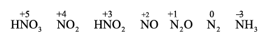

The reactions of metals with nitric acid are explained in 3 steps as follows:

**Primary reaction:** Metal nitrate is formed with the release of nascent hydrogen

$$
\mathrm{M + HNO_3} \longrightarrow \mathrm{MNO_3 + (H)}
$$

**Secondary reaction:** Nascent hydrogen produces the reduction products of nitric acid.

$$\text{HNO}_3 + 2[\text{H}] \longrightarrow \underset{\text{Nitrous acid}}{\text{HNO}_2} + \text{H}_2\text{O}$$

$$\text{HNO}_3 + 6[\text{H}] \longrightarrow \underset{\text{Hydroxylamine}}{\text{NH}_2\text{OH}} + 2\text{H}_2\text{O}$$

$$\text{HNO}_3 + 8[\text{H}] \longrightarrow \underset{\text{Ammonia}}{\text{NH}_3} + 3\text{H}_2\text{O}$$

$$2\text{HNO}_3 + 8[\text{H}] \longrightarrow \underset{\text{Hyponitrous acid}}{\text{H}_2\text{N}_2\text{O}_2} + 4\text{H}_2\text{O}$$

**Tertiary reaction:** The secondary products either decompose or react to give final products

Decomposition of the secondary:

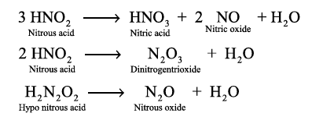

Reaction of secondary products:

$$
\mathrm{HNO_2 + NH_3} \longrightarrow \mathrm{N_2 + 2H_2O}
$$

$$
\mathrm{HNO_2 + NH_2OH} \longrightarrow \mathrm{N_2O + 2H_2O}
$$

$$
\mathrm{HNO_2 + HNO_3} \longrightarrow 2\mathrm{NO_2 + H_2O}
$$

##### Examples

Copper reacts with nitric acid in the following manner

$$
3\mathrm{Cu + 6HNO_3} \longrightarrow 3\mathrm{Cu(NO_3)_2 + 6(H)}
$$

$$
6\mathrm{(H) + 3HNO_3} \longrightarrow 3\mathrm{HNO_2 + 3H_2O}
$$

$$
3\mathrm{HNO_2} \longrightarrow \mathrm{HNO_3 + 2NO + H_2O}
$$

Overall reaction

$$
3\mathrm{Cu + 8HNO_3} \longrightarrow 3\mathrm{Cu(NO_3)_2 + 2NO + 4H_2O}
$$

The concentrated acid has a tendency to form nitrogen dioxide

$$
\mathrm{Cu + 4HNO_3} \longrightarrow \mathrm{Cu(NO_3)_2 + 2NO_2 + 2H_2O}
$$

Magnesium reacts with nitric acid in the following way

$$
4\mathrm{Mg + 8HNO_3} \longrightarrow 4\mathrm{Mg(NO_3)_2 + 8[H]}
$$

$$
\mathrm{HNO_3 + 8(H)} \longrightarrow \mathrm{NH_3 + 3H_2O}
$$

$$
\mathrm{HNO_3 + NH_3} \longrightarrow \mathrm{NH_4NO_3}
$$

Overall reaction

$$
4\mathrm{Mg + 10HNO_3} \longrightarrow 4\mathrm{Mg(NO_3)_2 + NH_4NO_3 + 3H_2O}
$$

If the acid is diluted we get \( \mathrm{N_2O} \)

$$
4\mathrm{Mg + 10HNO_3} \longrightarrow 4\mathrm{Mg(NO_3)_2 + N_2O + 5H_2O}
$$

##### Uses of nitric acid

1. Nitric acid is used as a oxidising agent and in the preparation of aquaregia.
2. Salts of nitric acid are used in photography (\( \mathrm{AgNO_3} \)) and gunpowder for firearms (\( \mathrm{NaNO_3} \)).

**Evaluate yourself:** Write the products formed in the reaction of nitric acid (both dilute and concentrated) with zinc.

#### 3.1.6 Oxides and oxoacids of nitrogen

**Table: Oxides of Nitrogen**

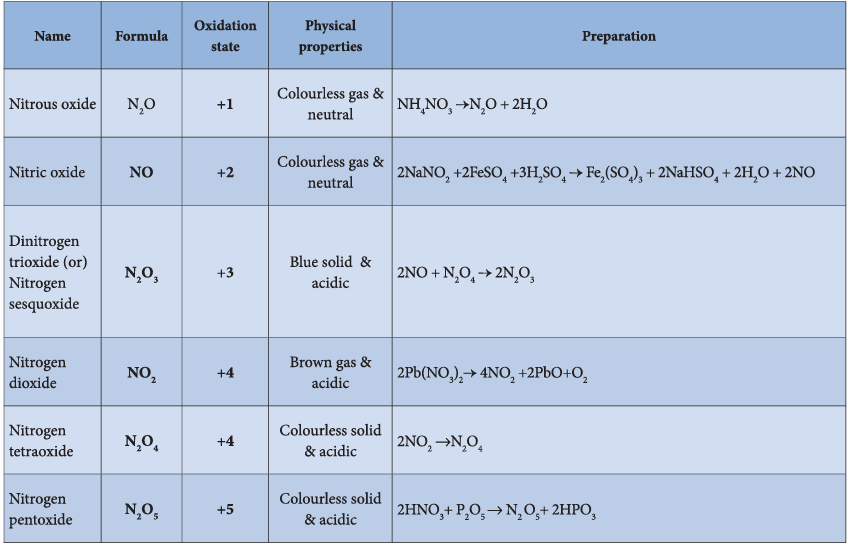

**Structures of oxides of nitrogen**

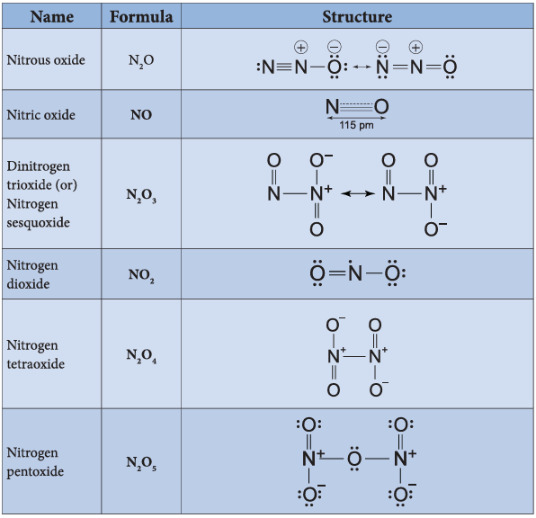

**Structures of oxoacids of nitrogen**

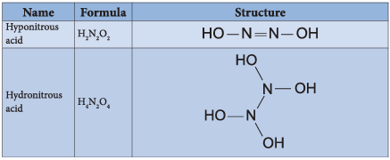
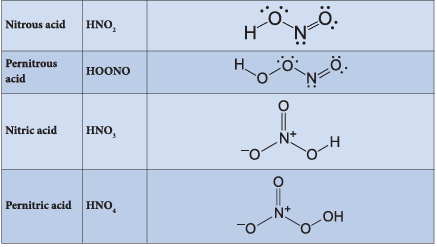

**Preparation of oxoacides of nitrogen**

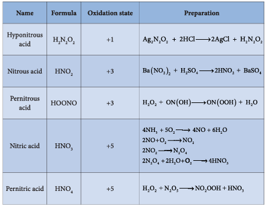

#### 3.1.7 Allotropic forms of phosphorus

Phosphorus has several allotropic modification of which the three forms namely white, red and black phosphorus are most common.

The freshly prepared white phosphorus is colourless but becomes pale yellow due to formation of a layer of red phosphorus upon standing. Hence it is also known as yellow phosphorus. It is poisonous in nature and has a characteristic garlic smell. It glows in the dark due to oxidation which is called phosphorescence. Its ignition temperature is very low and hence it undergoes spontaneous combustion in air at room temperature to give \( \mathrm{P_2O_5} \).

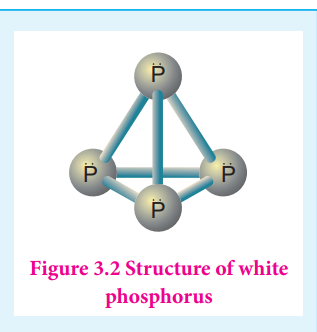

The white phosphorus can be changed into red phosphorus by heating it to \( 420^{\circ}\mathrm{C} \) in the absence of air and light. Unlike white phosphorus it is not poisonous and does not show phosphorescence. It also does not ignite at low temperatures. The red phosphorus can be converted back into white phosphorus by boiling it in an inert atmosphere and condensing the vapour under water.

The phosphorus has a layer structure and also acts as a semiconductor. The four atoms in white phosphorus have polymeric structure with chains of \( \mathrm{P_4} \) linked tetrahedrally. Unlike nitrogen, \( \mathrm{P≡P} \) is less stable than P-P single bonds. Hence, phosphorus atoms are linked through single bonds rather than triple bonds. In addition to the above two more allotropes namely scarlet and violet phosphorus are also known for phosphorus.

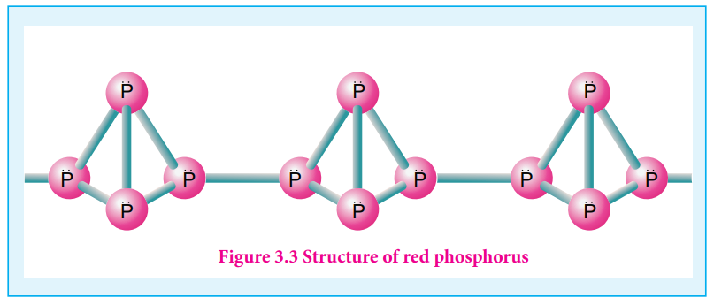

#### 3.1.8 Properties of phosphorus

Phosphorus is highly reactive and has the following important chemical properties.

**Reaction with oxygen:** Yellow phosphorus readily catches fire in air giving dense white fumes of phosphorus pentoxide. Red phosphorus also reacts with oxygen on heating to give phosphorus trioxide or phosphorus pentoxide.

$$P_4 + 3O_2 \xrightarrow{\Delta} \underset{\text{Phosphorous trioxide}}{P_4O_6}$$

$$P_4 + 5O_2 \xrightarrow{\Delta} \underset{\text{Phosphorous pentoxide}}{P_4O_{10}}$$

**Reaction with chlorine:** Phosphorus reacts with chlorine to form tri and penta chloride. Yellow phosphorus reacts violently at room temperature, while red phosphorus reacts on heating

$$P_4 + 6Cl_2 \longrightarrow \underset{\text{Phosphorous tri chloride}}{4PCl_3}$$

$$P_4 + 10Cl_2 \longrightarrow \underset{\text{Phosphorous penta chloride}}{4PCl_5}$$

**Reaction with alkali:** Yellow phosphorus reacts with alkali on boiling in an inert atmosphere liberating phosphine. Here phosphorus acts as reducing agent.

$$P_4 + 3NaOH + 3H_2O \longrightarrow \underset{\text{sodium hypo phosphite}}{3NaH_2PO_2} + \underset{\text{Phosphine}}{PH_3}\uparrow$$

**Reaction with nitric acid:** When phosphorus is treated with conc. nitric acid it is oxidised to phosphoric acid. This reaction is catalysed by iodine crystals.

$$P_4 + 20HNO_3 \longrightarrow \underset{\text{Ortho phosphoric acid}}{4H_3PO_4} + 20NO_2 + 4H_2O$$

**Reaction with metals:** Phosphorus reacts with metals like Ca and Mg to give phosphides. Metals like sodium and potassium react with phosphorus vigorously.

$$P_4 + 6Mg \longrightarrow \underset{\text{Magnesium phosphide}}{2Mg_3P_2}$$

$$P_4 + 6Ca \longrightarrow \underset{\text{Calcium phosphide}}{2Ca_3P_2}$$

$$P_4 + 12Na \longrightarrow \underset{\text{Sodium phosphide}}{4Na_3P}$$

**Uses of phosphorus:**

1. The red phosphorus is used in the match boxes
2. It is also used for the production of certain alloys such as phosphor bronze

#### 3.1.9 Phosphine \( \mathrm{(PH_3)} \)

Phosphine is the most important hydride of phosphorus 

**Preparation:**

Phosphine is prepared by action of sodium hydroxide with white phosphorus in an inert atmosphere of carbon dioxide or hydrogen.

$$P_4 + 3NaOH + 3H_2O \longrightarrow \underset{\text{sodium hypo phosphite}}{3NaH_2PO_2} + \underset{\text{Phosphine}}{PH_3}\uparrow$$

Phosphine is freed from phosphine dihydride (\( P_2H_4 \)) by passing through a freezing mixture. The dihydride condenses while phosphine does not.

Phosphine can also prepared by the hydrolysis of metallic phosphides with water or dilute mineral acids.

$$Ca_3P_2 + 6H_2O \longrightarrow \underset{\text{Phosphine}}{2PH_3}\uparrow + 3Ca(OH)_2$$

$$AlP + 3HCl \longrightarrow \underset{\text{Phosphine}}{PH_3}\uparrow + AlCl_3$$

Phosphine is prepared in pure form by heating phosphorous acid.

$$\underset{\text{Phosphorous acid}}{4H_3PO_3} \xrightarrow{\Delta} \underset{\text{Ortho phosphoric acid}}{3H_3PO_4} + \underset{\text{Phosphine}}{PH_3}\uparrow$$

A pure sample of phosphine is prepared by heating phosphonium iodide with caustic soda solution.

$$PH_4I + NaOH \xrightarrow{\Delta} \underset{\text{Phosphine}}{PH_3}\uparrow + NaI + H_2O$$

**Physical properties:**

It is colourless, poisonous gas with rotten fish smell. It is slightly soluble in water and is neutral to litmus test. It condenses to a colourless liquid at 188 K and freezes to a solid at 139.5 K.

**Chemical properties:**

**Thermal stability:** Phosphine decomposes into its elements when heated in absence of air at 317 K or when electric current is passed through it.

$$4PH_3 \xrightarrow{317K} P_4 + 6H_2$$

**Combustion:** When phosphine is heated with air or oxygen it burns to give meta phosphoric acid.

$$4PH_3 + 8O_2 \xrightarrow{\Delta} \underset{\text{Phosphorous pentoxide}}{P_4O_{10}} + 6H_2O$$

$$P_4O_{10} + 6H_2O \xrightarrow{\Delta} \underset{\text{Meta phosphoric acid}}{4HPO_3} + 4H_2O$$

**Basic nature:** Phosphine is weakly basic and forms phosphonium salts with halogen acids.

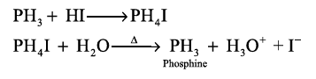

It reacts with halogens to give phosphorus penta halides.

$$PH_3 + 4Cl_2 \longrightarrow PCl_5 + 3HCl$$

**Reducing property :** Phosphine precipitates some metal as phosphide from their salt solutions.

$$3AgNO_3 + PH_3 \longrightarrow Ag_3P + 3HNO_3$$

It forms coordination compounds with lewis acids such as boron trichloride.

$$BCl_3 + PH_3 \longrightarrow \underset{\text{Coordination compound}}{[Cl_3B \leftarrow :PH_3]}$$

##### Structure

In phosphine, phosphorus shows \( \mathrm{sp^3} \) hybridisation. Three orbitals are occupied by bond pair and fourth corner is occupied by lone pair of electrons. Hence, bond angle is reduced to \( 93.5^{\circ} \). Phosphine has a pyramidal shape.

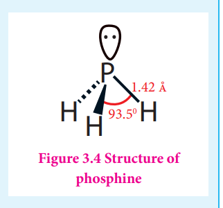

##### Uses of phosphine

Phosphine is used for producing smoke screen as it gives large smoke. In a ship, a pierced container with a mixture of calcium carbide and calcium phosphide, liberates phosphine and acetylene when thrown into sea. The liberated phosphine catches fire and ignites acetylene. These burning gases serves as a signal to the approaching ships. This is known as Holmes signal.

#### 3.1.10 Phosphorus trichloride and pentachloride

##### Phosphorus trichloride

**Preparation:** When a slow stream of chlorine is passed over white phosphorus, phosphorus trichloride is formed. It can also be obtained by treating white phosphorus with thionyl chloride.

$$
\mathrm{P_4 + 8SOCl_2} \longrightarrow 4\mathrm{PCl_3 + 4SO_2 + 2S_2Cl_2}
$$

**Properties:** When phosphorus trichloride is hydrolysed with cold water it gives phosphorous acid.

$$
\mathrm{PCl_3 + 3H_2O} \longrightarrow \mathrm{H_3PO_3 + 3HCl}
$$

This reaction involves the coordination of a water molecule using a vacant 3d orbital on the phosphorus atom following by elimination of HCl which is similar to hydrolysis of \( \mathrm{SiCl_4} \).

$$
\mathrm{PCl_3 + H_2O} \longrightarrow \mathrm{PCl._3H_2O} \longrightarrow \mathrm{P(OH)Cl_2 + HCl}
$$

This reaction is followed by two more steps to give \( \mathrm{P(OH)_3} \) or \( \mathrm{H_3PO_3} \).

$$
\mathrm{HPOCl_2 + H_2O} \longrightarrow \mathrm{H_2PO_2Cl + HCl}
$$

$$
\mathrm{H_2PO_2Cl + H_2O} \longrightarrow \mathrm{H_3PO_3 + HCl}
$$

Similar reactions occurs with other molecules that contains alcohols and carboxylic acids.

$$
3\mathrm{C_2H_5OH + PCl_3} \longrightarrow 3\mathrm{C_2H_5Cl + H_3PO_3}
$$

$$
3\mathrm{C_2H_5COOH + PCl_3} \longrightarrow 3\mathrm{C_2H_5COCl + H_3PO_3}
$$

**Uses of phosphorus trichloride:** Phosphorus trichloride is used as a chlorinating agent and for the preparation of \( \mathrm{H_3PO_3} \).

##### Phosphorus pentachloride

**Preparation:** When \( \mathrm{PCl_3} \) is treated with excess chlorine, phosphorus pentachloride is obtained.

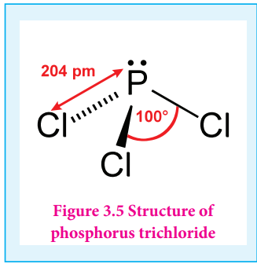

$$
\mathrm{PCl_3 + Cl_2} \longrightarrow \mathrm{PCl_5}
$$

**Chemical properties:** On heating phosphorus pentachloride, it decomposes into phosphorus trichloride and chlorine.

$$
\mathrm{PCl_5(g)} \longrightarrow \mathrm{PCl_3(g) + Cl_2(g)}
$$

Phosphorus pentachloride reacts with water to give phosphoryl chloride and orthophosphoric acid.

$$
\mathrm{PCl_5 + H_2O} \longrightarrow \mathrm{POCl_3 + 2HCl}
$$

$$
\mathrm{POCl_3 + 3H_2O} \longrightarrow \mathrm{H_3PO_4 + 3HCl}
$$

Overall reaction

$$
\mathrm{PCl_5 + 4H_2O} \longrightarrow \mathrm{H_3PO_4 + 5HCl}
$$

Phosphorus pentachloride reacts with metal to give metal chlorides. It also chlorinates organic compounds similar to phosphorus trichloride.

$$
2\mathrm{Ag + PCl_5} \longrightarrow 2\mathrm{AgCl + PCl_3}
$$

$$
\mathrm{Sn + 2PCl_5} \longrightarrow \mathrm{SnCl_4 + 2PCl_3}
$$

$$
\mathrm{C_2H_5OH + PCl_5} \longrightarrow \mathrm{C_2H_5Cl + HCl + POCl_3}
$$

$$
\mathrm{C_2H_5COOH + PCl_5} \longrightarrow \mathrm{C_2H_5COCl + HCl + POCl_3}
$$

**Uses of phosphorus pentachloride:** Phosphorus pentachloride is a chlorinating agent and is useful for replacing hydroxyl groups by chlorine atom.

#### 3.1.11 Structure of oxides and oxoacids of phosphorus

Phosphorus forms phosphorus trioxide, phosphorus tetraoxide and phosphorus pentoxide.

In phosphorus trioxide four phosphorus atoms lie at the corners of a tetrahedron and six oxygen atoms along the edges. The P-O bond distance is 165.6 pm.

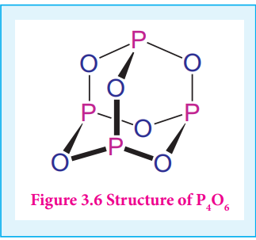

pm which is shorter than the single bond distance of P-O (184 pm) due to pπ-dπ bonding and results in considerable double bond character. In P4O10 each P atoms form three bonds to oxygen atom and also an additional coordinate bond with an oxygen atom. Terminal P-O bond length is 143 pm, which is less than the expected single bond distance. This may be due to lateral overlap of filled p orbitals of an oxygen atom with empty d orbital on phosphorous.

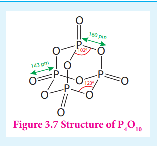

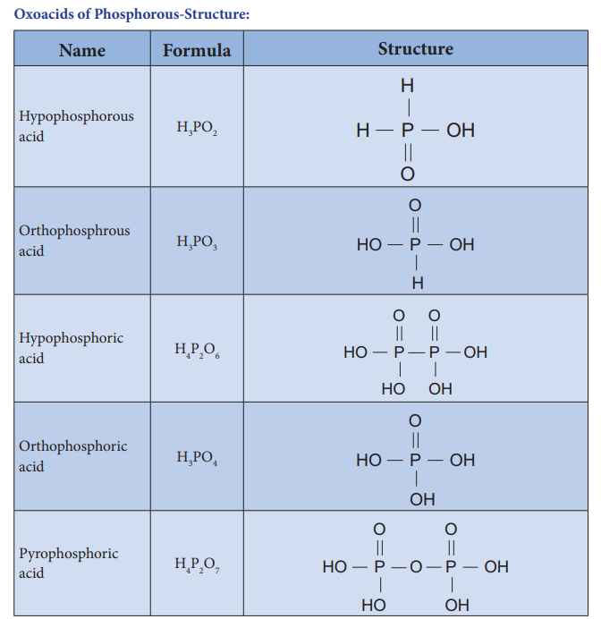

**Oxoacids of Phosphorus - Preparation**

| Name | Formula | Oxidation state | Preparation |
|---|---|---|---|
| Hypophosphorous acid | \( \mathrm{H_3PO_2} \) | +1 | \( \mathrm{P_4 + 6H_2O \rightarrow 3H_3PO_2 + PH_3} \) |
| Orthophosphorous acid | \( \mathrm{H_3PO_3} \) | +3 | \( \mathrm{P_4O_6 + 6H_2O \rightarrow 4H_3PO_3} \) |
| Hypophosphoric acid | \( \mathrm{H_4P_2O_6} \) | +4 | \( 2\mathrm{P + 2O_2 + 2H_2O \rightarrow H_4P_2O_6} \) |
| Orthophosphoric acid | \( \mathrm{H_3PO_4} \) | +5 | \( \mathrm{P_4O_{10} + 6H_2O \rightarrow 4H_3PO_4} \) |
| Pyrophosphoric acid | \( \mathrm{H_4P_2O_7} \) | +5 | \( 2\mathrm{H_3PO_4 \rightarrow H_4P_2O_7 + H_2O} \) |

## Group 16 (Oxygen group) elements

#### Occurrence

Elements belonging group 16 are called chalcogens or ore forming elements as most of the ores are oxides or sulphides. First element oxygen, the most abundant element, exists in both as dioxygen in air (above \( 20\% \) by weight as well as volume) and in combined form as oxides. Oxygen and sulphur makes up about \( 46.6\% \) and \( 0.034\% \) of earth crust by weight respectively. Sulphur exists as sulphates (gypsum, epsom salt etc.) and sulphides (galena, zinc blende etc.). It is also present in the volcanic ashes. The other elements of this group are scarce and are often found as selenides, tellurides etc. along with sulphide ores.

#### Physical properties

The common physical properties of the group 16 elements are listed in the Table.

**Table 3.2 Physical properties of group 16 elements**

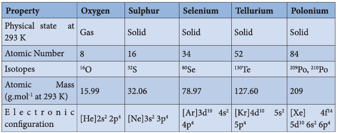
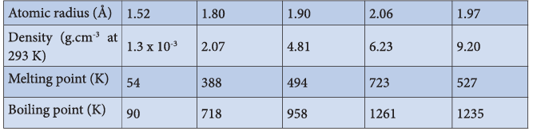
