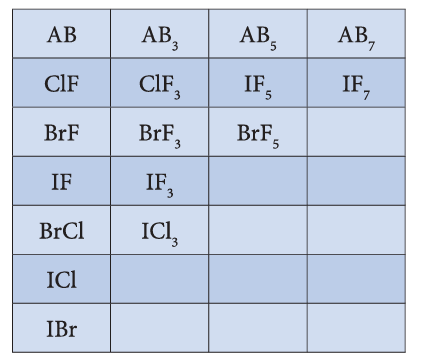
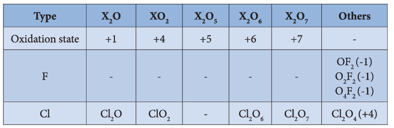
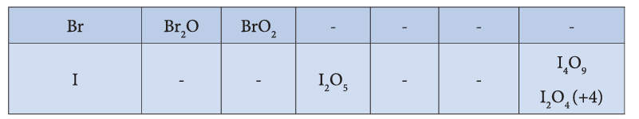
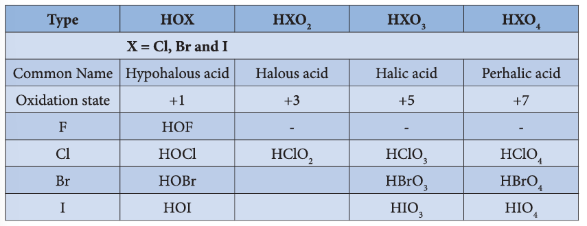

### 3.3 Group 17 (Halogen group) elements

#### 3.3.1 Chlorine

##### Occurrence

The halogens are present in combined form as they are highly reactive. The main source of fluorine is fluorspar or fluorite. The other ores of fluorine are cryolite, fluorapatite. The main source of chlorine is sodium chloride from sea water. Bromides and iodides also occur in sea water.

##### Physical properties

The common physical properties of the group 17 elements are listed in the table.

**Table 3.3 Physical properties of group 17 elements**

| Property | Fluorine | Chlorine | Bromine | Iodine | Astatine |
|---|---|---|---|---|---|
| Physical state at 293 K | Gas | Gas | Liquid | Solid | Solid |
| Atomic Number | 9 | 17 | 35 | 53 | 85 |
| Isotopes | \( ^{19}\mathrm{F} \) | \( ^{35}\mathrm{Cl}, ^{37}\mathrm{Cl} \) | \( ^{79}\mathrm{Br} \) | \( ^{127}\mathrm{I} \) | \( ^{210}\mathrm{At}, ^{211}\mathrm{At} \) |
| Atomic Mass (g mol\(^{-1}\) at 293 K) | 18.99 | 35.45 | 79.91 | 126.9 | 210 |
| Electronic configuration | \( [\mathrm{He}]2s^2 2p^5 \) | \( [\mathrm{Ne}]3s^2 3p^5 \) | \( [\mathrm{Ar}]3d^{10} 4s^2 4p^5 \) | \( [\mathrm{Kr}]4d^{10} 5s^2 5p^5 \) | \( [\mathrm{Xe}]4f^{14}5d^{10}6s^2 6p^5 \) |
| Atomic radius (Å) | 1.47 | 1.75 | 1.85 | 1.98 | 2.02 |
| Density (g cm\(^{-3}\) at 293 K) | \( 1.55 \times 10^{-3} \) | \( 2.89 \times 10^{-3} \) | 3.10 | 4.93 | — |
| Melting point (K) | 53 | 171 | 266 | 387 | 573 |
| Boiling point (K) | 85 | 239 | 332 | 457 | 623 |

##### Properties

Chlorine is highly reactive hence it doesn't occur free in nature. It is usually distributed as various metal chlorides. The most important chloride is sodium chloride which occurs in sea water.

##### Preparation

Chlorine is prepared by the action of conc. sulphuric acid on chlorides in presence of manganese dioxide.

$$
4\mathrm{NaCl + MnO_2 + 4H_2SO_4} \longrightarrow \mathrm{Cl_2 + MnCl_2 + 4NaHSO_4 + 2H_2O}
$$

It can also be prepared by oxidising hydrochloric acid using various oxidising agents such as manganese dioxide, lead dioxide, potassium permanganate or dichromate.

$$
\mathrm{PbO_2 + 4HCl} \longrightarrow \mathrm{PbCl_2 + 2H_2O + Cl_2}
$$

$$
\mathrm{MnO_2 + 4HCl} \longrightarrow \mathrm{MnCl_2 + 2H_2O + Cl_2}
$$

$$
2\mathrm{KMnO_4 + 16HCl} \longrightarrow 2\mathrm{KCl + 2MnCl_2 + 8H_2O + 5Cl_2}
$$

$$
\mathrm{K_2Cr_2O_7 + 14HCl} \longrightarrow 2\mathrm{KCl + 2CrCl_3 + 7H_2O + 3Cl_2}
$$

When bleaching powder is treated with mineral acids chlorine is liberated

$$
\mathrm{CaOCl_2 + 2HCl} \longrightarrow \mathrm{CaCl_2 + H_2O + Cl_2}
$$

$$
\mathrm{CaOCl_2 + H_2SO_4} \longrightarrow \mathrm{CaSO_4 + H_2O + Cl_2}
$$

##### Manufacture of chlorine

Chlorine is manufactured by the electrolysis of brine in electrolytic process or by oxidation of HCl by air in Deacon's process.

**Electrolytic process:** When a solution of brine (NaCl) is electrolysed, \( \mathrm{Na^+} \) and \( \mathrm{Cl^-} \) ions are formed. \( \mathrm{Na^+} \) ion reacts with \( \mathrm{OH^-} \) ions of water and forms sodium hydroxide. Hydrogen and chlorine are liberated as gases.

$$
\mathrm{NaCl \longrightarrow Na^+ + Cl^-}
$$

$$
\mathrm{H_2O \longrightarrow H^+ + OH^-}
$$
$$\text{Na}^+ + \text{OH}^- \longrightarrow \text{NaOH}$$
At the cathode:

$$
\mathrm{H^+ + e^-} \longrightarrow \mathrm{H}
$$

$$
\mathrm{H + H} \longrightarrow \mathrm{H_2}
$$

At the anode:

$$
\mathrm{Cl^-} \longrightarrow \mathrm{Cl + e^-}
$$

$$
\mathrm{Cl + Cl} \longrightarrow \mathrm{Cl_2}
$$

**Deacon's process:** In this process a mixture of air and hydrochloric acid is passed up a chamber containing a number of shelves, pumice stones soaked in cuprous chloride are placed. Hot gases at about 723 K are passed through a jacket that surrounds the chamber.

$$
4\mathrm{HCl + O_2 \xrightarrow[400^{\circ}\mathrm{C}]{Cu_2Cl_2} 2H_2O + 2Cl_2}
$$

The chlorine obtained by this method is dilute and is employed for the manufacture of bleaching powder. The catalysed reaction is given below:

$$2\text{Cu}_2\text{Cl}_2 + \text{O}_2 \longrightarrow \underset{\text{Cuprous oxy chloride}}{2\text{Cu}_2\text{OCl}_2}$$

$$\text{Cu}_2\text{OCl}_2 + 2\text{HCl} \longrightarrow \underset{\text{Cupric chloride}}{2\text{CuCl}_2} + \text{H}_2\text{O}$$

$$2\text{CuCl}_2 \longrightarrow \underset{\text{Cuprous chloride}}{\text{Cu}_2\text{Cl}_2} + \text{Cl}_2$$

##### Physical properties

Chlorine is a greenish yellow gas with a pungent irritating odour. It produces headache when inhaled even in small quantities whereas inhalation of large quantities could be fatal. It is 2.5 times heavier than air.

Chlorine is soluble in water and its solution is referred as chlorine water. It deposits greenish yellow crystals of chlorine hydrate (\( \mathrm{Cl_2.8H_2O} \)). It can be converted into liquid (boiling point \( -34.6^{\circ}\mathrm{C} \)) and yellow crystalline solid (melting point \( -102^{\circ}\mathrm{C} \)).

##### Chemical properties

**Action with metals and non-metals:** It reacts with metals and non metals to give the corresponding chlorides.

$$
2\mathrm{Na + Cl_2} \longrightarrow 2\mathrm{NaCl}
$$

$$
2\mathrm{Fe + 3Cl_2} \longrightarrow 2\mathrm{FeCl_3}
$$

$$
2\mathrm{Al + 3Cl_2} \longrightarrow 2\mathrm{AlCl_3}
$$

$$
\mathrm{Cu + Cl_2} \longrightarrow \mathrm{CuCl_2}
$$

$$
\mathrm{H_2 + Cl_2} \longrightarrow 2\mathrm{HCl} \quad \Delta H = -44\ \mathrm{kCal}
$$

$$
2\mathrm{B + 3Cl_2} \longrightarrow 2\mathrm{BCl_3}
$$

$$
2\mathrm{S + Cl_2} \longrightarrow \mathrm{S_2Cl_2} \text{ (disulphur dichloride)}
$$

$$
\mathrm{P_4 + 6Cl_2} \longrightarrow 4\mathrm{PCl_3}
$$

$$
2\mathrm{As + 3Cl_2} \longrightarrow 2\mathrm{AsCl_3}
$$

$$
2\mathrm{Sb + 3Cl_2} \longrightarrow 2\mathrm{SbCl_3}
$$

**Affinity for hydrogen:** When burnt with turpentine it forms carbon and hydrochloric acid.

$$
\mathrm{C_{10}H_{16} + 8Cl_2} \longrightarrow 10\mathrm{C + 16HCl}
$$

It forms dioxygen when reacting with water in presence of sunlight. When chlorine in water is exposed to sunlight it loses its colour and smell as the chlorine is converted into hydrochloric acid.

$$
2\mathrm{Cl_2 + 2H_2O} \longrightarrow \mathrm{O_2 + 4HCl}
$$

Chlorine reacts with ammonia to give ammonium chloride and other products as shown below:

With excess ammonia,

$$
2\mathrm{NH_3 + 3Cl_2} \longrightarrow \mathrm{N_2 + 6HCl}
$$

$$
6\mathrm{HCl + 6NH_3} \longrightarrow 6\mathrm{NH_4Cl}
$$

$$
8\mathrm{NH_3 + 3Cl_2} \longrightarrow \mathrm{N_2 + 6NH_4Cl}
$$

With excess chlorine,

$$
\mathrm{NH_3 + 3Cl_2} \longrightarrow \mathrm{NCl_3 + 3HCl}
$$

$$
3\mathrm{HCl + 3NH_3} \longrightarrow 3\mathrm{NH_4Cl}
$$

Overall reaction

$$
4\mathrm{NH_3 + 3Cl_2} \longrightarrow \mathrm{NCl_3 + 3NH_4Cl}
$$

Chlorine oxidises hydrogen sulphide to sulphur and liberates bromine and iodine from iodides and bromides. However, it doesn't oxidise fluorides.

$$
\mathrm{H_2S + Cl_2} \longrightarrow 2\mathrm{HCl + S}
$$

$$
\mathrm{Cl_2 + 2KBr} \longrightarrow 2\mathrm{KCl + Br_2}
$$

$$
\mathrm{Cl_2 + 2KI} \longrightarrow 2\mathrm{KCl + I_2}
$$

**Reaction with alkali:** Chlorine reacts with cold dilute alkali to give chloride and hypochlorite while with hot concentrated alkali chlorides and chlorates are formed.

$$
\mathrm{Cl_2 + H_2O} \longrightarrow \mathrm{HCl + HOCl}
$$

$$
\mathrm{HCl + NaOH} \longrightarrow \mathrm{NaCl + H_2O}
$$

$$
\mathrm{HOCl + NaOH} \longrightarrow \mathrm{NaOCl + H_2O}
$$

Overall reaction

$$
\mathrm{Cl_2 + 2NaOH} \longrightarrow \underset{\text{Sodium hypo chlorite}}{NaOCl + NaCl + H_2O}
$$

$$
(Cl_2 + H_2O \rightarrow HCl + HOCl) \times 3
$$

$$
(HCl + NaOH \rightarrow NaCl + H_2O) \times 3
$$

$$
(HOCl + NaOH \rightarrow NaOCl + H_2O) \times 3
$$

$$
3NaOCl \rightarrow NaClO_3 + 2NaCl
$$

overall reaction

$$
3Cl_2 + 6NaOH \rightarrow \underset{\text{Sodium chlorate}}{NaClO_3} + 5NaCl + 3H_2O
$$

**Oxidising and bleaching action:** Chlorine is a strong oxidising and bleaching agent because of the nascent oxygen.

$$
\mathrm{H_2O + Cl_2} \longrightarrow \mathrm{HCl} +\underset{\text{Hypo chlorous acid}} {HOCl}
$$

$$
\mathrm{HOCl} \longrightarrow \mathrm{HCl + (O)}
$$

Colouring matter + Nascent oxygen \( \rightarrow \) Colourless oxidation product

The bleaching of chlorine is permanent. It oxidises ferrous salts to ferric, sulphites to sulphates and hydrogen sulphide to sulphur.

$$
2\mathrm{FeCl_2 + Cl_2} \longrightarrow 2\mathrm{FeCl_3}
$$

$$
\mathrm{Cl_2 + H_2O} \longrightarrow \mathrm{HCl + HOCl}
$$

$$
2\mathrm{FeSO_4 + H_2SO_4 + HOCl} \longrightarrow \mathrm{Fe_2(SO_4)_3 + HCl + H_2O}
$$

Overall reaction

$$
2\mathrm{FeSO_4 + H_2SO_4 + Cl_2} \longrightarrow \mathrm{Fe_2(SO_4)_3 + 2HCl}
$$

$$
\mathrm{Cl_2 + H_2O} \longrightarrow \mathrm{HCl + HOCl}
$$

$$
\mathrm{Na_2SO_3 + HOCl} \longrightarrow \mathrm{Na_2SO_4 + HCl}
$$

Overall reaction

$$
\mathrm{Na_2SO_3 + H_2O + Cl_2} \longrightarrow \mathrm{Na_2SO_4 + 2HCl}
$$

$$
\mathrm{Cl_2 + H_2S} \longrightarrow 2\mathrm{HCl + S}
$$

**Preparation of bleaching powder:** Bleaching powder is produced by passing chlorine gas through dry slaked lime (calcium hydroxide).

$$
\mathrm{Ca(OH)_2 + Cl_2} \longrightarrow \mathrm{CaOCl_2 + H_2O}
$$

**Displacement redox reactions:** Chlorine displaces bromine from bromides and iodine from iodide salts.

$$
\mathrm{Cl_2 + 2KBr} \longrightarrow 2\mathrm{KCl + Br_2}
$$

$$
\mathrm{Cl_2 + 2KI} \longrightarrow 2\mathrm{KCl + I_2}
$$

**Formation of addition compounds:** Chlorine forms addition products with sulphur dioxide, carbon monoxide and ethylene. It forms substituted products with alkanes/arenes.
$$\text{SO}_2 + \text{Cl}_2 \longrightarrow \underset{\text{Sulphuryl chloride}}{\text{SO}_2\text{Cl}_2}$$

$$\text{CO} + \text{Cl}_2 \longrightarrow \underset{\text{Carbonyl chloride}}{\text{COCl}_2}$$

$$\text{C}_2\text{H}_4 + \text{Cl}_2 \longrightarrow \underset{\text{ethylene dichloride}}{\text{C}_2\text{H}_4\text{Cl}_2}$$

$$\text{CH}_4 + \text{Cl}_2 \longrightarrow \text{CH}_3\text{Cl} + \text{HCl}$$

$$\text{C}_6\text{H}_6 + \text{Cl}_2 \xrightarrow{\text{FeCl}_3} \text{C}_6\text{H}_5\text{Cl} + \text{HCl}$$
##### Uses of chlorine

1. Purification of drinking water
2. Bleaching of cotton textiles, paper and rayon
3. Extraction of gold and platinum

#### 3.3.2 Hydrochloric acid

##### Laboratory preparation

It is prepared by the action of sodium chloride and concentrated sulphuric acid.

$$
\mathrm{NaCl + H_2SO_4} \longrightarrow \mathrm{NaHSO_4 + HCl}
$$

$$
\mathrm{NaHSO_4 + NaCl} \longrightarrow \mathrm{Na_2SO_4 + HCl}
$$

Dry hydrochloric acid is obtained by passing the gas through conc. sulphuric acid.

##### Properties

Hydrogen chloride is a colourless, pungent smelling gas, easily liquefied to a colourless liquid (boiling point 189 K) and frozen into a white crystalline solid (melting point 159 K). It is extremely soluble in water.

$$
\mathrm{HCl(g) + H_2O(l)} \longrightarrow \mathrm{H_3O^+ + Cl^-}
$$

##### Chemical properties

Like all acids it liberates hydrogen gas from metals and carbon dioxide from carbonate and bicarbonate salts.

$$
\mathrm{Zn + 2HCl} \longrightarrow \mathrm{ZnCl_2 + H_2}
$$

$$
\mathrm{Mg + 2HCl} \longrightarrow \mathrm{MgCl_2 + H_2}
$$

$$
\mathrm{Na_2CO_3 + 2HCl} \longrightarrow 2\mathrm{NaCl + CO_2 + H_2O}
$$

$$
\mathrm{CaCO_3 + 2HCl} \longrightarrow \mathrm{CaCl_2 + CO_2 + H_2O}
$$

$$
\mathrm{NaHCO_3 + 2HCl} \longrightarrow 2\mathrm{NaCl + CO_2 + H_2O}
$$

It liberates sulphur dioxide from sodium sulphite

$$
\mathrm{Na_2SO_3 + 2HCl} \longrightarrow 2\mathrm{NaCl + H_2O + SO_2}
$$

When three parts of concentrated hydrochloric acid and one part of concentrated nitric acid are mixed, Aqua regia (Royal water) is obtained. This is used for dissolving gold, platinum etc.

$$
\text{Au} + 4\text{H}^+ + \text{NO}_3^- + 4\text{Cl}^- \rightarrow \text{AuCl}_4^- + \text{NO} + 2\text{H}_2\text{O}
$$

$$
3\text{Pt} + 16\text{H}^+ + 4\text{NO}_3^- + 18\text{Cl}^- \rightarrow 3[\text{PtCl}_6]^{2-} + 4\text{NO} + 8\text{H}_2\text{O}
$$

##### Uses of hydrochloric acid

1. Hydrochloric acid is used for the manufacture of chlorine, ammonium chloride, glucose from corn starch etc.
2. It is used in the extraction of glue from bone and also for purification of bone black.

#### 3.3.3 Trends in physical and chemical properties of hydrogen halides

##### Preparation

Direct combination is a useful means of preparing hydrogen chloride. The reaction between hydrogen and fluorine is violent while the reaction between hydrogen and bromine or hydrogen and iodine are reversible and don't produce pure forms.

##### Displacement reactions

Concentrated sulphuric acid displaces hydrogen chloride from ionic chlorides. At higher temperatures the hydrogen sulphate formed reacts with further ionic chloride. Displacement can be used for the preparation of hydrogen fluorides from ionic fluorides. Hydrogen bromide and hydrogen iodide are oxidised by concentrated sulphuric acid and can't be prepared in this method.

##### Hydrolysis of phosphorus trihalides

Gaseous hydrogen halides are produced when water is added in drops to phosphorus trihalides except phosphorus trifluoride.

$$
\mathrm{PX_3 + 3H_2O} \longrightarrow \mathrm{H_3PO_3 + 3HX}
$$

Hydrogen bromide may be obtained by adding bromine dropwise to a paste of red phosphorus and water while hydrogen iodide is conveniently produced by adding water dropwise to a mixture of red phosphorus and iodine.

$$
2\mathrm{P + 3X_2} \longrightarrow 2\mathrm{PX_3}
$$

$$
2\mathrm{PX_3 + 3H_2O} \longrightarrow \mathrm{H_3PO_3 + 3HX} \ (\text{where } X = \mathrm{Br\ or\ I})
$$

Any halogen vapours which escape with the hydrogen halide is removed by passing the gases through a column of moist red phosphorus.

##### From covalent hydrides

Halogens are reduced to hydrogen halides by hydrogen sulphide.

$$
\mathrm{H_2S + X_2} \longrightarrow 2\mathrm{HX + S}
$$

Hydrogen chloride is obtained as a by-product of the reactions between hydrocarbons and halogens.

**Table 3.4: General Properties**

| | HF | HCl | HBr | HI |
|---|---|---|---|---|
| Bond dissociation enthalpy (kJ mol\(^{-1}\)) | +562 | +431 | +366 | +299 |
| % of ionic character | 43 | 17 | 13 | 7 |

In line with the decreasing bond dissociation enthalpy, the thermal stability of hydrogen halides decreases from fluoride to iodide.

For example, Hydrogen iodide decomposes at \( 400^{\circ}\mathrm{C} \) while hydrogen fluoride and hydrogen chloride are stable at this temperature.

At room temperature, hydrogen halides are gases but hydrogen fluoride can be readily liquefied. The gases are colourless but with moist air gives white fumes due to the production of droplets of hydrochloric acid. In HF, due to the presence of strong hydrogen bond it has high melting and boiling points. This effect is absent in other hydrogen halides.

##### Acidic properties

The hydrogen halides are extremely soluble in water due to the ionisation.

$$
\mathrm{HX + H_2O} \longrightarrow \mathrm{H_3O^+ + X^-} \ (\text{X - F, Cl, Br, or I})
$$

Solutions of hydrogen halides are therefore acidic and known as hydrohalic acids. Hydrochloric, hydrobromic and hydroiodic acids are almost completely ionised and are therefore strong acids but HF is a weak acid i.e. \( 0.1\ \mathrm{mM} \) solution is only \( 10\% \) ionised, but in 5M and 15M solution HF is stronger acid due to the equilibrium.

$$
\text{HF} + \text{H}_2\text{O} \rightleftharpoons \text{H}_3\text{O}^+ + \text{F}^-
$$

$$
\text{HF} + \text{F}^- \rightleftharpoons \text{HF}_2^-
$$

At high concentration, the equilibrium involves the removal of fluoride ions which affects the dissociation of hydrogen fluoride and increases hydrogen ion concentration. Several stable salts \( \mathrm{NaHF_2} \), \( \mathrm{KHF_2} \) and \( \mathrm{NH_4HF_2} \) are known. The other hydrogen halides do not form hydrogen dihalides.

Hydrohalic acid shows typical acidic properties. They form salts with bases, and reacts with metals to give hydrogen. Moist hydrofluoric acid (not dry) rapidly reacts with silica and glass.

$$
\mathrm{SiO_2 + 4HF} \longrightarrow \mathrm{SiF_4 + 2H_2O}
$$

$$
\mathrm{Na_2SiO_3 + 6HF} \longrightarrow \mathrm{Na_2SiF_6 + 3H_2O}
$$

**Oxidation:** Hydrogen iodide is readily oxidised to iodine hence it is a reducing agent.

$$
2\mathrm{HI} \rightleftharpoons 2\mathrm{H^+ + I_2 + 2e^-}
$$

Acidic solution of iodides is readily oxidised. A positive result is shown by liberation of iodine which gives a blue-black colouration with starch.

Hydrogen bromide is more difficult to oxidise than HI. HBr reduces \( \mathrm{H_2SO_4} \) to \( \mathrm{SO_2} \)

$$
2\mathrm{HBr + H_2SO_4} \longrightarrow 2\mathrm{H_2O + Br_2 + SO_2}
$$

But hydrogen iodide and ionic iodides are rapidly reduced by \( \mathrm{H_2SO_4} \) to \( \mathrm{H_2S} \) and not to \( \mathrm{SO_2} \)

$$
8\mathrm{HI + H_2SO_4} \longrightarrow 4\mathrm{H_2O + 4I_2 + H_2S}
$$

Reducing property of hydrogen iodide can be also explained by using its reaction with alcohols to give alkanes. It converts nitric acid into nitrous acid and dinitrogen dioxide into ammonium.

Hydrogen chloride is unaffected by concentrated sulphuric acid but affected by only strong oxidising agents like \( \mathrm{MnO_2} \), potassium permanganate or potassium dichromate.

To summarize the trend,

**Table 3.5**

| Property | Order |
|---|---|
| Reactivity of hydrogen | Decreases from fluorine to iodine |
| Stability | Decreases from HF to HI |
| Volatility of the hydrides | HF < HI < HBr < HCl |
| Thermal stability | HF > HCl > HBr > HI |
| Boiling point | HCl < HBr < HI < HF |
| Acid strength | Increases from HF to HI |

#### 3.3.4 Inter halogen compounds

Each halogen combines with other halogens to form a series of compounds called inter halogen compounds. In the given table of inter halogen compounds a given compound A is less electronegative than B.

##### Properties of inter halogen compounds

i. The central atom will be the larger one.

ii. It can be formed only between two halogens and not more than two halogens.

iii. Fluorine can't act as a central atom being the smallest one.

iv. Due to high electronegativity with small size, fluorine helps the central atom to attain high coordination number.

v. They can undergo autoionization.

$$
2\mathrm{ICl} \rightleftharpoons \mathrm{I^+ + ICl_2^-}
$$

$$
2\mathrm{ICl_3} \rightleftharpoons \mathrm{ICl_2^+ + ICl_4^-}
$$

vi. They are strong oxidizing agents.

##### Reaction with alkali

When heated with alkalis, the larger halogen forms oxyhalogens and the smaller forms halide.

$$\text{BrF}_5 \xrightarrow{^-\text{OH}} 5\text{F}^- + \underset{\text{Bromate ion}}{\text{BrO}_3^-}$$

$$\text{ICl} \xrightarrow{^-\text{OH}} \text{Cl}^- + \underset{\text{Hypo iodite ion}}{\text{OI}^-}$$

##### Structure of inter halogen compounds

The structures of different types of interhalogen compounds can be easily explained using VSEPR theory. The details are given below.

**Table 3.7**

| Type | Structure | Hybridisation | Bond pairs / Lone pairs |
|---|---|---|---|
| AX | Linear | sp\(^3\) | 1 / 3 |
| AX\(_3\) | T-shaped | sp\(^3\)d | 3 / 2 |
| AX\(_5\) | Square pyramidal | sp\(^3\)d\(^2\) | 5 / 1 |
| AX\(_7\) | Pentagonal bipyramidal | sp\(^3\)d\(^3\) | 7 / 0 |

#### 3.3.5 Oxides of halogen

Fluorine reacts readily with oxygen and forms difluorine oxide \( \mathrm{(F_2O)} \) and difluorine dioxide \( \mathrm{(F_2O_2)} \) where it has a -1 oxidation state. Other halogens do not react with oxygen readily. But the following oxides can be prepared by some indirect methods. Except fluorine all the other halogens have positive oxidation states.

#### 3.3.6 Oxoacids of halogens

Chlorine forms four types of oxoacids namely hypochlorous acid, chlorous acid, chloric acid and perchloric acid. Bromine and iodine form similar acids except halous acid. However, fluorine only forms hypofluorous acid. The oxidizing power of oxoacids follows the order:

$$
\mathrm{HOX > HXO_2 > HXO_3 > HXO_4}
$$

