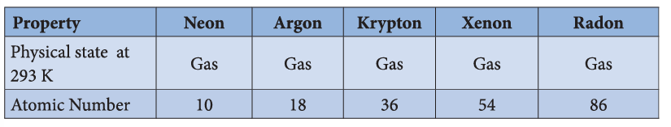
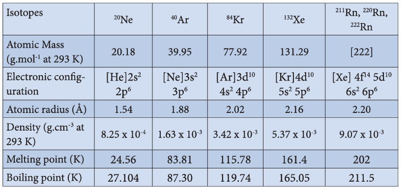

### 3.4 Group 18 (Inert gases) elements

#### 3.4.1 Occurrence

All the noble gases occur in the atmosphere.

#### Physical properties

As we move along the noble gas elements, their atomic radius and boiling point increases from helium to radon. The first ionization energy decreases from helium to radon. Noble gases have the largest ionisation energy compared to any other elements in a given row as they have completely filled orbitals in their outermost shell. They are extremely stable and have a small tendency to gain or lose electrons. The common physical properties of the group 18 elements are listed in the Table.

##### Properties of inert gases

**Physical properties:** Noble gases are monoatomic, odourless, colourless, tasteless, and non-inflammable. They are highly unreactive. They are non-metallic in nature.

##### Chemical Properties

Only xenon and krypton show some chemical reactivity. Xenon fluorides are prepared by direct reaction of xenon and fluorine under different conditions as shown below.
$$\text{Xe} + \text{F}_2 \xrightarrow[400^\circ\text{C}]{\text{Ni}} \text{XeF}_2$$

$$\text{Xe} + 2\text{F}_2 \xrightarrow[400^\circ\text{C}]{\text{Ni / acetone}} \text{XeF}_4$$

$$\text{Xe} + 3\text{F}_2 \xrightarrow[400^\circ\text{C}]{\text{Ni / 200 atm}} \text{XeF}_6$$
When \( \mathrm{XeF_6} \) is heated at \( 50^{\circ}\mathrm{C} \) in a sealed quartz vessel it forms \( \mathrm{XeOF_4} \)

$$
2\mathrm{XeF_6 + SiO_2 \xrightarrow{50^{\circ}C} 2XeOF_4 + SiF_4}
$$

When the reaction is continued the following reaction takes place.

$$
2\mathrm{XeOF_4 + SiO_2} \longrightarrow 2\mathrm{XeO_2F_2 + SiF_4}
$$

$$
2\mathrm{XeO_2F_2 + SiO_2} \longrightarrow 2\mathrm{XeO_3 + SiF_4}
$$

On hydrolysis with water vapour \( \mathrm{XeF_6} \) gives \( \mathrm{XeO_3} \)

$$
\mathrm{XeF_6 + 3H_2O} \longrightarrow \mathrm{XeO_3 + 6HF}
$$

When \( \mathrm{XeF_6} \) reacts with \( 2.5\ \mathrm{M\ NaOH} \), sodium perxenate is obtained.

$$
2\mathrm{XeF_6 + 16NaOH} \longrightarrow \mathrm{Na_4XeO_6 + Xe + O_2 + 12NaF + 8H_2O}
$$

Sodium perxenate is very much known for its strong oxidizing property. For example, it oxidises manganese(II) ion into permanganate ion even in the absence of catalyst.

$$
5\mathrm{XeO_6^{4-} + 2Mn^{2+} + 14H^+} \longrightarrow 2\mathrm{MnO_4^- + 5XeO_3 + 7H_2O}
$$

Xenon reacts with \( \mathrm{PtF_6} \) and gives an orange yellow solid \( \mathrm{[XePtF_6]} \) and this is insoluble in \( \mathrm{CCl_4} \).

Xenon difluoride forms addition compounds \( \mathrm{XeF_2.2SbF_5} \) and \( \mathrm{XeF_2.2TaF_5} \). Xenon hexafluoride forms compounds with boron and alkali metals. Eg: \( \mathrm{XeF_6.BF_3} \), \( \mathrm{XeF_6.MF} \), M - alkali metals.

There is some evidence for existence of xenon dichloride \( \mathrm{XeCl_2} \).

Krypton forms krypton difluoride when an electric discharge is passed through Kr and fluorine at \( 183^{\circ}\mathrm{C} \) or when gases are irradiated with \( \mathrm{SbF_5} \) it forms \( \mathrm{KrF_2.2SbF_5} \).

**Table 3.11 Structures of compounds of Xenon**

| Compound | Hybridisation | Shape / Structure |
|---|---|---|
| XeF\(_2\) | sp\(^3\)d | Linear |
| XeF\(_4\) | sp\(^3\)d\(^2\) | Square planar |
| XeF\(_6\) | sp\(^3\)d\(^3\) | Distorted octahedron |
| XeOF\(_2\) | sp\(^3\)d | T-shaped |
| XeOF\(_4\) | sp\(^3\)d\(^2\) | Square pyramidal |
| XeO\(_3\) | sp\(^3\) | Pyramidal |

##### Uses of noble gases

The inertness of noble gases is an important feature of their practical uses.

**Helium:**
1. Helium and oxygen mixture is used by divers in place of air oxygen mixture. This prevents the painful dangerous condition called bends.
2. Helium is used to provide inert atmosphere in electric arc welding of metals.
3. Helium has lowest boiling point hence used in cryogenics (low temperature science).
4. It is much less denser than air and hence used for filling air balloons.

**Neon:** Neon is used in advertisement as neon sign and the brilliant red glow is caused by passing electric current through neon gas under low pressure.

**Argon:** Argon prevents the oxidation of hot filament and prolongs the life in filament bulbs.

**Krypton:** Krypton is used in fluorescent bulbs, flash bulbs etc. Lamps filled with krypton are used in airports as approaching lights as they can penetrate through dense fog.

**Xenon:** Xenon is used in fluorescent bulbs, flash bulbs and lasers. Xenon emits an intense light in discharge tubes instantly. Due to this it is used in high speed electronic flash bulbs used by photographers.

**Radon:** Radon is radioactive and used as a source of gamma rays. Radon gas is sealed as small capsules and implanted in the body to destroy malignant i.e. cancer growth.

## Summary

- Occurrence: About \( 78\% \) of earth atmosphere contains dinitrogen \( \mathrm{(N_2)} \) gas. It is also present in earth crust as sodium nitrate (Chile saltpetre) and potassium nitrates (Indian saltpetre).

- Nitrogen, the principal gas of atmosphere (\( 78\% \) by volume) is separated industrially from liquid air by fractional distillation.

- Ammonia is formed by the hydrolysis of urea.

- Nitric acid is prepared by heating equal amounts of potassium or sodium nitrate with concentrated sulphuric acid.

- In most of the reactions, nitric acid acts as an oxidising agent. Hence the oxidation state changes from \( +5 \) to a lower one. It doesn't yield hydrogen in its reaction with metals.

- The reactions of metals with nitric acid are explained in 3 steps as follows:
  - Primary reaction: Metal nitrate is formed with the release of nascent hydrogen
  - Secondary reaction: Nascent hydrogen produces the reduction products of nitric acid.
  - Tertiary reaction: The secondary products either decompose or react to give final products

- Phosphorus has several allotropic modifications of which the three forms namely white, red and black phosphorus are most common.

- Yellow phosphorus is poisonous in nature and has a characteristic garlic smell. It glows in the dark due to oxidation which is called phosphorescence.

- Yellow phosphorus readily catches fire in air giving dense white fumes of phosphorus pentoxide.

- Phosphine is prepared by action of sodium hydroxide with white phosphorus in an inert atmosphere of carbon dioxide or hydrogen.

- Phosphine is used for producing smoke screen as it gives large smoke.

- When a slow stream of chlorine is passed over white phosphorus, phosphorus trichloride is formed.

- Phosphorus trichloride and phosphorus pentachloride are used as chlorinating agents.

- Oxygen is paramagnetic. It exists in two allotropic forms namely dioxygen \( \mathrm{(O_2)} \) and ozone or trioxygen \( \mathrm{(O_3)} \).

- Ozone is commonly used for oxidation of organic compounds.

- Sulphur exists in crystalline as well as amorphous allotropic forms. The crystalline form includes rhombic sulphur (\( \alpha \) sulphur) and monoclinic sulphur (\( \beta \) sulphur). Amorphous allotropic form includes plastic sulphur (\( \gamma \) sulphur), milk of sulphur and colloidal sulphur.

- Sulphuric acid can be manufactured by lead chamber process, cascade process or contact process.

- When dissolved in water, it forms mono \( \mathrm{(H_2SO_4.H_2O)} \) and dihydrates \( \mathrm{(H_2SO_4.2H_2O)} \) and the reaction is exothermic.

- Halogens are present in combined form as they are highly reactive.

- Chlorine is manufactured by the electrolysis of brine in electrolytic process or by oxidation of HCl by air in Deacon's process.

- Chlorine is a strong oxidising and bleaching agent because of the nascent oxygen.

- When three parts of concentrated hydrochloric acid and one part of concentrated nitric acid are mixed, Aqua regia (Royal water) is obtained. This is used for dissolving gold, platinum etc.

- Hydrogen halides are extremely soluble in water due to the ionisation.

- Each halogen combines with other halogens to form a series of compounds called inter halogen compounds.

- Fluorine reacts readily with oxygen and forms difluorine oxide \( \mathrm{(F_2O)} \) and difluorine dioxide \( \mathrm{(F_2O_2)} \) where it has a -1 oxidation state.

- All the noble gases occur in the atmosphere.

- They are extremely stable and have a small tendency to gain or lose electrons.

- Sodium perxenate is very much known for its strong oxidizing property.

- The inertness of noble gases is an important feature of their practical uses.

