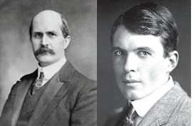
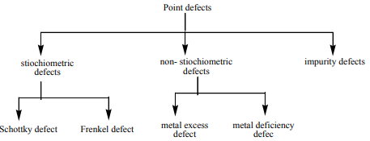
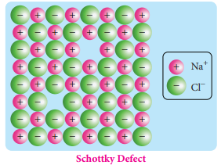
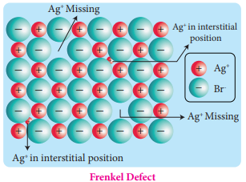
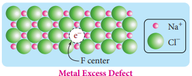
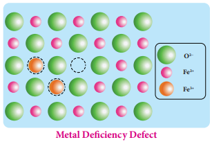

# 6. SOLID STATE

**Sir William Henry Bragg (1862-1942) & Sir Lawrence Bragg (1890-1971)**

Sir William Henry Bragg was a British physicist, chemist, and a mathematician. Sir William Henry Bragg and his son Lawrence Bragg worked on X-rays with much success. They invented the X-ray spectrometer and founded the new science of X-ray crystallography, the analysis of crystal structure using X-ray diffraction. Bragg was joint winner (with his son, Lawrence Bragg) of the Nobel Prize in Physics in 1915, for their services in the "analysis of crystal structure by means of ray". The mineral Braggite (a sulphide ore of platinum, palladium and Nickel) is named after him and his son.

## INTRODUCTION

Matter may exist in three different physical states namely solid, liquid and gas. If you look around, you may find mostly solids rather than liquids and gases. Solids differ from liquids and gases by possessing definite volume and definite shape. In the solids the atoms or molecules or ion are tightly held in an ordered arrangement and there are many types of solids such as diamond, metals, plastics etc., and most of the substances that we use in our daily life are in the solid state. We require solids with different properties for various applications. Understanding the relation between the structure of solids and their properties is very much useful in synthesizing new solid materials with different properties.

In this chapter, we study the characteristics of solids, classification, structure and their properties; we also discuss the crystal defects and their significance.

### 6.7 Imperfection in solids:

According to the law of nature nothing is perfect, and so crystals need not be perfect. They always found to have some defects in the arrangement of their constituent particles. These defects affect the physical and chemical properties of the solid and also play an important role in various processes. For example, a process called doping leads to a crystal imperfection and it increases the electrical conductivity of a semiconductor material such
as silicon. The ability of ferromagnetic material such as iron, nickel etc., to be magnetized
and demagnetized depends on the presence of imperfections. Crystal defects are classified
as follows 

1) Point defects
2) Line defects
3) Interstitial defects
4) Volume defects

In this portion, we concentrate on point defects, more specifically in ionic solids. Point defects are further classified as follows.

### Stoichiometric defects in ionic solid:

This defect is also called intrinsic (or) thermodynamic defect. In stoichiometric ionic crystals, a vacancy of one ion must always be associated with either by the absence of another oppositely charged ion (or) the presence of same charged ion in the interstitial position so as to maintain the electrical neutrality.

#### 6.7.1 Schottky defect:

Schottky defect arises due to the missing of equal number of cations and anions from the crystal lattice. This effect does not change the stoichiometry of the crystal. Ionic solids in which the cation and anion are of almost of similar size show Schottky defect. Example: NaCl.

Presence of large number of Schottky defects in a crystal, lowers its density. For example, the theoretical density of vanadium monoxide (VO) calculated
using the edge length of the unit cell is 6.5 g cm-3, but the actual experimental density
is 5.6 g cm-3. It indicates that there is approximately 14% Schottky defect in VO crystal.
Presence of Schottky defect in the crystal provides a simple way by which atoms or ions
can move within the crystal lattice.

#### 6.7.2 Frenkel defect:

Frenkel defect arises due to the dislocation of ions from its crystal lattice. The ion which is missing from the lattice point occupies an interstitial position. This defect is shown by ionic solids in which cation and anion differ in size. Unlike Schottky defect, this defect does not affect the density of the crystal. For example \(AgBr\), in this case, small \(Ag^{+}\) ion leaves its normal site and occupies an interstitial position as shown in the figure.

#### 6.7.3 Metal excess defect:

Metal excess defect arises due to the presence of more number of metal ions as compared to anions. Alkali metal halides NaCl, KCl show this type of defect. The electrical neutrality of the crystal can be maintained by the presence of anionic vacancies equal to the excess metal ions (or) by the presence of extra cation and electron present in interstitial position.

For example, when NaCl crystals are heated in the presence of sodium vapour, \(Na^{+}\) ions are formed and are deposited on the surface of the crystal. Chloride ions (Cl) diffuse to the surface from the lattice point and combines with \(Na^{+}\) ion. The electron lost by the sodium vapour diffuse into the crystal lattice and occupies the vacancy created by the Cl ions. Such anionic vacancies which are occupied by unpaired electrons are called F centers. Hence, the formula of NaCl which contains excess \(Na^{+}\) ions can be written as \(Na_{1+x}Cl\).

\(ZnO\) is colourless at room temperature. When it is heated, it becomes yellow in colour. On heating, it loses oxygen and thereby forming free \(Zn^{2+}\) ions. The excess \(Zn^{2+}\) ions move to interstitial sites and the electrons also occupy the interstitial positions.

#### 6.7.4 Metal deficiency defect:

Metal deficiency defect arises due to the presence of less number of cations than the anions. This defect is observed in a crystal in which, the cations have variable oxidation states.

For example, in FeO crystal, some of the \(Fe^{2+}\) ions are missing from the crystal lattice. To maintain the electrical neutrality, twice the number of other \(Fe^{2+}\) ions in the crystal is oxidized to \(Fe^{3+}\) ions. In such cases, overall number of \(Fe^{2+}\) and \(Fe^{3+}\) ions is less than the \(O^{2-}\) ions. It was experimentally found that the general formula of ferrous oxide is \(Fe_xO_y\) where \(x\) ranges from 0.93 to 0.98.

#### 6.7.5 Impurity defect:

A general method of introducing defects in ionic solids is by adding impurity ions. If the impurity ions are in different valance state from that of host, vacancies are created in the crystal lattice of the host. For example, addition of \(CdCl_2\) to \(AgCl\) yields solid solutions where the divalent cation \(Cd^{2+}\) occupies the position of \(Ag^{+}\). This will disturb the electrical neutrality of the crystal. In order to maintain the same, proportional number of \(Ag^{+}\) ions leaves the lattice. This produces a cation vacancy in the lattice, such kind of crystal defects are called impurity defects.

**Do You Know**
#### Energy harvesting by piezoelectric crystals:

Piezoelectricity (also called the piezoelectric effect) is the appearance of an electrical potential across the sides of a crystal when you subject it to mechanical stress. The word piezoelectricity means electricity resulting from pressure and latent heat. Even the inverse is possible which is known as inverse piezoelectric effect.

If you can make a little amount of electricity by pressing one piezoelectric crystal once, could you make a significant amount by pressing many crystals over and over again? What happens if we bury piezoelectric crystals under streets to capture energy as vehicles pass by?

This idea, known as energy harvesting, has caught many people's interest. Even though there are limitations for the large-scale applications, you can produce electricity that is enough to charge your mobile phones by just walking. There are power generating footwears that has a slip-on insole with piezoelectric crystals that can produce enough electricity to charge batteries/ USB devices.

## Summary

Solids have definite volume and shape.

Solids can be classified into the following two major types based on the arrangement of their constituents. (i) Crystalline solids (ii) Amorphous solids.

A crystalline solid is one in which its constituents (atoms, ions or molecules), have an orderly arrangement extending over a long range.

In contrast, in amorphous solids (In Greek, amorphous means no form) the constituents are randomly arranged.

Crystalline solid is characterised by a definite orientation of atoms, ions or molecules, relative to one another in a three dimensional pattern. The regular arrangement of these species throughout the crystal is called a crystal lattice.

A crystal may be considered to consist of large number of unit cells, each one in direct contact with its nearer neighbour and all similarly oriented in space.

A unit cell is characterised by the three edge lengths or lattice constants a, b and c and the angle between the edges \(\alpha\), \(\beta\) and \(\gamma\).

There are seven primitive crystal systems; cubic, tetragonal, orthorhombic, hexagonal, monoclinic, triclinic and rhombohedral. They differ in the arrangement of their crystallographic axes and angles. Corresponding to the above seven, Bravais defined 14 possible crystal systems.

In the simple cubic unit cell, each corner is occupied by an identical atoms or ions or molecules. And they touch along the edges of the cube, do not touch diagonally. The coordination number of each atom is 6.

In a body centered cubic unit cell, each corner is occupied by an identical particle and in addition to that one atom occupies the body centre. Those atoms which occupy the corners do not touch each other, however they all touch the one that occupies the body centre. Hence, each atom is surrounded by eight nearest neighbours and coordination number is 8.

In a face centered cubic unit cell, identical atoms lie at each corner as well as in the centre of each face. Those atoms in the corners touch those in the faces but not each other. The coordination number is 12.

X-Ray diffraction analysis is the most powerful tool for the determination of crystal structure. The inter planar distance (d) between two successive planes of atoms can be calculated using the following equation form the X-Ray diffraction data \(2d\sin \theta = n\lambda\).

 The structure of an ionic compound depends upon the stoichiometry and the size of the ions. generally in ionic crystals the bigger anions are present in the close packed arrangements and the cations occupy the voids. The ratio of radius of cation and anion \(\left(\frac{r_{C^+}}{r_{A^-}}\right)\) plays an important role in determining the structure. 
 

 Crystals always found to have some defects in the arrangement of their constituent particles. 
 
 Schottky defect arises due to the missing of equal number of cations and anions from the crystal lattice. 
 
 Frenkel defect arises due to the dislocation of ions from its crystal lattice. The ion which is missing from the lattice point occupies an interstitial position. 
 
 Metal excess defect arises due to the presence of more number of metal ions as compared to anions. 
 
 Metal deficiency defect arises due to the presence of less number of cations than the anions.
