# 6. SOLID STATE

**Sir William Henry Bragg (1862-1942) & Sir Lawrence Bragg (1890-1971)**

Sir William Henry Bragg was a British physicist, chemist, and a mathematician. Sir William Henry Bragg and his son Lawrence Bragg worked on X-rays with much success. They invented the X-ray spectrometer and founded the new science of X-ray crystallography, the analysis of crystal structure using X-ray diffraction. Bragg was joint winner (with his son, Lawrence Bragg) of the Nobel Prize in Physics in 1915, for their services in the "analysis of crystal structure by means of ray". The mineral Braggite (a sulphide ore of platinum, palladium and Nickel) is named after him and his son.

## INTRODUCTION

Matter may exist in three different physical states namely solid, liquid and gas. If you look around, you may find mostly solids rather than liquids and gases. Solids differ from liquids and gases by possessing definite volume and definite shape. In the solids the atoms or molecules or ion are tightly held in an ordered arrangement and there are many types of solids such as diamond, metals, plastics etc., and most of the substances that we use in our daily life are in the solid state. We require solids with different properties for various applications. Understanding the relation between the structure of solids and their properties is very much useful in synthesizing new solid materials with different properties.

In this chapter, we study the characteristics of solids, classification, structure and their properties; we also discuss the crystal defects and their significance.

### 6.1 General characteristics of solids

We have already learnt in XI STD that gas molecules move randomly without exerting reasonable forces on one another. Unlike gases, in solids the atoms, ions or molecules are held together by strong force of attraction. The general characteristics of solids are as follows,

(i) Solids have definite volume and shape.

(ii) Solids are rigid and incompressible.

(iii) Solids have strong cohesive forces.

(iv) Solids have short inter atomic, ionic or molecular distances.

(v) Their constituents (atoms, ions or molecules) have fixed positions and can only oscillate about their mean positions.

### 6.2 Classification of solids:

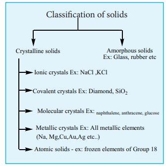

We can classify solids into the following two major types based on the arrangement of their constituents.

(i) Crystalline solids
(ii) Amorphous solids.

The term crystal comes from the Greek word "krystallos" which means clear ice. This term was first applied to the transparent quartz stones, and then the name is used for solids bounded by many flat, symmetrically arranged faces.

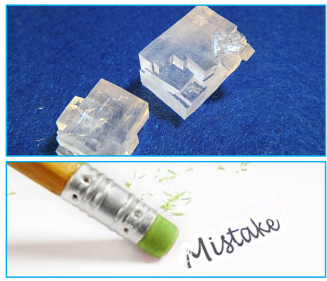

A crystalline solid is one in which its constituents (atoms, ions or molecules), have an orderly arrangement extending over a long range. The arrangement of such constituents in a crystalline solid is such that the potential energy of the system is at minimum. In contrast, in amorphous solids (In Greek, amorphous means no form) the constituents are randomly arranged.

The following table shows the differences between crystalline and amorphous solids.

| S.No | Crystalline solids | Amorphous solids |
|---|---|---|
| 1 | Long range orderly arrangement of constituents. | Short range, random arrangement of constituents. |
| 2 | Definite shape | Irregular shape |
| 3 | Generally crystalline solids are anisotropic in nature | They are isotropic* like liquids |
| 4 | They are true solids | They are considered as pseudo solids (or) super cooled liquids |
| 5 | Definite heat of fusion | Heat of fusion is not definite |
| 6 | They have sharp melting points. | Gradually soften over a range of temperature and so can be moulded. |
| 7 | Examples: NaCl, diamond etc., | Examples: Rubber, plastics, glass etc. |

**Table 6.1 differences between crystalline and amorphous solids**

# Isotropy 

Isotropy means uniformity in all directions. In solid state isotropy means having identical values of physical properties such as refractive index, electrical conductance etc., in all directions, whereas anisotropy is the property which depends on the direction of measurement. Crystalline solids are anisotropic and they show different values of physical properties when measured along different directions. The following figure illustrates the anisotropy in crystals due to different arrangement of their constituents along different directions.

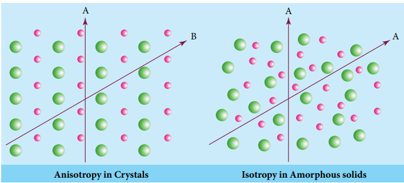

### 6.3 Classification of crystalline solids:

#### 6.3.1 Ionic solids:

The structural units of an ionic crystal are cations and anions. They are bound together by strong electrostatic attractive forces. To maximize the attractive force, cations are surrounded by as many anions as possible and vice versa. Ionic crystals possess definite crystal structure; many solids are cubic close packed. Example: The arrangement of \(Na^{+}\) and \(Cl^{-}\) ions in \(NaCl\) crystal.

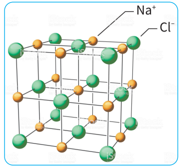

**Characteristics:**

1. Ionic solids have high melting points.
2. These solids do not conduct electricity, because the ions are fixed in their lattice positions.
3. They do conduct electricity in molten state (or) when dissolved in water because, the ions are free to move in the molten state or solution.
4. They are hard as only strong external force can change the relative positions of ions.

#### 6.3.2 Covalent solids:

In covalent solids, the constituents (atoms) are bound together in a three dimensional network entirely by covalent bonds. Examples: Diamond, silicon carbide etc. Such covalent network crystals are very hard, and have high melting point. They are usually poor thermal and electrical conductors.

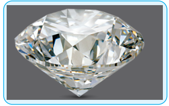

#### 6.3.3 Molecular solids:

In molecular solids, the constituents are neutral molecules. They are held together by weak van der Waals forces. Generally molecular solids are soft and they do not conduct electricity. These molecular solids are further classified into three types.

**Do You Know**

Graphite is used
inside pencils. It slips
easily off the pencil
onto the paper and
leaves a blackmark. Graphite is also
a component of many lubricants , for
example bicycle chain oil , because it
is slippery

#### (i) Non-polar molecular solids:

In non polar molecular solids constituent molecules are held together by weak dispersion forces or London forces. They have low melting points and are usually in liquids or gaseous state at room temperature. Examples: naphthalene, anthracene etc.,

#### (ii) Polar molecular solids

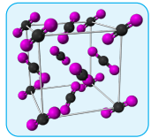

The constituents are molecules formed by polar covalent bonds. They are held together by relatively strong dipole-dipole interactions. They have higher melting points than the non-polar molecular solids. Examples are solid \(CO_2\), solid \(NH_3\) etc.

#### (iii) Hydrogen bonded molecular solids

The constituents are held together by hydrogen bonds. They are generally soft solids under room temperature. Examples: solid ice \(H_2O\), glucose, urea etc.,

#### 6.3.4 Metallic solids:

You have already studied in XI STD about the nature of metallic bonding. In metallic solids, the lattice points are occupied by positive metal ions and a cloud of electrons pervades the space. They are hard, and have high melting point. Metallic solids possess excellent electrical and thermal conductivity. They possess bright lustre. Examples: Metals and metal alloys belong to this type of solids, for example \(Cu, Fe, Zn\), Ag, Au, CuZn etc.

### 6.4 Crystal lattice and unit cell:

Crystalline solid is characterised by a definite orientation of atoms, ions or molecules, relative to one another in a three dimensional pattern. The regular arrangement of these species throughout the crystal is called a crystal lattice. A basic repeating structural unit of a crystalline solid is called a unit cell. The following figure illustrates the lattice point and the unit cell.

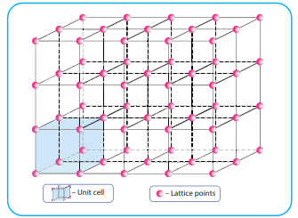

A crystal may be considered to consist of large number of unit cells, each one in direct contact with its nearer neighbour and all similarly oriented in space. The number of nearest neighbours that surrounding a particle in a crystal is called the coordination number of that particle.

A unit cell is characterised by the three edge lengths or lattice constants a, b and c and the angle between the edges \(\alpha\), \(\beta\) and \(\gamma\).

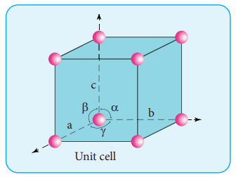

### 6.5 Primitive and non-primitive unit cell

There are two types of unit cells: primitive and non-primitive. A unit cell that contains only one type of lattice point is called a primitive unit cell, which is made up from the lattice points at each of the corners.

In case of non-primitive unit cells, there are additional lattice points, either on a face of the unit cell or with in the unit cell.

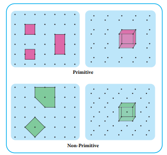

There are seven primitive crystal systems; cubic, tetragonal, orthorhombic, hexagonal, monoclinic, triclinic and rhombohedral. They differ in the arrangement of their crystallographic axes and angles. Corresponding to the above seven, Bravais defined 14 possible crystal systems as shown in the figure.

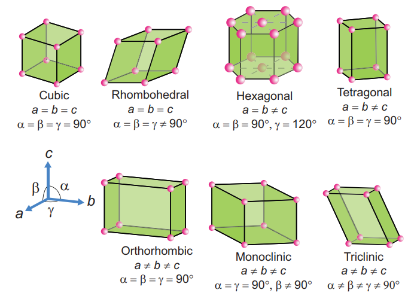

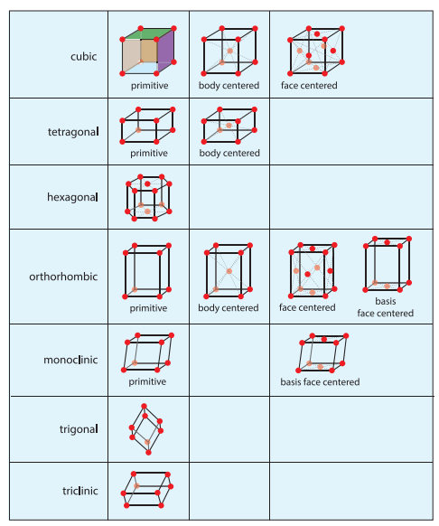

**Table 6.2 14 Bravais Lattices**

#### 6.5.1 Simple cubic unit cell (SC)

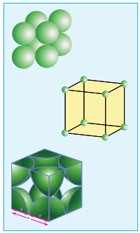

In the simple cubic unit cell, each corner is occupied by an identical atoms or ions or molecules. And they touch along the edges of the cube, do not touch diagonally. The coordination number of each atom is 6.

Each atom in the corner of the cubic unit cell is shared by 8 neighboring unit cells and therefore atoms per unit cell is equal to \(\frac{N_c}{8}\), where \(N_c\) is the number of atoms at the corners.

$$
\therefore \text{Number of atoms in a SC unit cell} = \left(\frac{N_c}{8}\right) = \left(\frac{8}{8}\right) = 1
$$

#### 6.5.2 Body centered cubic unit cell (BCC)

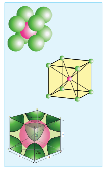

In a body centered cubic unit cell, each corner is occupied by an identical particle and in addition to that one atom occupies the body centre. Those atoms which occupy the corners do not touch each other, however they all touch the one that occupies the body centre. Hence, each atom is surrounded by eight nearest neighbours and coordination number is 8. An atom present at the body centre belongs to only to a particular unit cell i.e. unshared by other unit cell.

$$
\therefore \text{Number of atoms in a bcc unit cell} = \left(\frac{N_c}{8}\right) + \left(\frac{N_b}{1}\right)
$$

$$
= \left(\frac{8}{8} + \frac{1}{1}\right) = (1 + 1) = 2
$$

#### 6.5.3 Face centered cubic unit cell (FCC)

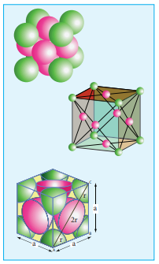

In a face centered cubic unit cell, identical atoms lie at each corner as well as in the centre of each face. Those atoms in the corners touch those in the faces but not each other. The atoms in the face centre is being shared by two unit cells, each atom in the face centers makes \(\left(\frac{1}{2}\right)\) contribution to the unit cell.

Number of atoms in a fcc unit cell

$$
= \left(\frac{N_c}{8}\right) + \left(\frac{N_f}{2}\right) = \left(\frac{8}{8} + \frac{6}{2}\right) = (1 + 3) = 4
$$

Drawing the crystal lattice on paper is not an easy task. The constituents in a unit cell touch each other and form a three dimensional network. This can be simplified by drawing crystal structure with the help of small circles (spheres) corresponding constituent particles and connecting neighbouring particles using a straight line as shown in the figure.

#### 6.5.4 Calculations involving unit cell dimensions:

X-Ray diffraction analysis is the most powerful tool for the determination of crystal structure. The inter planar distance (d) between two successive planes of atoms can be calculated using the following equation form the X-Ray diffraction data

$$
2d \sin \theta = n\lambda
$$

The above equation is known as Bragg's equation.

Where

\(\lambda\) is the wavelength of X-ray used for diffraction.

\(\theta\) is the angle of diffraction

\(n\) is the order of diffraction

By knowing the values of \(\theta, \lambda\) and \(n\) we can calculate the value of d.

$$
d = \frac{n\lambda}{2\sin\theta}
$$

Using these values the edge length of the unit cell can be calculated.

#### 6.5.5 Calculation of density:

Using the edge length of a unit cell, we can calculate the density \((\rho)\) of the crystal by considering a cubic unit cell as follows.

$$
\text{Density of the unit cell } \rho = \frac{\text{mass of the unit cell}}{\text{volume of the unit cell}}
$$

$$
\text{mass of the unit cell} = \left( \text{total number of atoms belongs to that unit cell} \right) \times \left( \text{mass of one atom} \right)
$$

$$
\text{mass of one atom} = \frac{\text{molar mass } (M \ g \ mol^{-1})}{\text{Avogadro number } (N_A \ mol^{-1})} = \frac{M}{N_A}
$$

Substitute (3) in (2)

$$
\text{mass of the unit cell} = n \times \frac{M}{N_A}
$$

For a cubic unit cell, all the edge lengths are equal i.e, \(a = b = c\)

$$
\text{volume of the unit cell} = a \times a \times a = a^3
$$

$$
\therefore \text{Density of the unit cell } \rho = \frac{nM}{a^3 N_A}
$$

Equation (6) contains four variables namely \(\rho\), \(n\), \(M\) and \(a\). If any three variables are known, the fourth one can be calculated.

**Example 1**

Barium has a body centered cubic unit cell with a length of 508 pm along an edge. What is the density of barium in \(g \ cm^{-3}\)?

**Solution:**

$$
\rho = \frac{nM}{a^3 N_A}
$$

In this case,
\(n = 2\); \(M = 137.3 \ g \ mol^{-1}\); \(a = 508 \ pm = 5.08 \times 10^{-8} \ cm\)

$$
\rho = \frac{2 \text{ atoms} \times 137.3 \ g \ mol^{-1}}{(5.08 \times 10^{-8} \ cm)^3 \times 6.023 \times 10^{23} \ atoms \ mol^{-1}}
$$

$$
= \frac{2 \times 137.3}{(5.08)^3 \times 10^{-24} \times 6.023 \times 10^{23}} \ g \ cm^{-3}
$$

$$
= 3.5 \ g \ cm^{-3}
$$

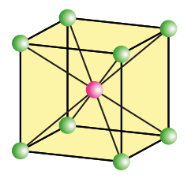

## Evaluate yourself

1. An element has a face centered cubic unit cell with a length of \(352.4 \ pm\) along an edge. The density of the element is \(8.9 \ g \ cm^{-3}\). How many atoms are present in \(100 \ g\) of an element?
2. Determine the density of CsCl which crystallizes in a bcc type structure with an edge length \(412.1 \ pm\).
3. A face centered cubic solid of an element (atomic mass 60) has a cube edge of \(4 \ \text{Å}\). Calculate its density.

### 6.6 Packing in crystals:

Let us consider the packing of fruits for display in fruit stalls. They are in a closest packed arrangement as shown in the following fig. we can extend this analogy to visualize the packing of constituents (atoms / ions / molecules) in crystals, by treating them as hard spheres. To maximize the attractive forces between the constituents, they generally tend to pack together as close as possible to each other. In this portion we discuss how to pack identical spheres to create cubic and hexagonal unit cell. Before moving on to these three dimensional arrangements, let us first consider the two dimensional arrangement of spheres for better understanding.

#### 6.6.1 Linear arrangement of spheres in one direction:

In a specific direction, there is only one possibility to arrange the spheres in one direction as shown in the fig. in this arrangement each sphere is in contact with two neighbouring spheres on either side.

#### 6.6.2 Two dimensional close packing:

Two dimensional planar packing can be done in the following two different ways.

#### (i) AAA... type:

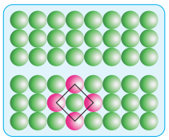

Linear arrangement of spheres in one direction is repeated in two dimension i.e., more number of rows can be generated identical to the one dimensional arrangement such that all spheres of different rows align vertically as well as horizontally as shown in the fig. If we denote the first row as A type arrangement, then the above mentioned packing is called AAA type, because all rows are identical as the first one. In this arrangement each sphere is in contact with four of its neighbours.

#### (ii) ABAB.. Type:

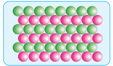

In this type, the second row spheres are arranged in such a way that they fit in the depression of the first row as shown in the figure. The second row is denoted as B type. The third row is arranged similar to the first row A, and the fourth one is arranged similar to second one. i.e., the pattern is repeated as ABAB.... In this arrangement each sphere is in contact with 6 of its neighbouring spheres.

On comparing these two arrangements (AAAA...type and ABAB...type) we found that the closest arrangement is ABAB...type.

#### 6.6.3 Simple cubic arrangement:

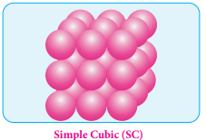

This type of three dimensional packing arrangements can be obtained by repeating the AAAA type two dimensional arrangements in three dimensions. i.e., spheres in one layer sitting directly on the top of those in the previous layer so that all layers are identical. All spheres of different layers of crystal are perfectly aligned horizontally and also vertically, so that any unit cell of such arrangement as simple cubic structure as shown in fig.

In simple cubic packing, each sphere is in contact with 6 neighbouring spheres - Four in its own layer, one above and one below and hence the coordination number of the sphere in simple cubic arrangement is 6.

**Packing efficiency:**

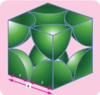

There is some free space between the spheres of a single layer and the spheres of successive layers. The percentage of total volume occupied by these constituent spheres gives the packing efficiency of an arrangement. Let us calculate the packing efficiency in simple cubic arrangement,

$$
\text{Packing fraction} = \frac{\text{Total volume occupied by spheres in a unit cell}}{\text{Volume of the unit cell}} \times 100
$$

Let us consider a cube with an edge length \(a\) as shown in fig. Volume of the cube with edge length a is \(= a \times a \times a = a^3\)

Let \(r\) be the radius of the sphere. From the figure, \(a = 2r \Rightarrow r = \frac{a}{2}\)

Volume of the sphere with radius \(r\)

$$
= \frac{4}{3}\pi r^3 = \frac{4}{3}\pi \left(\frac{a}{2}\right)^3 = \frac{4}{3}\pi \left(\frac{a^3}{8}\right) = \frac{\pi a^3}{6}
$$

In a simple cubic arrangement, number of spheres belongs to a unit cell is equal to one.

Total volume occupied by the spheres in sc unit cell

$$
\text{Packing fraction} = \frac{\left(\frac{\pi a^3}{6}\right)}{(a^3)} \times 100 = \frac{100\pi}{6} = 52.38\%
$$

i.e., only \(52.38\%\) of the available volume is occupied by the spheres in simple cubic packing, making inefficient use of available space and hence minimizing the attractive forces.

**More to know:** Of all the metals in the periodic table, only polonium crystallizes in simple cubic pattern.

#### 6.6.4 Body centered cubic arrangement

In this arrangement, the spheres in the first layer (A type) are slightly separated and the second layer is formed by arranging the spheres in the depressions between the spheres in layer A as shown in figure. The third layer is a repeat of the first. This pattern ABABAB is repeated throughout the crystal. In this arrangement, each sphere has a coordination number of 8, four neighbors in the layer above and four in the layer below.

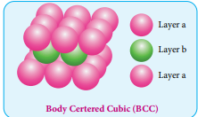

**Packing efficiency:**

Here, the spheres are touching along the leading diagonal of the cube as shown in the fig.

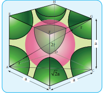

In \(\triangle ABC\)

$$
AC^2 = AB^2 + BC^2
$$

$$
AC = \sqrt{AB^2 + BC^2} = \sqrt{a^2 + a^2} = \sqrt{2a^2} = \sqrt{2}a
$$

In \(\triangle ACG\)

$$
AG^2 = AC^2 + CG^2
$$

$$
AG = \sqrt{AC^2 + CG^2} = \sqrt{(\sqrt{2}a)^2 + a^2} = \sqrt{2a^2 + a^2} = \sqrt{3a^2} = \sqrt{3}a
$$

i.e., \(\sqrt{3}a = 4r \Rightarrow r = \frac{\sqrt{3}}{4}a\)

Volume of the sphere with radius \(r\)

$$
= \frac{4}{3}\pi r^3 = \frac{4}{3}\pi \left(\frac{\sqrt{3}}{4}a\right)^3 = \frac{\sqrt{3}}{16}\pi a^3
$$

Number of spheres belong to a unit cell in bcc arrangement is equal to two and hence the total volume of all spheres

$$
= 2 \times \left(\frac{\sqrt{3}\pi a^3}{16}\right) = \frac{\sqrt{3}\pi a^3}{8}
$$

$$
\text{Packing fraction} = \frac{\left(\frac{\sqrt{3}\pi a^3}{8}\right) \times 100}{(a^3)} = \frac{\sqrt{3}\pi}{8} \times 100
$$

$$
= \sqrt{3}\pi \times 12.5 = 1.732 \times 3.14 \times 12.5 = 68\%
$$

i.e., \(68\%\) of the available volume is occupied. The available space is used more efficiently than in simple cubic packing.

#### 6.6.5 The hexagonal and face centered cubic arrangement:

**Formation of first layer:**

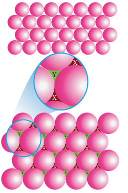

In this arrangement, the first layer is formed by arranging the spheres as in the case of two dimensional ABAB arrangements i.e. the spheres of second row fit into the depression of first row. Now designate this first layer as a. The next layer is formed by placing the spheres in the depressions of the first layer. Let the second layer be b.

**Formation of second layer:**

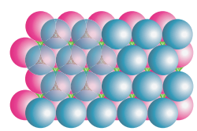

In the first layer a there are two types of voids (or holes) and they are designated as \(x\) and \(y\). The second layer (b) can be formed by placing the spheres either on the depression (voids/holes) \(x\) or on \(y\). let us consider the formation of second layer by placing the spheres on the depression (\(x\)).

Wherever a sphere of second layer (b) is above the void (\(x\)) of the first layer (a), a tetrahedral void is formed. This constitutes four spheres - three in the lower (a) and one in the upper layer (b). When the centers of these four spheres are joined, a tetrahedron is formed.

At the same time, the voids (\(y\)) in the first layer (a) are partially covered by the spheres of layer (b), now such a void in (a) is called a octahedral void. This constitutes six spheres - three in the lower layer (a) and three in the upper layer (b). When the centers of these six spheres are joined, an octahedron is formed. Simultaneously new tetrahedral voids (or holes) are also created by three spheres in second layer (b) and one sphere of first layer (a).

The number of voids depends on the number of close packed spheres. If the number of close packed spheres be \(n\) then, the number of octahedral voids generated is equal to \(n\) and the number of tetrahedral voids generated is equal to \(2n\).

**Formation of third layer:**

The third layer of spheres can be formed in two ways to achieve closest packing

(i) aba arrangement - hcp structure

(ii) abc arrangement - ccp structure

The spheres can be arranged so as to fit into the depression in such a way that the third layer is directly over a first layer as shown in the figure. This "aba" arrangement is known as the hexagonal close packed (hcp) arrangement. In this arrangement, the tetrahedral voids of the second layer are covered by the spheres of the third layer.

Alternatively, the third layer may be placed over the second layer in such a way that all the spheres of the third layer fit in octahedral voids. This arrangement of the third layer is different from other two layers (a) and (b), and hence, the third layer is designated (c). If the stacking of layers is continued in abacabac... pattern, then the arrangement is called cubic close packed (ccp) structure.

In both hcp and ccp arrangements, the coordination number of each sphere is 12 - six neighbouring spheres in its own layer, three spheres in the layer above and three sphere in the layer below. This is the most efficient packing.

The cubic close packing is based on the face centered cubic unit cell. Let us calculate the packing efficiency in fcc unit cell.

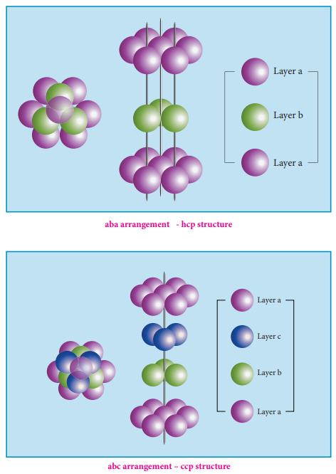

From the figure \(AC = 4r\)

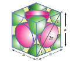

$$
4r = a\sqrt{2} \Rightarrow r = \frac{a\sqrt{2}}{4}
$$

In \( \Delta ABC \)

$$
AC^2 = AB^2 + BC^2
$$

$$
AC = \sqrt{AB^2 + BC^2}
$$

$$
AC = \sqrt{a^2 + a^2} = \sqrt{2a^2} = \sqrt{2} \, a
$$

Volume of the sphere with radius \( r \) is

$$
= \frac{4}{3} \pi \left( \frac{\sqrt{2}a}{4} \right)^3
$$

$$
= \frac{4}{3} \pi \left( \frac{2\sqrt{2}a^3}{64} \right)
$$

$$
= \frac{\sqrt{2} \pi a^3}{24}
$$

Total number of spheres belongs to a single fcc unit cell is 4

\[
\therefore \text{the volume of all spheres in a fcc unit cell}
\]

$$
= 4 \times \left( \frac{\sqrt{2} \pi a^3}{24} \right)
$$

$$
= \frac{\sqrt{2} \pi a^3}{6}
$$

packing efficiency =

$$
\frac{\sqrt{2} \pi}{6} \times 100
$$

$$
= \frac{\sqrt{2} \pi}{6} \times 100
$$

$$
= 74\%
$$

### Radius ratio:

The structure of an ionic compound depends upon the stoichiometry and the size of the ions. generally in ionic crystals the bigger anions are present in the close packed arrangements and the cations occupy the voids. The ratio of radius of cation and anion \(\left(\frac{r_{C^+}}{r_{A^-}}\right)\) plays an important role in determining the structure. The following table shows the relation between the radius ratio and the structural arrangement in ionic solids.

| \(\frac{r_{C^+}}{r_{A^-}}\) | Coordination number | Structure | Example |
|---|---|---|---|
| 0.155 – 0.225 | 3 | Trigonal planar | \(B_2O_3\) |
| 0.225 – 0.414 | 4 | Tetrahedral | ZnS |
| 0.414 – 0.732 | 6 | Octahedral | NaCl |
| 0.732 – 1 | 8 | Cubic | CsCl |

**Table 6.3 Radius ratio**

### 6.7 Imperfection in solids:

According to the law of nature nothing is perfect, and so crystals need not be perfect. They always found to have some defects in the arrangement of their constituent particles. These defects affect the physical and chemical properties of the solid and also play an important role in various processes. For example, a process called doping leads to a crystal imperfection and it increases the electrical conductivity of a semiconductor material such
as silicon. The ability of ferromagnetic material such as iron, nickel etc., to be magnetized
and demagnetized depends on the presence of imperfections. Crystal defects are classified
as follows 

1) Point defects
2) Line defects
3) Interstitial defects
4) Volume defects

In this portion, we concentrate on point defects, more specifically in ionic solids. Point defects are further classified as follows.

### Stoichiometric defects in ionic solid:

This defect is also called intrinsic (or) thermodynamic defect. In stoichiometric ionic crystals, a vacancy of one ion must always be associated with either by the absence of another oppositely charged ion (or) the presence of same charged ion in the interstitial position so as to maintain the electrical neutrality.

#### 6.7.1 Schottky defect:

Schottky defect arises due to the missing of equal number of cations and anions from the crystal lattice. This effect does not change the stoichiometry of the crystal. Ionic solids in which the cation and anion are of almost of similar size show Schottky defect. Example: NaCl.

Presence of large number of Schottky defects in a crystal, lowers its density. For example, the theoretical density of vanadium monoxide (VO) calculated
using the edge length of the unit cell is 6.5 g cm-3, but the actual experimental density
is 5.6 g cm-3. It indicates that there is approximately 14% Schottky defect in VO crystal.
Presence of Schottky defect in the crystal provides a simple way by which atoms or ions
can move within the crystal lattice.

#### 6.7.2 Frenkel defect:

Frenkel defect arises due to the dislocation of ions from its crystal lattice. The ion which is missing from the lattice point occupies an interstitial position. This defect is shown by ionic solids in which cation and anion differ in size. Unlike Schottky defect, this defect does not affect the density of the crystal. For example \(AgBr\), in this case, small \(Ag^{+}\) ion leaves its normal site and occupies an interstitial position as shown in the figure.

#### 6.7.3 Metal excess defect:

Metal excess defect arises due to the presence of more number of metal ions as compared to anions. Alkali metal halides NaCl, KCl show this type of defect. The electrical neutrality of the crystal can be maintained by the presence of anionic vacancies equal to the excess metal ions (or) by the presence of extra cation and electron present in interstitial position.

For example, when NaCl crystals are heated in the presence of sodium vapour, \(Na^{+}\) ions are formed and are deposited on the surface of the crystal. Chloride ions (Cl) diffuse to the surface from the lattice point and combines with \(Na^{+}\) ion. The electron lost by the sodium vapour diffuse into the crystal lattice and occupies the vacancy created by the Cl ions. Such anionic vacancies which are occupied by unpaired electrons are called F centers. Hence, the formula of NaCl which contains excess \(Na^{+}\) ions can be written as \(Na_{1+x}Cl\).

\(ZnO\) is colourless at room temperature. When it is heated, it becomes yellow in colour. On heating, it loses oxygen and thereby forming free \(Zn^{2+}\) ions. The excess \(Zn^{2+}\) ions move to interstitial sites and the electrons also occupy the interstitial positions.

#### 6.7.4 Metal deficiency defect:

Metal deficiency defect arises due to the presence of less number of cations than the anions. This defect is observed in a crystal in which, the cations have variable oxidation states.

For example, in FeO crystal, some of the \(Fe^{2+}\) ions are missing from the crystal lattice. To maintain the electrical neutrality, twice the number of other \(Fe^{2+}\) ions in the crystal is oxidized to \(Fe^{3+}\) ions. In such cases, overall number of \(Fe^{2+}\) and \(Fe^{3+}\) ions is less than the \(O^{2-}\) ions. It was experimentally found that the general formula of ferrous oxide is \(Fe_xO_y\) where \(x\) ranges from 0.93 to 0.98.

#### 6.7.5 Impurity defect:

A general method of introducing defects in ionic solids is by adding impurity ions. If the impurity ions are in different valance state from that of host, vacancies are created in the crystal lattice of the host. For example, addition of \(CdCl_2\) to \(AgCl\) yields solid solutions where the divalent cation \(Cd^{2+}\) occupies the position of \(Ag^{+}\). This will disturb the electrical neutrality of the crystal. In order to maintain the same, proportional number of \(Ag^{+}\) ions leaves the lattice. This produces a cation vacancy in the lattice, such kind of crystal defects are called impurity defects.

**Do You Know**
#### Energy harvesting by piezoelectric crystals:

Piezoelectricity (also called the piezoelectric effect) is the appearance of an electrical potential across the sides of a crystal when you subject it to mechanical stress. The word piezoelectricity means electricity resulting from pressure and latent heat. Even the inverse is possible which is known as inverse piezoelectric effect.

If you can make a little amount of electricity by pressing one piezoelectric crystal once, could you make a significant amount by pressing many crystals over and over again? What happens if we bury piezoelectric crystals under streets to capture energy as vehicles pass by?

This idea, known as energy harvesting, has caught many people's interest. Even though there are limitations for the large-scale applications, you can produce electricity that is enough to charge your mobile phones by just walking. There are power generating footwears that has a slip-on insole with piezoelectric crystals that can produce enough electricity to charge batteries/ USB devices.

## Summary

Solids have definite volume and shape.

Solids can be classified into the following two major types based on the arrangement of their constituents. (i) Crystalline solids (ii) Amorphous solids.

A crystalline solid is one in which its constituents (atoms, ions or molecules), have an orderly arrangement extending over a long range.

In contrast, in amorphous solids (In Greek, amorphous means no form) the constituents are randomly arranged.

Crystalline solid is characterised by a definite orientation of atoms, ions or molecules, relative to one another in a three dimensional pattern. The regular arrangement of these species throughout the crystal is called a crystal lattice.

A crystal may be considered to consist of large number of unit cells, each one in direct contact with its nearer neighbour and all similarly oriented in space.

A unit cell is characterised by the three edge lengths or lattice constants a, b and c and the angle between the edges \(\alpha\), \(\beta\) and \(\gamma\).

There are seven primitive crystal systems; cubic, tetragonal, orthorhombic, hexagonal, monoclinic, triclinic and rhombohedral. They differ in the arrangement of their crystallographic axes and angles. Corresponding to the above seven, Bravais defined 14 possible crystal systems.

In the simple cubic unit cell, each corner is occupied by an identical atoms or ions or molecules. And they touch along the edges of the cube, do not touch diagonally. The coordination number of each atom is 6.

In a body centered cubic unit cell, each corner is occupied by an identical particle and in addition to that one atom occupies the body centre. Those atoms which occupy the corners do not touch each other, however they all touch the one that occupies the body centre. Hence, each atom is surrounded by eight nearest neighbours and coordination number is 8.

In a face centered cubic unit cell, identical atoms lie at each corner as well as in the centre of each face. Those atoms in the corners touch those in the faces but not each other. The coordination number is 12.

X-Ray diffraction analysis is the most powerful tool for the determination of crystal structure. The inter planar distance (d) between two successive planes of atoms can be calculated using the following equation form the X-Ray diffraction data \(2d\sin \theta = n\lambda\). The structure of an ionic compound depends upon the stoichiometry and the size of the ions. generally in ionic crystals the bigger anions are present in the close packed arrangements and the cations occupy the voids. The ratio of radius of cation and anion \(\left(\frac{r_{C^+}}{r_{A^-}}\right)\) plays an important role in determining the structure. Crystals always found to have some defects in the arrangement of their constituent particles. Schottky defect arises due to the missing of equal number of cations and anions from the crystal lattice. Frenkel defect arises due to the dislocation of ions from its crystal lattice. The ion which is missing from the lattice point occupies an interstitial position. Metal excess defect arises due to the presence of more number of metal ions as compared to anions. Metal deficiency defect arises due to the presence of less number of cations than the anions.
