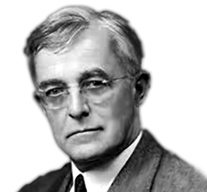

# 10. SURFACE CHEMISTRY

**Irving Langmuir**

Irving Langmuir was an American Chemist and Physicist. He was awarded Nobel Prize in the year 1932 in Chemistry for his works in Surface Chemistry. He outlined the concentric theory of atomic structure. He invented the gas filled incandescent lamp and hydrogen welding technique. The Langmuir Laboratory for Atmospheric Research near Socorro, New Mexico was named in his honor. Langmuir and Tonks discovered electron density waves in plasmas that are now known as Langmuir waves.

**Learning Objectives**

After studying this unit the student will be able to

■ classify adsorption.

■ distinguish between absorption and adsorption

■ explain Freundlich adsorption isotherm

■ understand catalysis and the characteristics of catalysts.

■ explain the theories of catalysis and enzyme catalysis.

■ classify colloids.

■ explain the methods of preparation and purification of colloids.

■ discuss the properties of colloidal solution.

■ explain the role of colloids and emulsions in daily life.

## INTRODUCTION

Surface chemistry is the branch of chemistry that deals with the processes occurring at interfaces between phases for example, solid and liquid, solid and gas and liquid and liquid. This topic is of immense importance to our everyday life and to numerous industries, from materials and paints to medicine and biotechnology. Surfaces play a key role in heterogeneous catalysis, formation and stability of colloids and electrode reactions. Surfaces of solids are inherently different from their bulk portion. The bonding between the atoms at the mere surface is different from that in the bulk. Hydrogen that exists in the interstellar space are formed on the surfaces of grains and dust particles. Mosquitoes and other small insects can walk on the surface of water but they will drown into the water when soaps are added in the neighbourhood. We are fascinated by the spherical shape of water droplets and mercury droplets. We are also impressed by the non-sticky wings of butterfly and leaves of plants. Blue colour of the sky and red colour of the sunset strongly attract us. In all the above only the surface of matter is important. Many of creams, lotions and other personal care products are complex emulsions. Food companies are interested in developing healthy, tasty and longlasting food products. All these are based on the principles of colloids and surface chemistry. So, surface Chemistry is an exciting topic to learn.

